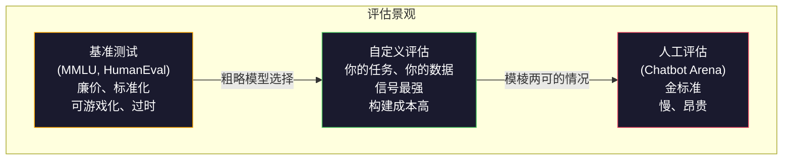
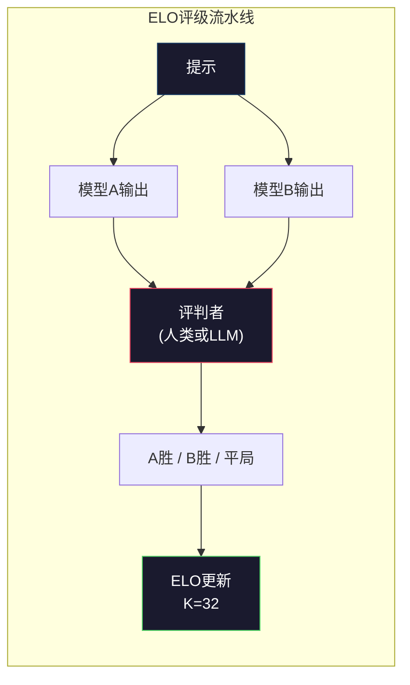

# 评估：基准测试（Benchmarks）、自定义评估（Evals）、LM测试框架（LM Harness）

> 古德哈特定律：当一项指标成为目标时，它就不再是一个好的指标。每个前沿实验室都在对基准测试做针对性优化。MMLU分数不断上升，但模型仍然无法可靠地数出"strawberry"中有几个字母R。唯一重要的评估是你自己的评估——针对你自己的任务，使用你自己的数据。

**类型：** 构建
**语言：** Python
**前置要求：** 阶段10，第01-05课（从头构建LLM）
**时长：** 约90分钟

## 学习目标

- 构建一个自定义评估框架，对语言模型运行多项选择题和开放式基准测试
- 解释为什么标准基准测试（MMLU、HumanEval）会饱和，无法区分前沿模型
- 使用适当的指标（精确匹配（Exact Match）、F1分数、BLEU、LLM-as-Judge评分）实现任务特定评估
- 设计面向特定用例的自定义评估套件，而非仅依赖公开排行榜

## 问题

MMLU于2020年发布，包含57个学科的15,908道题目。三年内，前沿模型使之饱和。GPT-4得分86.4%。Claude 3 Opus得分86.8%。Llama 3 405B得分88.6%。排行榜收敛到3个百分点的区间内，差异只是统计噪声，而非真实能力差距。

与此同时，这些模型在10岁孩子不假思索就能完成的任务上却失败了。Claude 3.5 Sonnet在MMLU上得分为88.7%，最初却无法数出"strawberry"中的字母数量——这个任务不需要任何世界知识，也不需要任何推理，只需要逐字符迭代。HumanEval用164个问题测试代码生成。模型得分超过90%，但生成的代码仍然会在任何初级开发人员都能捕获的边界情况上崩溃。

基准测试性能与真实世界可靠性之间的差距，是LLM评估的核心问题。基准测试告诉你模型在基准测试上的表现。它几乎无法告诉你该模型在你的特定任务、你的特定数据、你的特定失败模式下会如何表现。如果你正在构建一个客户支持机器人，MMLU无关紧要。如果你正在构建一个代码助手，HumanEval只覆盖函数级生成——它对于跨文件的调试、重构或解释代码毫无意义。

你需要自定义评估。这并非因为基准测试无用——它们对于粗略的模型选择是有用的——而是因为最终的评估必须精确匹配你的部署条件。

## 概念

### 评估景观

评估分为三大类，每种具有不同的成本和信号质量。

**基准测试（Benchmarks）** 是标准化的测试套件。MMLU、HumanEval、SWE-bench、MATH、ARC、HellaSwag。你对模型运行基准测试并得到分数。优点：每个人都使用相同的测试，因此可以比较模型。缺点：模型和训练数据越来越多地污染这些基准测试。实验室在包含基准测试问题的数据上训练。分数上升，能力却可能没有。

**自定义评估（Custom Evals）** 是你为特定用例构建的测试套件。你定义输入、预期输出和评分函数。法律文档摘要模型在法律文档上进行评估。SQL生成器在你的数据库模式上进行评估。构建这些评估成本高昂，但它们是唯一能够预测生产性能的评估。

**人工评估（Human Evals）** 使用付费标注员根据帮助性、正确性、流畅性和安全性等标准判断模型输出。这是自动评分失败的开放式任务的金标准。Chatbot Arena已收集了100多个模型超过200万次的人类偏好投票。缺点：成本（每次判断$0.10-$2.00）和速度（几个小时到几天）。



### 基准测试为何失效

三种机制导致基准测试分数不再反映真实能力。

**数据污染（Data contamination）。** 训练语料从互联网抓取。基准测试问题存在于互联网上。模型在训练期间看到了答案。这并非传统意义上的作弊——实验室并非故意包含基准测试数据。但网络规模的抓取几乎不可能排除。

**应试教学（Teaching to the test）。** 实验室针对基准测试性能优化训练混合比。如果训练混合中有5%是MMLU风格的多项选择题，模型就会学习格式和答案分布。MMLU是4选1多项选择。模型学会答案大致均匀分布在A/B/C/D上，即使模型不知道答案，这也有帮助。

**饱和（Saturation）。** 当每个前沿模型在基准测试上都得分85-90%时，该基准测试就失去了区分能力。剩余10-15%的问题可能模棱两可、标签错误或需要晦涩的领域知识。从MMLU的87%提升到89%可能只是模型多记住了两个冷门问题，而不是变得更聪明。

### 困惑度（Perplexity）：快速健康检查

困惑度衡量模型对一个标记序列的惊讶程度。正式定义为指数化的平均负对数似然：

```
PPL = exp(-1/N * sum(log P(token_i | context)))
```

困惑度为10意味着模型平均在每个标记位置像在10个选项中均匀选择一样不确定。越低越好。GPT-2在WikiText-103上的困惑度约为30。GPT-3约为20。Llama 3 8B约为7。

困惑度对于在相同测试集上比较模型很有用，但它有盲点。一个模型可以通过擅长预测常见模式而获得较低的困惑度，同时却极不擅长预测罕见但重要的模式。此外，它对于指令遵循、推理或事实准确性毫无意义。将其用作健康检查，而非最终结论。

### LLM-as-Judge（LLM作为评判者）

使用强模型评估弱模型的输出。想法很简单：让GPT-4o或Claude Sonnet从1到5分对回答的正确性、帮助性和安全性进行评分。使用GPT-4o-mini每次判断约需$0.01，且与人类判断的相关性出奇地高——在大多数任务上约为80%。

评分提示比模型本身更重要。模糊的提示（"评分该回答"）会产生嘈杂的分数。结构化的带评分标准的提示（"如果回答事实正确且引用了来源得5分，正确但未引用来源得4分，部分正确得3分..."）会产生一致且可再现的分数。

失败模式：评判模型存在位置偏差（成对比较中偏好第一个回答）、冗长偏差（偏好更长的回答）和自我偏好（GPT-4对GPT-4输出的评分高于对等效Claude输出的评分）。缓解措施：随机化顺序、对长度进行归一化、使用与被评估模型不同的评判模型。

### 来自成对比较的ELO评级（ELO Ratings）

Chatbot Arena的方法。对同一提示显示来自不同模型的两个回答。人类（或LLM评判者）选择更好的一个。通过数千次这样的比较，为每个模型计算ELO评级——与国际象棋中使用的同一系统。

ELO优势：相对排名比绝对评分更可靠，优雅地处理平局，并且与独立评分每个输出相比，收敛所需的比较次数更少。截至2026年初，Chatbot Arena排名显示GPT-4o、Claude 3.5 Sonnet和Gemini 1.5 Pro在顶部彼此相差20个ELO点以内。



### 评估框架

**lm-evaluation-harness**（EleutherAI）：标准的开源评估框架。支持200多个基准测试。一条命令即可对任何Hugging Face模型运行MMLU、HellaSwag、ARC等。被Open LLM排行榜使用。

**RAGAS**：专门用于RAG流水线的评估框架。测量忠实度（回答是否与检索到的上下文匹配？）、相关性（检索到的上下文是否与问题相关？）和回答正确性。

**promptfoo**：用于提示工程的配置驱动评估。在YAML中定义测试用例，对多个模型运行，获得通过/失败报告。对于回归测试提示很有用——确保提示变更不会破坏现有测试用例。

### 构建自定义评估

生产环境中唯一重要的评估。流程：

1. **定义任务。** 模型到底应该做什么？要精确。"回答问题"太模糊。"给定客户投诉邮件，提取产品名称、问题类别和情感倾向"是一个可以评估的任务。

2. **创建测试用例。** 原型评估至少50个，生产环境200个以上。每个测试用例是一个（输入，预期输出）对。包括边缘情况：空输入、对抗性输入、模棱两可的输入、其他语言的输入。

3. **定义评分。** 结构化输出用精确匹配（Exact Match）。文本相似度用BLEU/ROUGE。开放式质量用LLM-as-Judge。提取任务用F1。结合多个指标并赋予权重。

4. **自动化。** 每个评估一条命令完成。没有手动步骤。以允许随时间比较的格式存储结果。

5. **跟踪时间变化。** 孤立地看评估分数没有意义。你需要趋势线。上次提示变更后分数是否提高了？切换模型后是否退步了？将评估与提示一起进行版本管理。

| 评估类型 | 每次判断成本 | 与人类一致性 | 最佳用途 |
|-----------|------------------|----------------------|----------|
| 精确匹配（Exact match） | ~$0 | 100%（适用时） | 结构化输出、分类 |
| BLEU/ROUGE | ~$0 | ~60% | 翻译、摘要 |
| LLM-as-Judge | ~$0.01 | ~80% | 开放式生成 |
| 人工评估（Human eval） | $0.10-$2.00 | 无（是真实值） | 模棱两可、高风险的场景 |

## 构建

### 步骤 1：最小评估框架

定义核心抽象。一个评估用例包含一个输入、一个预期输出和一个可选的元数据字典。评分器接收预测值和参考值，返回0到1之间的分数。

```python
import json
from collections import Counter

class EvalCase:
    def __init__(self, input_text, expected, metadata=None):
        self.input_text = input_text
        self.expected = expected
        self.metadata = metadata or {}

class EvalSuite:
    def __init__(self, name, cases, scorers):
        self.name = name
        self.cases = cases
        self.scorers = scorers

    def run(self, model_fn):
        results = []
        for case in self.cases:
            prediction = model_fn(case.input_text)
            scores = {}
            for scorer_name, scorer_fn in self.scorers.items():
                scores[scorer_name] = scorer_fn(prediction, case.expected)
            results.append({
                "input": case.input_text,
                "expected": case.expected,
                "prediction": prediction,
                "scores": scores,
            })
        return results
```

### 步骤 2：评分函数

构建精确匹配（Exact Match）、标记F1（Token F1）和模拟的LLM-as-Judge评分器。

```python
def exact_match(prediction, expected):
    return 1.0 if prediction.strip().lower() == expected.strip().lower() else 0.0

def token_f1(prediction, expected):
    pred_tokens = set(prediction.lower().split())
    exp_tokens = set(expected.lower().split())
    if not pred_tokens or not exp_tokens:
        return 0.0
    common = pred_tokens & exp_tokens
    precision = len(common) / len(pred_tokens)
    recall = len(common) / len(exp_tokens)
    if precision + recall == 0:
        return 0.0
    return 2 * (precision * recall) / (precision + recall)

def llm_judge_simulated(prediction, expected):
    pred_words = set(prediction.lower().split())
    exp_words = set(expected.lower().split())
    if not exp_words:
        return 0.0
    overlap = len(pred_words & exp_words) / len(exp_words)
    length_penalty = min(1.0, len(prediction) / max(len(expected), 1))
    return round(overlap * 0.7 + length_penalty * 0.3, 3)
```

### 步骤 3：ELO评级系统

实现带有ELO更新的成对比较。这正是Chatbot Arena用于模型排名的系统。

```python
class ELOTracker:
    def __init__(self, k=32, initial_rating=1500):
        self.ratings = {}
        self.k = k
        self.initial_rating = initial_rating
        self.history = []

    def _ensure_player(self, name):
        if name not in self.ratings:
            self.ratings[name] = self.initial_rating

    def expected_score(self, rating_a, rating_b):
        return 1 / (1 + 10 ** ((rating_b - rating_a) / 400))

    def record_match(self, player_a, player_b, outcome):
        self._ensure_player(player_a)
        self._ensure_player(player_b)

        ea = self.expected_score(self.ratings[player_a], self.ratings[player_b])
        eb = 1 - ea

        if outcome == "a":
            sa, sb = 1.0, 0.0
        elif outcome == "b":
            sa, sb = 0.0, 1.0
        else:
            sa, sb = 0.5, 0.5

        self.ratings[player_a] += self.k * (sa - ea)
        self.ratings[player_b] += self.k * (sb - eb)

        self.history.append({
            "a": player_a, "b": player_b,
            "outcome": outcome,
            "rating_a": round(self.ratings[player_a], 1),
            "rating_b": round(self.ratings[player_b], 1),
        })

    def leaderboard(self):
        return sorted(self.ratings.items(), key=lambda x: -x[1])
```

### 步骤 4：困惑度计算

使用标记概率计算困惑度。实践中你会从模型的logits中获取这些概率。这里我们用概率分布进行模拟。

```python
import numpy as np

def perplexity(log_probs):
    if not log_probs:
        return float("inf")
    avg_neg_log_prob = -np.mean(log_probs)
    return float(np.exp(avg_neg_log_prob))

def token_log_probs_simulated(text, model_quality=0.8):
    np.random.seed(hash(text) % 2**31)
    tokens = text.split()
    log_probs = []
    for i, token in enumerate(tokens):
        base_prob = model_quality
        if len(token) > 8:
            base_prob *= 0.6
        if i == 0:
            base_prob *= 0.7
        prob = np.clip(base_prob + np.random.normal(0, 0.1), 0.01, 0.99)
        log_probs.append(float(np.log(prob)))
    return log_probs
```

### 步骤 5：汇总结果

计算评估运行的汇总统计：均值、中位数、阈值通过率以及每个指标的细分。

```python
def summarize_results(results, threshold=0.8):
    all_scores = {}
    for r in results:
        for metric, score in r["scores"].items():
            all_scores.setdefault(metric, []).append(score)

    summary = {}
    for metric, scores in all_scores.items():
        arr = np.array(scores)
        summary[metric] = {
            "mean": round(float(np.mean(arr)), 3),
            "median": round(float(np.median(arr)), 3),
            "std": round(float(np.std(arr)), 3),
            "min": round(float(np.min(arr)), 3),
            "max": round(float(np.max(arr)), 3),
            "pass_rate": round(float(np.mean(arr >= threshold)), 3),
            "n": len(scores),
        }
    return summary

