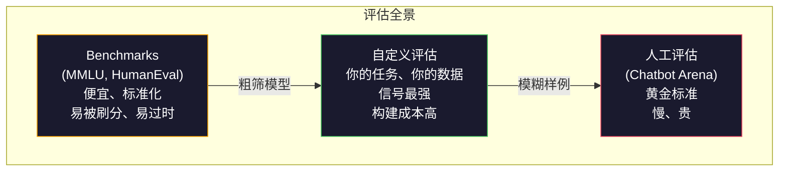
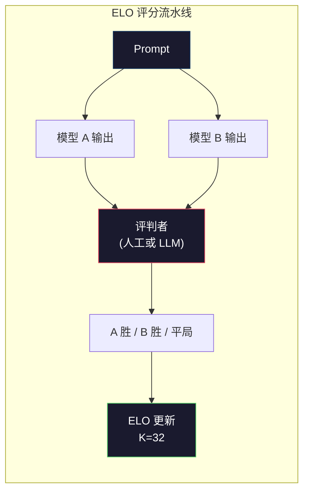

# 评估：基准、Evals 与 LM Harness

> 译注：本文译自同目录 [`en.md`](./en.md)。术语遵循仓根 [TRANSLATION_GUIDE.md](../../../../TRANSLATION_GUIDE.md)。

> 古德哈特定律（Goodhart's Law）：当一个度量本身变成了目标，它就不再是个好度量。每一家前沿实验室都在刷榜（gaming benchmarks）。MMLU 分数一路走高，模型却仍旧数不清 "strawberry" 里有几个 R。唯一重要的 eval，是**你**的 eval —— 跑在**你**的任务上、**你**的数据上。

**Type:** Build
**Languages:** Python
**Prerequisites:** Phase 10, Lessons 01-05 (LLMs from Scratch)
**Time:** ~90 minutes

## 学习目标（Learning Objectives）

- 搭一个自定义 evaluation harness，针对一个语言模型跑选择题与开放式 benchmark
- 解释为什么标准 benchmark（MMLU、HumanEval）会饱和、无法区分前沿模型
- 用合适的指标实现任务专属的 eval：exact match、F1、BLEU，以及 LLM-as-judge 评分
- 设计一套针对你具体使用场景的自定义评估套件，而不是只靠公开榜单

## 问题（The Problem）

MMLU 于 2020 年发布，包含 57 个学科共 15,908 道题。三年内，前沿模型就把它刷饱和了。GPT-4 拿到 86.4%，Claude 3 Opus 86.8%，Llama 3 405B 88.6%。整个榜单挤在 3 分的区间里，差异是统计噪声，不是真实能力差距。

与此同时，这些模型却在十岁小孩不假思索就能完成的任务上翻车。Claude 3.5 Sonnet 在 MMLU 上拿到 88.7%，最初却数不清 "strawberry" 里有几个字母 —— 这件事既不需要世界知识，也不需要推理，只是字符级别的迭代。HumanEval 用 164 道题测代码生成，模型在它上面拿 90%+，写出来的代码却仍然在任何初级开发都能想到的边界条件上崩溃。

benchmark 表现和真实世界可靠性之间的鸿沟，正是 LLM 评估（evaluation）的核心问题。benchmark 告诉你模型在 benchmark 上的表现如何，至于这个模型在**你**的具体任务、**你**的具体数据、**你**的具体失败模式下表现如何，它几乎什么也告诉不了你。如果你做的是客服机器人，MMLU 毫无意义；如果你做的是代码助手，HumanEval 只覆盖函数级生成 —— 它对调试、重构、跨文件解释代码什么都没说。

你需要自定义 eval。不是因为 benchmark 没用 —— 它对粗筛模型还是有用的 —— 而是因为最终评估必须**精确匹配**你的部署条件。

## 概念（The Concept）

### eval 全景（The Eval Landscape）

评估分三类，各自的成本和信号质量都不同。

**Benchmarks（基准测试）** 是标准化测试集合，例如 MMLU、HumanEval、SWE-bench、MATH、ARC、HellaSwag。你拿模型跑一遍，得到一个分数。优点：所有人用同一套测试，模型间能比较。缺点：模型和训练数据越来越严重地污染（contaminate）这些 benchmark。实验室训练时用了包含 benchmark 题目的数据，分数涨了，能力未必涨。

**Custom evals（自定义评估）** 是你为自己的具体场景搭的测试集合：你定义输入、期望输出和评分函数。法律文档摘要器就在法律文档上评估，SQL 生成器就在你自己的数据库 schema 上评估。这种 eval 搭建成本高，但它是唯一能预测线上表现的评估。

**Human evals（人工评估）** 用付费标注员按帮助性（helpfulness）、正确性、流畅度、安全性等标准给模型输出打分。在自动评分失效的开放式任务上，它是黄金标准。Chatbot Arena 已经收集了 100+ 个模型超过 200 万次人类偏好投票。缺点：成本（每次判断 0.10–2.00 美元）和速度（数小时到数天）。



### 为什么 benchmark 会失效（Why Benchmarks Break）

有三种机制会让 benchmark 分数不再反映真实能力。

**数据污染（Data contamination）。** 训练语料从全网抓取，benchmark 题目就生活在网上。模型在训练时见过答案。这不算传统意义上的作弊 —— 实验室并非有意把 benchmark 数据塞进去 —— 但 web 级抓取使得几乎不可能完全排除它们。

**应试训练（Teaching to the test）。** 实验室会针对 benchmark 表现优化训练数据混合比例。如果训练混合中有 5% 是 MMLU 风格的选择题，模型就会学到这种格式和答案分布。MMLU 是 4 选 1，模型会学到答案在 A/B/C/D 间近似均匀分布 —— 即使它不知道答案，也能蒙得更准。

**饱和（Saturation）。** 当所有前沿模型在某 benchmark 上都在 85–90% 时，这个 benchmark 就失去区分度了。剩下那 10–15% 的题可能是含糊不清的、标注错的，或者要求小众领域知识。MMLU 从 87% 提到 89%，可能只是模型多记住了两道偏门题，并不意味它变聪明了。

### Perplexity：一次快速体检（Perplexity: A Quick Health Check）

Perplexity 衡量模型对一段 token 序列有多"惊讶"。形式上，它是平均负对数似然取指数：

```
PPL = exp(-1/N * sum(log P(token_i | context)))
```

perplexity 是 10，意味着模型平均下来在每个 token 位置的不确定性，相当于在 10 个选项里均匀挑一个。越低越好。GPT-2 在 WikiText-103 上 perplexity 约 30，GPT-3 约 20，Llama 3 8B 约 7。

Perplexity 适合在同一个测试集上比较模型，但有盲区。一个模型可能在常见模式上预测得很好（perplexity 低），却在罕见但重要的模式上糟糕透顶。它对指令遵循、推理、事实准确度也什么都说不了。把它当 sanity check，别当最终判决。

### LLM-as-Judge

用一个强模型给弱模型的输出打分。思路很简单：让 GPT-4o 或 Claude Sonnet 按 1–5 分给一个回答打分（正确性、帮助性、安全性）。用 GPT-4o-mini 做评判每次成本约 0.01 美元，与人工判断的相关性出奇地高 —— 大多数任务上一致率约 80%。

评分提示（scoring prompt）比模型本身更重要。一个含糊的 prompt（"Rate this response"）产出噪声大的分数；一个带评分细则的结构化 prompt（"5 分：答案事实正确并引用了来源；4 分：正确但未引用；3 分：部分正确……"）产出一致、可复现的分数。

失效模式：评判模型有位置偏置（position bias，两两比较时偏好排第一个的回答）、冗长偏置（verbosity bias，偏好更长的回答）、自我偏好（self-preference，GPT-4 给 GPT-4 的输出打分会高于同等的 Claude 输出）。缓解办法：随机化顺序、按长度归一化、用与被评估模型不同的评判模型。

### 由两两比较得出的 ELO 评分（ELO Ratings from Pairwise Comparisons）

Chatbot Arena 的做法。给同一个 prompt 展示来自不同模型的两份回答，由人类（或 LLM 评判）选出更好的那个。从成千上万次这样的比较中，给每个模型算一个 ELO 评分 —— 跟国际象棋用的是同一个体系。

ELO 的好处：相对排序比绝对评分更可靠，能优雅处理平局，并且比起对每个输出独立打分，用更少比较次数就能收敛。截至 2026 年初，Chatbot Arena 榜单上 GPT-4o、Claude 3.5 Sonnet、Gemini 1.5 Pro 在榜首彼此相差不到 20 个 ELO 分。



### eval 框架（Eval Frameworks）

**lm-evaluation-harness**（EleutherAI）：标准开源 eval 框架，支持 200+ 个 benchmark。一条命令就能拿任何 Hugging Face 模型跑 MMLU、HellaSwag、ARC 等。Open LLM Leaderboard 用的就是它。

**RAGAS**：专为 RAG 流水线设计的评估框架。衡量 faithfulness（答案是否与检索到的上下文相符）、relevance（检索到的上下文是否与问题相关）、答案正确性。

**promptfoo**：面向提示工程的配置驱动 eval。在 YAML 里定义测试用例，对多个模型跑一遍，得到一份通过 / 失败报告。适合 prompt 的回归测试 —— 确保改一个 prompt 不会把已有用例搞坏。

### 搭自定义 eval（Building Custom Evals）

唯一对生产环境重要的 eval。流程：

1. **定义任务。** 模型究竟该做什么？要精确。"回答问题"太含糊，"给一封客户投诉邮件，抽取产品名、问题分类和情感"才是可评估的任务。

2. **造测试用例。** 原型 eval 至少 50 条，生产级 200+ 条。每条用例是一对 (input, expected_output)。要包含边界情况：空输入、对抗性输入、含糊输入、其他语言的输入。

3. **定义评分。** 结构化输出用 exact match；文本相似度用 BLEU/ROUGE；开放式质量用 LLM-as-judge；抽取任务用 F1。多指标加权组合。

4. **自动化。** 每次 eval 一条命令跑完，无人工步骤。结果存成便于跨时间对比的格式。

5. **跨时间追踪。** 单看一个 eval 分数毫无意义，你需要的是趋势线。上次改 prompt 之后分数涨了吗？换模型之后退化了吗？把 eval 和 prompt 一起做版本管理。

| eval 类型 | 单次判断成本 | 与人类一致率 | 最适合 |
|-----------|------------------|----------------------|----------|
| Exact match | ~$0 | 100%（适用时） | 结构化输出、分类 |
| BLEU/ROUGE | ~$0 | ~60% | 翻译、摘要 |
| LLM-as-judge | ~$0.01 | ~80% | 开放式生成 |
| 人工 eval | $0.10–$2.00 | N/A（它本身就是 ground truth） | 含糊的、高风险任务 |

## 动手实现（Build It）

### 第 1 步：极简 eval 框架（A Minimal Eval Framework）

定义核心抽象：一个 eval case 包含输入、期望输出和可选的 metadata 字典；一个 scorer 接收预测和参考答案，返回一个 0 到 1 之间的分数。

```python
import json
from collections import Counter

class EvalCase:
    def __init__(self, input_text, expected, metadata=None):
        self.input_text = input_text
        self.expected = expected
        self.metadata = metadata or {}

class EvalSuite:
    def __init__(self, name, cases, scorers):
        self.name = name
        self.cases = cases
        self.scorers = scorers

    def run(self, model_fn):
        results = []
        for case in self.cases:
            prediction = model_fn(case.input_text)
            scores = {}
            for scorer_name, scorer_fn in self.scorers.items():
                scores[scorer_name] = scorer_fn(prediction, case.expected)
            results.append({
                "input": case.input_text,
                "expected": case.expected,
                "prediction": prediction,
                "scores": scores,
            })
        return results
```

### 第 2 步：评分函数（Scoring Functions）

实现 exact match、token F1，以及一个模拟的 LLM-as-judge scorer。

```python
def exact_match(prediction, expected):
    return 1.0 if prediction.strip().lower() == expected.strip().lower() else 0.0

def token_f1(prediction, expected):
    pred_tokens = set(prediction.lower().split())
    exp_tokens = set(expected.lower().split())
    if not pred_tokens or not exp_tokens:
        return 0.0
    common = pred_tokens & exp_tokens
    precision = len(common) / len(pred_tokens)
    recall = len(common) / len(exp_tokens)
    if precision + recall == 0:
        return 0.0
    return 2 * (precision * recall) / (precision + recall)

def llm_judge_simulated(prediction, expected):
    pred_words = set(prediction.lower().split())
    exp_words = set(expected.lower().split())
    if not exp_words:
        return 0.0
    overlap = len(pred_words & exp_words) / len(exp_words)
    length_penalty = min(1.0, len(prediction) / max(len(expected), 1))
    return round(overlap * 0.7 + length_penalty * 0.3, 3)
```

### 第 3 步：ELO 评分系统（ELO Rating System）

用 ELO 更新实现两两比较。这正是 Chatbot Arena 给模型排名所用的系统。

```python
class ELOTracker:
    def __init__(self, k=32, initial_rating=1500):
        self.ratings = {}
        self.k = k
        self.initial_rating = initial_rating
        self.history = []

    def _ensure_player(self, name):
        if name not in self.ratings:
            self.ratings[name] = self.initial_rating

    def expected_score(self, rating_a, rating_b):
        return 1 / (1 + 10 ** ((rating_b - rating_a) / 400))

    def record_match(self, player_a, player_b, outcome):
        self._ensure_player(player_a)
        self._ensure_player(player_b)

        ea = self.expected_score(self.ratings[player_a], self.ratings[player_b])
        eb = 1 - ea

        if outcome == "a":
            sa, sb = 1.0, 0.0
        elif outcome == "b":
            sa, sb = 0.0, 1.0
        else:
            sa, sb = 0.5, 0.5

        self.ratings[player_a] += self.k * (sa - ea)
        self.ratings[player_b] += self.k * (sb - eb)

        self.history.append({
            "a": player_a, "b": player_b,
            "outcome": outcome,
            "rating_a": round(self.ratings[player_a], 1),
            "rating_b": round(self.ratings[player_b], 1),
        })

    def leaderboard(self):
        return sorted(self.ratings.items(), key=lambda x: -x[1])
```

### 第 4 步：perplexity 计算（Perplexity Calculation）

用 token 概率算 perplexity。实际中你会从模型的 logits 拿到这些值；这里我们用一个概率分布来模拟。

```python
import numpy as np

def perplexity(log_probs):
    if not log_probs:
        return float("inf")
    avg_neg_log_prob = -np.mean(log_probs)
    return float(np.exp(avg_neg_log_prob))

def token_log_probs_simulated(text, model_quality=0.8):
    np.random.seed(hash(text) % 2**31)
    tokens = text.split()
    log_probs = []
    for i, token in enumerate(tokens):
        base_prob = model_quality
        if len(token) > 8:
            base_prob *= 0.6
        if i == 0:
            base_prob *= 0.7
        prob = np.clip(base_prob + np.random.normal(0, 0.1), 0.01, 0.99)
        log_probs.append(float(np.log(prob)))
    return log_probs
```

### 第 5 步：聚合结果（Aggregate Results）

跨整个 eval 跑算汇总统计：均值、中位数、阈值下的通过率、按指标拆分的分布。

```python
def summarize_results(results, threshold=0.8):
    all_scores = {}
    for r in results:
        for metric, score in r["scores"].items():
            all_scores.setdefault(metric, []).append(score)

    summary = {}
    for metric, scores in all_scores.items():
        arr = np.array(scores)
        summary[metric] = {
            "mean": round(float(np.mean(arr)), 3),
            "median": round(float(np.median(arr)), 3),
            "std": round(float(np.std(arr)), 3),
            "min": round(float(np.min(arr)), 3),
            "max": round(float(np.max(arr)), 3),
            "pass_rate": round(float(np.mean(arr >= threshold)), 3),
            "n": len(scores),
        }
    return summary

def print_summary(summary, suite_name="Eval"):
    print(f"\n{'=' * 60}")
    print(f"  {suite_name} Summary")
    print(f"{'=' * 60}")
    for metric, stats in summary.items():
        print(f"\n  {metric}:")
        print(f"    Mean:      {stats['mean']:.3f}")
        print(f"    Median:    {stats['median']:.3f}")
        print(f"    Std:       {stats['std']:.3f}")
        print(f"    Range:     [{stats['min']:.3f}, {stats['max']:.3f}]")
        print(f"    Pass rate: {stats['pass_rate']:.1%} (threshold >= 0.8)")
        print(f"    N:         {stats['n']}")
```

### 第 6 步：跑通整条流水线（Run the Full Pipeline）

把所有零件接起来：定义任务、造测试用例、模拟两个模型、跑 eval、用两两比较算 ELO、打印榜单。

```python
def demo_model_good(prompt):
    responses = {
        "What is the capital of France?": "Paris",
        "What is 2 + 2?": "4",
        "Who wrote Hamlet?": "William Shakespeare",
        "What language is PyTorch written in?": "Python and C++",
        "What is the boiling point of water?": "100 degrees Celsius",
    }
    return responses.get(prompt, "I don't know")

def demo_model_bad(prompt):
    responses = {
        "What is the capital of France?": "Paris is the capital city of France",
        "What is 2 + 2?": "The answer is four",
        "Who wrote Hamlet?": "Shakespeare",
        "What language is PyTorch written in?": "Python",
        "What is the boiling point of water?": "212 Fahrenheit",
    }
    return responses.get(prompt, "Unknown")

cases = [
    EvalCase("What is the capital of France?", "Paris"),
    EvalCase("What is 2 + 2?", "4"),
    EvalCase("Who wrote Hamlet?", "William Shakespeare"),
    EvalCase("What language is PyTorch written in?", "Python and C++"),
    EvalCase("What is the boiling point of water?", "100 degrees Celsius"),
]

suite = EvalSuite(
    name="General Knowledge",
    cases=cases,
    scorers={
        "exact_match": exact_match,
        "token_f1": token_f1,
        "llm_judge": llm_judge_simulated,
    },
)

results_good = suite.run(demo_model_good)
results_bad = suite.run(demo_model_bad)

print_summary(summarize_results(results_good), "Model A (concise)")
print_summary(summarize_results(results_bad), "Model B (verbose)")
```

"good" 模型给精确答案，"bad" 模型给冗长复述。Exact match 会狠狠惩罚冗长模型；token F1 和 LLM-as-judge 则更宽容。这说明指标选择有多重要：同一个模型，因评分方式不同，表现可能看起来好得不行，也可能糟得不行。

### 第 7 步：ELO 锦标赛（ELO Tournament）

跨多轮在两个模型之间做两两比较。

```python
elo = ELOTracker(k=32)

for case in cases:
    pred_a = demo_model_good(case.input_text)
    pred_b = demo_model_bad(case.input_text)

    score_a = token_f1(pred_a, case.expected)
    score_b = token_f1(pred_b, case.expected)

    if score_a > score_b:
        outcome = "a"
    elif score_b > score_a:
        outcome = "b"
    else:
        outcome = "tie"

    elo.record_match("model_a_concise", "model_b_verbose", outcome)

print("\nELO Leaderboard:")
for name, rating in elo.leaderboard():
    print(f"  {name}: {rating:.0f}")
```

### 第 8 步：perplexity 对比（Perplexity Comparison）

比较不同质量等级的"模型"的 perplexity。

```python
test_text = "The quick brown fox jumps over the lazy dog in the garden"

for quality, label in [(0.9, "Strong model"), (0.7, "Medium model"), (0.4, "Weak model")]:
    log_probs = token_log_probs_simulated(test_text, model_quality=quality)
    ppl = perplexity(log_probs)
    print(f"  {label} (quality={quality}): perplexity = {ppl:.2f}")
```

## 用起来（Use It）

### lm-evaluation-harness（EleutherAI）

在任意模型上跑 benchmark 的标准工具。

```python
# pip install lm-eval
# Command line:
# lm_eval --model hf --model_args pretrained=meta-llama/Llama-3.1-8B --tasks mmlu --batch_size 8

# Python API:
# import lm_eval
# results = lm_eval.simple_evaluate(
#     model="hf",
#     model_args="pretrained=meta-llama/Llama-3.1-8B",
#     tasks=["mmlu", "hellaswag", "arc_easy"],
#     batch_size=8,
# )
# print(results["results"])
```

### promptfoo

面向提示工程的配置驱动 eval。在 YAML 里定义测试，对多家 provider 跑一遍。

```yaml
# promptfoo.yaml
providers:
  - openai:gpt-4o-mini
  - anthropic:claude-3-haiku

prompts:
  - "Answer in one word: {{question}}"

tests:
  - vars:
      question: "What is the capital of France?"
    assert:
      - type: contains
        value: "Paris"
  - vars:
      question: "What is 2 + 2?"
    assert:
      - type: equals
        value: "4"
```

### 用 RAGAS 做 RAG 评估

```python
# pip install ragas
# from ragas import evaluate
# from ragas.metrics import faithfulness, answer_relevancy, context_precision
#
# result = evaluate(
#     dataset,
#     metrics=[faithfulness, answer_relevancy, context_precision],
# )
# print(result)
```

RAGAS 衡量的是通用 eval 漏掉的东西：模型的答案是否扎根于检索到的上下文，而不是答案在抽象意义上是否"正确"。

## 上线部署（Ship It）

本课产出 `outputs/prompt-eval-designer.md` —— 一个可复用的 prompt，用于为任何任务设计自定义 eval 套件。给它一段任务描述，它会生成测试用例、评分函数和通过 / 失败阈值建议。

也产出 `outputs/skill-llm-evaluation.md` —— 一个决策框架，根据任务类型、预算和延迟要求帮你选择合适的评估策略。

## 练习（Exercises）

1. 加一个"一致性"scorer：把同一个输入跑 5 次模型，衡量输出彼此匹配的频率。在确定性输入上答案不一致，说明 prompt 脆弱或 temperature 设得过高。

2. 扩展 ELO tracker，让它支持多个评判函数（exact match、F1、LLM-as-judge）并加权。比较把 exact match 加重 vs 把 F1 加重时榜单如何变化。

3. 为一个具体任务搭一套 eval 套件：把邮件分到 5 个类别。造 100 条多样化测试用例，包括边界情况（可能属于多类别的邮件、空邮件、其他语言邮件）。衡量不同"模型"（基于规则、关键字匹配、模拟 LLM）的表现。

4. 实现污染检测（contamination detection）：给定一组 eval 题目和一份训练语料，检查 eval 题目（或近似改写版）在训练数据中出现的比例。研究人员就是这样审计 benchmark 有效性的。

5. 搭一个"模型 diff"工具：给定两个模型版本的 eval 结果，标出哪些具体测试用例改进了、哪些退化了、哪些没变。这是 eval 版的 code diff —— 理解一次改动到底有没有起作用，必不可少。

## 关键术语（Key Terms）

| 术语 | 大家嘴里的说法 | 它真正的意思 |
|------|----------------|----------------------|
| MMLU | "那个 benchmark" | Massive Multitask Language Understanding —— 57 个学科 15,908 道选择题，2025 年起前沿模型分数已饱和在 88% 以上 |
| HumanEval | "代码 eval" | OpenAI 出的 164 道 Python 函数补全题，只测孤立的函数生成 |
| SWE-bench | "真实编码 eval" | 来自 12 个 Python 仓库的 2,294 个 GitHub issue，衡量端到端 bug 修复（含测试生成） |
| Perplexity | "模型有多迷茫" | exp(-avg(log P(token_i \| context))) —— 越低意味着模型给真实 token 分配的概率越高 |
| ELO rating | "给模型用的国际象棋排名" | 由两两胜负记录算出的相对能力评分，Chatbot Arena 用它给 100+ 模型排名 |
| LLM-as-judge | "用 AI 给 AI 打分" | 强模型按评分细则给弱模型输出打分，与人类评判约 80% 一致，每次约 0.01 美元 |
| Data contamination | "模型见过测试集" | 训练数据包含 benchmark 题目，分数虚高，但真实能力没变 |
| Eval suite | "一堆测试" | 经过版本管理的 (input, expected_output, scorer) 三元组集合，衡量某项具体能力 |
| Pass rate | "答对的百分比" | eval 用例中得分超过阈值的比例 —— 比平均分更可执行，因为它衡量的是可靠性 |
| Chatbot Arena | "模型排名网站" | LMSYS 平台，200 万 + 人类偏好投票，通过 ELO 评分产生最受信任的 LLM 榜单 |

## 延伸阅读（Further Reading）

- [Hendrycks et al., 2021 -- "Measuring Massive Multitask Language Understanding"](https://arxiv.org/abs/2009.03300) —— MMLU 论文，尽管已饱和，仍是被引最多的 LLM benchmark
- [Chen et al., 2021 -- "Evaluating Large Language Models Trained on Code"](https://arxiv.org/abs/2107.03374) —— OpenAI 的 HumanEval 论文，确立了代码生成评估方法论
- [Zheng et al., 2023 -- "Judging LLM-as-a-Judge"](https://arxiv.org/abs/2306.05685) —— 系统分析用 LLM 评估 LLM，包括位置偏置和冗长偏置的发现
- [LMSYS Chatbot Arena](https://chat.lmsys.org/) —— 众包模型对比平台，200 万 + 投票，最受信任的真实世界 LLM 排名
