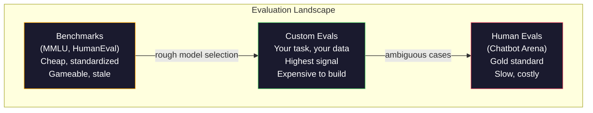
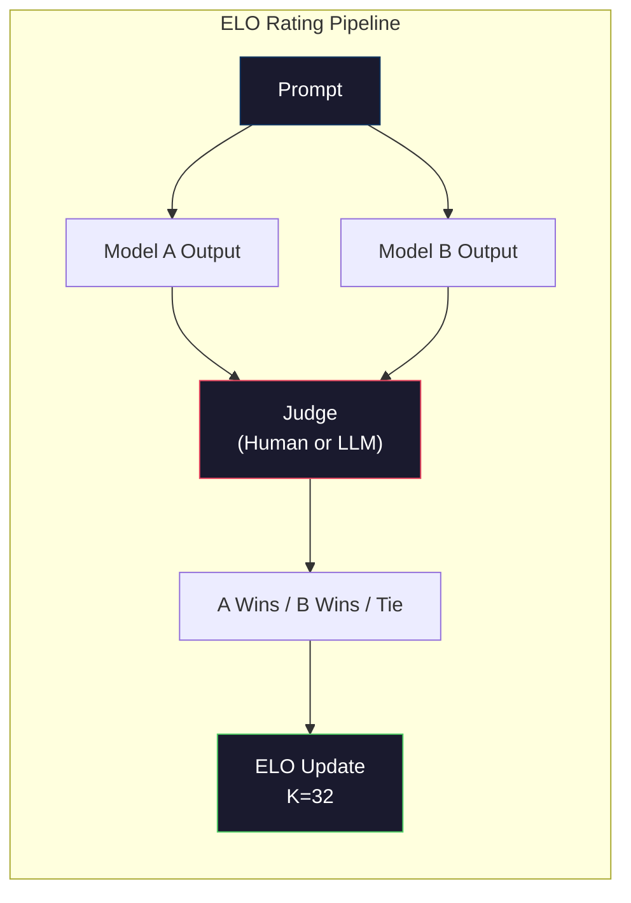

# 10 · 评估：基准测试、Evals 与 LM Harness

> 古德哈特定律（Goodhart's Law）：当一个度量本身成为目标时，它就不再是一个好的度量。每一家前沿实验室都在「刷」基准测试。MMLU 分数节节攀升，可模型却依然无法可靠地数出「strawberry」里有几个 R。唯一重要的评估是你自己的评估——针对你的任务，使用你的数据。

**类型：** 构建
**语言：** Python
**前置：** 第 10 阶段，第 01-05 课（从零构建 LLM）
**时长：** 约 90 分钟

## 学习目标

- 构建一个自定义的评估框架（harness），针对某个语言模型运行多选题与开放式基准测试
- 解释为什么标准基准测试（MMLU、HumanEval）会「饱和」，无法区分前沿模型
- 用恰当的指标实现任务专属的 evals：精确匹配（exact match）、F1、BLEU 以及 LLM 充当评委（LLM-as-judge）的打分
- 设计一套针对你具体用例的自定义评估套件，而不是单纯依赖公开排行榜

## 问题所在

MMLU 于 2020 年发布，包含 57 个学科共 15,908 道题目。不到三年，前沿模型就把它「打满」了。GPT-4 得分 86.4%。Claude 3 Opus 得分 86.8%。Llama 3 405B 得分 88.6%。整个排行榜被压缩进 3 个百分点的区间里，差异是统计噪声，而非真实的能力差距。

与此同时，这些同样的模型却会在一个 10 岁孩子不假思索就能完成的任务上失败。MMLU 得分 88.7% 的 Claude 3.5 Sonnet，起初竟数不清「strawberry」里有几个字母——这个任务不需要任何世界知识、不需要任何推理，只需逐字符迭代。HumanEval 用 164 道题考查代码生成。模型在它上面得分 90% 以上，却仍会写出在边界情况下崩溃的代码，而这些边界情况任何一个初级开发者都能发现。

基准测试表现与真实世界可靠性之间的鸿沟，正是 LLM 评估的核心问题。基准测试告诉你的，是一个模型在该基准测试上的表现。它几乎无法告诉你这个模型在你的具体任务上、用你的具体数据、在你的具体失败模式下会有怎样的表现。如果你在构建一个客服机器人，MMLU 与你无关。如果你在构建一个代码助手，HumanEval 只覆盖了函数级别的生成——它对调试、重构或跨文件解释代码只字未提。

你需要自定义 evals。这不是因为基准测试毫无用处——它们对于粗略的模型选型很有用——而是因为最终的评估必须精确匹配你的部署条件。

## 核心概念

### 评估全景

评估有三大类别，各自的成本与信号质量都不同。

**基准测试（Benchmarks）** 是标准化的测试套件。MMLU、HumanEval、SWE-bench、MATH、ARC、HellaSwag。你针对基准测试跑一个模型，得到一个分数。优点：人人用同一套测试，因此你可以横向比较模型。缺点：模型和训练数据正越来越多地「污染」这些基准测试。实验室在包含基准题目的数据上训练。分数上去了，能力却未必。

**自定义 evals（Custom evals）** 是你为自己具体用例构建的测试套件。你定义输入、期望输出以及打分函数。一个法律文档摘要器要在法律文档上评估。一个 SQL 生成器要在你的数据库 schema 上评估。这类评估创建成本高，但它们是唯一能预测生产环境表现的评估。

**人工评估（Human evals）** 使用付费标注员，按有用性、正确性、流畅度和安全性等标准来判断模型输出。对于自动打分会失效的开放式任务，这是黄金标准。Chatbot Arena 已在 100 多个模型上收集了超过 200 万次人类偏好投票。缺点：成本（每次判断 $0.10-$2.00）和速度（数小时到数天）。



### 基准测试为何失灵

有三种机制会导致基准测试分数不再反映真实能力。

**数据污染（Data contamination）。** 训练语料是从互联网抓取的。基准题目就活在互联网上。模型在训练时见过答案。这在传统意义上并不算作弊——实验室并非有意纳入基准数据。但网络规模的抓取使得几乎不可能将其排除。

**应试教学（Teaching to the test）。** 实验室会针对基准表现来优化训练数据配比。如果训练混合数据里有 5% 是 MMLU 风格的多选题，模型就会学到这种格式和答案分布。MMLU 是四选一的多选题。模型学到答案分布在 A/B/C/D 上近似均匀，这一点即使在模型不知道答案时也有帮助。

**饱和（Saturation）。** 当每个前沿模型在某个基准上都拿到 85-90% 时，这个基准就失去了区分度。剩下的 10-15% 题目可能本身就有歧义、标注错误，或需要冷僻的领域知识。在 MMLU 上从 87% 提升到 89%，也许只意味着模型多背下了两道冷僻题，而不是它变聪明了。

### 困惑度（Perplexity）：一次快速体检

困惑度衡量模型对一段 token 序列有多「惊讶」。形式上，它是指数化的平均负对数似然：

```
PPL = exp(-1/N * sum(log P(token_i | context)))
```

困惑度为 10 意味着模型平均而言的不确定性，相当于在每个 token 位置上从 10 个选项里均匀挑选。越低越好。GPT-2 在 WikiText-103 上的困惑度约为 30。GPT-3 约为 20。Llama 3 8B 约为 7。

困惑度对于在同一测试集上比较模型很有用，但它有盲区。一个模型可以靠擅长预测常见模式而获得低困惑度，却在罕见但重要的模式上表现糟糕。它也完全无法反映指令遵循、推理或事实准确性。把它当作健全性检查，而非最终裁决。

### LLM 充当评委（LLM-as-Judge）

用一个强模型去评估一个弱模型的输出。思路很简单：让 GPT-4o 或 Claude Sonnet 在正确性、有用性和安全性上以 1-5 分制为某个回答打分。用 GPT-4o-mini 时每次判断约 $0.01，并且与人类判断的相关性出奇地好——在大多数任务上一致率约 80%。

打分提示词比模型本身更重要。一个含糊的提示词（「给这个回答打分」）会产生噪声很大的分数。一个带评分量规（rubric）的结构化提示词（「若答案事实正确且引用了来源，打 5 分；正确但无来源，打 4 分；部分正确，打 3 分……」）会产生一致、可复现的分数。

失败模式：评委模型会表现出位置偏差（在成对比较中偏好第一个回答）、冗长偏差（偏好更长的回答）以及自我偏好（GPT-4 给 GPT-4 的输出打的分高于同等水平的 Claude 输出）。缓解办法：随机打乱顺序、针对长度做归一化、使用与被评估模型不同的评委。

### 从成对比较得出 ELO 评级

这是 Chatbot Arena 的做法。针对同一个提示，展示来自不同模型的两个回答。由人类（或 LLM 评委）挑出更好的那个。从成千上万次这样的比较中，为每个模型计算一个 ELO 评级——与国际象棋使用的系统相同。

ELO 的优势：相对排名比绝对打分更可靠，能优雅地处理平局，并且比独立给每个输出打分收敛得更快、所需比较次数更少。截至 2026 年初，Chatbot Arena 排名显示 GPT-4o、Claude 3.5 Sonnet 和 Gemini 1.5 Pro 在榜首彼此相差不到 20 个 ELO 分。



### 评估框架

**lm-evaluation-harness**（EleutherAI）：标准的开源评估框架。支持 200 多个基准测试。用一条命令就能让任意 Hugging Face 模型跑 MMLU、HellaSwag、ARC 等。Open LLM Leaderboard 即采用它。

**RAGAS**：专门针对 RAG 流水线的评估框架。衡量忠实度（faithfulness，答案是否与检索到的上下文相符？）、相关性（relevance，检索到的上下文是否与问题相关？）以及答案正确性。

**promptfoo**：面向提示词工程的配置驱动型评估。在 YAML 里定义测试用例，针对多个模型运行，得到一份通过/失败报告。它对提示词的回归测试很有用——确保某次提示词改动不会破坏已有的测试用例。

### 构建自定义 evals

这是唯一对生产环境真正重要的评估。流程如下：

1. **定义任务。** 模型究竟该做什么？要精确。「回答问题」太含糊。「给定一封客户投诉邮件，抽取产品名称、问题类别和情感倾向」才是一个你可以评估的任务。

2. **创建测试用例。** 原型评估至少 50 条，生产环境 200 条以上。每个测试用例是一对 (input, expected_output)。要纳入边界情况：空输入、对抗性输入、有歧义的输入、其他语言的输入。

3. **定义打分。** 结构化输出用精确匹配。文本相似度用 BLEU/ROUGE。开放式质量用 LLM 充当评委。抽取任务用 F1。用权重组合多个指标。

4. **自动化。** 每次评估用一条命令运行。没有手动步骤。把结果存成一种便于跨时间比较的格式。

5. **持续追踪趋势。** 孤立的一个评估分数毫无意义。你需要的是趋势线。上次改动提示词后分数提升了吗？换模型后是否退步了？把你的评估与提示词一起做版本管理。

| 评估类型 | 每次判断成本 | 与人类的一致率 | 最适合 |
|-----------|------------------|----------------------|----------|
| 精确匹配 | ~$0 | 100%（适用时） | 结构化输出、分类 |
| BLEU/ROUGE | ~$0 | ~60% | 翻译、摘要 |
| LLM 充当评委 | ~$0.01 | ~80% | 开放式生成 |
| 人工评估 | $0.10-$2.00 | N/A（它就是真值） | 有歧义的、高风险的任务 |

## 动手构建

### 第 1 步：一个最小评估框架

定义核心抽象。一个评估用例（EvalCase）有一个输入、一个期望输出，以及一个可选的元数据字典。一个打分器（scorer）接收一个预测和一个参考答案，返回介于 0 和 1 之间的分数。

```python
import json
from collections import Counter

class EvalCase:
    def __init__(self, input_text, expected, metadata=None):
        self.input_text = input_text
        self.expected = expected
        self.metadata = metadata or {}

class EvalSuite:
    def __init__(self, name, cases, scorers):
        self.name = name
        self.cases = cases
        self.scorers = scorers

    def run(self, model_fn):
        results = []
        for case in self.cases:
            prediction = model_fn(case.input_text)
            scores = {}
            for scorer_name, scorer_fn in self.scorers.items():
                scores[scorer_name] = scorer_fn(prediction, case.expected)
            results.append({
                "input": case.input_text,
                "expected": case.expected,
                "prediction": prediction,
                "scores": scores,
            })
        return results
```

### 第 2 步：打分函数

构建精确匹配、token F1，以及一个模拟的 LLM 充当评委打分器。

```python
def exact_match(prediction, expected):
    return 1.0 if prediction.strip().lower() == expected.strip().lower() else 0.0

def token_f1(prediction, expected):
    pred_tokens = set(prediction.lower().split())
    exp_tokens = set(expected.lower().split())
    if not pred_tokens or not exp_tokens:
        return 0.0
    common = pred_tokens & exp_tokens
    precision = len(common) / len(pred_tokens)
    recall = len(common) / len(exp_tokens)
    if precision + recall == 0:
        return 0.0
    return 2 * (precision * recall) / (precision + recall)

def llm_judge_simulated(prediction, expected):
    pred_words = set(prediction.lower().split())
    exp_words = set(expected.lower().split())
    if not exp_words:
        return 0.0
    overlap = len(pred_words & exp_words) / len(exp_words)
    length_penalty = min(1.0, len(prediction) / max(len(expected), 1))
    return round(overlap * 0.7 + length_penalty * 0.3, 3)
```

### 第 3 步：ELO 评级系统

实现带 ELO 更新的成对比较。这正是 Chatbot Arena 用来给模型排名的系统。

```python
class ELOTracker:
    def __init__(self, k=32, initial_rating=1500):
        self.ratings = {}
        self.k = k
        self.initial_rating = initial_rating
        self.history = []

    def _ensure_player(self, name):
        if name not in self.ratings:
            self.ratings[name] = self.initial_rating

    def expected_score(self, rating_a, rating_b):
        return 1 / (1 + 10 ** ((rating_b - rating_a) / 400))

    def record_match(self, player_a, player_b, outcome):
        self._ensure_player(player_a)
        self._ensure_player(player_b)

        ea = self.expected_score(self.ratings[player_a], self.ratings[player_b])
        eb = 1 - ea

        if outcome == "a":
            sa, sb = 1.0, 0.0
        elif outcome == "b":
            sa, sb = 0.0, 1.0
        else:
            sa, sb = 0.5, 0.5

        self.ratings[player_a] += self.k * (sa - ea)
        self.ratings[player_b] += self.k * (sb - eb)

        self.history.append({
            "a": player_a, "b": player_b,
            "outcome": outcome,
            "rating_a": round(self.ratings[player_a], 1),
            "rating_b": round(self.ratings[player_b], 1),
        })

    def leaderboard(self):
        return sorted(self.ratings.items(), key=lambda x: -x[1])
```

### 第 4 步：困惑度计算

用 token 概率计算困惑度。在实践中你会从模型的 logits 里取得这些概率。这里我们用一个概率分布来模拟。

```python
import numpy as np

def perplexity(log_probs):
    if not log_probs:
        return float("inf")
    avg_neg_log_prob = -np.mean(log_probs)
    return float(np.exp(avg_neg_log_prob))

def token_log_probs_simulated(text, model_quality=0.8):
    np.random.seed(hash(text) % 2**31)
    tokens = text.split()
    log_probs = []
    for i, token in enumerate(tokens):
        base_prob = model_quality
        if len(token) > 8:
            base_prob *= 0.6
        if i == 0:
            base_prob *= 0.7
        prob = np.clip(base_prob + np.random.normal(0, 0.1), 0.01, 0.99)
        log_probs.append(float(np.log(prob)))
    return log_probs
```

### 第 5 步：汇总结果

在一次评估运行中计算汇总统计量：均值、中位数、某阈值下的通过率，以及按指标的细分。

```python
def summarize_results(results, threshold=0.8):
    all_scores = {}
    for r in results:
        for metric, score in r["scores"].items():
            all_scores.setdefault(metric, []).append(score)

    summary = {}
    for metric, scores in all_scores.items():
        arr = np.array(scores)
        summary[metric] = {
            "mean": round(float(np.mean(arr)), 3),
            "median": round(float(np.median(arr)), 3),
            "std": round(float(np.std(arr)), 3),
            "min": round(float(np.min(arr)), 3),
            "max": round(float(np.max(arr)), 3),
            "pass_rate": round(float(np.mean(arr >= threshold)), 3),
            "n": len(scores),
        }
    return summary

def print_summary(summary, suite_name="Eval"):
    print(f"\n{'=' * 60}")
    print(f"  {suite_name} Summary")
    print(f"{'=' * 60}")
    for metric, stats in summary.items():
        print(f"\n  {metric}:")
        print(f"    Mean:      {stats['mean']:.3f}")
        print(f"    Median:    {stats['median']:.3f}")
        print(f"    Std:       {stats['std']:.3f}")
        print(f"    Range:     [{stats['min']:.3f}, {stats['max']:.3f}]")
        print(f"    Pass rate: {stats['pass_rate']:.1%} (threshold >= 0.8)")
        print(f"    N:         {stats['n']}")
```

### 第 6 步：运行完整流水线

把所有部分串起来。定义一个任务，创建测试用例，模拟两个模型，运行评估，从成对比较中计算 ELO，并打印排行榜。

```python
def demo_model_good(prompt):
    responses = {
        "What is the capital of France?": "Paris",
        "What is 2 + 2?": "4",
        "Who wrote Hamlet?": "William Shakespeare",
        "What language is PyTorch written in?": "Python and C++",
        "What is the boiling point of water?": "100 degrees Celsius",
    }
    return responses.get(prompt, "I don't know")

def demo_model_bad(prompt):
    responses = {
        "What is the capital of France?": "Paris is the capital city of France",
        "What is 2 + 2?": "The answer is four",
        "Who wrote Hamlet?": "Shakespeare",
        "What language is PyTorch written in?": "Python",
        "What is the boiling point of water?": "212 Fahrenheit",
    }
    return responses.get(prompt, "Unknown")

cases = [
    EvalCase("What is the capital of France?", "Paris"),
    EvalCase("What is 2 + 2?", "4"),
    EvalCase("Who wrote Hamlet?", "William Shakespeare"),
    EvalCase("What language is PyTorch written in?", "Python and C++"),
    EvalCase("What is the boiling point of water?", "100 degrees Celsius"),
]

suite = EvalSuite(
    name="General Knowledge",
    cases=cases,
    scorers={
        "exact_match": exact_match,
        "token_f1": token_f1,
        "llm_judge": llm_judge_simulated,
    },
)

results_good = suite.run(demo_model_good)
results_bad = suite.run(demo_model_bad)

print_summary(summarize_results(results_good), "Model A (concise)")
print_summary(summarize_results(results_bad), "Model B (verbose)")
```

「好」模型给出精确答案。「坏」模型给出冗长的转述。精确匹配对冗长模型的惩罚极其严厉。Token F1 和 LLM 充当评委则宽容得多。这说明了为什么指标的选择至关重要：同一个模型，取决于你怎么打分，看起来可以很出色，也可以很糟糕。

### 第 7 步：ELO 锦标赛

在多个回合中对模型两两进行成对比较。

```python
elo = ELOTracker(k=32)

for case in cases:
    pred_a = demo_model_good(case.input_text)
    pred_b = demo_model_bad(case.input_text)

    score_a = token_f1(pred_a, case.expected)
    score_b = token_f1(pred_b, case.expected)

    if score_a > score_b:
        outcome = "a"
    elif score_b > score_a:
        outcome = "b"
    else:
        outcome = "tie"

    elo.record_match("model_a_concise", "model_b_verbose", outcome)

print("\nELO Leaderboard:")
for name, rating in elo.leaderboard():
    print(f"  {name}: {rating:.0f}")
```

### 第 8 步：困惑度对比

在不同质量等级的「模型」之间比较困惑度。

```python
test_text = "The quick brown fox jumps over the lazy dog in the garden"

for quality, label in [(0.9, "Strong model"), (0.7, "Medium model"), (0.4, "Weak model")]:
    log_probs = token_log_probs_simulated(test_text, model_quality=quality)
    ppl = perplexity(log_probs)
    print(f"  {label} (quality={quality}): perplexity = {ppl:.2f}")
```

## 实战应用

### lm-evaluation-harness（EleutherAI）

在任意模型上运行基准测试的标准工具。

```python
# pip install lm-eval
# Command line:
# lm_eval --model hf --model_args pretrained=meta-llama/Llama-3.1-8B --tasks mmlu --batch_size 8

# Python API:
# import lm_eval
# results = lm_eval.simple_evaluate(
#     model="hf",
#     model_args="pretrained=meta-llama/Llama-3.1-8B",
#     tasks=["mmlu", "hellaswag", "arc_easy"],
#     batch_size=8,
# )
# print(results["results"])
```

### promptfoo

面向提示词工程的配置驱动型评估。在 YAML 里定义测试，针对多个提供方运行。

```yaml
# promptfoo.yaml
providers:
  - openai:gpt-4o-mini
  - anthropic:claude-3-haiku

prompts:
  - "Answer in one word: {{question}}"

tests:
  - vars:
      question: "What is the capital of France?"
    assert:
      - type: contains
        value: "Paris"
  - vars:
      question: "What is 2 + 2?"
    assert:
      - type: equals
        value: "4"
```

### 用 RAGAS 做 RAG 评估

```python
# pip install ragas
# from ragas import evaluate
# from ragas.metrics import faithfulness, answer_relevancy, context_precision
#
# result = evaluate(
#     dataset,
#     metrics=[faithfulness, answer_relevancy, context_precision],
# )
# print(result)
```

RAGAS 衡量的正是通用评估所遗漏的东西：模型的答案是否扎根于检索到的上下文，而不仅仅是抽象意义上答案是否「正确」。

## 交付落地

本课会产出 `outputs/prompt-eval-designer.md`——一个可复用的提示词，能为任意任务设计自定义评估套件。给它一段任务描述，它就会生成测试用例、打分函数，以及一个通过/失败阈值的推荐值。

它还会产出 `outputs/skill-llm-evaluation.md`——一个决策框架，帮助你根据任务类型、预算和延迟要求选择合适的评估策略。

## 练习

1. 添加一个「一致性（consistency）」打分器，把同一个输入经过模型跑 5 次，衡量输出彼此匹配的频率。在确定性输入上出现不一致的答案，会暴露脆弱的提示词或过高的 temperature 设置。

2. 扩展 ELO 追踪器，使其支持多个评委函数（精确匹配、F1、LLM 充当评委）并为它们加权。比较一下，当你重度加权精确匹配与重度加权 F1 时，排行榜会如何变化。

3. 为一个具体任务构建评估套件：把邮件分类到 5 个类别。创建 100 个测试用例，包含多样化的样例，其中含边界情况（可能同时属于多个类别的邮件、空邮件、其他语言的邮件）。衡量不同「模型」（基于规则、关键词匹配、模拟 LLM）的表现。

4. 实现污染检测：给定一组评估题目和一份训练语料，检查有多大比例的评估题目（或与之相近的转述）出现在训练数据中。研究人员正是这样审计基准测试有效性的。

5. 构建一个「模型差异（model diff）」工具。给定两个模型版本的评估结果，标出具体哪些测试用例改善了、哪些退步了、哪些保持不变。这相当于评估版的代码 diff——对于理解一次改动是帮了忙还是帮了倒忙至关重要。

## 关键术语

| 术语 | 人们怎么说 | 它实际指什么 |
|------|----------------|----------------------|
| MMLU | 「那个基准」 | Massive Multitask Language Understanding——57 个学科共 15,908 道多选题，到 2025 年已被刷到 88% 以上而饱和 |
| HumanEval | 「代码评估」 | OpenAI 出品的 164 道 Python 函数补全题，仅考查孤立的函数生成 |
| SWE-bench | 「真实编码评估」 | 来自 12 个 Python 仓库的 2,294 个 GitHub issue，衡量端到端的缺陷修复，包括测试生成 |
| 困惑度（Perplexity） | 「模型有多懵」 | exp(-avg(log P(token_i given context)))——越低意味着模型给真实 token 赋予的概率越高 |
| ELO 评级 | 「模型的国际象棋排名」 | 由成对胜负记录计算出的相对实力评级，Chatbot Arena 用它给 100 多个模型排名 |
| LLM 充当评委 | 「用 AI 给 AI 打分」 | 强模型按评分量规给弱模型的输出打分，与人类评委约 80% 一致，每次判断约 $0.01 |
| 数据污染 | 「模型见过测试题」 | 训练数据包含基准题目，在不提升真实能力的情况下虚高了分数 |
| 评估套件（Eval suite） | 「一堆测试」 | 一个做了版本管理的 (input, expected_output, scorer) 三元组集合，用于衡量某项具体能力 |
| 通过率（Pass rate） | 「它做对了百分之多少」 | 得分高于阈值的评估用例所占比例——比均值更具可操作性，因为它衡量的是可靠性 |
| Chatbot Arena | 「模型排名网站」 | LMSYS 平台，拥有 200 万以上人类偏好投票，通过 ELO 评级产出最受信赖的 LLM 排行榜 |

## 延伸阅读

- [Hendrycks 等，2021——《Measuring Massive Multitask Language Understanding》](https://arxiv.org/abs/2009.03300)——MMLU 论文，尽管已经饱和，但仍是被引用最多的 LLM 基准
- [Chen 等，2021——《Evaluating Large Language Models Trained on Code》](https://arxiv.org/abs/2107.03374)——OpenAI 的 HumanEval 论文，确立了代码生成评估方法论
- [Zheng 等，2023——《Judging LLM-as-a-Judge》](https://arxiv.org/abs/2306.05685)——对使用 LLM 评估 LLM 的系统性分析，包含位置偏差和冗长偏差的发现
- [LMSYS Chatbot Arena](https://chat.lmsys.org/)——拥有 200 万以上投票的众包模型比较平台，最受信赖的真实世界 LLM 排名
