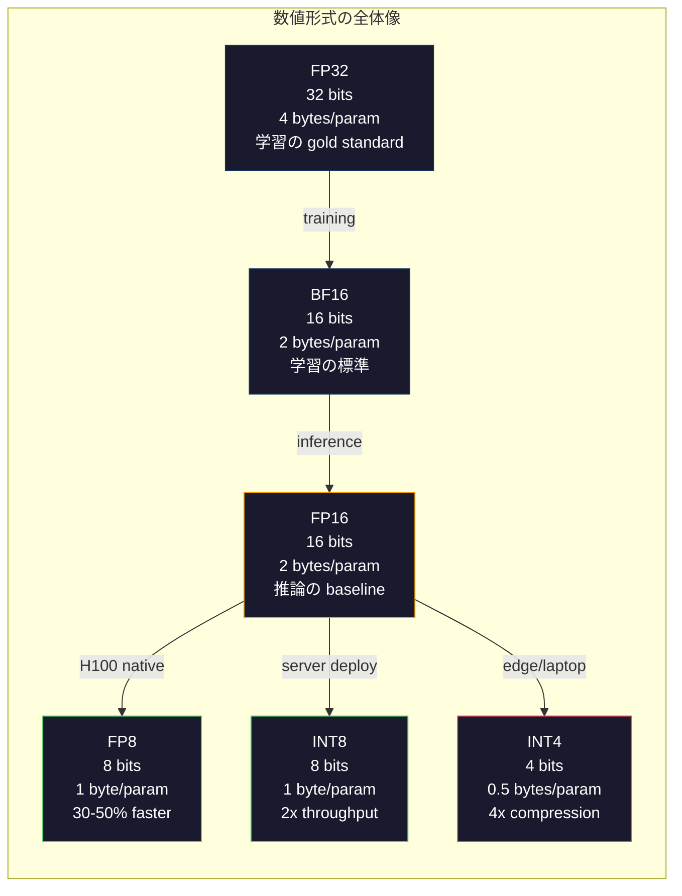
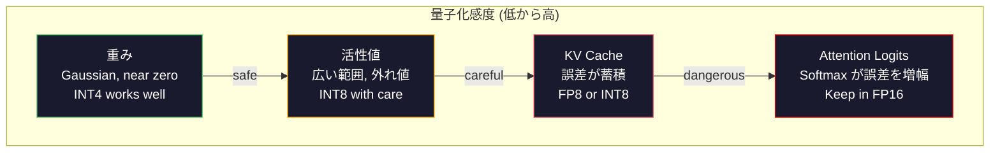
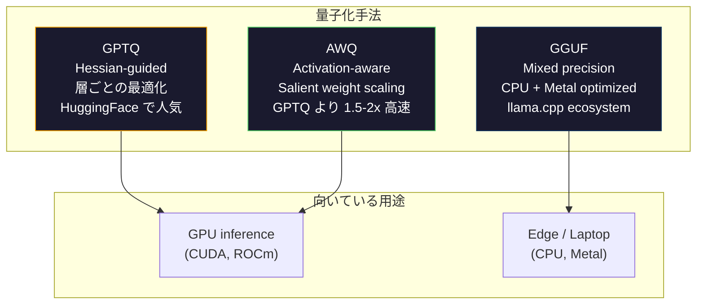

# 量子化: モデルを載せられる大きさにする

> FP16 の 70B モデルには 140GB が必要です。重みだけで A100 が 2枚必要になります。FP8 に量子化すれば 80GB GPU 1枚。INT4 なら MacBook でも動かせます。

**種類:** Build
**言語:** Python (with numpy)
**前提条件:** Phase 10, Lessons 01-10 (LLMs from Scratch)
**所要時間:** 約120分

## 学習目標

- FP16 から INT8/INT4 への対称量子化と非対称量子化を、テンソル単位・チャネル単位のスケーリング込みで実装する
- 量子化によるメモリ削減量を計算し、特定 GPU の VRAM に収まる数値精度を判断する
- Post-training quantization (PTQ) と quantization-aware training (QAT) の違いを説明する
- GPTQ または AWQ で実際のモデルを量子化し、ベンチマーク上で精度とメモリのトレードオフを測定する

## 問題

Llama 3 70B には 700億個のパラメータがあります。各パラメータは 16-bit 浮動小数点数なので、合計で 1,400億バイト、つまり 140GB です。A100 1枚の VRAM は 80GB です。単一 GPU では推論どころか重みをロードすることすらできません。1つのモデルを配信するだけで、1時間あたり$2の A100 が 2枚必要になります。

しかし、1パラメータあたり 16bit は無駄が多い形式です。ニューラルネットワークの重みの多くはゼロ付近に集まります。FP16 の全ダイナミックレンジ (0.000000059 から 65,504) は、ほぼ使われていません。Llama 3 70B の実際の重み分布を測ると、95% が -0.1 から +0.1 の間に収まります。4bit で表せる値のために 16bit を消費しているわけです。

量子化は、高精度の数値を低精度の数値に置き換えます。FP16 から FP8 にするとメモリは半分になります。FP16 から INT4 にすると 4分の1 になります。140GB のモデルは 35GB になり、単一の民生用 GPU に収まります。さらに 2-bit 量子化まで進めると、攻めた lossy な手法ではありますが、一部タスクでは同じモデルを 16GB のノート PC で実行できます。

代償は精度です。削る bit はそれぞれ情報を破壊します。問題は、どこでどれだけ精度を失うかです。適切に量子化された INT4 モデルは、多くのベンチマークで元モデルの品質の 95-99% を維持します。一方で、単純に INT4 へ量子化するとモデル全体が壊れることもあります。その差は手法にあります。

コミュニティで公開されている Llama 3 の GPTQ INT4 量子化では、WikiText 上の perplexity がだいたい 1-2 ポイント悪化します。Mistral は Mixtral 8x22B の FP8 チェックポイントを公開し、MMLU で測定可能な品質低下がないことを示しました。GGUF 形式は llama.cpp を支え、M-series チップ搭載 MacBook 上で 70B モデルを動かします。量子化はハックではありません。7B を超えるすべてのモデルにとって、標準的なデプロイ経路です。

## コンセプト

### 数値形式: 各 bit の役割

すべての浮動小数点数は、符号、指数部、仮数部 (significand とも呼ばれる) の 3つで構成されます。符号は 1bit です。指数部は範囲、つまり数値をどれだけ大きく・小さくできるかを決めます。仮数部は精度、つまり何桁程度まで表せるかを決めます。

```
FP32:  [1 sign] [8 exponent] [23 mantissa]  = 32 bits
FP16:  [1 sign] [5 exponent] [10 mantissa]  = 16 bits
BF16:  [1 sign] [8 exponent] [7  mantissa]  = 16 bits
FP8:   [1 sign] [4 exponent] [3  mantissa]  = 8  bits (E4M3)
FP8:   [1 sign] [5 exponent] [2  mantissa]  = 8  bits (E5M2)
INT8:  [1 sign] [7 value]                   = 8  bits (uniform steps)
INT4:  [1 sign] [3 value]                   = 4  bits (16 levels total)
```

**FP32** は full precision です。23bit の仮数部により、およそ 7桁の十進精度が得られます。範囲はおおよそ 1.2 x 10^-38 から 3.4 x 10^38 です。かつて学習はほぼ FP32 だけで行われていました。現在でも accumulation、つまり行列積中の累積和には使われます。

**FP16** は bit 数を半分にします。10bit の仮数部により、およそ 3.3桁の十進精度が得られます。指数部は 5bit に縮み、範囲は大きく狭まります (最大値は約 65,504)。ゼロ付近に集まる重みには十分ですが、学習中に急増することがある活性値や勾配には危険です。FP16 学習では underflow を防ぐために loss scaling が必要です。

**BF16** (Brain Float 16) は FP32 と同じ 8bit の指数部を保ち、仮数部を 7bit に縮めます。範囲は FP32 と同じで、精度は FP16 より低くなります。Google はこれを deep learning 専用に設計しました。直感は、ニューラルネットワークでは精度より範囲が重要だというものです。FP16 ではゼロに underflow する 10^-20 の勾配も、BF16 では残ります。0.07342 の重みが BF16 で 0.0734 に丸められても十分近い値です。現代の学習のほとんどは BF16、または BF16/FP32 の混合で行われます。

**FP8** には 2種類あります。E4M3 (指数部 4bit、仮数部 3bit) は推論時の重みと活性値に使われます。E5M2 (指数部 5bit、仮数部 2bit) は、精度より範囲が重要な学習時の勾配に使われます。H100 GPU 上の FP8 推論は、品質低下をほぼ伴わずに FP16 より 30-50% 高速化します。

**INT8** は整数形式です。指数部も仮数部もありません。-128 から 127 までの等間隔な 256個の値だけです。浮動小数点の重みをこの範囲に写すには scale factor が必要です。利点は、整数演算が浮動小数点演算より高速で電力効率に優れることです。A100 上の INT8 行列積は 624 TOPS で動作し、FP16 の 312 TFLOPS を上回ります。

**INT4** はさらに踏み込みます。表せる値は 16個だけです。scale factor が大きな役割を担います。品質は、scale の選び方と、どの重みを量子化するかにほぼ完全に依存します。最先端の INT4 手法 (GPTQ, AWQ) は、元モデル品質の 95% 以上を維持します。



### 量子化の仕組み

中心となる操作は単純です。浮動小数点値の tensor を取り、scale factor を求め、掛け算し、最も近い整数に丸め、整数値と scale factor を保存します。

**量子化:**
```
scale = max(abs(tensor)) / max_int_value
quantized = round(tensor / scale)
```

**逆量子化:**
```
reconstructed = quantized * scale
```

対称範囲 (-127 から 127) の INT8 では次のようになります。
```
scale = max(abs(tensor)) / 127
quantized = clamp(round(tensor / scale), -128, 127)
```

誤差は丸め誤差です。各値は最大で `scale / 2` だけずれる可能性があります。層全体の総誤差は、重みの数と、その重みへの摂動に対するモデルの敏感さによって決まります。

**テンソル単位 vs チャネル単位の量子化。** テンソル単位では、重み行列全体に 1つの scale factor を使います。単純ですが lossy です。ある列の値が大きく、別の列の値が小さい場合、小さい値は精度の大半を失います。チャネル単位では、出力チャネルごと、つまり重み行列の行または列ごとに 1つの scale factor を使います。scale factor を 1個ではなく N個保存するため overhead は増えますが、品質は劇的に良くなります。本番用の量子化手法はすべて、チャネル単位か、それより細かい粒度を使います。

**非対称量子化** は zero-point offset を追加します: `quantized = round(tensor / scale) + zero_point`。これはゼロ中心ではない分布を扱うための手法です。たとえば ReLU 活性値は常に非負です。対称量子化では、決して現れない負の値に整数範囲の半分を無駄に使ってしまいます。非対称量子化は、実際の範囲 [min, max] を整数範囲全体に写します。

### 感度の階層

モデル内のすべてが同じように量子化に耐えられるわけではありません。明確な階層があります。

**重み (最も頑健)。** モデルの重みは学習中にゆっくり変化し、ゼロ付近を中心とするおおよそ Gaussian な分布に従います。重みは量子化しやすい対象です。チャネル単位 scale の INT8 重みは、ほぼ lossless な結果になります。INT4 にはより高度な手法が必要ですが、実用的に動きます。

**活性値 (中程度の感度)。** 活性値は、推論中にネットワーク内を流れる中間値です。重みよりダイナミックレンジが広く、外れ値を含みます。単一の attention head が平均の 100倍の活性値を出すこともあります。こうした外れ値はモデル品質にとって重要です。単純に量子化すると情報が壊れます。対策として、外れ値チャネルを高精度のまま残す (LLM.int8())、token 単位または channel 単位の activation scale を使う、といった方法があります。

**KV cache (高い感度)。** key-value cache は、過去すべての token の attention state を保存します。長い context length では KV cache がメモリの大半を占めます。70B モデルの 32K context では、KV cache だけで FP16 で 40GB になります。KV cache を FP8 または INT8 に量子化すると大きくメモリを節約できますが、誤差は将来すべての attention 計算に蓄積します。品質への影響は sequence length に比例して大きくなります。

**Attention logits (最も高い感度)。** attention の softmax は入力の小さな変化に非常に敏感です。softmax 前の logit に 0.01 の量子化誤差があるだけで、attention 分布が意味のある形でずれることがあります。ほとんどの量子化スキームでは、他の部分を量子化しても attention 計算は高精度 (FP16 または BF16) のままにします。



### PTQ vs QAT

**Post-Training Quantization (PTQ)** は、学習済みモデルを量子化します。再学習はしません。FP16 の重みを取り出し、scale factor を計算し、丸めて、デプロイします。高速 (数分から数時間) で安価です。INT8 と FP8 ではよく機能します。INT4 では丸め誤差が蓄積するため、素朴な PTQ は失敗しがちです。高度な PTQ 手法 (GPTQ, AWQ) は calibration data を使って量子化誤差を最小化します。

**Quantization-Aware Training (QAT)** は、学習中の forward pass に fake quantization 操作を挿入します。モデルは、丸め誤差が小さくなる位置に重みを置くよう学習します。勾配は straight-through estimator (STE) により fake quantization を通過します。つまり、丸め操作の勾配を 1 とみなします。QAT は PTQ より優れた INT4/INT2 モデルを作れますが、完全な学習実行が必要です。Google は Gemini の効率的な serving に QAT を使いました。Meta も一部の Llama deployment target に QAT を使いました。

| 観点 | PTQ | QAT |
|--------|-----|-----|
| コスト | 数分から数時間 | 完全な学習実行 |
| INT8 での品質 | 優秀 (< 0.1% loss) | 優秀 |
| INT4 での品質 | GPTQ/AWQ なら良好 (1-3% loss) | より良い (< 1% loss) |
| INT2 での品質 | 悪い | 一部タスクでは利用可能 |
| Calibration data | 128-1024 examples | 完全な training dataset |
| 使う場面 | デプロイ、反復 | 低 bit-width で最大品質が必要な場合 |

### GPTQ, AWQ, GGUF

**GPTQ (GPT Quantization)** は one-shot の PTQ 手法です。小さな calibration dataset (典型的には 128 examples) を使って Hessian、つまり各重みに対する出力感度の二次情報を測り、層ごとに重みを量子化します。Hessian が重要だと示す重みは、より慎重に量子化されます。GPTQ は、LLM の INT4 量子化を初めて実用的にした手法です。Hugging Face の TheBloke は、数百のモデルの量子化版を公開して GPTQ を普及させました。

**AWQ (Activation-Aware Weight Quantization)** は、少数の重み (約 1%) が大きな activation value と掛け合わされるため、過度に重要になることに注目します。AWQ は calibration data を使ってこの salient weight を特定し、量子化前にそれらをスケールアップします (対応する activations はスケールダウンします)。これにより、重要な重みを INT4 量子化が正確に扱える範囲に保ちます。AWQ は通常 GPTQ と同等か少し上回る品質を出しつつ、適用は 1.5-2倍高速です。

**GGUF (GPT-Generated Unified Format)** は llama.cpp とその ecosystem で使われるファイル形式です。mixed quantization をサポートしており、層ごとに異なる bit width を使えます。最初と最後の層 (embedding と output head) は通常、高めの精度で保持します。中間層は INT4 または INT3 にします。GGUF ファイルは自己完結型で、重み、tokenizer、metadata が 1ファイルに入ります。この形式は CPU inference と Apple Silicon 向けに設計されています。モデル全体をメモリに読み込み、CPU または Metal GPU で行列積を走らせるのが標準的な経路です。Q4_K_M は最も人気のある GGUF 量子化 variant で、品質とサイズのバランスに優れます。



### 品質測定

量子化後のモデルがまだ良いモデルかどうかは、どう判断すればよいでしょうか。

**Perplexity。** 最も一般的な指標です。低いほど良いです。元モデルと量子化モデルの両方について、held-out dataset (標準は WikiText-2) 上で perplexity を計算します。その差分が、量子化によってどれだけ情報が壊れたかを示します。目安として、差分 < 0.5 は優秀、0.5-1.0 は良好、1.0-2.0 は多くのタスクで許容範囲、> 2.0 は何かがうまくいっていません。

**タスク固有のベンチマーク。** MMLU、HumanEval、GSM8K、または独自の eval suite で量子化モデルを実行します。元モデルと比較します。量子化の影響は能力ごとに均一ではありません。数学やコードのタスクは、一般知識よりも精度低下に敏感です。

**出力比較。** 同じ prompt に対して両方のモデルから応答を生成して比較します。ここでは LLM-as-judge (Lesson 10) がよく機能します。量子化モデルが元モデルと同等以上だった prompt の割合、つまり win rate を計算します。

**Latency と throughput。** 量子化はモデルを速く安くするためにあります。tokens per second、time to first token、メモリ使用量を測定します。元モデルより遅い量子化モデルは役に立たないどころか逆効果です。

| モデル | 形式 | サイズ | Perplexity (WikiText-2) | MMLU | Tokens/sec (A100) |
|-------|--------|------|------------------------|------|-------------------|
| Llama 3 70B | FP16 | 140GB | 3.12 | 79.5% | 38 |
| Llama 3 70B | FP8 | 70GB | 3.14 | 79.3% | 55 |
| Llama 3 70B | GPTQ INT4 | 35GB | 4.32 | 77.8% | 72 |
| Llama 3 70B | AWQ INT4 | 35GB | 4.18 | 78.1% | 75 |
| Llama 3 70B | GGUF Q4_K_M | 40GB | 4.25 | 77.9% | 28 (CPU) |

パターンは明確です。FP8 はほぼ無料で使えます。INT4 は MMLU を 1-2 ポイント失いますが、throughput を倍増させ、メモリを 4分の1 にします。ほぼすべてのデプロイで、このトレードオフには価値があります。

### 実際の数字

H100 上の FP16 から FP8: 推論が 30-50% 高速化し、品質低下は < 0.1% です。これは迷う必要のない量子化です。すべての H100 deployment で使うべきです。

FP16 から INT8 (LLM.int8()): メモリは 2分の1、品質低下は < 0.5% です。この mixed-precision approach では、外れ値 feature を FP16 のまま保ち、それ以外を INT8 に量子化します。

FP16 から INT4 (GPTQ/AWQ): メモリは 4分の1、品質低下はモデルと手法に応じて 1-3% です。単一の 48GB GPU で 70B モデルを動かせます。

FP16 から INT4 (GGUF Q4_K_M): メモリは 3.5分の1、品質低下は 1-2% です。CPU inference 向けに最適化されています。Q4_K_M の 70B モデルは約 40GB で、64GB の M3 Max 上で 10-15 tokens/second で動作します。

FP16 から INT2: メモリは 8分の1、品質低下は 5-15% です。劣化を許容できる特定の狭いタスクでのみ成立します。研究の最前線であり、一般用途の本番にはまだ向きません。

## 作ってみる

### Step 1: 数値形式の表現

各形式の bit-level 表現を作り、符号、指数部、仮数部が何をしているのかを正確に確認します。

```python
import numpy as np


def float_to_fp32_bits(value):
    bits = np.float32(value).view(np.uint32)
    sign = (bits >> 31) & 1
    exponent = (bits >> 23) & 0xFF
    mantissa = bits & 0x7FFFFF
    return {"sign": int(sign), "exponent": int(exponent), "mantissa": int(mantissa),
            "exponent_bits": format(int(exponent), '08b'),
            "mantissa_bits": format(int(mantissa), '023b'),
            "value": float(value),
            "actual_exponent": int(exponent) - 127}


def float_to_fp16_bits(value):
    fp16 = np.float16(value)
    bits = fp16.view(np.uint16)
    sign = (bits >> 15) & 1
    exponent = (bits >> 10) & 0x1F
    mantissa = bits & 0x3FF
    return {"sign": int(sign), "exponent": int(exponent), "mantissa": int(mantissa),
            "exponent_bits": format(int(exponent), '05b'),
            "mantissa_bits": format(int(mantissa), '010b'),
            "value": float(fp16),
            "actual_exponent": int(exponent) - 15}


def float_to_bf16_bits(value):
    fp32_bits = np.float32(value).view(np.uint32)
    bf16_bits = (fp32_bits >> 16).astype(np.uint16)
    sign = (bf16_bits >> 15) & 1
    exponent = (bf16_bits >> 7) & 0xFF
    mantissa = bf16_bits & 0x7F
    reconstructed = np.uint32(bf16_bits.astype(np.uint32) << 16).view(np.float32)
    return {"sign": int(sign), "exponent": int(exponent), "mantissa": int(mantissa),
            "exponent_bits": format(int(exponent), '08b'),
            "mantissa_bits": format(int(mantissa), '07b'),
            "value": float(reconstructed),
            "actual_exponent": int(exponent) - 127}


def simulate_fp8_e4m3(value):
    sign = 1 if value < 0 else 0
    abs_val = abs(value)
    max_val = 448.0
    abs_val = min(abs_val, max_val)
    if abs_val == 0:
        return {"sign": sign, "exponent": 0, "mantissa": 0, "value": 0.0,
                "exponent_bits": "0000", "mantissa_bits": "000"}
    exp = int(np.floor(np.log2(abs_val)))
    exp = max(-6, min(8, exp))
    mantissa_val = abs_val / (2.0 ** exp) - 1.0
    mantissa_quant = round(mantissa_val * 8) / 8
    mantissa_quant = max(0, min(0.875, mantissa_quant))
    reconstructed = (1.0 + mantissa_quant) * (2.0 ** exp)
    if sign:
        reconstructed = -reconstructed
    mantissa_int = int(round(mantissa_quant * 8))
    return {"sign": sign, "exponent": exp + 7, "mantissa": mantissa_int,
            "exponent_bits": format(exp + 7, '04b'),
            "mantissa_bits": format(mantissa_int, '03b'),
            "value": float(reconstructed),
            "actual_exponent": exp}


def display_format_comparison(value):
    fp32 = float_to_fp32_bits(value)
    fp16 = float_to_fp16_bits(value)
    bf16 = float_to_bf16_bits(value)
    fp8 = simulate_fp8_e4m3(value)

    print(f"\n  Value: {value}")
    print(f"  {'Format':<8} {'Stored Value':>14} {'Error':>12} {'Sign':>5} {'Exp Bits':>10} {'Man Bits':>25}")
    print(f"  {'-'*76}")
    print(f"  {'FP32':<8} {fp32['value']:>14.6f} {abs(fp32['value'] - value):>12.8f} {fp32['sign']:>5} {fp32['exponent_bits']:>10} {fp32['mantissa_bits']:>25}")
    print(f"  {'FP16':<8} {fp16['value']:>14.6f} {abs(fp16['value'] - value):>12.8f} {fp16['sign']:>5} {fp16['exponent_bits']:>10} {fp16['mantissa_bits']:>25}")
    print(f"  {'BF16':<8} {bf16['value']:>14.6f} {abs(bf16['value'] - value):>12.8f} {bf16['sign']:>5} {bf16['exponent_bits']:>10} {bf16['mantissa_bits']:>25}")
    print(f"  {'FP8e4m3':<8} {fp8['value']:>14.6f} {abs(fp8['value'] - value):>12.8f} {fp8['sign']:>5} {fp8['exponent_bits']:>10} {fp8['mantissa_bits']:>25}")
```

### Step 2: 対称量子化 (テンソル単位とチャネル単位)

基本となる量子化操作です。テンソル単位では行列全体に 1つの scale を使います。チャネル単位では、行または列ごとに 1つの scale を使います。

```python
def quantize_symmetric(tensor, num_bits=8):
    qmin = -(2 ** (num_bits - 1))
    qmax = 2 ** (num_bits - 1) - 1
    abs_max = np.max(np.abs(tensor))
    if abs_max == 0:
        return np.zeros_like(tensor, dtype=np.int32), 1.0
    scale = abs_max / qmax
    quantized = np.clip(np.round(tensor / scale), qmin, qmax).astype(np.int32)
    return quantized, float(scale)


def dequantize_symmetric(quantized, scale):
    return quantized.astype(np.float64) * scale


def quantize_per_channel(tensor, num_bits=8, axis=0):
    qmin = -(2 ** (num_bits - 1))
    qmax = 2 ** (num_bits - 1) - 1

    if axis == 0:
        abs_max = np.max(np.abs(tensor), axis=1, keepdims=True)
    else:
        abs_max = np.max(np.abs(tensor), axis=0, keepdims=True)

    abs_max = np.where(abs_max == 0, 1.0, abs_max)
    scales = abs_max / qmax
    quantized = np.clip(np.round(tensor / scales), qmin, qmax).astype(np.int32)
    return quantized, scales.squeeze()


def dequantize_per_channel(quantized, scales, axis=0):
    if axis == 0:
        return quantized.astype(np.float64) * scales.reshape(-1, 1)
    else:
        return quantized.astype(np.float64) * scales.reshape(1, -1)


def quantize_asymmetric(tensor, num_bits=8):
    qmin = 0
    qmax = 2 ** num_bits - 1
    t_min = np.min(tensor)
    t_max = np.max(tensor)
    if t_max == t_min:
        return np.zeros_like(tensor, dtype=np.int32), 1.0, 0
    scale = (t_max - t_min) / (qmax - qmin)
    zero_point = int(np.round(qmin - t_min / scale))
    zero_point = max(qmin, min(qmax, zero_point))
    quantized = np.clip(np.round(tensor / scale + zero_point), qmin, qmax).astype(np.int32)
    return quantized, float(scale), int(zero_point)


def dequantize_asymmetric(quantized, scale, zero_point):
    return (quantized.astype(np.float64) - zero_point) * scale
```

### Step 3: 品質測定

量子化がどれだけ情報を破壊するかを測定します。元の tensor と復元した tensor の間で、mean squared error、signal-to-noise ratio、cosine similarity を計算します。

```python
def quantization_error(original, reconstructed):
    diff = original - reconstructed
    mse = float(np.mean(diff ** 2))
    rmse = float(np.sqrt(mse))
    max_error = float(np.max(np.abs(diff)))
    signal_power = float(np.mean(original ** 2))
    snr_db = 10 * np.log10(signal_power / max(mse, 1e-20))

    orig_flat = original.flatten()
    recon_flat = reconstructed.flatten()
    norm_orig = np.linalg.norm(orig_flat)
    norm_recon = np.linalg.norm(recon_flat)
    if norm_orig == 0 or norm_recon == 0:
        cosine_sim = 0.0
    else:
        cosine_sim = float(np.dot(orig_flat, recon_flat) / (norm_orig * norm_recon))

    return {"mse": mse, "rmse": rmse, "max_error": max_error,
            "snr_db": float(snr_db), "cosine_similarity": cosine_sim}


def compare_quantization_methods(tensor, num_bits=8):
    q_pt, s_pt = quantize_symmetric(tensor, num_bits)
    recon_pt = dequantize_symmetric(q_pt, s_pt)
    err_pt = quantization_error(tensor, recon_pt)

    q_pc, s_pc = quantize_per_channel(tensor, num_bits, axis=0)
    recon_pc = dequantize_per_channel(q_pc, s_pc, axis=0)
    err_pc = quantization_error(tensor, recon_pc)

    q_asym, s_asym, zp = quantize_asymmetric(tensor, num_bits)
    recon_asym = dequantize_asymmetric(q_asym, s_asym, zp)
    err_asym = quantization_error(tensor, recon_asym)

    print(f"\n  Quantization Comparison ({num_bits}-bit, tensor shape {tensor.shape}):")
    print(f"  {'Method':<20} {'MSE':>12} {'SNR (dB)':>10} {'Cosine Sim':>12} {'Max Error':>12}")
    print(f"  {'-'*68}")
    print(f"  {'Per-tensor sym':<20} {err_pt['mse']:>12.8f} {err_pt['snr_db']:>10.2f} {err_pt['cosine_similarity']:>12.8f} {err_pt['max_error']:>12.8f}")
    print(f"  {'Per-channel sym':<20} {err_pc['mse']:>12.8f} {err_pc['snr_db']:>10.2f} {err_pc['cosine_similarity']:>12.8f} {err_pc['max_error']:>12.8f}")
    print(f"  {'Asymmetric':<20} {err_asym['mse']:>12.8f} {err_asym['snr_db']:>10.2f} {err_asym['cosine_similarity']:>12.8f} {err_asym['max_error']:>12.8f}")

    return {"per_tensor": err_pt, "per_channel": err_pc, "asymmetric": err_asym}
```

### Step 4: Bit-Width Sweep (bit 幅の掃引)

同じ tensor を異なる bit width (2, 3, 4, 8, 16) で量子化し、それぞれの品質を測定します。これにより、品質が急落する位置が正確に見えます。

```python
def bit_width_sweep(tensor):
    print(f"\n  Bit-Width Sweep (tensor shape {tensor.shape}):")
    print(f"  {'Bits':>6} {'Levels':>8} {'MSE':>14} {'SNR (dB)':>10} {'Cosine Sim':>12} {'Compression':>12}")
    print(f"  {'-'*64}")

    results = []
    for bits in [2, 3, 4, 8, 16]:
        q, s = quantize_per_channel(tensor, bits, axis=0)
        recon = dequantize_per_channel(q, s, axis=0)
        err = quantization_error(tensor, recon)
        levels = 2 ** bits
        compression = 32.0 / bits

        print(f"  {bits:>6} {levels:>8} {err['mse']:>14.8f} {err['snr_db']:>10.2f} {err['cosine_similarity']:>12.8f} {compression:>11.1f}x")
        results.append({"bits": bits, "levels": levels, "error": err, "compression": compression})

    return results
```

### Step 5: 感度実験

Transformer の異なる部分を量子化する状況をシミュレートし、どの component が最も敏感かを測定します。これにより、重み < 活性値 < KV cache < attention という感度の階層を確認できます。

```python
def simulate_transformer_layer(input_data, weights, kv_scale=1.0):
    hidden = input_data @ weights["qkv"]
    seq_len = hidden.shape[1]
    d_model = weights["qkv"].shape[1] // 3
    q, k, v = hidden[:, :, :d_model], hidden[:, :, d_model:2*d_model], hidden[:, :, 2*d_model:]

    attn_scores = (q @ k.transpose(0, 2, 1)) / np.sqrt(d_model) * kv_scale
    attn_max = np.max(attn_scores, axis=-1, keepdims=True)
    attn_exp = np.exp(attn_scores - attn_max)
    attn_weights = attn_exp / np.sum(attn_exp, axis=-1, keepdims=True)

    attn_output = attn_weights @ v
    output = attn_output @ weights["out"]
    return output, {"q": q, "k": k, "v": v, "attn_scores": attn_scores,
                    "attn_weights": attn_weights, "attn_output": attn_output}


def sensitivity_experiment(batch_size=2, seq_len=16, d_model=64, num_bits=8):
    np.random.seed(42)
    input_data = np.random.randn(batch_size, seq_len, d_model) * 0.1

    weights = {
        "qkv": np.random.randn(d_model, 3 * d_model) * (2.0 / d_model) ** 0.5,
        "out": np.random.randn(d_model, d_model) * (2.0 / d_model) ** 0.5,
    }

    baseline_output, baseline_internals = simulate_transformer_layer(input_data, weights)

    experiments = {}

    q_qkv, s_qkv = quantize_per_channel(weights["qkv"], num_bits, axis=0)
    q_out, s_out = quantize_per_channel(weights["out"], num_bits, axis=0)
    quantized_weights = {
        "qkv": dequantize_per_channel(q_qkv, s_qkv, axis=0),
        "out": dequantize_per_channel(q_out, s_out, axis=0),
    }
    weight_quant_output, _ = simulate_transformer_layer(input_data, quantized_weights)
    experiments["Weights only"] = quantization_error(baseline_output, weight_quant_output)

    _, fresh_internals = simulate_transformer_layer(input_data, weights)
    q_act, s_act = quantize_per_channel(
        fresh_internals["attn_output"].reshape(-1, d_model), num_bits, axis=0
    )
    quant_attn_out = dequantize_per_channel(q_act, s_act, axis=0).reshape(batch_size, seq_len, d_model)
    act_quant_output = quant_attn_out @ weights["out"]
    experiments["Activations only"] = quantization_error(baseline_output, act_quant_output)

    q_k, s_k = quantize_per_channel(fresh_internals["k"].reshape(-1, d_model), num_bits, axis=0)
    q_v, s_v = quantize_per_channel(fresh_internals["v"].reshape(-1, d_model), num_bits, axis=0)
    quant_k = dequantize_per_channel(q_k, s_k, axis=0).reshape(batch_size, seq_len, d_model)
    quant_v = dequantize_per_channel(q_v, s_v, axis=0).reshape(batch_size, seq_len, d_model)
    attn_scores_kv = (fresh_internals["q"] @ quant_k.transpose(0, 2, 1)) / np.sqrt(d_model)
    attn_max_kv = np.max(attn_scores_kv, axis=-1, keepdims=True)
    attn_exp_kv = np.exp(attn_scores_kv - attn_max_kv)
    attn_weights_kv = attn_exp_kv / np.sum(attn_exp_kv, axis=-1, keepdims=True)
    kv_quant_output = (attn_weights_kv @ quant_v) @ weights["out"]
    experiments["KV cache only"] = quantization_error(baseline_output, kv_quant_output)

    noise_scale = np.std(fresh_internals["attn_scores"]) * 0.05
    noisy_scores = fresh_internals["attn_scores"] + np.random.randn(*fresh_internals["attn_scores"].shape) * noise_scale
    noisy_max = np.max(noisy_scores, axis=-1, keepdims=True)
    noisy_exp = np.exp(noisy_scores - noisy_max)
    noisy_weights = noisy_exp / np.sum(noisy_exp, axis=-1, keepdims=True)
    attn_quant_output = (noisy_weights @ fresh_internals["v"]) @ weights["out"]
    experiments["Attention logits (5% noise)"] = quantization_error(baseline_output, attn_quant_output)

    print(f"\n  Sensitivity Experiment ({num_bits}-bit quantization):")
    print(f"  {'Component':<30} {'MSE':>14} {'SNR (dB)':>10} {'Cosine Sim':>12}")
    print(f"  {'-'*68}")
    for name, err in sorted(experiments.items(), key=lambda x: x[1]["mse"]):
        print(f"  {name:<30} {err['mse']:>14.8f} {err['snr_db']:>10.2f} {err['cosine_similarity']:>12.8f}")

    return experiments
```

### Step 6: GPTQ のシミュレーション

GPTQ は Hessian を使って丸め誤差の分配方法を決めながら、1列ずつ量子化します。ここでは中核的な考え方を捉えた簡略版を実装します。calibration data で重みの重要度を測り、重要度の低い重みをより積極的に量子化します。

```python
def simulated_gptq(weight_matrix, calibration_inputs, num_bits=4):
    n_in, n_out = weight_matrix.shape
    qmin = -(2 ** (num_bits - 1))
    qmax = 2 ** (num_bits - 1) - 1

    H = np.zeros((n_in, n_in))
    for x in calibration_inputs:
        x = x.reshape(-1, 1) if x.ndim == 1 else x
        for row in range(x.shape[0]):
            xi = x[row].reshape(-1, 1)
            H += xi @ xi.T
    H /= len(calibration_inputs)
    H += np.eye(n_in) * 1e-4

    weight_importance = np.diag(H)

    quantized = np.zeros_like(weight_matrix, dtype=np.int32)
    scales = np.zeros(n_out)
    errors = np.zeros(n_out)

    W = weight_matrix.copy()

    for col in range(n_out):
        w_col = W[:, col]
        abs_max = np.max(np.abs(w_col))
        if abs_max == 0:
            scales[col] = 1.0
            continue
        scale = abs_max / qmax
        scales[col] = scale

        q_col = np.clip(np.round(w_col / scale), qmin, qmax).astype(np.int32)
        quantized[:, col] = q_col

        quant_error = w_col - q_col * scale
        errors[col] = np.sqrt(np.mean(quant_error ** 2))

        if col < n_out - 1:
            importance_weights = weight_importance / (np.max(weight_importance) + 1e-10)
            for next_col in range(col + 1, min(col + 4, n_out)):
                compensation = quant_error * importance_weights * 0.1
                W[:, next_col] += compensation

    return quantized, scales, {"column_errors": errors,
                               "mean_error": float(np.mean(errors)),
                               "max_error": float(np.max(errors))}


def dequantize_gptq(quantized, scales):
    result = np.zeros_like(quantized, dtype=np.float64)
    for col in range(quantized.shape[1]):
        result[:, col] = quantized[:, col] * scales[col]
    return result
```

### Step 7: AWQ のシミュレーション

AWQ は salient weights、つまり大きな activations と掛け合わされる重みを特定し、量子化前にスケーリングして保護します。

```python
def simulated_awq(weight_matrix, calibration_inputs, num_bits=4, salient_fraction=0.01):
    n_in, n_out = weight_matrix.shape
    qmin = -(2 ** (num_bits - 1))
    qmax = 2 ** (num_bits - 1) - 1

    activation_magnitudes = np.zeros(n_in)
    for x in calibration_inputs:
        if x.ndim == 1:
            activation_magnitudes += np.abs(x)
        else:
            activation_magnitudes += np.mean(np.abs(x), axis=0)
    activation_magnitudes /= len(calibration_inputs)

    n_salient = max(1, int(n_in * salient_fraction))
    salient_indices = np.argsort(activation_magnitudes)[-n_salient:]

    scale_factors = np.ones(n_in)
    for idx in salient_indices:
        col_max = np.max(np.abs(weight_matrix[idx, :]))
        if col_max > 0:
            scale_factors[idx] = min(4.0, 1.0 / (col_max + 1e-8) * np.mean(np.abs(weight_matrix)))

    scaled_weights = weight_matrix * scale_factors.reshape(-1, 1)

    quantized, scales = quantize_per_channel(scaled_weights, num_bits, axis=0)
    dequantized = dequantize_per_channel(quantized, scales, axis=0)

    result = dequantized / scale_factors.reshape(-1, 1)

    err = quantization_error(weight_matrix, result)

    return result, {"salient_indices": salient_indices,
                    "scale_factors": scale_factors[salient_indices],
                    "error": err,
                    "n_salient": n_salient}
```

### Step 8: フルパイプライン

すべてをつなぎ合わせます。同じ重み行列に対して、naive quantization、チャネル単位、GPTQ、AWQ を比較します。

```python
def full_quantization_comparison(d_in=256, d_out=512, num_bits=4, n_calibration=32):
    np.random.seed(42)

    weight = np.random.randn(d_in, d_out) * 0.02
    outlier_rows = np.random.choice(d_in, size=5, replace=False)
    weight[outlier_rows] *= 10

    calibration = [np.random.randn(8, d_in) * 0.1 for _ in range(n_calibration)]

    q_naive, s_naive = quantize_symmetric(weight, num_bits)
    recon_naive = dequantize_symmetric(q_naive, s_naive)
    err_naive = quantization_error(weight, recon_naive)

    q_pc, s_pc = quantize_per_channel(weight, num_bits, axis=0)
    recon_pc = dequantize_per_channel(q_pc, s_pc, axis=0)
    err_pc = quantization_error(weight, recon_pc)

    q_gptq, s_gptq, gptq_info = simulated_gptq(weight, calibration, num_bits)
    recon_gptq = dequantize_gptq(q_gptq, s_gptq)
    err_gptq = quantization_error(weight, recon_gptq)

    recon_awq, awq_info = simulated_awq(weight, calibration, num_bits)
    err_awq = awq_info["error"]

    print(f"\n  Full Quantization Comparison ({num_bits}-bit, {d_in}x{d_out} matrix)")
    print(f"  Matrix has {len(outlier_rows)} outlier rows (10x scale)")
    print()
    print(f"  {'Method':<20} {'MSE':>14} {'SNR (dB)':>10} {'Cosine Sim':>12}")
    print(f"  {'-'*58}")
    print(f"  {'Naive per-tensor':<20} {err_naive['mse']:>14.8f} {err_naive['snr_db']:>10.2f} {err_naive['cosine_similarity']:>12.8f}")
    print(f"  {'Per-channel':<20} {err_pc['mse']:>14.8f} {err_pc['snr_db']:>10.2f} {err_pc['cosine_similarity']:>12.8f}")
    print(f"  {'Simulated GPTQ':<20} {err_gptq['mse']:>14.8f} {err_gptq['snr_db']:>10.2f} {err_gptq['cosine_similarity']:>12.8f}")
    print(f"  {'Simulated AWQ':<20} {err_awq['mse']:>14.8f} {err_awq['snr_db']:>10.2f} {err_awq['cosine_similarity']:>12.8f}")

    test_input = np.random.randn(4, d_in) * 0.1
    baseline = test_input @ weight
    output_naive = test_input @ recon_naive
    output_pc = test_input @ recon_pc
    output_gptq = test_input @ recon_gptq
    output_awq = test_input @ recon_awq

    print(f"\n  End-to-End Output Error (matmul with test input):")
    print(f"  {'Method':<20} {'Output MSE':>14} {'Output Cosine':>14}")
    print(f"  {'-'*50}")
    for name, output in [("Naive", output_naive), ("Per-channel", output_pc),
                          ("GPTQ", output_gptq), ("AWQ", output_awq)]:
        out_err = quantization_error(baseline, output)
        print(f"  {name:<20} {out_err['mse']:>14.8f} {out_err['cosine_similarity']:>14.8f}")

    return {"naive": err_naive, "per_channel": err_pc, "gptq": err_gptq, "awq": err_awq}


def memory_calculator(num_params_billions, bits_per_param):
    bytes_per_param = bits_per_param / 8
    total_bytes = num_params_billions * 1e9 * bytes_per_param
    total_gb = total_bytes / (1024 ** 3)
    return total_gb


def print_memory_table():
    print("\n  Memory Requirements by Model and Precision:")
    print(f"  {'Model':<15} {'FP32':>8} {'FP16':>8} {'FP8':>8} {'INT8':>8} {'INT4':>8} {'INT2':>8}")
    print(f"  {'-'*64}")
    for name, params in [("7B", 7), ("13B", 13), ("34B", 34), ("70B", 70), ("405B", 405)]:
        fp32 = memory_calculator(params, 32)
        fp16 = memory_calculator(params, 16)
        fp8 = memory_calculator(params, 8)
        int8 = memory_calculator(params, 8)
        int4 = memory_calculator(params, 4)
        int2 = memory_calculator(params, 2)
        print(f"  {name:<15} {fp32:>7.1f}G {fp16:>7.1f}G {fp8:>7.1f}G {int8:>7.1f}G {int4:>7.1f}G {int2:>7.1f}G")


if __name__ == "__main__":
    np.random.seed(42)

    print("=" * 70)
    print("QUANTIZATION: MAKING MODELS FIT")
    print("=" * 70)

    print("\nSTEP 1: Number Format Comparison")
    print("-" * 50)
    for val in [0.1, 3.14159, -0.00073, 42.5, 0.0000012]:
        display_format_comparison(val)

    print("\n\nSTEP 2: Memory Requirements")
    print("-" * 50)
    print_memory_table()

    print("\n\nSTEP 3: Quantization Methods Comparison")
    print("-" * 50)
    weight_matrix = np.random.randn(128, 256) * 0.02
    weight_matrix[0] *= 15
    weight_matrix[42] *= 8
    compare_quantization_methods(weight_matrix, num_bits=8)
    compare_quantization_methods(weight_matrix, num_bits=4)

    print("\n\nSTEP 4: Bit-Width Sweep")
    print("-" * 50)
    sweep_tensor = np.random.randn(64, 128) * 0.05
    bit_width_sweep(sweep_tensor)

    print("\n\nSTEP 5: Sensitivity Experiment")
    print("-" * 50)
    print("\n  INT8:")
    sensitivity_experiment(num_bits=8)
    print("\n  INT4:")
    sensitivity_experiment(num_bits=4)

    print("\n\nSTEP 6: GPTQ vs AWQ vs Naive (INT4)")
    print("-" * 50)
    full_quantization_comparison(d_in=256, d_out=512, num_bits=4)

    print("\n\nSTEP 7: Distribution Analysis")
    print("-" * 50)
    np.random.seed(0)
    simulated_weights = np.random.randn(1000) * 0.02
    abs_vals = np.abs(simulated_weights)
    pct_in_range = np.mean(abs_vals < 0.1) * 100
    print(f"\n  Simulated weight distribution (1000 params, std=0.02):")
    print(f"  Weights in [-0.1, 0.1]: {pct_in_range:.1f}%")
    print(f"  Weights in [-0.05, 0.05]: {np.mean(abs_vals < 0.05) * 100:.1f}%")
    print(f"  Weights in [-0.01, 0.01]: {np.mean(abs_vals < 0.01) * 100:.1f}%")
    print(f"  Max absolute value: {np.max(abs_vals):.6f}")
    print(f"  Mean absolute value: {np.mean(abs_vals):.6f}")

    histogram = np.histogram(simulated_weights, bins=20)
    print(f"\n  Weight histogram:")
    max_count = max(histogram[0])
    for i in range(len(histogram[0])):
        bar_len = int(histogram[0][i] / max_count * 40)
        lo = histogram[1][i]
        hi = histogram[1][i + 1]
        print(f"  [{lo:>7.4f}, {hi:>7.4f}] {'#' * bar_len} ({histogram[0][i]})")

    print("\n\n" + "=" * 70)
    print("DONE")
    print("=" * 70)
```

## 使ってみる

### AutoGPTQ で量子化する

```python
# pip install auto-gptq transformers
# from auto_gptq import AutoGPTQForCausalLM, BaseQuantizeConfig
# from transformers import AutoTokenizer
#
# model_id = "meta-llama/Llama-3.1-8B"
# quantize_config = BaseQuantizeConfig(
#     bits=4,
#     group_size=128,
#     desc_act=False,
# )
#
# tokenizer = AutoTokenizer.from_pretrained(model_id)
# model = AutoGPTQForCausalLM.from_pretrained(model_id, quantize_config)
#
# calibration = [tokenizer(t, return_tensors="pt") for t in calibration_texts[:128]]
# model.quantize(calibration)
# model.save_quantized("llama-8b-gptq-int4")
```

### AutoAWQ で量子化する

```python
# pip install autoawq
# from awq import AutoAWQForCausalLM
# from transformers import AutoTokenizer
#
# model_id = "meta-llama/Llama-3.1-8B"
# model = AutoAWQForCausalLM.from_pretrained(model_id)
# tokenizer = AutoTokenizer.from_pretrained(model_id)
#
# model.quantize(tokenizer, quant_config={"zero_point": True, "q_group_size": 128, "w_bit": 4})
# model.save_quantized("llama-8b-awq-int4")
```

### GGUF に変換する

```bash
# pip install llama-cpp-python
# python convert_hf_to_gguf.py meta-llama/Llama-3.1-8B --outtype q4_k_m --outfile llama-8b-q4km.gguf
# llama-server -m llama-8b-q4km.gguf -c 4096 -ngl 99
```

### vLLM で配信する

```python
# pip install vllm
# vllm serve model-awq --quantization awq --dtype half --max-model-len 8192
```

vLLM は AWQ と GPTQ モデルをネイティブにサポートしています。行列積の中で逆量子化を処理し、KV cache には paged attention を使います。H100 で FP8 を使う場合は `--dtype float8_e4m3fn` を追加します。

## 仕上げ

このレッスンでは `outputs/skill-quantization.md` を作ります。これは適切な量子化戦略を選ぶための意思決定フレームワークです。モデルサイズ、対象 hardware、品質要件を入力すると、使うべき形式、手法、検証手順を判断できます。memory budget の計算、component ごとの推奨精度、vLLM、llama.cpp、TensorRT-LLM 向けの deployment recipe を含みます。

## 演習

1. group quantization を実装してください。チャネルごとに 1つの scale を使うのではなく、チャネル内の 128 個の重みごとに 1つの scale を使います。これは GPTQ と AWQ が実際に使っている方式です。同じ重み行列で group size 32、64、128、256 を比較してください。小さい group は品質が良くなりますが、scale factor の保存 overhead が増えます。

2. mixed-precision quantizer を作ってください。多層ネットワークの最初と最後の層を INT8、中間層を INT4 で量子化します。一律 INT4、一律 INT8 と end-to-end の出力品質を比較してください。all-INT8 と比べたメモリ削減量も測定します。

3. quantization-aware training のための straight-through estimator (STE) を実装してください。回帰タスクで学習する単純な 2層ネットワークの forward pass に、fake quantize/dequantize 操作を挿入します。通常通り学習してから INT4 に PTQ したモデルと、最初から QAT で学習したモデルの最終 loss を比較してください。

4. LLM.int8() に着想を得た outlier-aware quantizer を作ってください。activation magnitude が平均の 6倍を超えるチャネルを検出します。それらのチャネルは FP16 のまま保持し、それ以外を INT8 に量子化します。Step 5 の transformer layer で、outlier threshold (3x, 6x, 10x) を変えながら end-to-end の品質を測定してください。

5. 量子化品質 dashboard を実装してください。重み行列を入力として、weight distribution histogram、quantization error distribution、チャネル単位の scale factor、最も量子化が悪いチャネル (reconstruction error が最大のもの)、100個の random input に対する元出力と量子化出力の cosine similarity を計算して表示します。どのチャネルを高精度のまま保持すべきかを特定してください。

## 重要用語

| 用語 | よくある言い方 | 実際の意味 |
|------|----------------|----------------------|
| FP16 | 「半精度」 | 5bit の指数部と 10bit の仮数部を持つ 16-bit float。最大値は 65,504。標準的な推論形式 |
| BF16 | 「Brain float」 | 8bit の指数部 (FP32 と同じ範囲) と 7bit の仮数部を持つ 16-bit float。Google が学習向けに設計 |
| FP8 | 「8-bit float」 | 2つの variant がある。E4M3 (推論向け、より高精度) と E5M2 (学習向け、より広い範囲)。H100 でネイティブ対応 |
| INT8 | 「8-bit integer」 | -128 から 127 までの等間隔な 256個の値。float から写すには scale factor が必要 |
| INT4 | 「4-bit integer」 | 合計 16 levels。品質維持には高度な手法 (GPTQ, AWQ) が必要 |
| Per-channel quantization | 「行ごとに 1つの scale」 | tensor 全体に 1つではなく、出力チャネルごとに別々の scale factor を使い、誤差を大きく減らす |
| GPTQ | 「Hessian を使う手法」 | 二次情報を使って出力誤差を最小化する post-training quantization。層ごとに処理する |
| AWQ | 「Activation-aware」 | 量子化前に salient weights (大きな activations と掛け合わされる重み) をスケールして保護する |
| GGUF | 「llama.cpp の形式」 | mixed-precision layers を持つ自己完結型モデルファイル。CPU と Apple Silicon inference 向けに最適化 |
| PTQ | 「学習後に量子化する」 | 再学習なしで学習済みモデルの重みを低精度に変換する。高速だが極端な圧縮では限界がある |
| QAT | 「学習中に量子化する」 | forward pass に fake quantization を挿入し、モデルが丸めに耐えるよう学習させる。INT4/INT2 で有利 |
| Calibration data | 「128個の例」 | scale factor 設定用の activation statistics を計算するためにモデルへ流す小さな dataset |
| Scale factor | 「倍率」 | 浮動小数点範囲と整数範囲を変換する係数: `float_val = int_val * scale` |
| Perplexity delta | 「どれだけ悪化したか」 | 元モデルと量子化モデルの perplexity 差。< 0.5 は優秀、> 2.0 は問題 |

## 参考資料

- [Frantar et al., 2022 -- "GPTQ: Accurate Post-Training Quantization for Generative Pre-trained Transformers"](https://arxiv.org/abs/2210.17323) -- Hessian-guided weight rounding により、LLM の INT4 量子化を実用化した論文
- [Lin et al., 2023 -- "AWQ: Activation-aware Weight Quantization for LLM Compression and Acceleration"](https://arxiv.org/abs/2306.00978) -- 量子化前の scaling で salient weights を保護し、GPTQ と同等か上回る品質を得る手法
- [Dettmers et al., 2022 -- "LLM.int8(): 8-bit Matrix Multiplication for Transformers at Scale"](https://arxiv.org/abs/2208.07339) -- outlier features を FP16 に保つ mixed-precision INT8 により、品質低下なしの INT8 inference を可能にする手法
- [Xiao et al., 2023 -- "SmoothQuant: Accurate and Efficient Post-Training Quantization for Large Language Models"](https://arxiv.org/abs/2211.10438) -- W8A8 deployment のために、量子化の難しさを activations から weights へ移す手法
- [Micikevicius et al., 2022 -- "FP8 Formats for Deep Learning"](https://arxiv.org/abs/2209.05433) -- H100 でネイティブ対応された E4M3 と E5M2 形式を定義した NVIDIA/ARM/Intel の論文
