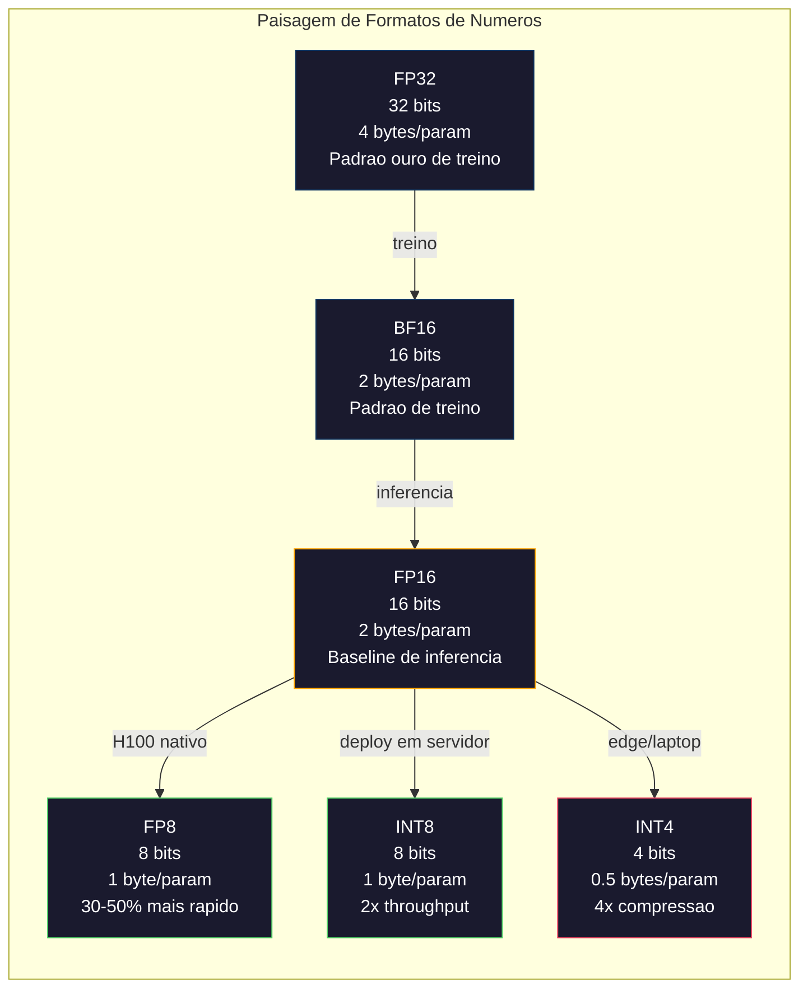
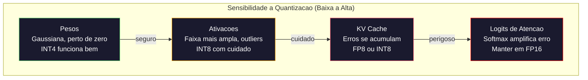
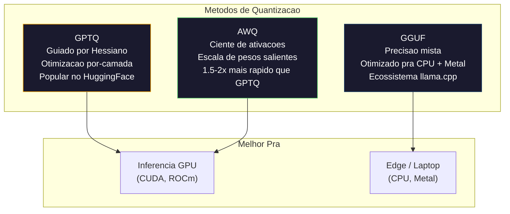

# Quantizacao: Fazendo Modelos Caberem

> Um modelo de 70B em FP16 precisa de 140GB. Duas A100s so pros pesos. Quantize pra FP8: uma GPU de 80GB. INT4: um MacBook.

**Tipo:** Construir
**Linguagens:** Python (com numpy)
**Pre-requisitos:** Fase 10, Aulas 01-10 (LLMs from Scratch)
**Tempo:** ~120 minutos

## Objetivos de Aprendizado

- Implementar quantizacao simetrica e assimetrica de FP16 pra INT8 e INT4, incluindo escala por-tensor e por-canal
- Calcular a economia de memoria da quantizacao e determinar qual precisao cabe na VRAM de uma GPU dada
- Explicar a diferenca entre quantizacao pos-treino (PTQ) e quantizacao-consciente de treino (QAT)
- Aplicar GPTQ ou AWQ pra quantizar um modelo real e medir o tradeoff acuracia-memoria num benchmark

## O Problema

Llama 3 70B tem 70 bilhoes de parametros. Cada parametro e um numero de ponto flutuante de 16 bits. Sao 140 bilhoes de bytes. 140GB. Uma unica A100 tem 80GB de VRAM. Voce nem consegue carregar os pesos, quem dira rodar inferencia, numa unica GPU. Voce precisa de duas A100s a $2/hora cada so pra servir um modelo.

Mas 16 bits por parametro e desperdicio. A maioria dos pesos numa rede neural se agrupa perto de zero. A faixa dinamica completa do FP16 (de 0.000000059 a 65.504) e quase toda inutilizada. Se voce medir a distribuicao real dos pesos no Llama 3 70B, 95% deles ficam entre -0.1 e +0.1. Voce ta queimando 16 bits pra representar valores que caberiam em 4.

Quantizacao substitui numeros de alta precisao por numeros de menor precisao. FP16 pra FP8 corta a memoria pela metade. FP16 pra INT4 corta pra um quarto. Esse modelo de 140GB vira 35GB. Cabe numa GPU consumer. Empurre pra quantizacao de 2-bit (agressiva, com perdas, mas utilizavel pra algumas tarefas) e o mesmo modelo roda num laptop de 16GB.

O custo e acuracia. Cada bit que voce remove destrui informacao. A questao e o quanto de acuracia voce perde e onde. Um modelo INT4 bem quantizado retém 95-99% da qualidade original na maioria dos benchmarks. Uma quantizacao ingenua pra INT4 pode destruir o modelo inteiro. A diferenca e tecnica.

Quantizacoes comunitarias do Llama 3 pra INT4 com GPTQ mostram aproximadamente 1-2 pontos de perplexity perdidos no WikiText. Mistral lanzou checkpoints FP8 do Mixtral 8x22B com zero perda de qualidade mensuravel no MMLU. O formato GGUF alimenta o llama.cpp, rodando modelos de 70B em MacBooks com chips M-series. Quantizacao nao e um hack. E a rota de implantação padrao pra todo modelo maior que 7B.

## O Conceito

### Formatos de Numeros: O Que Cada Bit Faz

Todo numero de ponto flutuante tem tres partes: sinal, expoente e mantissa (tambem chamado significando). O sinal e um bit. O expoente determina a faixa (o quanto o numero pode ser grande ou pequeno). A mantissa determina a precisao (quantas casas decimais voce ganha).

```
FP32:  [1 sinal] [8 expoente] [23 mantissa]  = 32 bits
FP16:  [1 sinal] [5 expoente] [10 mantissa]  = 16 bits
BF16:  [1 sinal] [8 expoente] [7  mantissa]  = 16 bits
FP8:   [1 sinal] [4 expoente] [3  mantissa]  = 8  bits (E4M3)
FP8:   [1 sinal] [5 expoente] [2  mantissa]  = 8  bits (E5M2)
INT8:  [1 sinal] [7 valor]                   = 8  bits (passos uniformes)
INT4:  [1 sinal] [3 valor]                   = 4  bits (16 niveis no total)
```

**FP32** e precisao completa. 23 bits de mantissa dao cerca de 7 digitos decimais de precisao. Faixa: aproximadamente 1.2 x 10^-38 a 3.4 x 10^38. Treinamento costumava acontecer exclusivamente em FP32. Ainda acontece pra acumulacao (somas durante multiplicacao de matrizes).

**FP16** corta os bits pela metade. 10 bits de mantissa dao cerca de 3.3 digitos decimais. O expoente encolhe pra 5 bits, reduzindo drasticamente a faixa (valor maximo ~65.504). Isso funciona pros pesos (que se agrupam perto de zero) mas e perigoso pra ativacoes e gradientes que podem disparar durante treino. Treinamento em FP16 requer loss scaling pra prevenir underflow.

**BF16** (Brain Float 16) mantem o expoente de 8 bits do FP32 mas encolhe a mantissa pra 7 bits. Mesma faixa que FP32, menos precisao que FP16. Google projetou eespecificaçãoificamente pra deep learning. A intuicao: faixa importa mais que precisao pra redes neurais. Um gradiente de 10^-20 que underflow pra zero em FP16 sobrevive em BF16. Um peso de 0.07342 que arredonda pra 0.0734 em BF16 ja ta bom o bastante. Todo treinamento moderno usa BF16 ou uma mistura BF16/FP32.

**FP8** vem em dois sabores. E4M3 (4 expoente, 3 mantissa) e usado pra pesos e ativacoes durante inferencia. E5M2 (5 expoente, 2 mantissa) e usado pra gradientes durante treino onde faixa importa mais que precisao. Inferencia em FP8 em GPUs H100 alcança 30-50% de ganho de velocidade sobre FP16 com perda de qualidade desprezivel.

**INT8** e um formato inteiro. Sem expoente, sem mantissa. So 256 valores uniformemente espacados de -128 a 127. Voce precisa de um fator de escala pra mapear pesos de ponto flutuante nessa faixa. A vantagem: aritmetica inteira e mais rapida e eficiente em energia que ponto flutuante. Multiplicacao de matrizes INT8 num A100 roda a 624 TOPS versus 312 TFLOPS pra FP16.

**INT4** vai mais longe. So 16 valores possiveis. O fator de escala faz o trabalho pesado. A qualidade depende inteiramente de como voce escolhe a escala e quais pesos quantiza. Metodos INT4 state-of-the-art (GPTQ, AWQ) retêm 95%+ da qualidade do modelo original.



### Como a Quantizacao Funciona

A operacao central e simples. Pegue um tensor de valores de ponto flutuante, ache um fator de escala, multiplique, arredonde pro inteiro mais proximo, e armazene os inteiros mais o fator de escala.

**Quantizar:**
```
scale = max(abs(tensor)) / max_int_value
quantized = round(tensor / scale)
```

**Desquantizar:**
```
reconstructed = quantized * scale
```

Pra INT8 com faixa simetrica (-127 a 127):
```
scale = max(abs(tensor)) / 127
quantized = clamp(round(tensor / scale), -128, 127)
```

O erro e o erro de arredondamento. Cada valor pode estar errado por no maximo `scale / 2`. O erro total numa camada depende de quantos pesos voce tem e o quao sensivel o modelo e a perturbacoes nesses pesos.

**Quantizacao por-tensor vs por-canal.** Por-tensor usa um fator de escala pra matriz inteira de pesos. Simples mas com perdas: se uma coluna tem valores grandes e outra tem valores pequenos, os valores pequenos perdem a maior parte da precisao. Por-canal usa um fator de escala por canal de saida (por linha ou coluna da matriz de pesos). Mais overhead (voce armazena N fatores de escala ao inves de 1) mas qualidade dramaticamente melhor. Todo metodo de quantizacao em producao usa por-canal ou granularidade mais fina.

**Quantizacao assimetrica** adiciona um deslocamento zero-point: `quantized = round(tensor / scale) + zero_point`. Isso lida com distribuicoes que nao sao centradas em zero. Ativacoes de ReLU, por exemplo, sao sempre nao-negativas. Quantizacao simetrica desperdica metade da faixa inteira em valores negativos que nunca aparecem. Quantizacao assimetrica mapeia a faixa real [min, max] pra faixa inteira completa.

### Hierarquia de Sensibilidade

Nem tudo num modelo tolera quantizacao igualmente. Existe uma hierarquia clara.

**Pesos (mais robustos).** Pesos de modelo mudam devagar durante treino e seguem uma distribuicao aproximadamente Gaussiana centrada perto de zero. Eles quantizam bem. Pesos INT8 com escalas por-canal produzem resultados praticamente sem perdas. INT4 requer metodos mais sofisticados mas funciona.

**Ativacoes (sensibilidade moderada).** Ativacoes sao os valores intermediarios fluindo pela rede durante inferencia. Eles tem faixa dinamica mais ampla que pesos e contem outliers. Um unico head de atencao pode produzir valores de ativacao 100x maiores que a media. Esses outliers sao criticos pra qualidade do modelo. Quantiza-los ingenuamente destrui informacao. Solucoes: manter canais outliers em precisao mais alta (LLM.int8()), usar escalas de ativacao por-token ou por-canal.

**KV cache (alta sensibilidade).** O cache key-value armazena estados de atencao pra todos os tokens anteriores. Em comprimentos de contexto longos, o KV cache domina a memoria. Pra um modelo de 70B em contexto de 32K, so o KV cache ja e 40GB em FP16. Quantizar o KV cache pra FP8 ou INT8 economiza memoria massiva mas qualquer erro se acumula em todas as futuras computacoes de atencao. O impacto na qualidade escala com o comprimento da sequencia.

**Logits de atencao (mais sensiveis).** O softmax na atencao e altamente sencilvel a pequenas mudancas nas entradas. Um erro de quantizacao de 0.01 num logit pre-softmax pode deslocar significativamente a distribuicao de atencao. A maioria dos esquemas de quantizacao mantem a computacao de atencao em precisao mais alta (FP16 ou BF16) mesmo quando todo o resto e quantizado.



### PTQ vs QAT

**Quantizacao Pos-Treino (PTQ)** quantiza um modelo ja treinado. Sem retreino. Voce pega os pesos FP16, calcula fatores de escala, arredonda e deploya. Rapido (minutos a horas) e barato. Funciona bem pra INT8 e FP8. Pra INT4, PTQ ingenuo frequentemente falha porque erros de arredondamento se acumulam. Metodos PTQ avancados (GPTQ, AWQ) usam dados de calibracao pra minimizar o erro de quantizacao.

**Quantizacao-Consciente de Treino (QAT)** insere operacoes de quantizacao falsa no forward pass durante treino. O modelo aprende a colocar seus pesos onde erros de arredondamento sao pequenos. Gradientes fluem pela quantizacao falsa usando o estimador straight-through (STE): finge que a operacao de arredondamento tem gradiente 1. QAT produz melhores modelos INT4 e INT2 que PTQ mas requer um treinamento completo. Google usou QAT pro servimento eficiente do Gemini. Meta usou QAT pra alguns alvos de implantação do Llama.

| Aespecificaçãoto | PTQ | QAT |
|--------|-----|-----|
| Custo | Minutos a horas | Treinamento completo |
| Qualidade em INT8 | Excelente (< 0.1% de perda) | Excelente |
| Qualidade em INT4 | Boa com GPTQ/AWQ (1-3% de perda) | Melhor (< 1% de perda) |
| Qualidade em INT2 | Ruim | Util pra algumas tarefas |
| Dados de calibracao | 128-1024 exemplos | Dataset completo de treino |
| Quando usar | Deploy, iteracao | Maxima qualidade em baixa largura de bit |

### GPTQ, AWQ, GGUF

**GPTQ (GPT Quantization)** e um metodo PTQ one-shot. Ele quantiza pesos uma camada por vez, usando um pequeno dataset de calibracao (128 exemplos e tipico) pra medir o Hessiano (informacao de segunda ordem sobre o quao sensivel a saida e a cada peso). Pesos que o Hessiano diz ser importantes sao quantizados com mais cuidado. GPTQ foi o primeiro metodo a tornar quantizacao INT4 pratico pra LLMs. TheBloke no Hugging Face popularizou GPTQ lancando versoes quantizadas de centenas de modelos.

**AWQ (Activation-Aware Weight Quantization)** observa que uma pequena fracao de pesos (cerca de 1%) e desproporcionalmente importante porque se multiplica com grandes valores de ativacao. AWQ identifica esses pesos salientes usando dados de calibracao e escala pra cima antes da quantizacao (depois escala as ativacoes correspondentes pra baixo). Isso mantem os pesos importantes numa faixa onde quantizacao INT4 e precisa. AWQ tipicamente iguala ou levemente supera qualidade do GPTQ sendo 1.5-2x mais rapido pra aplicar.

**GGUF (GPT-Generated Unified Format)** e o formato de arquivo usado pelo llama.cpp e seu ecossistema. Suporta quantizacao mista: diferentes camadas ganham diferentes larguras de bit. As primeiras e ultimas camadas (embedding e cabeca de saida) tipicamente sao mantidas em precisao mais alta. Camadas intermediarias ganham INT4 ou INT3. Arquivos GGUF sao autocontidos: pesos, tokenizer, metadata tudo num arquivo. O formato e projetado pra inferencia CPU e Apple Silicon, onde carregar o modelo inteiro na memoria e rodar multiplicacoes de matrizes na CPU ou GPU Metal e a rota padrao. Q4_K_M e a variante GGUF de quantizacao mais popular, balanceando qualidade e tamanho.



### Medicao de Qualidade

Como voce sabe se seu modelo quantizado ainda ta bom?

**Perplexity.** A metrica mais comum. Menor e melhor. Compute perplexity num dataset de validacao (WikiText-2 e padrao) pro modelo original e o quantizado. O delta te diz quanta informacao a quantizacao destruiu. Regras gerais: delta < 0.5 e excelente, 0.5-1.0 e bom, 1.0-2.0 e aceitavel pra maioria das tarefas, > 2.0 significa que algo deu errado.

**Benchmarks eespecificaçãoificos por tarefa.** Rode o modelo quantizado no MMLU, HumanEval, GSM8K ou sua suite de avaliacao customizada. Compare com o original. Quantizacao afeta capacidades diferentes de forma desigual. Tarefas de matematica e codigo sao mais sensiveis a perda de precisao que conhecimento geral.

**Comparacao de saidas.** Gere respostas de ambos os modelos nos mesmos prompts e compare. LLM-as-judge (Aula 10) funciona bem aqui. Compute uma taxa de vitoria: que fracao de prompts o modelo quantizado iguala ou supera o original?

**Latencia e throughput.** Quantizacao existe pra fazer modelos mais rapidos e baratos. Meça tokens por segundo, tempo ate o primeiro token e uso de memoria. Um modelo quantizado que e mais lento que o original e pior que inutil.

| Modelo | Formato | Tamanho | Perplexity (WikiText-2) | MMLU | Tokens/sec (A100) |
|-------|--------|------|------------------------|------|-------------------|
| Llama 3 70B | FP16 | 140GB | 3.12 | 79.5% | 38 |
| Llama 3 70B | FP8 | 70GB | 3.14 | 79.3% | 55 |
| Llama 3 70B | GPTQ INT4 | 35GB | 4.32 | 77.8% | 72 |
| Llama 3 70B | AWQ INT4 | 35GB | 4.18 | 78.1% | 75 |
| Llama 3 70B | GGUF Q4_K_M | 40GB | 4.25 | 77.9% | 28 (CPU) |

O padrao: FP8 e praticamente gratis. INT4 custa 1-2 pontos de MMLU mas dobra throughput e reduz memoria pra um quarto. O tradeoff vale a pena pra quase todo deploy.

### Numeros Reais

FP16 pra FP8 em H100: 30-50% de ganho de velocidade em inferencia, < 0.1% de perda de qualidade. Essa e a quantizacao obvia. Todo implantação H100 deveria usar.

FP16 pra INT8 (LLM.int8()): 2x de reducao de memoria, < 0.5% de perda de qualidade. A abordagem de precisao mista mantem features outliers em FP16 enquanto quantiza todo o resto pra INT8.

FP16 pra INT4 (GPTQ/AWQ): 4x de reducao de memoria, 1-3% de perda de qualidade dependendo do modelo e metodo. Permite modelos de 70B numa GPU de 48GB.

FP16 pra INT4 (GGUF Q4_K_M): 3.5x de reducao de memoria, 1-2% de perda de qualidade. Otimizado pra inferencia CPU. Um modelo de 70B em Q4_K_M e cerca de 40GB e roda a 10-15 tokens/segundo num M3 Max com 64GB.

FP16 pra INT2: 8x de reducao de memoria, 5-15% de perda de qualidade. So viavel pra tarefas eespecificaçãoificas estreitas onde voce tolera degradacao. Fronteira de pesquisa, nao pronto pra producao de uso geral.

## Construir

### Etapa 1: Representacoes de Formato de Numeros

Construa a representacao bit-a-bit de cada formato pra ver exatamente o que sinal, expoente e mantissa fazem.

```python
import numpy as np


def float_to_fp32_bits(value):
    bits = np.float32(value).view(np.uint32)
    sign = (bits >> 31) & 1
    exponent = (bits >> 23) & 0xFF
    mantissa = bits & 0x7FFFFF
    return {"sign": int(sign), "exponent": int(exponent), "mantissa": int(mantissa),
            "exponent_bits": format(int(exponent), '08b'),
            "mantissa_bits": format(int(mantissa), '023b'),
            "value": float(value),
            "actual_exponent": int(exponent) - 127}


def float_to_fp16_bits(value):
    fp16 = np.float16(value)
    bits = fp16.view(np.uint16)
    sign = (bits >> 15) & 1
    exponent = (bits >> 10) & 0x1F
    mantissa = bits & 0x3FF
    return {"sign": int(sign), "exponent": int(exponent), "mantissa": int(mantissa),
            "exponent_bits": format(int(exponent), '05b'),
            "mantissa_bits": format(int(mantissa), '010b'),
            "value": float(fp16),
            "actual_exponent": int(exponent) - 15}


def float_to_bf16_bits(value):
    fp32_bits = np.float32(value).view(np.uint32)
    bf16_bits = (fp32_bits >> 16).astype(np.uint16)
    sign = (bf16_bits >> 15) & 1
    exponent = (bf16_bits >> 7) & 0xFF
    mantissa = bf16_bits & 0x7F
    reconstructed = np.uint32(bf16_bits.astype(np.uint32) << 16).view(np.float32)
    return {"sign": int(sign), "exponent": int(exponent), "mantissa": int(mantissa),
            "exponent_bits": format(int(exponent), '08b'),
            "mantissa_bits": format(int(mantissa), '07b'),
            "value": float(reconstructed),
            "actual_exponent": int(exponent) - 127}


def simulate_fp8_e4m3(value):
    sign = 1 if value < 0 else 0
    abs_val = abs(value)
    max_val = 448.0
    abs_val = min(abs_val, max_val)
    if abs_val == 0:
        return {"sign": sign, "exponent": 0, "mantissa": 0, "value": 0.0,
                "exponent_bits": "0000", "mantissa_bits": "000"}
    exp = int(np.floor(np.log2(abs_val)))
    exp = max(-6, min(8, exp))
    mantissa_val = abs_val / (2.0 ** exp) - 1.0
    mantissa_quant = round(mantissa_val * 8) / 8
    mantissa_quant = max(0, min(0.875, mantissa_quant))
    reconstructed = (1.0 + mantissa_quant) * (2.0 ** exp)
    if sign:
        reconstructed = -reconstructed
    mantissa_int = int(round(mantissa_quant * 8))
    return {"sign": sign, "exponent": exp + 7, "mantissa": mantissa_int,
            "exponent_bits": format(exp + 7, '04b'),
            "mantissa_bits": format(mantissa_int, '03b'),
            "value": float(reconstructed),
            "actual_exponent": exp}


def display_format_comparison(value):
    fp32 = float_to_fp32_bits(value)
    fp16 = float_to_fp16_bits(value)
    bf16 = float_to_bf16_bits(value)
    fp8 = simulate_fp8_e4m3(value)

    print(f"\n  Value: {value}")
    print(f"  {'Format':<8} {'Stored Value':>14} {'Error':>12} {'Sign':>5} {'Exp Bits':>10} {'Man Bits':>25}")
    print(f"  {'-'*76}")
    print(f"  {'FP32':<8} {fp32['value']:>14.6f} {abs(fp32['value'] - value):>12.8f} {fp32['sign']:>5} {fp32['exponent_bits']:>10} {fp32['mantissa_bits']:>25}")
    print(f"  {'FP16':<8} {fp16['value']:>14.6f} {abs(fp16['value'] - value):>12.8f} {fp16['sign']:>5} {fp16['exponent_bits']:>10} {fp16['mantissa_bits']:>25}")
    print(f"  {'BF16':<8} {bf16['value']:>14.6f} {abs(bf16['value'] - value):>12.8f} {bf16['sign']:>5} {bf16['exponent_bits']:>10} {bf16['mantissa_bits']:>25}")
    print(f"  {'FP8e4m3':<8} {fp8['value']:>14.6f} {abs(fp8['value'] - value):>12.8f} {fp8['sign']:>5} {fp8['exponent_bits']:>10} {fp8['mantissa_bits']:>25}")
```

### Etapa 2: Quantizacao Simetrica (Por-Tensor e Por-Canal)

As operacoes fundamentais de quantizacao. Por-tensor usa uma escala pra matriz inteira. Por-canal usa uma escala por linha ou coluna.

```python
def quantize_symmetric(tensor, num_bits=8):
    qmin = -(2 ** (num_bits - 1))
    qmax = 2 ** (num_bits - 1) - 1
    abs_max = np.max(np.abs(tensor))
    if abs_max == 0:
        return np.zeros_like(tensor, dtype=np.int32), 1.0
    scale = abs_max / qmax
    quantized = np.clip(np.round(tensor / scale), qmin, qmax).astype(np.int32)
    return quantized, float(scale)


def dequantize_symmetric(quantized, scale):
    return quantized.astype(np.float64) * scale


def quantize_per_channel(tensor, num_bits=8, axis=0):
    qmin = -(2 ** (num_bits - 1))
    qmax = 2 ** (num_bits - 1) - 1

    if axis == 0:
        abs_max = np.max(np.abs(tensor), axis=1, keepdims=True)
    else:
        abs_max = np.max(np.abs(tensor), axis=0, keepdims=True)

    abs_max = np.where(abs_max == 0, 1.0, abs_max)
    scales = abs_max / qmax
    quantized = np.clip(np.round(tensor / scales), qmin, qmax).astype(np.int32)
    return quantized, scales.squeeze()


def dequantize_per_channel(quantized, scales, axis=0):
    if axis == 0:
        return quantized.astype(np.float64) * scales.reshape(-1, 1)
    else:
        return quantized.astype(np.float64) * scales.reshape(1, -1)


def quantize_asymmetric(tensor, num_bits=8):
    qmin = 0
    qmax = 2 ** num_bits - 1
    t_min = np.min(tensor)
    t_max = np.max(tensor)
    if t_max == t_min:
        return np.zeros_like(tensor, dtype=np.int32), 1.0, 0
    scale = (t_max - t_min) / (qmax - qmin)
    zero_point = int(np.round(qmin - t_min / scale))
    zero_point = max(qmin, min(qmax, zero_point))
    quantized = np.clip(np.round(tensor / scale + zero_point), qmin, qmax).astype(np.int32)
    return quantized, float(scale), int(zero_point)


def dequantize_asymmetric(quantized, scale, zero_point):
    return (quantized.astype(np.float64) - zero_point) * scale
```

### Etapa 3: Medicao de Qualidade

Meça quanta informacao a quantizacao destruiu. Erro quadratico medio, razao sinal-ruido e similaridade cosseno entre tensores original e reconstruido.

```python
def quantization_error(original, reconstructed):
    diff = original - reconstructed
    mse = float(np.mean(diff ** 2))
    rmse = float(np.sqrt(mse))
    max_error = float(np.max(np.abs(diff)))
    signal_power = float(np.mean(original ** 2))
    snr_db = 10 * np.log10(signal_power / max(mse, 1e-20))

    orig_flat = original.flatten()
    recon_flat = reconstructed.flatten()
    norm_orig = np.linalg.norm(orig_flat)
    norm_recon = np.linalg.norm(recon_flat)
    if norm_orig == 0 or norm_recon == 0:
        cosine_sim = 0.0
    else:
        cosine_sim = float(np.dot(orig_flat, recon_flat) / (norm_orig * norm_recon))

    return {"mse": mse, "rmse": rmse, "max_error": max_error,
            "snr_db": float(snr_db), "cosine_similarity": cosine_sim}


def compare_quantization_methods(tensor, num_bits=8):
    q_pt, s_pt = quantize_symmetric(tensor, num_bits)
    recon_pt = dequantize_symmetric(q_pt, s_pt)
    err_pt = quantization_error(tensor, recon_pt)

    q_pc, s_pc = quantize_per_channel(tensor, num_bits, axis=0)
    recon_pc = dequantize_per_channel(q_pc, s_pc, axis=0)
    err_pc = quantization_error(tensor, recon_pc)

    q_asym, s_asym, zp = quantize_asymmetric(tensor, num_bits)
    recon_asym = dequantize_asymmetric(q_asym, s_asym, zp)
    err_asym = quantization_error(tensor, recon_asym)

    print(f"\n  Quantization Comparison ({num_bits}-bit, tensor shape {tensor.shape}):")
    print(f"  {'Method':<20} {'MSE':>12} {'SNR (dB)':>10} {'Cosine Sim':>12} {'Max Error':>12}")
    print(f"  {'-'*68}")
    print(f"  {'Per-tensor sym':<20} {err_pt['mse']:>12.8f} {err_pt['snr_db']:>10.2f} {err_pt['cosine_similarity']:>12.8f} {err_pt['max_error']:>12.8f}")
    print(f"  {'Per-channel sym':<20} {err_pc['mse']:>12.8f} {err_pc['snr_db']:>10.2f} {err_pc['cosine_similarity']:>12.8f} {err_pc['max_error']:>12.8f}")
    print(f"  {'Asymmetric':<20} {err_asym['mse']:>12.8f} {err_asym['snr_db']:>10.2f} {err_asym['cosine_similarity']:>12.8f} {err_asym['max_error']:>12.8f}")

    return {"per_tensor": err_pt, "per_channel": err_pc, "asymmetric": err_asym}
```

### Etapa 4: Varredura de Largura de Bit

Quantize o mesmo tensor em diferentes larguras de bit (2, 3, 4, 8, 16) e meça a qualidade em cada nivel. Isso mostra exatamente onde o cliff de qualidade ta.

```python
def bit_width_sweep(tensor):
    print(f"\n  Bit-Width Sweep (tensor shape {tensor.shape}):")
    print(f"  {'Bits':>6} {'Levels':>8} {'MSE':>14} {'SNR (dB)':>10} {'Cosine Sim':>12} {'Compression':>12}")
    print(f"  {'-'*64}")

    results = []
    for bits in [2, 3, 4, 8, 16]:
        q, s = quantize_per_channel(tensor, bits, axis=0)
        recon = dequantize_per_channel(q, s, axis=0)
        err = quantization_error(tensor, recon)
        levels = 2 ** bits
        compression = 32.0 / bits

        print(f"  {bits:>6} {levels:>8} {err['mse']:>14.8f} {err['snr_db']:>10.2f} {err['cosine_similarity']:>12.8f} {compression:>11.1f}x")
        results.append({"bits": bits, "levels": levels, "error": err, "compression": compression})

    return results
```

### Etapa 5: Experimento de Sensibilidade

Simule quantizar partes diferentes de um transformer e meça quais componentes sao mais sensiveis. Isso demonstra a hierarquia de sensibilidade: pesos < ativacoes < KV cache < atencao.

```python
def simulate_transformer_layer(input_data, weights, kv_scale=1.0):
    hidden = input_data @ weights["qkv"]
    seq_len = hidden.shape[1]
    d_model = weights["qkv"].shape[1] // 3
    q, k, v = hidden[:, :, :d_model], hidden[:, :, d_model:2*d_model], hidden[:, :, 2*d_model:]

    attn_scores = (q @ k.transpose(0, 2, 1)) / np.sqrt(d_model) * kv_scale
    attn_max = np.max(attn_scores, axis=-1, keepdims=True)
    attn_exp = np.exp(attn_scores - attn_max)
    attn_weights = attn_exp / np.sum(attn_exp, axis=-1, keepdims=True)

    attn_output = attn_weights @ v
    output = attn_output @ weights["out"]
    return output, {"q": q, "k": k, "v": v, "attn_scores": attn_scores,
                    "attn_weights": attn_weights, "attn_output": attn_output}


def sensitivity_experiment(batch_size=2, seq_len=16, d_model=64, num_bits=8):
    np.random.seed(42)
    input_data = np.random.randn(batch_size, seq_len, d_model) * 0.1

    weights = {
        "qkv": np.random.randn(d_model, 3 * d_model) * (2.0 / d_model) ** 0.5,
        "out": np.random.randn(d_model, d_model) * (2.0 / d_model) ** 0.5,
    }

    baseline_output, baseline_internals = simulate_transformer_layer(input_data, weights)

    experiments = {}

    q_qkv, s_qkv = quantize_per_channel(weights["qkv"], num_bits, axis=0)
    q_out, s_out = quantize_per_channel(weights["out"], num_bits, axis=0)
    quantized_weights = {
        "qkv": dequantize_per_channel(q_qkv, s_qkv, axis=0),
        "out": dequantize_per_channel(q_out, s_out, axis=0),
    }
    weight_quant_output, _ = simulate_transformer_layer(input_data, quantized_weights)
    experiments["Weights only"] = quantization_error(baseline_output, weight_quant_output)

    _, fresh_internals = simulate_transformer_layer(input_data, weights)
    q_act, s_act = quantize_per_channel(
        fresh_internals["attn_output"].reshape(-1, d_model), num_bits, axis=0
    )
    quant_attn_out = dequantize_per_channel(q_act, s_act, axis=0).reshape(batch_size, seq_len, d_model)
    act_quant_output = quant_attn_out @ weights["out"]
    experiments["Activations only"] = quantization_error(baseline_output, act_quant_output)

    q_k, s_k = quantize_per_channel(fresh_internals["k"].reshape(-1, d_model), num_bits, axis=0)
    q_v, s_v = quantize_per_channel(fresh_internals["v"].reshape(-1, d_model), num_bits, axis=0)
    quant_k = dequantize_per_channel(q_k, s_k, axis=0).reshape(batch_size, seq_len, d_model)
    quant_v = dequantize_per_channel(q_v, s_v, axis=0).reshape(batch_size, seq_len, d_model)
    attn_scores_kv = (fresh_internals["q"] @ quant_k.transpose(0, 2, 1)) / np.sqrt(d_model)
    attn_max_kv = np.max(attn_scores_kv, axis=-1, keepdims=True)
    attn_exp_kv = np.exp(attn_scores_kv - attn_max_kv)
    attn_weights_kv = attn_exp_kv / np.sum(attn_exp_kv, axis=-1, keepdims=True)
    kv_quant_output = (attn_weights_kv @ quant_v) @ weights["out"]
    experiments["KV cache only"] = quantization_error(baseline_output, kv_quant_output)

    noise_scale = np.std(fresh_internals["attn_scores"]) * 0.05
    noisy_scores = fresh_internals["attn_scores"] + np.random.randn(*fresh_internals["attn_scores"].shape) * noise_scale
    noisy_max = np.max(noisy_scores, axis=-1, keepdims=True)
    noisy_exp = np.exp(noisy_scores - noisy_max)
    noisy_weights = noisy_exp / np.sum(noisy_exp, axis=-1, keepdims=True)
    attn_quant_output = (noisy_weights @ fresh_internals["v"]) @ weights["out"]
    experiments["Attention logits (5% noise)"] = quantization_error(baseline_output, attn_quant_output)

    print(f"\n  Sensitivity Experiment ({num_bits}-bit quantization):")
    print(f"  {'Component':<30} {'MSE':>14} {'SNR (dB)':>10} {'Cosine Sim':>12}")
    print(f"  {'-'*68}")
    for name, err in sorted(experiments.items(), key=lambda x: x[1]["mse"]):
        print(f"  {name:<30} {err['mse']:>14.8f} {err['snr_db']:>10.2f} {err['cosine_similarity']:>12.8f}")

    return experiments
```

### Etapa 6: GPTQ Simulado

GPTQ quantiza uma coluna por vez, usando o Hessiano pra decidir como distribuir o erro de arredondamento. Essa e uma versao simplificada que captura a ideia central: use dados de calibracao pra medir a importancia dos pesos, depois quantize os pesos menos importantes mais agressivamente.

```python
def simulated_gptq(weight_matrix, calibration_inputs, num_bits=4):
    n_in, n_out = weight_matrix.shape
    qmin = -(2 ** (num_bits - 1))
    qmax = 2 ** (num_bits - 1) - 1

    H = np.zeros((n_in, n_in))
    for x in calibration_inputs:
        x = x.reshape(-1, 1) if x.ndim == 1 else x
        for row in range(x.shape[0]):
            xi = x[row].reshape(-1, 1)
            H += xi @ xi.T
    H /= len(calibration_inputs)
    H += np.eye(n_in) * 1e-4

    weight_importance = np.diag(H)

    quantized = np.zeros_like(weight_matrix, dtype=np.int32)
    scales = np.zeros(n_out)
    errors = np.zeros(n_out)

    W = weight_matrix.copy()

    for col in range(n_out):
        w_col = W[:, col]
        abs_max = np.max(np.abs(w_col))
        if abs_max == 0:
            scales[col] = 1.0
            continue
        scale = abs_max / qmax
        scales[col] = scale

        q_col = np.clip(np.round(w_col / scale), qmin, qmax).astype(np.int32)
        quantized[:, col] = q_col

        quant_error = w_col - q_col * scale
        errors[col] = np.sqrt(np.mean(quant_error ** 2))

        if col < n_out - 1:
            importance_weights = weight_importance / (np.max(weight_importance) + 1e-10)
            for next_col in range(col + 1, min(col + 4, n_out)):
                compensation = quant_error * importance_weights * 0.1
                W[:, next_col] += compensation

    return quantized, scales, {"column_errors": errors,
                               "mean_error": float(np.mean(errors)),
                               "max_error": float(np.max(errors))}


def dequantize_gptq(quantized, scales):
    result = np.zeros_like(quantized, dtype=np.float64)
    for col in range(quantized.shape[1]):
        result[:, col] = quantized[:, col] * scales[col]
    return result
```

### Etapa 7: Simulacao AWQ

AWQ identifica pesos salientes (aqueles que se multiplicam com grandes ativacoes) e os protege escalando antes da quantizacao.

```python
def simulated_awq(weight_matrix, calibration_inputs, num_bits=4, salient_fraction=0.01):
    n_in, n_out = weight_matrix.shape
    qmin = -(2 ** (num_bits - 1))
    qmax = 2 ** (num_bits - 1) - 1

    activation_magnitudes = np.zeros(n_in)
    for x in calibration_inputs:
        if x.ndim == 1:
            activation_magnitudes += np.abs(x)
        else:
            activation_magnitudes += np.mean(np.abs(x), axis=0)
    activation_magnitudes /= len(calibration_inputs)

    n_salient = max(1, int(n_in * salient_fraction))
    salient_indices = np.argsort(activation_magnitudes)[-n_salient:]

    scale_factors = np.ones(n_in)
    for idx in salient_indices:
        col_max = np.max(np.abs(weight_matrix[idx, :]))
        if col_max > 0:
            scale_factors[idx] = min(4.0, 1.0 / (col_max + 1e-8) * np.mean(np.abs(weight_matrix)))

    scaled_weights = weight_matrix * scale_factors.reshape(-1, 1)

    quantized, scales = quantize_per_channel(scaled_weights, num_bits, axis=0)
    dequantized = dequantize_per_channel(quantized, scales, axis=0)

    result = dequantized / scale_factors.reshape(-1, 1)

    err = quantization_error(weight_matrix, result)

    return result, {"salient_indices": salient_indices,
                    "scale_factors": scale_factors[salient_indices],
                    "error": err,
                    "n_salient": n_salient}
```

### Etapa 8: Pipeline Completo

Conecte tudo. Compare quantizacao ingenua, por-canal, GPTQ e AWQ na mesma matriz de pesos.

```python
def full_quantization_comparison(d_in=256, d_out=512, num_bits=4, n_calibration=32):
    np.random.seed(42)

    weight = np.random.randn(d_in, d_out) * 0.02
    outlier_rows = np.random.choice(d_in, size=5, replace=False)
    weight[outlier_rows] *= 10

    calibration = [np.random.randn(8, d_in) * 0.1 for _ in range(n_calibration)]

    q_naive, s_naive = quantize_symmetric(weight, num_bits)
    recon_naive = dequantize_symmetric(q_naive, s_naive)
    err_naive = quantization_error(weight, recon_naive)

    q_pc, s_pc = quantize_per_channel(weight, num_bits, axis=0)
    recon_pc = dequantize_per_channel(q_pc, s_pc, axis=0)
    err_pc = quantization_error(weight, recon_pc)

    q_gptq, s_gptq, gptq_info = simulated_gptq(weight, calibration, num_bits)
    recon_gptq = dequantize_gptq(q_gptq, s_gptq)
    err_gptq = quantization_error(weight, recon_gptq)

    recon_awq, awq_info = simulated_awq(weight, calibration, num_bits)
    err_awq = awq_info["error"]

    print(f"\n  Full Quantization Comparison ({num_bits}-bit, {d_in}x{d_out} matrix)")
    print(f"  Matrix has {len(outlier_rows)} outlier rows (10x scale)")
    print()
    print(f"  {'Method':<20} {'MSE':>14} {'SNR (dB)':>10} {'Cosine Sim':>12}")
    print(f"  {'-'*58}")
    print(f"  {'Naive per-tensor':<20} {err_naive['mse']:>14.8f} {err_naive['snr_db']:>10.2f} {err_naive['cosine_similarity']:>12.8f}")
    print(f"  {'Per-channel':<20} {err_pc['mse']:>14.8f} {err_pc['snr_db']:>10.2f} {err_pc['cosine_similarity']:>12.8f}")
    print(f"  {'Simulated GPTQ':<20} {err_gptq['mse']:>14.8f} {err_gptq['snr_db']:>10.2f} {err_gptq['cosine_similarity']:>12.8f}")
    print(f"  {'Simulated AWQ':<20} {err_awq['mse']:>14.8f} {err_awq['snr_db']:>10.2f} {err_awq['cosine_similarity']:>12.8f}")

    test_input = np.random.randn(4, d_in) * 0.1
    baseline = test_input @ weight
    output_naive = test_input @ recon_naive
    output_pc = test_input @ recon_pc
    output_gptq = test_input @ recon_gptq
    output_awq = test_input @ recon_awq

    print(f"\n  End-to-End Output Error (matmul with test input):")
    print(f"  {'Method':<20} {'Output MSE':>14} {'Output Cosine':>14}")
    print(f"  {'-'*50}")
    for name, output in [("Naive", output_naive), ("Per-channel", output_pc),
                          ("GPTQ", output_gptq), ("AWQ", output_awq)]:
        out_err = quantization_error(baseline, output)
        print(f"  {name:<20} {out_err['mse']:>14.8f} {out_err['cosine_similarity']:>14.8f}")

    return {"naive": err_naive, "per_channel": err_pc, "gptq": err_gptq, "awq": err_awq}


def memory_calculator(num_params_billions, bits_per_param):
    bytes_per_param = bits_per_param / 8
    total_bytes = num_params_billions * 1e9 * bytes_per_param
    total_gb = total_bytes / (1024 ** 3)
    return total_gb


def print_memory_table():
    print("\n  Memory Requirements by Model and Precision:")
    print(f"  {'Model':<15} {'FP32':>8} {'FP16':>8} {'FP8':>8} {'INT8':>8} {'INT4':>8} {'INT2':>8}")
    print(f"  {'-'*64}")
    for name, params in [("7B", 7), ("13B", 13), ("34B", 34), ("70B", 70), ("405B", 405)]:
        fp32 = memory_calculator(params, 32)
        fp16 = memory_calculator(params, 16)
        fp8 = memory_calculator(params, 8)
        int8 = memory_calculator(params, 8)
        int4 = memory_calculator(params, 4)
        int2 = memory_calculator(params, 2)
        print(f"  {name:<15} {fp32:>7.1f}G {fp16:>7.1f}G {fp8:>7.1f}G {int8:>7.1f}G {int4:>7.1f}G {int2:>7.1f}G")


if __name__ == "__main__":
    np.random.seed(42)

    print("=" * 70)
    print("QUANTIZATION: MAKING MODELS FIT")
    print("=" * 70)

    print("\nSTEP 1: Number Format Comparison")
    print("-" * 50)
    for val in [0.1, 3.14159, -0.00073, 42.5, 0.0000012]:
        display_format_comparison(val)

    print("\n\nSTEP 2: Memory Requirements")
    print("-" * 50)
    print_memory_table()

    print("\n\nSTEP 3: Quantization Methods Comparison")
    print("-" * 50)
    weight_matrix = np.random.randn(128, 256) * 0.02
    weight_matrix[0] *= 15
    weight_matrix[42] *= 8
    compare_quantization_methods(weight_matrix, num_bits=8)
    compare_quantization_methods(weight_matrix, num_bits=4)

    print("\n\nSTEP 4: Bit-Width Sweep")
    print("-" * 50)
    sweep_tensor = np.random.randn(64, 128) * 0.05
    bit_width_sweep(sweep_tensor)

    print("\n\nSTEP 5: Sensitivity Experiment")
    print("-" * 50)
    print("\n  INT8:")
    sensitivity_experiment(num_bits=8)
    print("\n  INT4:")
    sensitivity_experiment(num_bits=4)

    print("\n\nSTEP 6: GPTQ vs AWQ vs Naive (INT4)")
    print("-" * 50)
    full_quantization_comparison(d_in=256, d_out=512, num_bits=4)

    print("\n\nSTEP 7: Distribution Analysis")
    print("-" * 50)
    np.random.seed(0)
    simulated_weights = np.random.randn(1000) * 0.02
    abs_vals = np.abs(simulated_weights)
    pct_in_range = np.mean(abs_vals < 0.1) * 100
    print(f"\n  Simulated weight distribution (1000 params, std=0.02):")
    print(f"  Weights in [-0.1, 0.1]: {pct_in_range:.1f}%")
    print(f"  Weights in [-0.05, 0.05]: {np.mean(abs_vals < 0.05) * 100:.1f}%")
    print(f"  Weights in [-0.01, 0.01]: {np.mean(abs_vals < 0.01) * 100:.1f}%")
    print(f"  Max absolute value: {np.max(abs_vals):.6f}")
    print(f"  Mean absolute value: {np.mean(abs_vals):.6f}")

    histogram = np.histogram(simulated_weights, bins=20)
    print(f"\n  Weight histogram:")
    max_count = max(histogram[0])
    for i in range(len(histogram[0])):
        bar_len = int(histogram[0][i] / max_count * 40)
        lo = histogram[1][i]
        hi = histogram[1][i + 1]
        print(f"  [{lo:>7.4f}, {hi:>7.4f}] {'#' * bar_len} ({histogram[0][i]})")

    print("\n\n" + "=" * 70)
    print("DONE")
    print("=" * 70)
```

## Usar

### Quantizando com AutoGPTQ

```python
# pip install auto-gptq transformers
# from auto_gptq import AutoGPTQForCausalLM, BaseQuantizeConfig
# from transformers import AutoTokenizer
#
# model_id = "meta-llama/Llama-3.1-8B"
# quantize_config = BaseQuantizeConfig(
#     bits=4,
#     group_size=128,
#     desc_act=False,
# )
#
# tokenizer = AutoTokenizer.from_pretrained(model_id)
# model = AutoGPTQForCausalLM.from_pretrained(model_id, quantize_config)
#
# calibration = [tokenizer(t, return_tensors="pt") for t in calibration_texts[:128]]
# model.quantize(calibration)
# model.save_quantized("llama-8b-gptq-int4")
```

### Quantizando com AutoAWQ

```python
# pip install autoawq
# from awq import AutoAWQForCausalLM
# from transformers import AutoTokenizer
#
# model_id = "meta-llama/Llama-3.1-8B"
# model = AutoAWQForCausalLM.from_pretrained(model_id)
# tokenizer = AutoTokenizer.from_pretrained(model_id)
#
# model.quantize(tokenizer, quant_config={"zero_point": True, "q_group_size": 128, "w_bit": 4})
# model.save_quantized("llama-8b-awq-int4")
```

### Convertendo pra GGUF

```bash
# pip install llama-cpp-python
# python convert_hf_to_gguf.py meta-llama/Llama-3.1-8B --outtype q4_k_m --outfile llama-8b-q4km.gguf
# llama-server -m llama-8b-q4km.gguf -c 4096 -ngl 99
```

### Servindo com vLLM

```python
# pip install vllm
# vllm serve model-awq --quantization awq --dtype half --max-model-len 8192
```

vLLM suporta nativamente modelos AWQ e GPTQ. Ele lida com a desquantizacao durante multiplicacao de matrizes e usa paged attention pro KV cache. Pra FP8 em H100, adicione `--dtype float8_e4m3fn`.

## Publicar

Essa aula produz `outputs/skill-quantization.md`, um framework de decisao pra escolher a estrategia de quantizacao certa. Dado seu tamanho de modelo, hardware alvo e requisitos de qualidade, ele te diz qual formato, metodo e passos de validacao usar. Inclui calculos de orcamento de memoria, recomendacoes de precisao por-componente e receitas de implantação pra vLLM, llama.cpp e TensorRT-LLM.

## Exercicios

1. Implemente quantizacao em grupo. Ao inves de uma escala por canal, use uma escala por grupo de 128 pesos dentro de um canal. E isso que GPTQ e AWQ realmente usam. Compare tamanhos de grupo de 32, 64, 128 e 256 na mesma matriz de pesos. Grupos menores dao melhor qualidade mas mais overhead de armazenamento pra fatores de escala.

2. Construa um quantizador de precisao mista. Quantize as primeiras e ultimas camadas de uma rede multicamada em INT8 enquanto quantiza camadas intermediarias em INT4. Compare a qualidade de saida ponta a ponta contra INT4 uniforme e INT8 uniforme. Meça a economia de memoria comparado a tudo-INT8.

3. Implemente o estimador straight-through (STE) pra quantizacao-consciente de treino. Insira operacoes de quantizacao/desquantizacao falsas no forward pass de uma rede simples de duas camadas treinada numa tarefa de regressao. Compare a perda final entre um modelo treinado normalmente (depois PTQ pra INT4) vs um modelo treinado com QAT desde o inicio.

4. Construa um quantizador consciente de outliers inspirado no LLM.int8(). Detecte canais onde a magnitude de ativacao excede 6x a media. Mantenha esses canais em FP16 e quantize todo o resto pra INT8. Meça a qualidade ponta a ponta na camada de transformer da Etapa 5 com limiares de outlier variados (3x, 6x, 10x).

5. Implemente um dashboard de qualidade de quantizacao. Dada uma matriz de pesos, compute e exiba: o histograma de distribuicao de pesos, a distribuicao de erro de quantizacao, fatores de escala por-canal, os canais piores quantizados (maior erro de reconstrucao) e a similaridade cosseno entre saidas original e quantizada em 100 entradas aleatorias. Identifique quais canais devem ser mantidos em precisao mais alta.

## Termos Chave

| Termo | O que a gente diz | O que realmente significa |
|------|----------------|----------------------|
| FP16 | "Precisao media" | Float de 16 bits com 5 bits de expoente e 10 bits de mantissa, valor maximo 65.504, formato padrao de inferencia |
| BF16 | "Brain float" | Float de 16 bits com 8 bits de expoente (mesma faixa que FP32) e 7 bits de mantissa, projetado pelo Google pra treino |
| FP8 | "Float de oito bits" | Duas variantes: E4M3 (inferencia, mais precisao) e E5M2 (treino, mais faixa), nativo em H100 |
| INT8 | "Inteiro de oito bits" | 256 valores uniformemente espacados de -128 a 127, precisa de fator de escala pra mapear de floats |
| INT4 | "Inteiro de quatro bits" | 16 niveis no total, requer metodos sofisticados (GPTQ, AWQ) pra manter qualidade |
| Quantizacao por-canal | "Uma escala por linha" | Usa um fator de escala separado pra cada canal de saida ao inves de um pro tensor inteiro, reduz dramaticamente o erro |
| GPTQ | "O metodo Hessiano" | Quantizacao pos-treino usando informacao de segunda ordem pra minimizar erro de saida, uma camada por vez |
| AWQ | "Ciente de ativacoes" | Escala pesos salientes (aqueles multiplicados por grandes ativacoes) antes da quantizacao pra protege-los |
| GGUF | "O formato do llama.cpp" | Arquivo de modelo autocontido com camadas de precisao mista, otimizado pra inferencia CPU e Apple Silicon |
| PTQ | "Quantizar pos-treino" | Converter pesos de um modelo treinado pra menor precisao sem retreino, rapido mas limitado em compressao extrema |
| QAT | "Quantizar durante treino" | Inserir quantizacao falsa no forward pass pra que o modelo aprenda a tolerar arredondamento, melhor em INT4/INT2 |
| Dados de calibracao | "Os 128 exemplos" | Um pequeno dataset rodado pelo modelo pra computar estatisticas de ativacao pra definir fatores de escala |
| Fator de escala | "O multiplicador" | Converte entre faixa de ponto flutuante e faixa inteira: `float_val = int_val * scale` |
| Delta de perplexity | "O quanto piorou" | Diferenca de perplexity entre modelo original e quantizado, < 0.5 e excelente, > 2.0 e problema |

## Leitura Complementar

- [Frantar et al., 2022 -- "GPTQ: Accurate Post-Training Quantization for Generative Pre-trained Transformers"](https://arxiv.org/abs/2210.17323) -- o paper que tornou quantizacao INT4 pratico pra LLMs usando arredondamento de pesos guiado por Hessiano
- [Lin et al., 2023 -- "AWQ: Activation-aware Weight Quantization for LLM Compression and Acceleration"](https://arxiv.org/abs/2306.00978) -- proteger pesos salientes escalando antes da quantizacao, igualando ou batendo GPTQ
- [Dettmers et al., 2022 -- "LLM.int8(): 8-bit Matrix Multiplication for Transformers at Scale"](https://arxiv.org/abs/2208.07339) -- INT8 de precisao mista que mantem features outliers em FP16, permitindo inferencia INT8 sem perda de qualidade
- [Xiao et al., 2023 -- "SmoothQuant: Accurate and Efficient Post-Training Quantization for Large Language Models"](https://arxiv.org/abs/2211.10438) -- migrar a dificuldade de quantizacao de ativacoes pra pesos pra implantação W8A8
- [Micikevicius et al., 2022 -- "FP8 Formats for Deep Learning"](https://arxiv.org/abs/2209.05433) -- o paper NVIDIA/ARM/Intel definindo formatos E4M3 e E5M2 agora nativos em H100
