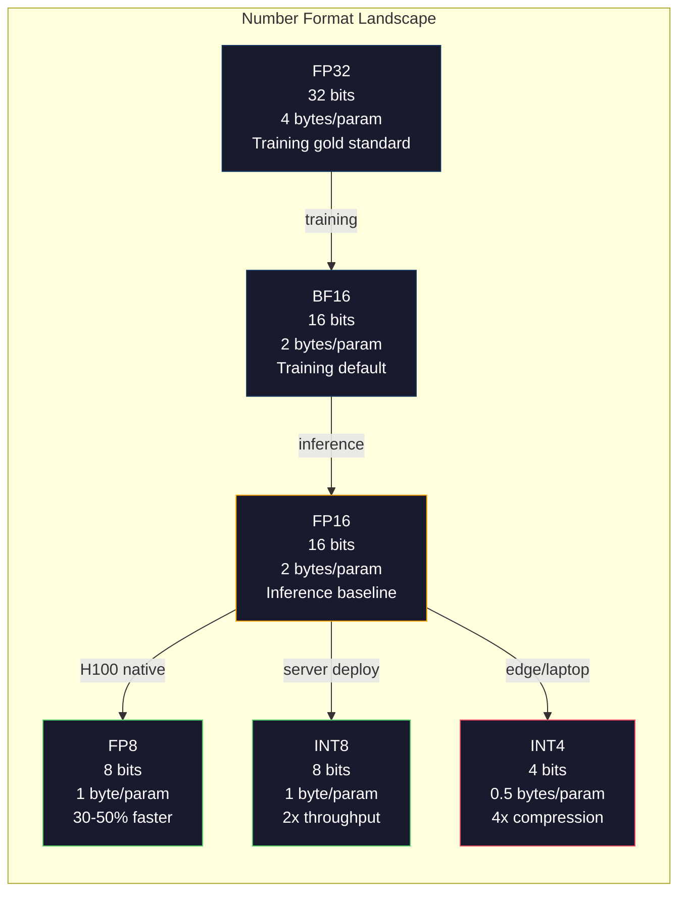
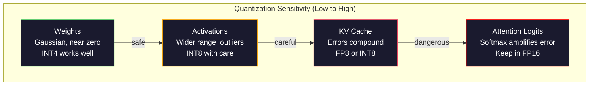
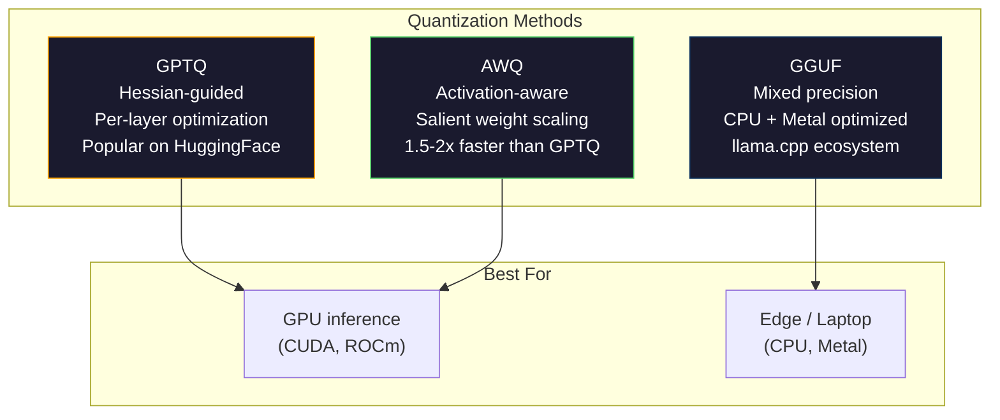

# Niceleme: Modelleri Uygun Hale Getirme

> FP16'daki 70B modelinin 140 GB'a ihtiyacı vardır. Sadece ağırlıklar için iki A100. FP8'e niceleme: bir adet 80 GB GPU. INT4: bir MacBook.

**Tür:** Yapım
**Diller:** Python (numpy ile)
**Önkoşullar:** Aşama 10, Dersler 01-10 (Sıfırdan Yüksek Lisans)
**Süre:** ~120 dakika

## Öğrenme Hedefleri

- Tensör başına ve kanal başına ölçeklendirme dahil olmak üzere FP16'dan INT8 ve INT4'e simetrik ve asimetrik nicemleme uygulayın
- Nicelemeden elde edilen bellek tasarrufunu hesaplayın ve belirli bir GPU'nun VRAM'ına hangi hassasiyetin uyduğunu belirleyin
- Eğitim sonrası kuantizasyon (PTQ) ile kuantizasyona duyarlı eğitim (QAT) arasındaki farkı açıklayın
- Gerçek bir modeli nicelemek ve benchmark üzerinde doğruluk-bellek dengesini ölçmek için GPTQ veya AWQ uygulayın

## Sorun

Llama 3 70B'nin 70 milyar parametresi vardır. Her parametre 16 bitlik kayan noktalı bir sayıdır. Bu 140 milyar bayttır. 140GB. Tek bir A100'de 80 GB VRAM bulunur. Bırakın inference'yi tek bir GPU'da çalıştırmayı, ağırlıkları bile yükleyemezsiniz. Sadece bir modele hizmet verebilmek için her biri saat başına 2 ABD doları olan iki A100'e ihtiyacınız var.

Ancak parametre başına 16 bit israftır. neural network kümesindeki çoğu ağırlık sıfıra yakındır. FP16'nın tam dinamik aralığı (0,000000059'dan 65.504'e kadar) neredeyse tamamen kullanılmamaktadır. Llama 3 70B'deki ağırlıkların gerçek dağılımını ölçerseniz %95'inin -0,1 ile +0,1 arasında olduğunu görürsünüz. 4'e sığabilecek değerleri temsil etmek için 16 bit yazıyorsunuz.

Niceleme, yüksek hassasiyetli sayıları daha düşük hassasiyetli olanlarla değiştirir. FP16'dan FP8'e kadar bellek yarı yarıya azalır. FP16'dan INT4'e geçiş bunu dörtte bire indiriyor. 140 GB olan model 35 GB oluyor. Tek bir tüketici GPU'suna sığar. 2 bitlik nicelemeye itin (agresif, kayıplı, ancak bazı görevler için kullanılabilir) ve aynı model 16 GB'lık bir dizüstü bilgisayarda çalışır.

Maliyet doğruluktur. Kaldırdığınız her parça bilgiyi yok eder. Soru, doğruluğu ne kadar ve nerede kaybettiğinizdir. İyi nicelenmiş bir INT4 modeli, çoğu benchmark'de orijinalin kalitesinin %95-99'unu korur. INT4'e yönelik saf bir nicemleme, modeli tamamen yok edebilir. Fark tekniktir.

GPTQ ile Llama 3'ten INT4'e kadar olan topluluk nicemlemeleri, WikiText'te kabaca 1-2 şaşkınlık noktasının kaybolduğunu gösteriyor. Mistral, Mixtral 8x22B'nin FP8 kontrol noktalarını MMLU'da sıfır ölçülebilir kalite kaybıyla yayınladı. GGUF formatı, M serisi çiplere sahip MacBook'larda 70B modellerini çalıştıran llama.cpp'ye güç verir. Niceleme bir hack değildir. 7B'den büyük her model için standart deployment yoludur.

## Konsept

### Sayı Formatları: Her Bit Ne Yapar?

Her kayan noktalı sayının üç bölümü vardır: işaret, üs ve mantis (aynı zamanda anlamlı olarak da adlandırılır). İşaret bir bit. Üs aralığı (sayı ne kadar büyük veya küçük olabilir) belirler. Mantis kesinliği (kaç ondalık basamak alacağınızı) belirler.

```
FP32:  [1 sign] [8 exponent] [23 mantissa]  = 32 bits
FP16:  [1 sign] [5 exponent] [10 mantissa]  = 16 bits
BF16:  [1 sign] [8 exponent] [7  mantissa]  = 16 bits
FP8:   [1 sign] [4 exponent] [3  mantissa]  = 8  bits (E4M3)
FP8:   [1 sign] [5 exponent] [2  mantissa]  = 8  bits (E5M2)
INT8:  [1 sign] [7 value]                   = 8  bits (uniform steps)
INT4:  [1 sign] [3 value]                   = 4  bits (16 levels total)
```

**FP32** tam hassasiyettir. 23 mantis biti size yaklaşık 7 ondalık basamak hassasiyeti verir. Aralık: kabaca 1,2 x 10^-38 ila 3,4 x 10^38. Eğitim eskiden yalnızca FP32'de yapılıyordu. Bu hala birikim için geçerli (matris çarpımı sırasında toplamları çalıştırmak).

**FP16** bitleri yarıya indirir. 10 mantis biti yaklaşık 3,3 ondalık basamak verir. Üs 5 bit'e küçülerek aralığı önemli ölçüde azaltır (maksimum değer ~65.504). Bu, (sıfıra yakın kümelenen) ağırlıklar için iyidir, ancak eğitim sırasında ani artış gösterebilecek aktivasyonlar ve gradient'ler için tehlikelidir. FP16 eğitimi, yetersiz akışı önlemek için kayıp ölçeklendirmeyi gerektirir.

**BF16** (Brain Float 16), FP32'deki 8 bitlik üssü korur ancak mantisi 7 bit'e kadar küçültür. FP32 ile aynı aralık, FP16'dan daha az hassasiyet. Google bunu özellikle deep learning için tasarladı. Sezgi: neural network'ler için aralık hassasiyetten daha önemlidir. FP16'da sıfıra düşen 10^-20 gradient, BF16'da varlığını sürdürüyor. BF16'da 0,0734'e yuvarlanan 0,07342'lik ağırlık yeterince yakındır. Her modern antrenman koşusu BF16 veya BF16/FP32 karışımını kullanır.

**FP8** iki farklı şekilde gelir. inference sırasındaki ağırlıklar ve aktivasyonlar için E4M3 (4 üs, 3 mantis) kullanılır. Menzilin hassasiyetten daha önemli olduğu eğitim sırasında gradient'ler için E5M2 (5 üs, 2 mantis) kullanılır. H100 GPU'lardaki FP8 inference, ihmal edilebilir kalite kaybıyla FP16'ya göre %30-50 hıza ulaşır.

**INT8** bir tamsayı biçimidir. Üs yok, mantis yok. -128'den 127'ye kadar yalnızca 256 eşit aralıklı değer. Kayan nokta ağırlıklarını bu aralığa eşlemek için bir ölçek faktörüne ihtiyacınız vardır. Avantajı: tamsayı aritmetiği, kayan nokta aritmetiğine göre daha hızlıdır ve güç açısından daha verimlidir. A100'de INT8 matris çarpımı FP16 için 312 TFLOPS'a karşılık 624 TOPS'ta çalışır.

**INT4** daha da ileri gidiyor. Yalnızca 16 olası değer. Ölçek faktörü ağır yük taşır. Kalite tamamen ölçeği nasıl seçtiğinize ve hangi ağırlıkları ölçtüğünüze bağlıdır. En son teknolojiye sahip INT4 yöntemleri (GPTQ, AWQ), orijinal model kalitesinin %95'ini korur.



### Niceleme Nasıl Çalışır?

Çekirdek işlemi basittir. Kayan nokta değerlerinin tensörünü alın, bir ölçek faktörü bulun, çarpın, en yakın tam sayıya yuvarlayın ve tam sayıları artı ölçek faktörünü saklayın.

**Kuantize etme:**
```
scale = max(abs(tensor)) / max_int_value
quantized = round(tensor / scale)
```

**Kuantizasyondan arındırma:**
```
reconstructed = quantized * scale
```

Simetrik aralığa (-127 ila 127) sahip INT8 için:
```
scale = max(abs(tensor)) / 127
quantized = clamp(round(tensor / scale), -128, 127)
```

Hata yuvarlama hatasıdır. Her değer en fazla `scale / 2` kadar kapalı olabilir. Bir katmandaki toplam hata, kaç ağırlığa sahip olduğunuza ve modelin bu ağırlıklardaki bozulmalara ne kadar duyarlı olduğuna bağlıdır.

**Tensör başına ve kanal başına niceleme karşılaştırması.** Tensör başına, ağırlık matrisinin tamamı için bir ölçek faktörü kullanır. Basit ama kayıplı: Bir sütunda büyük değerler, diğerinde ise küçük değerler varsa, küçük değerler hassasiyetlerinin çoğunu kaybeder. Kanal başına, çıkış kanalı başına bir ölçek faktörü kullanır (ağırlık matrisinin satırı veya sütunu başına). Daha fazla yük (1 yerine N ölçek faktörünü saklarsınız), ancak önemli ölçüde daha iyi kalite. Her üretim nicemleme yöntemi, kanal başına veya daha ince ayrıntı düzeyini kullanır.

**Asimetrik nicemleme** bir sıfır noktası uzaklığı ekler: `quantized = round(tensor / scale) + zero_point`. Bu, sıfırda ortalanmayan dağılımları işler. Örneğin ReLU aktivasyonları her zaman negatif değildir. Simetrik nicemleme, tamsayı aralığının yarısını hiçbir zaman görünmeyen negatif değerlere harcar. Asimetrik nicemleme, gerçek aralığı [min, maksimum] tam tamsayı aralığına eşler.

### Hassasiyet Hiyerarşisi

Bir modeldeki her şey kuantizasyona eşit derecede tolerans göstermez. Açık bir hiyerarşi var.

**Ağırlıklar (en sağlam).** Model ağırlıkları eğitim sırasında yavaşça değişir ve kabaca sıfıra yakın bir Gauss dağılımını takip eder. İyi bir şekilde nicemlenirler. Kanal başına ölçeklere sahip INT8 ağırlıkları neredeyse kayıpsız sonuçlar üretir. INT4 daha karmaşık yöntemler gerektirir ancak işe yarar.

**Etkinleştirmeler (orta düzeyde hassasiyet).** Etkinleştirmeler, inference sırasında ağ üzerinden akan ara değerlerdir. Ağırlıklardan daha geniş dinamik aralığa sahiptirler ve aykırı değerler içerirler. Tek bir dikkat kafası, ortalamadan 100 kat daha büyük aktivasyon değerleri üretebilir. Bu aykırı değerler model kalitesi açısından kritik öneme sahiptir. Bunları nicelemek safça bilgiyi yok eder. Çözümler: Aykırı kanalları daha yüksek hassasiyette tutun (LLM.int8()), token başına veya kanal başına etkinleştirme ölçekleri kullanın.

**KV önbelleği (yüksek hassasiyet).** Anahtar/değer önbelleği, önceki tüm token'lere ilişkin dikkat durumlarını saklar. Uzun bağlam uzunluklarında KV önbelleği belleğe hakim olur. 32K bağlamındaki bir 70B modeli için FP16'da yalnızca KV önbelleği 40 GB'dir. KV önbelleğini FP8 veya INT8'e nicelemek, büyük miktarda bellek tasarrufu sağlar, ancak herhangi bir hata, gelecekteki tüm dikkat hesaplamalarında daha da artar. Kalite etkisi dizi uzunluğuna göre ölçeklenir.

**Dikkat logitleri (en hassas).** Dikkatteki softmax, girişlerindeki küçük değişikliklere karşı oldukça hassastır. Softmax öncesi logitteki 0,01'lik bir niceleme hatası, dikkat dağılımını anlamlı bir şekilde değiştirebilir. Çoğu niceleme şeması, diğer her şey nicelendiğinde bile dikkat hesaplamasını daha yüksek hassasiyette (FP16 veya BF16) tutar.



### PTQ ve QAT

**Eğitim Sonrası Niceleme (PTQ)** önceden eğitilmiş bir modeli nicelendirir. Yeniden eğitim yok. FP16 ağırlıklarını alırsınız, ölçek faktörlerini hesaplarsınız, yuvarlar ve dağıtırsınız. Hızlı (dakikalardan saatlere kadar) ve ucuz. INT8 ve FP8 için iyi çalışır. INT4 için saf PTQ genellikle yuvarlama hatalarının birikmesi nedeniyle kötü bir şekilde başarısız olur. Gelişmiş PTQ yöntemleri (GPTQ, AWQ), niceleme hatasını en aza indirmek için kalibrasyon verilerini kullanır.

**Kuantizasyon Farkındalık Eğitimi (QAT)**, eğitim sırasında ileri geçişe sahte nicemleme işlemleri ekler. Model, ağırlıklarını yuvarlama hatalarının küçük olduğu yerlere yerleştirmeyi öğrenir. Gradient'ler, düz tahmin aracını (STE) kullanarak sahte niceleme üzerinden akar: yuvarlama işleminin gradient 1'e sahip olduğunu varsayalım. QAT, PTQ'dan daha iyi INT4 ve INT2 modelleri üretir ancak tam bir eğitim çalışması gerektirir. Google, Gemini'nin verimli sunumu için QAT'ı kullandı. Meta, bazı Lama deployment hedefleri için QAT kullandı.

| Görünüş | PTQ | QAT |
|--------|-----|-----|
| Maliyet | Dakikadan saate | Tam eğitim koşusu |
| INT8'de Kalite | Mükemmel (< %0,1 kayıp) | Mükemmel |
| INT4'te Kalite | GPTQ/AWQ ile iyi (%1-3 kayıp) | Daha iyi (< %1 kayıp) |
| INT2'de Kalite | Zayıf | Bazı görevler için kullanılabilir |
| Kalibrasyon verileri | 128-1024 örnekler | Tam eğitim dataset |
| Ne zaman kullanılır | Deployment, yineleme | Düşük bit genişliğinde maksimum kalite |

### GPTQ, AWQ, GGUF

**GPTQ (GPT Niceleme)** tek seferlik bir PTQ yöntemidir. Hessian'ı (çıktının her ağırlığa ne kadar duyarlı olduğuna ilişkin ikinci dereceden bilgi) ölçmek için küçük bir dataset kalibrasyonu (tipik olarak 128 örnek) kullanarak ağırlıkları her seferinde bir katman olarak nicemler. Hessian'ın önemli olduğunu söylediği ağırlıklar daha dikkatli bir şekilde ölçülür. GPTQ, INT4 nicelemesini LLM'ler için pratik hale getiren ilk yöntemdi. TheBloke on Hugging Face, yüzlerce modelin sayısallaştırılmış versiyonlarını yayınlayarak GPTQ'yu popüler hale getirdi.

**AWQ (Aktivasyon Farkında Ağırlık Niceleme)**, ağırlıkların küçük bir kısmının (yaklaşık %1) büyük aktivasyon değerleriyle çoğaldıkları için orantısız derecede önemli olduğunu gözlemler. AWQ, kalibrasyon verilerini kullanarak bu belirgin ağırlıkları tanımlar ve nicelemeden önce bunları ölçeklendirir (daha sonra karşılık gelen aktivasyonları ölçeklendirir). Bu, önemli ağırlıkları INT4 nicelemesinin doğru olduğu bir aralıkta tutar. AWQ genellikle GPTQ kalitesiyle eşleşir veya biraz daha üstündür ve uygulanması 1,5-2 kat daha hızlıdır.

**GGUF (GPT Tarafından Oluşturulan Birleştirilmiş Format)**, llama.cpp ve ekosistemi tarafından kullanılan dosya formatıdır. Karışık nicelemeyi destekler: farklı katmanlar farklı bit genişliklerine sahiptir. İlk ve son katmanlar (embedding ve çıkış kafası) genellikle daha yüksek hassasiyette tutulur. Orta katmanlar INT4 veya INT3 alır. GGUF dosyaları bağımsızdır: ağırlıklar, tokenizer, meta veriler hepsi tek bir dosyada. Format, CPU inference ve Apple Silicon için tasarlanmıştır; burada tüm modelin belleğe yüklenmesi ve matris çarpımlarının CPU veya Metal GPU üzerinde çalıştırılması standart yoldur. Q4_K_M, kalite ve boyutu dengeleyen en popüler GGUF niceleme çeşididir.



### Kalite Ölçümü

Nicelenmiş modelinizin hala iyi olup olmadığını nasıl anlarsınız?

**Şaşırma.** En yaygın ölçüm. Daha düşük olması daha iyidir. Hem orijinal hem de nicelenmiş model için uzatılmış bir dataset (WikiText-2 standarttır) üzerinde karmaşıklığı hesaplayın. Delta size nicelemenin ne kadar bilgiyi yok ettiğini söyler. Temel kurallar: delta < 0,5 mükemmel, 0,5-1,0 iyi, 1,0-2,0 çoğu görev için kabul edilebilir, > 2,0 bir şeylerin ters gittiği anlamına gelir.

**Göreve özel benchmark'ler.** Ölçülen modeli MMLU, HumanEval, GSM8K veya özel değerlendirme paketinizde çalıştırın. Orijinaliyle karşılaştırın. Niceleme farklı yetenekleri eşit olmayan şekilde etkiler. Matematik ve kod görevleri, genel bilgiden ziyade hassaslık kaybına daha duyarlıdır.

**Çıktı karşılaştırması.** Aynı prompt'lerde her iki modelden de yanıtlar oluşturun ve karşılaştırın. Hakim olarak Yüksek Lisans (Ders 10) burada iyi işliyor. Kazanma oranını hesaplayın: nicelenen model, prompt'lerin ne kadarında orijinalle eşleşiyor veya onu geçiyor?

**Gecikme ve aktarım hızı.** Modelleri daha hızlı ve daha ucuz hale getirmek için niceliklendirme mevcuttur. Saniye başına token sayısını, ilk token'ye kadar geçen süreyi ve bellek kullanımını ölçün. Orijinalden daha yavaş olan nicelenmiş bir model, işe yaramazdan da kötüdür.

| Modeli | Biçim | Boyut | Şaşkınlık (WikiText-2) | MMLU | Token sn/sn (A100) |
|-------|--------|------|------------------------|------|-------------------|
| Lama 3 70B | FP16 | 140GB | 3.12 | %79,5 | 38 |
| Lama 3 70B | FP8 | 70GB | 3.14 | %79,3 | 55 |
| Lama 3 70B | GPTQ INT4 | 35GB | 4.32 | %77,8 | 72 |
| Lama 3 70B | AWQ INT4 | 35GB | 4.18 | %78,1 | 75 |
| Lama 3 70B | GGUF Q4_K_M | 40GB | 4.25 | %77,9 | 28 (CPU) |

Desen: FP8 neredeyse bedava. INT4'ün maliyeti 1-2 MMLU puanıdır ancak verimi iki katına çıkarır ve belleği dörde böler. Neredeyse her deployment için bu ödünleşime değer.

### Real Numbers

H100'de FP16'dan FP8'e: %30-50 inference hızlanma, < %0,1 kalite kaybı. Bu, hiç akıllıca olmayan bir kuantizasyondur. Her H100 deployment bunu kullanmalıdır.

FP16 - INT8 (LLM.int8()): 2 kat bellek azaltma, < %0,5 kalite kaybı. Karma duyarlıklı yaklaşım, diğer her şeyi INT8'e nicemlerken FP16'daki aykırı özellikleri korur.

FP16 - INT4 (GPTQ/AWQ): 4 kat bellek azaltma, modele ve yönteme bağlı olarak %1-3 kalite kaybı. Tek bir 48 GB GPU'da 70B modellerini etkinleştirir.

FP16 - INT4 (GGUF Q4_K_M): 3,5 kat bellek azaltma, %1-2 kalite kaybı. CPU inference için optimize edilmiştir. Q4_K_M'deki bir 70B modeli yaklaşık 40 GB'dir ve 64 GB'lık M3 Max'te 10-15 token/saniye hızında çalışır.

FP16'dan INT2'ye: 8x bellek azaltma, %5-15 kalite kaybı. Yalnızca bozulmayı tolere edebileceğiniz belirli dar görevler için uygundur. Araştırma sınırı, genel kullanım için üretime hazır değil.

```figure
quantization
```

## İnşa Et

### Adım 1: Sayı Biçimi Gösterimleri

İşaretin, üssün ve mantisin tam olarak ne yaptığını görmek için her formatın bit düzeyinde temsilini oluşturun.

```python
import numpy as np


def float_to_fp32_bits(value):
    bits = np.float32(value).view(np.uint32)
    sign = (bits >> 31) & 1
    exponent = (bits >> 23) & 0xFF
    mantissa = bits & 0x7FFFFF
    return {"sign": int(sign), "exponent": int(exponent), "mantissa": int(mantissa),
            "exponent_bits": format(int(exponent), '08b'),
            "mantissa_bits": format(int(mantissa), '023b'),
            "value": float(value),
            "actual_exponent": int(exponent) - 127}


def float_to_fp16_bits(value):
    fp16 = np.float16(value)
    bits = fp16.view(np.uint16)
    sign = (bits >> 15) & 1
    exponent = (bits >> 10) & 0x1F
    mantissa = bits & 0x3FF
    return {"sign": int(sign), "exponent": int(exponent), "mantissa": int(mantissa),
            "exponent_bits": format(int(exponent), '05b'),
            "mantissa_bits": format(int(mantissa), '010b'),
            "value": float(fp16),
            "actual_exponent": int(exponent) - 15}


def float_to_bf16_bits(value):
    fp32_bits = np.float32(value).view(np.uint32)
    bf16_bits = (fp32_bits >> 16).astype(np.uint16)
    sign = (bf16_bits >> 15) & 1
    exponent = (bf16_bits >> 7) & 0xFF
    mantissa = bf16_bits & 0x7F
    reconstructed = np.uint32(bf16_bits.astype(np.uint32) << 16).view(np.float32)
    return {"sign": int(sign), "exponent": int(exponent), "mantissa": int(mantissa),
            "exponent_bits": format(int(exponent), '08b'),
            "mantissa_bits": format(int(mantissa), '07b'),
            "value": float(reconstructed),
            "actual_exponent": int(exponent) - 127}


def simulate_fp8_e4m3(value):
    sign = 1 if value < 0 else 0
    abs_val = abs(value)
    max_val = 448.0
    abs_val = min(abs_val, max_val)
    if abs_val == 0:
        return {"sign": sign, "exponent": 0, "mantissa": 0, "value": 0.0,
                "exponent_bits": "0000", "mantissa_bits": "000"}
    exp = int(np.floor(np.log2(abs_val)))
    exp = max(-6, min(8, exp))
    mantissa_val = abs_val / (2.0 ** exp) - 1.0
    mantissa_quant = round(mantissa_val * 8) / 8
    mantissa_quant = max(0, min(0.875, mantissa_quant))
    reconstructed = (1.0 + mantissa_quant) * (2.0 ** exp)
    if sign:
        reconstructed = -reconstructed
    mantissa_int = int(round(mantissa_quant * 8))
    return {"sign": sign, "exponent": exp + 7, "mantissa": mantissa_int,
            "exponent_bits": format(exp + 7, '04b'),
            "mantissa_bits": format(mantissa_int, '03b'),
            "value": float(reconstructed),
            "actual_exponent": exp}


def display_format_comparison(value):
    fp32 = float_to_fp32_bits(value)
    fp16 = float_to_fp16_bits(value)
    bf16 = float_to_bf16_bits(value)
    fp8 = simulate_fp8_e4m3(value)

    print(f"\n  Value: {value}")
    print(f"  {'Format':<8} {'Stored Value':>14} {'Error':>12} {'Sign':>5} {'Exp Bits':>10} {'Man Bits':>25}")
    print(f"  {'-'*76}")
    print(f"  {'FP32':<8} {fp32['value']:>14.6f} {abs(fp32['value'] - value):>12.8f} {fp32['sign']:>5} {fp32['exponent_bits']:>10} {fp32['mantissa_bits']:>25}")
    print(f"  {'FP16':<8} {fp16['value']:>14.6f} {abs(fp16['value'] - value):>12.8f} {fp16['sign']:>5} {fp16['exponent_bits']:>10} {fp16['mantissa_bits']:>25}")
    print(f"  {'BF16':<8} {bf16['value']:>14.6f} {abs(bf16['value'] - value):>12.8f} {bf16['sign']:>5} {bf16['exponent_bits']:>10} {bf16['mantissa_bits']:>25}")
    print(f"  {'FP8e4m3':<8} {fp8['value']:>14.6f} {abs(fp8['value'] - value):>12.8f} {fp8['sign']:>5} {fp8['exponent_bits']:>10} {fp8['mantissa_bits']:>25}")
```

### Adım 2: Simetrik Niceleme (Tensör Başına ve Kanal Başına)

Temel kuantizasyon işlemleri. Tensör başına tüm matris için bir ölçek kullanır. Kanal başına, satır veya sütun başına bir ölçek kullanılır.

```python
def quantize_symmetric(tensor, num_bits=8):
    qmin = -(2 ** (num_bits - 1))
    qmax = 2 ** (num_bits - 1) - 1
    abs_max = np.max(np.abs(tensor))
    if abs_max == 0:
        return np.zeros_like(tensor, dtype=np.int32), 1.0
    scale = abs_max / qmax
    quantized = np.clip(np.round(tensor / scale), qmin, qmax).astype(np.int32)
    return quantized, float(scale)


def dequantize_symmetric(quantized, scale):
    return quantized.astype(np.float64) * scale


def quantize_per_channel(tensor, num_bits=8, axis=0):
    qmin = -(2 ** (num_bits - 1))
    qmax = 2 ** (num_bits - 1) - 1

    if axis == 0:
        abs_max = np.max(np.abs(tensor), axis=1, keepdims=True)
    else:
        abs_max = np.max(np.abs(tensor), axis=0, keepdims=True)

    abs_max = np.where(abs_max == 0, 1.0, abs_max)
    scales = abs_max / qmax
    quantized = np.clip(np.round(tensor / scales), qmin, qmax).astype(np.int32)
    return quantized, scales.squeeze()


def dequantize_per_channel(quantized, scales, axis=0):
    if axis == 0:
        return quantized.astype(np.float64) * scales.reshape(-1, 1)
    else:
        return quantized.astype(np.float64) * scales.reshape(1, -1)


def quantize_asymmetric(tensor, num_bits=8):
    qmin = 0
    qmax = 2 ** num_bits - 1
    t_min = np.min(tensor)
    t_max = np.max(tensor)
    if t_max == t_min:
        return np.zeros_like(tensor, dtype=np.int32), 1.0, 0
    scale = (t_max - t_min) / (qmax - qmin)
    zero_point = int(np.round(qmin - t_min / scale))
    zero_point = max(qmin, min(qmax, zero_point))
    quantized = np.clip(np.round(tensor / scale + zero_point), qmin, qmax).astype(np.int32)
    return quantized, float(scale), int(zero_point)


def dequantize_asymmetric(quantized, scale, zero_point):
    return (quantized.astype(np.float64) - zero_point) * scale
```

### Adım 3: Kalite Ölçümü

Kuantizasyon işleminin ne kadar bilgiyi yok ettiğini ölçün. Orijinal ve yeniden yapılandırılmış tensörler arasındaki ortalama kare hata, sinyal-gürültü oranı ve kosinüs benzerliği.

```python
def quantization_error(original, reconstructed):
    diff = original - reconstructed
    mse = float(np.mean(diff ** 2))
    rmse = float(np.sqrt(mse))
    max_error = float(np.max(np.abs(diff)))
    signal_power = float(np.mean(original ** 2))
    snr_db = 10 * np.log10(signal_power / max(mse, 1e-20))

    orig_flat = original.flatten()
    recon_flat = reconstructed.flatten()
    norm_orig = np.linalg.norm(orig_flat)
    norm_recon = np.linalg.norm(recon_flat)
    if norm_orig == 0 or norm_recon == 0:
        cosine_sim = 0.0
    else:
        cosine_sim = float(np.dot(orig_flat, recon_flat) / (norm_orig * norm_recon))

    return {"mse": mse, "rmse": rmse, "max_error": max_error,
            "snr_db": float(snr_db), "cosine_similarity": cosine_sim}


def compare_quantization_methods(tensor, num_bits=8):
    q_pt, s_pt = quantize_symmetric(tensor, num_bits)
    recon_pt = dequantize_symmetric(q_pt, s_pt)
    err_pt = quantization_error(tensor, recon_pt)

    q_pc, s_pc = quantize_per_channel(tensor, num_bits, axis=0)
    recon_pc = dequantize_per_channel(q_pc, s_pc, axis=0)
    err_pc = quantization_error(tensor, recon_pc)

    q_asym, s_asym, zp = quantize_asymmetric(tensor, num_bits)
    recon_asym = dequantize_asymmetric(q_asym, s_asym, zp)
    err_asym = quantization_error(tensor, recon_asym)

    print(f"\n  Quantization Comparison ({num_bits}-bit, tensor shape {tensor.shape}):")
    print(f"  {'Method':<20} {'MSE':>12} {'SNR (dB)':>10} {'Cosine Sim':>12} {'Max Error':>12}")
    print(f"  {'-'*68}")
    print(f"  {'Per-tensor sym':<20} {err_pt['mse']:>12.8f} {err_pt['snr_db']:>10.2f} {err_pt['cosine_similarity']:>12.8f} {err_pt['max_error']:>12.8f}")
    print(f"  {'Per-channel sym':<20} {err_pc['mse']:>12.8f} {err_pc['snr_db']:>10.2f} {err_pc['cosine_similarity']:>12.8f} {err_pc['max_error']:>12.8f}")
    print(f"  {'Asymmetric':<20} {err_asym['mse']:>12.8f} {err_asym['snr_db']:>10.2f} {err_asym['cosine_similarity']:>12.8f} {err_asym['max_error']:>12.8f}")

    return {"per_tensor": err_pt, "per_channel": err_pc, "asymmetric": err_asym}
```

### Adım 4: Bit Genişliği Taraması

Aynı tensörü farklı bit genişliklerinde (2, 3, 4, 8, 16) nicelendirin ve her düzeyde kaliteyi ölçün. Bu da kalite uçurumunun tam olarak nerede olduğunu gösteriyor.

```python
def bit_width_sweep(tensor):
    print(f"\n  Bit-Width Sweep (tensor shape {tensor.shape}):")
    print(f"  {'Bits':>6} {'Levels':>8} {'MSE':>14} {'SNR (dB)':>10} {'Cosine Sim':>12} {'Compression':>12}")
    print(f"  {'-'*64}")

    results = []
    for bits in [2, 3, 4, 8, 16]:
        q, s = quantize_per_channel(tensor, bits, axis=0)
        recon = dequantize_per_channel(q, s, axis=0)
        err = quantization_error(tensor, recon)
        levels = 2 ** bits
        compression = 32.0 / bits

        print(f"  {bits:>6} {levels:>8} {err['mse']:>14.8f} {err['snr_db']:>10.2f} {err['cosine_similarity']:>12.8f} {compression:>11.1f}x")
        results.append({"bits": bits, "levels": levels, "error": err, "compression": compression})

    return results
```

### Adım 5: Hassasiyet Deneyi

Bir transformer'nin farklı parçalarının nicelendirilmesini simüle edin ve hangi bileşenlerin en hassas olduğunu ölçün. Bu, duyarlılık hiyerarşisini gösterir: ağırlıklar < aktivasyonlar < KV önbellek < dikkat.

```python
def simulate_transformer_layer(input_data, weights, kv_scale=1.0):
    hidden = input_data @ weights["qkv"]
    seq_len = hidden.shape[1]
    d_model = weights["qkv"].shape[1] // 3
    q, k, v = hidden[:, :, :d_model], hidden[:, :, d_model:2*d_model], hidden[:, :, 2*d_model:]

    attn_scores = (q @ k.transpose(0, 2, 1)) / np.sqrt(d_model) * kv_scale
    attn_max = np.max(attn_scores, axis=-1, keepdims=True)
    attn_exp = np.exp(attn_scores - attn_max)
    attn_weights = attn_exp / np.sum(attn_exp, axis=-1, keepdims=True)

    attn_output = attn_weights @ v
    output = attn_output @ weights["out"]
    return output, {"q": q, "k": k, "v": v, "attn_scores": attn_scores,
                    "attn_weights": attn_weights, "attn_output": attn_output}


def sensitivity_experiment(batch_size=2, seq_len=16, d_model=64, num_bits=8):
    np.random.seed(42)
    input_data = np.random.randn(batch_size, seq_len, d_model) * 0.1

    weights = {
        "qkv": np.random.randn(d_model, 3 * d_model) * (2.0 / d_model) ** 0.5,
        "out": np.random.randn(d_model, d_model) * (2.0 / d_model) ** 0.5,
    }

    baseline_output, baseline_internals = simulate_transformer_layer(input_data, weights)

    experiments = {}

    q_qkv, s_qkv = quantize_per_channel(weights["qkv"], num_bits, axis=0)
    q_out, s_out = quantize_per_channel(weights["out"], num_bits, axis=0)
    quantized_weights = {
        "qkv": dequantize_per_channel(q_qkv, s_qkv, axis=0),
        "out": dequantize_per_channel(q_out, s_out, axis=0),
    }
    weight_quant_output, _ = simulate_transformer_layer(input_data, quantized_weights)
    experiments["Weights only"] = quantization_error(baseline_output, weight_quant_output)

    _, fresh_internals = simulate_transformer_layer(input_data, weights)
    q_act, s_act = quantize_per_channel(
        fresh_internals["attn_output"].reshape(-1, d_model), num_bits, axis=0
    )
    quant_attn_out = dequantize_per_channel(q_act, s_act, axis=0).reshape(batch_size, seq_len, d_model)
    act_quant_output = quant_attn_out @ weights["out"]
    experiments["Activations only"] = quantization_error(baseline_output, act_quant_output)

    q_k, s_k = quantize_per_channel(fresh_internals["k"].reshape(-1, d_model), num_bits, axis=0)
    q_v, s_v = quantize_per_channel(fresh_internals["v"].reshape(-1, d_model), num_bits, axis=0)
    quant_k = dequantize_per_channel(q_k, s_k, axis=0).reshape(batch_size, seq_len, d_model)
    quant_v = dequantize_per_channel(q_v, s_v, axis=0).reshape(batch_size, seq_len, d_model)
    attn_scores_kv = (fresh_internals["q"] @ quant_k.transpose(0, 2, 1)) / np.sqrt(d_model)
    attn_max_kv = np.max(attn_scores_kv, axis=-1, keepdims=True)
    attn_exp_kv = np.exp(attn_scores_kv - attn_max_kv)
    attn_weights_kv = attn_exp_kv / np.sum(attn_exp_kv, axis=-1, keepdims=True)
    kv_quant_output = (attn_weights_kv @ quant_v) @ weights["out"]
    experiments["KV cache only"] = quantization_error(baseline_output, kv_quant_output)

    noise_scale = np.std(fresh_internals["attn_scores"]) * 0.05
    noisy_scores = fresh_internals["attn_scores"] + np.random.randn(*fresh_internals["attn_scores"].shape) * noise_scale
    noisy_max = np.max(noisy_scores, axis=-1, keepdims=True)
    noisy_exp = np.exp(noisy_scores - noisy_max)
    noisy_weights = noisy_exp / np.sum(noisy_exp, axis=-1, keepdims=True)
    attn_quant_output = (noisy_weights @ fresh_internals["v"]) @ weights["out"]
    experiments["Attention logits (5% noise)"] = quantization_error(baseline_output, attn_quant_output)

    print(f"\n  Sensitivity Experiment ({num_bits}-bit quantization):")
    print(f"  {'Component':<30} {'MSE':>14} {'SNR (dB)':>10} {'Cosine Sim':>12}")
    print(f"  {'-'*68}")
    for name, err in sorted(experiments.items(), key=lambda x: x[1]["mse"]):
        print(f"  {name:<30} {err['mse']:>14.8f} {err['snr_db']:>10.2f} {err['cosine_similarity']:>12.8f}")

    return experiments
```

### Adım 6: Simüle edilmiş GPTQ

GPTQ, yuvarlama hatasının nasıl dağıtılacağına karar vermek için Hessian'ı kullanarak her seferinde bir sütunu niceler. Bu, temel fikri yakalayan basitleştirilmiş bir versiyondur: ağırlığın önemini ölçmek için kalibrasyon verilerini kullanın, ardından en az önemli ağırlıkları daha agresif bir şekilde sayısallaştırın.

```python
def simulated_gptq(weight_matrix, calibration_inputs, num_bits=4):
    n_in, n_out = weight_matrix.shape
    qmin = -(2 ** (num_bits - 1))
    qmax = 2 ** (num_bits - 1) - 1

    H = np.zeros((n_in, n_in))
    for x in calibration_inputs:
        x = x.reshape(-1, 1) if x.ndim == 1 else x
        for row in range(x.shape[0]):
            xi = x[row].reshape(-1, 1)
            H += xi @ xi.T
    H /= len(calibration_inputs)
    H += np.eye(n_in) * 1e-4

    weight_importance = np.diag(H)

    quantized = np.zeros_like(weight_matrix, dtype=np.int32)
    scales = np.zeros(n_out)
    errors = np.zeros(n_out)

    W = weight_matrix.copy()

    for col in range(n_out):
        w_col = W[:, col]
        abs_max = np.max(np.abs(w_col))
        if abs_max == 0:
            scales[col] = 1.0
            continue
        scale = abs_max / qmax
        scales[col] = scale

        q_col = np.clip(np.round(w_col / scale), qmin, qmax).astype(np.int32)
        quantized[:, col] = q_col

        quant_error = w_col - q_col * scale
        errors[col] = np.sqrt(np.mean(quant_error ** 2))

        if col < n_out - 1:
            importance_weights = weight_importance / (np.max(weight_importance) + 1e-10)
            for next_col in range(col + 1, min(col + 4, n_out)):
                compensation = quant_error * importance_weights * 0.1
                W[:, next_col] += compensation

    return quantized, scales, {"column_errors": errors,
                               "mean_error": float(np.mean(errors)),
                               "max_error": float(np.max(errors))}


def dequantize_gptq(quantized, scales):
    result = np.zeros_like(quantized, dtype=np.float64)
    for col in range(quantized.shape[1]):
        result[:, col] = quantized[:, col] * scales[col]
    return result
```

### Adım 7: AWQ Simülasyonu

AWQ, göze çarpan ağırlıkları (büyük aktivasyonlarla çoğalanlar) tanımlar ve bunları nicelemeden önce ölçeklendirerek korur.

```python
def simulated_awq(weight_matrix, calibration_inputs, num_bits=4, salient_fraction=0.01):
    n_in, n_out = weight_matrix.shape
    qmin = -(2 ** (num_bits - 1))
    qmax = 2 ** (num_bits - 1) - 1

    activation_magnitudes = np.zeros(n_in)
    for x in calibration_inputs:
        if x.ndim == 1:
            activation_magnitudes += np.abs(x)
        else:
            activation_magnitudes += np.mean(np.abs(x), axis=0)
    activation_magnitudes /= len(calibration_inputs)

    n_salient = max(1, int(n_in * salient_fraction))
    salient_indices = np.argsort(activation_magnitudes)[-n_salient:]

    scale_factors = np.ones(n_in)
    for idx in salient_indices:
        col_max = np.max(np.abs(weight_matrix[idx, :]))
        if col_max > 0:
            scale_factors[idx] = min(4.0, 1.0 / (col_max + 1e-8) * np.mean(np.abs(weight_matrix)))

    scaled_weights = weight_matrix * scale_factors.reshape(-1, 1)

    quantized, scales = quantize_per_channel(scaled_weights, num_bits, axis=0)
    dequantized = dequantize_per_channel(quantized, scales, axis=0)

    result = dequantized / scale_factors.reshape(-1, 1)

    err = quantization_error(weight_matrix, result)

    return result, {"salient_indices": salient_indices,
                    "scale_factors": scale_factors[salient_indices],
                    "error": err,
                    "n_salient": n_salient}
```

### Adım 8: Tam Boru Hattı

Her şeyi birbirine bağlayın. Saf nicelemeyi, kanal başına, GPTQ ve AWQ'yu aynı ağırlık matrisinde karşılaştırın.

```python
def full_quantization_comparison(d_in=256, d_out=512, num_bits=4, n_calibration=32):
    np.random.seed(42)

    weight = np.random.randn(d_in, d_out) * 0.02
    outlier_rows = np.random.choice(d_in, size=5, replace=False)
    weight[outlier_rows] *= 10

    calibration = [np.random.randn(8, d_in) * 0.1 for _ in range(n_calibration)]

    q_naive, s_naive = quantize_symmetric(weight, num_bits)
    recon_naive = dequantize_symmetric(q_naive, s_naive)
    err_naive = quantization_error(weight, recon_naive)

    q_pc, s_pc = quantize_per_channel(weight, num_bits, axis=0)
    recon_pc = dequantize_per_channel(q_pc, s_pc, axis=0)
    err_pc = quantization_error(weight, recon_pc)

    q_gptq, s_gptq, gptq_info = simulated_gptq(weight, calibration, num_bits)
    recon_gptq = dequantize_gptq(q_gptq, s_gptq)
    err_gptq = quantization_error(weight, recon_gptq)

    recon_awq, awq_info = simulated_awq(weight, calibration, num_bits)
    err_awq = awq_info["error"]

    print(f"\n  Full Quantization Comparison ({num_bits}-bit, {d_in}x{d_out} matrix)")
    print(f"  Matrix has {len(outlier_rows)} outlier rows (10x scale)")
    print()
    print(f"  {'Method':<20} {'MSE':>14} {'SNR (dB)':>10} {'Cosine Sim':>12}")
    print(f"  {'-'*58}")
    print(f"  {'Naive per-tensor':<20} {err_naive['mse']:>14.8f} {err_naive['snr_db']:>10.2f} {err_naive['cosine_similarity']:>12.8f}")
    print(f"  {'Per-channel':<20} {err_pc['mse']:>14.8f} {err_pc['snr_db']:>10.2f} {err_pc['cosine_similarity']:>12.8f}")
    print(f"  {'Simulated GPTQ':<20} {err_gptq['mse']:>14.8f} {err_gptq['snr_db']:>10.2f} {err_gptq['cosine_similarity']:>12.8f}")
    print(f"  {'Simulated AWQ':<20} {err_awq['mse']:>14.8f} {err_awq['snr_db']:>10.2f} {err_awq['cosine_similarity']:>12.8f}")

    test_input = np.random.randn(4, d_in) * 0.1
    baseline = test_input @ weight
    output_naive = test_input @ recon_naive
    output_pc = test_input @ recon_pc
    output_gptq = test_input @ recon_gptq
    output_awq = test_input @ recon_awq

    print(f"\n  End-to-End Output Error (matmul with test input):")
    print(f"  {'Method':<20} {'Output MSE':>14} {'Output Cosine':>14}")
    print(f"  {'-'*50}")
    for name, output in [("Naive", output_naive), ("Per-channel", output_pc),
                          ("GPTQ", output_gptq), ("AWQ", output_awq)]:
        out_err = quantization_error(baseline, output)
        print(f"  {name:<20} {out_err['mse']:>14.8f} {out_err['cosine_similarity']:>14.8f}")

    return {"naive": err_naive, "per_channel": err_pc, "gptq": err_gptq, "awq": err_awq}


def memory_calculator(num_params_billions, bits_per_param):
    bytes_per_param = bits_per_param / 8
    total_bytes = num_params_billions * 1e9 * bytes_per_param
    total_gb = total_bytes / (1024 ** 3)
    return total_gb


def print_memory_table():
    print("\n  Memory Requirements by Model and Precision:")
    print(f"  {'Model':<15} {'FP32':>8} {'FP16':>8} {'FP8':>8} {'INT8':>8} {'INT4':>8} {'INT2':>8}")
    print(f"  {'-'*64}")
    for name, params in [("7B", 7), ("13B", 13), ("34B", 34), ("70B", 70), ("405B", 405)]:
        fp32 = memory_calculator(params, 32)
        fp16 = memory_calculator(params, 16)
        fp8 = memory_calculator(params, 8)
        int8 = memory_calculator(params, 8)
        int4 = memory_calculator(params, 4)
        int2 = memory_calculator(params, 2)
        print(f"  {name:<15} {fp32:>7.1f}G {fp16:>7.1f}G {fp8:>7.1f}G {int8:>7.1f}G {int4:>7.1f}G {int2:>7.1f}G")


if __name__ == "__main__":
    np.random.seed(42)

    print("=" * 70)
    print("QUANTIZATION: MAKING MODELS FIT")
    print("=" * 70)

    print("\nSTEP 1: Number Format Comparison")
    print("-" * 50)
    for val in [0.1, 3.14159, -0.00073, 42.5, 0.0000012]:
        display_format_comparison(val)

    print("\n\nSTEP 2: Memory Requirements")
    print("-" * 50)
    print_memory_table()

    print("\n\nSTEP 3: Quantization Methods Comparison")
    print("-" * 50)
    weight_matrix = np.random.randn(128, 256) * 0.02
    weight_matrix[0] *= 15
    weight_matrix[42] *= 8
    compare_quantization_methods(weight_matrix, num_bits=8)
    compare_quantization_methods(weight_matrix, num_bits=4)

    print("\n\nSTEP 4: Bit-Width Sweep")
    print("-" * 50)
    sweep_tensor = np.random.randn(64, 128) * 0.05
    bit_width_sweep(sweep_tensor)

    print("\n\nSTEP 5: Sensitivity Experiment")
    print("-" * 50)
    print("\n  INT8:")
    sensitivity_experiment(num_bits=8)
    print("\n  INT4:")
    sensitivity_experiment(num_bits=4)

    print("\n\nSTEP 6: GPTQ vs AWQ vs Naive (INT4)")
    print("-" * 50)
    full_quantization_comparison(d_in=256, d_out=512, num_bits=4)

    print("\n\nSTEP 7: Distribution Analysis")
    print("-" * 50)
    np.random.seed(0)
    simulated_weights = np.random.randn(1000) * 0.02
    abs_vals = np.abs(simulated_weights)
    pct_in_range = np.mean(abs_vals < 0.1) * 100
    print(f"\n  Simulated weight distribution (1000 params, std=0.02):")
    print(f"  Weights in [-0.1, 0.1]: {pct_in_range:.1f}%")
    print(f"  Weights in [-0.05, 0.05]: {np.mean(abs_vals < 0.05) * 100:.1f}%")
    print(f"  Weights in [-0.01, 0.01]: {np.mean(abs_vals < 0.01) * 100:.1f}%")
    print(f"  Max absolute value: {np.max(abs_vals):.6f}")
    print(f"  Mean absolute value: {np.mean(abs_vals):.6f}")

    histogram = np.histogram(simulated_weights, bins=20)
    print(f"\n  Weight histogram:")
    max_count = max(histogram[0])
    for i in range(len(histogram[0])):
        bar_len = int(histogram[0][i] / max_count * 40)
        lo = histogram[1][i]
        hi = histogram[1][i + 1]
        print(f"  [{lo:>7.4f}, {hi:>7.4f}] {'#' * bar_len} ({histogram[0][i]})")

    print("\n\n" + "=" * 70)
    print("DONE")
    print("=" * 70)
```

## Kullan onu

### AutoGPTQ ile niceleme

```python
# pip install auto-gptq transformers
# from auto_gptq import AutoGPTQForCausalLM, BaseQuantizeConfig
# from transformers import AutoTokenizer
#
# model_id = "meta-llama/Llama-3.1-8B"
# quantize_config = BaseQuantizeConfig(
#     bits=4,
#     group_size=128,
#     desc_act=False,
# )
#
# tokenizer = AutoTokenizer.from_pretrained(model_id)
# model = AutoGPTQForCausalLM.from_pretrained(model_id, quantize_config)
#
# calibration = [tokenizer(t, return_tensors="pt") for t in calibration_texts[:128]]
# model.quantize(calibration)
# model.save_quantized("llama-8b-gptq-int4")
```

### AutoAWQ ile niceleme

```python
# pip install autoawq
# from awq import AutoAWQForCausalLM
# from transformers import AutoTokenizer
#
# model_id = "meta-llama/Llama-3.1-8B"
# model = AutoAWQForCausalLM.from_pretrained(model_id)
# tokenizer = AutoTokenizer.from_pretrained(model_id)
#
# model.quantize(tokenizer, quant_config={"zero_point": True, "q_group_size": 128, "w_bit": 4})
# model.save_quantized("llama-8b-awq-int4")
```

### GGUF'a dönüştürme

```bash
# pip install llama-cpp-python
# python convert_hf_to_gguf.py meta-llama/Llama-3.1-8B --outtype q4_k_m --outfile llama-8b-q4km.gguf
# llama-server -m llama-8b-q4km.gguf -c 4096 -ngl 99
```

### Nicelenmiş modeller sunma

```python
# pip install vllm
# vllm serve model-awq --quantization awq --dtype half --max-model-len 8192
```

vLLM, yerel olarak AWQ ve GPTQ modellerini destekler. Matris çarpımı sırasında dekuantizasyon işlemini gerçekleştirir ve KV önbelleği için sayfalanmış dikkati kullanır. H100'deki FP8 için `--dtype float8_e4m3fn` ekleyin.

## Gönderin

Bu ders, doğru nicemleme stratejisini seçmek için bir framework kararı olan `outputs/skill-quantization.md`'yi üretir. Model boyutunuz, hedef donanımınız ve kalite gereksinimleriniz dikkate alındığında size hangi formatı, yöntemi ve doğrulama adımlarını kullanacağınızı söyler. Bellek bütçesi hesaplamalarını, bileşen başına hassasiyet önerilerini ve vLLM, llama.cpp ve TensorRT-LLM için deployment tariflerini içerir.

## Egzersizler

1. Grup nicemlemesini uygulayın. Kanal başına bir ölçek yerine, kanal içindeki 128 ağırlıktan oluşan grup başına bir ölçek kullanın. GPTQ ve AWQ'nun gerçekte kullandığı şey budur. Aynı ağırlık matrisinde 32, 64, 128 ve 256'lık grup boyutlarını karşılaştırın. Daha küçük gruplar daha iyi kalite sağlar ancak ölçek faktörleri için daha fazla depolama yükü sağlar.

2. Karışık duyarlıklı bir niceleyici oluşturun. INT4'te orta katmanları nicelleştirirken, çok katmanlı bir ağın ilk ve son katmanlarını INT8'de nicelendirin. Uçtan uca çıktı kalitesini tek tip INT4 ve tek tip INT8 ile karşılaştırın. All-INT8 ile karşılaştırıldığında bellek tasarrufunu ölçün.

3. Kuantizasyona duyarlı eğitim için düz tahmin aracını (STE) uygulayın. Bir regresyon görevi üzerinde eğitilmiş basit iki katmanlı bir ağın ileri geçişine sahte niceleme/dekuantizasyon işlemleri ekleyin. Normal şekilde eğitilmiş bir model (daha sonra PTQ'dan INT4'e) ile başlangıçtan itibaren QAT ile eğitilmiş bir model arasındaki nihai kaybı karşılaştırın.

4. LLM.int8()'den ilham alan, aykırı değerlerin farkında olan bir niceleyici oluşturun. Aktivasyon büyüklüğünün ortalamanın 6 katını aştığı kanalları tespit edin. Bu kanalları FP16'da tutun ve geri kalan her şeyi INT8'e nicemleyin. Değişen aykırı eşiklerle (3x, 6x, 10x) 5. Adımdaki transformer katmanında uçtan uca kaliteyi ölçün.

5. Bir niceleme kalitesi kontrol paneli uygulayın. Bir ağırlık matrisi verildiğinde, hesaplayın ve görüntüleyin: ağırlık dağılım histogramını, niceleme hatası dağılımını, kanal başına ölçek faktörlerini, en kötü nicelenmiş kanalları (en yüksek yeniden yapılandırma hatası) ve 100 rastgele girişte orijinal ve nicelenmiş çıktılar arasındaki kosinüs benzerliğini. Hangi kanalların daha yüksek hassasiyette tutulması gerektiğini belirleyin.

## Anahtar Terimler

| Dönem | İnsanlar ne diyor | Aslında ne anlama geliyor |
|------|----------------|----------------------|
| FP16 | "Yarı hassasiyet" | 5 üs biti ve 10 mantis biti ile 16 bit kayan nokta, maksimum değer 65.504, standart inference formatı |
| BF16 | "Beyin şamandırası" | 8 üs bitli (FP32 ile aynı aralık) ve 7 mantis bitli 16 bit kayan nokta, Google tarafından eğitim amaçlı tasarlandı |
| FP8 | "Sekiz bitlik kayan nokta" | İki varyant: E4M3 (inference, daha fazla hassasiyet) ve E5M2 (eğitim, daha fazla menzil), H100'de yerel |
| INT8 | "Sekiz bitlik tamsayı" | -128'den 127'ye kadar eşit aralıklı 256 değer, kayan noktalardan eşleme için bir ölçek faktörüne ihtiyaç duyar |
| INT4 | "Dört bitlik tamsayı" | Toplam 16 seviye, kaliteyi korumak için gelişmiş yöntemler (GPTQ, AWQ) gerektirir |
| Kanal başına nicemleme | "Satır başına bir ölçek" | Tensörün tamamı için bir ölçek yerine her çıkış kanalı için ayrı bir ölçek faktörü kullanır, hatayı önemli ölçüde azaltır |
| GPTQ | "Hessian yöntemi" | Çıkış hatasını en aza indirmek için her seferinde bir katman olmak üzere ikinci dereceden bilgileri kullanan eğitim sonrası nicemleme |
| AWQ | "Etkinleştirmeden haberdar" | Belirgin ağırlıkları (büyük aktivasyonlarla çarpılmış olanları) korumak için nicelemeden önce ölçeklendirir |
| GGUF | "llama.cpp biçimi" | CPU ve Apple Silicon için optimize edilmiş, karma hassas katmanlara sahip bağımsız model dosyası inference |
| PTQ | "Eğitimden sonra niceleme" | Eğitimli bir modelin ağırlıklarını, yeniden eğitim gerektirmeden hızlı ancak aşırı sıkıştırmada sınırlı olarak daha düşük hassasiyete dönüştürün |
| QAT | "Eğitim sırasında niceleme" | Modelin yuvarlamayı tolere etmeyi öğrenmesi için ileri geçişe sahte niceleme ekleyin, böylece INT4/INT2'de daha iyi olur |
| Kalibrasyon verileri | "128 örnek" | Ölçek faktörlerini ayarlamak için etkinleştirme istatistiklerini hesaplamak üzere model boyunca küçük bir dataset çalıştırılır |
| Ölçek faktörü | "Çarpan" | Kayan nokta aralığı ile tam sayı aralığı arasında dönüştürme yapar: `float_val = int_val * scale` |
| Şaşkınlık deltası | "Ne kadar kötü" | Orijinal ve nicelenmiş model arasındaki şaşkınlık farkı, < 0,5 mükemmel, > 2,0 bir sorundur |

## Daha Fazla Okuma

- [Frantar ve diğerleri, 2022 -- "GPTQ: Üretken Önceden Eğitimli Transformer'ler için Doğru Eğitim Sonrası Niceleme"](https://arxiv.org/abs/2210.17323) -- Hessian kılavuzlu ağırlık yuvarlamayı kullanan LLM'ler için INT4 nicelemesini pratik hale getiren makale
- [Lin ve diğerleri, 2023 -- "AWQ: LLM Sıkıştırma ve Hızlandırma için Etkinleştirme Farkında Ağırlık Nicelemesi"](https://arxiv.org/abs/2306.00978) -- nicelemeden önce ölçeklendirme yaparak, GPTQ'yu eşleştirerek veya yenerek göze çarpan ağırlıkları korur
- [Dettmers ve diğerleri, 2022 -- "LLM.int8(): Transformer'ler için Ölçekte 8-bit Matris Çarpması"](https://arxiv.org/abs/2208.07339) -- FP16'da aykırı özellikleri koruyan ve kalite kaybı olmadan INT8 inference'yi etkinleştiren karma duyarlıklı INT8
- [Xiao ve diğerleri, 2023 -- "SmoothQuant: Büyük Dil Modelleri için Doğru ve Verimli Eğitim Sonrası Niceleme"](https://arxiv.org/abs/2211.10438) -- W8A8 deployment için niceleme zorluğunun aktivasyonlardan ağırlıklara taşınması
- [Micikevicius ve diğerleri, 2022 -- "Deep Learning için FP8 Formatları"](https://arxiv.org/abs/2209.05433) -- E4M3 ve E5M2 formatlarını tanımlayan NVIDIA/ARM/Intel makalesi artık H100'de yereldir
