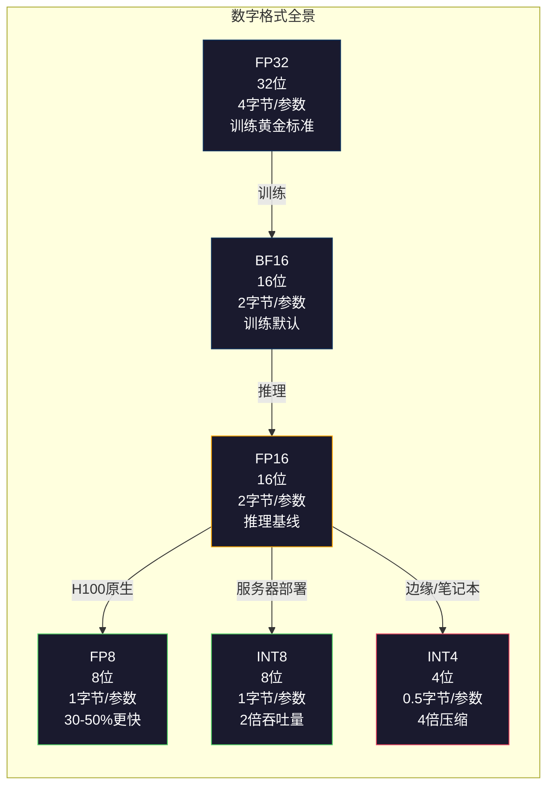
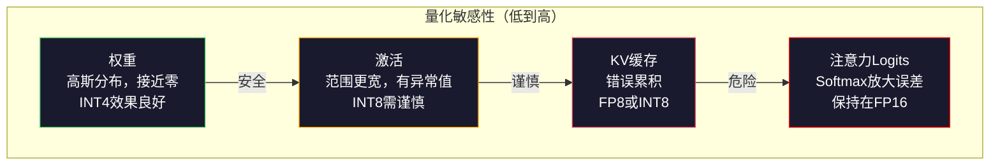
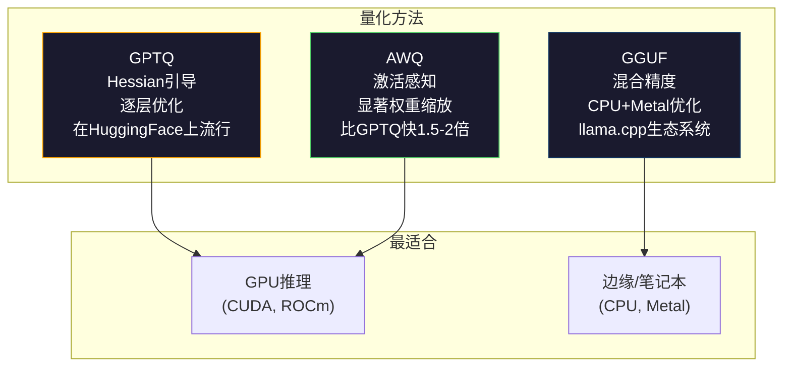

# 量化：让模型适配

> 一个70B的FP16模型需要140GB。仅权重就需要两块A100。量化到FP8：一块80GB GPU。INT4：一台MacBook。

**类型：** 构建
**语言：** Python（使用numpy）
**前置条件：** 第10阶段，第01-10课（从头构建LLM）
**时间：** ~120分钟

## 学习目标

- 实现从FP16到INT8和INT4的对称量化和非对称量化，包括逐张量和逐通道缩放
- 计算量化的内存节省，并确定给定GPU显存适合的精度
- 解释训练后量化（PTQ）与量化感知训练（QAT）的区别
- 使用GPTQ或AWQ对真实模型进行量化，并在基准测试中测量精度-内存权衡

## 问题

Llama 3 70B拥有700亿个参数。每个参数是一个16位浮点数。即1400亿字节。140GB。一块A100有80GB显存。你甚至无法加载权重，更不用说在单块GPU上运行推理了。你需要两块A100，每块每小时2美元，仅仅为了服务一个模型。

但每个参数16位是浪费的。神经网络中的大部分权重集中在零附近。FP16的全部动态范围（从0.000000059到65504）几乎完全未被使用。如果你测量Llama 3 70B中权重的实际分布，95%的权重落在-0.1到+0.1之间。你花16位来表示那些本来可以用4位表示的值。

量化用低精度数字替换高精度数字。FP16到FP8将内存减半。FP16到INT4降至四分之一。那个140GB的模型变成35GB。它适合一块消费级GPU。推到2位量化（激进、有损，但对某些任务可用），同样模型能在16GB笔记本电脑上运行。

代价是精度。你每移除一位，就破坏了信息。问题在于你损失了多少精度以及在哪里。一个良好量化的INT4模型在大多数基准测试上保留了原始质量的95-99%。一个朴素的INT4量化可能完全摧毁模型。区别在于技术。

社区对Llama 3使用GPTQ量化为INT4，在WikiText上大约损失1-2个困惑度（Perplexity）点。Mistral发布了Mixtral 8x22B的FP8检查点，在MMLU上可测量的质量损失为零。GGUF格式为llama.cpp提供支持，在配备M系列芯片的MacBook上运行70B模型。量化不是黑客技巧。它是每个大于7B模型的标准部署路径。

## 概念

### 数字格式：每个位的作用

每个浮点数有三个部分：符号、指数和尾数（也称为有效数）。符号是一位。指数决定范围（数字可以多大或多小）。尾数决定精度（你能得到多少位小数）。

```
FP32:  [1位符号] [8位指数] [23位尾数]  = 32位
FP16:  [1位符号] [5位指数] [10位尾数]  = 16位
BF16:  [1位符号] [8位指数] [7 位尾数]  = 16位
FP8:   [1位符号] [4位指数] [3 位尾数]  = 8 位 (E4M3)
FP8:   [1位符号] [5位指数] [2 位尾数]  = 8 位 (E5M2)
INT8:  [1位符号] [7位值]                = 8 位 (均匀步长)
INT4:  [1位符号] [3位值]                = 4 位 (共16个等级)
```

**FP32** 是全精度。23位尾数给你大约7位十进制数字的精度。范围：大约1.2 x 10^-38 到 3.4 x 10^38。训练曾经完全在FP32中进行。现在累积（矩阵乘法过程中的运行求和）仍然如此。

**FP16** 将位数减半。10位尾数提供大约3.3位十进制数字。指数缩小到5位，大大减小了范围（最大值约65504）。这对权重（集中在零附近）没问题，但对训练中可能激增的激活和梯度来说是危险的。FP16训练需要损失缩放以防止下溢。

**BF16**（脑浮点16）保留FP32的8位指数，但将尾数缩小到7位。与FP32相同的范围，精度低于FP16。Google专门为深度学习设计了它。直觉：对于神经网络，范围比精度更重要。一个10^-20的梯度在FP16中下溢为零，在BF16中得以存活。一个0.07342的权重在BF16中四舍五入到0.0734就足够接近了。每个现代训练运行都使用BF16或BF16/FP32混合。

**FP8** 有两种形式。E4M3（4指数，3尾数）用于推理期间的权重和激活。E5M2（5指数，2尾数）用于训练期间的梯度，此时范围比精度更重要。在H100 GPU上进行FP8推理相对于FP16实现了30-50%的加速，质量损失可忽略。

**INT8** 是整数格式。没有指数，没有尾数。只有256个均匀间隔的值从-128到127。你需要一个缩放因子将浮点权重映射到这个范围。优点：整数算术比浮点算术更快且更节能。A100上的INT8矩阵乘法以624 TOPS运行，而FP16为312 TFLOPS。

**INT4** 进一步推进。只有16个可能值。缩放因子承担重任。质量完全取决于你如何选择缩放以及量化哪些权重。最先进的INT4方法（GPTQ，AWQ）保留了95%以上的原始模型质量。



### 量化如何工作

核心操作很简单。取一个浮点张量，找到一个缩放因子，相乘，四舍五入到最近的整数，然后存储整数加上缩放因子。

**量化：**
```
scale = max(abs(tensor)) / max_int_value
quantized = round(tensor / scale)
```

**反量化：**
```
reconstructed = quantized * scale
```

对于具有对称范围（-127到127）的INT8：
```
scale = max(abs(tensor)) / 127
quantized = clamp(round(tensor / scale), -128, 127)
```

误差是舍入误差。每个值最多可能偏离 `scale / 2`。整个层的总误差取决于你拥有多少个权重以及模型对这些权重的扰动有多敏感。

**逐张量 vs 逐通道量化。** 逐张量对整个权重矩阵使用一个缩放因子。简单但有损：如果一列有大值而另一列有小值，小值会损失大部分精度。逐通道对每个输出通道（权重矩阵的每行或每列）使用一个缩放因子。开销更大（你存储N个缩放因子而不是1个），但质量显著更好。每个生产级量化方法都使用逐通道或更细粒度。

**非对称量化** 添加一个零点偏移：`quantized = round(tensor / scale) + zero_point`。这处理不以零为中心的分布。例如，ReLU激活总是非负的。对称量化浪费了整数范围的一半给从未出现的负值。非对称量化将实际范围[min, max]映射到整个整数范围。

### 敏感性层级

模型中并非所有部分都能同样承受量化。有一个清晰的层级。

**权重（最稳健）。** 模型权重在训练期间变化缓慢，遵循大致以零为中心的高斯分布。它们量化良好。使用逐通道缩放的INT8权重产生几乎无损的结果。INT4需要更复杂的方法但可行。

**激活（中等敏感度）。** 激活是推理期间流经网络的中间值。它们比权重具有更宽的动态范围，并且包含异常值。单个注意力头可能产生比均值大100倍的激活值。这些异常值对模型质量至关重要。朴素的量化会破坏信息。解决方案：将异常通道保持在更高精度（LLM.int8()），使用逐token或逐通道激活缩放。

**KV缓存（高敏感度）。** 键值缓存存储所有先前token的注意力状态。在长上下文长度下，KV缓存主导内存。对于一个32K上下文的70B模型，KV缓存本身在FP16中就是40GB。将KV缓存量化为FP8或INT8节省大量内存，但任何错误都会在所有未来的注意力计算中累积。质量影响随序列长度增加。

**注意力logits（最敏感）。** softmax对其输入的小变化高度敏感。在softmax之前的logit中，0.01的量化误差可能显著改变注意力分布。大多数量化方案即使在其它一切都量化的情况下，也将注意力计算保持在更高精度（FP16或BF16）。



### PTQ vs QAT

**训练后量化（PTQ）** 量化一个已训练好的模型。无需重新训练。你取FP16权重，计算缩放因子，四舍五入，部署。快速（几分钟到数小时）且便宜。对于INT8和FP8效果很好。对于INT4，朴素的PTQ常常严重失败，因为舍入误差累积。高级PTQ方法（GPTQ、AWQ）使用校准数据来最小化量化误差。

**量化感知训练（QAT）** 在训练的前向传播中插入虚假量化操作。模型学会将其权重放在舍入误差小的地方。梯度通过虚假量化使用直通估计器（STE）传播：假装舍入操作的梯度为1。QAT比PTQ产生更好的INT4和INT2模型，但需要完整的训练运行。Google在Gemini的高效服务中使用了QAT。Meta在某些Llama部署目标中使用了QAT。

| 方面 | PTQ | QAT |
|------|-----|-----|
| 成本 | 几分钟到几小时 | 完整训练运行 |
| INT8质量 | 极好（< 0.1%损失） | 极好 |
| INT4质量 | 使用GPTQ/AWQ良好（1-3%损失） | 更好（< 1%损失） |
| INT2质量 | 差 | 对某些任务可用 |
| 校准数据 | 128-1024个样本 | 完整训练数据集 |
| 何时使用 | 部署、迭代 | 低比特宽度下追求最大质量 |

### GPTQ、AWQ、GGUF

**GPTQ（GPT量化）** 是一种一次性PTQ方法。它逐层量化权重，使用一个小的校准数据集（典型情况128个样本）来测量Hessian（关于输出对每个权重的敏感性的二阶信息）。Hessian认为重要的权重被更仔细地量化。GPTQ是第一个使LLM的INT4量化变得实用的方法。Hugging Face上的TheBloke通过发布数百个模型的量化版本推广了GPTQ。

**AWQ（激活感知权重量化）** 观察到一小部分权重（大约1%）因为与大的激活值相乘而显得特别重要。AWQ使用校准数据识别这些显著权重，并在量化前将其放大（然后相应缩小对应的激活）。这将重要权重保持在一个INT4量化准确的范围内。AWQ通常与GPTQ质量相当或略好，而应用速度快1.5-2倍。

**GGUF（GPT生成的统一格式）** 是llama.cpp及其生态系统使用的文件格式。它支持混合量化：不同层获得不同的比特宽度。第一层和最后一层（嵌入和输出头）通常保持在更高精度。中间层获得INT4或INT3。GGUF文件是自包含的：权重、分词器、元数据都在一个文件中。该格式专为CPU推理和Apple Silicon设计，将整个模型加载到内存并在CPU或Metal GPU上运行矩阵乘法是标准路径。Q4_K_M是最流行的GGUF量化变体，平衡了质量和大小。



### 质量测量

你怎么知道你的量化模型是否仍然良好？

**困惑度（Perplexity）。** 最常见的指标。越低越好。对原始模型和量化模型在保留数据集（WikiText-2是标准）上计算困惑度。差值告诉你量化破坏了多少信息。经验法则：差值 < 0.5 极好，0.5-1.0 良好，1.0-2.0 对大多数任务可接受，> 2.0 表示出了什么问题。

**任务特定基准测试。** 在MMLU、HumanEval、GSM8K或你自己的评估套件上运行量化模型。与原始模型比较。量化对不同能力的影响不均匀。数学和代码任务比通用知识对精度损失更敏感。

**输出比较。** 在相同提示下从两个模型生成响应并比较。用LLM作为评判（第10课）在这里效果很好。计算胜率：量化模型在多少比例的提示上匹配或超过原始模型。

**延迟和吞吐量。** 量化的存在是为了使模型更快更便宜。测量每秒token数、首个token时间和内存使用量。一个比原始模型更慢的量化模型比无用更糟。

| 模型 | 格式 | 大小 | 困惑度（WikiText-2） | MMLU | Token/秒（A100） |
|------|------|------|----------------------|------|------------------|
| Llama 3 70B | FP16 | 140GB | 3.12 | 79.5% | 38 |
| Llama 3 70B | FP8 | 70GB | 3.14 | 79.3% | 55 |
| Llama 3 70B | GPTQ INT4 | 35GB | 4.32 | 77.8% | 72 |
| Llama 3 70B | AWQ INT4 | 35GB | 4.18 | 78.1% | 75 |
| Llama 3 70B | GGUF Q4_K_M | 40GB | 4.25 | 77.9% | 28 (CPU) |

模式：FP8几乎免费。INT4损失1-2个MMLU点，但吞吐量翻倍、内存降至四分之一。对于几乎所有部署，这种权衡是值得的。

### 真实数字

FP16到FP8（H100）：推理加速30-50%，质量损失< 0.1%。这是毫无疑问的量化。每个H100部署都应该使用它