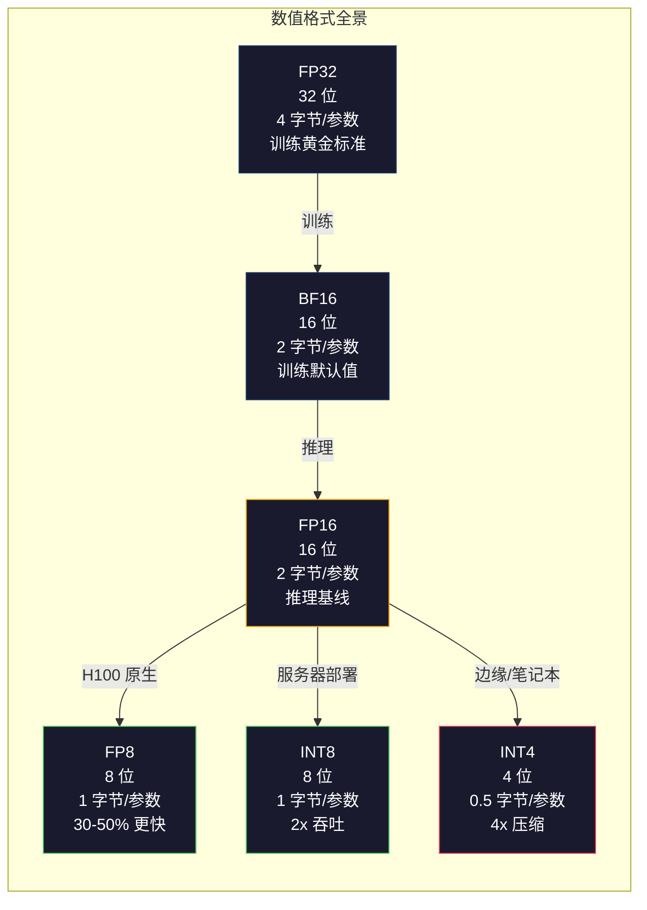
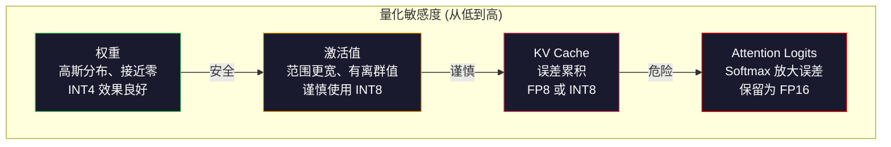
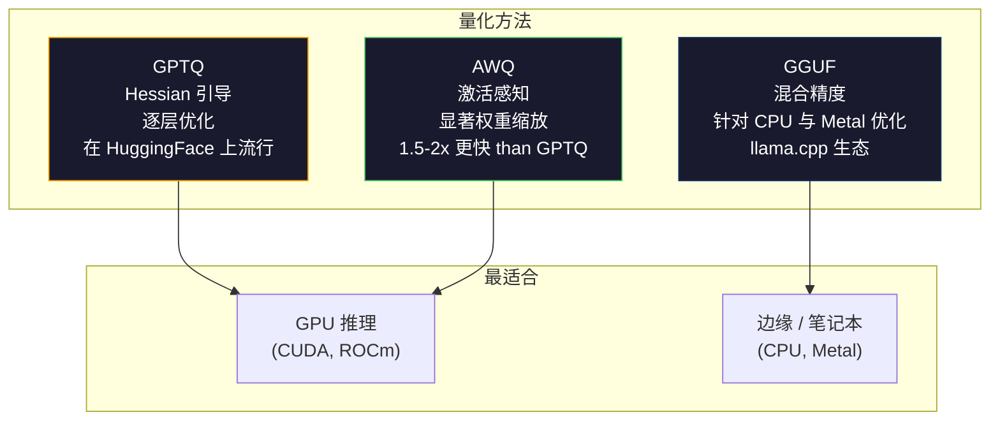

# 量化：让模型装得下（Quantization: Making Models Fit）

> 译注：本文译自同目录 [`en.md`](./en.md)。术语遵循仓根 [TRANSLATION_GUIDE.md](../../../../TRANSLATION_GUIDE.md)。

> 一个 70B 模型用 FP16 要 140GB。光放权重就得两块 A100。量化到 FP8：一块 80GB GPU 搞定。INT4：一台 MacBook 就够。

**Type:** Build
**Languages:** Python (with numpy)
**Prerequisites:** Phase 10, Lessons 01-10 (LLMs from Scratch)
**Time:** ~120 minutes

## 学习目标（Learning Objectives）

- 实现从 FP16 到 INT8 和 INT4 的对称（symmetric）和非对称（asymmetric）量化，包括 per-tensor 和 per-channel 缩放
- 计算量化带来的内存节省，并判断哪种精度能塞进给定 GPU 的 VRAM
- 解释训练后量化（post-training quantization, PTQ）和量化感知训练（quantization-aware training, QAT）的区别
- 应用 GPTQ 或 AWQ 来量化一个真实模型，并在基准测试上度量精度-内存的取舍

## 问题（The Problem）

Llama 3 70B 有 700 亿参数。每个参数是一个 16 位浮点数。那就是 1400 亿字节。140GB。一块 A100 只有 80GB VRAM。你连权重都加载不进去，更别提推理了。你需要两块 A100、每小时 2 美金，只为了服务一个模型。

但每参数 16 位本身就很浪费。神经网络里的大多数权重都聚集在零附近。FP16 完整的动态范围（从 0.000000059 到 65,504）几乎完全没被用上。如果你测一下 Llama 3 70B 里权重的真实分布，95% 都落在 -0.1 到 +0.1 之间。你正在用 16 位去表示本可以用 4 位装下的值。

量化把高精度数字替换成低精度数字。FP16 → FP8 把内存砍半。FP16 → INT4 砍到四分之一。那个 140GB 的模型变成了 35GB。一块消费级 GPU 就能装下。再激进一点用 2-bit 量化（激进、有损，但对某些任务还能用），同一个模型就能跑在一台 16GB 的笔记本上。

代价是精度。你每去掉一位都在销毁信息。问题在于你损失多少精度、损失在哪里。一个量化得好的 INT4 模型在大多数 benchmark 上能保留原模型 95-99% 的质量。一个朴素的 INT4 量化可能彻底毁掉模型。差别就在技术。

社区把 Llama 3 用 GPTQ 量化到 INT4，在 WikiText 上 perplexity 大约只损失 1-2 分。Mistral 发布的 Mixtral 8x22B FP8 checkpoint 在 MMLU 上质量损失测不出来。GGUF 格式驱动着 llama.cpp，让 70B 模型能在搭载 M 系列芯片的 MacBook 上跑起来。量化不是奇技淫巧，而是任何超过 7B 的模型的标准部署路径。

## 概念（The Concept）

### 数字格式：每一位在干什么（Number Formats: What Each Bit Does）

每个浮点数有三部分：符号位（sign）、指数位（exponent）和尾数位（mantissa，又叫 significand）。符号位 1 位。指数位决定范围（数能多大或多小）。尾数位决定精度（你能拿到多少位小数）。

```
FP32:  [1 sign] [8 exponent] [23 mantissa]  = 32 bits
FP16:  [1 sign] [5 exponent] [10 mantissa]  = 16 bits
BF16:  [1 sign] [8 exponent] [7  mantissa]  = 16 bits
FP8:   [1 sign] [4 exponent] [3  mantissa]  = 8  bits (E4M3)
FP8:   [1 sign] [5 exponent] [2  mantissa]  = 8  bits (E5M2)
INT8:  [1 sign] [7 value]                   = 8  bits (uniform steps)
INT4:  [1 sign] [3 value]                   = 4  bits (16 levels total)
```

**FP32** 是全精度。23 位尾数大约给你 7 位十进制精度。范围大致是 1.2 × 10⁻³⁸ 到 3.4 × 10³⁸。训练曾经只在 FP32 下进行。在累加（矩阵乘法中的累计求和）这一步至今仍是 FP32。

**FP16** 把位数砍半。10 位尾数大约 3.3 位十进制精度。指数位缩到 5 位，范围大幅缩小（最大值约 65,504）。这对权重（聚集在零附近）来说没问题，但对训练时可能瞬时飙升的 activation（激活）和 gradient 来说就危险了。FP16 训练需要 loss scaling 来防止下溢（underflow）。

**BF16**（Brain Float 16）保留 FP32 的 8 位指数，但把尾数缩到 7 位。范围和 FP32 一样，精度比 FP16 低。Google 专门为深度学习设计的它。直觉是：对神经网络来说，范围比精度重要。一个 10⁻²⁰ 的 gradient 在 FP16 下会下溢到零，在 BF16 下还活着。一个 0.07342 的权重在 BF16 下舍入到 0.0734 也已经够近了。每一次现代训练运行用的都是 BF16，或 BF16/FP32 的混合。

**FP8** 有两种风味。E4M3（4 位指数、3 位尾数）用于推理时的 weights 和 activations。E5M2（5 位指数、2 位尾数）用于训练时的 gradient——那里范围比精度更重要。在 H100 GPU 上，FP8 推理相比 FP16 能拿到 30-50% 的提速，质量损失可以忽略。

**INT8** 是整数格式。没有指数、没有尾数。就是从 -128 到 127 之间均匀分布的 256 个值。你需要一个 scale factor（缩放因子）把浮点权重映射到这个区间。好处是：整数运算比浮点更快、更省电。在 A100 上，INT8 矩阵乘法跑 624 TOPS，而 FP16 只有 312 TFLOPS。

**INT4** 更进一步。只有 16 种可能的取值。scale factor 在挑大梁。质量完全取决于你怎么选 scale 以及量化哪些权重。最先进的 INT4 方法（GPTQ、AWQ）能保留原模型 95% 以上的质量。



### 量化是怎么工作的（How Quantization Works）

核心操作很简单。拿一个浮点张量，找一个 scale factor，相除，四舍五入到最近的整数，然后把整数和 scale factor 存下来。

**量化（Quantize）：**
```
scale = max(abs(tensor)) / max_int_value
quantized = round(tensor / scale)
```

**反量化（Dequantize）：**
```
reconstructed = quantized * scale
```

INT8 在对称区间 (-127 到 127) 下：
```
scale = max(abs(tensor)) / 127
quantized = clamp(round(tensor / scale), -128, 127)
```

误差就是 round 误差。每个值最多偏差 `scale / 2`。整层的总误差取决于你有多少权重，以及模型对那些权重扰动的敏感程度。

**Per-tensor 与 per-channel 量化。** Per-tensor 给整个权重矩阵用一个 scale factor。简单但损失大：如果一列值很大、另一列值很小，小值的精度大部分都没了。Per-channel 给每个输出通道（权重矩阵的每一行或每一列）一个 scale factor。开销更大（你存 N 个 scale factor 而不是 1 个），但质量大幅提升。每一种生产级量化方法都用 per-channel 或更细粒度。

**非对称量化（Asymmetric quantization）** 加了一个 zero-point 偏置：`quantized = round(tensor / scale) + zero_point`。这能处理不以零为中心的分布。比如 ReLU 激活始终非负。对称量化会把整数范围里的负半边浪费在永远不会出现的值上。非对称量化把实际的 [min, max] 区间映射到完整的整数范围。

### 敏感度层级（Sensitivity Hierarchy）

不是模型里所有东西对量化的容忍度都一样。这里有清晰的层级。

**Weights（最稳健）。** 模型权重在训练中变化缓慢，分布大致呈以零为中心的高斯。它们量化得很好。INT8 权重配上 per-channel scale 几乎无损。INT4 需要更复杂的方法，但也能搞定。

**Activations（中等敏感度）。** Activation 是推理时在网络中流动的中间值。它们的动态范围比权重宽，并且包含异常值（outlier）。某个 attention head 可能产生比均值大 100 倍的 activation 值。这些 outlier 对模型质量至关重要。朴素地量化它们会毁掉信息。解决办法：让 outlier 通道保持高精度（LLM.int8()）、用 per-token 或 per-channel 的 activation scale。

**KV cache（高敏感度）。** key-value cache 存储着此前所有 token 的 attention 状态。在长上下文长度下，KV cache 主导内存。一个 70B 模型在 32K context 下，光 KV cache 在 FP16 就要 40GB。把 KV cache 量化到 FP8 或 INT8 可以省下大量内存，但任何误差都会在所有未来的 attention 计算中累积。质量影响随序列长度放大。

**Attention logits（最敏感）。** attention 里的 softmax 对输入的微小变化非常敏感。pre-softmax logit 上 0.01 的量化误差就能让 attention 分布发生有意义的偏移。大多数量化方案即便其它部分都被量化，也会把 attention 计算保持在更高精度（FP16 或 BF16）。



### PTQ 与 QAT（PTQ vs QAT）

**训练后量化（Post-Training Quantization, PTQ）** 对一个已经训练好的模型做量化。不重新训练。你拿到 FP16 权重，算 scale factor，做 round，然后部署。快（分钟到小时级别），便宜。在 INT8 和 FP8 上效果很好。在 INT4 上，朴素 PTQ 经常崩，因为 round 误差会累积。高级 PTQ 方法（GPTQ、AWQ）会用校准数据（calibration data）来最小化量化误差。

**量化感知训练（Quantization-Aware Training, QAT）** 在训练时把假量化（fake quantization）操作插进前向传播。模型会学着把权重摆在 round 误差小的位置。Gradient 通过假量化时使用直通估计器（straight-through estimator, STE）：假装 round 操作的 gradient 是 1。QAT 在 INT4 和 INT2 上比 PTQ 效果更好，但需要一次完整的训练运行。Google 用 QAT 来高效部署 Gemini。Meta 在某些 Llama 部署目标上也用过 QAT。

| 维度 | PTQ | QAT |
|--------|-----|-----|
| 成本 | 分钟到小时 | 完整一次训练 |
| INT8 质量 | 极佳（< 0.1% 损失） | 极佳 |
| INT4 质量 | 配合 GPTQ/AWQ 不错（1-3% 损失） | 更好（< 1% 损失） |
| INT2 质量 | 差 | 在某些任务上能用 |
| 校准数据 | 128-1024 个样本 | 全量训练数据集 |
| 何时用 | 部署、迭代 | 在低位宽下追求最高质量 |

### GPTQ、AWQ、GGUF（GPTQ, AWQ, GGUF）

**GPTQ（GPT Quantization）** 是一种 one-shot PTQ 方法。它一次量化一层权重，用一个小的校准数据集（典型是 128 个样本）来测 Hessian（关于输出对每个权重敏感程度的二阶信息）。Hessian 认为重要的权重就更小心地量化。GPTQ 是第一个让 INT4 量化在 LLM 上变得实用的方法。Hugging Face 上的 TheBloke 通过发布数百个模型的量化版本把 GPTQ 推广开来。

**AWQ（Activation-Aware Weight Quantization）** 观察到一小部分权重（约 1%）因为要和大的 activation 值相乘而格外重要。AWQ 用校准数据识别出这些「显著（salient）」权重，在量化前把它们 scale 上去（同时把对应的 activation scale 下来）。这样重要权重就落在 INT4 量化更准确的范围里。AWQ 通常能匹配或略微超越 GPTQ 的质量，且应用速度快 1.5-2 倍。

**GGUF（GPT-Generated Unified Format）** 是 llama.cpp 及其生态用的文件格式。它支持混合量化：不同层用不同位宽。第一层和最后一层（embedding 和输出 head）一般保留更高精度，中间层用 INT4 或 INT3。GGUF 文件自包含：权重、tokenizer、元数据全在一个文件里。这种格式是为 CPU 推理和 Apple Silicon 设计的——把整个模型加载进内存，在 CPU 或 Metal GPU 上跑矩阵乘法是标准路径。Q4_K_M 是最流行的 GGUF 量化变体，平衡了质量和体积。



### 质量度量（Quality Measurement）

你怎么知道量化后的模型还行不行？

**Perplexity（困惑度）。** 最常见的指标。越低越好。在保留数据集上（WikiText-2 是标配）对原始模型和量化模型都计算 perplexity。差值告诉你量化销毁了多少信息。经验值：差值 < 0.5 是极佳，0.5-1.0 是好，1.0-2.0 在大多数任务上可接受，> 2.0 说明出问题了。

**任务特定 benchmark。** 在 MMLU、HumanEval、GSM8K 或你自定义的评测套件上跑量化模型，和原始模型对比。量化对不同能力的影响不均匀。数学和代码任务比通用知识更敏感于精度损失。

**输出对比。** 让两个模型在同样的 prompt 上生成回答然后比较。LLM-as-judge（第 10 课）在这里很好用。算一个胜率：量化模型在多大比例的 prompt 上能匹配或超过原模型？

**延迟和吞吐。** 量化存在的意义就是让模型更快、更便宜。测每秒 token 数、首 token 时间和内存占用。一个比原模型还慢的量化模型，比没用还差。

| 模型 | 格式 | 体积 | Perplexity (WikiText-2) | MMLU | Tokens/sec (A100) |
|-------|--------|------|------------------------|------|-------------------|
| Llama 3 70B | FP16 | 140GB | 3.12 | 79.5% | 38 |
| Llama 3 70B | FP8 | 70GB | 3.14 | 79.3% | 55 |
| Llama 3 70B | GPTQ INT4 | 35GB | 4.32 | 77.8% | 72 |
| Llama 3 70B | AWQ INT4 | 35GB | 4.18 | 78.1% | 75 |
| Llama 3 70B | GGUF Q4_K_M | 40GB | 4.25 | 77.9% | 28 (CPU) |

规律是：FP8 几乎免费。INT4 损失 1-2 个 MMLU 分但吞吐翻倍、内存四分之一。这个取舍对几乎每一种部署都值得。

### 真实数字（Real Numbers）

H100 上 FP16 → FP8：推理提速 30-50%，质量损失 < 0.1%。这是无脑量化。每一次 H100 部署都该用上。

FP16 → INT8（LLM.int8()）：内存减半，质量损失 < 0.5%。这种混合精度方法把 outlier feature 留在 FP16，把其它一切量化到 INT8。

FP16 → INT4（GPTQ/AWQ）：内存减到四分之一，质量损失 1-3%（视模型和方法而定）。让 70B 模型能跑在一块 48GB GPU 上。

FP16 → INT4（GGUF Q4_K_M）：内存减到约 1/3.5，质量损失 1-2%。为 CPU 推理优化。70B 模型在 Q4_K_M 大约 40GB，在 64GB 的 M3 Max 上能跑 10-15 tokens/秒。

FP16 → INT2：内存减到八分之一，质量损失 5-15%。只在某些可以容忍降级的特定窄任务上可行。是研究前沿，不是通用生产级方案。

## 动手实现（Build It）

### Step 1: 数字格式表示（Number Format Representations）

构造每种格式的 bit 级表示，看清 sign、exponent、mantissa 各自在做什么。

```python
import numpy as np


def float_to_fp32_bits(value):
    bits = np.float32(value).view(np.uint32)
    sign = (bits >> 31) & 1
    exponent = (bits >> 23) & 0xFF
    mantissa = bits & 0x7FFFFF
    return {"sign": int(sign), "exponent": int(exponent), "mantissa": int(mantissa),
            "exponent_bits": format(int(exponent), '08b'),
            "mantissa_bits": format(int(mantissa), '023b'),
            "value": float(value),
            "actual_exponent": int(exponent) - 127}


def float_to_fp16_bits(value):
    fp16 = np.float16(value)
    bits = fp16.view(np.uint16)
    sign = (bits >> 15) & 1
    exponent = (bits >> 10) & 0x1F
    mantissa = bits & 0x3FF
    return {"sign": int(sign), "exponent": int(exponent), "mantissa": int(mantissa),
            "exponent_bits": format(int(exponent), '05b'),
            "mantissa_bits": format(int(mantissa), '010b'),
            "value": float(fp16),
            "actual_exponent": int(exponent) - 15}


def float_to_bf16_bits(value):
    fp32_bits = np.float32(value).view(np.uint32)
    bf16_bits = (fp32_bits >> 16).astype(np.uint16)
    sign = (bf16_bits >> 15) & 1
    exponent = (bf16_bits >> 7) & 0xFF
    mantissa = bf16_bits & 0x7F
    reconstructed = np.uint32(bf16_bits.astype(np.uint32) << 16).view(np.float32)
    return {"sign": int(sign), "exponent": int(exponent), "mantissa": int(mantissa),
            "exponent_bits": format(int(exponent), '08b'),
            "mantissa_bits": format(int(mantissa), '07b'),
            "value": float(reconstructed),
            "actual_exponent": int(exponent) - 127}


def simulate_fp8_e4m3(value):
    sign = 1 if value < 0 else 0
    abs_val = abs(value)
    max_val = 448.0
    abs_val = min(abs_val, max_val)
    if abs_val == 0:
        return {"sign": sign, "exponent": 0, "mantissa": 0, "value": 0.0,
                "exponent_bits": "0000", "mantissa_bits": "000"}
    exp = int(np.floor(np.log2(abs_val)))
    exp = max(-6, min(8, exp))
    mantissa_val = abs_val / (2.0 ** exp) - 1.0
    mantissa_quant = round(mantissa_val * 8) / 8
    mantissa_quant = max(0, min(0.875, mantissa_quant))
    reconstructed = (1.0 + mantissa_quant) * (2.0 ** exp)
    if sign:
        reconstructed = -reconstructed
    mantissa_int = int(round(mantissa_quant * 8))
    return {"sign": sign, "exponent": exp + 7, "mantissa": mantissa_int,
            "exponent_bits": format(exp + 7, '04b'),
            "mantissa_bits": format(mantissa_int, '03b'),
            "value": float(reconstructed),
            "actual_exponent": exp}


def display_format_comparison(value):
    fp32 = float_to_fp32_bits(value)
    fp16 = float_to_fp16_bits(value)
    bf16 = float_to_bf16_bits(value)
    fp8 = simulate_fp8_e4m3(value)

    print(f"\n  Value: {value}")
    print(f"  {'Format':<8} {'Stored Value':>14} {'Error':>12} {'Sign':>5} {'Exp Bits':>10} {'Man Bits':>25}")
    print(f"  {'-'*76}")
    print(f"  {'FP32':<8} {fp32['value']:>14.6f} {abs(fp32['value'] - value):>12.8f} {fp32['sign']:>5} {fp32['exponent_bits']:>10} {fp32['mantissa_bits']:>25}")
    print(f"  {'FP16':<8} {fp16['value']:>14.6f} {abs(fp16['value'] - value):>12.8f} {fp16['sign']:>5} {fp16['exponent_bits']:>10} {fp16['mantissa_bits']:>25}")
    print(f"  {'BF16':<8} {bf16['value']:>14.6f} {abs(bf16['value'] - value):>12.8f} {bf16['sign']:>5} {bf16['exponent_bits']:>10} {bf16['mantissa_bits']:>25}")
    print(f"  {'FP8e4m3':<8} {fp8['value']:>14.6f} {abs(fp8['value'] - value):>12.8f} {fp8['sign']:>5} {fp8['exponent_bits']:>10} {fp8['mantissa_bits']:>25}")
```

### Step 2: 对称量化（Per-Tensor 和 Per-Channel）（Symmetric Quantization (Per-Tensor and Per-Channel)）

最基本的量化操作。Per-tensor 给整个矩阵一个 scale。Per-channel 给每行或每列一个 scale。

```python
def quantize_symmetric(tensor, num_bits=8):
    qmin = -(2 ** (num_bits - 1))
    qmax = 2 ** (num_bits - 1) - 1
    abs_max = np.max(np.abs(tensor))
    if abs_max == 0:
        return np.zeros_like(tensor, dtype=np.int32), 1.0
    scale = abs_max / qmax
    quantized = np.clip(np.round(tensor / scale), qmin, qmax).astype(np.int32)
    return quantized, float(scale)


def dequantize_symmetric(quantized, scale):
    return quantized.astype(np.float64) * scale


def quantize_per_channel(tensor, num_bits=8, axis=0):
    qmin = -(2 ** (num_bits - 1))
    qmax = 2 ** (num_bits - 1) - 1

    if axis == 0:
        abs_max = np.max(np.abs(tensor), axis=1, keepdims=True)
    else:
        abs_max = np.max(np.abs(tensor), axis=0, keepdims=True)

    abs_max = np.where(abs_max == 0, 1.0, abs_max)
    scales = abs_max / qmax
    quantized = np.clip(np.round(tensor / scales), qmin, qmax).astype(np.int32)
    return quantized, scales.squeeze()


def dequantize_per_channel(quantized, scales, axis=0):
    if axis == 0:
        return quantized.astype(np.float64) * scales.reshape(-1, 1)
    else:
        return quantized.astype(np.float64) * scales.reshape(1, -1)


def quantize_asymmetric(tensor, num_bits=8):
    qmin = 0
    qmax = 2 ** num_bits - 1
    t_min = np.min(tensor)
    t_max = np.max(tensor)
    if t_max == t_min:
        return np.zeros_like(tensor, dtype=np.int32), 1.0, 0
    scale = (t_max - t_min) / (qmax - qmin)
    zero_point = int(np.round(qmin - t_min / scale))
    zero_point = max(qmin, min(qmax, zero_point))
    quantized = np.clip(np.round(tensor / scale + zero_point), qmin, qmax).astype(np.int32)
    return quantized, float(scale), int(zero_point)


def dequantize_asymmetric(quantized, scale, zero_point):
    return (quantized.astype(np.float64) - zero_point) * scale
```

### Step 3: 质量度量（Quality Measurement）

度量量化销毁了多少信息：原始张量与重建张量之间的均方误差（MSE）、信噪比（SNR）和余弦相似度。

```python
def quantization_error(original, reconstructed):
    diff = original - reconstructed
    mse = float(np.mean(diff ** 2))
    rmse = float(np.sqrt(mse))
    max_error = float(np.max(np.abs(diff)))
    signal_power = float(np.mean(original ** 2))
    snr_db = 10 * np.log10(signal_power / max(mse, 1e-20))

    orig_flat = original.flatten()
    recon_flat = reconstructed.flatten()
    norm_orig = np.linalg.norm(orig_flat)
    norm_recon = np.linalg.norm(recon_flat)
    if norm_orig == 0 or norm_recon == 0:
        cosine_sim = 0.0
    else:
        cosine_sim = float(np.dot(orig_flat, recon_flat) / (norm_orig * norm_recon))

    return {"mse": mse, "rmse": rmse, "max_error": max_error,
            "snr_db": float(snr_db), "cosine_similarity": cosine_sim}


def compare_quantization_methods(tensor, num_bits=8):
    q_pt, s_pt = quantize_symmetric(tensor, num_bits)
    recon_pt = dequantize_symmetric(q_pt, s_pt)
    err_pt = quantization_error(tensor, recon_pt)

    q_pc, s_pc = quantize_per_channel(tensor, num_bits, axis=0)
    recon_pc = dequantize_per_channel(q_pc, s_pc, axis=0)
    err_pc = quantization_error(tensor, recon_pc)

    q_asym, s_asym, zp = quantize_asymmetric(tensor, num_bits)
    recon_asym = dequantize_asymmetric(q_asym, s_asym, zp)
    err_asym = quantization_error(tensor, recon_asym)

    print(f"\n  Quantization Comparison ({num_bits}-bit, tensor shape {tensor.shape}):")
    print(f"  {'Method':<20} {'MSE':>12} {'SNR (dB)':>10} {'Cosine Sim':>12} {'Max Error':>12}")
    print(f"  {'-'*68}")
    print(f"  {'Per-tensor sym':<20} {err_pt['mse']:>12.8f} {err_pt['snr_db']:>10.2f} {err_pt['cosine_similarity']:>12.8f} {err_pt['max_error']:>12.8f}")
    print(f"  {'Per-channel sym':<20} {err_pc['mse']:>12.8f} {err_pc['snr_db']:>10.2f} {err_pc['cosine_similarity']:>12.8f} {err_pc['max_error']:>12.8f}")
    print(f"  {'Asymmetric':<20} {err_asym['mse']:>12.8f} {err_asym['snr_db']:>10.2f} {err_asym['cosine_similarity']:>12.8f} {err_asym['max_error']:>12.8f}")

    return {"per_tensor": err_pt, "per_channel": err_pc, "asymmetric": err_asym}
```

### Step 4: 位宽扫描（Bit-Width Sweep）

在不同位宽（2、3、4、8、16）下量化同一个张量，并测每个等级的质量。这能精确暴露质量悬崖在哪。

```python
def bit_width_sweep(tensor):
    print(f"\n  Bit-Width Sweep (tensor shape {tensor.shape}):")
    print(f"  {'Bits':>6} {'Levels':>8} {'MSE':>14} {'SNR (dB)':>10} {'Cosine Sim':>12} {'Compression':>12}")
    print(f"  {'-'*64}")

    results = []
    for bits in [2, 3, 4, 8, 16]:
        q, s = quantize_per_channel(tensor, bits, axis=0)
        recon = dequantize_per_channel(q, s, axis=0)
        err = quantization_error(tensor, recon)
        levels = 2 ** bits
        compression = 32.0 / bits

        print(f"  {bits:>6} {levels:>8} {err['mse']:>14.8f} {err['snr_db']:>10.2f} {err['cosine_similarity']:>12.8f} {compression:>11.1f}x")
        results.append({"bits": bits, "levels": levels, "error": err, "compression": compression})

    return results
```

### Step 5: 敏感度实验（Sensitivity Experiment）

模拟对一个 transformer 不同部分进行量化，测量哪些组件最敏感。这印证了敏感度层级：weights < activations < KV cache < attention。

```python
def simulate_transformer_layer(input_data, weights, kv_scale=1.0):
    hidden = input_data @ weights["qkv"]
    seq_len = hidden.shape[1]
    d_model = weights["qkv"].shape[1] // 3
    q, k, v = hidden[:, :, :d_model], hidden[:, :, d_model:2*d_model], hidden[:, :, 2*d_model:]

    attn_scores = (q @ k.transpose(0, 2, 1)) / np.sqrt(d_model) * kv_scale
    attn_max = np.max(attn_scores, axis=-1, keepdims=True)
    attn_exp = np.exp(attn_scores - attn_max)
    attn_weights = attn_exp / np.sum(attn_exp, axis=-1, keepdims=True)

    attn_output = attn_weights @ v
    output = attn_output @ weights["out"]
    return output, {"q": q, "k": k, "v": v, "attn_scores": attn_scores,
                    "attn_weights": attn_weights, "attn_output": attn_output}


def sensitivity_experiment(batch_size=2, seq_len=16, d_model=64, num_bits=8):
    np.random.seed(42)
    input_data = np.random.randn(batch_size, seq_len, d_model) * 0.1

    weights = {
        "qkv": np.random.randn(d_model, 3 * d_model) * (2.0 / d_model) ** 0.5,
        "out": np.random.randn(d_model, d_model) * (2.0 / d_model) ** 0.5,
    }

    baseline_output, baseline_internals = simulate_transformer_layer(input_data, weights)

    experiments = {}

    q_qkv, s_qkv = quantize_per_channel(weights["qkv"], num_bits, axis=0)
    q_out, s_out = quantize_per_channel(weights["out"], num_bits, axis=0)
    quantized_weights = {
        "qkv": dequantize_per_channel(q_qkv, s_qkv, axis=0),
        "out": dequantize_per_channel(q_out, s_out, axis=0),
    }
    weight_quant_output, _ = simulate_transformer_layer(input_data, quantized_weights)
    experiments["Weights only"] = quantization_error(baseline_output, weight_quant_output)

    _, fresh_internals = simulate_transformer_layer(input_data, weights)
    q_act, s_act = quantize_per_channel(
        fresh_internals["attn_output"].reshape(-1, d_model), num_bits, axis=0
    )
    quant_attn_out = dequantize_per_channel(q_act, s_act, axis=0).reshape(batch_size, seq_len, d_model)
    act_quant_output = quant_attn_out @ weights["out"]
    experiments["Activations only"] = quantization_error(baseline_output, act_quant_output)

    q_k, s_k = quantize_per_channel(fresh_internals["k"].reshape(-1, d_model), num_bits, axis=0)
    q_v, s_v = quantize_per_channel(fresh_internals["v"].reshape(-1, d_model), num_bits, axis=0)
    quant_k = dequantize_per_channel(q_k, s_k, axis=0).reshape(batch_size, seq_len, d_model)
    quant_v = dequantize_per_channel(q_v, s_v, axis=0).reshape(batch_size, seq_len, d_model)
    attn_scores_kv = (fresh_internals["q"] @ quant_k.transpose(0, 2, 1)) / np.sqrt(d_model)
    attn_max_kv = np.max(attn_scores_kv, axis=-1, keepdims=True)
    attn_exp_kv = np.exp(attn_scores_kv - attn_max_kv)
    attn_weights_kv = attn_exp_kv / np.sum(attn_exp_kv, axis=-1, keepdims=True)
    kv_quant_output = (attn_weights_kv @ quant_v) @ weights["out"]
    experiments["KV cache only"] = quantization_error(baseline_output, kv_quant_output)

    noise_scale = np.std(fresh_internals["attn_scores"]) * 0.05
    noisy_scores = fresh_internals["attn_scores"] + np.random.randn(*fresh_internals["attn_scores"].shape) * noise_scale
    noisy_max = np.max(noisy_scores, axis=-1, keepdims=True)
    noisy_exp = np.exp(noisy_scores - noisy_max)
    noisy_weights = noisy_exp / np.sum(noisy_exp, axis=-1, keepdims=True)
    attn_quant_output = (noisy_weights @ fresh_internals["v"]) @ weights["out"]
    experiments["Attention logits (5% noise)"] = quantization_error(baseline_output, attn_quant_output)

    print(f"\n  Sensitivity Experiment ({num_bits}-bit quantization):")
    print(f"  {'Component':<30} {'MSE':>14} {'SNR (dB)':>10} {'Cosine Sim':>12}")
    print(f"  {'-'*68}")
    for name, err in sorted(experiments.items(), key=lambda x: x[1]["mse"]):
        print(f"  {name:<30} {err['mse']:>14.8f} {err['snr_db']:>10.2f} {err['cosine_similarity']:>12.8f}")

    return experiments
```

### Step 6: 模拟 GPTQ（Simulated GPTQ）

GPTQ 一次量化一列，用 Hessian 决定如何分配 round 误差。下面这个简化版本抓住了核心思路：用校准数据测权重重要性，然后对最不重要的权重更激进地量化。

```python
def simulated_gptq(weight_matrix, calibration_inputs, num_bits=4):
    n_in, n_out = weight_matrix.shape
    qmin = -(2 ** (num_bits - 1))
    qmax = 2 ** (num_bits - 1) - 1

    H = np.zeros((n_in, n_in))
    for x in calibration_inputs:
        x = x.reshape(-1, 1) if x.ndim == 1 else x
        for row in range(x.shape[0]):
            xi = x[row].reshape(-1, 1)
            H += xi @ xi.T
    H /= len(calibration_inputs)
    H += np.eye(n_in) * 1e-4

    weight_importance = np.diag(H)

    quantized = np.zeros_like(weight_matrix, dtype=np.int32)
    scales = np.zeros(n_out)
    errors = np.zeros(n_out)

    W = weight_matrix.copy()

    for col in range(n_out):
        w_col = W[:, col]
        abs_max = np.max(np.abs(w_col))
        if abs_max == 0:
            scales[col] = 1.0
            continue
        scale = abs_max / qmax
        scales[col] = scale

        q_col = np.clip(np.round(w_col / scale), qmin, qmax).astype(np.int32)
        quantized[:, col] = q_col

        quant_error = w_col - q_col * scale
        errors[col] = np.sqrt(np.mean(quant_error ** 2))

        if col < n_out - 1:
            importance_weights = weight_importance / (np.max(weight_importance) + 1e-10)
            for next_col in range(col + 1, min(col + 4, n_out)):
                compensation = quant_error * importance_weights * 0.1
                W[:, next_col] += compensation

    return quantized, scales, {"column_errors": errors,
                               "mean_error": float(np.mean(errors)),
                               "max_error": float(np.max(errors))}


def dequantize_gptq(quantized, scales):
    result = np.zeros_like(quantized, dtype=np.float64)
    for col in range(quantized.shape[1]):
        result[:, col] = quantized[:, col] * scales[col]
    return result
```

### Step 7: AWQ 模拟（AWQ Simulation）

AWQ 识别出 salient（显著）权重——那些会和大 activation 相乘的——并通过量化前 scale 来保护它们。

```python
def simulated_awq(weight_matrix, calibration_inputs, num_bits=4, salient_fraction=0.01):
    n_in, n_out = weight_matrix.shape
    qmin = -(2 ** (num_bits - 1))
    qmax = 2 ** (num_bits - 1) - 1

    activation_magnitudes = np.zeros(n_in)
    for x in calibration_inputs:
        if x.ndim == 1:
            activation_magnitudes += np.abs(x)
        else:
            activation_magnitudes += np.mean(np.abs(x), axis=0)
    activation_magnitudes /= len(calibration_inputs)

    n_salient = max(1, int(n_in * salient_fraction))
    salient_indices = np.argsort(activation_magnitudes)[-n_salient:]

    scale_factors = np.ones(n_in)
    for idx in salient_indices:
        col_max = np.max(np.abs(weight_matrix[idx, :]))
        if col_max > 0:
            scale_factors[idx] = min(4.0, 1.0 / (col_max + 1e-8) * np.mean(np.abs(weight_matrix)))

    scaled_weights = weight_matrix * scale_factors.reshape(-1, 1)

    quantized, scales = quantize_per_channel(scaled_weights, num_bits, axis=0)
    dequantized = dequantize_per_channel(quantized, scales, axis=0)

    result = dequantized / scale_factors.reshape(-1, 1)

    err = quantization_error(weight_matrix, result)

    return result, {"salient_indices": salient_indices,
                    "scale_factors": scale_factors[salient_indices],
                    "error": err,
                    "n_salient": n_salient}
```

### Step 8: 完整流水线（Full Pipeline）

把所有部件串起来。在同一个权重矩阵上对比朴素量化、per-channel、GPTQ 和 AWQ。

```python
def full_quantization_comparison(d_in=256, d_out=512, num_bits=4, n_calibration=32):
    np.random.seed(42)

    weight = np.random.randn(d_in, d_out) * 0.02
    outlier_rows = np.random.choice(d_in, size=5, replace=False)
    weight[outlier_rows] *= 10

    calibration = [np.random.randn(8, d_in) * 0.1 for _ in range(n_calibration)]

    q_naive, s_naive = quantize_symmetric(weight, num_bits)
    recon_naive = dequantize_symmetric(q_naive, s_naive)
    err_naive = quantization_error(weight, recon_naive)

    q_pc, s_pc = quantize_per_channel(weight, num_bits, axis=0)
    recon_pc = dequantize_per_channel(q_pc, s_pc, axis=0)
    err_pc = quantization_error(weight, recon_pc)

    q_gptq, s_gptq, gptq_info = simulated_gptq(weight, calibration, num_bits)
    recon_gptq = dequantize_gptq(q_gptq, s_gptq)
    err_gptq = quantization_error(weight, recon_gptq)

    recon_awq, awq_info = simulated_awq(weight, calibration, num_bits)
    err_awq = awq_info["error"]

    print(f"\n  Full Quantization Comparison ({num_bits}-bit, {d_in}x{d_out} matrix)")
    print(f"  Matrix has {len(outlier_rows)} outlier rows (10x scale)")
    print()
    print(f"  {'Method':<20} {'MSE':>14} {'SNR (dB)':>10} {'Cosine Sim':>12}")
    print(f"  {'-'*58}")
    print(f"  {'Naive per-tensor':<20} {err_naive['mse']:>14.8f} {err_naive['snr_db']:>10.2f} {err_naive['cosine_similarity']:>12.8f}")
    print(f"  {'Per-channel':<20} {err_pc['mse']:>14.8f} {err_pc['snr_db']:>10.2f} {err_pc['cosine_similarity']:>12.8f}")
    print(f"  {'Simulated GPTQ':<20} {err_gptq['mse']:>14.8f} {err_gptq['snr_db']:>10.2f} {err_gptq['cosine_similarity']:>12.8f}")
    print(f"  {'Simulated AWQ':<20} {err_awq['mse']:>14.8f} {err_awq['snr_db']:>10.2f} {err_awq['cosine_similarity']:>12.8f}")

    test_input = np.random.randn(4, d_in) * 0.1
    baseline = test_input @ weight
    output_naive = test_input @ recon_naive
    output_pc = test_input @ recon_pc
    output_gptq = test_input @ recon_gptq
    output_awq = test_input @ recon_awq

    print(f"\n  End-to-End Output Error (matmul with test input):")
    print(f"  {'Method':<20} {'Output MSE':>14} {'Output Cosine':>14}")
    print(f"  {'-'*50}")
    for name, output in [("Naive", output_naive), ("Per-channel", output_pc),
                          ("GPTQ", output_gptq), ("AWQ", output_awq)]:
        out_err = quantization_error(baseline, output)
        print(f"  {name:<20} {out_err['mse']:>14.8f} {out_err['cosine_similarity']:>14.8f}")

    return {"naive": err_naive, "per_channel": err_pc, "gptq": err_gptq, "awq": err_awq}


def memory_calculator(num_params_billions, bits_per_param):
    bytes_per_param = bits_per_param / 8
    total_bytes = num_params_billions * 1e9 * bytes_per_param
    total_gb = total_bytes / (1024 ** 3)
    return total_gb


def print_memory_table():
    print("\n  Memory Requirements by Model and Precision:")
    print(f"  {'Model':<15} {'FP32':>8} {'FP16':>8} {'FP8':>8} {'INT8':>8} {'INT4':>8} {'INT2':>8}")
    print(f"  {'-'*64}")
    for name, params in [("7B", 7), ("13B", 13), ("34B", 34), ("70B", 70), ("405B", 405)]:
        fp32 = memory_calculator(params, 32)
        fp16 = memory_calculator(params, 16)
        fp8 = memory_calculator(params, 8)
        int8 = memory_calculator(params, 8)
        int4 = memory_calculator(params, 4)
        int2 = memory_calculator(params, 2)
        print(f"  {name:<15} {fp32:>7.1f}G {fp16:>7.1f}G {fp8:>7.1f}G {int8:>7.1f}G {int4:>7.1f}G {int2:>7.1f}G")


if __name__ == "__main__":
    np.random.seed(42)

    print("=" * 70)
    print("QUANTIZATION: MAKING MODELS FIT")
    print("=" * 70)

    print("\nSTEP 1: Number Format Comparison")
    print("-" * 50)
    for val in [0.1, 3.14159, -0.00073, 42.5, 0.0000012]:
        display_format_comparison(val)

    print("\n\nSTEP 2: Memory Requirements")
    print("-" * 50)
    print_memory_table()

    print("\n\nSTEP 3: Quantization Methods Comparison")
    print("-" * 50)
    weight_matrix = np.random.randn(128, 256) * 0.02
    weight_matrix[0] *= 15
    weight_matrix[42] *= 8
    compare_quantization_methods(weight_matrix, num_bits=8)
    compare_quantization_methods(weight_matrix, num_bits=4)

    print("\n\nSTEP 4: Bit-Width Sweep")
    print("-" * 50)
    sweep_tensor = np.random.randn(64, 128) * 0.05
    bit_width_sweep(sweep_tensor)

    print("\n\nSTEP 5: Sensitivity Experiment")
    print("-" * 50)
    print("\n  INT8:")
    sensitivity_experiment(num_bits=8)
    print("\n  INT4:")
    sensitivity_experiment(num_bits=4)

    print("\n\nSTEP 6: GPTQ vs AWQ vs Naive (INT4)")
    print("-" * 50)
    full_quantization_comparison(d_in=256, d_out=512, num_bits=4)

    print("\n\nSTEP 7: Distribution Analysis")
    print("-" * 50)
    np.random.seed(0)
    simulated_weights = np.random.randn(1000) * 0.02
    abs_vals = np.abs(simulated_weights)
    pct_in_range = np.mean(abs_vals < 0.1) * 100
    print(f"\n  Simulated weight distribution (1000 params, std=0.02):")
    print(f"  Weights in [-0.1, 0.1]: {pct_in_range:.1f}%")
    print(f"  Weights in [-0.05, 0.05]: {np.mean(abs_vals < 0.05) * 100:.1f}%")
    print(f"  Weights in [-0.01, 0.01]: {np.mean(abs_vals < 0.01) * 100:.1f}%")
    print(f"  Max absolute value: {np.max(abs_vals):.6f}")
    print(f"  Mean absolute value: {np.mean(abs_vals):.6f}")

    histogram = np.histogram(simulated_weights, bins=20)
    print(f"\n  Weight histogram:")
    max_count = max(histogram[0])
    for i in range(len(histogram[0])):
        bar_len = int(histogram[0][i] / max_count * 40)
        lo = histogram[1][i]
        hi = histogram[1][i + 1]
        print(f"  [{lo:>7.4f}, {hi:>7.4f}] {'#' * bar_len} ({histogram[0][i]})")

    print("\n\n" + "=" * 70)
    print("DONE")
    print("=" * 70)
```

## 用起来（Use It）

### 用 AutoGPTQ 做量化（Quantizing with AutoGPTQ）

```python
# pip install auto-gptq transformers
# from auto_gptq import AutoGPTQForCausalLM, BaseQuantizeConfig
# from transformers import AutoTokenizer
#
# model_id = "meta-llama/Llama-3.1-8B"
# quantize_config = BaseQuantizeConfig(
#     bits=4,
#     group_size=128,
#     desc_act=False,
# )
#
# tokenizer = AutoTokenizer.from_pretrained(model_id)
# model = AutoGPTQForCausalLM.from_pretrained(model_id, quantize_config)
#
# calibration = [tokenizer(t, return_tensors="pt") for t in calibration_texts[:128]]
# model.quantize(calibration)
# model.save_quantized("llama-8b-gptq-int4")
```

### 用 AutoAWQ 做量化（Quantizing with AutoAWQ）

```python
# pip install autoawq
# from awq import AutoAWQForCausalLM
# from transformers import AutoTokenizer
#
# model_id = "meta-llama/Llama-3.1-8B"
# model = AutoAWQForCausalLM.from_pretrained(model_id)
# tokenizer = AutoTokenizer.from_pretrained(model_id)
#
# model.quantize(tokenizer, quant_config={"zero_point": True, "q_group_size": 128, "w_bit": 4})
# model.save_quantized("llama-8b-awq-int4")
```

### 转换为 GGUF（Converting to GGUF）

```bash
# pip install llama-cpp-python
# python convert_hf_to_gguf.py meta-llama/Llama-3.1-8B --outtype q4_k_m --outfile llama-8b-q4km.gguf
# llama-server -m llama-8b-q4km.gguf -c 4096 -ngl 99
```

### 用 vLLM 服务化（Serving with vLLM）

```python
# pip install vllm
# vllm serve model-awq --quantization awq --dtype half --max-model-len 8192
```

vLLM 原生支持 AWQ 和 GPTQ 模型。它会在矩阵乘法时处理反量化，并对 KV cache 使用 paged attention。要在 H100 上跑 FP8，加上 `--dtype float8_e4m3fn`。

## 上线部署（Ship It）

本课产出 `outputs/skill-quantization.md`，一份选择正确量化策略的决策框架。给定你的模型规模、目标硬件和质量要求，它会告诉你用哪种格式、哪种方法、哪些验证步骤。里面包含内存预算计算、按组件的精度建议，以及 vLLM、llama.cpp 和 TensorRT-LLM 的部署 recipe（配方）。

## 练习（Exercises）

1. 实现分组量化（group quantization）。不是每个通道一个 scale，而是在通道内每 128 个权重一组、每组一个 scale。这才是 GPTQ 和 AWQ 实际使用的方式。在同一个权重矩阵上对比 32、64、128、256 的分组大小。组越小质量越好但 scale factor 的存储开销越大。

2. 构造一个混合精度量化器。把多层网络的第一层和最后一层量化到 INT8，中间层量化到 INT4。把端到端输出质量与「全部 INT4」「全部 INT8」对比。测一下相对于「全部 INT8」省了多少内存。

3. 为量化感知训练（QAT）实现直通估计器（STE）。在一个简单的两层网络的前向传播中插入假量化/反量化操作，在一个回归任务上训练。对比正常训练后做 PTQ 到 INT4 的模型 vs 一开始就用 QAT 训练的模型，最终 loss 谁更低。

4. 构造一个 outlier 感知的量化器，灵感来自 LLM.int8()。检测那些 activation 幅值超过均值 6 倍的通道。把这些通道留在 FP16，其它都量化到 INT8。在 Step 5 的 transformer 层上，分别取 outlier 阈值为 3x、6x、10x，测端到端质量。

5. 实现一个量化质量仪表盘。给定一个权重矩阵，计算并展示：权重分布直方图、量化误差分布、per-channel scale factor、最差量化的通道（重建误差最大）、以及在 100 个随机输入下原始与量化输出之间的余弦相似度。指出哪些通道应该保持高精度。

## 关键术语（Key Terms）

| 术语 | 别人怎么说 | 它实际是什么 |
|------|----------------|----------------------|
| FP16 | "Half precision（半精度）" | 16 位浮点，5 位指数 + 10 位尾数，最大值 65,504，标准推理格式 |
| BF16 | "Brain float" | 16 位浮点，8 位指数（与 FP32 同范围）+ 7 位尾数，Google 为训练设计 |
| FP8 | "Eight-bit float" | 两种变体：E4M3（推理，更高精度）和 E5M2（训练，更大范围），H100 原生支持 |
| INT8 | "Eight-bit integer" | 从 -128 到 127 的 256 个均匀分布值，需要 scale factor 从浮点映射过来 |
| INT4 | "Four-bit integer" | 总共 16 个等级，需要复杂方法（GPTQ、AWQ）才能维持质量 |
| Per-channel quantization | "每行一个 scale" | 每个输出通道各一个 scale factor，而不是整个张量共用一个，能大幅降低误差 |
| GPTQ | "那个 Hessian 方法" | 基于二阶信息、按层最小化输出误差的训练后量化方法 |
| AWQ | "Activation-aware（激活感知）" | 量化前 scale 那些 salient（与大 activation 相乘）的权重以保护它们 |
| GGUF | "llama.cpp 的格式" | 自包含的混合精度模型文件，为 CPU 和 Apple Silicon 推理优化 |
| PTQ | "训练后量化" | 不重新训练，直接把训好的模型权重转低精度，快但极端压缩下能力有限 |
| QAT | "训练时量化" | 在前向传播中插入假量化，让模型学会容忍 round 误差，在 INT4/INT2 下更佳 |
| Calibration data | "那 128 个样本" | 跑一遍模型用来计算 activation 统计、设定 scale factor 的小数据集 |
| Scale factor | "那个乘数" | 在浮点和整数范围之间转换：`float_val = int_val * scale` |
| Perplexity delta | "差多少" | 原始模型与量化模型的 perplexity 差值，< 0.5 极佳，> 2.0 出问题 |

## 延伸阅读（Further Reading）

- [Frantar et al., 2022 -- "GPTQ: Accurate Post-Training Quantization for Generative Pre-trained Transformers"](https://arxiv.org/abs/2210.17323) —— 让 LLM 的 INT4 量化变得实用的论文，使用 Hessian 引导的权重 round
- [Lin et al., 2023 -- "AWQ: Activation-aware Weight Quantization for LLM Compression and Acceleration"](https://arxiv.org/abs/2306.00978) —— 通过量化前 scale 保护 salient 权重，匹配或超越 GPTQ
- [Dettmers et al., 2022 -- "LLM.int8(): 8-bit Matrix Multiplication for Transformers at Scale"](https://arxiv.org/abs/2208.07339) —— 把 outlier feature 留在 FP16 的混合精度 INT8，让 INT8 推理质量无损
- [Xiao et al., 2023 -- "SmoothQuant: Accurate and Efficient Post-Training Quantization for Large Language Models"](https://arxiv.org/abs/2211.10438) —— 把量化难度从 activation 迁移到 weight，方便 W8A8 部署
- [Micikevicius et al., 2022 -- "FP8 Formats for Deep Learning"](https://arxiv.org/abs/2209.05433) —— NVIDIA/ARM/Intel 联合论文，定义了如今 H100 原生支持的 E4M3 和 E5M2 格式
