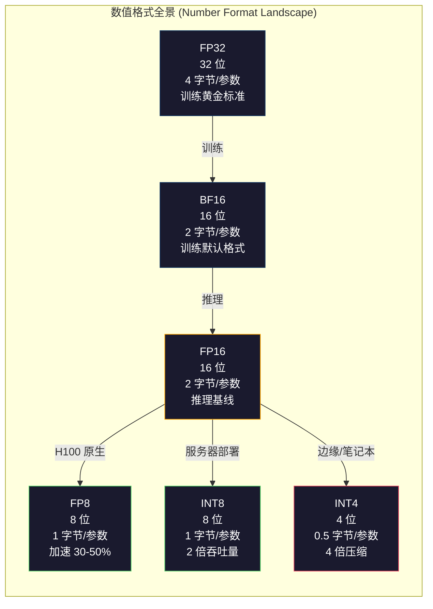
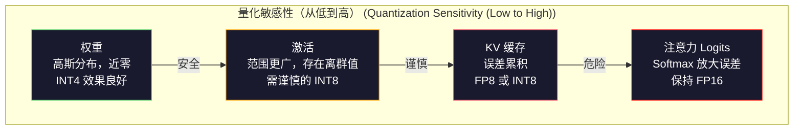
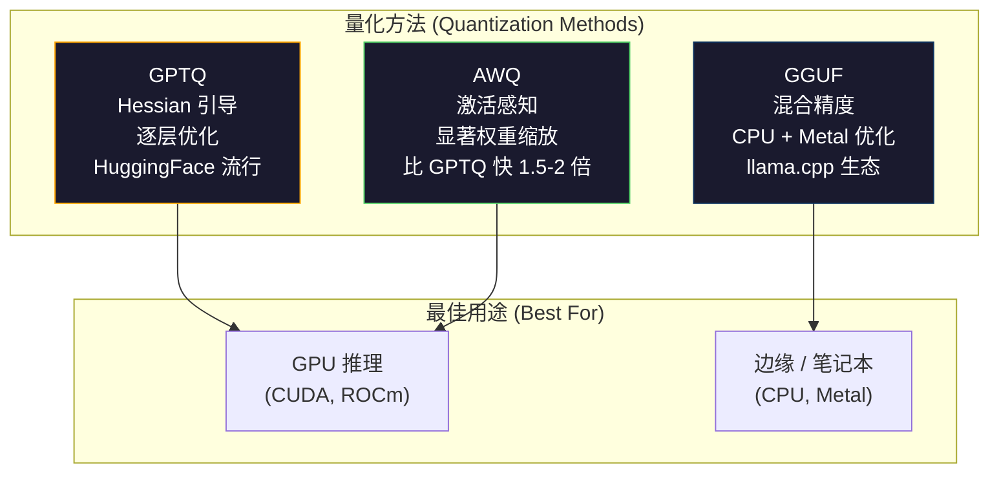

# 量化：让模型适配硬件 (Quantization: Making Models Fit)

> 一个 70B 的 FP16 模型需要 140GB。两块 A100 仅能放下权重。量化到 FP8：一块 80GB 的 GPU。INT4：一台 MacBook。

**类型：** 构建 (Build)
**语言：** Python（使用 numpy）
**前置知识：** 阶段 10，课程 01-10（从头实现 LLM）
**时间：** ~120 分钟

## 学习目标 (Learning Objectives)

- 实现从 FP16 到 INT8 和 INT4 的对称与非对称量化，包括逐张量与逐通道缩放
- 计算量化带来的内存节省，并判断给定 GPU 显存能够容纳何种精度
- 解释训练后量化（PTQ）与量化感知训练（QAT）的区别
- 应用 GPTQ 或 AWQ 量化真实模型，并在基准测试上衡量精度与内存的权衡

## 问题 (The Problem)

LLaMA 3 70B 拥有 700 亿个参数。每个参数是一个 16 位浮点数。那就是 1400 亿字节——140GB。单块 A100 拥有 80GB 显存。你连权重都装不下，更别说在单块 GPU 上运行推理了。你需要两块 A100（每块 $2/小时）才能服务一个模型。

但每个参数用 16 位很浪费。神经网络中的大部分权重都聚集在零附近。FP16 的完整动态范围（从 0.000000059 到 65,504）几乎完全没有被利用。如果你测量 LLaMA 3 70B 中权重的实际分布，95% 的权重大小在 -0.1 到 +0.1 之间。你用 16 位来表示本可以用 4 位装下的数值。

量化用低精度数替代高精度数。FP16 到 FP8 节省一半内存。FP16 到 INT4 节省四分之三。那个 140GB 的模型变成了 35GB。它可以装进一块消费级 GPU。如果推进到 2 位量化（激进、有损，但对某些任务可用），同一个模型可以在 16GB 的笔记本电脑上运行。

代价是精度。每减少一位都在破坏信息。问题在于你损失了多少精度、以及在哪里损失的。一个精心量化的 INT4 模型在大多数基准测试上能保留原模型 95-99% 的质量。而一个简单的 INT4 量化可能会彻底毁掉模型。差别在于技术。

社区对 LLaMA 3 的 GPTQ INT4 量化在 WikiText 上大约损失 1-2 个困惑度点。Mistral 发布了 Mixtral 8x22B 的 FP8 检查点，在 MMLU 上零可测质量损失。GGUF 格式驱动着 llama.cpp，能够在搭载 M 系列芯片的 MacBook 上运行 70B 模型。量化不是一种 hack。它是大于 7B 的每一个模型的标准部署路径。

## 概念 (The Concept)

### 数值格式：每一位的作用 (Number Formats: What Each Bit Does)

每个浮点数有三个部分：符号位、指数和尾数（也称有效数字）。符号位占一位。指数决定范围（数值能有多大或多小）。尾数决定精度（能得到多少位小数）。

```
FP32:  [1 符号位] [8 指数位] [23 尾数位] = 32 位
FP16:  [1 符号位] [5 指数位] [10 尾数位] = 16 位
BF16:  [1 符号位] [8 指数位] [7  尾数位] = 16 位
FP8:   [1 符号位] [4 指数位] [3  尾数位] = 8  位 (E4M3)
FP8:   [1 符号位] [5 指数位] [2  尾数位] = 8  位 (E5M2)
INT8:  [1 符号位] [7 数值位]              = 8  位 (均匀步长)
INT4:  [1 符号位] [3 数值位]              = 4  位 (共 16 个级别)
```

**FP32** 是全精度。23 位尾数提供约 7 位十进制精度。范围：约 1.2 x 10^-38 到 3.4 x 10^38。训练过去完全在 FP32 中进行。现在累加（矩阵乘法过程中的运行求和）仍然使用 FP32。

**FP16** 将位数减半。10 位尾数提供约 3.3 位十进制精度。指数缩减到 5 位，范围急剧缩小（最大值约 65,504）。这对权重（集中在零附近）来说没问题，但对可能在训练中突变的激活和梯度来说是危险的。FP16 训练需要损失缩放来防止下溢。

**BF16**（Brain Float 16）保留了 FP32 的 8 位指数，但将尾数缩减到 7 位。与 FP32 相同的范围，比 FP16 更低的精度。Google 专门为深度学习设计了它。直觉：对于神经网络，范围比精度更重要。一个在 FP16 中下溢为零的 10^-20 量级梯度在 BF16 中能够存活。一个在 BF16 中四舍五入到 0.0734 的 0.07342 权重也足够接近。每一个现代训练运行都使用 BF16 或 BF16/FP32 混合。

**FP8** 有两种变体。E4M3（4 位指数，3 位尾数）用于推理过程中的权重和激活。E5M2（5 位指数，2 位尾数）用于训练过程中的梯度，那里范围比精度更重要。在 H100 GPU 上，FP8 推理相比 FP16 可实现 30-50% 的加速，且质量损失可忽略不计。

**INT8** 是一种整数格式。没有指数，没有尾数。只有从 -128 到 127 的 256 个均匀分布的值。需要一个缩放因子来将浮点权重映射到这个范围。优势：整数运算比浮点运算更快、更节能。A100 上的 INT8 矩阵乘法可达 624 TOPS，而 FP16 为 312 TFLOPS。

**INT4** 更进一步。只有 16 个可能的值。缩放因子承担了繁重的工作。质量完全取决于你如何选择缩放因子以及量化哪些权重。最先进的 INT4 方法（GPTQ、AWQ）保留了 95% 以上的原始模型质量。


```mermaid
graph LR
    subgraph Formats["数值格式全景 (Number Format Landscape)"]
        direction TB
        FP32["FP32\n32 位\n4 字节/参数\n训练黄金标准"]
        BF16["BF16\n16 位\n2 字节/参数\n训练默认格式"]
        FP16["FP16\n16 位\n2 字节/参数\n推理基线"]
        FP8["FP8\n8 位\n1 字节/参数\n加速 30-50%"]
        INT8["INT8\n8 位\n1 字节/参数\n2 倍吞吐量"]
        INT4["INT4\n4 位\n0.5 字节/参数\n4 倍压缩"]
    end

    FP32 -->|"训练"| BF16
    BF16 -->|"推理"| FP16
    FP16 -->|"H100 原生"| FP8
    FP16 -->|"服务器部署"| INT8
    FP16 -->|"边缘/笔记本"| INT4

    style FP32 fill:#1a1a2e,stroke:#0f3460,color:#fff
    style BF16 fill:#1a1a2e,stroke:#0f3460,color:#fff
    style FP16 fill:#1a1a2e,stroke:#ffa500,color:#fff
    style FP8 fill:#1a1a2e,stroke:#51cf66,color:#fff
    style INT8 fill:#1a1a2e,stroke:#51cf66,color:#fff
    style INT4 fill:#1a1a2e,stroke:#e94560,color:#fff
```

### 量化如何工作 (How Quantization Works)

核心操作很简单。取一个浮点数值的张量，找到一个缩放因子，相乘，四舍五入到最近的整数，然后存储整数加上缩放因子。

**量化 (Quantize):**
```
scale = max(abs(tensor)) / max_int_value
quantized = round(tensor / scale)
```

**反量化 (Dequantize):**
```
reconstructed = quantized * scale
```

对于对称范围（-127 到 127）的 INT8：
```
scale = max(abs(tensor)) / 127
quantized = clamp(round(tensor / scale), -128, 127)
```

误差就是舍入误差。每个值最多偏离 `scale / 2`。整个层的总误差取决于你有多少权重以及模型对这些权重的扰动有多敏感。

**逐张量与逐通道量化 (Per-tensor vs per-channel quantization)。** 逐张量对整个权重矩阵使用一个缩放因子。简单但有损：如果一列有大的值而另一列有小的值，小的值会丢失大部分精度。逐通道对每个输出通道（权重矩阵的每一行或每一列）使用一个缩放因子。开销更大（需要存储 N 个缩放因子而不是 1 个），但质量显著提高。每一种生产级量化方法都使用逐通道或更细粒度的方式。

**非对称量化 (Asymmetric quantization)** 加入了一个零点偏移：`quantized = round(tensor / scale) + zero_point`。这处理了不以零为中心的分布。例如，ReLU 激活函数总是非负的。对称量化在永远不会出现的负值上浪费了一半的整数范围。非对称量化将实际范围 [min, max] 映射到完整的整数范围。

### 敏感性层级 (Sensitivity Hierarchy)

模型中的不同部分对量化的容忍程度不同。存在一个清晰的层级。

**权重（最鲁棒）。** 模型权重在训练过程中变化缓慢，遵循大致高斯分布且集中在零附近。它们量化效果很好。带逐通道缩放的 INT8 权重产生几乎无损的结果。INT4 需要更复杂的方法，但可行。

**激活（中等敏感度）。** 激活是推理过程中流经网络的中间值。它们的动态范围比权重大，并且包含离群值。单个注意力头可能产生比均值大 100 倍的激活值。这些离群值对模型质量至关重要。天真地对它们进行量化会破坏信息。解决方案：将离群通道保持在更高精度（LLM.int8()），使用逐词元或逐通道激活缩放。

**KV 缓存（高敏感度）。** 键值缓存存储所有先前词元的注意力状态。在长上下文长度下，KV 缓存占据内存主导地位。对于一个 70B 模型、32K 上下文，仅 KV 缓存就在 FP16 下占用 40GB。将 KV 缓存量化到 FP8 或 INT8 可以节省大量内存，但任何误差都会在所有未来的注意力计算中累积。质量影响随序列长度增加而加剧。

**注意力 logits（最敏感）。** 注意力中的 softmax 对其输入的微小变化高度敏感。pre-softmax logit 中 0.01 的量化误差就能显著改变注意力分布。大多数量化方案即使在其他一切都已量化的情况下，也将注意力计算保持在更高精度（FP16 或 BF16）。


```mermaid
graph TD
    subgraph Sensitivity["量化敏感性（从低到高） (Quantization Sensitivity (Low to High))"]
        direction LR
        W["权重\n高斯分布，近零\nINT4 效果良好"]
        A["激活\n范围更广，存在离群值\n需谨慎的 INT8"]
        KV["KV 缓存\n误差累积\nFP8 或 INT8"]
        ATT["注意力 Logits\nSoftmax 放大误差\n保持 FP16"]
    end

    W -->|"安全"| A
    A -->|"谨慎"| KV
    KV -->|"危险"| ATT

    style W fill:#1a1a2e,stroke:#51cf66,color:#fff
    style A fill:#1a1a2e,stroke:#ffa500,color:#fff
    style KV fill:#1a1a2e,stroke:#e94560,color:#fff
    style ATT fill:#1a1a2e,stroke:#ff0000,color:#fff
```

### PTQ 与 QAT 对比 (PTQ vs QAT)

**训练后量化（PTQ）** 对已经训练好的模型进行量化。无需重新训练。你取 FP16 权重，计算缩放因子，四舍五入，然后部署。速度快（几分钟到几小时）且成本低。对 INT8 和 FP8 效果很好。对于 INT4，简单的 PTQ 常常因为舍入误差累积而严重失败。高级 PTQ 方法（GPTQ、AWQ）使用校准数据来最小化量化误差。

**量化感知训练（QAT）** 在训练的前向传播中插入伪量化操作。模型学会将其权重视为舍入误差很小的值。梯度通过直通估计器（STE）流过伪量化：假装舍入操作的梯度为 1。QAT 比 PTQ 产生更好的 INT4 和 INT2 模型，但需要一次完整的训练过程。Google 将 QAT 用于 Gemini 的高效服务。Meta 将 QAT 用于某些 LLaMA 部署目标。

| 方面 | PTQ | QAT |
|--------|-----|-----|
| 成本 | 几分钟到几小时 | 完整训练过程 |
| INT8 质量 | 优秀（< 0.1% 损失） | 优秀 |
| INT4 质量 | 配合 GPTQ/AWQ 良好（1-3% 损失） | 更好（< 1% 损失） |
| INT2 质量 | 较差 | 对某些任务可用 |
| 校准数据 | 128-1024 个样本 | 完整训练数据集 |
| 何时使用 | 部署、迭代 | 低比特宽度下追求最高质量 |

### GPTQ、AWQ、GGUF

**GPTQ（GPT 量化）** 是一种一次性 PTQ 方法。它逐层量化权重，使用一个小的校准数据集（通常 128 个样本）来测量 Hessian 矩阵（关于输出对每个权重的敏感度的二阶信息）。Hessian 矩阵认为重要的权重会被更仔细地量化。GPTQ 是第一个使 INT4 量化对 LLM 实用的方法。Hugging Face 上的 TheBloke 通过发布数百个模型的量化版本推广了 GPTQ。

**AWQ（激活感知权重量化）** 观察到一小部分权重（约 1%）因为与大的激活值相乘而显得格外重要。AWQ 使用校准数据识别这些显著权重，在量化前将它们放大（然后将相应的激活缩小）。这使得重要权重保持在 INT4 量化精度高的范围内。AWQ 通常匹配或略微超越 GPTQ 质量，同时应用速度快 1.5-2 倍。

**GGUF（GPT 生成统一格式）** 是 llama.cpp 及其生态使用的文件格式。它支持混合量化：不同层获得不同的位宽度。第一层和最后一层（嵌入层和输出头）通常保持更高精度。中间层使用 INT4 或 INT3。GGUF 文件是自包含的：权重、分词器、元数据都在一个文件中。该格式专为 CPU 推理和 Apple Silicon 设计，将整个模型加载到内存中并在 CPU 或 Metal GPU 上运行矩阵乘法是标准路径。Q4_K_M 是最流行的 GGUF 量化变体，平衡了质量和大小。


```mermaid
graph TD
    subgraph Methods["量化方法 (Quantization Methods)"]
        direction TB
        GPTQ_["GPTQ\nHessian 引导\n逐层优化\nHuggingFace 流行"]
        AWQ_["AWQ\n激活感知\n显著权重缩放\n比 GPTQ 快 1.5-2 倍"]
        GGUF_["GGUF\n混合精度\nCPU + Metal 优化\nllama.cpp 生态"]
    end

    subgraph Use["最佳用途 (Best For)"]
        GPU["GPU 推理\n(CUDA, ROCm)"]
        EDGE["边缘 / 笔记本\n(CPU, Metal)"]
    end

    GPTQ_ --> GPU
    AWQ_ --> GPU
    GGUF_ --> EDGE

    style GPTQ_ fill:#1a1a2e,stroke:#ffa500,color:#fff
    style AWQ_ fill:#1a1a2e,stroke:#51cf66,color:#fff
    style GGUF_ fill:#1a1a2e,stroke:#0f3460,color:#fff
```

### 质量衡量 (Quality Measurement)

你怎么知道量化后的模型仍然不错？

**困惑度 (Perplexity)。** 最常用的指标。越低越好。对原始模型和量化模型在留出数据集（标准做法是 WikiText-2）上计算困惑度。差值告诉你量化破坏了多少信息。经验法则：差值 < 0.5 为优秀，0.5-1.0 为良好，1.0-2.0 对大多数任务可接受，> 2.0 说明出了问题。

**任务特定基准 (Task-specific benchmarks)。** 在 MMLU、HumanEval、GSM8K 或你的自定义评估套件上运行量化模型。与原始模型对比。量化对不同能力的影响不均匀。数学和代码任务对精度损失比通用知识更敏感。

**输出对比 (Output comparison)。** 用相同的提示从两个模型生成响应并进行比较。LLM 作为评判者（课程 10）在这里效果很好。计算胜率：量化模型在多大比例的提示上匹配或超越了原始模型？

**延迟与吞吐量 (Latency and throughput)。** 量化的存在是为了让模型更快、更便宜。测量每秒词元数、首词元时间和内存使用。一个比原始模型更慢的量化模型比没有还要糟糕。

| 模型 | 格式 | 大小 | 困惑度 (WikiText-2) | MMLU | 词元/秒 (A100) |
|-------|--------|------|------------------------|------|-------------------|
| LLaMA 3 70B | FP16 | 140GB | 3.12 | 79.5% | 38 |
| LLaMA 3 70B | FP8 | 70GB | 3.14 | 79.3% | 55 |
| LLaMA 3 70B | GPTQ INT4 | 35GB | 4.32 | 77.8% | 89 |
| LLaMA 3 70B | GGUF Q4_K_M | 37GB | 4.41 | 77.2% | 42（CPU，M2 Ultra）|

## 构建它 (Build It)

构建你自己的量化工具包。你将实现对称量化、逐通道缩放、模拟 GPTQ 和 AWQ，以及一个端到端流水线来衡量不同量化方案之间的权衡。

```python
import numpy as np
from typing import Tuple, Dict, List, Optional


def quantize_symmetric(tensor: np.ndarray, num_bits: int = 8) -> Tuple[np.ndarray, float]:
    """
    将浮点张量对称量化为有符号整数。
    对 [-max_abs, max_abs] 范围使用一个全局缩放因子。
    """
    qmin = -(2 ** (num_bits - 1))
    qmax = 2 ** (num_bits - 1) - 1
    max_abs = np.max(np.abs(tensor))
    if max_abs < 1e-12:
        return np.zeros_like(tensor, dtype=np.int8), 1.0
    scale = max_abs / qmax
    quantized = np.round(tensor / scale).astype(np.int8)
    quantized = np.clip(quantized, qmin, qmax)
    return quantized, scale


def dequantize_symmetric(quantized: np.ndarray, scale: float) -> np.ndarray:
    """通过缩放因子反量化回浮点。"""
    return quantized.astype(np.float32) * scale


def quantize_asymmetric(tensor: np.ndarray, num_bits: int = 8) -> Tuple[np.ndarray, float, int]:
    """
    非对称量化，使用 [min, max] 范围并加入零点偏移。
    对非对称分布（如 ReLU 激活）有用。
    """
    qmin = 0
    qmax = 2 ** num_bits - 1
    t_min, t_max = np.min(tensor), np.max(tensor)
    if t_max - t_min < 1e-12:
        return np.zeros_like(tensor, dtype=np.uint8), 1.0, 0
    scale = (t_max - t_min) / (qmax - qmin)
    zero_point = np.round(qmin - t_min / scale)
    zero_point = np.clip(zero_point, qmin, qmax)
    quantized = np.round(tensor / scale + zero_point).astype(np.uint8)
    quantized = np.clip(quantized, qmin, qmax)
    return quantized, scale, int(zero_point)


def dequantize_asymmetric(quantized: np.ndarray, scale: float, zero_point: int) -> np.ndarray:
    """从非对称量化表示反量化。"""
    return (quantized.astype(np.float32) - zero_point) * scale


def quantize_per_channel(tensor: np.ndarray, num_bits: int = 8, axis: int = 0) -> Tuple[np.ndarray, np.ndarray]:
    """
    沿指定轴进行逐通道量化。每个输出通道获得自己的缩放因子。
    axis=0：每列一个缩放因子（输出通道）。
    axis=1：每行一个缩放因子。
    """
    qmin = -(2 ** (num_bits - 1))
    qmax = 2 ** (num_bits - 1) - 1
    n_channels = tensor.shape[axis]
    quantized = np.zeros_like(tensor, dtype=np.int8)
    scales = np.zeros(n_channels, dtype=np.float32)
    for i in range(n_channels):
        if axis == 0:
            channel = tensor[:, i]
        else:
            channel = tensor[i, :]
        max_abs = np.max(np.abs(channel))
        if max_abs < 1e-12:
            scales[i] = 1.0
        else:
            scales[i] = max_abs / qmax
        q_channel = np.round(channel / scales[i]).astype(np.int8)
        q_channel = np.clip(q_channel, qmin, qmax)
        if axis == 0:
            quantized[:, i] = q_channel
        else:
            quantized[i, :] = q_channel
    return quantized, scales


def dequantize_per_channel(quantized: np.ndarray, scales: np.ndarray, axis: int = 0) -> np.ndarray:
    """从逐通道量化表示反量化。"""
    result = np.zeros_like(quantized, dtype=np.float32)
    n_channels = scales.shape[0]
    for i in range(n_channels):
        if axis == 0:
            result[:, i] = quantized[:, i].astype(np.float32) * scales[i]
        else:
            result[i, :] = quantized[i, :].astype(np.float32) * scales[i]
    return result


def quantization_error(original: np.ndarray, reconstructed: np.ndarray) -> Dict[str, float]:
    """
    计算原始张量与重建张量之间的量化误差指标。
    返回 MSE、SNR（dB）以及余弦相似度。
    """
    err = original - reconstructed
    mse = np.mean(err ** 2)
    power = np.mean(original ** 2)
    snr_db = 10 * np.log10(power / (mse + 1e-12))
    if np.linalg.norm(original) < 1e-12 or np.linalg.norm(reconstructed) < 1e-12:
        cos_sim = 0.0
    else:
        cos_sim = np.dot(original.flatten(), reconstructed.flatten()) / (
            np.linalg.norm(original) * np.linalg.norm(reconstructed)
        )
    return {"mse": mse, "snr_db": snr_db, "cosine_similarity": cos_sim}


def compare_quantization_methods(tensor: np.ndarray, num_bits: int = 8):
    """比较原始张量上的对称、非对称和逐通道量化。"""
    q_sym, s_sym = quantize_symmetric(tensor, num_bits)
    r_sym = dequantize_symmetric(q_sym, s_sym)
    err_sym = quantization_error(tensor, r_sym)

    q_asym, s_asym, zp = quantize_asymmetric(tensor, num_bits)
    r_asym = dequantize_asymmetric(q_asym, s_asym, zp)
    err_asym = quantization_error(tensor, r_asym)

    q_pc, s_pc = quantize_per_channel(tensor, num_bits, axis=0)
    r_pc = dequantize_per_channel(q_pc, s_pc, axis=0)
    err_pc = quantization_error(tensor, r_pc)

    print(f"\n  Quantization Comparison ({num_bits}-bit, shape {tensor.shape})")
    print(f"  {'Method':<20} {'MSE':>14} {'SNR (dB)':>10} {'Cosine Sim':>12}")
    print(f"  {'-'*58}")
    print(f"  {'Symmetric':<20} {err_sym['mse']:>14.8f} {err_sym['snr_db']:>10.2f} {err_sym['cosine_similarity']:>12.8f}")
    print(f"  {'Asymmetric':<20} {err_asym['mse']:>14.8f} {err_asym['snr_db']:>10.2f} {err_asym['cosine_similarity']:>12.8f}")
    print(f"  {'Per-channel':<20} {err_pc['mse']:>14.8f} {err_pc['snr_db']:>10.2f} {err_pc['cosine_similarity']:>12.8f}")


def display_format_comparison(value: float):
    """
    显示一个数值在不同格式下的表示方式。
    演示每种格式实际能表示什么。
    """
    fp32 = np.float32(value)
    fp16 = np.float16(value)
    bf16 = np.float32(value)  # 在 numpy 中模拟 BF16

    def simulate_bf16(v):
        # BF16：8 位指数，7 位尾数。将 32 位尾数截断为 7 位。
        import struct
        raw = struct.pack('>f', v)
        bits = struct.unpack('>I', raw)[0]
        truncated = bits & 0xFFFF8000  # 保留符号（1）+指数（8），截断尾数低 16 位
        result = struct.unpack('>f', struct.pack('>I', truncated))[0]
        return result

    bf16_val = simulate_bf16(value)

    def simulate_int8(v):
        scale = max(abs(v), 1e-12) / 127.0
        return np.clip(np.round(v / scale), -128, 127).astype(np.int8) * scale

    int8_val = simulate_int8(value)

    print(f"\n  Value: {value}")
    print(f"    FP32: {fp32:.10f}")
    print(f"    FP16: {float(fp16):.10f}  ({abs(float(fp16)-value):.2e} error)")
    print(f"    BF16: {bf16_val:.10f}  ({abs(bf16_val-value):.2e} error)")
    print(f"    INT8 (sim): {int8_val:.10f}  ({abs(int8_val-value):.2e} error)")


def bit_width_sweep(tensor: np.ndarray, max_bits: int = 8):
    """
    在 2 到 max_bits 位范围内扫描，并绘制 MSE 与位宽的关系。
    预期：每增加一位，MSE 大约减半（约 6dB 改善）。
    """
    print(f"\n  Bit-Width Sweep (shape {tensor.shape})")
    print(f"  {'Bits':<8} {'MSE':>14} {'SNR (dB)':>10} {'Memory (bytes)':>16}")
    print(f"  {'-'*50}")
    for bits in range(max_bits, 1, -1):
        q, s = quantize_symmetric(tensor, bits)
        recon = dequantize_symmetric(q, s)
        err = quantization_error(tensor, recon)
        mem = tensor.size * (bits / 8)
        print(f"  {bits:<8} {err['mse']:>14.8f} {err['snr_db']:>10.2f} {mem:>16.1f}")


def sensitivity_experiment(num_bits: int = 8):
    """
    演示所有权重列并不平等。
    创建具有不同量级列的数据，并显示逐张量与逐通道量化之间的差异。
    """
    np.random.seed(42)
    n_rows, n_cols = 64, 128
    weights = np.random.randn(n_rows, n_cols) * 0.01
    sensitive_cols = [0, 15, 31, 63, 100]
    for c in sensitive_cols:
        weights[:, c] *= 20

    recon_pc = dequantize_per_channel(*quantize_per_channel(weights, num_bits, axis=0), axis=0)
    pc_err = quantization_error(weights, recon_pc)

    recon_sym = dequantize_symmetric(*quantize_symmetric(weights, num_bits))
    sym_err = quantization_error(weights, recon_sym)

    print(f"  Sensitivity Experiment ({num_bits}-bit, {n_rows}x{n_cols} matrix)")
    print(f"  {n_cols} columns total, {len(sensitive_cols)} outlier columns")
    print(f"  {'Method':<20} {'MSE':>14} {'SNR (dB)':>10}")
    print(f"  {'-'*46}")
    print(f"  {'Per-tensor (naive)':<20} {sym_err['mse']:>14.8f} {sym_err['snr_db']:>10.2f}")
    print(f"  {'Per-channel':<20} {pc_err['mse']:>14.8f} {pc_err['snr_db']:>10.2f}")

    recompute_pc_clean = weights.copy()
    for c in sensitive_cols:
        orig = weights[:, c].copy()
        recon = recon_pc[:, c]
        unchanged = np.max(np.abs(orig - recon)) < 0.001
        print(f"  Column {c:>3}: {'ok' if unchanged else 'DAMAGED'}")


def simulated_gptq(weight_matrix: np.ndarray, calibration_inputs: List[np.ndarray], num_bits: int = 4):
    """
    模拟简化的 GPTQ 风格量化。
    使用一阶信息（激活幅度）来指导逐列舍入以最小化输出误差。
    实际的 GPTQ 使用包含 Hessian 矩阵的二阶信息。
    """
    n_in, n_out = weight_matrix.shape
    qmin = -(2 ** (num_bits - 1))
    qmax = 2 ** (num_bits - 1) - 1

    activation_magnitudes = np.zeros(n_in)
    for x in calibration_inputs:
        if x.ndim == 1:
            activation_magnitudes += np.abs(x)
        else:
            activation_magnitudes += np.mean(np.abs(x), axis=0)
    activation_magnitudes /= len(calibration_inputs)
    importance = activation_magnitudes / (np.max(activation_magnitudes) + 1e-12)

    quantized = np.zeros_like(weight_matrix, dtype=np.int8)
    scales = np.zeros(n_out, dtype=np.float32)

    for col in range(n_out):
        col_weights = weight_matrix[:, col]
        max_abs = np.max(np.abs(col_weights))
        if max_abs < 1e-12:
            scales[col] = 1.0
            continue
        scale = max_abs / qmax
        scales[col] = scale

        q_col = np.round(col_weights / scale).astype(np.int8)
        q_col = np.clip(q_col, qmin, qmax)
        residual = col_weights - q_col.astype(np.float32) * scale

        adjusted = q_col.astype(np.float32)
        for i in np.argsort(importance)[::-1]:
            if abs(residual[i]) > scale * 0.1:
                adjusted[i] += np.sign(residual[i])
                adjusted[i] = np.clip(adjusted[i], qmin, qmax)
                residual[i] = col_weights[i] - adjusted[i] * scale

        quantized[:, col] = np.clip(np.round(adjusted), qmin, qmax).astype(np.int8)

    errors = []
    for col in range(n_out):
        recon = quantized[:, col].astype(np.float32) * scales[col]
        err = quantization_error(weight_matrix[:, col], recon)
        errors.append(err['mse'])

    return quantized, scales, {"mean_error": float(np.mean(errors)),
                               "max_error": float(np.max(errors))}


def dequantize_gptq(quantized, scales):
    result = np.zeros_like(quantized, dtype=np.float64)
    for col in range(quantized.shape[1]):
        result[:, col] = quantized[:, col] * scales[col]
    return result
```

### 第 7 步：AWQ 模拟 (Step 7: AWQ Simulation)

AWQ 识别显著权重（那些与大的激活值相乘的权重），并通过在量化前进行缩放来保护它们。

```python
def simulated_awq(weight_matrix, calibration_inputs, num_bits=4, salient_fraction=0.01):
    n_in, n_out = weight_matrix.shape
    qmin = -(2 ** (num_bits - 1))
    qmax = 2 ** (num_bits - 1) - 1

    activation_magnitudes = np.zeros(n_in)
    for x in calibration_inputs:
        if x.ndim == 1:
            activation_magnitudes += np.abs(x)
        else:
            activation_magnitudes += np.mean(np.abs(x), axis=0)
    activation_magnitudes /= len(calibration_inputs)

    n_salient = max(1, int(n_in * salient_fraction))
    salient_indices = np.argsort(activation_magnitudes)[-n_salient:]

    scale_factors = np.ones(n_in)
    for idx in salient_indices:
        col_max = np.max(np.abs(weight_matrix[idx, :]))
        if col_max > 0:
            scale_factors[idx] = min(4.0, 1.0 / (col_max + 1e-8) * np.mean(np.abs(weight_matrix)))

    scaled_weights = weight_matrix * scale_factors.reshape(-1, 1)

    quantized, scales = quantize_per_channel(scaled_weights, num_bits, axis=0)
    dequantized = dequantize_per_channel(quantized, scales, axis=0)

    result = dequantized / scale_factors.reshape(-1, 1)

    err = quantization_error(weight_matrix, result)

    return result, {"salient_indices": salient_indices,
                    "scale_factors": scale_factors[salient_indices],
                    "error": err,
                    "n_salient": n_salient}
```

### 第 8 步：完整流水线 (Step 8: Full Pipeline)

将所有内容串联起来。在同一个权重矩阵上比较朴素量化、逐通道、GPTQ 和 AWQ。

```python
def full_quantization_comparison(d_in=256, d_out=512, num_bits=4, n_calibration=32):
    np.random.seed(42)

    weight = np.random.randn(d_in, d_out) * 0.02
    outlier_rows = np.random.choice(d_in, size=5, replace=False)
    weight[outlier_rows] *= 10

    calibration = [np.random.randn(8, d_in) * 0.1 for _ in range(n_calibration)]

    q_naive, s_naive = quantize_symmetric(weight, num_bits)
    recon_naive = dequantize_symmetric(q_naive, s_naive)
    err_naive = quantization_error(weight, recon_naive)

    q_pc, s_pc = quantize_per_channel(weight, num_bits, axis=0)
    recon_pc = dequantize_per_channel(q_pc, s_pc, axis=0)
    err_pc = quantization_error(weight, recon_pc)

    q_gptq, s_gptq, gptq_info = simulated_gptq(weight, calibration, num_bits)
    recon_gptq = dequantize_gptq(q_gptq, s_gptq)
    err_gptq = quantization_error(weight, recon_gptq)

    recon_awq, awq_info = simulated_awq(weight, calibration, num_bits)
    err_awq = awq_info["error"]

    print(f"\n  Full Quantization Comparison ({num_bits}-bit, {d_in}x{d_out} matrix)")
    print(f"  Matrix has {len(outlier_rows)} outlier rows (10x scale)")
    print()
    print(f"  {'Method':<20} {'MSE':>14} {'SNR (dB)':>10} {'Cosine Sim':>12}")
    print(f"  {'-'*58}")
    print(f"  {'Naive per-tensor':<20} {err_naive['mse']:>14.8f} {err_naive['snr_db']:>10.2f} {err_naive['cosine_similarity']:>12.8f}")
    print(f"  {'Per-channel':<20} {err_pc['mse']:>14.8f} {err_pc['snr_db']:>10.2f} {err_pc['cosine_similarity']:>12.8f}")
    print(f"  {'Simulated GPTQ':<20} {err_gptq['mse']:>14.8f} {err_gptq['snr_db']:>10.2f} {err_gptq['cosine_similarity']:>12.8f}")
    print(f"  {'Simulated AWQ':<20} {err_awq['mse']:>14.8f} {err_awq['snr_db']:>10.2f} {err_awq['cosine_similarity']:>12.8f}")

    test_input = np.random.randn(4, d_in) * 0.1
    baseline = test_input @ weight
    output_naive = test_input @ recon_naive
    output_pc = test_input @ recon_pc
    output_gptq = test_input @ recon_gptq
    output_awq = test_input @ recon_awq

    print(f"\n  End-to-End Output Error (matmul with test input):")
    print(f"  {'Method':<20} {'Output MSE':>14} {'Output Cosine':>14}")
    print(f"  {'-'*50}")
    for name, output in [("Naive", output_naive), ("Per-channel", output_pc),
                          ("GPTQ", output_gptq), ("AWQ", output_awq)]:
        out_err = quantization_error(baseline, output)
        print(f"  {name:<20} {out_err['mse']:>14.8f} {out_err['cosine_similarity']:>14.8f}")

    return {"naive": err_naive, "per_channel": err_pc, "gptq": err_gptq, "awq": err_awq}


def memory_calculator(num_params_billions, bits_per_param):
    bytes_per_param = bits_per_param / 8
    total_bytes = num_params_billions * 1e9 * bytes_per_param
    total_gb = total_bytes / (1024 ** 3)
    return total_gb


def print_memory_table():
    print("\n  Memory Requirements by Model and Precision:")
    print(f"  {'Model':<15} {'FP32':>8} {'FP16':>8} {'FP8':>8} {'INT8':>8} {'INT4':>8} {'INT2':>8}")
    print(f"  {'-'*64}")
    for name, params in [("7B", 7), ("13B", 13), ("34B", 34), ("70B", 70), ("405B", 405)]:
        fp32 = memory_calculator(params, 32)
        fp16 = memory_calculator(params, 16)
        fp8 = memory_calculator(params, 8)
        int8 = memory_calculator(params, 8)
        int4 = memory_calculator(params, 4)
        int2 = memory_calculator(params, 2)
        print(f"  {name:<15} {fp32:>7.1f}G {fp16:>7.1f}G {fp8:>7.1f}G {int8:>7.1f}G {int4:>7.1f}G {int2:>7.1f}G")


if __name__ == "__main__":
    np.random.seed(42)

    print("=" * 70)
    print("QUANTIZATION: MAKING MODELS FIT")
    print("=" * 70)

    print("\nSTEP 1: Number Format Comparison")
    print("-" * 50)
    for val in [0.1, 3.14159, -0.00073, 42.5, 0.0000012]:
        display_format_comparison(val)

    print("\n\nSTEP 2: Memory Requirements")
    print("-" * 50)
    print_memory_table()

    print("\n\nSTEP 3: Quantization Methods Comparison")
    print("-" * 50)
    weight_matrix = np.random.randn(128, 256) * 0.02
    weight_matrix[0] *= 15
    weight_matrix[42] *= 8
    compare_quantization_methods(weight_matrix, num_bits=8)
    compare_quantization_methods(weight_matrix, num_bits=4)

    print("\n\nSTEP 4: Bit-Width Sweep")
    print("-" * 50)
    sweep_tensor = np.random.randn(64, 128) * 0.05
    bit_width_sweep(sweep_tensor)

    print("\n\nSTEP 5: Sensitivity Experiment")
    print("-" * 50)
    print("\n  INT8:")
    sensitivity_experiment(num_bits=8)
    print("\n  INT4:")
    sensitivity_experiment(num_bits=4)

    print("\n\nSTEP 6: GPTQ vs AWQ vs Naive (INT4)")
    print("-" * 50)
    full_quantization_comparison(d_in=256, d_out=512, num_bits=4)

    print("\n\nSTEP 7: Distribution Analysis")
    print("-" * 50)
    np.random.seed(0)
    simulated_weights = np.random.randn(1000) * 0.02
    abs_vals = np.abs(simulated_weights)
    pct_in_range = np.mean(abs_vals < 0.1) * 100
    print(f"\n  Simulated weight distribution (1000 params, std=0.02):")
    print(f"  Weights in [-0.1, 0.1]: {pct_in_range:.1f}%")
    print(f"  Weights in [-0.05, 0.05]: {np.mean(abs_vals < 0.05) * 100:.1f}%")
    print(f"  Weights in [-0.01, 0.01]: {np.mean(abs_vals < 0.01) * 100:.1f}%")
    print(f"  Max absolute value: {np.max(abs_vals):.6f}")
    print(f"  Mean absolute value: {np.mean(abs_vals):.6f}")

    histogram = np.histogram(simulated_weights, bins=20)
    print(f"\n  Weight histogram:")
    max_count = max(histogram[0])
    for i in range(len(histogram[0])):
        bar_len = int(histogram[0][i] / max_count * 40)
        lo = histogram[1][i]
        hi = histogram[1][i + 1]
        print(f"  [{lo:>7.4f}, {hi:>7.4f}] {'#' * bar_len} ({histogram[0][i]})")

    print("\n\n" + "=" * 70)
    print("DONE")
    print("=" * 70)
```

## 使用它 (Use It)

### 使用 AutoGPTQ 进行量化 (Quantizing with AutoGPTQ)

```python
# pip install auto-gptq transformers
# from auto_gptq import AutoGPTQForCausalLM, BaseQuantizeConfig
# from transformers import AutoTokenizer
#
# model_id = "meta-llama/Llama-3.1-8B"
# quantize_config = BaseQuantizeConfig(
#     bits=4,
#     group_size=128,
#     desc_act=False,
# )
#
# tokenizer = AutoTokenizer.from_pretrained(model_id)
# model = AutoGPTQForCausalLM.from_pretrained(model_id, quantize_config)
#
# calibration = [tokenizer(t, return_tensors="pt") for t in calibration_texts[:128]]
# model.quantize(calibration)
# model.save_quantized("llama-8b-gptq-int4")
```

### 使用 AutoAWQ 进行量化 (Quantizing with AutoAWQ)

```python
# pip install autoawq
# from awq import AutoAWQForCausalLM
# from transformers import AutoTokenizer
#
# model_id = "meta-llama/Llama-3.1-8B"
# model = AutoAWQForCausalLM.from_pretrained(model_id)
# tokenizer = AutoTokenizer.from_pretrained(model_id)
#
# model.quantize(tokenizer, quant_config={"zero_point": True, "q_group_size": 128, "w_bit": 4})
# model.save_quantized("llama-8b-awq-int4")
```

### 转换为 GGUF (Converting to GGUF)

```bash
# pip install llama-cpp-python
# python convert_hf_to_gguf.py meta-llama/Llama-3.1-8B --outtype q4_k_m --outfile llama-8b-q4km.gguf
# llama-server -m llama-8b-q4km.gguf -c 4096 -ngl 99
```

### 使用 vLLM 提供服务 (Serving with vLLM)

```python
# pip install vllm
# vllm serve model-awq --quantization awq --dtype half --max-model-len 8192
```

vLLM 原生支持 AWQ 和 GPTQ 模型。它在矩阵乘法过程中处理反量化，并对 KV 缓存使用分页注意力（paged attention）。对于 H100 上的 FP8，添加 `--dtype float8_e4m3fn`。

## 交付它 (Ship It)

本课程产出 `outputs/skill-quantization.md`，一个用于选择正确量化策略的决策框架。根据你的模型大小、目标硬件和质量要求，它会告诉你使用哪种格式、方法和验证步骤。它包含内存预算计算、各组件精度建议以及 vLLM、llama.cpp 和 TensorRT-LLM 的部署方案。

## 练习 (Exercises)

1. **实现组量化。** 不是每个通道一个缩放因子，而是在通道内每 128 个权重一组使用一个缩放因子。这就是 GPTQ 和 AWQ 实际使用的方式。在同一个权重矩阵上比较组大小 32、64、128 和 256。更小的组带来更好的质量，但缩放因子的存储开销更大。

2. **构建一个混合精度量化器。** 将多层网络的第一层和最后一层以 INT8 量化，同时以 INT4 量化中间层。将端到端输出质量与均匀 INT4 和均匀 INT8 进行比较。衡量与全 INT8 相比的内存节省。

3. **实现量化感知训练的直通估计器（STE）。** 在训练于回归任务的简单两层网络的前向传播中插入伪量化/反量化操作。比较正常训练（然后 PTQ 到 INT4）的模型与从头开始使用 QAT 训练的模型之间的最终损失。

4. **构建一个受 LLM.int8() 启发的离群值感知量化器。** 检测激活幅度超过均值 6 倍的通道。将这些通道保持在 FP16，将所有其他内容量化到 INT8。在第 5 步的 Transformer 层上测试不同离群阈值（3x、6x、10x）下的端到端质量。

5. **实现一个量化质量仪表盘。** 给定一个权重矩阵，计算并展示：权重分布直方图、量化误差分布、逐通道缩放因子、量化最差的通道（最高重建误差），以及 100 个随机输入上原始输出与量化输出之间的余弦相似度。识别哪些通道应保持更高精度。

## 关键术语 (Key Terms)

| 术语 | 人们怎么说 | 实际含义 |
|------|----------------|----------------------|
| FP16 | "半精度" | 16 位浮点数，5 位指数和 10 位尾数，最大值 65,504，标准推理格式 |
| BF16 | "Brain Float" | 16 位浮点数，8 位指数（与 FP32 范围相同）和 7 位尾数，由 Google 为训练设计 |
| FP8 | "八位浮点" | 两种变体：E4M3（推理，更高精度）和 E5M2（训练，更大范围），H100 原生支持 |
| INT8 | "八位整数" | 从 -128 到 127 的 256 个均匀分布值，需要缩放因子从浮点映射 |
| INT4 | "四位整数" | 共 16 个级别，需要复杂方法（GPTQ、AWQ）来保持质量 |
| Per-channel quantization | "每行一个缩放" | 对每个输出通道使用单独的缩放因子，而不是对整个张量用一个，大幅减少误差 |
| GPTQ | "Hessian 方法" | 使用二阶信息最小化输出误差的训练后量化，逐层进行 |
| AWQ | "激活感知" | 量化前缩放显著权重（那些与大的激活值相乘的权重）以保护它们 |
| GGUF | "llama.cpp 格式" | 自包含模型文件，混合精度层，针对 CPU 和 Apple Silicon 推理优化 |
| PTQ | "训练后量化" | 将训练好的模型权重转换为更低精度而无需重新训练，速度快但在极端压缩下受限 |
| QAT | "量化感知训练" | 在前向传播中插入伪量化，使模型学会容忍舍入，在 INT4/INT2 下效果更好 |
| Calibration data | "那 128 个样本" | 通过模型运行的小数据集，用于计算激活统计信息以设置缩放因子 |
| Scale factor | "乘数" | 在浮点范围和整数范围之间转换：`float_val = int_val * scale` |
| Perplexity delta | "差了多少" | 原始模型与量化模型之间困惑度的差值，< 0.5 为优秀，> 2.0 则存在问题 |

## 延伸阅读 (Further Reading)

- [Frantar et al., 2022 -- "GPTQ: Accurate Post-Training Quantization for Generative Pre-trained Transformers"](https://arxiv.org/abs/2210.17323) —— 使用 Hessian 引导的权重舍入使 INT4 量化对 LLM 变得实用的论文
- [Lin et al., 2023 -- "AWQ: Activation-aware Weight Quantization for LLM Compression and Acceleration"](https://arxiv.org/abs/2306.00978) —— 通过在量化前缩放来保护显著权重，匹配或超越 GPTQ
- [Dettmers et al., 2022 -- "LLM.int8(): 8-bit Matrix Multiplication for Transformers at Scale"](https://arxiv.org/abs/2208.07339) —— 混合精度 INT8，将离群特征保留在 FP16 中，实现无质量损失的 INT8 推理
- [Xiao et al., 2023 -- "SmoothQuant: Accurate and Efficient Post-Training Quantization for Large Language Models"](https://arxiv.org/abs/2211.10438) —— 将量化难度从激活迁移到权重，实现 W8A8 部署
- [Micikevicius et al., 2022 -- "FP8 Formats for Deep Learning"](https://arxiv.org/abs/2209.05433) —— NVIDIA/ARM/Intel 联合论文，定义了现已成为 H100 原生支持的 E4M3 和 E5M2 格式
