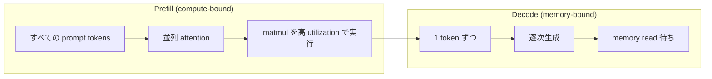
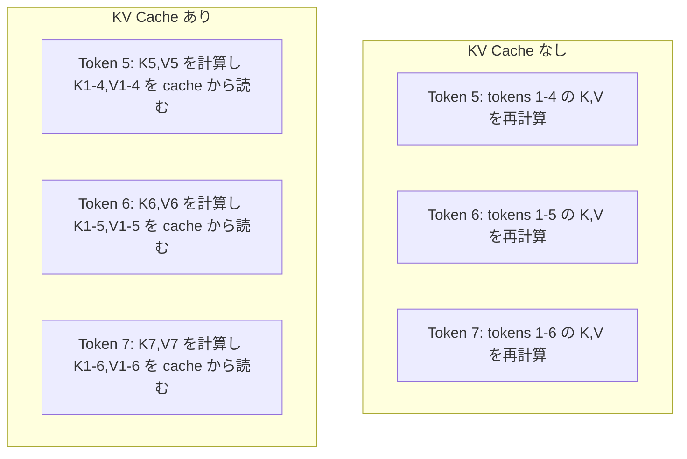
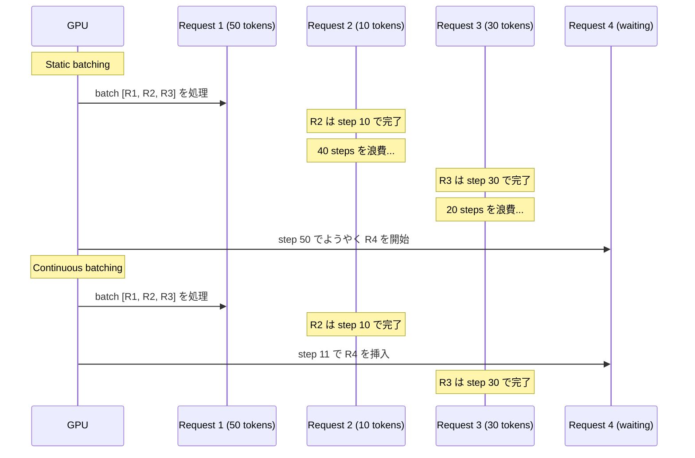
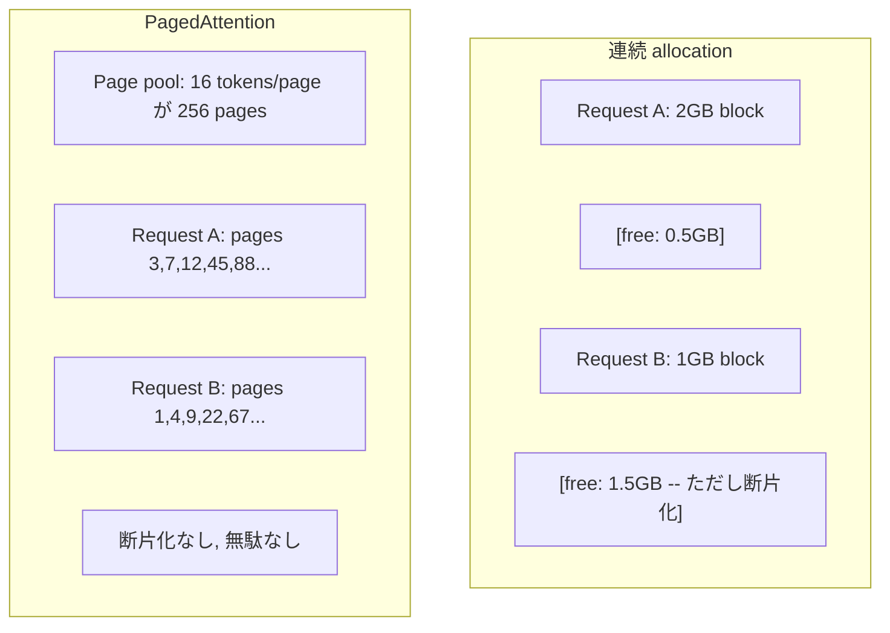
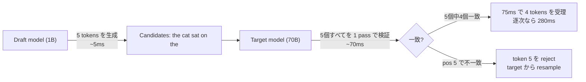

# 推論最適化

> LLM 推論は 2つの phase で決まります。Prefill は prompt を並列に処理し、compute-bound です。Decode は token を 1つずつ生成し、memory-bound です。すべての最適化は、このどちらか、または両方を対象にします。

**種類:** Build
**言語:** Python
**前提条件:** Phase 10, Lessons 01-08 (Transformer architecture, attention)
**所要時間:** 約120分

## 学習目標

- autoregressive token generation 中の冗長計算を取り除くために KV-cache を実装する
- LLM 推論の prefill と decode phase を説明し、それぞれの bottleneck が異なる理由 (compute-bound vs memory-bound) を理解する
- concurrent requests 下で GPU utilization を最大化するために、continuous batching と PagedAttention の考え方を実装する
- KV-cache、speculative decoding、flash attention などの推論最適化手法を比較し、throughput/latency のトレードオフを説明する

## 問題

Llama 3 70B を 4xA100 GPU にデプロイしたとします。ユーザーが 1人なら約 50 tokens/second です。十分速く感じます。しかし 100人のユーザーが同時に endpoint を叩くと、throughput は 3 tokens/second/user に落ちます。月額 $25,000 の GPU 料金を払っているのに、人間が入力する速度より遅い応答を配信している状態です。

ユーザーが 1人でも 100人でも、モデル自体は変わりません。同じ重み、同じ architecture、同じ計算です。変わるのは作業の schedule 方法です。素朴な推論は、利用可能な GPU compute の 90% 以上を無駄にします。token 47 を待っているユーザーが batch slot 全体を占有する一方で、GPU memory bus は matmul の合間に idle になります。その dead time には、新しいユーザーの 2,000-token prompt を処理する有用な compute を詰め込めるはずです。

これは scaling の問題ではありません。scheduling の問題です。このレッスンで扱う KV caching、continuous batching、PagedAttention、speculative decoding、prefix caching は、同じ traffic をさばくのに月 $25k かかる推論と、月 $5k で済む推論を分ける技術です。

4xA100-80GB 上で Llama 3 70B を serving する vLLM は、低 concurrency では約 50 tokens/second/user を達成し、continuous batching と PagedAttention により 100 concurrent requests でも 15-25 TPS/user を維持します。これらの最適化がなければ、同じ hardware はその concurrency で 5 TPS/user しか出せません。同じ GPU、同じモデルで、throughput は 4倍になります。

## コンセプト

### Prefill vs Decode

すべての LLM 推論 request には、明確に異なる 2つの phase があります。

**Prefill** は入力 prompt 全体を処理します。すべての token が既知なので、attention は sequence 全体に対して並列に計算できます。これは大きな matrix multiplication であり、GPU cores は忙しく動き続けます。bottleneck は compute、つまり hardware が 1秒あたり何 FLOPS 出せるかです。A100 は 312 TFLOPS (BF16) です。70B モデルで 4,096-token prompt の prefill を行うと、単一 A100 で約 400ms かかります。

**Decode** は出力 token を 1つずつ生成します。各 new token は過去すべての token に attend しますが、1回の forward pass で生成される token は 1つだけです。重み行列のサイズは prefill 時と同じですが、行列ではなく単一 vector を掛けます。GPU cores は microseconds で処理を終え、その後は次の重み batch が memory から届くのを待ちます。bottleneck は memory bandwidth、つまり HBM から compute units へ model weights をどれだけ速く stream できるかです。A100 の bandwidth は 2 TB/s です。FP16 の 70B モデルは 140 GB です。モデル全体を 1回読むだけで 70ms かかり、これが単一 decode step の下限になります。



**ops:byte ratio** (arithmetic intensity とも呼ばれます) はこのトレードオフを捉える指標です。memory から読み込んだ 1 byte あたり、何回の演算を行うかを測ります。

```
ops:byte ratio = FLOPs per token / bytes read from memory
```

4,096 tokens の batch で prefill を行う場合、読み込んだ重み 1つあたり約 4,096 回の multiply-accumulate operation を実行します。ratio は高く、compute-bound です。batch size 1 の decode では、読み込んだ重み 1つあたり約 1 回の演算しか行いません。ratio は低く、memory-bound です。

根本的な洞察は、*decode は 1 token を生成するためにモデル全体を読むので memory-bound になる* ということです。以下の最適化はいずれも、読む量を減らすか、1回の read で処理する token batch を増やすか、read 自体を避けます。

### KV Cache

attention 中、各 token の query は過去すべての token の key/value vectors に attend します。cache がない場合、token N を生成するには、それ以前の N-1 tokens すべてについて key/value projection を再計算する必要があります。token 1 は token 2 の生成時に projection され、token 3 の生成時にも、token 4 の生成時にも再び projection されます。token 1,000 に到達する頃には、token 1 を合計 999 回 projection しています。

KV cache は過去すべての token の key/value projection を保存します。token N を生成するときは、token N の key/value だけを計算し、それを token 1 から N-1 までの cached K/V と連結します。



**KV cache のメモリ式:**

```
KV cache size = 2 * num_layers * num_kv_heads * head_dim * seq_len * bytes_per_param
```

Llama 3 70B (80 layers、GQA による 8 KV heads、head_dim=128、BF16) では次のようになります。

```
per token: 2 * 80 * 8 * 128 * 2 bytes = 327,680 bytes = 320 KB
at 4,096 tokens: 320 KB * 4,096 = 1.28 GB
at 128K tokens: 320 KB * 131,072 = 40 GB
```

Llama 3 70B の単一 128K-context 会話は、KV cache だけで 40 GB を消費します。これは A100 のメモリの半分です。100 concurrent users がそれぞれ 4K tokens を使うと、KV cache だけで 128 GB が必要になります。だからこそ、KV cache 管理は推論最適化の中心課題です。

### Continuous Batching

Static batching は N 個の requests が batch として到着するまで待ち、それらをまとめて処理し、*全員* が終わるまで新しい requests を受け入れません。ある request が 500 tokens、別の request が 10 tokens 必要な場合、短い request は完了後も 490 decode steps の間 idle のままになります。

Continuous batching (iteration-level batching とも呼ばれる) は、任意の request が完了した時点で、新しい request を batch に挿入します。batch は decode step ごとに再評価されます。10 tokens で終わった request は、待機中の request にすぐ置き換えられます。



throughput の改善幅は、出力長のばらつきに依存します。長さが均一なら continuous batching は static batching と同等です。長さがばらつく一般的なケースでは、GPU slot が空のままにならないため、continuous batching は 2-5倍高い throughput を出せます。

### PagedAttention

各 request の KV cache は連続した memory block です。requests が到着・終了するにつれて memory は断片化します。これは OS の RAM fragmentation とまったく同じです。4K-token request には 1.28 GB の連続領域が必要です。合計で 2 GB 空いていても、1.28 GB の*連続*領域がないかもしれません。その場合、memory を無駄にするか request を拒否するしかありません。

PagedAttention (vLLM 由来) は、OS-style の virtual memory を KV cache に適用します。request ごとに 1つの連続 block を割り当てる代わりに、固定サイズの "pages" (典型的には各 16 tokens) を割り当てます。pages は物理 GPU memory 内のどこにあっても構いません。page table が各 request の logical sequence positions を physical page locations に対応付けます。



PagedAttention は shared prefixes に対する **copy-on-write** も可能にします。50 requests が同じ system prompt を共有する場合、その system prompt の KV cache pages は 1回だけ保存され、50 requests すべてから参照されます。request が分岐したとき (異なる user messages が来たとき) だけ、それぞれ固有の pages を持ちます。これにより、shared system prompts を持つ application の memory usage は劇的に下がります。

vLLM は PagedAttention により、memory waste をほぼゼロに近づけています (naive allocation の約 60-80% に対して約 4%)。

### Speculative Decoding

Decode は逐次的なので遅くなります。1 token を生成し、それを戻し、次を生成します。では、次の 5 tokens を安価に推測し、それらをまとめて検証できたらどうでしょうか。

Speculative decoding は、小さく高速な **draft model** で K 個の candidate tokens を生成します。その後、大きな **target model** が K 個すべての candidate を単一の forward pass で処理します (これは prefill に似ており、並列で compute-bound なので効率的です)。target model が draft model の予測に同意すれば、target forward pass 1回分の時間で K tokens すべてを受け入れます。位置 j で同意しなければ、tokens 1 から j-1 までを受け入れ、残りを捨てます。



高速化幅は **acceptance rate**、つまり draft model の予測が target と一致する頻度に依存します。Llama 3 70B のために Llama 3 8B を draft として使う場合、自然言語では 70-85% の acceptance rate が典型的です。これは decode の 2-3倍高速化につながります。

speculative decoding には 3つの approach があります。

| 手法 | Draft source | Acceptance rate | Overhead |
|--------|-------------|-----------------|----------|
| Draft-target (Leviathan et al.) | 別の小型 model | 70-85% | Draft model memory |
| EAGLE (Li et al.) | target 上の lightweight head | 75-90% | 約 1% extra parameters |
| N-gram lookup | Token n-gram table | 40-60% | ほぼ無視可能 |

**EAGLE** は target model の hidden states の上に小さな autoregressive head を学習します。target model の最後から 2番目の layer features を使って、次 token の embedding を予測します。別 model ではなく target model 自身の representations 上で動くため、少ない追加 memory で高い acceptance rate を達成します。EAGLE-2 は、context に基づいて candidate count を調整する dynamic draft tree を追加します。

**N-gram speculative decoding** は、現在の context または事前構築 corpus から n-gram continuations の table を保持します。draft が同じ会話内で以前に出た内容 (反復 pattern、code、structured output) と一致すれば、neural network overhead なしで機能します。平均的な acceptance rate は低めですが、1回の speculation あたりの cost は実質無料です。

Speculative decoding は*数学的に厳密*です。出力分布は target model の分布と同一です。近似ではありません。verification step により、受け入れられる各 token は target model が割り当てたはずの確率を正確に持つことが保証されます。

### Prefix Caching

多くの requests は同じ prefix を共有します。chatbot の system prompt、RAG context block、few-shot example set などです。prefix caching がなければ、すべての request がこれらの shared tokens の KV cache を最初から再計算します。

Prefix caching は common prefixes の KV cache を保存し、requests 間で再利用します。既知の prefix を持つ新しい request が到着すると、system は cached KV entries を copy (または参照) し、固有 suffix の KV だけを計算します。

すべての requests で共有される 2,000-token system prompt がある場合、prefix caching は request あたり約 400ms の prefill を削減します。100 requests/second では、1秒あたり 40秒分の GPU compute を節約します。これは GPU 1枚分を超える work です。

SGLang の RadixAttention は、token content で prefixes を index する radix tree (trie) により prefix caching を実装します。保存済み prefix に一致する request は、KV cache を無料で得られます。この tree は partial prefix match も可能にします。2,000 prefix tokens のうち 1,500 が cached entry と共有されていれば、その 1,500 を再利用し、残り 500 だけを再計算します。

### Inference Engines

production LLM serving では、主に 3つの engine が使われています。

| Engine | 主要な工夫 | 向いている用途 |
|--------|---------------|----------|
| vLLM | PagedAttention, continuous batching | 汎用 serving、最高の互換性 |
| SGLang | RadixAttention (prefix caching), structured generation | Multi-turn chatbots、constrained decoding |
| TensorRT-LLM | NVIDIA kernel fusion, FP8 quantization | NVIDIA hardware 上の最大 single-GPU throughput |

**vLLM** は標準的な出発点です。最も広い model range をサポートし、どの GPU vendor (NVIDIA, AMD, Intel) でも動き、PagedAttention + continuous batching により高い throughput を出します。OpenAI-compatible API により、任意の OpenAI API call の置き換えとしてそのまま使えます。

**SGLang** は vLLM と同じ基盤の上に、prefix caching のための RadixAttention と、structured LLM programs のための domain-specific language を追加しています。workload が multi-turn conversation、tool use、constrained decoding (JSON output、regex-guided generation) を含む場合、prefix reuse により SGLang は vLLM を 2-5倍上回ることがよくあります。

**TensorRT-LLM** は models を最適化済み NVIDIA GPU kernels に compile します。operations を fuse し (attention + linear + activation を 1 kernel にまとめる)、H100 GPUs では FP8 を使い、production deployment では NVIDIA Triton Inference Server と統合できます。NVIDIA hardware 上で最高の single-GPU throughput を達成しますが、setup は多く、NVIDIA GPUs でしか動きません。

Llama 3 70B (4xA100-80GB, BF16) の実測に近い数字:

| 指標 | vLLM | SGLang | TensorRT-LLM |
|--------|------|--------|---------------|
| Throughput (1 user) | ~50 TPS | ~55 TPS | ~65 TPS |
| Throughput (100 users) | ~2,500 total TPS | ~3,200 total TPS | ~3,000 total TPS |
| Time to first token | ~400ms | ~300ms (prefix hit) | ~350ms |
| Max context | 128K | 128K | 128K |

### Ops:Byte Framework

測定していないものは最適化できません。ops:byte ratio は workload が compute-bound か memory-bound かを示し、どの最適化が効くかを決めます。

```
Compute roof: GPU の peak FLOPS
Memory roof:  peak bandwidth * ops:byte ratio
```

ops:byte が低い場合 (decode、小さい batch)、memory bandwidth roof に当たります。compute を増やしても (higher clock、more cores) 効果はありません。memory reads を減らす (quantization、KV cache compression) か、batch size を増やして reads をより多くの有用な work に amortize する必要があります。

ops:byte が高い場合 (prefill、大きい batch)、compute roof に当たります。memory bandwidth optimization は効きません。より速い GPU、kernel fusion、または reduced precision によってより多くの FLOPS を引き出す必要があります。

| シナリオ | ops:byte | Bound | 最適化手法 |
|----------|----------|-------|---------------|
| Prefill, batch=1 | ~4,096 | Compute | Kernel fusion, FP8 |
| Decode, batch=1 | ~1 | Memory | Quantization, KV compression |
| Decode, batch=32 | ~32 | Memory | Larger batch, continuous batching |
| Decode, batch=256 | ~256 | Transitioning | 両方が重要 |
| Decode, batch=1024 | ~1,024 | Compute | Kernel fusion, tensor parallelism |

A100 での crossover point は ops:byte = 156 付近です (312 TFLOPS / 2 TB/s)。156 未満では memory-bound、156 を超えると compute-bound です。Continuous batching は iteration ごとにより多くの tokens を詰め込み、decode をこの crossover に近づけます。

## 作ってみる

### Step 1: KV Cache をゼロから作る

layer ごと、head ごとに key/value projection を保存する multi-head KV cache を作り、メモリ増加パターンを確認します。

```python
import numpy as np

class KVCache:
    def __init__(self, num_layers, num_heads, head_dim, max_seq_len, dtype=np.float16):
        self.num_layers = num_layers
        self.num_heads = num_heads
        self.head_dim = head_dim
        self.max_seq_len = max_seq_len
        self.dtype = dtype

        self.k_cache = np.zeros(
            (num_layers, num_heads, max_seq_len, head_dim), dtype=dtype
        )
        self.v_cache = np.zeros(
            (num_layers, num_heads, max_seq_len, head_dim), dtype=dtype
        )
        self.seq_len = 0

    def update(self, layer_idx, new_keys, new_values):
        num_new = new_keys.shape[1]
        end = self.seq_len + num_new
        self.k_cache[layer_idx, :, self.seq_len:end, :] = new_keys
        self.v_cache[layer_idx, :, self.seq_len:end, :] = new_values
        return (
            self.k_cache[layer_idx, :, :end, :],
            self.v_cache[layer_idx, :, :end, :]
        )

    def advance(self, num_tokens):
        self.seq_len += num_tokens

    def memory_bytes(self):
        return self.k_cache.nbytes + self.v_cache.nbytes

    def used_bytes(self):
        per_token = 2 * self.num_layers * self.num_heads * self.head_dim * np.dtype(self.dtype).itemsize
        return per_token * self.seq_len
```

### Step 2: KV Cache を使う Attention

decode steps で KV cache を使う簡略化した multi-head attention です。

```python
def scaled_dot_product_attention(query, keys, values):
    head_dim = query.shape[-1]
    scores = np.matmul(query, keys.transpose(0, 1, 3, 2)) / np.sqrt(head_dim)
    seq_len_q = scores.shape[-2]
    seq_len_k = scores.shape[-1]
    if seq_len_q > 1:
        mask = np.triu(np.ones((seq_len_q, seq_len_k), dtype=np.float32), k=seq_len_k - seq_len_q + 1)
        scores = scores + mask * (-1e9)
    max_scores = np.max(scores, axis=-1, keepdims=True)
    exp_scores = np.exp(scores - max_scores)
    attn_weights = exp_scores / np.sum(exp_scores, axis=-1, keepdims=True)
    return np.matmul(attn_weights, values)


class MultiHeadAttention:
    def __init__(self, d_model, num_heads):
        self.num_heads = num_heads
        self.head_dim = d_model // num_heads
        scale = np.sqrt(2.0 / d_model)
        self.W_q = np.random.randn(d_model, d_model).astype(np.float32) * scale
        self.W_k = np.random.randn(d_model, d_model).astype(np.float32) * scale
        self.W_v = np.random.randn(d_model, d_model).astype(np.float32) * scale
        self.W_o = np.random.randn(d_model, d_model).astype(np.float32) * scale

    def forward(self, x, kv_cache=None, layer_idx=0):
        batch, seq_len, d_model = x.shape
        Q = np.matmul(x, self.W_q).reshape(batch, seq_len, self.num_heads, self.head_dim).transpose(0, 2, 1, 3)
        K = np.matmul(x, self.W_k).reshape(batch, seq_len, self.num_heads, self.head_dim).transpose(0, 2, 1, 3)
        V = np.matmul(x, self.W_v).reshape(batch, seq_len, self.num_heads, self.head_dim).transpose(0, 2, 1, 3)

        if kv_cache is not None:
            K_full, V_full = kv_cache.update(layer_idx, K[0], V[0])
            K = K_full[np.newaxis, :, :, :]
            V = V_full[np.newaxis, :, :, :]
            if seq_len == 1:
                kv_cache.advance(1)

        attn_out = scaled_dot_product_attention(Q, K, V)
        attn_out = attn_out.transpose(0, 2, 1, 3).reshape(batch, -1, d_model)
        return np.matmul(attn_out, self.W_o)
```

### Step 3: Continuous Batching Simulator (シミュレータ)

static batching と continuous batching の scheduling の違いをシミュレートします。

```python
import heapq

class Request:
    def __init__(self, request_id, prompt_tokens, output_tokens, arrival_step):
        self.request_id = request_id
        self.prompt_tokens = prompt_tokens
        self.output_tokens = output_tokens
        self.arrival_step = arrival_step
        self.tokens_generated = 0
        self.start_step = None
        self.end_step = None

    def is_done(self):
        return self.tokens_generated >= self.output_tokens


def simulate_static_batching(requests, batch_size):
    step = 0
    completed = []
    queue = list(requests)
    queue.sort(key=lambda r: r.arrival_step)

    while queue:
        batch = []
        while queue and len(batch) < batch_size:
            r = queue.pop(0)
            r.start_step = max(step, r.arrival_step)
            batch.append(r)

        if batch:
            step = max(step, max(r.start_step for r in batch))
            max_output = max(r.output_tokens for r in batch)
            for r in batch:
                r.tokens_generated = r.output_tokens
                r.end_step = step + max_output
            step += max_output
            completed.extend(batch)

    return completed


def simulate_continuous_batching(requests, batch_size):
    step = 0
    completed = []
    queue = sorted(requests, key=lambda r: r.arrival_step)
    queue_idx = 0
    active = []
    waiting = []

    while queue_idx < len(queue) or active or waiting:
        while queue_idx < len(queue) and queue[queue_idx].arrival_step <= step:
            waiting.append(queue[queue_idx])
            queue_idx += 1

        while waiting and len(active) < batch_size:
            r = waiting.pop(0)
            r.start_step = step
            active.append(r)

        if not active:
            if waiting:
                step += 1
                continue
            elif queue_idx < len(queue):
                step = queue[queue_idx].arrival_step
                continue
            else:
                break

        for r in active:
            r.tokens_generated += 1

        done = [r for r in active if r.is_done()]
        for r in done:
            r.end_step = step + 1
            completed.append(r)
        active = [r for r in active if not r.is_done()]

        step += 1

    return completed


def batching_stats(completed):
    latencies = [r.end_step - r.arrival_step for r in completed]
    total_time = max(r.end_step for r in completed) - min(r.arrival_step for r in completed)
    total_tokens = sum(r.output_tokens for r in completed)
    return {
        "avg_latency": np.mean(latencies),
        "p50_latency": np.median(latencies),
        "p99_latency": np.percentile(latencies, 99),
        "total_time": total_time,
        "throughput": total_tokens / total_time if total_time > 0 else 0,
    }
```

### Step 4: Prefix Cache

shared prefixes の KV entries を保存する trie-based prefix cache です。

```python
class TrieNode:
    def __init__(self):
        self.children = {}
        self.kv_data = None
        self.hit_count = 0


class PrefixCache:
    def __init__(self, max_entries=1000):
        self.root = TrieNode()
        self.max_entries = max_entries
        self.total_entries = 0
        self.hits = 0
        self.misses = 0

    def _walk(self, token_ids):
        node = self.root
        depth = 0
        for tid in token_ids:
            if tid not in node.children:
                break
            node = node.children[tid]
            depth += 1
        return node, depth

    def lookup(self, token_ids):
        node, depth = self._walk(token_ids)
        if depth > 0:
            self.hits += 1
            current = self.root
            for tid in token_ids[:depth]:
                current = current.children[tid]
                current.hit_count += 1
            kv_entries = []
            current = self.root
            for tid in token_ids[:depth]:
                current = current.children[tid]
                if current.kv_data is not None:
                    kv_entries.append(current.kv_data)
            return depth, kv_entries
        self.misses += 1
        return 0, []

    def insert(self, token_ids, kv_per_token):
        node = self.root
        for i, tid in enumerate(token_ids):
            if tid not in node.children:
                if self.total_entries >= self.max_entries:
                    return i
                node.children[tid] = TrieNode()
                self.total_entries += 1
            node = node.children[tid]
            if i < len(kv_per_token):
                node.kv_data = kv_per_token[i]
        return len(token_ids)

    def hit_rate(self):
        total = self.hits + self.misses
        return self.hits / total if total > 0 else 0.0
```

### Step 5: Speculative Decoding Simulator (シミュレータ)

設定可能な acceptance rate で draft-target speculative decoding をシミュレートします。

```python
class DraftModel:
    def __init__(self, vocab_size, acceptance_rate=0.8):
        self.vocab_size = vocab_size
        self.acceptance_rate = acceptance_rate

    def generate(self, context, num_tokens):
        tokens = np.random.randint(0, self.vocab_size, size=num_tokens)
        return tokens

    def get_probs(self, context, token):
        probs = np.random.dirichlet(np.ones(self.vocab_size))
        return probs


class TargetModel:
    def __init__(self, vocab_size):
        self.vocab_size = vocab_size

    def get_probs(self, context, tokens=None):
        if tokens is not None:
            return [np.random.dirichlet(np.ones(self.vocab_size)) for _ in tokens]
        return np.random.dirichlet(np.ones(self.vocab_size))


def speculative_decode(draft_model, target_model, context, num_speculative=5,
                       draft_cost=1.0, target_cost=10.0, verify_cost=12.0):
    total_tokens = 0
    total_cost = 0.0
    accepted_counts = []
    context = list(context)

    max_tokens = 100

    while total_tokens < max_tokens:
        draft_tokens = draft_model.generate(context, num_speculative)
        total_cost += draft_cost * num_speculative

        target_probs = target_model.get_probs(context, draft_tokens)
        total_cost += verify_cost

        accepted = 0
        for i, token in enumerate(draft_tokens):
            draft_p = draft_model.get_probs(context + list(draft_tokens[:i]), token)
            target_p = target_probs[i]

            r = np.random.random()
            acceptance_prob = min(1.0, target_p[token] / (draft_p[token] + 1e-10))

            if r < draft_model.acceptance_rate:
                accepted += 1
                context.append(token)
                total_tokens += 1
            else:
                new_token = np.random.choice(draft_model.vocab_size, p=target_p)
                context.append(new_token)
                total_tokens += 1
                break

        accepted_counts.append(accepted)

        if accepted == num_speculative:
            bonus_probs = target_model.get_probs(context)
            bonus_token = np.random.choice(draft_model.vocab_size, p=bonus_probs)
            context.append(bonus_token)
            total_tokens += 1

    sequential_cost = total_tokens * target_cost
    return {
        "total_tokens": total_tokens,
        "speculative_cost": total_cost,
        "sequential_cost": sequential_cost,
        "speedup": sequential_cost / total_cost if total_cost > 0 else 1.0,
        "avg_accepted": np.mean(accepted_counts),
        "acceptance_rate": np.mean(accepted_counts) / num_speculative,
    }


def compare_speculation_strategies(vocab_size=1000, num_trials=20):
    results = {}

    for name, acceptance_rate, spec_tokens in [
        ("Draft-target (8B->70B)", 0.78, 5),
        ("EAGLE", 0.85, 6),
        ("N-gram", 0.50, 4),
        ("No speculation", 0.0, 0),
    ]:
        if spec_tokens == 0:
            results[name] = {
                "speedup": 1.0,
                "acceptance_rate": 0.0,
                "avg_accepted": 0.0,
            }
            continue

        trial_results = []
        for _ in range(num_trials):
            draft = DraftModel(vocab_size, acceptance_rate=acceptance_rate)
            target = TargetModel(vocab_size)
            context = list(np.random.randint(0, vocab_size, size=10))
            result = speculative_decode(draft, target, context, num_speculative=spec_tokens)
            trial_results.append(result)

        results[name] = {
            "speedup": np.mean([r["speedup"] for r in trial_results]),
            "acceptance_rate": np.mean([r["acceptance_rate"] for r in trial_results]),
            "avg_accepted": np.mean([r["avg_accepted"] for r in trial_results]),
        }

    return results
```

### Step 6: KV Cache Memory Profiler

実際の model configuration に対して、KV cache の memory requirements を計算します。

```python
MODEL_CONFIGS = {
    "Llama-3-8B": {
        "num_layers": 32, "num_kv_heads": 8, "head_dim": 128,
        "model_params_b": 8, "gqa": True,
    },
    "Llama-3-70B": {
        "num_layers": 80, "num_kv_heads": 8, "head_dim": 128,
        "model_params_b": 70, "gqa": True,
    },
    "Llama-3-405B": {
        "num_layers": 126, "num_kv_heads": 8, "head_dim": 128,
        "model_params_b": 405, "gqa": True,
    },
    "Mistral-7B": {
        "num_layers": 32, "num_kv_heads": 8, "head_dim": 128,
        "model_params_b": 7, "gqa": True,
    },
    "GPT-4-est": {
        "num_layers": 120, "num_kv_heads": 96, "head_dim": 128,
        "model_params_b": 1800, "gqa": False,
    },
}


def kv_cache_memory(config, seq_len, dtype_bytes=2):
    per_token = 2 * config["num_layers"] * config["num_kv_heads"] * config["head_dim"] * dtype_bytes
    total = per_token * seq_len
    return {
        "per_token_bytes": per_token,
        "per_token_kb": per_token / 1024,
        "total_bytes": total,
        "total_mb": total / (1024 ** 2),
        "total_gb": total / (1024 ** 3),
    }


def memory_budget(config, gpu_memory_gb, model_dtype_bytes=2, kv_dtype_bytes=2):
    model_memory_gb = config["model_params_b"] * 1e9 * model_dtype_bytes / (1024 ** 3)
    overhead_gb = gpu_memory_gb * 0.1
    available_for_kv = gpu_memory_gb - model_memory_gb - overhead_gb

    if available_for_kv <= 0:
        return {"error": "Model does not fit in GPU memory", "model_memory_gb": model_memory_gb}

    per_token = 2 * config["num_layers"] * config["num_kv_heads"] * config["head_dim"] * kv_dtype_bytes
    max_tokens = int(available_for_kv * (1024 ** 3) / per_token)

    return {
        "gpu_memory_gb": gpu_memory_gb,
        "model_memory_gb": round(model_memory_gb, 1),
        "overhead_gb": round(overhead_gb, 1),
        "available_for_kv_gb": round(available_for_kv, 1),
        "max_total_tokens": max_tokens,
        "max_users_at_2k": max_tokens // 2048,
        "max_users_at_4k": max_tokens // 4096,
        "max_users_at_32k": max_tokens // 32768,
    }
```

## 使ってみる

vLLM の場合:

```python
from vllm import LLM, SamplingParams

llm = LLM(
    model="meta-llama/Llama-3-70B-Instruct",
    tensor_parallel_size=4,
    enable_prefix_caching=True,
    max_model_len=8192,
    gpu_memory_utilization=0.9,
)

params = SamplingParams(temperature=0.7, max_tokens=256)
outputs = llm.generate(["Explain inference optimization in one paragraph."], params)
```

prefix caching + structured output に SGLang を使う場合:

```python
import sglang as sgl

@sgl.function
def classify(s, text):
    s += sgl.system("You are a classifier. Output JSON only.")
    s += sgl.user(f"Classify this text: {text}")
    s += sgl.assistant(sgl.gen("result", regex=r'\{"label": "(positive|negative|neutral)"\}'))

runtime = sgl.Runtime(model_path="meta-llama/Llama-3-70B-Instruct", tp_size=4)
sgl.set_default_backend(runtime)

results = classify.run_batch([
    {"text": "This product is amazing!"},
    {"text": "Terrible experience."},
    {"text": "It was okay I guess."},
])
```

TensorRT-LLM の場合:

```python
import tensorrt_llm
from tensorrt_llm.runtime import ModelRunner

runner = ModelRunner.from_dir("./llama-70b-trt-engine/", rank=0)

outputs = runner.generate(
    batch_input_ids=[tokenizer.encode("Explain KV caching.")],
    max_new_tokens=256,
    temperature=0.7,
)
```

## 仕上げ

このレッスンでは次を作ります。
- `outputs/skill-inference-optimization.md` -- LLM inference serving を診断し、最適化するための skill

## 演習

1. KV cache profiler を変更し、FP16、FP8、INT4 の KV cache quantization を比較してください。Llama 3 70B の 4K context について、4xA100-80GB 上でそれぞれの max concurrent users を計算します。KV を INT4 に量子化すると、user capacity はおおよそ 4倍になるはずです。

2. continuous batching simulator を拡張し、GPU utilization (step ごとに埋まっている batch slots の割合) を追跡してください。output length が Pareto distribution (shape=1.5, scale=20) に従う 50 requests について、static batching と continuous batching の utilization 推移を plot します。continuous batching は >80% utilization を維持するはずです。

3. `num_kv_heads < num_query_heads` となる grouped-query attention (GQA) 版の KV cache を実装してください。Llama 3 70B は 64 query heads を使いますが、KV heads は 8 だけです。full multi-head attention と比べたメモリ削減量を計算してください (KV cache size が 8分の1)。

4. LRU eviction を使う prefix cache を作ってください。max_entries を 500 に設定し、60% が 5つの common prefixes のどれかを共有する 1,000 requests を生成します。hit rate を測定し、unlimited cache と比較してください。適切な eviction なら hit rate は 55% を超えるはずです。

5. speculative decoding simulator を拡張し、tree-based speculation (EAGLE-2 style) を実装してください。K 個の draft tokens からなる単一 chain ではなく、candidate tree を生成します (例: 3 levels の各 level に 2 branches = 8 leaf candidates)。verification round あたりに受理された total tokens を linear speculation と比較してください。

## 重要用語

| 用語 | よくある言い方 | 実際の意味 |
|------|----------------|----------------------|
| Prefill | 「prompt を処理する」 | すべての input tokens に対して並列に attention を計算すること。full matrix multiplication が GPU cores を使い切るため compute-bound |
| Decode | 「tokens を生成する」 | forward pass ごとに 1 token を生成し、そのたびに model weights 全体を読むこと。次の重みが届く前に compute が終わるため memory-bound |
| KV cache | 「attention states を cache する」 | 過去すべての token の key/value projection を保存し、各 decode step で再計算しないようにすること。memory と compute を交換する |
| Continuous batching | 「dynamic batching」 | batch 全体の完了を待つのではなく、request が完了したらすぐ running batch に新しい request を挿入する方式。decode iteration ごとに評価される |
| PagedAttention | 「KV cache の virtual memory」 | KV cache を連続 block ではなく固定サイズ pages に割り当て、memory fragmentation をなくし、shared prefixes の copy-on-write を可能にする方式 |
| Speculative decoding | 「draft and verify」 | 高速な draft model で複数 tokens を提案し、それらを target model の 1 forward pass で検証する方式。数学的に厳密で、2-3倍高速化できる |
| EAGLE | 「self-speculative decoding」 | target model 自身の hidden states 上に lightweight head を学習する speculative decoding variant。別の draft model より高い acceptance rate を達成する |
| Prefix caching | 「system prompt KV の再利用」 | common prefixes (system prompts、few-shot examples) の計算済み KV cache entries を保存し、requests 間で再利用して冗長な prefill を skip する |
| Ops:byte ratio | 「arithmetic intensity」 | memory bytes read に対する compute operations の比率。workload が compute-bound (高い ratio) か memory-bound (低い ratio) かを決める |
| Time to first token | "TTFT" | request 受信から最初の output token 生成までの latency。長い prompts では prefill time が支配的 |

## 参考資料

- Kwon et al., "Efficient Memory Management for Large Language Model Serving with PagedAttention" (2023) -- paged KV cache management を導入した vLLM 論文。現在の inference serving における業界標準
- Leviathan et al., "Fast Inference from Transformers via Speculative Decoding" (2023) -- draft-verify speculation が正確な target model distribution を保ちながら 2-3倍高速化できることを示した基礎論文
- Li et al., "EAGLE: Speculative Sampling Requires Rethinking Feature Uncertainty" (2024) -- 別の draft model ではなく target model 自身の features 上に head を学習し、より高い acceptance rate を達成する手法
- Zheng et al., "SGLang: Efficient Execution of Structured Language Model Programs" (2024) -- prefix caching のための RadixAttention と、multi-call LLM programs のための programming model を導入
- Williams et al., "Roofline: An Insightful Visual Performance Model for Multicore Architectures" (2009) -- compute と memory bottleneck を考えるための ops:byte framework を形式化した元祖 roofline 論文
