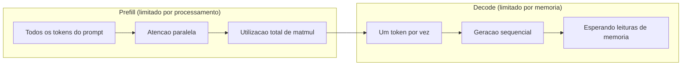
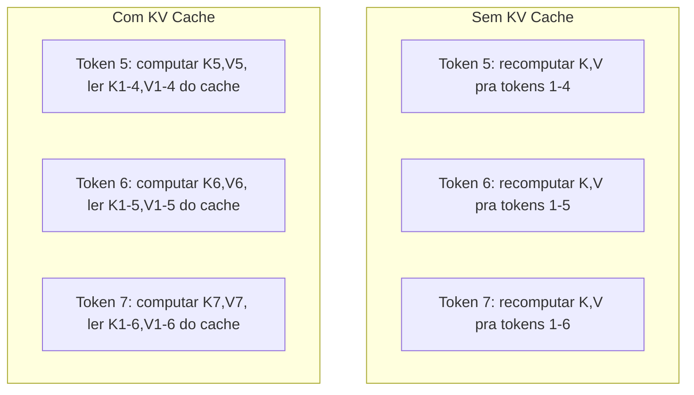
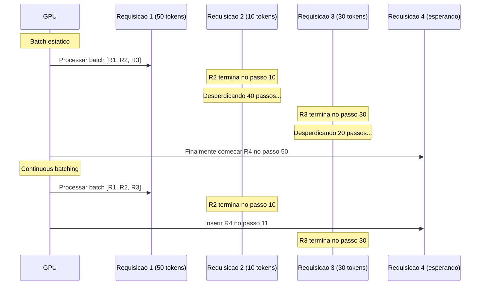
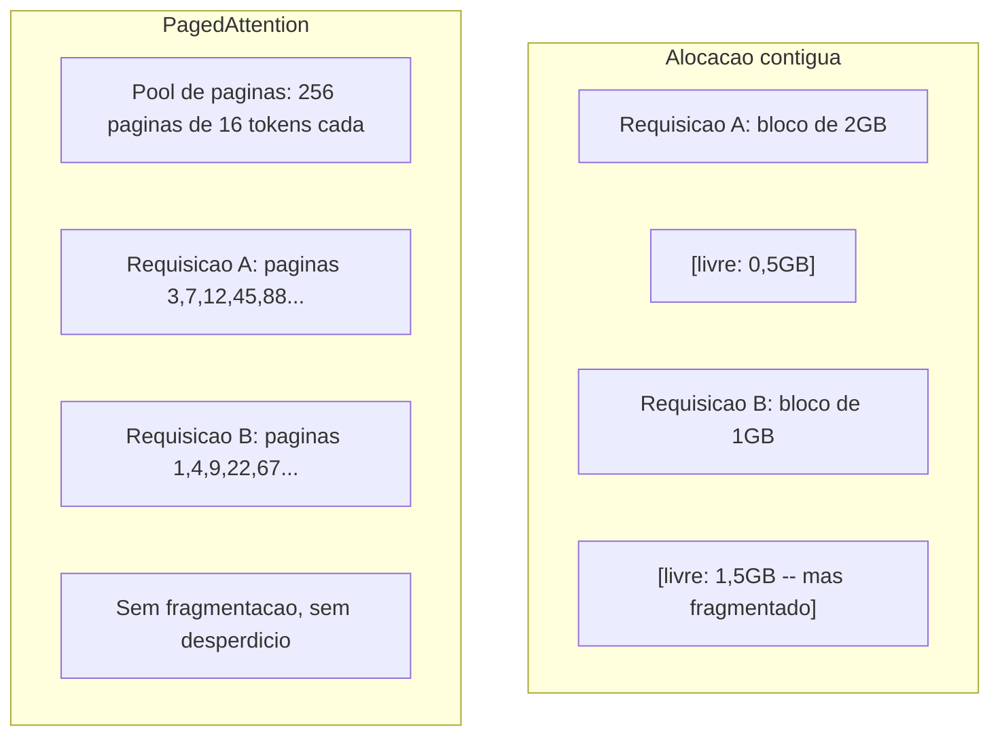
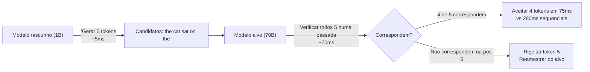

# Otimizacao de Inferencia

> Duas fases definem inferencia de LLM. Prefill processa seu prompt em paralelo -- limitado por processamento. Decode gera tokens um por vez -- limitado por memoria. Toda otimizacao ataca uma ou ambas.

**Tipo:** Construir
**Linguagens:** Python
**Pre-requisitos:** Fase 10, Aulas 01-08 (Arquitetura transformer, atencao)
**Tempo:** ~120 minutos

## Objetivos de Aprendizado

- Implementar KV-cache pra eliminar computacao redundante durante geracao autoregressiva de tokens
- Explicar as fases de prefill vs decode de inferencia de LLM e por que cada uma tem gargalos diferentes (limitado por processamento vs limitado por memoria)
- Implementar conceitos de continuous batching e PagedAttention pra maximizar utilizacao de GPU sob requisicoes concorrentes
- Comparar tecnicas de otimizacao de inferencia (KV-cache, especificaçãoulative decoding, flash attention) e seus tradeoffs de throughput/latencia

## O Problema

Voce deploya Llama 3 70B em 4xA100 GPUs. Um usuario unico ganha ~50 tokens por segundo. Parece rapido. Entao 100 usuarios batem no endpoint simultaneamente. O throughput cai pra 3 tokens/segundo/usuario. Sua conta de GPU de $25.000/mes ta servindo respostas mais lentas que um humano digita.

O modelo em si nao muda entre 1 usuario e 100 usuarios. Mesmos pesos, mesma arquitetura, mesma matematica. O que muda e como voce agenda o trabalho. Inferencia ingenua desperdicia 90%+ do compute disponivel de GPU. Um usuario esperando pelo token 47 segura um slot de batch inteiro aberto enquanto o barramento de memoria da GPU fica ocioso entre matmuls. Enquanto isso, o prompt de 2.000 tokens de um novo usuario poderia preencher esse tempo morto com compute util.

Isso nao e um problema de scaling. E um problema de escalonamento. As tecnicas nessa aula -- KV caching, continuous batching, PagedAttention, especificaçãoulative decoding, prefix caching -- sao o que separa uma conta de inferencia de $25k/mes de uma de $5k/mes servindo o mesmo trafego.

vLLM servindo Llama 3 70B em 4xA100-80GB alcança ~50 tokens/segundo/usuario em baixa concorrencia, e sustenta 15-25 TPS/usuario em 100 requisicoes concorrentes via continuous batching e PagedAttention. Sem essas otimizacoes, o mesmo hardware serve 5 TPS/usuario nessa concorrencia. Mesmas GPUs, mesmo modelo, 4x o throughput.

## O Conceito

### Prefill vs Decode

Toda requisicao de inferencia de LLM tem duas fases distintas.

**Prefill** processa o prompt inteiro de entrada. Todos os tokens sao conhecidos, entao atencao pode ser computada em paralelo em toda a sequencia. Essa e uma multiplicacao de matrizes grande -- nucleos de GPU ficam ocupados. O gargalo e compute: quantos FLOPS seu hardware consegue entregar por segundo. Um A100 faz 312 TFLOPS (BF16). Prefill pra um prompt de 4.096 tokens num modelo de 70B leva ~400ms num unico A100.

**Decode** gera tokens de saida um por vez. Cada token novo atende todos os tokens anteriores, mas apenas um token e produzido por forward pass. As matrizes de pesos sao do mesmo tamanho que durante prefill, mas voce ta multiplicando por um unico vetor ao inves de uma matriz. Os nucleos de GPU terminam em microsegundos, depois esperam o proximo lote de pesos chegar da memoria. O gargalo e largura de banda de memoria: quao rapido voce pode transmitir pesos do modelo da HBM pra unidade de compute. Um A100 tem 2 TB/s de bandwidth. Um modelo de 70B em FP16 e 140GB. Ler o modelo inteiro uma vez leva 70ms -- esse e seu piso pra um unico passo de decode.



A **razao ops:byte** (tambem chamada intensidade aritmetica) captura esse tradeoff. Ela mede quantas operacoes voce faz por byte lido da memoria.

```
razao ops:byte = FLOPs por token / bytes lidos da memoria
```

Durante prefill com um lote de 4.096 tokens, voce faz ~4.096 operacoes multiply-accumulate por peso carregado. A razao e alta -- voce e limitado por processamento. Durante decode com batch size 1, voce faz ~1 operacao por peso carregado. A razao e baixa -- voce e limitado por memoria.

A percepcao fundamental: *decode e limitado por memoria porque voce le o modelo inteiro pra produzir um unico token*. Toda otimizacao abaixo ou reduz o que voce le, aumenta o lote de tokens processados por leitura, ou evita leituras completamente.

### KV Cache

Durante atencao, a consulta de cada token atende os vetores key e value de todos os tokens anteriores. Sem caching, gerar o token N requer recomputar as projecoes de key e value pra todos os N-1 tokens anteriores. Token 1 e projetado quando gerando token 2, depois de novo pro token 3, depois de novo pro token 4. No token 1.000, voce projetou o token 1 um total de 999 vezes.

O KV cache armazena as projecoes de key e value de todos os tokens anteriores. Quando gerando o token N, voce so computa key e value pro token N, depois concatena com os K/V cacheados dos tokens 1 a N-1.



**Formula de memoria pro KV cache:**
```
Tamanho do KV cache = 2 * num_layers * num_kv_heads * head_dim * seq_len * bytes_per_param
```

Pra Llama 3 70B (80 layers, 8 KV heads com GQA, head_dim=128, BF16):
```
por token: 2 * 80 * 8 * 128 * 2 bytes = 327.680 bytes = 320 KB
em 4.096 tokens: 320 KB * 4.096 = 1,28 GB
em 128K tokens: 320 KB * 131.072 = 40 GB
```

Uma unica conversacao de contexto 128K pro Llama 3 70B consome 40 GB de KV cache -- metade da memoria de uma A100. Com 100 usuarios concorrentes a 4K tokens cada, so o KV cache ja exige 128 GB. E por que o gerenciamento de KV cache e o desafio central da otimizacao de inferencia.

### Continuous Batching

Batching estatico espera ate um lote de N requisicoes chegar, processa todas juntas, e espera ate *todas* terminarem antes de aceitar novas requisicoes. Se uma requisicao precisa de 500 tokens e outra de 10, a requisicao curta fica ociosa por 400 passos de decode depois de terminar.

Continuous batching (tambem chamado batching a nivel de iteracao) insere novas requisicoes no lote assim que qualquer uma completa. O lote e reavaliado em cada passo de decode. Uma requisicao que termina apos 10 tokens e imediatamente substituida por uma requisicao que esta esperando.



A melhoria de throughput depende de quanto os tamanhos de saida variam. Com tamanhos uniformes, continuous batching igualla batching estatico. Com tamanhos variaveis (o caso comum), continuous batching pode entregar 2-5x mais throughput porque slots de GPU nunca ficam vazios.

### PagedAttention

O KV cache de cada requisicao e um bloco contiguo de memoria. Conforme requisicoes chegam e saem, a memoria fragmenta -- exatamente como fragmentacao de RAM em sistemas operacionais. Uma requisicao de 4K tokens precisa de 1,28 GB contiguo. Mesmo que voce tenha 2 GB livres no total, voce pode nao ter 1,28 GB *contiguo*. Voce ou desperdicia memoria ou rejeita a requisicao.

PagedAttention (do vLLM) aplica memoria virtual estilo SO pro KV cache. Ao inves de alocar um bloco contiguo por requisicao, ele alocar "paginas" de tamanho fixo (tipicamente 16 tokens cada). Paginas podem estar em qualquer lugar na memoria fisica da GPU. Uma tabela de paginas mapeia as posicoes logicas da sequencia de cada requisicao pra localizacoes fisicas das paginas.



PagedAttention tambem habilita **copy-on-write** pra prefixes compartilhados. Se 50 requisicoes compartilham o mesmo system prompt, as paginas do KV cache daquele system prompt sao armazenadas uma vez e referenciadas pelas 50 requisicoes. Apenas quando uma requisicao diverge (mensagens de usuario diferentes) ela ganha suas proprias paginas. Isso reduz dramaticamente o uso de memoria pra aplicacoes com system prompts compartilhados.

vLLM reporta desperdicio de memoria proximo de zero (~4% vs ~60-80% em alocacao ingenua) atraves do PagedAttention.

### Speculative Decoding

Decode e lento porque e sequencial -- voce gera um token, alimenta de volta, gera o proximo. Mas e se voce pudesse adivinhar os proximos 5 tokens barato, e depois verifica-los todos de uma vez?

Speculative decoding usa um modelo rascunho **rapido e pequeno** pra gerar K tokens candidatos. O **modelo alvo** grande entao processa todos os K candidatos num unico forward pass (que parece um prefill -- paralelo, limitado por processamento, eficiente). Se o modelo alvo concorda com as previsoes do modelo rascunho, voce aceita todos os K tokens no tempo de um forward pass do alvo. Se discorda na posicao j, voce aceita tokens 1 a j-1 e descarta o resto.



A aceleracao depende da **taxa de aceitacao** -- com que frequencia as previsoes do modelo rascunho correspondem ao alvo. Pra um Llama 3 8B rascunhando pro Llama 3 70B, taxas de aceitacao de 70-85% sao tipicas em linguagem natural. Isso se traduz em 2-3x de aceleracao no decode.

Tres abordagens pra especificaçãoulative decoding:

| Metodo | Fonte do rascunho | Taxa de aceitacao | Overhead |
|--------|-------------|-----------------|----------|
| Draft-target (Leviathan et al.) | Modelo separado pequeno | 70-85% | Memoria do modelo rascunho |
| EAGLE (Li et al.) | Cabeca leve no alvo | 75-90% | ~1% de parametros extras |
| Busca N-gram | Tabela de n-gram de tokens | 40-60% | Desprezivel |

**EAGLE** treina uma cabeca autoregressiva leve em cima dos estados ocultos do proprio modelo alvo. Ele prevê a embedding do proximo token usando as features da penultima camada do modelo alvo. Porque opera nas representacoes do proprio modelo alvo (nao de um modelo separado), ele alcança taxas de aceitacao maiores com memoria extra minima. EAGLE-2 adiciona uma arvore de rascunho dinamica que ajusta o numero de candidatos baseado no contexto.

**Speculative decoding por N-gram** mantem uma tabela de continuacoes de n-gram do contexto atual ou de um corpus pre-construido. Se o rascunho corresponde ao que apareceu antes na mesma conversa (padroes repetitivos, codigo, saidas estruturadas), ele dispara sem overhead de rede neural. Taxas de aceitacao sao mais baixas em media mas o custo por eespecificaçãoulacao e praticamente zero.

Speculative decoding e *matematicamente exato* -- a distribuicao de saida e identica a distribuicao do modelo alvo. Nao e uma aproximacao. O passo de verificacao garante que cada token aceito tem exatamente a probabilidade que o modelo alvo teria atribuido.

### Prefix Caching

Muitas requisicoes compartilham o mesmo prefixo. Um system prompt de chatbot. Um bloco de contexto RAG. Um conjunto de exemplos few-shot. Sem prefix caching, toda requisicao recomputa o KV cache desses tokens compartilhados do zero.

Prefix caching armazena o KV cache pra prefixes comuns e reutiliza entre requisicoes. Quando uma nova requisicao chega com um prefixo conhecido, o sistema copia (ou referencia) as entradas KV cacheadas e so computa o KV pro sufixo unico.

Pra um system prompt de 2.000 tokens compartilhado entre todas as requisicoes, prefix caching elimina ~400ms de prefill por requisicao. A 100 requisicoes/segundo, isso economiza 40 segundos de compute de GPU por segundo -- mais que uma GPU inteira de trabalho.

O RadixAttention do SGLang implementa prefix caching com uma arvore radix (trie) que indexa prefixes pelo seu conteudo de tokens. Qualquer requisicao que combina um prefixo armazenado ganha seu KV cache de graça. A arvore permite correspondencias parciais de prefixo -- se voce compartilha 1.500 de 2.000 tokens do prefixo com uma entrada cacheada, voce reutiliza esses 1.500 e recomputa apenas 500.

### Engines de Inferencia

Tres engines dominam servico de LLM em producao:

| Engine | Inovacao chave | Melhor pra |
|--------|---------------|----------|
| vLLM | PagedAttention, continuous batching | Servico geral, maxima compatibilidade |
| SGLang | RadixAttention (prefix caching), geracao estruturada | Chatbots multi-turno, decodificacao restrita |
| TensorRT-LLM | Fusao de kernel NVIDIA, quantizacao FP8 | Maximo throughput single-GPU em hardware NVIDIA |

**vLLM** e o ponto de partida padrao. Ele suporta a mais ampla gama de modelos, roda em qualquer fabricante de GPU (NVIDIA, AMD, Intel) e alcança throughput forte via PagedAttention + continuous batching. A API compativel com OpenAI significa que voce pode dropar como substituto pra qualquer chamada de API OpenAI.

**SGLang** constrói sobre as mesmas bases que o vLLM mas adiciona RadixAttention pra prefix caching e uma linguagem de dominio pra programas LLM estruturados. Se seu workload envolve conversas multi-turno, uso de ferramentas ou decodificacao restrita (saida JSON, geracao guiada por regex), SGLang frequentemente supera vLLM em 2-5x via reuso de prefixo.

**TensorRT-LLM** compila modelos em kernels otimizados de GPU NVIDIA. Ele fusao operacoes (atencao + linear + ativacao num unico kernel), usa FP8 em GPUs H100 e integra com o NVIDIA Triton Inference Server pra implantação em producao. Ele alcança o maior throughput single-GPU em hardware NVIDIA mas exige mais configuracao e so funciona em GPUs NVIDIA.

Numeros reais pro Llama 3 70B (4xA100-80GB, BF16):

| Metrica | vLLM | SGLang | TensorRT-LLM |
|--------|------|--------|---------------|
| Throughput (1 usuario) | ~50 TPS | ~55 TPS | ~65 TPS |
| Throughput (100 usuarios) | ~2.500 TPS total | ~3.200 TPS total | ~3.000 TPS total |
| Tempo ate primeiro token | ~400ms | ~300ms (prefix hit) | ~350ms |
| Contexto maximo | 128K | 128K | 128K |

### O Framework Ops:Byte

Voce nao pode otimizar o que nao mede. A razao ops:byte te diz se voce e limitado por processamento ou memoria, o que determina quais otimizacoes importam.

```
Teto de compute: FLOPS pico da GPU
Teto de memoria: largura de banda maxima * razao ops:byte
```

Quando ops:byte e baixo (decode, lotes pequenos), voce bate no teto de largura de banda de memoria. Adicionar mais compute (clock maior, mais nucleos) nao ajuda. Voce precisa reduzir leituras de memoria (quantizacao, compressao de KV cache) ou aumentar o tamanho do lote pra amortizar leitras sobre mais trabalho util.

Quando ops:byte e alto (prefill, lotes grandes), voce bate no teto de compute. Otimizacao de largura de banda de memoria nao ajuda. Voce precisa de GPUs mais rapidas, fusao de kernels ou precisao reduzida pra extrair mais FLOPS.

| Cenario | ops:byte | Limitacao | Otimizar com |
|----------|----------|-------|---------------|
| Prefill, batch=1 | ~4.096 | Compute | Fusao de kernel, FP8 |
| Decode, batch=1 | ~1 | Memoria | Quantizacao, compressao KV |
| Decode, batch=32 | ~32 | Memoria | Lote maior, continuous batching |
| Decode, batch=256 | ~256 | Transicao | Ambos importam |
| Decode, batch=1024 | ~1.024 | Compute | Fusao de kernel, tensor parallelism |

O ponto de cruzamento no A100 e em torno de ops:byte = 156 (312 TFLOPS / 2 TB/s). Abaixo de 156, voce e limitado por memoria. Acima de 156, voce e limitado por processamento. Continuous batching empurra decode pra esse cruzamento empacotando mais tokens por iteracao.

## Construir

### Etapa 1: KV Cache Do Zero

Construimos um KV cache multi-head que armazena projecoes de key e value por camada, por head, e demonstra o padrao de crescimento de memoria.

```python
import numpy as np

class KVCache:
    def __init__(self, num_layers, num_heads, head_dim, max_seq_len, dtype=np.float16):
        self.num_layers = num_layers
        self.num_heads = num_heads
        self.head_dim = head_dim
        self.max_seq_len = max_seq_len
        self.dtype = dtype

        self.k_cache = np.zeros(
            (num_layers, num_heads, max_seq_len, head_dim), dtype=dtype
        )
        self.v_cache = np.zeros(
            (num_layers, num_heads, max_seq_len, head_dim), dtype=dtype
        )
        self.seq_len = 0

    def update(self, layer_idx, new_keys, new_values):
        num_new = new_keys.shape[1]
        end = self.seq_len + num_new
        self.k_cache[layer_idx, :, self.seq_len:end, :] = new_keys
        self.v_cache[layer_idx, :, self.seq_len:end, :] = new_values
        return (
            self.k_cache[layer_idx, :, :end, :],
            self.v_cache[layer_idx, :, :end, :]
        )

    def advance(self, num_tokens):
        self.seq_len += num_tokens

    def memory_bytes(self):
        return self.k_cache.nbytes + self.v_cache.nbytes

    def used_bytes(self):
        per_token = 2 * self.num_layers * self.num_heads * self.head_dim * np.dtype(self.dtype).itemsize
        return per_token * self.seq_len
```

### Etapa 2: Atencao com KV Cache

Uma atencao multi-head simplificada que usa o KV cache pra passos de decode.

```python
def scaled_dot_product_attention(consulta, keys, values):
    head_dim = consulta.shape[-1]
    scores = np.matmul(consulta, keys.transpose(0, 1, 3, 2)) / np.sqrt(head_dim)
    seq_len_q = scores.shape[-2]
    seq_len_k = scores.shape[-1]
    if seq_len_q > 1:
        mask = np.triu(np.ones((seq_len_q, seq_len_k), dtype=np.float32), k=seq_len_k - seq_len_q + 1)
        scores = scores + mask * (-1e9)
    max_scores = np.max(scores, axis=-1, keepdims=True)
    exp_scores = np.exp(scores - max_scores)
    attn_weights = exp_scores / np.sum(exp_scores, axis=-1, keepdims=True)
    return np.matmul(attn_weights, values)


class MultiHeadAttention:
    def __init__(self, d_model, num_heads):
        self.num_heads = num_heads
        self.head_dim = d_model // num_heads
        scale = np.sqrt(2.0 / d_model)
        self.W_q = np.random.randn(d_model, d_model).astype(np.float32) * scale
        self.W_k = np.random.randn(d_model, d_model).astype(np.float32) * scale
        self.W_v = np.random.randn(d_model, d_model).astype(np.float32) * scale
        self.W_o = np.random.randn(d_model, d_model).astype(np.float32) * scale

    def forward(self, x, kv_cache=None, layer_idx=0):
        batch, seq_len, d_model = x.shape
        Q = np.matmul(x, self.W_q).reshape(batch, seq_len, self.num_heads, self.head_dim).transpose(0, 2, 1, 3)
        K = np.matmul(x, self.W_k).reshape(batch, seq_len, self.num_heads, self.head_dim).transpose(0, 2, 1, 3)
        V = np.matmul(x, self.W_v).reshape(batch, seq_len, self.num_heads, self.head_dim).transpose(0, 2, 1, 3)

        if kv_cache is not None:
            K_full, V_full = kv_cache.update(layer_idx, K[0], V[0])
            K = K_full[np.newaxis, :, :, :]
            V = V_full[np.newaxis, :, :, :]
            if seq_len == 1:
                kv_cache.advance(1)

        attn_out = scaled_dot_product_attention(Q, K, V)
        attn_out = attn_out.transpose(0, 2, 1, 3).reshape(batch, -1, d_model)
        return np.matmul(attn_out, self.W_o)
```

### Etapa 3: Simulador de Continuous Batching

Simula a diferenca de escalonamento entre batching estatico e continuous.

```python
import heapq

class Request:
    def __init__(self, request_id, prompt_tokens, output_tokens, arrival_step):
        self.request_id = request_id
        self.prompt_tokens = prompt_tokens
        self.output_tokens = output_tokens
        self.arrival_step = arrival_step
        self.tokens_generated = 0
        self.start_step = None
        self.end_step = None

    def is_done(self):
        return self.tokens_generated >= self.output_tokens


def simulate_static_batching(requests, batch_size):
    step = 0
    completed = []
    queue = list(requests)
    queue.sort(key=lambda r: r.arrival_step)

    while queue:
        batch = []
        while queue and len(batch) < batch_size:
            r = queue.pop(0)
            r.start_step = max(step, r.arrival_step)
            batch.append(r)

        if batch:
            step = max(step, max(r.start_step for r in batch))
            max_output = max(r.output_tokens for r in batch)
            for r in batch:
                r.tokens_generated = r.output_tokens
                r.end_step = step + max_output
            step += max_output
            completed.extend(batch)

    return completed


def simulate_continuous_batching(requests, batch_size):
    step = 0
    completed = []
    queue = sorted(requests, key=lambda r: r.arrival_step)
    queue_idx = 0
    active = []
    waiting = []

    while queue_idx < len(queue) or active or waiting:
        while queue_idx < len(queue) and queue[queue_idx].arrival_step <= step:
            waiting.append(queue[queue_idx])
            queue_idx += 1

        while waiting and len(active) < batch_size:
            r = waiting.pop(0)
            r.start_step = step
            active.append(r)

        if not active:
            if waiting:
                step += 1
                continue
            elif queue_idx < len(queue):
                step = queue[queue_idx].arrival_step
                continue
            else:
                break

        for r in active:
            r.tokens_generated += 1

        done = [r for r in active if r.is_done()]
        for r in done:
            r.end_step = step + 1
            completed.append(r)
        active = [r for r in active if not r.is_done()]

        step += 1

    return completed


def batching_stats(completed):
    latencies = [r.end_step - r.arrival_step for r in completed]
    total_time = max(r.end_step for r in completed) - min(r.arrival_step for r in completed)
    total_tokens = sum(r.output_tokens for r in completed)
    return {
        "avg_latency": np.mean(latencies),
        "p50_latency": np.median(latencies),
        "p99_latency": np.percentile(latencies, 99),
        "total_time": total_time,
        "throughput": total_tokens / total_time if total_time > 0 else 0,
    }
```

### Etapa 4: Prefix Cache

Um prefix cache baseado em trie que armazena entradas KV pra prefixes compartilhados.

```python
class TrieNode:
    def __init__(self):
        self.children = {}
        self.kv_data = None
        self.hit_count = 0


class PrefixCache:
    def __init__(self, max_entries=1000):
        self.root = TrieNode()
        self.max_entries = max_entries
        self.total_entries = 0
        self.hits = 0
        self.misses = 0

    def _walk(self, token_ids):
        node = self.root
        depth = 0
        for tid in token_ids:
            if tid not in node.children:
                break
            node = node.children[tid]
            depth += 1
        return node, depth

    def lookup(self, token_ids):
        node, depth = self._walk(token_ids)
        if depth > 0:
            self.hits += 1
            current = self.root
            for tid in token_ids[:depth]:
                current = current.children[tid]
                current.hit_count += 1
            kv_entries = []
            current = self.root
            for tid in token_ids[:depth]:
                current = current.children[tid]
                if current.kv_data is not None:
                    kv_entries.append(current.kv_data)
            return depth, kv_entries
        self.misses += 1
        return 0, []

    def insert(self, token_ids, kv_per_token):
        node = self.root
        for i, tid in enumerate(token_ids):
            if tid not in node.children:
                if self.total_entries >= self.max_entries:
                    return i
                node.children[tid] = TrieNode()
                self.total_entries += 1
            node = node.children[tid]
            if i < len(kv_per_token):
                node.kv_data = kv_per_token[i]
        return len(token_ids)

    def hit_rate(self):
        total = self.hits + self.misses
        return self.hits / total if total > 0 else 0.0
```

### Etapa 5: Simulador de Speculative Decoding

Simulamos draft-target especificaçãoulative decoding com taxas de aceitacao configuraveis.

```python
class DraftModel:
    def __init__(self, vocab_size, acceptance_rate=0.8):
        self.vocab_size = vocab_size
        self.acceptance_rate = acceptance_rate

    def generate(self, context, num_tokens):
        tokens = np.random.randint(0, self.vocab_size, size=num_tokens)
        return tokens

    def get_probs(self, context, token):
        probs = np.random.dirichlet(np.ones(self.vocab_size))
        return probs


class TargetModel:
    def __init__(self, vocab_size):
        self.vocab_size = vocab_size

    def get_probs(self, context, tokens=None):
        if tokens is not None:
            return [np.random.dirichlet(np.ones(self.vocab_size)) for _ in tokens]
        return np.random.dirichlet(np.ones(self.vocab_size))


def especificaçãoulative_decode(draft_model, target_model, context, num_especificaçãoulative=5,
                       draft_cost=1.0, target_cost=10.0, verify_cost=12.0):
    total_tokens = 0
    total_cost = 0.0
    accepted_counts = []
    context = list(context)

    max_tokens = 100

    while total_tokens < max_tokens:
        draft_tokens = draft_model.generate(context, num_especificaçãoulative)
        total_cost += draft_cost * num_especificaçãoulative

        target_probs = target_model.get_probs(context, draft_tokens)
        total_cost += verify_cost

        accepted = 0
        for i, token in enumerate(draft_tokens):
            draft_p = draft_model.get_probs(context + list(draft_tokens[:i]), token)
            target_p = target_probs[i]

            r = np.random.random()
            acceptance_prob = min(1.0, target_p[token] / (draft_p[token] + 1e-10))

            if r < draft_model.acceptance_rate:
                accepted += 1
                context.append(token)
                total_tokens += 1
            else:
                new_token = np.random.choice(draft_model.vocab_size, p=target_p)
                context.append(new_token)
                total_tokens += 1
                break

        accepted_counts.append(accepted)

        if accepted == num_especificaçãoulative:
            bonus_probs = target_model.get_probs(context)
            bonus_token = np.random.choice(draft_model.vocab_size, p=bonus_probs)
            context.append(bonus_token)
            total_tokens += 1

    sequential_cost = total_tokens * target_cost
    return {
        "total_tokens": total_tokens,
        "especificaçãoulative_cost": total_cost,
        "sequential_cost": sequential_cost,
        "speedup": sequential_cost / total_cost if total_cost > 0 else 1.0,
        "avg_accepted": np.mean(accepted_counts),
        "acceptance_rate": np.mean(accepted_counts) / num_especificaçãoulative,
    }


def compare_especificaçãoulation_strategies(vocab_size=1000, num_trials=20):
    results = {}

    for name, acceptance_rate, especificação_tokens in [
        ("Draft-target (8B->70B)", 0.78, 5),
        ("EAGLE", 0.85, 6),
        ("N-gram", 0.50, 4),
        ("No especificaçãoulation", 0.0, 0),
    ]:
        if especificação_tokens == 0:
            results[name] = {
                "speedup": 1.0,
                "acceptance_rate": 0.0,
                "avg_accepted": 0.0,
            }
            continue

        trial_results = []
        for _ in range(num_trials):
            draft = DraftModel(vocab_size, acceptance_rate=acceptance_rate)
            target = TargetModel(vocab_size)
            context = list(np.random.randint(0, vocab_size, size=10))
            result = especificaçãoulative_decode(draft, target, context, num_especificaçãoulative=especificação_tokens)
            trial_results.append(result)

        results[name] = {
            "speedup": np.mean([r["speedup"] for r in trial_results]),
            "acceptance_rate": np.mean([r["acceptance_rate"] for r in trial_results]),
            "avg_accepted": np.mean([r["avg_accepted"] for r in trial_results]),
        }

    return results
```

### Etapa 6: Profiler de Memoria do KV Cache

Compute requisitos de memoria do KV cache pra configuracoes reais de modelos.

```python
MODEL_CONFIGS = {
    "Llama-3-8B": {
        "num_layers": 32, "num_kv_heads": 8, "head_dim": 128,
        "model_params_b": 8, "gqa": True,
    },
    "Llama-3-70B": {
        "num_layers": 80, "num_kv_heads": 8, "head_dim": 128,
        "model_params_b": 70, "gqa": True,
    },
    "Llama-3-405B": {
        "num_layers": 126, "num_kv_heads": 8, "head_dim": 128,
        "model_params_b": 405, "gqa": True,
    },
    "Mistral-7B": {
        "num_layers": 32, "num_kv_heads": 8, "head_dim": 128,
        "model_params_b": 7, "gqa": True,
    },
    "GPT-4-est": {
        "num_layers": 120, "num_kv_heads": 96, "head_dim": 128,
        "model_params_b": 1800, "gqa": False,
    },
}


def kv_cache_memory(config, seq_len, dtype_bytes=2):
    per_token = 2 * config["num_layers"] * config["num_kv_heads"] * config["head_dim"] * dtype_bytes
    total = per_token * seq_len
    return {
        "per_token_bytes": per_token,
        "per_token_kb": per_token / 1024,
        "total_bytes": total,
        "total_mb": total / (1024 ** 2),
        "total_gb": total / (1024 ** 3),
    }


def memory_budget(config, gpu_memory_gb, model_dtype_bytes=2, kv_dtype_bytes=2):
    model_memory_gb = config["model_params_b"] * 1e9 * model_dtype_bytes / (1024 ** 3)
    overhead_gb = gpu_memory_gb * 0.1
    available_for_kv = gpu_memory_gb - model_memory_gb - overhead_gb

    if available_for_kv <= 0:
        return {"error": "Model does not fit in GPU memory", "model_memory_gb": model_memory_gb}

    per_token = 2 * config["num_layers"] * config["num_kv_heads"] * config["head_dim"] * kv_dtype_bytes
    max_tokens = int(available_for_kv * (1024 ** 3) / per_token)

    return {
        "gpu_memory_gb": gpu_memory_gb,
        "model_memory_gb": round(model_memory_gb, 1),
        "overhead_gb": round(overhead_gb, 1),
        "available_for_kv_gb": round(available_for_kv, 1),
        "max_total_tokens": max_tokens,
        "max_users_at_2k": max_tokens // 2048,
        "max_users_at_4k": max_tokens // 4096,
        "max_users_at_32k": max_tokens // 32768,
    }
```

## Usar

Com vLLM:

```python
from vllm import LLM, SamplingParams

llm = LLM(
    model="meta-llama/Llama-3-70B-Instruct",
    tensor_parallel_size=4,
    enable_prefix_caching=True,
    max_model_len=8192,
    gpu_memory_utilization=0.9,
)

params = SamplingParams(temperature=0.7, max_tokens=256)
outputs = llm.generate(["Explain inference optimization in one paragraph."], params)
```

Com SGLang pra prefix caching + saida estruturada:

```python
import sglang as sgl

@sgl.function
def classify(s, text):
    s += sgl.system("You are a classifier. Output JSON only.")
    s += sgl.user(f"Classify this text: {text}")
    s += sgl.assistant(sgl.gen("result", regex=r'\{"label": "(positive|negative|neutral)"\}'))

runtime = sgl.Runtime(model_path="meta-llama/Llama-3-70B-Instruct", tp_size=4)
sgl.set_default_backend(runtime)

results = classify.run_batch([
    {"text": "This product is amazing!"},
    {"text": "Terrible experience."},
    {"text": "It was okay I guess."},
])
```

Com TensorRT-LLM:

```python
import tensorrt_llm
from tensorrt_llm.runtime import ModelRunner

runner = ModelRunner.from_dir("./llama-70b-trt-engine/", rank=0)

outputs = runner.generate(
    batch_input_ids=[tokenizer.encode("Explain KV caching.")],
    max_new_tokens=256,
    temperature=0.7,
)
```

## Publicar

Essa aula produz:
- `outputs/skill-inference-optimization.md` -- uma skill pra diagnosticar e otimizar inferencia de LLM em servico

## Exercicios

1. Modifique o profiler de KV cache pra comparar KV cache em FP16 vs FP8 vs INT4. Pra Llama 3 70B em contexto 4K, compute o maximo de usuarios concorrentes pra cada um em 4xA100-80GB. KV quantizado pra INT4 deveria mais ou menos 4x a capacidade de usuarios.

2. Estenda o simulador de continuous batching pra rastrear utilizacao de GPU (fracao de slots de batch preenchidos por passo). Trace a utilizacao ao longo do tempo pra batching estatico e continuous com 50 requisicoes cujos tamanhos de saida seguem uma distribuicao Pareto (shape=1.5, scale=20). Continuous batching deveria manter >80% de utilizacao.

3. Implemente uma versao de grouped-consulta attention (GQA) do KV cache onde `num_kv_heads < num_consulta_heads`. Llama 3 70B usa 64 consulta heads mas so 8 KV heads. Compute a economia de memoria vs atencao multi-head completa (8x de reducao no tamanho do KV cache).

4. Construa um prefix cache que usa despejo LRU. Defina max_entries pra 500 e gere 1.000 requisicoes onde 60% compartilham um de 5 prefixes comuns. Meça a taxa de hit e compare com cache ilimitado. Com despejo bom, a taxa de hit deveria ficar acima de 55%.

5. Estenda o simulador de especificaçãoulative decoding pra implementar eespecificaçãoulacao baseada em arvore (estilo EAGLE-2). Ao inves de uma cadeia unica de K tokens rascunho, gere uma arvore de candidatos (ex: 2 ramificacoes em cada de 3 niveis = 8 candidatos folha). Compare tokens totais aceitos por rodada de verificacao vs eespecificaçãoulacao linear.

## Termos Chave

| Termo | O que a gente diz | O que realmente significa |
|------|----------------|----------------------|
| Prefill | "Processando o prompt" | Computar atencao em todos os tokens de entrada em paralelo -- limitado por processamento porque a multiplicacao de matrizes inteira mantem nucleos de GPU ocupados |
| Decode | "Gerando tokens" | Produzir um token por forward pass, lendo os pesos do modelo inteiro toda vez -- limitado por memoria porque compute termina antes dos proximos pesos chegarem |
| KV cache | "Caching estados de atencao" | Armazenar projecoes de key e value pra todos os tokens anteriores pra que nao sejam recomputados a cada passo de decode -- troca memoria por processamento |
| Continuous batching | "Batching dinamico" | Inserir novas requisicoes no lote em execucao assim que qualquer requisicao termina, avaliado em cada iteracao de decode ao inves de esperar o lote inteiro |
| PagedAttention | "Memoria virtual pro KV cache" | Alocar KV cache em paginas de tamanho fixo ao inves de blocos contiguos, eliminando fragmentacao de memoria e habilitando copy-on-write pra prefixes compartilhados |
| Speculative decoding | "Rascunhar e verificar" | Usar um modelo rascunho rapido pra propor multiplos tokens, depois verifica-los todos num unico forward pass do modelo alvo -- matematicamente exato, 2-3x de aceleracao |
| EAGLE | "Speculative decoding auto" | Uma variante de especificaçãoulative decoding que treina uma cabeca leve nos proprios estados ocultos do modelo alvo, alcançando taxas de aceitacao maiores que um modelo rascunho separado |
| Prefix caching | "Reutilizar KV do system prompt" | Armazenar entradas KV cache calculadas pra prefixes comuns (system prompts, exemplos few-shot) e reutiliza-las entre requisicoes pra pular prefill redundante |
| Razao ops:byte | "Intensidade aritmetica" | A razao de operacoes de compute por bytes de memoria lidos -- determina se um workload e limitado por processamento (razao alta) ou memoria (razao baixa) |
| Tempo ate primeiro token | "TTFT" | Latencia de receber uma requisicao ate produzir o primeiro token de saida -- dominada pelo tempo de prefill pra prompts longos |

## Leitura Complementar

- Kwon et al., "Efficient Memory Management for Large Language Model Serving with PagedAttention" (2023) -- o paper do vLLM que introduziu gerenciamento de KV cache paginado, agora padrao da industria pra servico de inferencia
- Leviathan et al., "Fast Inference from Transformers via Speculative Decoding" (2023) -- o paper fundamental provando que eespecificaçãoulacao draft-verify produz distribuicoes exatas do modelo alvo enquanto alcanca 2-3x de aceleracao
- Li et al., "EAGLE: Speculative Sampling Requires Rethinking Feature Uncertainty" (2024) -- alcança taxas de aceitacao maiores treinando uma cabeca nas proprias features do modelo alvo ao inves de usar um modelo rascunho separado
- Zheng et al., "SGLang: Efficient Execution of Structured Language Model Programs" (2024) -- introduz RadixAttention pra prefix caching e um modelo de programacao pra programas LLM multi-chamada
- Williams et al., "Roofline: An Insightful Visual Performance Model for Multicore Architectures" (2009) -- o paper roofline original que formalizou o framework ops:byte pra raciocinar sobre gargalos de compute vs memoria
