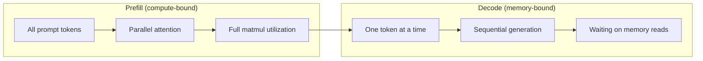
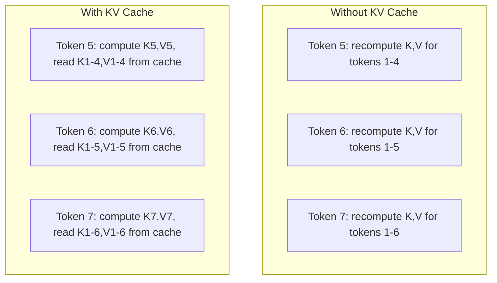
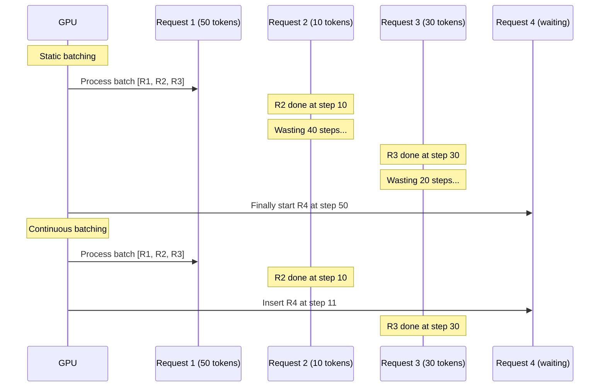
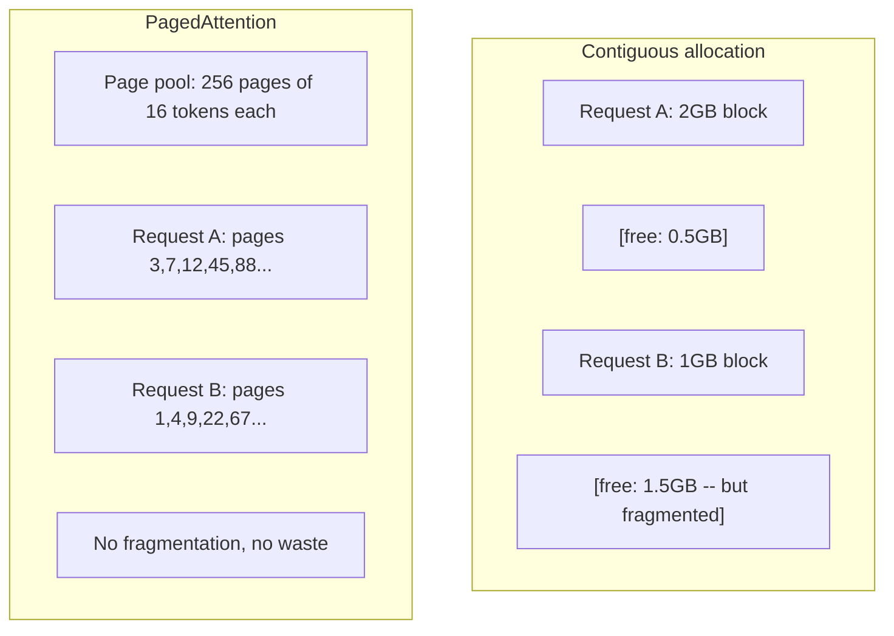
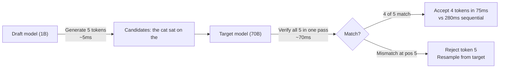

# Inference Optimizasyon

> İki aşama LLM inference'yi tanımlar. Önceden doldurma, prompt'nizi paralel olarak, hesaplamaya bağlı olarak işler. Decode, belleğe bağlı token'leri teker teker üretir. Her optimizasyon birini veya her ikisini birden hedefler.

**Tür:** Yapım
**Diller:** Python
**Önkoşullar:** Aşama 10, Dersler 01-08 (Transformer mimarisi, dikkat)
**Süre:** ~120 dakika

## Öğrenme Hedefleri

- Otoregresif token oluşturma sırasında gereksiz hesaplamayı ortadan kaldırmak için KV-önbellek uygulayın
- LLM inference'nin ön doldurma ve kod çözme aşamalarını ve neden her birinin farklı darboğazlara sahip olduğunu (hesaplamaya bağlı ve belleğe bağlı) açıklayın
- Eşzamanlı istekler altında GPU kullanımını en üst düzeye çıkarmak için sürekli toplu işlem ve PagedAttention kavramlarını uygulayın
- inference optimizasyon tekniklerini (KV-önbellek, spekülatif kod çözme, flaş dikkati) ve bunların verim/gecikme değişimlerini karşılaştırın

## Sorun

Llama 3 70B'yi 4xA100 GPU'lara dağıtıyorsunuz. Tek bir kullanıcı saniyede ~50 token alır. Hızlı hissettiriyor. Daha sonra 100 kullanıcı aynı anda uç noktaya ulaştı. Verim 3 token/saniye/kullanıcıya düşer. Aylık 25.000 ABD doları tutarındaki GPU faturanız, insan türlerinden daha yavaş yanıtlar veriyor.

Modelin kendisi 1 kullanıcı ile 100 kullanıcı arasında değişiklik göstermemektedir. Aynı ağırlıklar, aynı mimari, aynı matematik. Değişen şey, işi nasıl planladığınızdır. Naif inference, kullanılabilir GPU hesaplamasının %90'ından fazlasını boşa harcar. token 47'yi bekleyen bir kullanıcı, GPU bellek veri yolu matmul'lar arasında boşta dururken toplu iş yuvasının tamamını açık tutar. Bu arada, yeni bir kullanıcının 2.000-token prompt'si bu ölü zamanı yararlı bilgi işlemle doldurabilir.

Bu bir ölçeklendirme sorunu değil. Bu bir zamanlama problemidir. Bu dersteki teknikler (KV önbelleğe alma, sürekli toplu işlem, PagedAttention, spekülatif kod çözme, önek önbelleğe alma) aynı trafiğe hizmet veren $25k/month inference bill from a $5k/ay'ı ayıran şeydir.

4xA100-80GB üzerinde Llama 3 70B'ye hizmet veren vLLM, düşük eşzamanlılıkta ~50 token/saniye/kullanıcı elde eder ve sürekli toplu işlem ve PagedAttention aracılığıyla 100 eşzamanlı istekte 15-25 TPS/kullanıcıyı sürdürür. Bu optimizasyonlar olmadan, aynı donanım aynı anda 5 TPS/kullanıcıya hizmet verir. Aynı GPU'lar, aynı model, 4 kat verim.

## Konsept

### Önceden Doldurma ve Kod Çözme

Her LLM inference isteğinin iki farklı aşaması vardır.

**Ön doldurma** prompt girişinin tamamını işler. Tüm token'ler bilinmektedir, dolayısıyla dikkat tüm dizi boyunca paralel olarak hesaplanabilir. Bu büyük bir matris çarpımıdır; GPU çekirdekleri meşgul kalır. Darboğaz hesaplamadır: donanımınızın saniyede kaç FLOPS sunabileceği. Bir A100 312 TFLOPS (BF16) yapar. 70B modelinde 4.096-token prompt için ön dolum, tek bir A100'de ~400 ms sürer.

**Kod çözme**, token çıktılarını teker teker üretir. Her yeni token, önceki token'lerin tümüne katılır, ancak ileri geçiş başına yalnızca bir token üretilir. Ağırlık matrisleri ön doldurma sırasındakiyle aynı boyuttadır ancak bunları matris yerine tek bir vektörle çarpıyorsunuz. GPU çekirdekleri mikrosaniyeler içinde tamamlanır ve ardından bellekten bir sonraki ağırlık grubunun gelmesini bekler. Darboğaz bellek bant genişliğidir: model ağırlıklarını HBM'den hesaplama birimlerine ne kadar hızlı aktarabilirsiniz. A100'ün bant genişliği 2 TB/s'dir. FP16'daki 70B modeli 140 GB'dir. Tam modelin okunması bir kez 70 ms sürer; bu, tek bir kod çözme adımı için sizin katınızdır.



**işlemler:bayt oranı** (aritmetik yoğunluk da denir) bu dengeyi yakalar. Bellekten yüklenen bayt başına kaç işlem gerçekleştirdiğinizi ölçer.

```
ops:byte ratio = FLOPs per token / bytes read from memory
```

4.096 token'lik bir grupla önceden doldurma sırasında, yüklenen ağırlık başına ~4.096 çarpma-biriktirme işlemi gerçekleştirirsiniz. Oran yüksek; hesaplamaya bağlısınız. Toplu iş boyutu 1 ile kod çözme sırasında, yüklenen ağırlık başına ~1 işlem gerçekleştirirsiniz. Oran düşük; hafızaya bağlısınız.

Temel içgörü: *kod çözme belleğe bağlıdır çünkü tek bir token* üretmek için modelin tamamını okursunuz. Aşağıdaki her optimizasyon ya okuduklarınızı azaltır, okuma başına işlenen token grubunu artırır ya da okumaları tamamen engeller.

### KV Önbelleği

Dikkat sırasında, her token'nin sorgusu önceki token'nin anahtar ve değer vektörlerine katılır. Önbelleğe alma olmadan token N oluşturmak, önceki tüm N-1 token'ler için anahtar ve değer projeksiyonlarının yeniden hesaplanmasını gerektirir. Token 1, token 2 oluşturulurken yansıtılır, sonra tekrar token 3 için, ardından tekrar token 4 için yansıtılır. token 1.000 ile token 1'i toplam 999 kez yansıtmış olursunuz.

KV önbelleği, önceki tüm token'lerden gelen anahtar ve değer projeksiyonlarını saklar. token N oluştururken, yalnızca token N'nin anahtarını ve değerini hesaplarsınız, ardından bunları token 1'den N-1'e kadar önbelleğe alınmış K/V ile birleştirirsiniz.



**KV önbelleği için bellek formülü:**

```
KV cache size = 2 * num_layers * num_kv_heads * head_dim * seq_len * bytes_per_param
```

Llama 3 70B için (80 katman, GQA'lı 8 KV kafa, head_dim=128, BF16):

```
per token: 2 * 80 * 8 * 128 * 2 bytes = 327,680 bytes = 320 KB
at 4,096 tokens: 320 KB * 4,096 = 1.28 GB
at 128K tokens: 320 KB * 131,072 = 40 GB
```

Llama 3 70B için 128K bağlamlı tek bir konuşma, 40 GB KV önbellek tüketir; bu da A100'ün belleğinin yarısı kadardır. Her biri 4K token'de 100 eşzamanlı kullanıcıyla, tek başına KV önbelleği 128 GB gerektirir. Bu nedenle KV önbellek yönetimi, inference optimizasyonunun temel sorunudur.

### Sürekli Toplu İşleme

Statik toplu işlem, N sayıda istek gelene kadar bekler, bunları birlikte işler ve yeni istekleri kabul etmeden önce *hepsi* bitene kadar bekler. Bir isteğin 500 token ve diğerinin 10 token'ye ihtiyacı varsa, kısa istek tamamlandıktan sonra 490 kod çözme adımı boyunca boşta kalır.

Sürekli toplu işlem (yineleme düzeyinde toplu işlem de denir), herhangi bir istek tamamlanır tamamlanmaz toplu iş içine yeni istekler ekler. Toplu iş her kod çözme adımında yeniden değerlendirilir. 10 token'den sonra biten bir isteğin yerini hemen bir bekleme isteği alır.



Verimlilik artışı, çıktı uzunluklarının ne kadar değiştiğine bağlıdır. Tekdüze uzunluklarla sürekli gruplama, statik gruplamayla eşleşir. Değişken uzunluklarla (genel durum), sürekli toplu işlem 2-5 kat daha yüksek verim sağlayabilir çünkü GPU yuvaları hiçbir zaman boş kalmaz.

### PagedDikkat

Her isteğin KV önbelleği bitişik bir bellek bloğudur. İstekler gelip giderken bellek parçaları oluşur; tıpkı işletim sistemlerindeki RAM parçalanması gibi. 4K-token isteğinin 1,28 GB bitişik olması gerekir. Toplamda 2 GB ücretsiz alanınız olsa bile 1,28 GB *bitişik* alanınız olmayabilir. Ya hafızayı boşa harcarsınız ya da isteği reddedersiniz.

PagedAttention (vLLM'den), işletim sistemi tarzı sanal belleği KV önbelleğine uygular. İstek başına bir bitişik blok tahsis etmek yerine, sabit boyutlu "sayfalar" (tipik olarak her biri 16 token) tahsis eder. Sayfalar fiziksel GPU belleğinin herhangi bir yerinde olabilir. Bir sayfa tablosu, her isteğin mantıksal sıra konumlarını fiziksel sayfa konumlarıyla eşleştirir.



PagedAttention ayrıca paylaşılan önekler için **yazarken kopyalamayı** da etkinleştirir. 50 istek aynı prompt sistemini paylaşıyorsa, o sistem prompt için KV önbellek sayfaları bir kez depolanır ve 50 isteğin tümü tarafından başvurulur. Yalnızca bir istek farklılaştığında (farklı kullanıcı mesajları) kendi sayfalarını alır. Bu, paylaşılan sistem prompt'lere sahip uygulamalar için bellek kullanımını önemli ölçüde azaltır.

vLLM, PagedAttention aracılığıyla sıfıra yakın bellek israfını (saf tahsiste ~%4'e karşı ~%60-80) rapor ediyor.

### Spekülatif Kod Çözme

Kod çözme yavaştır çünkü sıralıdır; bir token oluşturursunuz, onu geri beslersiniz, bir sonrakini oluşturursunuz. Peki ya sonraki 5 token'yi ucuza tahmin edip hepsini bir kerede doğrulayabilseydiniz?

Spekülatif kod çözme, K adayı token'leri oluşturmak için küçük, hızlı bir **taslak model** kullanır. Büyük **hedef modeli** daha sonra tüm K adaylarını tek bir ileri geçişte işler (bu, bir ön doldurmaya benzer - paralel, hesaplamaya bağlı, verimli). Hedef model, taslak modelin tahminleriyle aynı fikirdeyse, bir hedef ileri geçiş sırasında tüm K token'leri kabul edersiniz. Eğer j pozisyonunda aynı fikirde değilse, 1'den j-1'e kadar olan token'leri kabul eder ve geri kalanını atarsınız.



Hızlanma, **kabul oranına**, yani taslak modelin tahminlerinin hedefle ne sıklıkla eşleştiğine bağlıdır. Llama 3 70B'ye yönelik bir Llama 3 8B taslağı için, doğal dilde %70-85'lik kabul oranları tipiktir. Bu, 2-3 kat kod çözme hızı anlamına gelir.

Spekülatif kod çözmeye yönelik üç yaklaşım:

| Yöntem | Taslak kaynağı | Kabul oranı | Tepegöz |
|--------|-------------|-----------------|----------|
| Taslak hedef (Leviathan ve diğerleri) | Ayrı küçük model | %70-85 | Taslak model belleği |
| KARTAL (Li ve diğerleri) | Hafif kafa hedefe | %75-90 | ~%1 ekstra parametreler |
| N-gram araması | Token n-gram tablosu | %40-60 | İhmal edilebilir |

**EAGLE**, hedef modelin gizli durumlarının üstünde küçük bir otoregresif kafa eğitir. Hedef modelin ikinciden sonuncuya katman özelliklerini kullanarak bir sonraki token'nin embedding'sini tahmin eder. Hedef modelin (ayrı bir modelin değil) kendi temsilleri üzerinde çalıştığı için minimum ekstra bellekle daha yüksek kabul oranlarına ulaşır. EAGLE-2, aday sayısını bağlama göre ayarlayan dinamik bir taslak ağacı ekler.

**N-gram spekülatif kod çözme**, mevcut bağlamdan veya önceden oluşturulmuş bir derlemeden n-gram devamlarının bir tablosunu tutar. Taslak, aynı konuşmada daha önce görünenlerle eşleşiyorsa (yinelenen modeller, kod, yapılandırılmış çıktı), sıfır neural network ek yük ile tetiklenir. Kabul oranları ortalama olarak daha düşüktür ancak spekülasyon başına maliyet aslında ücretsizdir.

Spekülatif kod çözme *matematiksel olarak kesindir*; çıktı dağıtımı, hedef modelin dağıtımıyla aynıdır. Bu bir yaklaşıklık değildir. Doğrulama adımı, kabul edilen her token'nin tam olarak hedef modelin atadığı olasılığa sahip olmasını sağlar.

### Önek Önbelleğe Alma

Birçok istek aynı öneki paylaşır. Bir sohbet robotu sistemi prompt. Bir RAG bağlam bloğu. Birkaç çekimlik örnek set. Önek önbelleğe alma olmadan her istek, bu paylaşılan token'ler için KV önbelleğini sıfırdan yeniden hesaplar.

Önek önbelleğe alma, ortak önekler için KV önbelleğini saklar ve bunu istekler arasında yeniden kullanır. Bilinen bir önekle yeni bir istek geldiğinde, sistem önbelleğe alınan KV girişlerini kopyalar (veya referans verir) ve yalnızca benzersiz sonek için KV'yi hesaplar.

Tüm istekler arasında paylaşılan 2.000 token prompt sistemi için ön ek önbelleğe alma, istek başına ~400 ms'lik önceden doldurma işlemini ortadan kaldırır. Saniyede 100 istek ile bu, saniyede 40 saniyelik GPU hesaplama tasarrufu sağlar; bu, birden fazla GPU'nun çalışma değerinden fazladır.

SGLang'ın RadixAttention'ı, önekleri token içeriğine göre indeksleyen bir radix ağacı (trie) ile önek önbelleğe almayı uygular. Saklanan bir önekle eşleşen herhangi bir istek, KV önbelleğini ücretsiz olarak alır. Ağaç kısmi önek eşleşmelerine olanak tanır; 2.000 önek token'nin 1.500'ünü önbelleğe alınmış bir girişle paylaşırsanız, bu 1.500'ü yeniden kullanır ve yalnızca 500'ünü yeniden hesaplarsınız.

### Inference Motorlar

Üretim LLM hizmetinde üç motor hakimdir:

| Motor | Önemli yenilik | Şunun için en iyisi |
|--------|---------------|----------|
| vLLM | PagedAttention, sürekli toplu işlem | Genel amaçlı hizmet, en yüksek uyumluluk |
| SGLang | RadixAttention (önek önbelleğe alma), yapılandırılmış oluşturma | Çok turlu sohbet robotları, kısıtlı kod çözme |
| TensorRT-LLM | NVIDIA çekirdek füzyonu, FP8 nicemleme | NVIDIA donanımında maksimum tek GPU çıkışı |

**vLLM** varsayılan başlangıç noktasıdır. En geniş model yelpazesini destekler, herhangi bir GPU satıcısında (NVIDIA, AMD, Intel) çalışır ve PagedAttention + sürekli toplu işlem sayesinde güçlü verim elde eder. OpenAI uyumlu API, onu herhangi bir OpenAI API çağrısının yerine kullanabileceğiniz anlamına gelir.

**SGLang** vLLM ile aynı temeller üzerine kuruludur ancak ön ek önbelleğe alma için RadixAttention ve yapılandırılmış LLM programları için alana özgü bir dil ekler. İş yükünüz çok turlu konuşmalar, araç kullanımı veya kısıtlı kod çözme (JSON çıkışı, normal ifade kılavuzlu oluşturma) içeriyorsa SGLang, önek yeniden kullanımı sayesinde genellikle vLLM'den 2-5 kat daha iyi performans gösterir.

**TensorRT-LLM** modelleri optimize edilmiş NVIDIA GPU çekirdekleri halinde derler. İşlemleri (tek çekirdekte dikkat + doğrusal + etkinleştirme) birleştirir, H100 GPU'larda FP8 kullanır ve deployment üretimi için NVIDIA Triton Inference Sunucusu ile entegre olur. NVIDIA donanımında en yüksek tek GPU verimine ulaşır ancak daha fazla kurulum gerektirir ve yalnızca NVIDIA GPU'larda çalışır.

Llama 3 70B (4xA100-80GB, BF16) için gerçek dünyadaki sayılar:

| Metrik | vLLM | SGLang | TensorRT-LLM |
|--------|------|--------|---------------|
| Verim (1 kullanıcı) | ~50 TPS | ~55 TPS | ~65 TPS |
| Verim (100 kullanıcı) | ~2.500 toplam TPS | ~3.200 toplam TPS | ~3.000 toplam TPS |
| İlk zamanı token | ~400ms | ~300ms (önek isabeti) | ~350ms |
| Maksimum içerik | 128K | 128K | 128K |

### Operasyonlar: Bayt Framework

Ölçmediğiniz şeyi optimize edemezsiniz. Ops:byte oranı size hesaplamaya mı yoksa belleğe mi bağlı olduğunuzu söyler; bu da hangi optimizasyonların önemli olduğunu belirler.

```
Compute roof: peak FLOPS of the GPU
Memory roof:  peak bandwidth * ops:byte ratio
```

Ops:byte düşük olduğunda (kod çözme, küçük gruplar), bellek bant genişliği çatısına ulaşırsınız. Daha fazla bilgi işlem eklemek (daha yüksek saat, daha fazla çekirdek) yardımcı olmuyor. Bellek okumalarını azaltmanız (kuantizasyon, KV önbellek sıkıştırması) veya okumaları daha yararlı işlerde amorti etmek için toplu iş boyutunu artırmanız gerekir.

Ops:byte yüksek olduğunda (önceden doldurma, büyük gruplar), hesaplama çatısına ulaşırsınız. Bellek bant genişliği optimizasyonu yardımcı olmuyor. Daha fazla FLOPS sıkıştırmak için daha hızlı GPU'lara, çekirdek füzyonuna veya azaltılmış hassasiyete ihtiyacınız var.

| Senaryo | işlem:bayt | bağlı | Şununla optimize edin |
|----------|----------|-------|---------------|
| Ön doldurma, parti=1 | ~4,096 | Hesapla | Çekirdek füzyonu, FP8 |
| Kod çözme, toplu=1 | ~1 | Bellek | Niceleme, KV sıkıştırma |
| Kod çözme, toplu=32 | ~32 | Bellek | Daha büyük parti, sürekli gruplama |
| Kod çözme, toplu=256 | ~256 | Geçiş | İkisi de önemli |
| Kod çözme, grup=1024 | ~1,024 | Hesapla | Çekirdek füzyonu, tensör paralelliği |

A100'deki geçiş noktası ops:byte = 156 (312 TFLOPS / 2 TB/s) civarındadır. 156'nın altında hafızaya bağlısınız. 156'nın üzerinde, hesaplamaya bağlısınız. Sürekli toplu işlem, yineleme başına daha fazla token paketleyerek kod çözmeyi bu geçişe doğru iter.

```figure
context-window-slide
```

## İnşa Et

### Adım 1: Sıfırdan KV Önbelleği

Katman başına, kişi başına anahtar ve değer projeksiyonlarını depolayan ve bellek büyüme modelini gösteren çok kafalı bir KV önbelleği oluşturuyoruz.

```python
import numpy as np

class KVCache:
    def __init__(self, num_layers, num_heads, head_dim, max_seq_len, dtype=np.float16):
        self.num_layers = num_layers
        self.num_heads = num_heads
        self.head_dim = head_dim
        self.max_seq_len = max_seq_len
        self.dtype = dtype

        self.k_cache = np.zeros(
            (num_layers, num_heads, max_seq_len, head_dim), dtype=dtype
        )
        self.v_cache = np.zeros(
            (num_layers, num_heads, max_seq_len, head_dim), dtype=dtype
        )
        self.seq_len = 0

    def update(self, layer_idx, new_keys, new_values):
        num_new = new_keys.shape[1]
        end = self.seq_len + num_new
        self.k_cache[layer_idx, :, self.seq_len:end, :] = new_keys
        self.v_cache[layer_idx, :, self.seq_len:end, :] = new_values
        return (
            self.k_cache[layer_idx, :, :end, :],
            self.v_cache[layer_idx, :, :end, :]
        )

    def advance(self, num_tokens):
        self.seq_len += num_tokens

    def memory_bytes(self):
        return self.k_cache.nbytes + self.v_cache.nbytes

    def used_bytes(self):
        per_token = 2 * self.num_layers * self.num_heads * self.head_dim * np.dtype(self.dtype).itemsize
        return per_token * self.seq_len
```

### Adım 2: KV Önbelleğine Dikkat

Kod çözme adımları için KV önbelleğini kullanan basitleştirilmiş çok kafalı bir dikkat.

```python
def scaled_dot_product_attention(query, keys, values):
    head_dim = query.shape[-1]
    scores = np.matmul(query, keys.transpose(0, 1, 3, 2)) / np.sqrt(head_dim)
    seq_len_q = scores.shape[-2]
    seq_len_k = scores.shape[-1]
    if seq_len_q > 1:
        mask = np.triu(np.ones((seq_len_q, seq_len_k), dtype=np.float32), k=seq_len_k - seq_len_q + 1)
        scores = scores + mask * (-1e9)
    max_scores = np.max(scores, axis=-1, keepdims=True)
    exp_scores = np.exp(scores - max_scores)
    attn_weights = exp_scores / np.sum(exp_scores, axis=-1, keepdims=True)
    return np.matmul(attn_weights, values)


class MultiHeadAttention:
    def __init__(self, d_model, num_heads):
        self.num_heads = num_heads
        self.head_dim = d_model // num_heads
        scale = np.sqrt(2.0 / d_model)
        self.W_q = np.random.randn(d_model, d_model).astype(np.float32) * scale
        self.W_k = np.random.randn(d_model, d_model).astype(np.float32) * scale
        self.W_v = np.random.randn(d_model, d_model).astype(np.float32) * scale
        self.W_o = np.random.randn(d_model, d_model).astype(np.float32) * scale

    def forward(self, x, kv_cache=None, layer_idx=0):
        batch, seq_len, d_model = x.shape
        Q = np.matmul(x, self.W_q).reshape(batch, seq_len, self.num_heads, self.head_dim).transpose(0, 2, 1, 3)
        K = np.matmul(x, self.W_k).reshape(batch, seq_len, self.num_heads, self.head_dim).transpose(0, 2, 1, 3)
        V = np.matmul(x, self.W_v).reshape(batch, seq_len, self.num_heads, self.head_dim).transpose(0, 2, 1, 3)

        if kv_cache is not None:
            K_full, V_full = kv_cache.update(layer_idx, K[0], V[0])
            K = K_full[np.newaxis, :, :, :]
            V = V_full[np.newaxis, :, :, :]
            if seq_len == 1:
                kv_cache.advance(1)

        attn_out = scaled_dot_product_attention(Q, K, V)
        attn_out = attn_out.transpose(0, 2, 1, 3).reshape(batch, -1, d_model)
        return np.matmul(attn_out, self.W_o)
```

### Adım 3: Sürekli Dozajlama Simülatörü

Bu, statik ve sürekli toplu işlem arasındaki planlama farkını simüle eder.

```python
import heapq

class Request:
    def __init__(self, request_id, prompt_tokens, output_tokens, arrival_step):
        self.request_id = request_id
        self.prompt_tokens = prompt_tokens
        self.output_tokens = output_tokens
        self.arrival_step = arrival_step
        self.tokens_generated = 0
        self.start_step = None
        self.end_step = None

    def is_done(self):
        return self.tokens_generated >= self.output_tokens


def simulate_static_batching(requests, batch_size):
    step = 0
    completed = []
    queue = list(requests)
    queue.sort(key=lambda r: r.arrival_step)

    while queue:
        batch = []
        while queue and len(batch) < batch_size:
            r = queue.pop(0)
            r.start_step = max(step, r.arrival_step)
            batch.append(r)

        if batch:
            step = max(step, max(r.start_step for r in batch))
            max_output = max(r.output_tokens for r in batch)
            for r in batch:
                r.tokens_generated = r.output_tokens
                r.end_step = step + max_output
            step += max_output
            completed.extend(batch)

    return completed


def simulate_continuous_batching(requests, batch_size):
    step = 0
    completed = []
    queue = sorted(requests, key=lambda r: r.arrival_step)
    queue_idx = 0
    active = []
    waiting = []

    while queue_idx < len(queue) or active or waiting:
        while queue_idx < len(queue) and queue[queue_idx].arrival_step <= step:
            waiting.append(queue[queue_idx])
            queue_idx += 1

        while waiting and len(active) < batch_size:
            r = waiting.pop(0)
            r.start_step = step
            active.append(r)

        if not active:
            if waiting:
                step += 1
                continue
            elif queue_idx < len(queue):
                step = queue[queue_idx].arrival_step
                continue
            else:
                break

        for r in active:
            r.tokens_generated += 1

        done = [r for r in active if r.is_done()]
        for r in done:
            r.end_step = step + 1
            completed.append(r)
        active = [r for r in active if not r.is_done()]

        step += 1

    return completed


def batching_stats(completed):
    latencies = [r.end_step - r.arrival_step for r in completed]
    total_time = max(r.end_step for r in completed) - min(r.arrival_step for r in completed)
    total_tokens = sum(r.output_tokens for r in completed)
    return {
        "avg_latency": np.mean(latencies),
        "p50_latency": np.median(latencies),
        "p99_latency": np.percentile(latencies, 99),
        "total_time": total_time,
        "throughput": total_tokens / total_time if total_time > 0 else 0,
    }
```

### Adım 4: Önek Önbelleği

Paylaşılan önekler için KV girişlerini depolayan, trie tabanlı bir önek önbelleği.

```python
class TrieNode:
    def __init__(self):
        self.children = {}
        self.kv_data = None
        self.hit_count = 0


class PrefixCache:
    def __init__(self, max_entries=1000):
        self.root = TrieNode()
        self.max_entries = max_entries
        self.total_entries = 0
        self.hits = 0
        self.misses = 0

    def _walk(self, token_ids):
        node = self.root
        depth = 0
        for tid in token_ids:
            if tid not in node.children:
                break
            node = node.children[tid]
            depth += 1
        return node, depth

    def lookup(self, token_ids):
        node, depth = self._walk(token_ids)
        if depth > 0:
            self.hits += 1
            current = self.root
            for tid in token_ids[:depth]:
                current = current.children[tid]
                current.hit_count += 1
            kv_entries = []
            current = self.root
            for tid in token_ids[:depth]:
                current = current.children[tid]
                if current.kv_data is not None:
                    kv_entries.append(current.kv_data)
            return depth, kv_entries
        self.misses += 1
        return 0, []

    def insert(self, token_ids, kv_per_token):
        node = self.root
        for i, tid in enumerate(token_ids):
            if tid not in node.children:
                if self.total_entries >= self.max_entries:
                    return i
                node.children[tid] = TrieNode()
                self.total_entries += 1
            node = node.children[tid]
            if i < len(kv_per_token):
                node.kv_data = kv_per_token[i]
        return len(token_ids)

    def hit_rate(self):
        total = self.hits + self.misses
        return self.hits / total if total > 0 else 0.0
```

### Adım 5: Spekülatif Kod Çözme Simülatörü

Yapılandırılabilir kabul oranlarıyla taslak hedef spekülatif kod çözmeyi simüle ediyoruz.

```python
class DraftModel:
    def __init__(self, vocab_size, acceptance_rate=0.8):
        self.vocab_size = vocab_size
        self.acceptance_rate = acceptance_rate

    def generate(self, context, num_tokens):
        tokens = np.random.randint(0, self.vocab_size, size=num_tokens)
        return tokens

    def get_probs(self, context, token):
        probs = np.random.dirichlet(np.ones(self.vocab_size))
        return probs


class TargetModel:
    def __init__(self, vocab_size):
        self.vocab_size = vocab_size

    def get_probs(self, context, tokens=None):
        if tokens is not None:
            return [np.random.dirichlet(np.ones(self.vocab_size)) for _ in tokens]
        return np.random.dirichlet(np.ones(self.vocab_size))


def speculative_decode(draft_model, target_model, context, num_speculative=5,
                       draft_cost=1.0, target_cost=10.0, verify_cost=12.0):
    total_tokens = 0
    total_cost = 0.0
    accepted_counts = []
    context = list(context)

    max_tokens = 100

    while total_tokens < max_tokens:
        draft_tokens = draft_model.generate(context, num_speculative)
        total_cost += draft_cost * num_speculative

        target_probs = target_model.get_probs(context, draft_tokens)
        total_cost += verify_cost

        accepted = 0
        for i, token in enumerate(draft_tokens):
            draft_p = draft_model.get_probs(context + list(draft_tokens[:i]), token)
            target_p = target_probs[i]

            r = np.random.random()
            acceptance_prob = min(1.0, target_p[token] / (draft_p[token] + 1e-10))

            if r < draft_model.acceptance_rate:
                accepted += 1
                context.append(token)
                total_tokens += 1
            else:
                new_token = np.random.choice(draft_model.vocab_size, p=target_p)
                context.append(new_token)
                total_tokens += 1
                break

        accepted_counts.append(accepted)

        if accepted == num_speculative:
            bonus_probs = target_model.get_probs(context)
            bonus_token = np.random.choice(draft_model.vocab_size, p=bonus_probs)
            context.append(bonus_token)
            total_tokens += 1

    sequential_cost = total_tokens * target_cost
    return {
        "total_tokens": total_tokens,
        "speculative_cost": total_cost,
        "sequential_cost": sequential_cost,
        "speedup": sequential_cost / total_cost if total_cost > 0 else 1.0,
        "avg_accepted": np.mean(accepted_counts),
        "acceptance_rate": np.mean(accepted_counts) / num_speculative,
    }


def compare_speculation_strategies(vocab_size=1000, num_trials=20):
    results = {}

    for name, acceptance_rate, spec_tokens in [
        ("Draft-target (8B->70B)", 0.78, 5),
        ("EAGLE", 0.85, 6),
        ("N-gram", 0.50, 4),
        ("No speculation", 0.0, 0),
    ]:
        if spec_tokens == 0:
            results[name] = {
                "speedup": 1.0,
                "acceptance_rate": 0.0,
                "avg_accepted": 0.0,
            }
            continue

        trial_results = []
        for _ in range(num_trials):
            draft = DraftModel(vocab_size, acceptance_rate=acceptance_rate)
            target = TargetModel(vocab_size)
            context = list(np.random.randint(0, vocab_size, size=10))
            result = speculative_decode(draft, target, context, num_speculative=spec_tokens)
            trial_results.append(result)

        results[name] = {
            "speedup": np.mean([r["speedup"] for r in trial_results]),
            "acceptance_rate": np.mean([r["acceptance_rate"] for r in trial_results]),
            "avg_accepted": np.mean([r["avg_accepted"] for r in trial_results]),
        }

    return results
```

### Adım 6: KV Önbellek Bellek Profilcisi

Gerçek model yapılandırmaları için KV önbellek gereksinimlerini hesaplayın.

```python
MODEL_CONFIGS = {
    "Llama-3-8B": {
        "num_layers": 32, "num_kv_heads": 8, "head_dim": 128,
        "model_params_b": 8, "gqa": True,
    },
    "Llama-3-70B": {
        "num_layers": 80, "num_kv_heads": 8, "head_dim": 128,
        "model_params_b": 70, "gqa": True,
    },
    "Llama-3-405B": {
        "num_layers": 126, "num_kv_heads": 8, "head_dim": 128,
        "model_params_b": 405, "gqa": True,
    },
    "Mistral-7B": {
        "num_layers": 32, "num_kv_heads": 8, "head_dim": 128,
        "model_params_b": 7, "gqa": True,
    },
    "GPT-4-est": {
        "num_layers": 120, "num_kv_heads": 96, "head_dim": 128,
        "model_params_b": 1800, "gqa": False,
    },
}


def kv_cache_memory(config, seq_len, dtype_bytes=2):
    per_token = 2 * config["num_layers"] * config["num_kv_heads"] * config["head_dim"] * dtype_bytes
    total = per_token * seq_len
    return {
        "per_token_bytes": per_token,
        "per_token_kb": per_token / 1024,
        "total_bytes": total,
        "total_mb": total / (1024 ** 2),
        "total_gb": total / (1024 ** 3),
    }


def memory_budget(config, gpu_memory_gb, model_dtype_bytes=2, kv_dtype_bytes=2):
    model_memory_gb = config["model_params_b"] * 1e9 * model_dtype_bytes / (1024 ** 3)
    overhead_gb = gpu_memory_gb * 0.1
    available_for_kv = gpu_memory_gb - model_memory_gb - overhead_gb

    if available_for_kv <= 0:
        return {"error": "Model does not fit in GPU memory", "model_memory_gb": model_memory_gb}

    per_token = 2 * config["num_layers"] * config["num_kv_heads"] * config["head_dim"] * kv_dtype_bytes
    max_tokens = int(available_for_kv * (1024 ** 3) / per_token)

    return {
        "gpu_memory_gb": gpu_memory_gb,
        "model_memory_gb": round(model_memory_gb, 1),
        "overhead_gb": round(overhead_gb, 1),
        "available_for_kv_gb": round(available_for_kv, 1),
        "max_total_tokens": max_tokens,
        "max_users_at_2k": max_tokens // 2048,
        "max_users_at_4k": max_tokens // 4096,
        "max_users_at_32k": max_tokens // 32768,
    }
```

## Kullan onu

vLLM ile:

```python
from vllm import LLM, SamplingParams

llm = LLM(
    model="meta-llama/Llama-3-70B-Instruct",
    tensor_parallel_size=4,
    enable_prefix_caching=True,
    max_model_len=8192,
    gpu_memory_utilization=0.9,
)

params = SamplingParams(temperature=0.7, max_tokens=256)
outputs = llm.generate(["Explain inference optimization in one paragraph."], params)
```

Önek önbelleğe alma + yapılandırılmış çıktı için SGLang ile:

```python
import sglang as sgl

@sgl.function
def classify(s, text):
    s += sgl.system("You are a classifier. Output JSON only.")
    s += sgl.user(f"Classify this text: {text}")
    s += sgl.assistant(sgl.gen("result", regex=r'\{"label": "(positive|negative|neutral)"\}'))

runtime = sgl.Runtime(model_path="meta-llama/Llama-3-70B-Instruct", tp_size=4)
sgl.set_default_backend(runtime)

results = classify.run_batch([
    {"text": "This product is amazing!"},
    {"text": "Terrible experience."},
    {"text": "It was okay I guess."},
])
```

TensorRT-LLM ile:

```python
import tensorrt_llm
from tensorrt_llm.runtime import ModelRunner

runner = ModelRunner.from_dir("./llama-70b-trt-engine/", rank=0)

outputs = runner.generate(
    batch_input_ids=[tokenizer.encode("Explain KV caching.")],
    max_new_tokens=256,
    temperature=0.7,
)
```

## Gönderin

Bu ders şunları üretir:
- `outputs/skill-inference-optimization.md` -- LLM inference sunumunu teşhis etmeye ve optimize etmeye yönelik bir beceri

## Egzersizler

1. FP16, FP8 ve INT4 KV önbellek nicelemesini karşılaştırmak için KV önbellek profil oluşturucusunu değiştirin. 4K bağlamında Llama 3 70B için 4xA100-80 GB'nin her biri için maksimum eşzamanlı kullanıcı sayısını hesaplayın. INT4'e KV nicelemesi kullanıcı kapasitesinin kabaca 4 katı olmalıdır.

2. GPU kullanımını (adım başına doldurulan toplu iş yuvalarının oranı) izlemek için sürekli toplu işlem simülatörünü genişletin. Çıkış uzunlukları Pareto dağılımını takip eden (şekil=1,5, ölçek=20) 50 istekle hem statik hem de sürekli toplu işleme için zaman içinde kullanım grafiği. Sürekli harmanlama %80'den fazla kullanım sağlamalıdır.

3. KV önbelleğinin gruplandırılmış sorgu dikkati (GQA) sürümünü uygulayın; burada `num_kv_heads < num_query_heads`. Llama 3 70B, 64 sorgu kafası kullanır ancak yalnızca 8 KV kafası kullanır. Tam çoklu kafa dikkatine karşı bellek tasarrufunu hesaplayın (KV önbellek boyutunda 8 kat azalma).

4. LRU tahliyesini kullanan bir önek önbelleği oluşturun. max_entries'i 500 olarak ayarlayın ve %60'ının 5 ortak önekten birini paylaştığı 1.000 istek oluşturun. İsabet oranını ölçün ve sınırsız önbellekle karşılaştırın. İyi tahliye ile isabet oranı %55'in üzerinde kalmalıdır.

5. Ağaç tabanlı spekülasyon (EAGLE-2 stili) uygulamak için spekülatif kod çözme simülatörünü genişletin. Tek bir K taslağı token zinciri yerine, bir aday ağacı oluşturun (e.g., 3 düzeyin her birinde 2 dal = 8 yaprak aday). Doğrulama turu başına kabul edilen toplam token'leri doğrusal spekülasyonla karşılaştırın.

## Anahtar Terimler

| Dönem | İnsanlar ne diyor | Aslında ne anlama geliyor |
|------|----------------|----------------------|
| Ön Dolum | "prompt İşleniyor" | Tüm giriş token'ler üzerinde paralel olarak hesaplama dikkati - tam matris çarpımı GPU çekirdeklerini meşgul ettiğinden hesaplamaya bağlıdır |
| Kod Çözme | "token'ler Oluşturuluyor" | Her ileri geçişte bir token üretiliyor ve her seferinde tam model ağırlıkları okunuyor - hafızaya bağlı çünkü hesaplama sonraki ağırlıklar gelmeden önce bitiyor |
| KV önbelleği | "Dikkat durumlarının önbelleğe alınması" | Önceki tüm token'ler için anahtar ve değer projeksiyonlarının saklanması, böylece her kod çözme adımında yeniden hesaplanmamaları -- hesaplama için hafızayı değiştirir |
| Sürekli gruplama | "Dinamik toplu işlem" | Herhangi bir istek biter bitmez çalışan topluluğa yeni istekler ekleme, tüm toplu işi beklemek yerine her kod çözme yinelemesinde değerlendirme |
| PagedDikkat | "KV önbellek için sanal bellek" | KV önbelleğini bitişik bloklar yerine sabit boyutlu sayfalara ayırma, bellek parçalanmasını ortadan kaldırma ve paylaşılan önekler için yazarken kopyalamayı etkinleştirme |
| Spekülatif kod çözme | "Taslak hazırla ve doğrula" | Birden fazla token önermek için hızlı bir taslak model kullanma ve ardından bunların hepsini tek bir hedef modelde doğrulama ileri geçiş - matematiksel olarak kesin, 2-3 kat hızlanma |
| KARTAL | "Kendi kendine spekülatif kod çözme" | Hafif bir kafayı hedef modelin kendi gizli durumları konusunda eğiten ve ayrı bir taslak modele göre daha yüksek kabul oranlarına ulaşan spekülatif bir kod çözme çeşidi |
| Önek önbelleğe alma | "Sistemi prompt KV yeniden kullanma" | Yaygın önekler (sistem prompt'ler, birkaç çekim örnekleri) için hesaplanan KV önbellek girişlerini depolama ve gereksiz ön doldurmayı atlamak için bunları isteklerde yeniden kullanma |
| İşlemler:bayt oranı | "Aritmetik yoğunluk" | Bilgi işlem işlemlerinin okunan bellek bayt sayısına oranı - bir iş yükünün hesaplamaya mı (yüksek oran) yoksa belleğe mi (düşük oran) bağlı olduğunu belirler |
| İlk zamanı token | "TTFT" | Bir isteğin alınmasından ilk çıktının üretilmesine kadar geçen gecikme token -- uzun prompt'ler için ön doldurma süresi hakimdir |

## Daha Fazla Okuma

- Kwon ve diğerleri, "PagedAttention ile Büyük Dil Modeli Hizmeti için Verimli Bellek Yönetimi" (2023) -- artık inference hizmeti için endüstri standardı olan sayfalanmış KV önbellek yönetimini tanıtan vLLM makalesi
- Leviathan ve diğerleri, "Spekülatif Kod Çözme yoluyla Transformer'lerden Hızlı Inference" (2023) -- taslak doğrulama spekülasyonunun 2-3 kat hızlanma elde ederken tam hedef model dağılımları ürettiğini kanıtlayan temel makale
- Li ve diğerleri, "EAGLE: Spekülatif Örnekleme, Özellik Belirsizliğinin Yeniden Düşünülmesini Gerektirir" (2024) - ayrı bir taslak model kullanmak yerine, hedef modelin kendi özellikleri üzerinde kafa eğiterek daha yüksek kabul oranlarına ulaşır
- Zheng ve diğerleri, "SGLang: Yapılandırılmış Dil Modeli Programlarının Verimli Yürütülmesi" (2024) -- önek önbelleğe alma için RadixAttention'ı ve çok çağrılı LLM programları için bir programlama modelini tanıtıyor
- Williams ve diğerleri, "Roofline: An Insightful Visual Performance Model for Multicore Architectures" (2009) -- hesaplama ve bellek darboğazları hakkında akıl yürütme için ops:byte framework'yi resmileştiren orijinal çatı hattı makalesi
