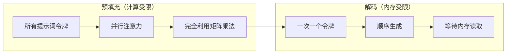
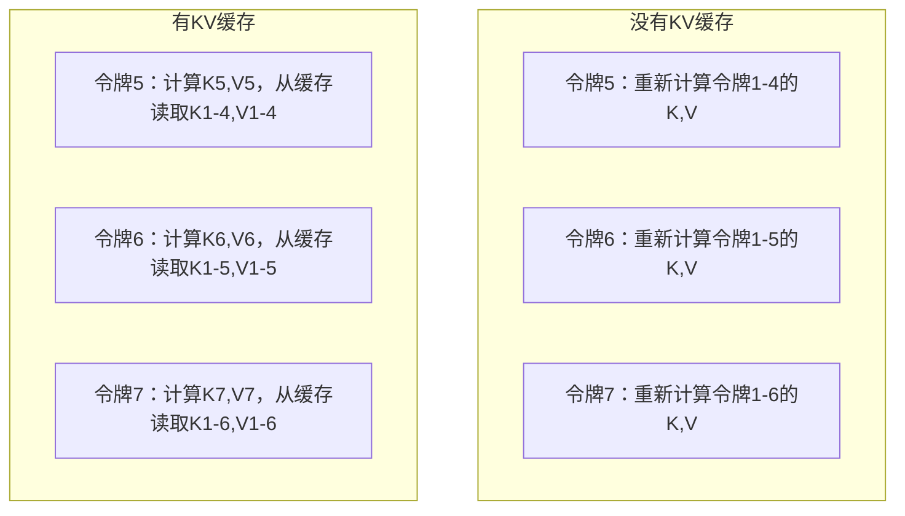
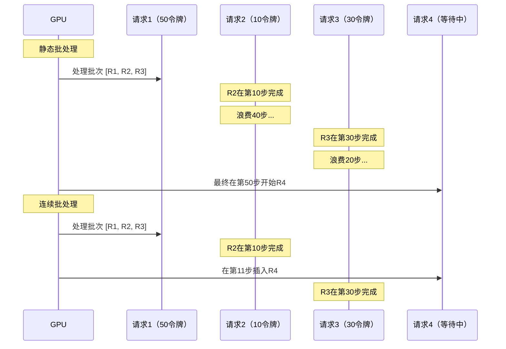
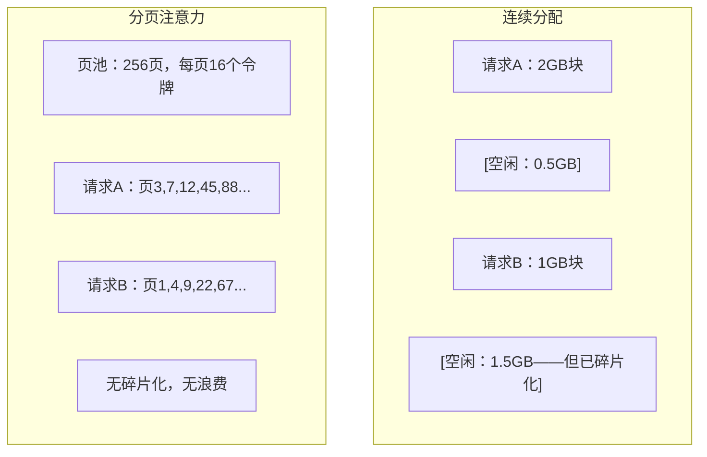
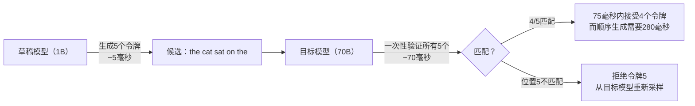

# 推理优化

> 大型语言模型（LLM）推理的两个阶段：预填充过程并行处理你的提示——受计算限制。解码过程逐个生成令牌——受内存限制。每一项优化都针对其中一个或两个。

**类型：** 构建
**语言：** Python
**前置条件：** 阶段10，课程01-08（Transformer架构，注意力机制）
**时长：** ~120分钟

## 学习目标

- 实现KV缓存以消除自回归令牌生成过程中的冗余计算
- 解释LLM推理的预填充与解码阶段，以及为什么它们有不同的瓶颈（计算受限 vs 内存受限）
- 实现连续批处理（Continuous Batching）和分页注意力（PagedAttention）概念，以在并发请求下最大化GPU利用率
- 比较推理优化技术（KV缓存、推测解码、闪存注意力）及其吞吐量/延迟权衡

## 问题

你在4张A100 GPU上部署Llama 3 70B模型。单个用户获得大约每秒50个令牌。感觉很快。然后100个用户同时访问端点。吞吐量下降到每个用户每秒3个令牌。你每月25000美元的GPU账单正在提供比人类打字还慢的响应。

模型本身在1个用户和100个用户之间没有变化。相同的权重，相同的架构，相同的数学计算。变化的是你如何调度工作。朴素的推理浪费了90%以上的可用GPU计算能力。一个等待第47个令牌的用户占用整个批次槽位，而GPU内存总线在矩阵乘法之间空闲。与此同时，一个新用户的2000令牌的提示词可以填充那段空闲时间以进行有用的计算。

这不是一个扩展问题。这是一个调度问题。本课程中的技术——KV缓存、连续批处理、分页注意力、推测解码、前缀缓存——正是区分每月25000美元推理账单和每月5000美元账单（服务相同的流量）的关键。

使用vLLM在4张A100-80GB上服务Llama 3 70B，在低并发下每个用户约50个令牌/秒，在100个并发请求下通过连续批处理和分页注意力维持每个用户15-25个令牌/秒。没有这些优化，相同硬件在同一并发下每个用户只能服务5个令牌/秒。相同的GPU，相同的模型，4倍吞吐量。

## 概念

### 预填充与解码

每个LLM推理请求有两个不同的阶段。

**预填充**处理整个输入提示词。所有令牌都是已知的，因此注意力可以在整个序列上并行计算。这是一个大的矩阵乘法——GPU核心保持忙碌。瓶颈是计算能力：你的硬件每秒可以传递多少FLOPS。一块A100提供312 TFLOPS（BF16）。在70B模型上预填充一个4096令牌的提示词，单张A100大约需要400毫秒。

**解码**一次生成一个输出令牌。每个新令牌关注所有之前的令牌，但每次前向传递只产生一个令牌。权重矩阵与预填充时大小相同，但是你将其乘以一个向量（而非矩阵）。GPU核心在微秒内完成，然后等待下一批权重从内存中到达。瓶颈是内存带宽：你能以多快的速度将模型权重从HBM流式传输到计算单元。A100的带宽为2 TB/s。FP16的70B模型大小为140 GB。完整读取模型一次需要70毫秒——这是单次解码步骤的下限。



**操作数与字节比（ops:byte ratio，也称为算术强度）** 捕获了这种权衡。它衡量每从内存加载一个字节执行了多少操作。

```
操作数与字节比 = 每个令牌的FLOPs / 从内存读取的字节数
```

在预填充阶段（批次大小为4096令牌），每个加载的权重大约执行4096次乘加运算。比率很高——你受计算限制。在解码阶段（批次大小为1），每个加载的权重大约执行1次操作。比率很低——你受内存限制。

基本洞察：*解码受内存限制，因为你读取整个模型只为生成一个令牌。* 下面的每一项优化要么减少你读取的内容，要么增加每次读取处理的令牌批次大小，要么完全避免读取。

### KV缓存

在注意力机制中，每个令牌的查询会关注所有之前令牌的键和值向量。如果不缓存，生成令牌N需要重新计算所有N-1个前置令牌的键和值投影。令牌1在生成令牌2时被投影，然后在令牌3时再次投影，以此类推。到令牌1000时，令牌1总共被投影了999次。

KV缓存存储所有先前令牌的键和值投影。当生成令牌N时，你只计算令牌N的键和值，然后将它们与缓存的令牌1到N-1的K/V连接起来。



**KV缓存的内存公式：**

```
KV缓存大小 = 2 * 层数 * KV头数 * 头维度 * 序列长度 * 每参数字节数
```

对于Llama 3 70B（80层，使用GQA的8个KV头，head_dim=128，BF16）：

```
每令牌：2 * 80 * 8 * 128 * 2 字节 = 327,680 字节 = 320 KB
在4096令牌时：320 KB * 4096 = 1.28 GB
在128K令牌时：320 KB * 131,072 = 40 GB
```

Llama 3 70B的一次128K上下文会话消耗40 GB的KV缓存——半块A100的内存。当100个并发用户每人使用4K令牌时，仅KV缓存就需要128 GB。这就是为什么KV缓存管理是推理优化的核心挑战。

### 连续批处理

静态批处理等待一批N个请求到达，一起处理它们，并等待所有请求*全部*完成后再接受新请求。如果一个请求需要500个令牌，另一个需要10个，那么短请求完成后将空闲490个解码步骤。

连续批处理（也称为迭代级批处理）在任何请求完成后立即将新请求插入到批次中。批次在每次解码步骤时重新评估。一个在10个令牌后完成的请求会立即被一个等待中的请求替换。



吞吐量提升取决于输出长度变化程度。在均匀长度时，连续批处理与静态批处理相当。在可变长度（常见情况）时，连续批处理可以提供2-5倍的吞吐量提升，因为GPU槽位永远不会空闲。

### 分页注意力

每个请求的KV缓存是一个连续的内存块。随着请求的到达和离开，内存碎片化——就像操作系统中的RAM碎片化。一个4K令牌的请求需要1.28 GB的连续内存。即使你总共有2 GB空闲，也可能没有1.28 GB*连续*的。要么浪费内存，要么拒绝请求。

分页注意力（来自vLLM）将操作系统风格的内虚内存应用于KV缓存。它不是为每个请求分配一个连续块，而是分配固定大小的“页”（通常每页16个令牌）。页可以位于物理GPU内存的任何位置。一个页表将每个请求的逻辑序列位置映射到物理页位置。



分页注意力还支持**写时复制**用于共享前缀。如果50个请求共享同一个系统提示词，那么该系统提示词的KV缓存页只存储一次，并被所有50个请求引用。只有当某个请求出现分歧（不同的用户消息）时，它才获得自己的页。这在具有共享系统提示词的应用程序中大幅减少了内存使用。

vLLM报告通过分页注意力实现了近乎零的内存浪费（约4%，而朴素分配为约60-80%）。

### 推测解码

解码速度慢，因为它是顺序的——你生成一个令牌，将其反馈回去，再生成下一个。但是如果你能廉价地猜测接下来的5个令牌，然后一次性验证它们呢？

推测解码使用一个小的、快速的**草稿模型**生成K个候选令牌。然后大型**目标模型**在一个前向传递中处理所有K个候选（这类似于预填充——并行、计算受限、高效）。如果目标模型同意草稿模型的预测，你就在一次目标前向传递的时间内接受所有K个令牌。如果它在位置j处不同意，你接受令牌1到j-1并丢弃其余部分。



加速取决于**接受率**——草稿模型的预测与目标匹配的频率。对于为Llama 3 70B起草的Llama 3 8B，自然语言上的接受率通常在70-85%之间。这转化为2-3倍的解码加速。

三种推测解码方法：

| 方法 | 草稿来源 | 接受率 | 开销 |
|--------|-------------|-----------------|----------|
| 草稿-目标（Leviathan等人） | 独立的较小模型 | 70-85% | 草稿模型内存 |
| EAGLE（Li等人） | 目标上的轻量级头 | 75-90% | 约1%额外参数 |
| N元语法查找 | 令牌N元语法表 | 40-60% | 可忽略 |

**EAGLE**在目标模型的隐藏状态之上训练一个小的自回归头。它利用目标模型的倒数第二层特征预测下一个令牌的嵌入。由于它在目标模型自身的表示（而非独立模型）上操作，因此以最小的额外内存实现了更高的接受率。EAGLE-2添加了一个动态起草树，根据上下文调整候选数量。

**N元语法推测解码**维护一个来自当前上下文或预构建语料库的N元语法续写表。如果草稿与同一对话中之前出现的内容匹配（重复模式、代码、结构化输出），它就会以零神经网络开销触发。平均接受率较低，但每次推测的成本基本上为零。

推测解码是*数学上精确的*——输出分布与目标模型的分布相同。它不是近似。验证步骤确保每个接受的令牌具有与目标模型分配的概率完全相同的概率。

### 前缀缓存

许多请求共享相同的前缀。一个聊天机器人系统提示词。一个RAG上下文块。一组少样本示例。没有前缀缓存，每个请求都会从头开始重新计算这些共享令牌的KV缓存。

前缀缓存存储常见前缀的KV缓存，并在请求之间重用。当新请求到达且具有已知前缀时，系统复制（或引用）缓存的KV条目，并且只计算唯一后缀的KV。

对于一个在所有请求之间共享的2000令牌系统提示词，前缀缓存每个请求消除了大约400毫秒的预填充时间。在每秒100个请求时，这节省了每秒40秒的GPU计算——超过一块GPU的工作量。

SGLang的RadixAttention使用基数树（字典树）实现前缀缓存，该树按令牌内容索引前缀。任何匹配存储前缀的请求都可以免费获得其KV缓存。该树支持部分前缀匹配——如果你与缓存条目共享2000个前缀令牌中的1500个，则重用那1500个并只重新计算500个。

### 推理引擎

在生产LLM服务中，三个引擎占主导地位：

| 引擎 | 关键创新 | 最适合 |
|--------|---------------|----------|
| vLLM | 分页注意力，连续批处理 | 通用服务，最高兼容性 |
| SGLang | RadixAttention（前缀缓存），结构化生成 | 多轮聊天机器人，约束解码 |
| TensorRT-LLM | NVIDIA内核融合，FP8量化 | NVIDIA硬件上的最大单GPU吞吐量 |

**vLLM**是默认的起点。它支持最广泛的模型范围，可在任何GPU供应商（NVIDIA、AMD、Intel）上运行，并通过分页注意力+连续批处理实现强大的吞吐量。兼容OpenAI的API意味着你可以将其作为任何OpenAI API调用的替代品。

**SGLang**建立在与vLLM相同的基线上，但增加了RadixAttention用于前缀缓存，以及一种用于结构化LLM程序的领域特定语言。如果你的工作负载涉及多轮对话、工具使用或约束解码（JSON输出、正则表达式引导生成），SGLang通常通过前缀重用比vLLM性能高出2-5倍。

**TensorRT-LLM**将模型编译为优化的NVIDIA GPU内核。它融合操作（注意力+线性+激活在一个内核中），在H100 GPU上使用FP8，并与NVIDIA Triton推理服务器集成用于生产部署。它在NVIDIA硬件上实现了最高的单GPU吞吐量，但需要更多设置且仅适用于NVIDIA GPU。

Llama 3 70B的真实数据（4xA100-80GB，BF16）：

| 指标 | vLLM | SGLang | TensorRT-LLM |
|--------|------|--------|---------------|
| 吞吐量（1个用户） | ~50 TPS | ~55 TPS | ~65 TPS |
| 吞吐量（100个用户） | ~2500 总TPS | ~3200 总TPS | ~3000 总TPS |
| 首令牌时间 | ~400毫秒 | ~300毫秒（前缀命中） | ~350毫秒 |
| 最大上下文 | 128K | 128K | 128K |

### 操作数与字节框架

你无法优化你无法衡量的东西。操作数与字节比告诉你是否受计算限制或内存限制，这决定了哪些优化有意义。

```
计算天花板：GPU的峰值FLOPS
内存天花板：峰值带宽 * 操作数与字节比
```

当操作数与字节比低时（解码，小批次），你触达内存带宽天花板。增加计算能力（更高时钟，更多核心）没有帮助。你需要减少内存读取（量化，KV缓存压缩）或增加批次大小，以将读取分散到更多有用工作上。

当操作数与字节比高时（预填充，大批次），你触达计算天花板。内存带宽优化没有帮助。你需要更快的GPU、内核融合或降低精度以挤出更多FLOPS。

| 场景 | 操作数与字节比 | 瓶颈 | 优化方式 |
|----------|----------|-------|---------------|
| 预填充，batch=1 | ~4,096 | 计算 | 内核融合，FP8 |
| 解码，batch=1 | ~1 | 内存 | 量化，KV压缩 |
| 解码，batch=32 | ~32 | 内存 | 更大批次，连续批处理 |
| 解码，batch=256 | ~256 | 过渡中 | 两者都重要 |
| 解码，batch=1024 | ~1,024 | 计算 | 内核融合，张量并行 |

A100上的交叉点大约在操作数与字节比=156时（312 TFLOPS / 2 TB/s）。低于156，你受内存限制。高于156，你受计算限制。连续批处理通过每迭代打包更多令牌将解码推向这个交叉点。

## 动手构建

### 步骤1：从零开始实现KV缓存

我们构建一个多层KV缓存，每层每头存储键和值投影，并展示内存增长模式。

```python
import numpy as np

class KVCache:
    def __init__(self, num_layers, num_heads, head_dim, max_seq_len, dtype=np.float16):
        self.num_layers = num_layers
        self.num_heads = num_