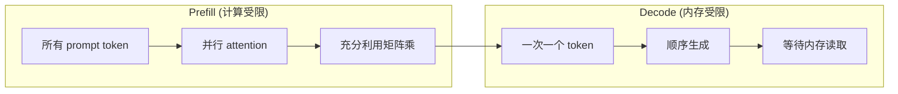
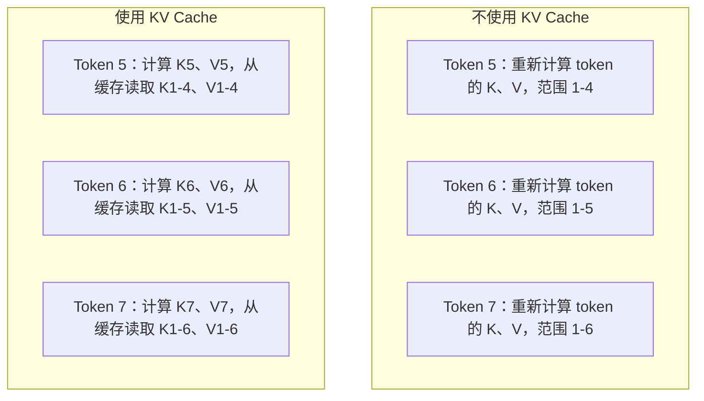
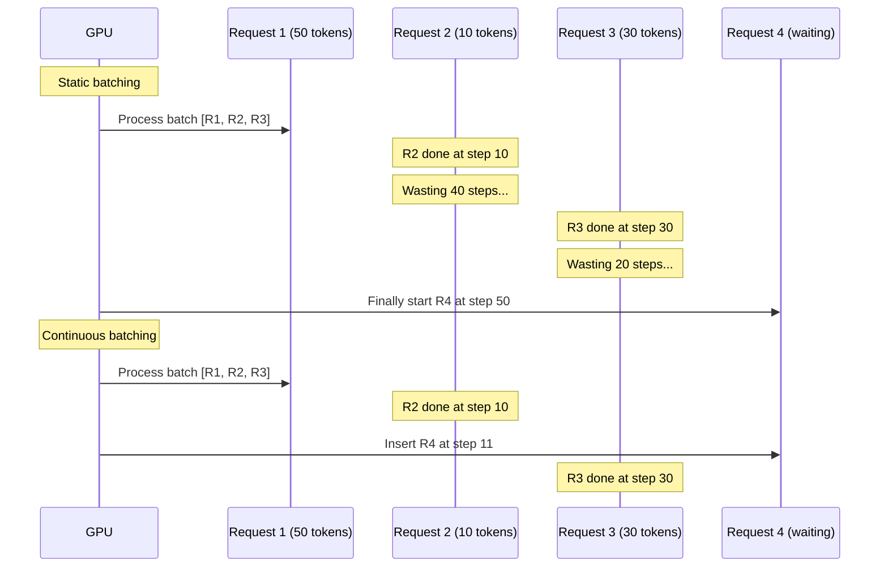
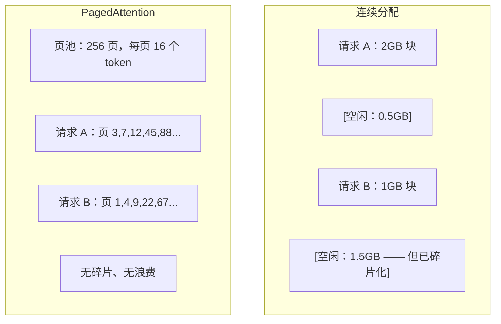
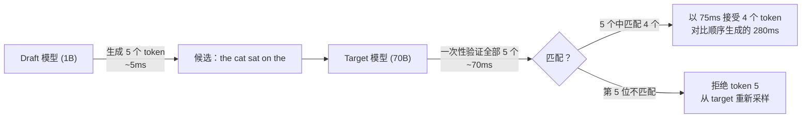

# 推理优化（Inference Optimization）

> 译注：本文译自同目录 [`en.md`](./en.md)。术语遵循仓根 [TRANSLATION_GUIDE.md](../../../../TRANSLATION_GUIDE.md)。

> LLM 推理由两个阶段定义。Prefill 并行处理你的 prompt——compute-bound（计算受限）。Decode 一次生成一个 token——memory-bound（内存受限）。每一项优化都瞄准其中一个或两个阶段。

**Type:** Build
**Languages:** Python
**Prerequisites:** Phase 10, Lessons 01-08（Transformer 架构、attention）
**Time:** ~120 分钟

## 学习目标（Learning Objectives）

- 实现 KV-cache，消除 autoregressive token 生成过程中的冗余计算
- 解释 LLM 推理的 prefill 与 decode 两个阶段，以及为什么它们各自有不同的瓶颈（compute-bound vs memory-bound）
- 实现 continuous batching（连续批处理）和 PagedAttention 概念，在并发请求下最大化 GPU 利用率
- 比较各种推理优化技巧（KV-cache、speculative decoding、flash attention）以及它们在吞吐 / 延迟上的权衡

## 问题（The Problem）

你在 4 张 A100 上部署 Llama 3 70B。单个用户拿到 ~50 tokens/秒。感觉很快。然后 100 个用户同时打到这个端点。吞吐掉到 3 tokens/秒/用户。你每个月 25,000 美元的 GPU 账单输出响应的速度，比人打字还慢。

模型本身在 1 个用户和 100 个用户之间没有任何变化。同样的权重，同样的架构，同样的数学。变化的是你怎么调度这些工作。朴素的推理实现浪费了 90% 以上的可用 GPU 算力。一个用户在等第 47 个 token 时占着整整一个 batch 槽位，而 GPU 内存总线在两次 matmul 之间空转。与此同时，新用户那 2,000 token 的 prompt 本可以把这段空闲时间填满有用的计算。

这不是扩展问题，这是调度问题。本课讲的这些技术——KV caching、continuous batching、PagedAttention、speculative decoding、prefix caching——决定了你是花每月 25k 美元的推理账单还是 5k 美元的，去服务同样的流量。

vLLM 在 4 张 A100-80GB 上部署 Llama 3 70B，低并发时能跑到 ~50 tokens/秒/用户，100 路并发下通过 continuous batching 和 PagedAttention 仍能维持 15-25 TPS/用户。如果没有这些优化，同样的硬件在那个并发下只能给到 5 TPS/用户。同样的 GPU、同样的模型，吞吐 4 倍。

## 概念（The Concept）

### Prefill 与 Decode（Prefill vs Decode）

每一次 LLM 推理请求都有两个截然不同的阶段。

**Prefill** 处理整个输入 prompt。所有 token 都已知，所以 attention 可以对整个序列并行计算。这是一次大规模的矩阵乘法——GPU 核心忙得满满当当。瓶颈在算力：你的硬件每秒能交付多少 FLOPS。一张 A100 的算力是 312 TFLOPS（BF16）。在单张 A100 上对 70B 模型做 4,096 token 的 prefill 大约需要 ~400ms。

**Decode** 一次生成一个输出 token。每个新 token 都要 attend 到前面所有 token，但每次前向传播只产生一个 token。权重矩阵的尺寸跟 prefill 时一样大，但你是在拿它乘一个向量而不是一个矩阵。GPU 核心几微秒就算完了，然后等下一批权重从内存搬过来。瓶颈在内存带宽：你能多快把模型权重从 HBM 流到计算单元。一张 A100 的带宽是 2 TB/s。一个 FP16 的 70B 模型是 140 GB。完整读一遍模型要 70ms——这就是单步 decode 的下限。



**ops:byte 比率**（也叫 arithmetic intensity，算术强度）抓住了这种权衡。它衡量你每从内存里读一字节就执行了多少次运算。

```
ops:byte ratio = FLOPs per token / bytes read from memory
```

在 4,096 token 的 batch 下做 prefill 时，每加载一份权重你就执行 ~4,096 次乘加。比率很高——你 compute-bound。在 batch=1 的 decode 时，每加载一份权重你只执行 ~1 次操作。比率很低——你 memory-bound。

最关键的洞察是：*decode 之所以 memory-bound，是因为你为了生成单个 token 就要读完整个模型*。下面每一项优化要么减少你读的内容、要么让单次读出能服务更多 token、要么干脆避免读。

### KV Cache

在 attention 里，每个 token 的 query 都要 attend 到前面所有 token 的 key 和 value 向量。如果不缓存，生成第 N 个 token 就要重新计算前面 N-1 个 token 全部的 key/value 投影。生成 token 2 时投影 token 1，生成 token 3 时再投一次，生成 token 4 时再投一次。等到 token 1,000 时，你已经把 token 1 投影了 999 遍。

KV cache 把前面所有 token 的 key 和 value 投影都存下来。生成第 N 个 token 时，你只算 token N 的 key 和 value，然后把它们和 token 1 到 N-1 的缓存 K/V 拼起来。



**KV cache 内存公式：**

```
KV cache size = 2 * num_layers * num_kv_heads * head_dim * seq_len * bytes_per_param
```

对 Llama 3 70B（80 层、8 个 KV head 走 GQA、head_dim=128、BF16）：

```
per token: 2 * 80 * 8 * 128 * 2 bytes = 327,680 bytes = 320 KB
at 4,096 tokens: 320 KB * 4,096 = 1.28 GB
at 128K tokens: 320 KB * 131,072 = 40 GB
```

Llama 3 70B 一段 128K context 的对话就要吃掉 40 GB 的 KV cache——半张 A100 的内存。如果 100 个用户并发、每个 4K token，单是 KV cache 就要 128 GB。这就是为什么 KV cache 管理是推理优化的核心挑战。

### 连续批处理（Continuous Batching）

静态 batching 要等到攒够 N 个请求才一起处理，并且要等 *所有* 请求都跑完才接受新请求。如果一个请求要 500 token、另一个只要 10 token，那个短请求跑完后还要再空等 490 个 decode 步。

Continuous batching（也叫 iteration-level batching，迭代级 batching）只要 batch 里有任何一个请求结束，就把新请求插进来。每个 decode 步都重新评估 batch。一个跑完 10 个 token 的请求会立刻被一个等待中的请求替换。



吞吐能涨多少取决于输出长度的方差有多大。长度均匀时，continuous batching 跟 static batching 一样。长度差异大时（也就是常见情况），continuous batching 能带来 2-5 倍的吞吐提升，因为 GPU 槽位永远不会空着。

### PagedAttention

每个请求的 KV cache 是一块连续内存。请求来了又走，内存就会碎片化——跟操作系统里 RAM 的碎片化一模一样。一个 4K token 的请求需要 1.28 GB 连续空间。哪怕你总共还有 2 GB 空闲，也未必能拿出 1.28 GB *连续* 空间。结果要么浪费内存，要么拒掉这个请求。

PagedAttention（出自 vLLM）把操作系统那套虚拟内存搬进了 KV cache。它不再给每个请求分一整块连续内存，而是分配固定大小的"page"（一般每页 16 个 token）。Page 可以散布在 GPU 物理内存的任何位置。一张页表把每个请求的逻辑序列位置映射到物理 page 的位置。



PagedAttention 还能对共享前缀做 **copy-on-write（写时复制）**。如果 50 个请求共享同一个 system prompt，那段 system prompt 的 KV cache 页只存一次，被 50 个请求共同引用。只有当某个请求开始岔开（用户消息不同了），它才会拿到自己的 page。对那些共享 system prompt 的应用，这能极大削减内存使用。

vLLM 报告通过 PagedAttention 实现了几乎零浪费（~4%，对比朴素分配的 ~60-80%）。

### 投机解码（Speculative Decoding）

Decode 慢是因为它是顺序的——你生成一个 token，喂回去，再生成下一个。但如果你能廉价地猜出后面 5 个 token，然后一次性验证它们呢？

Speculative decoding 用一个小而快的 **draft model（草稿模型）** 生成 K 个候选 token。然后大的 **target model（目标模型）** 在一次前向传播里处理所有 K 个候选（这一步看起来像 prefill——并行、compute-bound、效率高）。如果 target model 同意 draft model 的预测，你就在一次 target 前向的时间里接受了 K 个 token。如果在第 j 个位置出现分歧，你就接受 token 1 到 j-1，丢掉剩下的。



加速比取决于 **acceptance rate（接受率）**——draft model 的预测和 target 一致的频率。Llama 3 8B 给 Llama 3 70B 当 draft 时，自然语言上典型的接受率是 70-85%。这能换来 2-3 倍的 decode 加速。

speculative decoding 有三种实现路径：

| 方法 | Draft 来源 | 接受率 | 开销 |
|--------|-------------|-----------------|----------|
| Draft-target (Leviathan et al.) | 独立的小模型 | 70-85% | draft model 的内存 |
| EAGLE (Li et al.) | target 上的轻量 head | 75-90% | ~1% 额外参数 |
| N-gram lookup | Token n-gram 表 | 40-60% | 可忽略 |

**EAGLE** 在 target model 的隐状态之上训练一个小的 autoregressive head。它用 target model 倒数第二层的特征预测下一个 token 的 embedding。因为它是在 target model 自己的表示之上跑（而不是另一个独立模型），所以能在几乎不增加内存的前提下拿到更高的接受率。EAGLE-2 还加了一棵动态 draft 树，根据上下文调整候选数量。

**N-gram speculative decoding** 维护一张 n-gram 续写表，可以来自当前上下文，也可以来自预先构建的语料。如果 draft 命中了同一对话里之前出现过的内容（重复的模式、代码、结构化输出），它就能零神经网络开销地命中。平均接受率更低，但每次投机的成本基本免费。

Speculative decoding *在数学上是精确的*——输出分布跟 target model 的分布完全一致。它不是近似。验证步骤保证每个被接受的 token 拥有 target model 本来就会赋予它的概率。

### 前缀缓存（Prefix Caching）

很多请求共享同一个前缀。一段 chatbot 的 system prompt。一个 RAG 上下文块。一组 few-shot 示例。没有 prefix caching 的话，每个请求都会从头重算这些共享 token 的 KV cache。

Prefix caching 把常见前缀的 KV cache 存起来，跨请求复用。新请求来时如果带着已知的前缀，系统就把缓存的 KV 条目复制（或引用）过来，只算独有后缀那部分的 KV。

如果一段 2,000 token 的 system prompt 被所有请求共享，prefix caching 能为每个请求省掉 ~400ms 的 prefill。在每秒 100 个请求的速率下，这每秒能省下 40 秒的 GPU 计算——比一张 GPU 一秒能干的活还多。

SGLang 的 RadixAttention 用一棵 radix tree（trie）按 token 内容索引前缀，从而实现 prefix caching。任何匹配到已存前缀的请求都能免费拿到它的 KV cache。这棵树支持部分前缀匹配——如果你和某条缓存条目共享 2,000 个前缀 token 中的 1,500 个，你就能复用这 1,500 个，只重算剩下 500 个。

### 推理引擎（Inference Engines）

生产级 LLM serving 由三家引擎主导：

| 引擎 | 关键创新 | 最适合 |
|--------|---------------|----------|
| vLLM | PagedAttention、continuous batching | 通用 serving，兼容性最好 |
| SGLang | RadixAttention（prefix caching）、结构化生成 | 多轮 chatbot、受限 decoding |
| TensorRT-LLM | NVIDIA kernel fusion、FP8 quantization | NVIDIA 硬件上单卡吞吐最大化 |

**vLLM** 是默认起点。它支持的模型范围最广，能跑在任意 GPU 厂商上（NVIDIA、AMD、Intel），靠 PagedAttention + continuous batching 拿到很强的吞吐。它提供 OpenAI 兼容 API，所以你可以把它直接当成 OpenAI API 的替代品塞进去。

**SGLang** 建立在和 vLLM 相同的底座上，但加了 RadixAttention 做 prefix caching，并提供了一种针对结构化 LLM 程序的领域专用语言。如果你的负载涉及多轮对话、tool use、或者受限 decoding（JSON 输出、regex 引导生成），SGLang 通过前缀复用通常能比 vLLM 快 2-5 倍。

**TensorRT-LLM** 把模型编译成优化过的 NVIDIA GPU kernel。它会做算子融合（attention + linear + activation 合到一个 kernel 里）、在 H100 上用 FP8、并和 NVIDIA Triton Inference Server 集成做生产部署。它在 NVIDIA 硬件上的单卡吞吐最高，但需要更多配置，而且只跑得了 NVIDIA GPU。

Llama 3 70B 的真实数据（4 张 A100-80GB、BF16）：

| 指标 | vLLM | SGLang | TensorRT-LLM |
|--------|------|--------|---------------|
| 吞吐（1 用户） | ~50 TPS | ~55 TPS | ~65 TPS |
| 吞吐（100 用户） | 总 ~2,500 TPS | 总 ~3,200 TPS | 总 ~3,000 TPS |
| 首 token 延迟 | ~400ms | ~300ms（命中前缀） | ~350ms |
| 最大上下文 | 128K | 128K | 128K |

### Ops:Byte 框架（The Ops:Byte Framework）

不能优化你不度量的东西。ops:byte 比率告诉你自己是 compute-bound 还是 memory-bound，从而决定哪些优化才管用。

```
Compute roof: peak FLOPS of the GPU
Memory roof:  peak bandwidth * ops:byte ratio
```

ops:byte 低时（decode、小 batch），你撞上的是内存带宽天花板。加更多算力（更高频率、更多核）也帮不上忙。你需要减少内存读取（quantization、KV cache 压缩），或者增大 batch size，把单次读出的成本摊到更多有用工作上。

ops:byte 高时（prefill、大 batch），你撞上的是算力天花板。优化内存带宽帮不上忙。你需要更快的 GPU、kernel fusion，或者降低精度去榨更多 FLOPS。

| 场景 | ops:byte | 受限于 | 优化手段 |
|----------|----------|-------|---------------|
| Prefill, batch=1 | ~4,096 | 算力 | Kernel fusion、FP8 |
| Decode, batch=1 | ~1 | 内存 | quantization、KV 压缩 |
| Decode, batch=32 | ~32 | 内存 | 增大 batch、continuous batching |
| Decode, batch=256 | ~256 | 过渡区 | 两者都有影响 |
| Decode, batch=1024 | ~1,024 | 算力 | Kernel fusion、tensor parallelism |

A100 上的交叉点大约在 ops:byte = 156（312 TFLOPS / 2 TB/s）。低于 156，你 memory-bound；高于 156，你 compute-bound。Continuous batching 通过在每次迭代里塞更多 token，把 decode 推向这个交叉点。

## 动手实现（Build It）

### Step 1：从零写 KV Cache（KV Cache from Scratch）

我们构建一个多头 KV cache，按 layer、按 head 存储 key 和 value 投影，并展示其内存增长模式。

```python
import numpy as np

class KVCache:
    def __init__(self, num_layers, num_heads, head_dim, max_seq_len, dtype=np.float16):
        self.num_layers = num_layers
        self.num_heads = num_heads
        self.head_dim = head_dim
        self.max_seq_len = max_seq_len
        self.dtype = dtype

        self.k_cache = np.zeros(
            (num_layers, num_heads, max_seq_len, head_dim), dtype=dtype
        )
        self.v_cache = np.zeros(
            (num_layers, num_heads, max_seq_len, head_dim), dtype=dtype
        )
        self.seq_len = 0

    def update(self, layer_idx, new_keys, new_values):
        num_new = new_keys.shape[1]
        end = self.seq_len + num_new
        self.k_cache[layer_idx, :, self.seq_len:end, :] = new_keys
        self.v_cache[layer_idx, :, self.seq_len:end, :] = new_values
        return (
            self.k_cache[layer_idx, :, :end, :],
            self.v_cache[layer_idx, :, :end, :]
        )

    def advance(self, num_tokens):
        self.seq_len += num_tokens

    def memory_bytes(self):
        return self.k_cache.nbytes + self.v_cache.nbytes

    def used_bytes(self):
        per_token = 2 * self.num_layers * self.num_heads * self.head_dim * np.dtype(self.dtype).itemsize
        return per_token * self.seq_len
```

### Step 2：带 KV Cache 的 Attention（Attention with KV Cache）

一个简化版的多头 attention，在 decode 步使用 KV cache。

```python
def scaled_dot_product_attention(query, keys, values):
    head_dim = query.shape[-1]
    scores = np.matmul(query, keys.transpose(0, 1, 3, 2)) / np.sqrt(head_dim)
    seq_len_q = scores.shape[-2]
    seq_len_k = scores.shape[-1]
    if seq_len_q > 1:
        mask = np.triu(np.ones((seq_len_q, seq_len_k), dtype=np.float32), k=seq_len_k - seq_len_q + 1)
        scores = scores + mask * (-1e9)
    max_scores = np.max(scores, axis=-1, keepdims=True)
    exp_scores = np.exp(scores - max_scores)
    attn_weights = exp_scores / np.sum(exp_scores, axis=-1, keepdims=True)
    return np.matmul(attn_weights, values)


class MultiHeadAttention:
    def __init__(self, d_model, num_heads):
        self.num_heads = num_heads
        self.head_dim = d_model // num_heads
        scale = np.sqrt(2.0 / d_model)
        self.W_q = np.random.randn(d_model, d_model).astype(np.float32) * scale
        self.W_k = np.random.randn(d_model, d_model).astype(np.float32) * scale
        self.W_v = np.random.randn(d_model, d_model).astype(np.float32) * scale
        self.W_o = np.random.randn(d_model, d_model).astype(np.float32) * scale

    def forward(self, x, kv_cache=None, layer_idx=0):
        batch, seq_len, d_model = x.shape
        Q = np.matmul(x, self.W_q).reshape(batch, seq_len, self.num_heads, self.head_dim).transpose(0, 2, 1, 3)
        K = np.matmul(x, self.W_k).reshape(batch, seq_len, self.num_heads, self.head_dim).transpose(0, 2, 1, 3)
        V = np.matmul(x, self.W_v).reshape(batch, seq_len, self.num_heads, self.head_dim).transpose(0, 2, 1, 3)

        if kv_cache is not None:
            K_full, V_full = kv_cache.update(layer_idx, K[0], V[0])
            K = K_full[np.newaxis, :, :, :]
            V = V_full[np.newaxis, :, :, :]
            if seq_len == 1:
                kv_cache.advance(1)

        attn_out = scaled_dot_product_attention(Q, K, V)
        attn_out = attn_out.transpose(0, 2, 1, 3).reshape(batch, -1, d_model)
        return np.matmul(attn_out, self.W_o)
```

### Step 3：Continuous Batching 模拟器（Continuous Batching Simulator）

模拟静态 batching 与 continuous batching 的调度差异。

```python
import heapq

class Request:
    def __init__(self, request_id, prompt_tokens, output_tokens, arrival_step):
        self.request_id = request_id
        self.prompt_tokens = prompt_tokens
        self.output_tokens = output_tokens
        self.arrival_step = arrival_step
        self.tokens_generated = 0
        self.start_step = None
        self.end_step = None

    def is_done(self):
        return self.tokens_generated >= self.output_tokens


def simulate_static_batching(requests, batch_size):
    step = 0
    completed = []
    queue = list(requests)
    queue.sort(key=lambda r: r.arrival_step)

    while queue:
        batch = []
        while queue and len(batch) < batch_size:
            r = queue.pop(0)
            r.start_step = max(step, r.arrival_step)
            batch.append(r)

        if batch:
            step = max(step, max(r.start_step for r in batch))
            max_output = max(r.output_tokens for r in batch)
            for r in batch:
                r.tokens_generated = r.output_tokens
                r.end_step = step + max_output
            step += max_output
            completed.extend(batch)

    return completed


def simulate_continuous_batching(requests, batch_size):
    step = 0
    completed = []
    queue = sorted(requests, key=lambda r: r.arrival_step)
    queue_idx = 0
    active = []
    waiting = []

    while queue_idx < len(queue) or active or waiting:
        while queue_idx < len(queue) and queue[queue_idx].arrival_step <= step:
            waiting.append(queue[queue_idx])
            queue_idx += 1

        while waiting and len(active) < batch_size:
            r = waiting.pop(0)
            r.start_step = step
            active.append(r)

        if not active:
            if waiting:
                step += 1
                continue
            elif queue_idx < len(queue):
                step = queue[queue_idx].arrival_step
                continue
            else:
                break

        for r in active:
            r.tokens_generated += 1

        done = [r for r in active if r.is_done()]
        for r in done:
            r.end_step = step + 1
            completed.append(r)
        active = [r for r in active if not r.is_done()]

        step += 1

    return completed


def batching_stats(completed):
    latencies = [r.end_step - r.arrival_step for r in completed]
    total_time = max(r.end_step for r in completed) - min(r.arrival_step for r in completed)
    total_tokens = sum(r.output_tokens for r in completed)
    return {
        "avg_latency": np.mean(latencies),
        "p50_latency": np.median(latencies),
        "p99_latency": np.percentile(latencies, 99),
        "total_time": total_time,
        "throughput": total_tokens / total_time if total_time > 0 else 0,
    }
```

### Step 4：Prefix Cache

一个基于 trie 的 prefix cache，存储共享前缀的 KV 条目。

```python
class TrieNode:
    def __init__(self):
        self.children = {}
        self.kv_data = None
        self.hit_count = 0


class PrefixCache:
    def __init__(self, max_entries=1000):
        self.root = TrieNode()
        self.max_entries = max_entries
        self.total_entries = 0
        self.hits = 0
        self.misses = 0

    def _walk(self, token_ids):
        node = self.root
        depth = 0
        for tid in token_ids:
            if tid not in node.children:
                break
            node = node.children[tid]
            depth += 1
        return node, depth

    def lookup(self, token_ids):
        node, depth = self._walk(token_ids)
        if depth > 0:
            self.hits += 1
            current = self.root
            for tid in token_ids[:depth]:
                current = current.children[tid]
                current.hit_count += 1
            kv_entries = []
            current = self.root
            for tid in token_ids[:depth]:
                current = current.children[tid]
                if current.kv_data is not None:
                    kv_entries.append(current.kv_data)
            return depth, kv_entries
        self.misses += 1
        return 0, []

    def insert(self, token_ids, kv_per_token):
        node = self.root
        for i, tid in enumerate(token_ids):
            if tid not in node.children:
                if self.total_entries >= self.max_entries:
                    return i
                node.children[tid] = TrieNode()
                self.total_entries += 1
            node = node.children[tid]
            if i < len(kv_per_token):
                node.kv_data = kv_per_token[i]
        return len(token_ids)

    def hit_rate(self):
        total = self.hits + self.misses
        return self.hits / total if total > 0 else 0.0
```

### Step 5：Speculative Decoding 模拟器（Speculative Decoding Simulator）

模拟 draft-target 形式的 speculative decoding，可配置接受率。

```python
class DraftModel:
    def __init__(self, vocab_size, acceptance_rate=0.8):
        self.vocab_size = vocab_size
        self.acceptance_rate = acceptance_rate

    def generate(self, context, num_tokens):
        tokens = np.random.randint(0, self.vocab_size, size=num_tokens)
        return tokens

    def get_probs(self, context, token):
        probs = np.random.dirichlet(np.ones(self.vocab_size))
        return probs


class TargetModel:
    def __init__(self, vocab_size):
        self.vocab_size = vocab_size

    def get_probs(self, context, tokens=None):
        if tokens is not None:
            return [np.random.dirichlet(np.ones(self.vocab_size)) for _ in tokens]
        return np.random.dirichlet(np.ones(self.vocab_size))


def speculative_decode(draft_model, target_model, context, num_speculative=5,
                       draft_cost=1.0, target_cost=10.0, verify_cost=12.0):
    total_tokens = 0
    total_cost = 0.0
    accepted_counts = []
    context = list(context)

    max_tokens = 100

    while total_tokens < max_tokens:
        draft_tokens = draft_model.generate(context, num_speculative)
        total_cost += draft_cost * num_speculative

        target_probs = target_model.get_probs(context, draft_tokens)
        total_cost += verify_cost

        accepted = 0
        for i, token in enumerate(draft_tokens):
            draft_p = draft_model.get_probs(context + list(draft_tokens[:i]), token)
            target_p = target_probs[i]

            r = np.random.random()
            acceptance_prob = min(1.0, target_p[token] / (draft_p[token] + 1e-10))

            if r < draft_model.acceptance_rate:
                accepted += 1
                context.append(token)
                total_tokens += 1
            else:
                new_token = np.random.choice(draft_model.vocab_size, p=target_p)
                context.append(new_token)
                total_tokens += 1
                break

        accepted_counts.append(accepted)

        if accepted == num_speculative:
            bonus_probs = target_model.get_probs(context)
            bonus_token = np.random.choice(draft_model.vocab_size, p=bonus_probs)
            context.append(bonus_token)
            total_tokens += 1

    sequential_cost = total_tokens * target_cost
    return {
        "total_tokens": total_tokens,
        "speculative_cost": total_cost,
        "sequential_cost": sequential_cost,
        "speedup": sequential_cost / total_cost if total_cost > 0 else 1.0,
        "avg_accepted": np.mean(accepted_counts),
        "acceptance_rate": np.mean(accepted_counts) / num_speculative,
    }


def compare_speculation_strategies(vocab_size=1000, num_trials=20):
    results = {}

    for name, acceptance_rate, spec_tokens in [
        ("Draft-target (8B->70B)", 0.78, 5),
        ("EAGLE", 0.85, 6),
        ("N-gram", 0.50, 4),
        ("No speculation", 0.0, 0),
    ]:
        if spec_tokens == 0:
            results[name] = {
                "speedup": 1.0,
                "acceptance_rate": 0.0,
                "avg_accepted": 0.0,
            }
            continue

        trial_results = []
        for _ in range(num_trials):
            draft = DraftModel(vocab_size, acceptance_rate=acceptance_rate)
            target = TargetModel(vocab_size)
            context = list(np.random.randint(0, vocab_size, size=10))
            result = speculative_decode(draft, target, context, num_speculative=spec_tokens)
            trial_results.append(result)

        results[name] = {
            "speedup": np.mean([r["speedup"] for r in trial_results]),
            "acceptance_rate": np.mean([r["acceptance_rate"] for r in trial_results]),
            "avg_accepted": np.mean([r["avg_accepted"] for r in trial_results]),
        }

    return results
```

### Step 6：KV Cache 内存分析器（KV Cache Memory Profiler）

为真实模型配置计算 KV cache 的内存需求。

```python
MODEL_CONFIGS = {
    "Llama-3-8B": {
        "num_layers": 32, "num_kv_heads": 8, "head_dim": 128,
        "model_params_b": 8, "gqa": True,
    },
    "Llama-3-70B": {
        "num_layers": 80, "num_kv_heads": 8, "head_dim": 128,
        "model_params_b": 70, "gqa": True,
    },
    "Llama-3-405B": {
        "num_layers": 126, "num_kv_heads": 8, "head_dim": 128,
        "model_params_b": 405, "gqa": True,
    },
    "Mistral-7B": {
        "num_layers": 32, "num_kv_heads": 8, "head_dim": 128,
        "model_params_b": 7, "gqa": True,
    },
    "GPT-4-est": {
        "num_layers": 120, "num_kv_heads": 96, "head_dim": 128,
        "model_params_b": 1800, "gqa": False,
    },
}


def kv_cache_memory(config, seq_len, dtype_bytes=2):
    per_token = 2 * config["num_layers"] * config["num_kv_heads"] * config["head_dim"] * dtype_bytes
    total = per_token * seq_len
    return {
        "per_token_bytes": per_token,
        "per_token_kb": per_token / 1024,
        "total_bytes": total,
        "total_mb": total / (1024 ** 2),
        "total_gb": total / (1024 ** 3),
    }


def memory_budget(config, gpu_memory_gb, model_dtype_bytes=2, kv_dtype_bytes=2):
    model_memory_gb = config["model_params_b"] * 1e9 * model_dtype_bytes / (1024 ** 3)
    overhead_gb = gpu_memory_gb * 0.1
    available_for_kv = gpu_memory_gb - model_memory_gb - overhead_gb

    if available_for_kv <= 0:
        return {"error": "Model does not fit in GPU memory", "model_memory_gb": model_memory_gb}

    per_token = 2 * config["num_layers"] * config["num_kv_heads"] * config["head_dim"] * kv_dtype_bytes
    max_tokens = int(available_for_kv * (1024 ** 3) / per_token)

    return {
        "gpu_memory_gb": gpu_memory_gb,
        "model_memory_gb": round(model_memory_gb, 1),
        "overhead_gb": round(overhead_gb, 1),
        "available_for_kv_gb": round(available_for_kv, 1),
        "max_total_tokens": max_tokens,
        "max_users_at_2k": max_tokens // 2048,
        "max_users_at_4k": max_tokens // 4096,
        "max_users_at_32k": max_tokens // 32768,
    }
```

## 用起来（Use It）

用 vLLM：

```python
from vllm import LLM, SamplingParams

llm = LLM(
    model="meta-llama/Llama-3-70B-Instruct",
    tensor_parallel_size=4,
    enable_prefix_caching=True,
    max_model_len=8192,
    gpu_memory_utilization=0.9,
)

params = SamplingParams(temperature=0.7, max_tokens=256)
outputs = llm.generate(["Explain inference optimization in one paragraph."], params)
```

用 SGLang 做 prefix caching + 结构化输出：

```python
import sglang as sgl

@sgl.function
def classify(s, text):
    s += sgl.system("You are a classifier. Output JSON only.")
    s += sgl.user(f"Classify this text: {text}")
    s += sgl.assistant(sgl.gen("result", regex=r'\{"label": "(positive|negative|neutral)"\}'))

runtime = sgl.Runtime(model_path="meta-llama/Llama-3-70B-Instruct", tp_size=4)
sgl.set_default_backend(runtime)

results = classify.run_batch([
    {"text": "This product is amazing!"},
    {"text": "Terrible experience."},
    {"text": "It was okay I guess."},
])
```

用 TensorRT-LLM：

```python
import tensorrt_llm
from tensorrt_llm.runtime import ModelRunner

runner = ModelRunner.from_dir("./llama-70b-trt-engine/", rank=0)

outputs = runner.generate(
    batch_input_ids=[tokenizer.encode("Explain KV caching.")],
    max_new_tokens=256,
    temperature=0.7,
)
```

## 上线部署（Ship It）

本课产出：
- `outputs/skill-inference-optimization.md` —— 一份用于诊断和优化 LLM 推理 serving 的 skill

## 练习（Exercises）

1. 改造 KV cache 分析器，比较 FP16、FP8、INT4 三种 KV cache quantization。对 Llama 3 70B 在 4K context 下，分别算出 4 张 A100-80GB 上的最大并发用户数。把 KV 量化到 INT4 应该大致能让用户容量翻 4 倍。

2. 扩展 continuous batching 模拟器，跟踪 GPU 利用率（每步被填满的 batch 槽位比例）。用 50 个请求做实验，输出长度服从 Pareto 分布（shape=1.5、scale=20），分别画出 static 和 continuous batching 随时间的利用率。Continuous batching 应该能维持 >80% 的利用率。

3. 实现一个 grouped-query attention（GQA）版本的 KV cache，让 `num_kv_heads < num_query_heads`。Llama 3 70B 用 64 个 query head，但只有 8 个 KV head。计算它相对于完整 multi-head attention 的内存节省（KV cache 大小缩小 8 倍）。

4. 构建一个带 LRU 淘汰的 prefix cache。把 max_entries 设为 500，生成 1,000 个请求，其中 60% 共享 5 个常见前缀之一。测量命中率，并和无上限的 cache 比较。淘汰策略不错的话，命中率应该能保持在 55% 以上。

5. 扩展 speculative decoding 模拟器，实现树状投机（EAGLE-2 风格）。不再是一条 K 长度的 draft 链，而是生成一棵候选树（比如 3 层、每层 2 个分支 = 8 个叶子候选）。比较每轮验证接受的 token 总数与线性投机的差异。

## 关键术语（Key Terms）

| 术语 | 大家怎么说 | 它实际是什么 |
|------|----------------|----------------------|
| Prefill | "处理 prompt" | 对所有输入 token 并行计算 attention——compute-bound，因为这次完整的矩阵乘法让 GPU 核心一直忙着 |
| Decode | "生成 token" | 每次前向传播只产出一个 token，每次都要把整套模型权重读一遍——memory-bound，因为算力很快算完，要等下一批权重 |
| KV cache | "缓存 attention 状态" | 把前面所有 token 的 key/value 投影存下来，避免每个 decode 步重复计算——拿内存换算力 |
| Continuous batching | "动态 batching" | 只要有任何请求结束，就立刻把新请求插入到正在跑的 batch 里，每个 decode 迭代都重新评估，而不是等整个 batch 跑完 |
| PagedAttention | "KV cache 的虚拟内存" | 用固定大小的 page 而非连续内存块来分配 KV cache，消除碎片，并让共享前缀可以走 copy-on-write |
| Speculative decoding | "草稿+验证" | 用一个快的 draft model 提一批 token，再用 target model 在一次前向里验证它们——数学上精确，2-3 倍加速 |
| EAGLE | "自我投机解码" | 一种 speculative decoding 变体，在 target model 自己的隐状态之上训练一个轻量 head，比独立 draft model 接受率更高 |
| Prefix caching | "复用 system prompt 的 KV" | 把常见前缀（system prompt、few-shot 示例）已算好的 KV cache 条目存下来，跨请求复用，跳过冗余的 prefill |
| Ops:byte ratio | "Arithmetic intensity，算术强度" | 计算操作数 vs 从内存读取的字节数之比——决定一个负载是 compute-bound（高比率）还是 memory-bound（低比率） |
| Time to first token | "TTFT" | 从收到请求到产出第一个输出 token 的延迟——长 prompt 下主要由 prefill 时间主导 |

## 延伸阅读（Further Reading）

- Kwon et al., "Efficient Memory Management for Large Language Model Serving with PagedAttention" (2023) —— vLLM 论文，提出 paged KV cache 管理，现在已是推理 serving 的行业标准
- Leviathan et al., "Fast Inference from Transformers via Speculative Decoding" (2023) —— 奠基性论文，证明 draft-verify 投机产生的输出分布与 target model 完全一致，并能拿到 2-3 倍加速
- Li et al., "EAGLE: Speculative Sampling Requires Rethinking Feature Uncertainty" (2024) —— 通过在 target model 自己的特征上训练 head（而不是用独立的 draft model），获得更高接受率
- Zheng et al., "SGLang: Efficient Execution of Structured Language Model Programs" (2024) —— 提出 RadixAttention 做 prefix caching，并给出多次调用 LLM 程序的编程模型
- Williams et al., "Roofline: An Insightful Visual Performance Model for Multicore Architectures" (2009) —— 最初的 roofline 论文，把 ops:byte 框架形式化为推理算力 vs 内存瓶颈的工具
