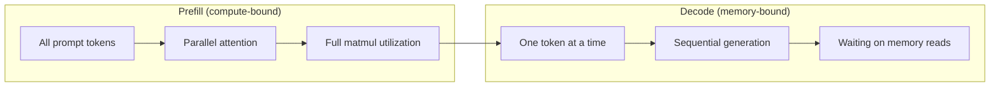
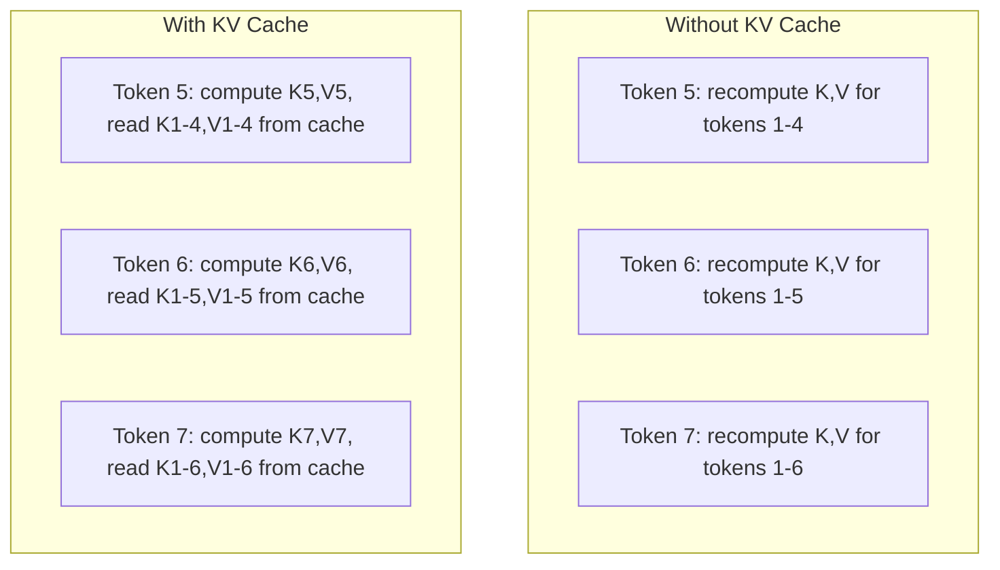
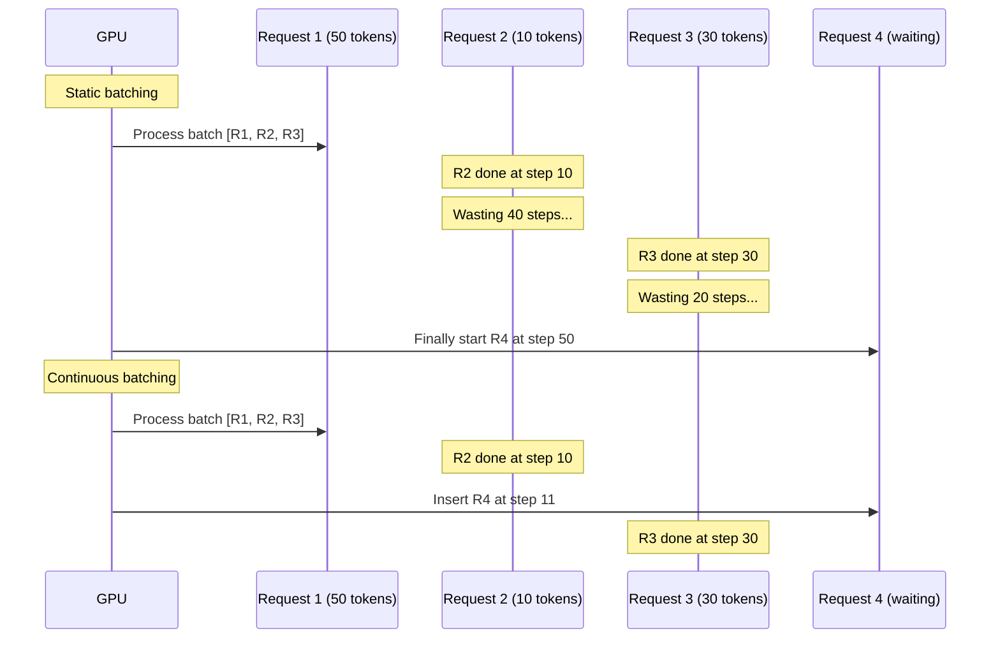
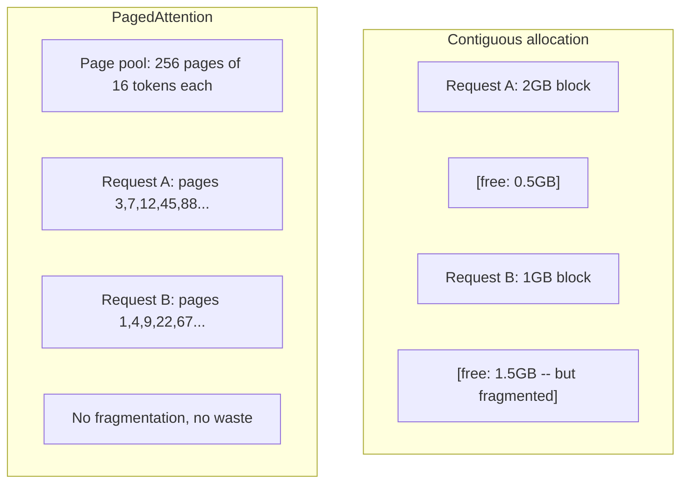
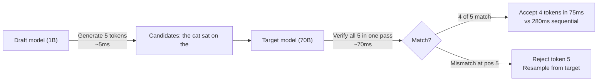

# 12 · 推理优化

> LLM 推理由两个阶段定义。预填充（Prefill）并行处理你的提示词——受算力约束。解码（Decode）逐个生成 token——受内存约束。每一项优化都针对其中一个或两个阶段。

**类型：** 构建
**语言：** Python
**前置：** 阶段 10，第 01-08 课（Transformer 架构、注意力机制）
**时长：** 约 120 分钟

## 学习目标

- 实现「KV 缓存（KV-cache）」以消除自回归 token 生成过程中的冗余计算
- 解释 LLM 推理的预填充阶段与解码阶段，以及它们为何存在不同的瓶颈（受算力约束 vs 受内存约束）
- 实现「连续批处理（continuous batching）」与「分页注意力（PagedAttention）」的核心概念，在并发请求下最大化 GPU 利用率
- 对比各类推理优化技术（KV 缓存、推测解码、闪电注意力）及其在吞吐量/延迟上的权衡

## 问题所在

你在 4 张 A100 GPU 上部署了 Llama 3 70B。单个用户能拿到约 50 token/秒。感觉很快。然后 100 个用户同时打到这个端点上。吞吐量骤降至每用户 3 token/秒。你每月 25,000 美元的 GPU 账单，提供回复的速度还不如人打字快。

模型本身在 1 个用户和 100 个用户之间没有任何变化。同样的权重、同样的架构、同样的数学运算。变化的是你如何调度这些工作。朴素的推理会浪费 90% 以上的可用 GPU 算力。一个正在等待第 47 个 token 的用户，会占据整个批次的一个槽位，而 GPU 的内存总线在两次矩阵乘法之间却处于闲置状态。与此同时，一个新用户那 2,000 token 的提示词本可以用有用的计算来填满这段死时间。

这不是一个扩展（scaling）问题，而是一个调度（scheduling）问题。本课中的技术——KV 缓存、连续批处理、分页注意力、推测解码、前缀缓存——正是区分「每月 25k 美元」与「每月 5k 美元服务相同流量」的关键所在。

vLLM 在 4 张 A100-80GB 上服务 Llama 3 70B，在低并发下可达约 50 token/秒/用户，并通过连续批处理与分页注意力在 100 个并发请求下维持 15-25 TPS/用户。如果没有这些优化，同样的硬件在该并发量下只能提供 5 TPS/用户。同样的 GPU，同样的模型，吞吐量却是 4 倍。

## 核心概念

### 预填充 vs 解码

每个 LLM 推理请求都有两个截然不同的阶段。

**预填充（Prefill）** 处理整个输入提示词。所有 token 都已知，因此注意力可以在整个序列上并行计算。这是一次大型矩阵乘法——GPU 核心保持繁忙。瓶颈在于算力：你的硬件每秒能交付多少 FLOPS。一张 A100 可达 312 TFLOPS（BF16）。在单张 A100 上对一个 70B 模型处理 4,096 token 的提示词，预填充约需 400ms。

**解码（Decode）** 逐个生成输出 token。每个新 token 都会关注所有先前的 token，但每次前向传播只产生一个 token。权重矩阵的大小与预填充时相同，但你是用它们去乘一个单独的向量，而非一个矩阵。GPU 核心在微秒级别就完成了计算，然后等待下一批权重从内存中到达。瓶颈在于内存带宽：你能多快地把模型权重从 HBM 流式传输到计算单元。一张 A100 有 2 TB/s 的带宽。一个 70B 模型在 FP16 下是 140 GB。完整读取一遍模型需要 70ms——这就是单个解码步骤的下限。



**算力:字节比（ops:byte ratio）**（也称为算术强度，arithmetic intensity）刻画了这种权衡。它衡量你每从内存加载一个字节所执行的运算次数。

```
ops:byte ratio = FLOPs per token / bytes read from memory
```

在用一批 4,096 个 token 进行预填充时，每加载一个权重你执行约 4,096 次乘加运算。该比值很高——你受算力约束。在批大小为 1 的解码过程中，每加载一个权重你执行约 1 次运算。该比值很低——你受内存约束。

根本性的洞察：*解码之所以受内存约束，是因为你要读取整个模型才能产出单个 token*。下面每一项优化，要么减少你需要读取的内容，要么增大每次读取所处理的 token 批量，要么完全避免读取。

### KV 缓存

在注意力计算中，每个 token 的查询（query）都会关注所有先前 token 的键（key）和值（value）向量。如果不做缓存，生成第 N 个 token 就需要重新计算前面所有 N-1 个 token 的键和值投影。第 1 个 token 在生成第 2 个 token 时被投影一次，生成第 3 个时再投影一次，生成第 4 个时又一次。到第 1,000 个 token 时，你已经把第 1 个 token 投影了总共 999 次。

KV 缓存存储了所有先前 token 的键和值投影。在生成第 N 个 token 时，你只需计算第 N 个 token 的键和值，然后把它们与缓存中第 1 到 N-1 个 token 的 K/V 拼接起来。



**KV 缓存的内存公式：**

```
KV cache size = 2 * num_layers * num_kv_heads * head_dim * seq_len * bytes_per_param
```

对于 Llama 3 70B（80 层，使用 GQA 的 8 个 KV 头，head_dim=128，BF16）：

```
per token: 2 * 80 * 8 * 128 * 2 bytes = 327,680 bytes = 320 KB
at 4,096 tokens: 320 KB * 4,096 = 1.28 GB
at 128K tokens: 320 KB * 131,072 = 40 GB
```

对于 Llama 3 70B，单个 128K 上下文的对话就要消耗 40 GB 的 KV 缓存——相当于一张 A100 显存的一半。当 100 个并发用户每人 4K token 时，仅 KV 缓存就需要 128 GB。这就是为什么 KV 缓存管理是推理优化的核心挑战。

### 连续批处理

静态批处理（Static batching）会等到攒齐一批 N 个请求才一起处理，并且要等到*所有*请求都完成后才接受新请求。如果一个请求需要 500 个 token，另一个只需要 10 个，那么短请求在完成后还要空闲 490 个解码步骤。

连续批处理（也称为迭代级批处理，iteration-level batching）会在任意请求完成时立即把新请求插入到批次中。批次在每个解码步骤都会被重新评估。一个在 10 个 token 后就完成的请求会立刻被一个正在等待的请求替换。



吞吐量的提升取决于输出长度的差异程度。当长度一致时，连续批处理与静态批处理表现相当。当长度可变时（这是常见情况），连续批处理可以带来 2-5 倍更高的吞吐量，因为 GPU 槽位永远不会闲置。

### 分页注意力

每个请求的 KV 缓存是一块连续（contiguous）的内存。随着请求的到来和离开，内存会产生碎片——这与操作系统中的内存碎片化如出一辙。一个 4K token 的请求需要 1.28 GB 的连续内存。即便你总共有 2 GB 空闲，也未必能凑出 1.28 GB *连续* 内存。你要么浪费内存，要么拒绝该请求。

分页注意力（来自 vLLM）将操作系统式的虚拟内存应用到 KV 缓存上。它不再为每个请求分配一整块连续内存，而是分配固定大小的「页（page）」（通常每页 16 个 token）。这些页可以位于物理 GPU 内存中的任何位置。一张页表（page table）将每个请求的逻辑序列位置映射到物理页的位置。



分页注意力还为共享前缀启用了**写时复制（copy-on-write）**。如果 50 个请求共享同一个系统提示词，那么该系统提示词的 KV 缓存页只存储一份，由全部 50 个请求引用。只有当某个请求出现分歧（不同的用户消息）时，它才会获得自己的页。这对于具有共享系统提示词的应用而言，能显著削减内存占用。

vLLM 报告称，通过分页注意力实现了接近于零的内存浪费（约 4%，而朴素分配为约 60-80%）。

### 推测解码

解码之所以慢，是因为它是顺序的——你生成一个 token，把它喂回去，再生成下一个。但如果你能廉价地猜出接下来的 5 个 token，然后一次性把它们全部验证，会怎样？

推测解码（Speculative decoding）使用一个小而快的**草稿模型（draft model）**来生成 K 个候选 token。随后**目标模型（target model）**在一次前向传播中处理全部 K 个候选（这看起来就像预填充——并行、受算力约束、高效）。如果目标模型认同草稿模型的预测，你就能在一次目标模型前向传播的时间内接受全部 K 个 token。如果它在位置 j 处不认同，你就接受第 1 到 j-1 个 token，丢弃其余的。



加速效果取决于**接受率（acceptance rate）**——草稿模型的预测与目标模型相符的频率。对于用 Llama 3 8B 为 Llama 3 70B 打草稿的情形，自然语言上的接受率通常在 70-85%。这换算成 2-3 倍的解码加速。

推测解码的三种方法：

| 方法 | 草稿来源 | 接受率 | 开销 |
|--------|-------------|-----------------|----------|
| 草稿-目标（Leviathan 等人） | 独立的小模型 | 70-85% | 草稿模型的内存 |
| EAGLE（Li 等人） | 目标模型上的轻量级头 | 75-90% | 约 1% 的额外参数 |
| N-gram 查表 | token 的 n-gram 表 | 40-60% | 可忽略不计 |

**EAGLE** 在目标模型的隐藏状态之上训练一个小型自回归头。它利用目标模型倒数第二层的特征来预测下一个 token 的嵌入。由于它作用于目标模型自身的表示（而非另一个独立模型的表示），它能以极少的额外内存达到更高的接受率。EAGLE-2 增加了一个动态草稿树，可根据上下文调整候选数量。

**N-gram 推测解码** 维护一张 n-gram 续接表，来源于当前上下文或预先构建的语料库。如果草稿与同一对话中先前出现过的内容相符（重复模式、代码、结构化输出），它就会触发，且没有任何神经网络开销。平均接受率较低，但每次推测的成本基本为零。

推测解码在*数学上是精确的*——其输出分布与目标模型的分布完全一致。它不是一种近似。验证步骤确保每个被接受的 token 都恰好具有目标模型本会赋予它的概率。

### 前缀缓存

许多请求共享相同的前缀。聊天机器人的系统提示词。RAG 的上下文块。一组少样本（few-shot）示例。如果没有前缀缓存，每个请求都要从头重新计算这些共享 token 的 KV 缓存。

前缀缓存（Prefix caching）存储常见前缀的 KV 缓存，并在多个请求间复用。当一个携带已知前缀的新请求到来时，系统会复制（或引用）缓存的 KV 条目，仅计算独有后缀的 KV。

对于一个在所有请求间共享的 2,000 token 系统提示词，前缀缓存为每个请求省去了约 400ms 的预填充。在 100 请求/秒的情况下，这每秒就节省了 40 秒的 GPU 计算——超过一整张 GPU 的工作量。

SGLang 的 RadixAttention 用一棵基数树（radix tree，即字典树 trie）实现前缀缓存，该树按 token 内容对前缀建立索引。任何与已存前缀相匹配的请求都能免费获得其 KV 缓存。这棵树支持部分前缀匹配——如果你与某个缓存条目共享 2,000 个前缀 token 中的 1,500 个，你就复用那 1,500 个，只重新计算 500 个。

### 推理引擎

三大引擎主导着生产环境的 LLM 服务：

| 引擎 | 关键创新 | 最适合 |
|--------|---------------|----------|
| vLLM | 分页注意力、连续批处理 | 通用服务、最高兼容性 |
| SGLang | RadixAttention（前缀缓存）、结构化生成 | 多轮聊天机器人、受约束解码 |
| TensorRT-LLM | NVIDIA 内核融合、FP8 量化 | NVIDIA 硬件上的单卡最大吞吐量 |

**vLLM** 是默认的起点。它支持最广泛的模型，可运行于任意 GPU 厂商（NVIDIA、AMD、Intel）的硬件上，并通过分页注意力 + 连续批处理实现强劲的吞吐量。其与 OpenAI 兼容的 API 意味着你可以将它直接替换掉任何 OpenAI API 调用。

**SGLang** 建立在与 vLLM 相同的基础之上，但增加了用于前缀缓存的 RadixAttention，以及一套用于结构化 LLM 程序的领域特定语言。如果你的工作负载涉及多轮对话、工具使用或受约束解码（JSON 输出、正则引导生成），SGLang 通过前缀复用往往能比 vLLM 快 2-5 倍。

**TensorRT-LLM** 将模型编译为优化过的 NVIDIA GPU 内核。它融合算子（在单个内核中完成注意力 + 线性层 + 激活），在 H100 GPU 上使用 FP8，并与 NVIDIA Triton Inference Server 集成以用于生产部署。它在 NVIDIA 硬件上实现了最高的单卡吞吐量，但需要更多的搭建工作，且仅适用于 NVIDIA GPU。

Llama 3 70B 的真实数据（4 张 A100-80GB，BF16）：

| 指标 | vLLM | SGLang | TensorRT-LLM |
|--------|------|--------|---------------|
| 吞吐量（1 个用户） | 约 50 TPS | 约 55 TPS | 约 65 TPS |
| 吞吐量（100 个用户） | 约 2,500 总 TPS | 约 3,200 总 TPS | 约 3,000 总 TPS |
| 首 token 时延 | 约 400ms | 约 300ms（前缀命中） | 约 350ms |
| 最大上下文 | 128K | 128K | 128K |

### 算力:字节框架

你无法优化你没有度量的东西。算力:字节比告诉你你是受算力约束还是受内存约束，而这决定了哪些优化才有意义。

```
Compute roof: peak FLOPS of the GPU
Memory roof:  peak bandwidth * ops:byte ratio
```

当算力:字节比较低时（解码、小批量），你会撞上内存带宽的天花板。增加更多算力（更高的时钟频率、更多核心）于事无补。你需要减少内存读取（量化、KV 缓存压缩），或增大批大小以将读取开销摊销到更多有用的工作上。

当算力:字节比较高时（预填充、大批量），你会撞上算力的天花板。内存带宽优化于事无补。你需要更快的 GPU、内核融合或更低的精度来榨出更多 FLOPS。

| 场景 | 算力:字节 | 受限于 | 优化手段 |
|----------|----------|-------|---------------|
| 预填充，batch=1 | 约 4,096 | 算力 | 内核融合、FP8 |
| 解码，batch=1 | 约 1 | 内存 | 量化、KV 压缩 |
| 解码，batch=32 | 约 32 | 内存 | 更大批量、连续批处理 |
| 解码，batch=256 | 约 256 | 过渡区 | 两者都重要 |
| 解码，batch=1024 | 约 1,024 | 算力 | 内核融合、张量并行 |

A100 上的交叉点大约在 算力:字节 = 156（312 TFLOPS / 2 TB/s）。低于 156，你受内存约束；高于 156，你受算力约束。连续批处理通过每次迭代打包更多 token，把解码推向这个交叉点。

## 动手构建

### 第 1 步：从零实现 KV 缓存

我们构建一个多头 KV 缓存，按层、按头存储键和值投影，并演示内存的增长模式。

```python
import numpy as np

class KVCache:
    def __init__(self, num_layers, num_heads, head_dim, max_seq_len, dtype=np.float16):
        self.num_layers = num_layers
        self.num_heads = num_heads
        self.head_dim = head_dim
        self.max_seq_len = max_seq_len
        self.dtype = dtype

        self.k_cache = np.zeros(
            (num_layers, num_heads, max_seq_len, head_dim), dtype=dtype
        )
        self.v_cache = np.zeros(
            (num_layers, num_heads, max_seq_len, head_dim), dtype=dtype
        )
        self.seq_len = 0

    def update(self, layer_idx, new_keys, new_values):
        num_new = new_keys.shape[1]
        end = self.seq_len + num_new
        self.k_cache[layer_idx, :, self.seq_len:end, :] = new_keys
        self.v_cache[layer_idx, :, self.seq_len:end, :] = new_values
        return (
            self.k_cache[layer_idx, :, :end, :],
            self.v_cache[layer_idx, :, :end, :]
        )

    def advance(self, num_tokens):
        self.seq_len += num_tokens

    def memory_bytes(self):
        return self.k_cache.nbytes + self.v_cache.nbytes

    def used_bytes(self):
        per_token = 2 * self.num_layers * self.num_heads * self.head_dim * np.dtype(self.dtype).itemsize
        return per_token * self.seq_len
```

### 第 2 步：带 KV 缓存的注意力

一个简化的多头注意力，在解码步骤中使用 KV 缓存。

```python
def scaled_dot_product_attention(query, keys, values):
    head_dim = query.shape[-1]
    scores = np.matmul(query, keys.transpose(0, 1, 3, 2)) / np.sqrt(head_dim)
    seq_len_q = scores.shape[-2]
    seq_len_k = scores.shape[-1]
    if seq_len_q > 1:
        mask = np.triu(np.ones((seq_len_q, seq_len_k), dtype=np.float32), k=seq_len_k - seq_len_q + 1)
        scores = scores + mask * (-1e9)
    max_scores = np.max(scores, axis=-1, keepdims=True)
    exp_scores = np.exp(scores - max_scores)
    attn_weights = exp_scores / np.sum(exp_scores, axis=-1, keepdims=True)
    return np.matmul(attn_weights, values)


class MultiHeadAttention:
    def __init__(self, d_model, num_heads):
        self.num_heads = num_heads
        self.head_dim = d_model // num_heads
        scale = np.sqrt(2.0 / d_model)
        self.W_q = np.random.randn(d_model, d_model).astype(np.float32) * scale
        self.W_k = np.random.randn(d_model, d_model).astype(np.float32) * scale
        self.W_v = np.random.randn(d_model, d_model).astype(np.float32) * scale
        self.W_o = np.random.randn(d_model, d_model).astype(np.float32) * scale

    def forward(self, x, kv_cache=None, layer_idx=0):
        batch, seq_len, d_model = x.shape
        Q = np.matmul(x, self.W_q).reshape(batch, seq_len, self.num_heads, self.head_dim).transpose(0, 2, 1, 3)
        K = np.matmul(x, self.W_k).reshape(batch, seq_len, self.num_heads, self.head_dim).transpose(0, 2, 1, 3)
        V = np.matmul(x, self.W_v).reshape(batch, seq_len, self.num_heads, self.head_dim).transpose(0, 2, 1, 3)

        if kv_cache is not None:
            K_full, V_full = kv_cache.update(layer_idx, K[0], V[0])
            K = K_full[np.newaxis, :, :, :]
            V = V_full[np.newaxis, :, :, :]
            if seq_len == 1:
                kv_cache.advance(1)

        attn_out = scaled_dot_product_attention(Q, K, V)
        attn_out = attn_out.transpose(0, 2, 1, 3).reshape(batch, -1, d_model)
        return np.matmul(attn_out, self.W_o)
```

### 第 3 步：连续批处理模拟器

这模拟了静态批处理与连续批处理之间的调度差异。

```python
import heapq

class Request:
    def __init__(self, request_id, prompt_tokens, output_tokens, arrival_step):
        self.request_id = request_id
        self.prompt_tokens = prompt_tokens
        self.output_tokens = output_tokens
        self.arrival_step = arrival_step
        self.tokens_generated = 0
        self.start_step = None
        self.end_step = None

    def is_done(self):
        return self.tokens_generated >= self.output_tokens


def simulate_static_batching(requests, batch_size):
    step = 0
    completed = []
    queue = list(requests)
    queue.sort(key=lambda r: r.arrival_step)

    while queue:
        batch = []
        while queue and len(batch) < batch_size:
            r = queue.pop(0)
            r.start_step = max(step, r.arrival_step)
            batch.append(r)

        if batch:
            step = max(step, max(r.start_step for r in batch))
            max_output = max(r.output_tokens for r in batch)
            for r in batch:
                r.tokens_generated = r.output_tokens
                r.end_step = step + max_output
            step += max_output
            completed.extend(batch)

    return completed


def simulate_continuous_batching(requests, batch_size):
    step = 0
    completed = []
    queue = sorted(requests, key=lambda r: r.arrival_step)
    queue_idx = 0
    active = []
    waiting = []

    while queue_idx < len(queue) or active or waiting:
        while queue_idx < len(queue) and queue[queue_idx].arrival_step <= step:
            waiting.append(queue[queue_idx])
            queue_idx += 1

        while waiting and len(active) < batch_size:
            r = waiting.pop(0)
            r.start_step = step
            active.append(r)

        if not active:
            if waiting:
                step += 1
                continue
            elif queue_idx < len(queue):
                step = queue[queue_idx].arrival_step
                continue
            else:
                break

        for r in active:
            r.tokens_generated += 1

        done = [r for r in active if r.is_done()]
        for r in done:
            r.end_step = step + 1
            completed.append(r)
        active = [r for r in active if not r.is_done()]

        step += 1

    return completed


def batching_stats(completed):
    latencies = [r.end_step - r.arrival_step for r in completed]
    total_time = max(r.end_step for r in completed) - min(r.arrival_step for r in completed)
    total_tokens = sum(r.output_tokens for r in completed)
    return {
        "avg_latency": np.mean(latencies),
        "p50_latency": np.median(latencies),
        "p99_latency": np.percentile(latencies, 99),
        "total_time": total_time,
        "throughput": total_tokens / total_time if total_time > 0 else 0,
    }
```

### 第 4 步：前缀缓存

一个基于字典树（trie）的前缀缓存，为共享前缀存储 KV 条目。

```python
class TrieNode:
    def __init__(self):
        self.children = {}
        self.kv_data = None
        self.hit_count = 0


class PrefixCache:
    def __init__(self, max_entries=1000):
        self.root = TrieNode()
        self.max_entries = max_entries
        self.total_entries = 0
        self.hits = 0
        self.misses = 0

    def _walk(self, token_ids):
        node = self.root
        depth = 0
        for tid in token_ids:
            if tid not in node.children:
                break
            node = node.children[tid]
            depth += 1
        return node, depth

    def lookup(self, token_ids):
        node, depth = self._walk(token_ids)
        if depth > 0:
            self.hits += 1
            current = self.root
            for tid in token_ids[:depth]:
                current = current.children[tid]
                current.hit_count += 1
            kv_entries = []
            current = self.root
            for tid in token_ids[:depth]:
                current = current.children[tid]
                if current.kv_data is not None:
                    kv_entries.append(current.kv_data)
            return depth, kv_entries
        self.misses += 1
        return 0, []

    def insert(self, token_ids, kv_per_token):
        node = self.root
        for i, tid in enumerate(token_ids):
            if tid not in node.children:
                if self.total_entries >= self.max_entries:
                    return i
                node.children[tid] = TrieNode()
                self.total_entries += 1
            node = node.children[tid]
            if i < len(kv_per_token):
                node.kv_data = kv_per_token[i]
        return len(token_ids)

    def hit_rate(self):
        total = self.hits + self.misses
        return self.hits / total if total > 0 else 0.0
```

### 第 5 步：推测解码模拟器

我们模拟具有可配置接受率的草稿-目标推测解码。

```python
class DraftModel:
    def __init__(self, vocab_size, acceptance_rate=0.8):
        self.vocab_size = vocab_size
        self.acceptance_rate = acceptance_rate

    def generate(self, context, num_tokens):
        tokens = np.random.randint(0, self.vocab_size, size=num_tokens)
        return tokens

    def get_probs(self, context, token):
        probs = np.random.dirichlet(np.ones(self.vocab_size))
        return probs


class TargetModel:
    def __init__(self, vocab_size):
        self.vocab_size = vocab_size

    def get_probs(self, context, tokens=None):
        if tokens is not None:
            return [np.random.dirichlet(np.ones(self.vocab_size)) for _ in tokens]
        return np.random.dirichlet(np.ones(self.vocab_size))


def speculative_decode(draft_model, target_model, context, num_speculative=5,
                       draft_cost=1.0, target_cost=10.0, verify_cost=12.0):
    total_tokens = 0
    total_cost = 0.0
    accepted_counts = []
    context = list(context)

    max_tokens = 100

    while total_tokens < max_tokens:
        draft_tokens = draft_model.generate(context, num_speculative)
        total_cost += draft_cost * num_speculative

        target_probs = target_model.get_probs(context, draft_tokens)
        total_cost += verify_cost

        accepted = 0
        for i, token in enumerate(draft_tokens):
            draft_p = draft_model.get_probs(context + list(draft_tokens[:i]), token)
            target_p = target_probs[i]

            r = np.random.random()
            acceptance_prob = min(1.0, target_p[token] / (draft_p[token] + 1e-10))

            if r < draft_model.acceptance_rate:
                accepted += 1
                context.append(token)
                total_tokens += 1
            else:
                new_token = np.random.choice(draft_model.vocab_size, p=target_p)
                context.append(new_token)
                total_tokens += 1
                break

        accepted_counts.append(accepted)

        if accepted == num_speculative:
            bonus_probs = target_model.get_probs(context)
            bonus_token = np.random.choice(draft_model.vocab_size, p=bonus_probs)
            context.append(bonus_token)
            total_tokens += 1

    sequential_cost = total_tokens * target_cost
    return {
        "total_tokens": total_tokens,
        "speculative_cost": total_cost,
        "sequential_cost": sequential_cost,
        "speedup": sequential_cost / total_cost if total_cost > 0 else 1.0,
        "avg_accepted": np.mean(accepted_counts),
        "acceptance_rate": np.mean(accepted_counts) / num_speculative,
    }


def compare_speculation_strategies(vocab_size=1000, num_trials=20):
    results = {}

    for name, acceptance_rate, spec_tokens in [
        ("Draft-target (8B->70B)", 0.78, 5),
        ("EAGLE", 0.85, 6),
        ("N-gram", 0.50, 4),
        ("No speculation", 0.0, 0),
    ]:
        if spec_tokens == 0:
            results[name] = {
                "speedup": 1.0,
                "acceptance_rate": 0.0,
                "avg_accepted": 0.0,
            }
            continue

        trial_results = []
        for _ in range(num_trials):
            draft = DraftModel(vocab_size, acceptance_rate=acceptance_rate)
            target = TargetModel(vocab_size)
            context = list(np.random.randint(0, vocab_size, size=10))
            result = speculative_decode(draft, target, context, num_speculative=spec_tokens)
            trial_results.append(result)

        results[name] = {
            "speedup": np.mean([r["speedup"] for r in trial_results]),
            "acceptance_rate": np.mean([r["acceptance_rate"] for r in trial_results]),
            "avg_accepted": np.mean([r["avg_accepted"] for r in trial_results]),
        }

    return results
```

### 第 6 步：KV 缓存内存分析器

为真实的模型配置计算 KV 缓存的内存需求。

```python
MODEL_CONFIGS = {
    "Llama-3-8B": {
        "num_layers": 32, "num_kv_heads": 8, "head_dim": 128,
        "model_params_b": 8, "gqa": True,
    },
    "Llama-3-70B": {
        "num_layers": 80, "num_kv_heads": 8, "head_dim": 128,
        "model_params_b": 70, "gqa": True,
    },
    "Llama-3-405B": {
        "num_layers": 126, "num_kv_heads": 8, "head_dim": 128,
        "model_params_b": 405, "gqa": True,
    },
    "Mistral-7B": {
        "num_layers": 32, "num_kv_heads": 8, "head_dim": 128,
        "model_params_b": 7, "gqa": True,
    },
    "GPT-4-est": {
        "num_layers": 120, "num_kv_heads": 96, "head_dim": 128,
        "model_params_b": 1800, "gqa": False,
    },
}


def kv_cache_memory(config, seq_len, dtype_bytes=2):
    per_token = 2 * config["num_layers"] * config["num_kv_heads"] * config["head_dim"] * dtype_bytes
    total = per_token * seq_len
    return {
        "per_token_bytes": per_token,
        "per_token_kb": per_token / 1024,
        "total_bytes": total,
        "total_mb": total / (1024 ** 2),
        "total_gb": total / (1024 ** 3),
    }


def memory_budget(config, gpu_memory_gb, model_dtype_bytes=2, kv_dtype_bytes=2):
    model_memory_gb = config["model_params_b"] * 1e9 * model_dtype_bytes / (1024 ** 3)
    overhead_gb = gpu_memory_gb * 0.1
    available_for_kv = gpu_memory_gb - model_memory_gb - overhead_gb

    if available_for_kv <= 0:
        return {"error": "Model does not fit in GPU memory", "model_memory_gb": model_memory_gb}

    per_token = 2 * config["num_layers"] * config["num_kv_heads"] * config["head_dim"] * kv_dtype_bytes
    max_tokens = int(available_for_kv * (1024 ** 3) / per_token)

    return {
        "gpu_memory_gb": gpu_memory_gb,
        "model_memory_gb": round(model_memory_gb, 1),
        "overhead_gb": round(overhead_gb, 1),
        "available_for_kv_gb": round(available_for_kv, 1),
        "max_total_tokens": max_tokens,
        "max_users_at_2k": max_tokens // 2048,
        "max_users_at_4k": max_tokens // 4096,
        "max_users_at_32k": max_tokens // 32768,
    }
```

## 实际运用

使用 vLLM：

```python
from vllm import LLM, SamplingParams

llm = LLM(
    model="meta-llama/Llama-3-70B-Instruct",
    tensor_parallel_size=4,
    enable_prefix_caching=True,
    max_model_len=8192,
    gpu_memory_utilization=0.9,
)

params = SamplingParams(temperature=0.7, max_tokens=256)
outputs = llm.generate(["Explain inference optimization in one paragraph."], params)
```

使用 SGLang 实现前缀缓存 + 结构化输出：

```python
import sglang as sgl

@sgl.function
def classify(s, text):
    s += sgl.system("You are a classifier. Output JSON only.")
    s += sgl.user(f"Classify this text: {text}")
    s += sgl.assistant(sgl.gen("result", regex=r'\{"label": "(positive|negative|neutral)"\}'))

runtime = sgl.Runtime(model_path="meta-llama/Llama-3-70B-Instruct", tp_size=4)
sgl.set_default_backend(runtime)

results = classify.run_batch([
    {"text": "This product is amazing!"},
    {"text": "Terrible experience."},
    {"text": "It was okay I guess."},
])
```

使用 TensorRT-LLM：

```python
import tensorrt_llm
from tensorrt_llm.runtime import ModelRunner

runner = ModelRunner.from_dir("./llama-70b-trt-engine/", rank=0)

outputs = runner.generate(
    batch_input_ids=[tokenizer.encode("Explain KV caching.")],
    max_new_tokens=256,
    temperature=0.7,
)
```

## 交付成果

本课产出：
- `outputs/skill-inference-optimization.md` —— 一项用于诊断和优化 LLM 推理服务的技能

## 练习

1. 修改 KV 缓存分析器，以对比 FP16、FP8 和 INT4 的 KV 缓存量化。对于 4K 上下文的 Llama 3 70B，计算在 4 张 A100-80GB 上每种方案的最大并发用户数。将 KV 量化到 INT4 应当大致使用户容量翻 4 倍。

2. 扩展连续批处理模拟器以跟踪 GPU 利用率（每个步骤中批次槽位被填满的比例）。对于 50 个输出长度服从帕累托分布（shape=1.5，scale=20）的请求，绘制静态批处理和连续批处理随时间变化的利用率曲线。连续批处理应当维持 >80% 的利用率。

3. 实现一个分组查询注意力（GQA）版本的 KV 缓存，其中 `num_kv_heads < num_query_heads`。Llama 3 70B 使用 64 个查询头但只有 8 个 KV 头。计算相对于完整多头注意力的内存节省（KV 缓存大小减少为 1/8）。

4. 构建一个使用 LRU 淘汰策略的前缀缓存。将 max_entries 设为 500，生成 1,000 个请求，其中 60% 共享 5 个常见前缀之一。测量命中率并与无限容量缓存对比。在良好的淘汰策略下，命中率应保持在 55% 以上。

5. 扩展推测解码模拟器以实现基于树的推测（EAGLE-2 风格）。不再是单一的 K 个草稿 token 链，而是生成一棵候选树（例如，3 层每层 2 个分支 = 8 个叶候选）。对比每轮验证所接受的 token 总数与线性推测的差异。

## 关键术语

| 术语 | 人们怎么说 | 它的真正含义 |
|------|----------------|----------------------|
| 预填充（Prefill） | 「处理提示词」 | 在所有输入 token 上并行计算注意力——受算力约束，因为完整的矩阵乘法让 GPU 核心保持繁忙 |
| 解码（Decode） | 「生成 token」 | 每次前向传播产出一个 token，每次都读取完整的模型权重——受内存约束，因为计算在下一批权重到达前就已完成 |
| KV 缓存（KV cache） | 「缓存注意力状态」 | 存储所有先前 token 的键和值投影，使其不必在每个解码步骤重新计算——以内存换算力 |
| 连续批处理（Continuous batching） | 「动态批处理」 | 在任意请求完成时立即把新请求插入到运行中的批次，在每个解码迭代评估，而非等待整个批次 |
| 分页注意力（PagedAttention） | 「KV 缓存的虚拟内存」 | 用固定大小的页而非连续块来分配 KV 缓存，消除内存碎片并为共享前缀启用写时复制 |
| 推测解码（Speculative decoding） | 「草稿与验证」 | 用一个快速的草稿模型提议多个 token，然后在目标模型的一次前向传播中全部验证——数学上精确，2-3 倍加速 |
| EAGLE | 「自推测解码」 | 推测解码的一种变体，在目标模型自身的隐藏状态上训练一个轻量级头，比独立草稿模型获得更高的接受率 |
| 前缀缓存（Prefix caching） | 「复用系统提示词的 KV」 | 为常见前缀（系统提示词、少样本示例）存储已计算的 KV 缓存条目，并跨请求复用以跳过冗余的预填充 |
| 算力:字节比（Ops:byte ratio） | 「算术强度」 | 计算运算量与从内存读取字节数之比——决定一个工作负载是受算力约束（高比值）还是受内存约束（低比值） |
| 首 token 时延（Time to first token） | 「TTFT」 | 从接收请求到产出第一个输出 token 的延迟——对于长提示词，由预填充时间主导 |

## 延伸阅读

- Kwon 等人，《Efficient Memory Management for Large Language Model Serving with PagedAttention》（2023）—— 引入分页 KV 缓存管理的 vLLM 论文，如今已成为推理服务的业界标准
- Leviathan 等人，《Fast Inference from Transformers via Speculative Decoding》（2023）—— 奠基性论文，证明了草稿-验证式推测在实现 2-3 倍加速的同时产出与目标模型完全一致的分布
- Li 等人，《EAGLE: Speculative Sampling Requires Rethinking Feature Uncertainty》（2024）—— 通过在目标模型自身特征上训练一个头（而非使用独立的草稿模型）实现更高的接受率
- Zheng 等人，《SGLang: Efficient Execution of Structured Language Model Programs》（2024）—— 引入用于前缀缓存的 RadixAttention，以及一套面向多次调用 LLM 程序的编程模型
- Williams 等人，《Roofline: An Insightful Visual Performance Model for Multicore Architectures》（2009）—— 最初的屋顶线（roofline）论文，形式化了用于推理算力 vs 内存瓶颈的算力:字节框架
