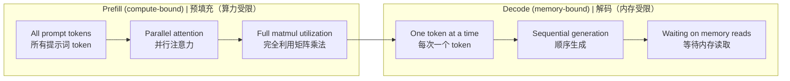
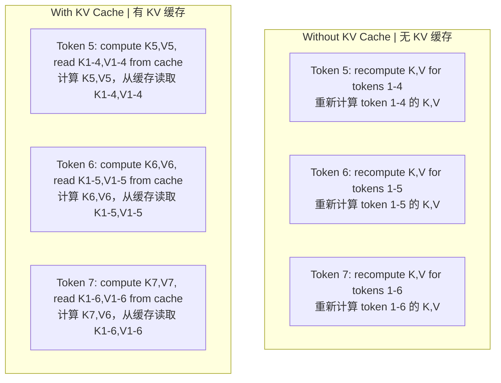
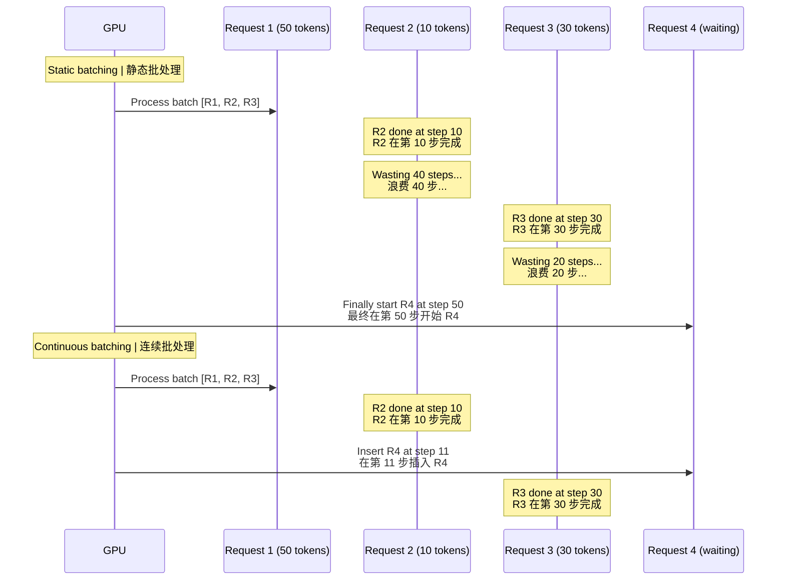
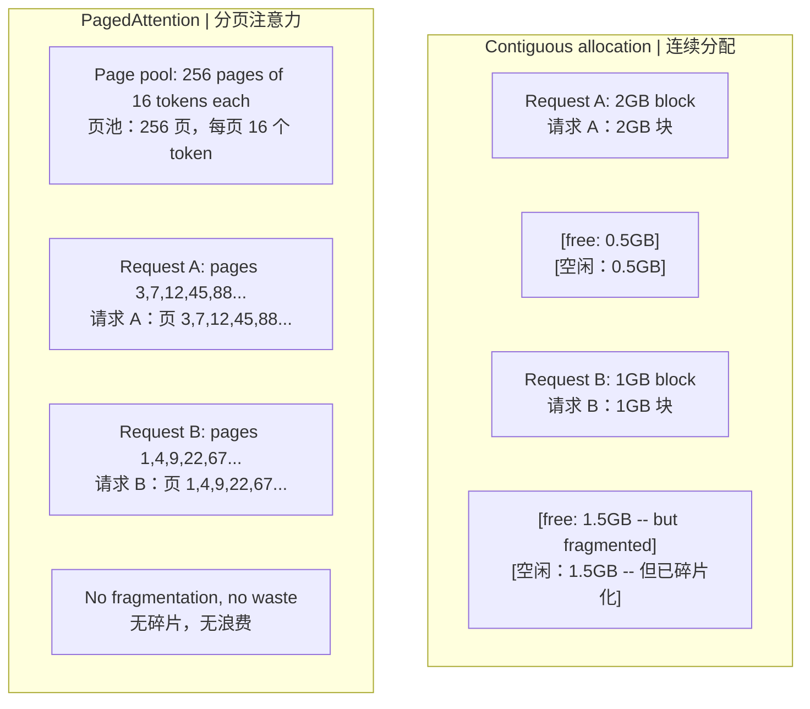
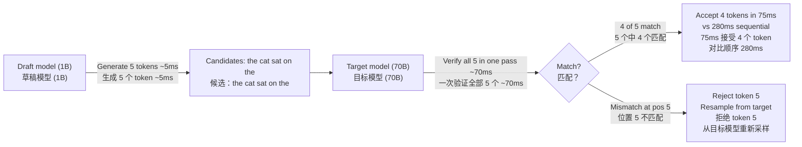

# Inference Optimization | 推理优化

> **推理的两阶段：** Prefill（预填充）阶段并行处理你的提示词——受算力约束。Decode（解码）阶段逐 token 生成——受内存带宽约束。每一项优化都针对其中之一或两者。

**类型：** 构建（Build）
**语言：** Python
**前置要求：** 阶段 10，课程 01-08（Transformer 架构、注意力机制）
**时间：** ~120 分钟

## Learning Objectives | 学习目标

- 实现 KV-cache，以消除自回归 token 生成过程中的冗余计算
- 解释 LLM 推理的 prefill 与 decode 阶段，以及为何两者存在不同的瓶颈（算力受限 vs 内存带宽受限）
- 实现连续批处理（Continuous Batching）和 PagedAttention 概念，以在并发请求下最大化 GPU 利用率
- 比较推理优化技术（KV-cache、推测解码、Flash Attention）及其吞吐量/延迟权衡

## The Problem | 问题

你将 Llama 3 70B 部署在 4×A100 GPU 上。单个用户获得约 50 tokens/秒，感觉很快。然而当 100 个用户同时访问时，吞吐量骤降至 3 tokens/秒/用户。你每月 $25,000 的 GPU 账单正以比人类打字还慢的速度提供服务。

模型本身在 1 个用户和 100 个用户之间没有变化——相同的权重、相同的架构、相同的数学计算。改变的是你调度工作的方式。朴素的推理浪费了 90% 以上的可用 GPU 算力。一个等待第 47 个 token 的用户占用着整个批处理槽位，而 GPU 内存总线在矩阵乘法之间空闲。与此同时，一个新用户的 2,000 token 提示词本可以用这些空闲时间做有用的计算。

这不是缩放问题，而是调度问题。本课程中介绍的技术——KV 缓存、连续批处理、PagedAttention、推测解码、前缀缓存——正是将每月 $25k 的推理账单降低到每月 $5k 的关键所在。

vLLM 在 4×A100-80GB 上部署 Llama 3 70B，低并发时达到约 50 tokens/秒/用户，并在 100 个并发请求下通过连续批处理和 PagedAttention 保持 15-25 TPS/用户。没有这些优化，相同的硬件在此并发下的吞吐量只有 5 TPS/用户。同样的 GPU，同样的模型，吞吐量提升了 4 倍。

## The Concept | 概念

### Prefill vs Decode | 预填充与解码

每个 LLM 推理请求都有两个不同的阶段。

**Prefill（预填充）** 处理整个输入提示词。所有 token 都是已知的，因此注意力计算可以在整个序列上并行执行。这是一个大规模矩阵乘法——GPU 核心保持忙碌。瓶颈是算力：你的硬件每秒能提供多少 FLOPS。一块 A100 提供 312 TFLOPS（BF16）。对于 70B 模型的 4,096 token 提示词，Prefill 在单块 A100 上需要约 400ms。

**Decode（解码）** 逐 token 生成输出。每个新 token 都关注之前的所有 token，但每次前向传播只产生一个 token。权重矩阵的大小与 prefill 时相同，但你是在用一个向量而非矩阵乘以它们。GPU 核心在微秒级别完成计算，然后等待下一批权重从内存中到达。瓶颈是内存带宽：你能以多快的速度将模型权重从 HBM 流式传输到计算单元。A100 的带宽为 2 TB/s。FP16 的 70B 模型大小为 140 GB。完整读取模型一次需要 70ms——这就是单步解码的时间下限。


```mermaid
graph LR
    subgraph "Prefill (compute-bound) | 预填充（算力受限）"
        P1["All prompt tokens<br/>所有提示词 token"] --> P2["Parallel attention<br/>并行注意力"]
        P2 --> P3["Full matmul utilization<br/>完全利用矩阵乘法"]
    end

    subgraph "Decode (memory-bound) | 解码（内存受限）"
        D1["One token at a time<br/>每次一个 token"] --> D2["Sequential generation<br/>顺序生成"]
        D2 --> D3["Waiting on memory reads<br/>等待内存读取"]
    end

    P3 --> D1
```

**运算字节比**（也称算术强度）体现了这一权衡。它衡量的是每从内存加载一个字节，你能执行多少次运算。

```
ops:byte ratio = FLOPs per token / bytes read from memory
运算字节比 = 每 token 的 FLOPs / 从内存读取的字节数
```

在 prefill 阶段使用 4,096 token 的批处理时，每个加载的权重执行约 4,096 次乘加运算。比率很高——你受算力约束。在 decode 阶段使用批大小 1 时，每个加载的权重执行约 1 次运算。比率很低——你受内存带宽约束。

核心洞察：*decode 受内存约束，因为你要读取整个模型来生成一个 token*。下面每一项优化要么减少读取量，要么增加每次读取处理的 token 批量，要么完全避免读取。

### KV Cache | KV 缓存

在注意力计算过程中，每个 token 的 query 需要关注所有先前 token 的 key 和 value 向量。如果没有缓存，生成第 N 个 token 需要重新计算所有前 N-1 个 token 的 key 和 value 投影。Token 1 在生成 token 2 时被投影，然后在 token 3 时再次投影，在 token 4 时再次投影。到 token 1,000 时，token 1 已经被投影了 999 次。

KV 缓存存储了所有先前 token 的 key 和 value 投影。在生成第 N 个 token 时，你只需计算 token N 的 key 和 value，然后将它们与缓存的 token 1 到 N-1 的 K/V 连接起来。


```mermaid
graph TD
    subgraph "Without KV Cache | 无 KV 缓存"
        A1["Token 5: recompute K,V for tokens 1-4<br/>重新计算 token 1-4 的 K,V"]
        A2["Token 6: recompute K,V for tokens 1-5<br/>重新计算 token 1-5 的 K,V"]
        A3["Token 7: recompute K,V for tokens 1-6<br/>重新计算 token 1-6 的 K,V"]
    end

    subgraph "With KV Cache | 有 KV 缓存"
        B1["Token 5: compute K5,V5, read K1-4,V1-4 from cache<br/>计算 K5,V5，从缓存读取 K1-4,V1-4"]
        B2["Token 6: compute K6,V6, read K1-5,V1-5 from cache<br/>计算 K6,V6，从缓存读取 K1-5,V1-5"]
        B3["Token 7: compute K7,V7, read K1-6,V1-6 from cache<br/>计算 K7,V6，从缓存读取 K1-6,V1-6"]
    end
```

**KV 缓存内存公式：**

```
KV cache size = 2 * num_layers * num_kv_heads * head_dim * seq_len * bytes_per_param
KV 缓存大小 = 2 * 层数 * KV 头数 * 头维度 * 序列长度 * 每参数字节数
```

对于 Llama 3 70B（80 层，GQA 的 8 个 KV 头，head_dim=128，BF16）：

```
per token: 2 * 80 * 8 * 128 * 2 bytes = 327,680 bytes = 320 KB
at 4,096 tokens: 320 KB * 4,096 = 1.28 GB
at 128K tokens: 320 KB * 131,072 = 40 GB
```

Llama 3 70B 的单次 128K 上下文对话消耗 40 GB KV 缓存——相当于一块 A100 一半的内存。100 个并发用户各使用 4K token 时，仅 KV 缓存就需要 128 GB。这就是为什么 KV 缓存管理是推理优化的核心挑战。

### Continuous Batching | 连续批处理

静态批处理等待一批 N 个请求到达，将它们一起处理，然后等待*所有*请求完成后再接受新请求。如果一个请求需要 500 个 token，另一个只需要 10 个 token，短请求完成后的 490 个解码步骤都处于空闲状态。

连续批处理（也称为迭代级批处理）在有请求完成时立即将新请求插入批处理中。批处理在每个解码步骤都会重新评估。一个在 10 个 token 后完成的请求会立即被一个等待中的请求替换。


```mermaid
sequenceDiagram
    participant GPU
    participant R1 as Request 1 (50 tokens)
    participant R2 as Request 2 (10 tokens)
    participant R3 as Request 3 (30 tokens)
    participant R4 as Request 4 (waiting)

    Note over GPU: Static batching | 静态批处理
    GPU->>R1: Process batch [R1, R2, R3]
    Note over R2: R2 done at step 10<br/>R2 在第 10 步完成
    Note over R2: Wasting 40 steps...<br/>浪费 40 步...
    Note over R3: R3 done at step 30<br/>R3 在第 30 步完成
    Note over R3: Wasting 20 steps...<br/>浪费 20 步...
    GPU->>R4: Finally start R4 at step 50<br/>最终在第 50 步开始 R4

    Note over GPU: Continuous batching | 连续批处理
    GPU->>R1: Process batch [R1, R2, R3]
    Note over R2: R2 done at step 10<br/>R2 在第 10 步完成
    GPU->>R4: Insert R4 at step 11<br/>在第 11 步插入 R4
    Note over R3: R3 done at step 30<br/>R3 在第 30 步完成
```

吞吐量提升取决于输出长度的变化程度。如果长度均匀，连续批处理与静态批处理性能相当。如果长度可变（常见情况），连续批处理可将吞吐量提高 2-5 倍，因为 GPU 槽位永远不会空闲。

### PagedAttention | 分页注意力

每个请求的 KV 缓存是一个连续的内存块。随着请求的到达和离开，内存会产生碎片——就像操作系统中的 RAM 碎片一样。一个 4K token 的请求需要 1.28 GB 的连续内存。即使你总共有 2 GB 空闲内存，也可能没有 1.28 GB 的*连续*空间。你要么浪费内存，要么拒绝请求。

PagedAttention（来自 vLLM）将操作系统风格的虚拟内存应用于 KV 缓存。它不是为每个请求分配一个连续块，而是分配固定大小的"页"（通常每页 16 个 token）。这些页可以分布在 GPU 物理内存的任意位置。页表将每个请求的逻辑序列位置映射到物理页位置。


```mermaid
graph TD
    subgraph "Contiguous allocation | 连续分配"
        C1["Request A: 2GB block<br/>请求 A：2GB 块"]
        C2["[free: 0.5GB]<br/>[空闲：0.5GB]"]
        C3["Request B: 1GB block<br/>请求 B：1GB 块"]
        C4["[free: 1.5GB -- but fragmented]<br/>[空闲：1.5GB -- 但已碎片化]"]
    end

    subgraph "PagedAttention | 分页注意力"
        P1["Page pool: 256 pages of 16 tokens each<br/>页池：256 页，每页 16 个 token"]
        P2["Request A: pages 3,7,12,45,88...<br/>请求 A：页 3,7,12,45,88..."]
        P3["Request B: pages 1,4,9,22,67...<br/>请求 B：页 1,4,9,22,67..."]
        P4["No fragmentation, no waste<br/>无碎片，无浪费"]
    end
```

PagedAttention 还支持共享前缀的**写时复制**。如果 50 个请求共享相同的系统提示词，该提示词的 KV 缓存页只存储一次，所有 50 个请求共享引用。只有当某个请求的内容出现分叉（不同的用户消息）时，它才会获得自己的页。这极大地减少了使用共享系统提示词的应用的内存占用。

vLLM 通过 PagedAttention 实现了接近零的内存浪费（约 4%，而朴素分配为约 60-80%）。

### Speculative Decoding | 推测解码

Decode 之所以慢，是因为它是顺序的——你生成一个 token，将其反馈回去，再生成下一个。但如果你能廉价地猜出接下来的 5 个 token，然后一次性验证它们呢？

推测解码使用一个小型快速的**草稿模型**生成 K 个候选 token。然后大的**目标模型**在一次前向传播中处理所有 K 个候选（这看起来像 prefill——并行、算力受限、高效）。如果目标模型同意草稿模型的预测，你就可以在一次目标前向传播的时间内接受所有 K 个 token。如果它在位置 j 处不同意，你接受第 1 到 j-1 个 token 并丢弃其余部分。


```mermaid
graph LR
    D["Draft model (1B)<br/>草稿模型 (1B)"] -->|"Generate 5 tokens ~5ms<br/>生成 5 个 token ~5ms"| C["Candidates: the cat sat on the<br/>候选：the cat sat on the"]
    C --> T["Target model (70B)<br/>目标模型 (70B)"]
    T -->|"Verify all 5 in one pass ~70ms<br/>一次验证全部 5 个 ~70ms"| V{"Match?<br/>匹配？"}
    V -->|"4 of 5 match<br/>5 个中 4 个匹配"| A["Accept 4 tokens in 75ms<br/>vs 280ms sequential<br/>75ms 接受 4 个 token<br/>对比顺序 280ms"]
    V -->|"Mismatch at pos 5<br/>位置 5 不匹配"| R["Reject token 5<br/>Resample from target<br/>拒绝 token 5<br/>从目标模型重新采样"]
```

加速取决于**接受率**——草稿模型的预测与目标模型匹配的频率。对于 Llama 3 8B 为 Llama 3 70B 起草的情况，在自然语言上典型接受率为 70-85%。这相当于 2-3 倍的解码加速。

推测解码的三种方法：

| 方法 | 草稿来源 | 接受率 | 额外开销 |
|------|---------|--------|---------|
| Draft-target (Leviathan 等) | 独立小模型 | 70-85% | 草稿模型内存 |
| EAGLE (Li 等) | 目标模型上的轻量级头 | 75-90% | 约 1% 额外参数 |
| N-gram 查找 | Token n-gram 表 | 40-60% | 可忽略 |

**EAGLE** 在目标模型的隐藏状态之上训练一个小型的自回归头。它利用目标模型倒数第二层的特征来预测下一个 token 的嵌入。由于它在目标模型自身的表示（而非独立模型的表示）上运行，因此能以最小的额外内存获得更高的接受率。EAGLE-2 增加了动态草稿树，根据上下文调整候选数量。

**N-gram 推测解码**维护一个 n-gram 延续表，内容来自当前上下文或预构建的语料库。如果草稿与同一对话中之前出现的内容匹配（重复模式、代码、结构化输出），它以零神经网络开销运行。平均接受率较低，但每次推测的成本几乎为零。

推测解码在*数学上是精确的*——输出分布与目标模型的分布完全相同。它不是近似方法。验证步骤确保每个被接受的 token 恰好具有目标模型本应赋予的概率。

### Prefix Caching | 前缀缓存

许多请求共享相同的前缀——聊天机器人的系统提示词、RAG 上下文块、少样本示例集。如果没有前缀缓存，每个请求都会从头计算这些共享 token 的 KV 缓存。

前缀缓存存储常用前缀的 KV 缓存，并在请求之间重用。当新请求到达且其前缀已知时，系统复制（或引用）缓存的 KV 条目，仅计算唯一后缀部分的 KV。

对于一个所有请求共享的 2,000 token 系统提示词，前缀缓存为每个请求消除了约 400ms 的 prefill 时间。在 100 个请求/秒的情况下，这每秒节省了 40 秒的 GPU 算力——超过了一块 GPU 的工作量。

SGLang 的 RadixAttention 使用基数树（trie）实现了前缀缓存，按 token 内容索引前缀。任何与存储前缀匹配的请求都可以免费获得其 KV 缓存。该树支持部分前缀匹配——如果你与缓存条目共享 2,000 个前缀 token 中的 1,500 个，你重用这 1,500 个并只重新计算 500 个。

### Inference Engines | 推理引擎

三种引擎主导着生产级 LLM 服务：

| 引擎 | 关键创新 | 最适合 |
|------|---------|--------|
| vLLM | PagedAttention、连续批处理 | 通用服务，最高兼容性 |
| SGLang | RadixAttention（前缀缓存）、结构化生成 | 多轮聊天、受约束解码 |
| TensorRT-LLM | NVIDIA 内核融合、FP8 量化 | NVIDIA 硬件上的单 GPU 最大吞吐量 |

**vLLM** 是默认的起点。它支持最广泛的模型，可在任何 GPU 供应商（NVIDIA、AMD、Intel）上运行，并通过 PagedAttention + 连续批处理实现强大的吞吐量。兼容 OpenAI 的 API 意味着你可以将其直接替换为任何 OpenAI API 调用。

**SGLang** 建立在与 vLLM 相同的基础之上，但增加了 RadixAttention 用于前缀缓存和一种用于结构化 LLM 程序的领域特定语言。如果你的工作负载涉及多轮对话、工具使用或受约束解码（JSON 输出、正则表达式引导的生成），SGLang 通常通过前缀重用比 vLLM 快 2-5 倍。

**TensorRT-LLM** 将模型编译为优化的 NVIDIA GPU 内核。它融合操作（注意力 + 线性 + 激活在一个内核中），在 H100 GPU 上使用 FP8，并与 NVIDIA Triton 推理服务器集成用于生产部署。它在 NVIDIA 硬件上实现了最高的单 GPU 吞吐量，但需要更多的设置工作且仅适用于 NVIDIA GPU。

Llama 3 70B（4×A100-80GB，BF16）的实际数据：

| 指标 | vLLM | SGLang | TensorRT-LLM |
|------|------|--------|---------------|
| 吞吐量（1 用户） | ~50 TPS | ~55 TPS | ~65 TPS |
| 吞吐量（100 用户） | ~2,500 总 TPS | ~3,200 总 TPS | ~3,000 总 TPS |
| 首次 token 时间 | ~400ms | ~300ms（前缀命中） | ~350ms |
| 最大上下文 | 128K | 128K | 128K |

### The Ops:Byte Framework | 运算字节比框架

你无法优化你无法衡量的东西。运算字节比告诉你当前是受算力约束还是受内存约束，这决定了哪些优化是有效的。

```
Compute roof: peak FLOPS of the GPU
算力天花板：GPU 的峰值 FLOPS
Memory roof:  peak bandwidth * ops:byte ratio
内存天花板：峰值带宽 × 运算字节比
```

如果实际 FLOPS 小于 `min(compute_roof, memory_roof)`，你可以通过更好的内核利用或更大的批处理来提升。一旦命中了天花板，你唯一的选择就是改变运算字节比——通常通过量化（减少每字节的 FLOPs 需求，因为权重更小）或通过增加批处理大小（如连续批处理那样每加载一个权重做更多工作）。

### Why This Works | 为何有效

如果你正在构建推理基础设施，这里展示的技术可以为你带来竞争优势：

- **KV 缓存**消除了生成过程中所有冗余的注意力重计算，将计算复杂度从 O(N²) 降低到 O(N)
- **连续批处理**确保没有 GPU 资源在请求之间处于空闲状态，将利用率从 30% 以下提升到 90% 以上
- **PagedAttention** 解决了 KV 缓存的内存碎片问题，使你的 GPU 可以处理 2-4 倍数量的并发请求而无需增加硬件
- **推测解码**通过批量验证将昂贵的顺序解码步骤转换为高效的并行 prefill 步骤
- **前缀缓存**消除了跨请求共享内容的冗余 prefill，将首 token 延迟降低 40-60%

这些技术协同作用。PagedAttention 使连续批处理在大批量下可行（内存不会碎片化）。连续批处理使前缀缓存更有价值（更多请求同时使用相同的系统提示词）。推理引擎将它们整合为一个可部署的系统。

## Build It | 动手构建

### 步骤 1：KV 缓存注意力

一个实现 KV 缓存的因果自注意力模块。

```python
import numpy as np


class KVCacheAttention:
    def __init__(self, d_model, num_heads, num_kv_heads=None):
        self.d_model = d_model
        self.num_heads = num_heads
        self.num_kv_heads = num_kv_heads or num_heads
        self.head_dim = d_model // num_heads

        assert self.num_heads % self.num_kv_heads == 0, \
            "Query heads must be divisible by KV heads (GQA)"
        self.num_query_groups = self.num_heads // self.num_kv_heads

        scale = 1.0 / np.sqrt(self.head_dim)
        self.W_q = np.random.randn(d_model, num_heads * self.head_dim) * scale
        self.W_k = np.random.randn(d_model, self.num_kv_heads * self.head_dim) * scale
        self.W_v = np.random.randn(d_model, self.num_kv_heads * self.head_dim) * scale
        self.W_o = np.random.randn(num_heads * self.head_dim, d_model) * scale

        self.k_cache = None
        self.v_cache = None

    def _split_heads(self, x, num_heads):
        batch, seq, _ = x.shape
        x = x.reshape(batch, seq, num_heads, self.head_dim)
        return x.transpose(0, 2, 1, 3)

    def forward(self, x, use_cache=True, past_seq_len=0):
        batch, seq, _ = x.shape

        q = self._split_heads(x @ self.W_q, self.num_heads)
        k = self._split_heads(x @ self.W_k, self.num_kv_heads)
        v = self._split_heads(x @ self.W_v, self.num_kv_heads)

        if use_cache and self.k_cache is not None:
            k = np.concatenate([self.k_cache, k], axis=2)
            v = np.concatenate([self.v_cache, v], axis=2)

        if use_cache:
            self.k_cache = k
            self.v_cache = v

        if self.num_kv_heads < self.num_heads:
            k = np.repeat(k, self.num_query_groups, axis=1)
            v = np.repeat(v, self.num_query_groups, axis=1)

        scores = (q @ k.transpose(0, 1, 3, 2)) / np.sqrt(self.head_dim)

        causal_mask = np.triu(np.ones((seq, k.shape[2])), k=1 + past_seq_len)
        scores = np.where(causal_mask, -1e9, scores)

        attn = np.exp(scores - np.max(scores, axis=-1, keepdims=True))
        attn = attn / np.sum(attn, axis=-1, keepdims=True)

        out = attn @ v
        out = out.transpose(0, 2, 1, 3).reshape(batch, seq, -1)
        return out @ self.W_o

    def reset_cache(self):
        self.k_cache = None
        self.v_cache = None
```

### 步骤 2：推理延迟模拟器

一个度量 prefill 与 decode 步骤级延迟的推理模拟器。

```python
class InferenceSimulator:
    def __init__(self, model_config, hardware_config):
        self.model = model_config
        self.hardware = hardware_config

    def prefill_latency(self, prompt_tokens):
        flops_needed = prompt_tokens * self.model["flops_per_token"]
        compute_time = flops_needed / self.hardware["peak_fp16_flops"]
        memory_time = (self.model["param_bytes"] /
                       self.hardware["memory_bandwidth"])
        return max(compute_time, memory_time)

    def decode_latency(self, batch_size):
        flops_needed = 2 * self.model["flops_per_token"] * batch_size
        compute_time = flops_needed / self.hardware["peak_fp16_flops"]
        memory_time = (self.model["param_bytes"] /
                       self.hardware["memory_bandwidth"])
        return max(compute_time, memory_time)

    def simulate_request(self, prompt_len=4096, output_len=256, batch_size=1):
        prefill = self.prefill_latency(prompt_len)
        decode = self.decode_latency(batch_size)
        total = prefill + decode * output_len
        return {
            "prefill_latency": prefill,
            "per_decode_latency": decode,
            "total_latency": total,
            "tokens_per_second": output_len / total,
        }
```

### 步骤 3：连续批处理调度器

一个模拟静态与连续批处理并比较吞吐量的调度器。

```python
import numpy as np
from collections import deque


class Request:
    def __init__(self, request_id, output_tokens):
        self.id = request_id
        self.remaining = output_tokens
        self.completed = False

    def step(self):
        self.remaining -= 1
        if self.remaining <= 0:
            self.completed = True


class StaticBatcher:
    def __init__(self, batch_size):
        self.batch_size = batch_size
        self.pending = deque()
        self.active = []
        self.completed_requests = []
        self.total_steps = 0

    def add_request(self, request):
        self.pending.append(request)

    def step(self):
        if not self.active:
            batch = []
            while len(batch) < self.batch_size and self.pending:
                batch.append(self.pending.popleft())
            self.active = batch

        for req in self.active:
            req.step()

        self.active = [r for r in self.active if not r.completed]

        for req in self.active:
            pass
        self.total_steps += 1

    def all_done(self):
        return len(self.active) == 0 and len(self.pending) == 0


class ContinuousBatcher:
    def __init__(self, batch_size):
        self.batch_size = batch_size
        self.pending = deque()
        self.active = []
        self.total_steps = 0

    def add_request(self, request):
        self.pending.append(request)

    def step(self):
        slots_open = self.batch_size - len(self.active)
        while slots_open > 0 and self.pending:
            self.active.append(self.pending.popleft())
            slots_open -= 1

        for req in self.active:
            req.step()

        self.active = [r for r in self.active if not r.completed]
        self.total_steps += 1

    def all_done(self):
        return len(self.active) == 0 and len(self.pending) == 0


def compare_batching_strategies(num_requests=50, batch_size=8, max_tokens=256):
    np.random.seed(42)
    output_lengths = np.random.pareto(1.5, num_requests) * 20 + 5
    output_lengths = np.clip(output_lengths, 1, max_tokens).astype(int)

    static = StaticBatcher(batch_size)
    continuous = ContinuousBatcher(batch_size)

    for i in range(num_requests):
        static.add_request(Request(i, output_lengths[i]))
        continuous.add_request(Request(i, output_lengths[i]))

    while not static.all_done():
        static.step()

    while not continuous.all_done():
        continuous.step()

    return {
        "static_steps": static.total_steps,
        "continuous_steps": continuous.total_steps,
        "speedup": static.total_steps / continuous.total_steps
    }
```

### 步骤 4：前缀缓存

一个基于字典树的前缀缓存，用于存储共享前缀的 KV 条目。

```python
class TrieNode:
    def __init__(self):
        self.children = {}
        self.kv_data = None
        self.hit_count = 0


class PrefixCache:
    def __init__(self, max_entries=1000):
        self.root = TrieNode()
        self.max_entries = max_entries
        self.total_entries = 0
        self.hits = 0
        self.misses = 0

    def _walk(self, token_ids):
        node = self.root
        depth = 0
        for tid in token_ids:
            if tid not in node.children:
                break
            node = node.children[tid]
            depth += 1
        return node, depth

    def lookup(self, token_ids):
        node, depth = self._walk(token_ids)
        if depth > 0:
            self.hits += 1
            current = self.root
            for tid in token_ids[:depth]:
                current = current.children[tid]
                current.hit_count += 1
            kv_entries = []
            current = self.root
            for tid in token_ids[:depth]:
                current = current.children[tid]
                if current.kv_data is not None:
                    kv_entries.append(current.kv_data)
            return depth, kv_entries
        self.misses += 1
        return 0, []

    def insert(self, token_ids, kv_per_token):
        node = self.root
        for i, tid in enumerate(token_ids):
            if tid not in node.children:
                if self.total_entries >= self.max_entries:
                    return i
                node.children[tid] = TrieNode()
                self.total_entries += 1
            node = node.children[tid]
            if i < len(kv_per_token):
                node.kv_data = kv_per_token[i]
        return len(token_ids)

    def hit_rate(self):
        total = self.hits + self.misses
        return self.hits / total if total > 0 else 0.0
```

### 步骤 5：推测解码模拟器

我们模拟草稿-目标推测解码，支持可配置的接受率。

```python
class DraftModel:
    def __init__(self, vocab_size, acceptance_rate=0.8):
        self.vocab_size = vocab_size
        self.acceptance_rate = acceptance_rate

    def generate(self, context, num_tokens):
        tokens = np.random.randint(0, self.vocab_size, size=num_tokens)
        return tokens

    def get_probs(self, context, token):
        probs = np.random.dirichlet(np.ones(self.vocab_size))
        return probs


class TargetModel:
    def __init__(self, vocab_size):
        self.vocab_size = vocab_size

    def get_probs(self, context, tokens=None):
        if tokens is not None:
            return [np.random.dirichlet(np.ones(self.vocab_size)) for _ in tokens]
        return np.random.dirichlet(np.ones(self.vocab_size))


def speculative_decode(draft_model, target_model, context, num_speculative=5,
                       draft_cost=1.0, target_cost=10.0, verify_cost=12.0):
    total_tokens = 0
    total_cost = 0.0
    accepted_counts = []
    context = list(context)

    max_tokens = 100

    while total_tokens < max_tokens:
        draft_tokens = draft_model.generate(context, num_speculative)
        total_cost += draft_cost * num_speculative

        target_probs = target_model.get_probs(context, draft_tokens)
        total_cost += verify_cost

        accepted = 0
        for i, token in enumerate(draft_tokens):
            draft_p = draft_model.get_probs(context + list(draft_tokens[:i]), token)
            target_p = target_probs[i]

            r = np.random.random()
            acceptance_prob = min(1.0, target_p[token] / (draft_p[token] + 1e-10))

            if r < draft_model.acceptance_rate:
                accepted += 1
                context.append(token)
                total_tokens += 1
            else:
                new_token = np.random.choice(draft_model.vocab_size, p=target_p)
                context.append(new_token)
                total_tokens += 1
                break

        accepted_counts.append(accepted)

        if accepted == num_speculative:
            bonus_probs = target_model.get_probs(context)
            bonus_token = np.random.choice(draft_model.vocab_size, p=bonus_probs)
            context.append(bonus_token)
            total_tokens += 1

    sequential_cost = total_tokens * target_cost
    return {
        "total_tokens": total_tokens,
        "speculative_cost": total_cost,
        "sequential_cost": sequential_cost,
        "speedup": sequential_cost / total_cost if total_cost > 0 else 1.0,
        "avg_accepted": np.mean(accepted_counts),
        "acceptance_rate": np.mean(accepted_counts) / num_speculative,
    }


def compare_speculation_strategies(vocab_size=1000, num_trials=20):
    results = {}

    for name, acceptance_rate, spec_tokens in [
        ("Draft-target (8B->70B)", 0.78, 5),
        ("EAGLE", 0.85, 6),
        ("N-gram", 0.50, 4),
        ("No speculation", 0.0, 0),
    ]:
        if spec_tokens == 0:
            results[name] = {
                "speedup": 1.0,
                "acceptance_rate": 0.0,
                "avg_accepted": 0.0,
            }
            continue

        trial_results = []
        for _ in range(num_trials):
            draft = DraftModel(vocab_size, acceptance_rate=acceptance_rate)
            target = TargetModel(vocab_size)
            context = list(np.random.randint(0, vocab_size, size=10))
            result = speculative_decode(draft, target, context, num_speculative=spec_tokens)
            trial_results.append(result)

        results[name] = {
            "speedup": np.mean([r["speedup"] for r in trial_results]),
            "acceptance_rate": np.mean([r["acceptance_rate"] for r in trial_results]),
            "avg_accepted": np.mean([r["avg_accepted"] for r in trial_results]),
        }

    return results
```

### 步骤 6：KV 缓存内存分析器

计算真实模型配置下的 KV 缓存内存需求。

```python
MODEL_CONFIGS = {
    "Llama-3-8B": {
        "num_layers": 32, "num_kv_heads": 8, "head_dim": 128,
        "model_params_b": 8, "gqa": True,
    },
    "Llama-3-70B": {
        "num_layers": 80, "num_kv_heads": 8, "head_dim": 128,
        "model_params_b": 70, "gqa": True,
    },
    "Llama-3-405B": {
        "num_layers": 126, "num_kv_heads": 8, "head_dim": 128,
        "model_params_b": 405, "gqa": True,
    },
    "Mistral-7B": {
        "num_layers": 32, "num_kv_heads": 8, "head_dim": 128,
        "model_params_b": 7, "gqa": True,
    },
    "GPT-4-est": {
        "num_layers": 120, "num_kv_heads": 96, "head_dim": 128,
        "model_params_b": 1800, "gqa": False,
    },
}


def kv_cache_memory(config, seq_len, dtype_bytes=2):
    per_token = 2 * config["num_layers"] * config["num_kv_heads"] * config["head_dim"] * dtype_bytes
    total = per_token * seq_len
    return {
        "per_token_bytes": per_token,
        "per_token_kb": per_token / 1024,
        "total_bytes": total,
        "total_mb": total / (1024 ** 2),
        "total_gb": total / (1024 ** 3),
    }


def memory_budget(config, gpu_memory_gb, model_dtype_bytes=2, kv_dtype_bytes=2):
    model_memory_gb = config["model_params_b"] * 1e9 * model_dtype_bytes / (1024 ** 3)
    overhead_gb = gpu_memory_gb * 0.1
    available_for_kv = gpu_memory_gb - model_memory_gb - overhead_gb

    if available_for_kv <= 0:
        return {"error": "模型无法装入 GPU 内存", "model_memory_gb": model_memory_gb}

    per_token = 2 * config["num_layers"] * config["num_kv_heads"] * config["head_dim"] * kv_dtype_bytes
    max_tokens = int(available_for_kv * (1024 ** 3) / per_token)

    return {
        "gpu_memory_gb": gpu_memory_gb,
        "model_memory_gb": round(model_memory_gb, 1),
        "overhead_gb": round(overhead_gb, 1),
        "available_for_kv_gb": round(available_for_kv, 1),
        "max_total_tokens": max_tokens,
        "max_users_at_2k": max_tokens // 2048,
        "max_users_at_4k": max_tokens // 4096,
        "max_users_at_32k": max_tokens // 32768,
    }
```

## Use It | 使用方式

使用 vLLM：

```python
from vllm import LLM, SamplingParams

llm = LLM(
    model="meta-llama/Llama-3-70B-Instruct",
    tensor_parallel_size=4,
    enable_prefix_caching=True,
    max_model_len=8192,
    gpu_memory_utilization=0.9,
)

params = SamplingParams(temperature=0.7, max_tokens=256)
outputs = llm.generate(["Explain inference optimization in one paragraph."], params)
```

使用 SGLang 实现前缀缓存 + 结构化输出：

```python
import sglang as sgl

@sgl.function
def classify(s, text):
    s += sgl.system("You are a classifier. Output JSON only.")
    s += sgl.user(f"Classify this text: {text}")
    s += sgl.assistant(sgl.gen("result", regex=r'\{"label": "(positive|negative|neutral)"\}'))

runtime = sgl.Runtime(model_path="meta-llama/Llama-3-70B-Instruct", tp_size=4)
sgl.set_default_backend(runtime)

results = classify.run_batch([
    {"text": "This product is amazing!"},
    {"text": "Terrible experience."},
    {"text": "It was okay I guess."},
])
```

使用 TensorRT-LLM：

```python
import tensorrt_llm
from tensorrt_llm.runtime import ModelRunner

runner = ModelRunner.from_dir("./llama-70b-trt-engine/", rank=0)

outputs = runner.generate(
    batch_input_ids=[tokenizer.encode("Explain KV caching.")],
    max_new_tokens=256,
    temperature=0.7,
)
```

## Ship It | 交付成果

本课程产出：
- `outputs/skill-inference-optimization.md` —— 用于诊断和优化 LLM 推理服务的技能

## Exercises | 练习

1. 修改 KV 缓存分析器，比较 FP16、FP8 和 INT4 KV 缓存量化。对于 Llama 3 70B 在 4K 上下文下，计算每种方案在 4×A100-80GB 上的最大并发用户数。KV 量化为 INT4 应大致将用户容量提升 4 倍。

2. 扩展连续批处理模拟器以跟踪 GPU 利用率（每步批处理槽位填充比例）。绘制 50 个请求在静态和连续批处理下的利用率随时间变化的图表，输出长度服从帕累托分布（shape=1.5, scale=20）。连续批处理应保持 80% 以上的利用率。

3. 实现 KV 缓存的分组查询注意力（GQA）版本，其中 `num_kv_heads < num_query_heads`。Llama 3 70B 使用 64 个查询头但只有 8 个 KV 头。计算相对于完整多头注意力的内存节省（KV 缓存大小减少 8 倍）。

4. 构建一个使用 LRU 淘汰策略的前缀缓存。设置 max_entries 为 500，生成 1,000 个请求，其中 60% 共享 5 个公共前缀之一。测量命中率并与无限制缓存进行比较。好的淘汰策略下，命中率应保持在 55% 以上。

5. 扩展推测解码模拟器以实现基于树的推测（EAGLE-2 风格）。生成一个候选树（例如，3 层每层 2 个分支 = 8 个叶子候选），而不是单一链的 K 个草稿 token。比较每轮验证接受的总 token 数与线性推测的差异。

## Key Terms | 关键术语

| 术语 | 通常说法 | 实际含义 |
|------|---------|---------|
| Prefill（预填充） | "处理提示词" | 对所有输入 token 并行计算注意力——受算力约束，因为完整的矩阵乘法让 GPU 核心保持忙碌 |
| Decode（解码） | "生成 token" | 每次前向传播生成一个 token，每次读取完整的模型权重——受内存约束，因为计算在下一批权重到达之前已经完成 |
| KV cache（KV 缓存） | "缓存注意力状态" | 存储所有先前 token 的 key 和 value 投影，避免在每个解码步骤重新计算——用内存换算力 |
| Continuous batching（连续批处理） | "动态批处理" | 有请求完成时立即将新请求插入运行中的批处理，在每个解码迭代评估而非等待整个批处理完成 |
| PagedAttention（分页注意力） | "KV 缓存的虚拟内存" | 以固定大小的页而非连续块分配 KV 缓存，消除内存碎片并为共享前缀启用写时复制 |
| Speculative decoding（推测解码） | "起草与验证" | 使用快速草稿模型提议多个 token，然后在一次目标模型前向传播中验证所有 token——数学上精确，2-3 倍加速 |
| EAGLE | "自推测解码" | 一种推测解码变体，在目标模型自身的隐藏状态上训练轻量级头，比独立草稿模型实现更高的接受率 |
| Prefix caching（前缀缓存） | "重用系统提示词 KV" | 存储公共前缀（系统提示词、少样本示例）的已计算 KV 缓存条目，在请求间重用以跳过冗余的 prefill |
| Ops:byte ratio（运算字节比） | "算术强度" | 计算操作数与内存读取字节数之比——决定工作负载是受算力约束（高比率）还是受内存约束（低比率） |
| Time to first token（首 token 时间） | "TTFT" | 从收到请求到产生第一个输出 token 的延迟——对于长提示词主要由 prefill 时间决定 |

## Further Reading | 延伸阅读

- Kwon 等, "Efficient Memory Management for Large Language Model Serving with PagedAttention" (2023) —— 提出分页 KV 缓存管理的 vLLM 论文，现已成为推理服务的行业标准
- Leviathan 等, "Fast Inference from Transformers via Speculative Decoding" (2023) —— 证明草稿-验证推测可产生精确的目标模型分布同时实现 2-3 倍加速的基础论文
- Li 等, "EAGLE: Speculative Sampling Requires Rethinking Feature Uncertainty" (2024) —— 通过在目标模型自身特征上训练头部而非使用独立草稿模型来实现更高的接受率
- Zheng 等, "SGLang: Efficient Execution of Structured Language Model Programs" (2024) —— 引入 RadixAttention 用于前缀缓存以及多调用 LLM 程序的编程模型
- Williams 等, "Roofline: An Insightful Visual Performance Model for Multicore Architectures" (2009) —— 原始的 roofline 论文，形式化了用于分析计算与内存瓶颈的运算字节比框架
