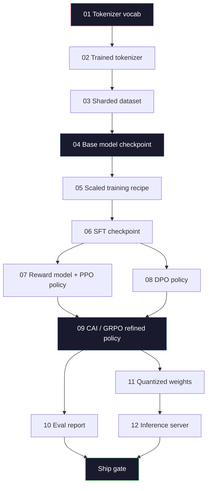
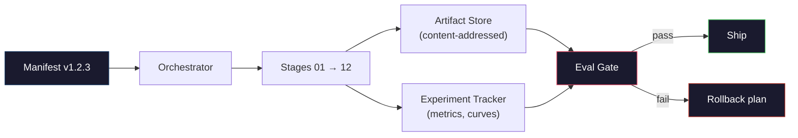

# 完全な LLM パイプラインを構築する

> Lessons 01 から 12 までの内容は、1つの pipeline の各 stage です。このレッスンは、それらの stage を単一の end-to-end run にまとめるための scaffold です。tokenize、pre-train、scale、SFT、align、evaluate、quantize、serve までをつなぎます。laptop で 70B model を train するわけではありません。あなたが作るのは、2026年の frontier team が何を ship するか判断するために使う orchestration layer、manifest、eval gate、rollback plan です。これは capstone です。

**種類:** Build
**言語:** Python (stdlib)
**前提条件:** Phase 10 lessons 01-12 すべて
**所要時間:** 約120分

## 学習目標

- これまでの 11 レッスン (tokenizer、data、pre-training、scaling、SFT、RLHF、DPO、CAI、eval、quantization、inference) を、単一の再現可能な pipeline spec にまとめる
- stage 間の artifact contract を定義する: 各 stage が何を消費し、何を生成し、次の stage が input をどう検証するか
- experiment を追跡し、artifact を hash 化し、eval threshold に基づいて ship decision を gate する orchestrator を構築する
- rollback plan を設計する: どの artifact は安く再実行でき、どれは高価で、corrupted checkpoint がどれほどの cost になるかを明確にする

## 問題

前のレッスンは、それぞれ単体では動きます。Tokenizer は train 済み。Tiny GPT は pre-train 済み。SFT dataset は組み立て済み。Reward model は train 済み。DPO は実行済み。Eval は測定済み。Quantized weights は export 済み。Inference server は起動済み。しかし、それぞれが notebook です。それぞれに独自の convention、独自の output path、独自の seed があります。

frontier training run は notebook ではありません。Llama 3 405B には、およそ 54日間で 3,000万 H100 hours がかかりました。DeepSeek-V3 は約 280万 H800 hours を使いました。その期間中、1つの corrupted checkpoint、1つの data contamination、1つの eval regression が、team に 1週間の wall-clock と 1か月分の GPU budget を失わせることがあります。team がこれを乗り切る方法が pipeline hygiene です。すべての stage に deterministic input、deterministic output、manifest、hash、gate を持たせます。

これが capstone です。laptop で pipeline を end-to-end に走らせるわけではありません。あなたが書くのは、stage を調整する orchestrator、run を記述する manifest、ship decision を gate する verifier、そして第三者が単一ファイルから作業を再実行できる replay plan です。code は小さいですが、discipline は大きいです。

この pattern は 100M から 1T parameters まで変わらず scale します。同じ 4つの component、manifest、orchestrator、eval gate、artifact store が、Llama 3 も hobby GPT も動かします。違いは各 stage の config に入る数字の大きさであり、pipeline の形ではありません。

## コンセプト

### 12個の stage

Phase 10 の各レッスンは stage です。以下が完全な dependency graph です。



Stages 07 と 08 は parallel に実行できます。それ以外はすべて hard dependency です。stage 02 (tokenizer) の変更は、downstream の artifact すべてを invalidate します。stage 10 (eval) の変更は、ship decision だけを invalidate します。

### Manifest

manifest は、run を replay するのに十分な情報を完全に記述する単一ファイルです。pipeline が生成するものは、manifest にない state に依存してはいけません。field は地味ですが必須です。

```
pipeline_version: 1.2.3
seed: 42
git_commit: a1b2c3d4
stages:
  01_tokenizer:
    recipe: bpe_32k
    input_hash: sha256:...
    output_hash: sha256:...
    wall_clock_sec: 3600
    cost_usd: 12
```

stage N の output hash は stage N+1 の input hash です。少しでもずれれば pipeline は halt します。これにより data corruption を早期に検出できます。また、別の大陸にいる teammate が、自分の replay であなたと同じ artifact が生成されたことを検証する方法にもなります。

実務では、小さな YAML schema と、前回の successful run との差分を取る manifest checker を使います。想定される field (cost、wall clock) 以外の delta は red flag です。

### Artifact Typing

各 stage の output は typed artifact です。directory blob でも pickle でもなく、既知の schema を持つ named type です。

| Stage | Artifact Type | Key Fields |
|-------|--------------|-----------|
| 01-02 | Tokenizer | vocab.json, merges.txt, config.json, hash |
| 03 | Dataset | shards[], row count, token count, dedup stats |
| 04-05 | Checkpoint | weights.safetensors, config.json, optimizer state, step count |
| 06 | SFT Model | checkpoint + SFT recipe + data mix |
| 07 | Reward Model | RM checkpoint + preference data hash |
| 08-09 | Policy | checkpoint + reference hash + beta + KL budget consumed |
| 10 | Eval Report | benchmark scores + regression diffs + eval data hash |
| 11 | Quantized Model | quantized weights + calibration data + accuracy delta vs FP16 |
| 12 | Server Spec | endpoint + model hash + config + observability hooks |

typing は最もよくある failure mode を防ぎます。たとえば stage 08 の output を stage 06 の input として使い、DPO-trained model を SFT path に流して ship してしまう事故です。Typed artifacts と typed stage signatures により、この種の error は 5日目の failure ではなく compile-time failure になります。

### Eval Gate

Shipping は「training が終わった」ではありません。Shipping は「training が終わり、eval gate を通過した」です。gate は run 開始前に定義します。

```
gates:
  mmlu:      >= baseline + 0.5   # no regression
  humaneval: >= baseline + 1.0
  truthfulqa: >= baseline         # no drop
  safety_refusal_rate: <= 0.05
  kl_from_reference: <= 25.0
  cost_total_usd: <= 50000
```

すべての gate は numeric threshold です。「looks good」gate はありません。subjective sign-off もありません。すべての gate を通過した場合、artifact は shippable と mark されます。どれか 1つでも fail した場合、run は named reviewer による explicit override 待ちになります。その override 自体も manifest に記録されます。

ほとんどの disaster は 2つの gate で捕捉できます。*regression* gate (new model が core benchmark で previous model 以上であること) は training bug を捕まえます。*KL budget* gate (aligned policy が reference から X 以上 drift していないこと) は alignment の overcooking を捕まえます。production pipeline には必ず両方があります。

### Orchestrator

orchestrator は、manifest を読み、stage を dispatch し、artifact を追跡し、contract violation があれば halt する小さな code です。これは Airflow ではありません。Kubeflow でもありません。pipeline hygiene のためには、自分で書いた退屈なものが望ましいです。

orchestrator の job は narrow です。

1. manifest から DAG を resolve する。
2. 各 stage について、期待される output が正しい hash で既に存在するか確認する (存在するなら skip)。
3. stage を実行し、stdout/stderr を capture し、wall clock と cost を測る。
4. output hash を downstream stage の expected input hash と照合する。
5. failure 時は、exact failing stage を含む partial manifest を書き出し、nonzero で exit する。

これは Python で 200行です。このレッスンの `code/main.py` のような見た目になります。裏側では、実際の pipeline は `torchrun` や `ray` を使って cluster 上で個別 stage を実行しますが、orchestrator 自体は single box で動きます。

### Experiment Tracking と Artifact Storage

2つの external system が pipeline を支えます。

**Experiment tracker (wandb, neptune, mlflow)。** stage ごとの loss curve、eval metrics、system telemetry を log します。3週間後に run A と run B を比較する必要があるとき、見に行く場所が tracker です。team はほぼ必ず hosted tracker を使います。自作すると、training に使うべき時間を失います。

**Artifact store (S3, R2, GCS)。** checkpoints、datasets、tokenizers、eval reports の immutable object store です。artifact は filename ではなく hash で address されます。`latest.pt` のような filename は foot-gun です。`ckpt-7b-step-20000-sha256:abc123.safetensors` は contract です。

orchestrator は両方に書き込みます。tracker は人間が chart を見るためのものです。artifact store は次の stage が input を探すためのものです。

### Costing

frontier run には dollar number が付いています。budget discipline は 2か所で発生します。

**Pre-run estimate。** manifest から expected FLOPs (pre-training なら 6 x params x tokens)、expected GPU hours (FLOPs / peak throughput / utilization)、現在の rental rate に基づく dollar cost を計算します。estimate が budget gate を超える場合、pipeline は start を拒否します。

**In-run tracking。** stage-by-stage の wall clock と cost を manifest に記録します。各 stage の後、remaining budget を確認します。stage が overrun した場合、次の stage の gate は新しい remaining budget で評価されます。VC から電話が来たときに初めて資金切れを知る、という状態にはしません。

Llama 3 の reported cost は $61M でした。DeepSeek-V3 は main pre-training run で $5.6M と報告しました。この ratio は主に hardware efficiency と mixture-of-experts によるものです。ただし、specific cost が見えるのは、両 team が cost を run 単位ではなく stage 単位で追跡していたからです。

### Reproducibility vs Determinism

この 2つは同じではありません。*Reproducible* とは、同じ manifest、同じ code、同じ infrastructure により、downstream metrics が同等の checkpoint を生成できることです。*Deterministic* とは、bit-identical output を意味します。

現代の LLM training は reproducible ですが deterministic ではありません。distributed training の reduce-order、GPU kernel の non-determinism (cuBLAS, flash-attn)、mixed precision rounding が組み合わさり、run 間で 1e-5 level の float 差分が生まれます。final metrics が動かないなら、これは問題ありません。しかし bit-level diff で debug しようとすると致命的です。対策は、すべての stage の input hash、output hash、headline metrics を log することです。それらが一致していれば、weights が bit-identical でなくても run は「reproduced」です。



### Rollback Plan

run 開始前に、各 stage が fail したときに何をするかを書き出します。category は 3つです。

- **再実行が安い** (hours): tokenizer、eval、quantization、inference server。そのまま再実行します。
- **中程度** (days): SFT、DPO、CAI。base model は維持し、alignment stages だけを再実行します。
- **高価** (weeks and millions of dollars): pre-training。ここでの rollback plan は「再実行」ではありません。「last good checkpoint を使い、修正した data で安い downstream stages を再実行する」です。

stage dependencies は typed かつ hashed なので、orchestrator は rollback set を自動で計算できます。failed stage とそのすべての descendant を invalidate します。stage 06 (SFT) の failure は 06、07、08、09、10、11、12 を invalidate します。stage 11 (quantization) の failure は 11 と 12 だけを invalidate します。これを upfront に naming しておくことで、team が午前4時に疲れ切った状態で improvisation せずに済みます。

### 2026年に観測される Production Recipes

ほとんどの frontier teams は同じ skeleton に収束しました。

- Tokenizer: byte fallback 付き 128k BPE。小さく balanced な multilingual slice で train。
- Pre-training: 10-20T tokens。主に web、code、synthetic。Muon または AdamW optimizer。FSDP2 または DeepSpeed ZeRO-3。Gradient checkpointing。BF16 weights、FP32 master。
- SFT: 500k-2M instruction pairs。human と synthetic の mix。eval set との strict dedup。
- Alignment: DPO または CAI + GRPO。preference signal が DPO には多次元すぎる場合のみ RLHF。
- Eval: MMLU-Pro、MATH、HumanEval+、GPQA、SWE-Bench Verified、LiveBench、さらに public には見えない private held-out set。
- Quantization: serving には 4-bit GPTQ または AWQ。accuracy delta が重要な safety eval には 8-bit。
- Serving: vLLM、TensorRT-LLM、または in-house。Continuous batching。Speculative decoding。KV cache eviction。

数字は 6か月ごとに変わります。skeleton は変わりません。

## 作ってみる

このレッスンの code は orchestrator と manifest checker であり、12個の training scripts ではありません。各 stage は placeholder で simulation され、正しい shape と hash を持つ output artifact を生成します。orchestrator を end-to-end で実行することで、本物の stage に GPU money を使う前に pipeline の plumbing が動くことを確認できます。

完全な実装は `code/main.py` を参照してください。key pieces は以下です。

- `Manifest` dataclass: pipeline version、seed、git commit、stages、gates。
- `Stage` dataclass: name、type、inputs (hashes)、output (hash)、wall clock、cost。
- `Orchestrator.run()`: DAG を resolve し、stage を dispatch し、hash を verify し、manifest を update する。
- `EvalGate.check()`: thresholds を読み、latest eval report と比較し、pass/fail を返す。
- `ArtifactStore` (in-memory stub): hash による put/get。S3 を simulate する。
- `CostTracker`: per-stage と cumulative。cap を超えたら halt する。

`main.py` の pipeline は 12個の placeholder stages を実行し、manifest を生成し、failing eval gate を exercise して held run がどう見えるかを示します。各 placeholder を対応するレッスンの real training script に差し替えれば、real frontier pipeline が使う skeleton になります。

## 使ってみる

canonical workflow は 3つの command です。

```
python code/main.py plan    # validate manifest, compute cost estimate, print DAG
python code/main.py run     # execute stages, writing to manifest.out.yaml
python code/main.py gate    # read manifest.out.yaml, apply eval gates, ship-or-hold
```

毎回まず `plan` を実行します。多くの pipeline bugs は plan time に見つかります。missing gate thresholds、stale hashes、budget overruns などです。`plan` の実行は無料です。`run` の実行は高価です。安い段階で bug を捕まえて money を節約します。

`gate` の output は `SHIP` または `HOLD: <reason>` です。held run は failure ではありません。decision point です。named reviewer が override する (その override は log される) か、rollback を approve します。

## Ship It

このレッスンは `outputs/skill-llm-pipeline-reviewer.md` を生成します。proposed pipeline manifest を渡すと、stage typing、hash chain、gates、rollback plan、cost estimate などの contract をすべて check します。missing eval gate、unbounded KL budget、eval data と training data の混在を含む manifest は approve しません。

## 演習

1. orchestrator を拡張し、stages 07 と 08 の parallel execution を support してください。stdlib の `concurrent.futures` module を使います。final manifest が両 stage の outputs を記録し、stage 09 の input hash が両方からなる deterministic combination になっていることを確認してください。

2. "contamination check" gate を追加してください。eval dataset hash と training dataset shards が与えられたら、overlap (exact string match または 13-gram match) を計算します。overlap が 0.1% を超える場合、gate は fail します。contaminated training set を与えて、gate が run を hold することを確認してください。

3. first principles から cost estimator を実装してください。stage 04 (pre-training) では、FLOPs を 6 x params x tokens と推定し、H100 の 989 TFLOPs BF16 で 40% MFU (model FLOPs utilization)、$2.50/GPU-hour と仮定します。2T tokens で train する 7B model の estimate を report してください。published Llama 2 numbers と比較します。

4. partial rollback を構築してください。stage 09 (CAI) の failure を simulate し、01-08 を cached のままにして stages 09 through 12 を再実行します。orchestrator は cached artifacts を hash で検出し、それらを skip するべきです。full re-run と比べて saved wall-clock を測定してください。

5. observability を追加してください。各 stage について OpenTelemetry spans を emit し、params、tokens seen、loss、cost を attributes として持たせます。spans を local collector に pipe します。目的は dashboards ではありません。単一の trace ID からすべての stage の health を traceable にすることです。

## 重要用語

| 用語 | よくある言い方 | 実際の意味 |
|------|----------------|----------------------|
| Manifest | 「recipe file」 | pipeline version、seed、per-stage config、gate thresholds を記述する YAML または JSON。run を replay するのに十分な情報を含む |
| Content-addressed | 「name ではなく hash で」 | artifact を contents の SHA-256 で保存する方式。version A と version B を混同できない |
| Eval gate | 「ship criteria」 | artifact を shippable と mark する前に通過しなければならない benchmark metrics と safety scores の numeric thresholds |
| KL budget | 「alignment がどれだけ drift したか」 | alignment stages 全体での cumulative KL(policy || reference) の上限。gate として enforce される |
| MFU | 「GPU をどれだけ使ったか」 | Model FLOPs Utilization。achieved FLOPs を theoretical peak で割った値。70B scale では 40%、7B では 55% が典型 |
| Rollback plan | 「壊れたときに何をするか」 | failure 時に stage ごとに事前に書かれた actions。re-run、fall back、revised inputs で retrain など |
| Orchestrator | 「conductor」 | manifest を読み、stage を dispatch し、hash を verify し、contract violation があれば halt する process |
| Artifact store | 「weights 用の versioned S3」 | immutable content-addressed object store。checkpoints、datasets、eval reports の single source of truth |
| Reproducible | 「replay で同じ metrics」 | bit-level weights は異なるが downstream metrics は同等。distributed LLM training の realistic target |
| Cost gate | 「X を超えてはいけない」 | pre-run cost estimate と in-run tracker。estimate が budget を超えたら pipeline は start を拒否する |

## 参考文献

- [Dubey et al., 2024 -- "The Llama 3 Herd of Models"](https://arxiv.org/abs/2407.21783) -- data、training、alignment、eval を含む frontier pipeline の最も詳細な public description
- [DeepSeek-AI, 2024 -- "DeepSeek-V3 Technical Report"](https://arxiv.org/abs/2412.19437) -- Llama 3 class training の約 1/10 の cost を目指す efficiency-first pipeline
- [Kaplan et al., 2020 -- "Scaling Laws for Neural Language Models"](https://arxiv.org/abs/2001.08361) -- compute-data-params scaling relationship の原典
- [Hoffmann et al., 2022 -- "Training Compute-Optimal Large Language Models (Chinchilla)"](https://arxiv.org/abs/2203.15556) -- modern data budgets を再較正した Kaplan への correction
- [PyTorch FSDP2 documentation](https://pytorch.org/docs/stable/fsdp.html) -- PyTorch 2.4+ で FSDP1 を置き換える distributed training primitive
- [Weights & Biases LLM Reports](https://wandb.ai/site/llms) -- open-source LLM runs の real manifests と experiment tracker output。template として参考にできる
