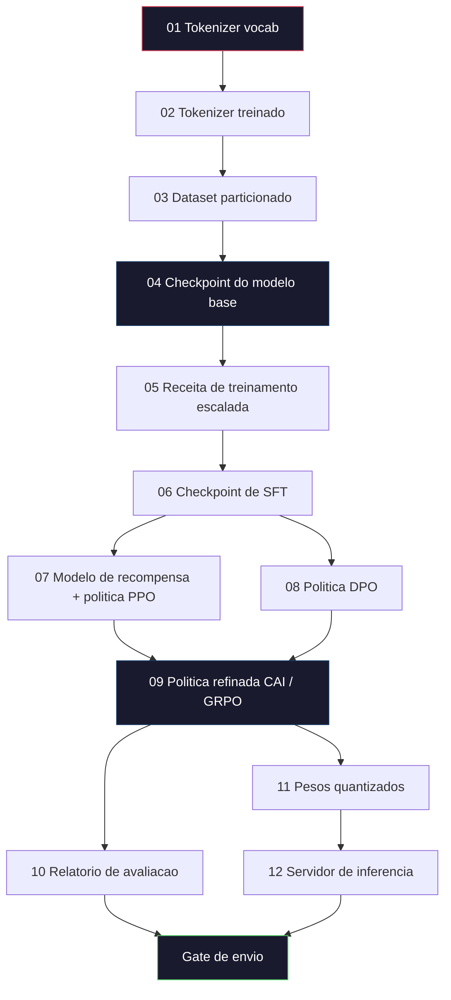
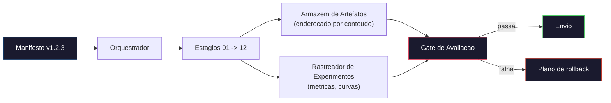

# Construindo um Pipeline Completo de LLM

> Tudo das Aulas 01 a 12 e um estagio de um unico pipeline. Esta aula e o esqueleto que transforma esses estagios em uma execucao de ponta a ponta: tokenizar, pre-treinar, escalar, SFT, alinhar, avaliar, quantizar, servir. Voce nao vai treinar um modelo 70B num notebook. Voce vai produzir a camada de orquestracao, o manifesto, o gate de avaliacao e o plano de rollback que uma equipe de fronteira em 2026 usa pra decidir o que vai pro ar. Esta e a aula final.

**Tipo:** Construir
**Linguagens:** Python (stdlib)
**Pre-requisitos:** Todas as aulas da Fase 10 (01-12)
**Tempo:** ~120 minutos

## Objetivos de Aprendizado

- Compor as onze aulas anteriores (tokenizer, dados, pre-treinamento, escalabilidade, SFT, RLHF, DPO, CAI, avaliacao, quantizacao, inferencia) em uma eespecificaçãoificação de pipeline reproduzivel
- Definir o contrato de artefatos entre estagios: o que cada estagio consome, o que produz, e como o proximo estagio verifica a entrada
- Construir um orquestrador que rastreia experimentos, faz hash dos artefatos e condiciona decisoes de envio a thresholds de avaliacao
- Projetar o plano de rollback: quais artefatos sao baratos de re-executar, quais sao caros, e quanto custa um checkpoint corrompido

## O Problema

As aulas anteriores cada uma funciona. Tokenizer treinado. Tiny GPT pre-treinado. Dataset de SFT montado. Modelo de recompensa treinado. DPO rodado. Avaliacoes medidas. Pesos quantizados exportados. Servidor de inferencia levantado. Cada um e um notebook. Cada um com suas convencoes, seus caminhos de saida, sua seed.

Um run de treinamento de fronteira nao e um notebook. Llama 3 405B levou 30 milhoes de horas H100 ao longo de aproximadamente 54 dias. DeepSeek-V3 usou cerca de 2.8 milhoes de horas H800. Durante esse tempo, um checkpoint corrompido, uma contaminacao de dados, uma regressao na avaliacao pode custar uma semana de tempo real e um mes de orcamento de GPU. A forma como as equipes sobrevivem e pela higiene do pipeline: cada estagio tem entrada deterministica, saida deterministica, manifesto, hash e gate.

Esta e a aula final. Voce nao vai rodar o pipeline de ponta a ponta num notebook. Voce vai escrever o orquestrador que coordena os estagios, o manifesto que descreve o run, o verificador que condiciona decisoes de envio e o plano de replay que permite a terceiros re-executar seu trabalho a partir de um unico arquivo. O codigo e pequeno; a disciplina e grande.

O padrao escala de 100M para 1T de parametros sem mudanca. Os mesmos quatro componentes -- manifesto, orquestrador, gate de avaliacao, armazem de artefatos -- rodam Llama 3 e tambem rodam seu GPT de hobby. A diferenca e o tamanho dos numeros dentro da config de cada estagio, nao a forma do pipeline.

## O Conceito

### Os Doze Estagios

Cada aula da Fase 10 e um estagio. Aqui esta o grafo completo de dependencias.



Os estagios 07 e 08 podem rodar em paralelo. Todo o resto e dependencia rigida. Uma mudanca no estagio 02 (tokenizer) invalida todos os artefatos downstream. Uma mudanca no estagio 10 (avaliacao) invalida apenas a decisao de envio.

### O Manifesto

Um manifesto e um arquivo unico que descreve um run completamente o suficiente pra reproduzi-lo. Nada que o pipeline produz deve depender de estado que nao esta no manifesto. Os campos sao chatos e obrigatorios.

```
pipeline_version: 1.2.3
seed: 42
git_commit: a1b2c3d4
stages:
  01_tokenizer:
    recipe: bpe_32k
    input_hash: sha256:...
    output_hash: sha256:...
    wall_clock_sec: 3600
    cost_usd: 12
```

O hash de saida do estagio N e o hash de entrada do estagio N+1. Qualquer desvio e o pipeline para. E assim voce pega corrompimento de dados cedo. E tambem e assim que um colega em outro continente verifica que a reproducao deles produziu o mesmo artefato que o seu.

Na pratica equipes usam um pequeno schema YAML mais um verificador de manifesto que difa contra o run anterior bem-sucedido. Qualquer delta fora dos campos esperados (custo, tempo real) e uma bandeira vermelha.

### Tipagem de Artefatos

A saida de cada estagio e um artefato tipado. Nao um blob de diretorio, nao um pickle, mas um tipo nomeado com um schema conhecido.

| Estagio | Tipo de Artefato | Campos Chave |
|---------|-----------------|--------------|
| 01-02 | Tokenizer | vocab.json, merges.txt, config.json, hash |
| 03 | Dataset | shards[], contagem de linhas, contagem de tokens, estatisticas de dedup |
| 04-05 | Checkpoint | weights.safetensors, config.json, estado do otimizador, contagem de steps |
| 06 | Modelo SFT | checkpoint + receita SFT + mix de dados |
| 07 | Modelo de Recompensa | checkpoint RM + hash dos dados de preferencia |
| 08-09 | Politica | checkpoint + hash de referencia + beta + orcamento KL consumido |
| 10 | Relatorio de Avaliacao | scores de benchmark + diffs de regressao + hash dos dados de avaliacao |
| 11 | Modelo Quantizado | pesos quantizados + dados de calibracao + delta de acuracia vs FP16 |
| 12 | Eespecificaçãoificacao do Servidor | endpoint + hash do modelo + config + hooks de observabilidade |

A tipagem evita o modo de falha mais comum: usar a saida do estagio 08 como entrada do estagio 06, enviando um modelo treinado com DPO pelo caminho de SFT. Artefatos tipados e assinaturas de estagios tipados transformam esses erros em falhas de compilacao, nao falhas no quinto dia.

### O Gate de Avaliacao

Envio nao e "treinamento terminou." Envio e "treinamento terminou e o gate de avaliacao passou." O gate e definido antes do run comecar.

```
gates:
  mmlu:      >= baseline + 0.5   # sem regressao
  humaneval: >= baseline + 1.0
  truthfulqa: >= baseline         # sem queda
  safety_refusal_rate: <= 0.05
  kl_from_reference: <= 25.0
  cost_total_usd: <= 50000
```

Todo gate e um threshold numerico. Nao tem gates de "parece bom". Nao tem aprovacoes subjetivas. Se todos os gates passam, o artefato e marcado como enviovel. Se qualquer gate falha, o run fica pendente ate override explicito por um revisor nomeado, que tambem fica logado no manifesto.

Dois gates pegam a maioria dos desastres. Um gate de *regressao* (o novo modelo precisa ser pelo menos tao bom quanto o anterior em benchmarks core) pega bugs de treinamento. Um gate de *orcamento KL* (a politica alinhada nao pode ter desviado mais que X da sua referencia) pega alinhamento exagerado. Todo pipeline de producao tem ambos.

### O Orquestrador

Um pedaco pequeno de codigo que le o manifesto, despacha estagios, rastreia artefatos e para em qualquer violacao de contrato. Isto nao e Airflow. Isto nao e Kubeflow. Pra higiene do pipeline voce quer algo chato que voce mesmo escreveu.

O trabalho do orquestrador e estreito:

1. Resolver o DAG a partir do manifesto.
2. Para cada estagio, verificar se a saida esperada ja existe no hash correto (pular se existir).
3. Rodar o estagio, capturar stdout/stderr, medir tempo real e custo.
4. Verificar o hash de saida contra o hash de entrada esperado do estagio downstream.
5. Na falha, escrever um manifesto parcial com o estagio exato que falhou e sair com codigo nao-zero.

Isso sao 200 linhas de Python. Vai parecer o arquivo `code/main.py` desta aula. Por baixo dos panos, o pipeline real usa `torchrun` ou `ray` pra executar estagios individuais em clusters, mas o proprio orquestrador roda em uma unica maquina.

### Rastreamento de Experimentos e Armazenamento de Artefatos

Dois sistemas externos ancoram o pipeline.

**Rastreador de experimentos (wandb, neptune, mlflow).** Registra curvas de loss, metricas de avaliacao, telemetria do sistema por estagio. O rastreador e onde voce vai quando precisa comparar o run A com o run B tres semanas depois. Equipes quase sempre usam um rastreador hospedado pra isso -- escrever o seu proprio perde tempo que deveria ir pro treinamento.

**Armazem de artefatos (S3, R2, GCS).** Armazenamento de objetos imutavel para checkpoints, datasets, tokenizers, relatorios de avaliacao. Artefatos sao enderecados por hash, nao por nome de arquivo. Um nome de arquivo como `latest.pt` e uma bomba; `ckpt-7b-step-20000-sha256:abc123.safetensors` e um contrato.

O orquestrador escreve nos dois. O rastreador e pra humanos olhando graficos. O armazem de artefatos e pro proximo estagio buscando entradas.

### Custo

Um run de fronteira tem um numero em dolares atrelado. Disciplina de orcamento acontece em dois lugares.

**Estimativa pre-run.** A partir do manifesto, calcular FLOPs esperados (pre-treinamento: 6 x params x tokens), horas GPU esperadas (FLOPs / throughput pico / utilizacao) e custo em dolares na taxa de aluguel atual. Se a estimativa exceder o gate de orcamento, o pipeline se recusa a comecar.

**Rastreamento durante o run.** Tempo real e custo por estagio sao registrados no manifesto. Depois de cada estagio, o orcamento restante e verificado. Se um estagio extrapolou, o gate do proximo estagio e avaliado com o novo orcamento restante. Voce nao fica sabendo que ficou sem dinheiro quando o VC liga.

O custo reportado do Llama 3 foi de $61M. DeepSeek-V3 reportou $5.6M para o run principal de pre-treinamento. A razao e majoritariamente eficiencia de hardware mais mixture-of-experts -- mas o custo eespecificaçãoifico e visivel porque ambas as equipes rastrearam por estagio, nao por run.

### Reprodutibilidade vs Determinismo

Sao coisas diferentes. *Reprodutivel* significa que o mesmo manifesto mais o mesmo codigo mais a mesma infraestrutura produz um checkpoint com metricas downstream equivalentes. *Deterministico* saida bit-identica.

Treinamento moderno de LLM e reprodutivel mas nao deterministico. O reduce-order do treinamento distribuido, nao-determinismo de kernels GPU (cuBLAS, flash-attn) e arredondamento de precisao mista combinam pra produzir floats que diferem no nivel 1e-5 entre runs. Isso e ok pra metricas finais, que nao mexem. E fatal se voce esta tentando debugar com diffs bit-a-bit. A cura e logar o hash de entrada, hash de saida e metricas principais de cada estagio -- se essas batem, o run e "reproduzido" mesmo que os pesos nao sejam bit-identicos.



### Plano de Rollback

Antes do run comecar, escreva o que acontece na falha de cada estagio. Tres categorias.

- **Barato pra re-executar** (horas): tokenizer, avaliacao, quantizacao, servidor de inferencia. So re-executar.
- **Medio** (dias): SFT, DPO, CAI. Manter o modelo base; re-executar apenas os estagios de alinhamento.
- **Caro** (semanas e milhoes de dolares): pre-treinamento. O plano de rollback aqui nao e "re-executar." E "usar o ultimo checkpoint bom e re-executar os estagios downstream mais baratos com dados revisados."

Como as dependencias de estagios sao tipadas e com hash, o orquestrador pode calcular o conjunto de rollback automaticamente: invalidar o estagio que falhou mais todos os descendentes. Uma falha no estagio 06 (SFT) invalida 06, 07, 08, 09, 10, 11, 12. Uma falha no estagio 11 (quantizacao) invalida apenas 11 e 12. Definir isso antes evita improviso enquanto a equipe esta exausta as 4am.

### Receitas de Producao Observadas em 2026

A maioria das equipes de fronteira convergiu no mesmo esqueleto.

- Tokenizer: 128k BPE com reserva de byte. Treinado em um corte multilingue pequeno e balanceado.
- Pre-treinamento: 10-20T tokens, majoritariamente web mais codigo mais sintetico. Otimizador Muon ou AdamW. FSDP2 ou DeepSpeed ZeRO-3. Gradient checkpointing. Pesos BF16, master FP32.
- SFT: 500k-2M pares de instrucoes, mix humano e sintetico, com dedup rigoroso contra o dataset de avaliacao.
- Alinhamento: DPO ou CAI + GRPO. RLHF apenas onde o sinal de preferencia e multidimensional demais pra DPO.
- Avaliacao: MMLU-Pro, MATH, HumanEval+, GPQA, SWE-Bench Verified, LiveBench, mais um conjunto privado de retencao que o publico nunca ve.
- Quantizacao: GPTQ ou AWQ 4-bit pra servir, 8-bit pra avaliacoes de seguranca onde deltas de acuracia importam.
- Servindo: vLLM, TensorRT-LLM ou proprio. Batching continuo. Decodificacao eespecificaçãoulativa. Evicao de KV cache.

Os numeros mudam a cada seis meses. O esqueleto nao.

## Construir

O codigo da aula e um orquestrador e um verificador de manifesto, nao doze scripts de treinamento. Cada estagio e simulado com um placeholder que produz um artefato de saida com o formato e hash corretos. Rodar o orquestrador de ponta a ponta prova que a tubulacao do pipeline funciona antes de voce queimar dinheiro de GPU nos estagios reais.

Veja `code/main.py` pra implementacao completa. Os pedacos principais:

- Dataclass `Manifest`: versao do pipeline, seed, commit git, estagios, gates.
- Dataclass `Stage`: nome, tipo, entradas (hashes), saida (hash), tempo real, custo.
- `Orchestrator.run()`: resolve o DAG, despacha estagios, verifica hashes, atualiza manifesto.
- `EvalGate.check()`: le thresholds, compara contra o ultimo relatorio de avaliacao, retorna passa/falha.
- `ArtifactStore` (stub em memoria): put/get por hash, simula S3.
- `CostTracker`: por estagio e cumulativo, para quando exceder o limite.

O pipeline em `main.py` roda doze estagios placeholder, produz um manifesto e exercita um gate de avaliacao falho pra mostrar como fica um run retido. Troque cada placeholder pelo script de treinamento real da aula correspondente e voce tem o esqueleto que um pipeline de fronteira real usa.

## Usar

O fluxo de trabalho canonico tem tres comandos.

```
python code/main.py plan    # validar manifesto, calcular estimativa de custo, imprimir DAG
python code/main.py run     # executar estagios, escrevendo em manifest.out.yaml
python code/main.py gate    # ler manifest.out.yaml, aplicar gates de avaliacao, enviar ou reter
```

Rode `plan` primeiro sempre. A maioria dos bugs de pipeline aparece no plan -- thresholds de gate faltando, hashes desatualizados, orcamento estourado. Rodar `plan` e gratis. Rodar `run` e caro. Economize pegando bugs do lado barato.

A saida de `gate` e `SHIP` ou `HOLD: <motivo>`. Um run retido nao e falha; e um ponto de decisao. Um revisor nomeado faz override (e o override e logado) ou aprova o rollback.

## Entregar

Esta aula produz `outputs/skill-llm-pipeline-reviewer.md`. Alimente-o com um manifesto de pipeline proposto e ele verifica todos os contratos: tipagem de estagios, cadeia de hashes, gates, plano de rollback, estimativa de custo. Ele se recusa a aprovar um manifesto com gate de avaliacao faltando, orcamento KL ilimitado ou um run que mistura dados de avaliacao e treinamento.

## Exercicios

1. Estender o orquestrador pra suportar execucao paralela dos estagios 07 e 08. Use o modulo stdlib `concurrent.futures`. Confirme que o manifesto final registra as saidas de ambos os estagios e que o hash de entrada do estagio 09 e uma combinacao deterministica dos dois.

2. Adicionar um gate de "verificacao de contaminacao". Dado o hash do dataset de avaliacao e os shards do dataset de treinamento, calcular a sobreposicao (match de string exato ou match 13-gram). O gate falha se a sobreposicao exceder 0.1%. Alimente com um dataset de treinamento contaminado e confirme que o gate retém o run.

3. Implementar um estimador de custo desde os principios. Para o estagio 04 (pre-treinamento), estimar FLOPs como 6 x params x tokens, assumindo 40% MFU (utilizacao de FLOPs do modelo) em H100 a 889 TFLOPs BF16, a $2.50/GPU-hora. Reportar a estimativa pra um modelo 7B treinado em 2T tokens. Comparar com numeros publicados do Llama 2.

4. Construir um rollback parcial. Simular uma falha no estagio 09 (CAI), depois re-executar os estagios 09 ate 12 deixando 01-08 em cache. O orquestrador deve detectar os artefatos em cache pelo hash e pula-los. Medir tempo real economizado versus re-execucao total.

5. Adicionar observabilidade. Emitir spans OpenTelemetry para cada estagio, com atributos para params, tokens vistos, loss e custo. Mandar os spans para um coletor local. O ponto nao e dashboards; o ponto e que a saude de cada estagio e rastreavel a partir de um unico trace ID.

## Termos Principais

| Termo | O que a gente diz | O que realmente significa |
|-------|-------------------|--------------------------|
| Manifesto | "O arquivo de receita" | YAML ou JSON descrevendo versao do pipeline, seed, config por estagio e thresholds de gate -- suficiente pra reproduzir um run |
| Enderecado por conteudo | "Por hash nao por nome" | Artefatos armazenados pelo SHA-256 do conteudo, entao voce nunca confunde a versao A com a versao B |
| Gate de avaliacao | "Os criterios de envio" | Thresholds numericos em metricas de benchmark e escores de seguranca que precisam passar antes de um artefato ser marcado como enviovel |
| Orcamento KL | "Quanto o alinhamento desviou" | Um limite no KL acumulado (politica \|\| referencia) ao longo dos estagios de alinhamento, aplicado como gate |
| MFU | "Quanto da GPU voce usou" | Utilizacao de FLOPs do Modelo -- FLOPs realizados divididos pelo pico teorico. 40% e tipico em escala 70B, 55% em 7B |
| Plano de rollback | "O que faz quando quebra" | Conjunto de acoes pre-escritas por estagio em caso de falha: re-executar, voltar, retreinar com entradas revisadas |
| Orquestrador | "O maestro" | O processo que le o manifesto, despacha estagios, verifica hashes, para em qualquer violacao de contrato |
| Armazem de artefatos | "S3 versionado pra pesos" | Armazenamento de objetos imutavel enderecado por conteudo -- unica fonte de verdade pra checkpoints, datasets, relatorios de avaliacao |
| Reprodutivel | "Mesmos metricas na reproducao" | Pesos em nivel de bits diferentes mas metricas downstream equivalentes -- o alvo realista pra treinamento distribuido de LLM |
| Gate de custo | "Nao pode exceder X" | Estimativa de custo pre-run mais rastreador durante o run -- o pipeline se recusa a comecar se a estimativa exceder o orcamento |

## Leitura Complementar

- [Dubey et al., 2024 -- "The Llama 3 Herd of Models"](https://arxiv.org/abs/2407.21783) -- a descricao publica mais detalhada de um pipeline de fronteira incluindo dados, treinamento, alinhamento, avaliacao
- [DeepSeek-AI, 2024 -- "DeepSeek-V3 Technical Report"](https://arxiv.org/abs/2412.19437) -- pipeline com foco em eficiencia a cerca de 1/10 do custo do Llama 3
- [Kaplan et al., 2020 -- "Scaling Laws for Neural Language Models"](https://arxiv.org/abs/2001.08361) -- a relacao original de escalabilidade entre compute-dados-params
- [Hoffmann et al., 2022 -- "Training Compute-Optimal Large Language Models (Chinchilla)"](https://arxiv.org/abs/2203.15556) -- a correcao do Kaplan que recalibrou orcamentos modernos de dados
- [Documentacao do PyTorch FSDP2](https://pytorch.org/docs/stable/fsdp.html) -- a primitiva de treinamento distribuido que substitui FSDP1 no PyTorch 2.4+
- [Weights & Biases LLM Reports](https://wandb.ai/site/llms) -- manifests reais e saida de rastreador de experimentos pra runs de LLM open-source, uteis como templates plagiaveis
