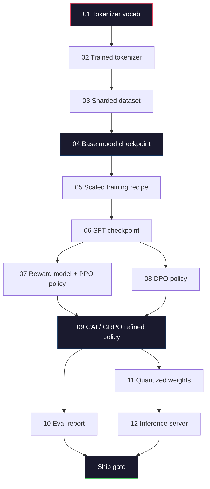
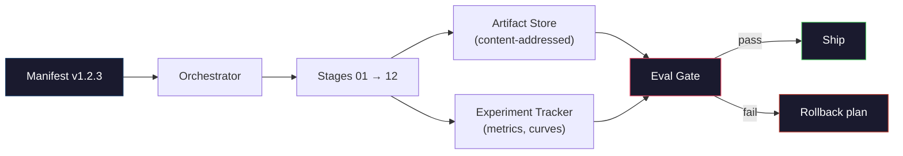

# Eksiksiz bir LLM Boru Hattı Oluşturmak

> Ders 01'den 12'ye kadar olan her şey bir ardışık düzenin bir aşamasıdır. Bu ders, bu aşamaları tek bir uçtan uca çalıştırmaya dönüştüren iskeledir: tokenize, ön eğitim, ölçekleme, SFT, hizalama, değerlendirme, niceliklendirme, sunma. 70B modelini dizüstü bilgisayarda eğitemezsiniz. 2026 sınır ekibinin nelerin gönderileceğine karar vermek için kullanacağı orkestrasyon katmanını, bildirimi, değerlendirme kapısını ve geri alma planını üreteceksiniz. Bu kapak taşı.

**Tür:** Yapım
**Diller:** Python (stdlib)
**Önkoşullar:** Tüm Aşama 10 dersleri 01-12
**Süre:** ~120 dakika

## Öğrenme Hedefleri

- Önceki on bir dersi (tokenizer, veri, ön eğitim, ölçeklendirme, SFT, RLHF, DPO, CAI, değerlendirme, niceleme, inference) tek bir tekrarlanabilir ardışık düzen spesifikasyonu halinde oluşturun
- Aşamalar arasındaki artifact sözleşmesini tanımlayın: her aşama neyi tüketir, ne üretir ve bir sonraki aşamanın girdiyi nasıl doğruladığı
- Denemeleri, artifact karmalarını izleyen ve değerlendirme eşiklerine ilişkin gemi kararlarını denetleyen bir orkestratör oluşturun
- Geri alma planını tasarlayın: hangi artifact'lerin yeniden çalıştırılması ucuz, hangileri pahalı ve bozuk bir kontrol noktasının maliyeti nedir

## Sorun

Önceki derslerin her biri çalışır. Tokenizer eğitildi. Minik GPT önceden eğitilmiştir. SFT dataset toplandı. Ödül modeli eğitildi. DPO çalıştırması. Değerler ölçüldü. Nicelenmiş ağırlıklar dışa aktarıldı. Inference sunucusu açıldı. Her biri bir defter. Her birinin kendi gelenekleri, kendi çıktı yolları, kendi tohumları vardır.

Sınır antrenman koşusu bir not defteri değildir. Llama 3 405B yaklaşık 54 günde 30 milyon H100 saat sürdü. DeepSeek-V3 yaklaşık 2,8 milyon H800 saat kullandı. Bu süre zarfında, bozuk bir kontrol noktası, bir veri kirliliği, bir değerlendirme regresyonu, bir takıma bir haftalık duvar saatine ve bir aylık GPU bütçesine mal olabilir. Ekiplerin bu durumdan kurtulmasının yolu boru hattı hijyeninden geçer: Her aşamada deterministik bir girdi, deterministik bir çıktı, manifest, karma ve geçit bulunur.

Bu kapak taşı. İşlem hattını bir dizüstü bilgisayarda uçtan uca çalıştırmayacaksınız. Aşamaları koordine eden orkestratörü, çalıştırmayı açıklayan bildirimi, gemi kararlarını denetleyen doğrulayıcıyı ve üçüncü bir tarafın çalışmanızı tek bir dosyadan yeniden yürütmesine olanak tanıyan yeniden oynatma planını yazacaksınız. Kod küçüktür; disiplin büyüktür.

Desen, 100M'den 1T parametrelerine değişmeden ölçeklenir. Aynı dört bileşen (manifest, orkestratör, değerlendirme kapısı, artifact deposu) Llama 3'ü çalıştırır ve aynı zamanda hobi GPT'nizi de çalıştırır. Aradaki fark, boru hattının şekli değil, her aşamanın yapılandırmasındaki sayıların boyutudur.

## Konsept

### On İki Aşama

Her Aşama 10 dersi bir aşamadır. İşte tam bağımlılık grafiği.



Aşama 07 ve 08 paralel olarak yürütülebilir. Geriye kalan her şey zor bir bağımlılıktır. Aşama 02'deki (tokenizer) bir değişiklik, tüm aşağı akışlı artifact'yi geçersiz kılar. Aşama 10'daki (değerlendirme) bir değişiklik yalnızca gemi kararını geçersiz kılar.

### Manifesto

Bildiri, bir çalıştırmayı yeniden yürütmeye yetecek kadar tamamen tanımlayan tek bir dosyadır. Boru hattının ürettiği hiçbir şey manifestte yer almayan duruma bağlı olmamalıdır. Alanlar sıkıcı ve zorunludur.

```
pipeline_version: 1.2.3
seed: 42
git_commit: a1b2c3d4
stages:
  01_tokenizer:
    recipe: bpe_32k
    input_hash: sha256:...
    output_hash: sha256:...
    wall_clock_sec: 3600
    cost_usd: 12
```

N aşamasının çıkış karma değeri, N+1 aşamasının giriş karma değeridir. Herhangi bir sapma olursa boru hattı durur. Veri bozulmasını bu şekilde erken yakalarsınız. Bu aynı zamanda farklı bir kıtadaki takım arkadaşının kendi tekrarının sizinkiyle aynı artifact sonucunu ürettiğini doğrulama şeklidir.

Uygulamada ekipler küçük bir YAML şeması artı önceki başarılı çalıştırmaya göre farklılık gösteren bir bildirim denetleyicisi kullanır. Beklenen alanların (maliyet, duvar saati) dışındaki herhangi bir delta bir tehlike işaretidir.

### Artifact Yazma

Her aşamanın çıktısı artifact şeklinde yazılır. Bir dizin blobu ya da turşu değil, bilinen bir şemaya sahip adlandırılmış bir tür.

| Sahne | Artifact Tür | Anahtar Alanlar |
|-------|--------------|-----------|
| 01-02 | Tokenizer | vocab.json, merges.txt, config.json, karma |
| 03 | Dataset | parçalar[], satır sayısı, token sayısı, yinelenenleri kaldırma istatistikleri |
| 04-05 | Kontrol noktası | weights.safetensors, config.json, optimize edici durumu, adım sayısı |
| 06 | SFT Modeli | kontrol noktası + SFT tarifi + veri karışımı |
| 07 | Ödül Modeli | RM kontrol noktası + tercih veri karması |
| 08-09 | Politika | kontrol noktası + referans karması + beta + tüketilen KL bütçesi |
| 10 | Değerlendirme Raporu | benchmark puan + regresyon farkları + değerlendirme veri karması |
| 11 | Nicelenmiş Model | nicelenmiş ağırlıklar + kalibrasyon verileri + doğruluk deltası vs FP16 |
| 12 | Sunucu Özellikleri | uç nokta + model karması + yapılandırma + observability kancalar |

Yazma, en yaygın hata modunu önler: aşama 08 çıkışını aşama 06 girişi olarak kullanmak, DPO tarafından eğitilmiş bir modeli SFT yolu üzerinden göndermek. Yazılan artifact'lar ve yazılan aşama imzaları, bu hataların beşinci gün hatalarına değil, derleme zamanı hatalarına neden olur.

### Eval Kapısı

Gönderim "eğitim bitti" değildir. Gönderim şu şekildedir: "eğitim bitti ve değerlendirme kapısı geçildi." Kapı, çalışma başlamadan önce tanımlanır.

```
gates:
  mmlu:      >= baseline + 0.5   # no regression
  humaneval: >= baseline + 1.0
  truthfulqa: >= baseline         # no drop
  safety_refusal_rate: <= 0.05
  kl_from_reference: <= 25.0
  cost_total_usd: <= 50000
```

Her kapı sayısal bir eşiktir. "İyi görünüyor" kapıları yok. Sübjektif imza yok. Her kapı geçerse, artifact gönderilebilir olarak işaretlenir. Herhangi bir geçit başarısız olursa, çalıştırma, kendisi de bildirimde günlüğe kaydedilen, adlandırılmış bir gözden geçiren tarafından açık bir şekilde geçersiz kılınıncaya kadar bekletilir.

Çoğu felaketi iki kapı yakalar. Bir *regresyon* kapısı (yeni model en azından çekirdek benchmark'lerdeki önceki model kadar iyi olmalıdır) eğitim hatalarını yakalar. Bir *KL bütçe* kapısı (uyumlu politika, referansından X'ten daha fazla sapmamalı) uyumun aşırı pişmesini yakalar. Her üretim hattında her ikisi de bulunur.

### Orkestratör

Manifest'i okuyan, aşamaları gönderen, artifact'ları izleyen ve herhangi bir sözleşme ihlali durumunda durduran küçük bir kod parçası. Bu Hava Akışı değil. Bu Kubeflow değil. Boru hattı hijyeni için yazdığınız sıkıcı bir şeyi istiyorsunuz.

Orkestratörün işi dardır:

1. DAG'yi manifestten çözümleyin.
2. Her aşama için, beklenen çıktının zaten doğru karma değerde mevcut olup olmadığını kontrol edin (varsa atlayın).
3. Sahneyi çalıştırın, stdout/stderr'yi yakalayın, duvar saatini ve maliyeti ölçün.
4. Çıkış karma değerini, alt aşamanın beklenen giriş karma değerine göre doğrulayın.
5. Başarısızlık durumunda, tam başarısızlık aşamasını içeren kısmi bir bildirim yazın ve sıfır dışında çıkın.

Bu 200 satırlık Python'dur. Bu dersteki `code/main.py` dosyasına benzeyecektir. Temelde, gerçek işlem hattı kümeler üzerinde bireysel aşamaları yürütmek için `torchrun` veya `ray` kullanır, ancak orkestratörün kendisi tek bir kutu üzerinde çalışır.

### Deneme Takibi ve Artifact Depolama Alanı

İki harici sistem boru hattını sabitler.

**Deney izleyici (wandb, neptune, mlflow).** Kayıp eğrilerini, değerlendirme ölçümlerini ve aşama başına sistem telemetrisini günlüğe kaydeder. İzleyici, A çalışmasını üç hafta sonraki B çalışmasıyla karşılaştırmanız gerektiğinde gideceğiniz yerdir. Takımlar bunun için hemen hemen her zaman barındırılan bir izleyici kullanır; kendi yazınızı yazmak, eğitime harcanması gereken zamanı kaybeder.

**Artifact deposu (S3, R2, GCS).** Denetim noktaları, dataset'ler, tokenizer'ler, değerlendirme raporları için değişmez nesne deposu. Artifact'ler dosya adına göre değil karma değerine göre adreslenir. `latest.pt` gibi bir dosya adı bir ayak tabancasıdır; `ckpt-7b-step-20000-sha256:abc123.safetensors` bir sözleşmedir.

Orkestracı her ikisine de yazar. İzleyici, grafiklere bakan insanlar içindir. artifact deposu bir sonraki aşamadaki girdileri aramak içindir.

### Maliyetlendirme

Sınır koşusuna bir dolar numarası eklenir. Bütçe disiplini iki yerde olur.

**Çalıştırma öncesi tahmin.** Bildiriden, beklenen FLOP'ları (eğitim öncesi için: 6 x parametre x tokens), beklenen GPU saatlerini (FLOP'lar / en yüksek verim / kullanım) ve geçerli kiralama fiyatı üzerinden dolar maliyetini hesaplayın. Tahmin bütçe sınırını aşarsa boru hattı başlamayı reddeder.

**Çalışma içi izleme.** Aşama aşama duvar saati ve maliyet manifest dosyasına kaydedilir. Her aşamadan sonra kalan bütçe kontrol edilir. Bir etabın aşılması halinde, kalan yeni bütçe ile bir sonraki etabın kapısı değerlendirilir. VC aradığında paranızın bittiğini öğrenmiyorsunuz.

Ana eğitim öncesi çalıştırma için Llama 3'ün rapor edilen maliyeti $61M. DeepSeek-V3 reported $5,6 milyondu. Oran çoğunlukla donanım verimliliği artı uzmanların karışımından oluşuyor; ancak her iki ekip de bunu çalışma başına değil aşama başına takip ettiği için spesifik maliyet görülebilir.

### Tekrarlanabilirlik vs Determinizm

Bunlar aynı değil. *Tekrarlanabilir*, aynı manifest artı aynı kod artı aynı altyapının, eşdeğer aşağı akış metriklerine sahip bir kontrol noktası ürettiği anlamına gelir. *Deterministik* bit-özdeş çıktı anlamına gelir.

Modern LLM eğitimi tekrarlanabilir ancak deterministik değildir. Dağıtılmış eğitimin azaltılmış sırası, GPU çekirdeğinin belirlenemezliği (cuBLAS, flash-attn) ve karışık hassas yuvarlama, çalıştırmalar arasında 1e-5 seviyesinde farklılık gösteren kayan noktalar üretmek için bir araya gelir. Bu, hareket etmeyen son ölçümler için iyidir. Bit düzeyindeki farklarla hata ayıklamaya çalışıyorsanız bu ölümcül bir durumdur. Çözüm, her aşamanın giriş karmasını, çıktı karmasını ve başlık ölçümlerini günlüğe kaydetmektir; eğer bunlar eşleşirse, ağırlıklar aynı olmasa bile çalışma "yeniden üretilir".



### Geri Alma Planı

Koşu başlamadan önce, her aşamanın başarısız olması durumunda ne olacağını yazın. Üç kategori.

- **Yeniden çalıştırması ucuz** (saat): tokenizer, değerlendirme, niceleme, inference sunucusu. Sadece yeniden çalıştırın.
- **Orta** (günler): SFT, DPO, CAI. Temel modeli koruyun; yalnızca hizalama aşamalarını yeniden çalıştırın.
- **Pahalı** (haftalarca ve milyonlarca dolar): ön eğitim. Buradaki geri alma planı "yeniden çalıştırma" değildir. "Son iyi kontrol noktasını kullanın ve daha ucuz alt aşamaları revize edilmiş verilerle yeniden çalıştırın."

Aşama bağımlılıkları yazıldığı ve karma işlemi uygulandığı için, orkestratör geri alma kümesini otomatik olarak hesaplayabilir: başarısız olan aşamayı ve tüm alt öğeleri geçersiz kılın. Aşama 06'daki (SFT) bir başarısızlık, 06, 07, 08, 09, 10, 11, 12'yi geçersiz kılar. Aşama 11'deki (kuantizasyon) bir başarısızlık yalnızca 11 ve 12'yi geçersiz kılar. Bunu önceden adlandırmak, ekip sabah 4'te bitkinken doğaçlama yapmaktan kaçınır.

### 2026'da Gözlemlenen Üretim Tarifleri

Çoğu sınır ekibi aynı iskelet üzerinde birleşti.

- Tokenizer: Bayt geri dönüşüyle ​​128 bin BPE. Küçük, dengeli çok dilli bir dilimde eğitim aldım.
- Ön eğitim: 10-20T tokens, çoğunlukla web artı kod artı sentetik. Muon veya AdamW iyileştirici. FSDP2 veya DeepSpeed ​​Zero-3. Gradient kontrol noktası. BF16 ağırlıkları, FP32 master.
- SFT: 500k-2M talimat çifti, karışık insan ve sentetik, değerlendirme setine karşı katı tekilleştirme ile.
- Hizalama: DPO veya CAI + GRPO. RLHF yalnızca tercih sinyalinin DPO için çok boyutlu olduğu durumlarda.
- Eval: MMLU-Pro, MATH, HumanEval+, GPQA, SWE-Bench Verified, LiveBench ve ayrıca halkın asla görmediği özel bir set.
- Niceleme: Hizmet için 4 bit GPTQ veya AWQ, doğruluk deltalarının önemli olduğu güvenlik değerlendirmeleri için 8 bit.
- Sunum: vLLM, TensorRT-LLM veya şirket içi. Sürekli toplu işlem. Spekülatif kod çözme. KV önbellek tahliyesi.

Rakamlar altı ayda bir değişiyor. İskelet öyle değil.

```figure
beam-search
```

## İnşa Et

Dersin kodu on iki eğitim betiği değil, bir orkestratör ve bildirim denetleyicisidir. Her aşama, doğru şekil ve hash ile bir artifact çıktısı üreten bir yer tutucuyla simüle edilir. Orkestratörün uçtan uca çalıştırılması, siz gerçek aşamalarda GPU parasını harcamadan önce boru hattının tesisatının çalıştığını kanıtlar.

Tam uygulama için `code/main.py` konusuna bakın. Anahtar parçalar:

- `Manifest` veri sınıfı: ardışık düzen sürümü, tohum, git taahhüdü, aşamalar, kapılar.
- `Stage` veri sınıfı: ad, tür, girdiler (karma), çıktı (karma), duvar saati, maliyet.
- `Orchestrator.run()`: DAG'yi çözer, aşamaları gönderir, karmaları doğrular, bildirimi günceller.
- `EvalGate.check()`: eşikleri okur, en son değerlendirme raporuyla karşılaştırır, başarılı/başarısız değerini döndürür.
- `ArtifactStore` (bellek içi saplama): hash ile koy/al, S3'ü simüle eder.
- `CostTracker`: aşama başına ve kümülatif, sınır aşıldığında durur.

`main.py`'daki işlem hattı on iki yer tutucu aşamayı çalıştırır, bir bildirim üretir ve bekletilen bir çalıştırmanın neye benzediğini göstermek için başarısız bir değerlendirme kapısı uygular. Her yer tutucuyu ilgili dersteki gerçek eğitim senaryosu ile değiştirin ve gerçek bir sınır boru hattının kullandığı iskelete sahip olun.

## Kullan onu

Kurallı iş akışının üç komutu vardır.

```
python code/main.py plan    # validate manifest, compute cost estimate, print DAG
python code/main.py run     # execute stages, writing to manifest.out.yaml
python code/main.py gate    # read manifest.out.yaml, apply eval gates, ship-or-hold
```

Her seferinde ilk olarak `plan` komutunu çalıştırın. Çoğu ardışık düzen hatası plan zamanında ortaya çıkıyor; eksik kapı eşikleri, eski karmalar, bütçe aşımları. `plan`'ı çalıştırmak ücretsizdir. `run`'yi çalıştırmak pahalıdır. Ucuz taraftaki hataları yakalayarak paradan tasarruf edin.

`gate`'nin çıkışı ya `SHIP` ya da `HOLD: <reason>` olur. Bekletilen bir koşu bir başarısızlık değildir; bir karar noktasıdır. Adlandırılmış bir gözden geçiren kişi ya geçersiz kılar (ve geçersiz kılma günlüğe kaydedilir) ya da geri almayı onaylar.

## Gönderin

Bu ders `outputs/skill-llm-pipeline-reviewer.md` üretir. Önerilen bir işlem hattı manifestosunu besleyin ve tüm sözleşmeleri kontrol etsin: aşama yazma, karma zinciri, kapılar, geri alma planı, maliyet tahmini. Eksik değerlendirme kapısına, sınırsız KL bütçesine veya değerlendirme ve eğitim verilerini karıştıran bir çalıştırmaya sahip bir bildirimi onaylamayı reddeder.

## Egzersizler

1. Orkestratörü aşama 07 ve 08'in paralel yürütülmesini destekleyecek şekilde genişletin. Stdlib `concurrent.futures` modülünü kullanın. Nihai bildirimin her iki aşamanın çıktılarını kaydettiğini ve aşama 09'un giriş karmasının her ikisinin de deterministik bir birleşimi olduğunu doğrulayın.

2. Bir "kirlilik kontrolü" kapısı ekleyin. Değerlendirme dataset karması ve eğitim dataset parçası göz önüne alındığında, örtüşmeyi hesaplayın (tam dize eşleşmesi veya 13 gramlık eşleşme). Örtüşme %0,1'i aşarsa geçit başarısız olur. Ona kirlenmiş bir eğitim seti verin ve kapının koşuyu sürdürdüğünü doğrulayın.

3. İlk ilkelerden yola çıkarak bir maliyet tahmin aracı uygulayın. Aşama 04 (eğitim öncesi) için, FLOP'ları 6 x parametre x tokens olarak tahmin edin, H100'de 989 TFLOP BF16'da, 2,50 ABD Doları/GPU-saat seviyesinde %40 MFU (FLOP modeli kullanımı) olduğunu varsayalım. 2T tokens üzerinde eğitilmiş bir 7B modeli için tahmini bildirin. Yayınlanan Llama 2 sayılarıyla karşılaştırın.

4. Kısmi bir geri alma oluşturun. Aşama 09'da (CAI) bir arıza simülasyonu yapın, ardından 01-08'i önbellekte bırakarak 09'dan 12'ye kadar olan aşamaları yeniden çalıştırın. Orkestratörün önbelleğe alınmış artifact'ları hash ile algılaması ve bunları atlaması gerekir. Tam yeniden çalıştırmaya karşı kaydedilen duvar saatini ölçün.

5. observability ekleyin. Paramlar, görülen tokenler, kayıp ve maliyet öznitelikleriyle birlikte her aşama için OpenTelemetry yayılmalarını yayınlayın. Açıklıkları yerel bir toplayıcıya borulayın. Önemli olan gösterge tabloları değil; Önemli olan, her aşamanın sağlığının tek bir izleme kimliğinden izlenebilmesidir.

## Anahtar Terimler

| Dönem | İnsanlar ne diyor | Aslında ne anlama geliyor |
|------|----------------|----------------------|
| Manifesto | "Tarif dosyası" | İşlem hattı sürümünü, çekirdeği, aşama başına yapılandırmayı ve kapı eşiklerini açıklayan YAML veya JSON; bir çalıştırmayı yeniden oynatmak için yeterlidir |
| İçeriğe yönelik | "İsme göre değil karmayla" | Artifact içerikleri SHA-256 tarafından depolanır, böylece A sürümünü hiçbir zaman B sürümüyle karıştıramazsınız |
| Değerlendirme kapısı | "Gemi kriterleri" | artifact gönderilebilir olarak işaretlenmeden önce geçmesi gereken benchmark metrikleri ve güvenlik puanlarına ilişkin sayısal eşikler |
| KL bütçesi | "Hizalama ne kadar uzaklaştı" | Hizalama aşamaları boyunca kümülatif KL'ye (politika || referans) yönelik bir üst sınır, bir kapı olarak uygulanır |
| MFU | "GPU'nun ne kadarını kullandınız" | Model FLOP Kullanımı - elde edilen FLOP'ların teorik zirveye bölümü. 70B ölçeğinde %40 tipiktir, 7B |
| Geri alma planı | "Kırıldığında ne yaparız" | Başarısızlık durumunda aşama başına önceden yazılmış eylemler dizisi: yeniden çalıştırma, geri çekilme, revize edilmiş girdilerle yeniden eğitim |
| Orkestratör | "Orkestra şefi" | Manifestoyu okuyan, aşamaları gönderen, karmaları doğrulayan, herhangi bir sözleşme ihlali durumunda durdurulan süreç |
| Artifact mağaza | "Ağırlıklar için S3 sürümü" | Değişmez içerik adresli nesne deposu — kontrol noktaları, dataset'ler, değerlendirme raporları için tek doğruluk kaynağı |
| Tekrarlanabilir | "Tekrar oynatmada aynı ölçümler" | Farklı bit düzeyi ağırlıkları ancak eşdeğer aşağı akış ölçümleri — dağıtılmış LLM eğitimi için gerçekçi hedef |
| Maliyet kapısı | "X'i geçemezsiniz" | Çalıştırma öncesi maliyet tahmini ve çalıştırma içi izleyici — tahminin bütçeyi aşması durumunda boru hattı başlamayı reddediyor |

## Daha Fazla Okuma

- [Dubey ve diğerleri, 2024 -- "The Llama 3 Herd of Models"](https://arxiv.org/abs/2407.21783) -- veri, eğitim, hizalama ve değerlendirmeyi içeren bir sınır hattının en ayrıntılı genel açıklaması
- [DeepSeek-AI, 2024 -- "DeepSeek-V3 Teknik Raporu"](https://arxiv.org/abs/2412.19437) -- Llama 3 sınıfı eğitiminin kabaca 1/10'u kadar maliyetle verimlilik öncelikli ardışık düzen
- [Kaplan ve diğerleri, 2020 -- "Sinir Dili Modelleri için Ölçekleme Yasaları"](https://arxiv.org/abs/2001.08361) -- orijinal hesaplama-veri-parametreleri ölçeklendirme ilişkisi
- [Hoffmann ve diğerleri, 2022 -- "Training Compute-Optimal Large Language Models (Chinchilla)"](https://arxiv.org/abs/2203.15556) -- Kaplan'a yapılan ve modern veri bütçelerini yeniden kalibre eden düzeltme
- [PyTorch FSDP2 belgeleri](https://pytorch.org/docs/stable/fsdp.html) -- PyTorch 2.4+ sürümünde FSDP1'in yerini alan dağıtılmış eğitim ilkel öğesi
- [Ağırlıklar ve Önyargılar LLM Raporları](https://wandb.ai/site/llms) -- açık kaynak LLM çalışmaları için gerçek bildirimler ve deney izleyici çıktısı, intihal edilebilir şablonlar olarak kullanışlıdır
