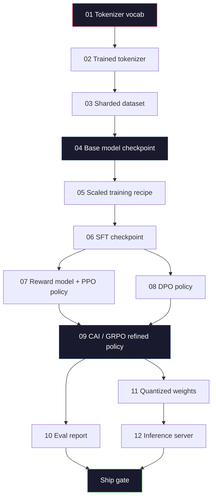
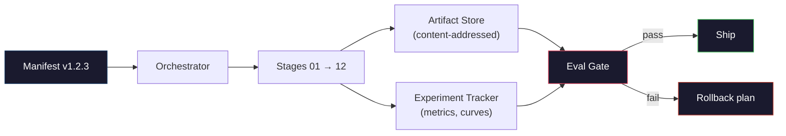

# 构建完整的LLM流水线

> 从课程01到12的所有内容都是一个流水线的一个阶段。本课程是将这些阶段转变为单一端到端运行的框架：分词（tokenize）、预训练（pre-train）、扩展（scale）、SFT（监督微调）、对齐（align）、评估（evaluate）、量化（quantize）、服务（serve）。你不会在笔记本电脑上训练一个700亿参数的模型。你将创建编排层（orchestration layer）、清单（manifest）、评估门（eval gate）和回滚计划（rollback plan），这些是2026年前沿团队用来决定发布什么内容的工具。这是顶点课程。

**类型：** 构建

**语言：** Python（标准库）

**先决条件：** 所有第10阶段课程01-12

**时间：** 约120分钟

## 学习目标

- 将之前的十一节课（分词器、数据、预训练、扩展、SFT、RLHF、DPO、CAI、评估、量化、推理）组合成单一的可重现流水线规范
- 定义阶段之间的工件契约：每个阶段消耗什么、产生什么，以及下一阶段如何验证输入
- 构建一个编排器（orchestrator），用于跟踪实验、哈希工件（hashes artifacts），并根据评估阈值决定是否发布
- 设计回滚计划：哪些工件可以低成本重新运行，哪些成本高昂，以及损坏的检查点（checkpoint）会造成什么损失

## 问题

之前的每节课都有效。分词器已训练。小型GPT已预训练。SFT数据集已组装。奖励模型已训练。DPO已运行。评估已完成。量化权重已导出。推理服务器已启动。每个都是独立的笔记本。每个都有自己的约定、自己的输出路径、自己的随机种子。

前沿训练运行不是笔记本。Llama 3 405B模型在大约54天内消耗了3000万H100小时。DeepSeek-V3使用了大约280万H800小时。在此期间，一个损坏的检查点、一次数据污染、一次评估回退都可能使团队损失一周的时钟时间和一个月的GPU预算。团队应对这种情况的方法是通过流水线卫生（pipeline hygiene）：每个阶段都有确定性输入、确定性输出、清单（manifest）、哈希（hash）和门（gate）。

这是顶点课程。你不会在笔记本电脑上端到端运行流水线。你将编写协调各个阶段的编排器、描述运行的清单、控制发布决策的验证器，以及允许第三方从单个文件重新运行你工作的重放计划。代码量小，但纪律要求高。

该模式从1亿到1万亿参数规模保持不变。相同的四个组件——清单、编排器、评估门、工件存储——既运行Llama 3，也运行你的业余GPT。区别在于每个阶段配置中数字的大小，而不是流水线的形状。

## 概念

### 十二个阶段

每个第10阶段的课程都是一个阶段。这是完整的依赖关系图。



阶段07和08可以并行运行。其他都是硬依赖。阶段02（分词器）的更改会使所有下游工件失效。阶段10（评估）的更改只会使发布决策失效。

### 清单（Manifest）

清单是一个单一文件，它足够详细地描述了一次运行，以便能够重现它。流水线产生的任何东西都不应依赖于清单中未包含的状态。这些字段虽然平凡但必不可少。

```
pipeline_version: 1.2.3
seed: 42
git_commit: a1b2c3d4
stages:
  01_tokenizer:
    recipe: bpe_32k
    input_hash: sha256:...
    output_hash: sha256:...
    wall_clock_sec: 3600
    cost_usd: 12
```

阶段N的输出哈希是阶段N+1的输入哈希。任何偏差都会导致流水线停止。这就是你如何及早发现数据损坏。这也是不同大陆上的队友如何验证他们的重运行产生了与你相同的工件的方法。

在实践中，团队使用一个小型YAML模式，加上一个与上次成功运行进行差异比较的清单检查器。任何超出预期字段（成本、时钟时间）的差异都是危险信号。

### 工件类型（Artifact Typing）

每个阶段的输出都是类型化的工件。不是目录blob，也不是pickle，而是具有已知模式的命名类型。

| Stage | Artifact Type | Key Fields |
|-------|--------------|-----------|
| 01-02 | Tokenizer | vocab.json, merges.txt, config.json, hash |
| 03 | Dataset | shards[], row count, token count, dedup stats |
| 04-05 | Checkpoint | weights.safetensors, config.json, optimizer state, step count |
| 06 | SFT Model | checkpoint + SFT recipe + data mix |
| 07 | Reward Model | RM checkpoint + preference data hash |
| 08-09 | Policy | checkpoint + reference hash + beta + KL budget consumed |
| 10 | Eval Report | benchmark scores + regression diffs + eval data hash |
| 11 | Quantized Model | quantized weights + calibration data + accuracy delta vs FP16 |
| 12 | Server Spec | endpoint + model hash + config + observability hooks |

类型化防止了最常见的故障模式：将阶段08的输出用作阶段06的输入，通过SFT路径发布DPO训练的模型。类型化工件和类型化阶段签名使这些错误成为编译时故障，而不是第五天的故障。

### 评估门（Eval Gate）

发布不是"训练完成"。发布是"训练完成且评估门通过"。门在运行开始前就已定义。

```
gates:
  mmlu:      >= baseline + 0.5   # no regression
  humaneval: >= baseline + 1.0
  truthfulqa: >= baseline         # no drop
  safety_refusal_rate: <= 0.05
  kl_from_reference: <= 25.0
  cost_total_usd: <= 50000
```

每个门都是数字阈值。没有"看起来不错"的门。没有主观批准。如果所有门都通过，工件被标记为可发布。如果任何门失败，运行将被暂停，等待指定审查者的明确覆盖，而覆盖本身也会记录在清单中。

两个门可以捕获大多数灾难。*回归*门（新模型在核心基准上必须至少与之前模型一样好）捕获训练错误。*KL预算*门（对齐策略不能偏离其参考超过X）捕获对齐过度调整。每个生产流水线都有这两个门。

### 编排器（Orchestrator）

一小段代码，它读取清单、调度阶段、跟踪工件，并在任何契约违规时停止。这不是Airflow。这不是Kubeflow。为了流水线卫生，你想要的是你自己编写的平凡的东西。

编排器的工作范围很窄：

1. 从清单解析DAG（有向无环图）。
2. 对于每个阶段，检查预期输出是否已存在于正确的哈希处（如果是则跳过）。
3. 运行阶段，捕获stdout/stderr，测量时钟时间和成本。
4. 验证输出哈希与下游阶段的预期输入哈希。
5. 失败时，写入包含确切失败阶段的部分清单并以非零状态退出。

这是200行Python代码。它将看起来像本课程中的文件`code/main.py`。在底层，真实的流水线使用`torchrun`或`ray`在集群上执行各个阶段，但编排器本身在单个机器上运行。

### 实验跟踪和工件存储

两个外部系统支撑着流水线。

**实验跟踪器（wandb, neptune, mlflow）。** 记录每个阶段的损失曲线、评估指标、系统遥测。当你需要三周后比较运行A与运行B时，你会去跟踪器。团队几乎总是为此使用托管的跟踪器——自己编写会浪费本应用于训练的时间。

**工件存储（S3, R2, GCS）。** 用于检查点、数据集、分词器、评估报告的不可变对象存储。工件通过哈希寻址，而不是文件名。像`latest.pt`这样的文件名是危险的；`ckpt-7b-step-20000-sha256:abc123.safetensors`才是契约。

编排器同时写入两者。跟踪器供人类查看图表。工件存储供下一阶段查找输入。

### 成本计算

前沿运行附加了一个美元数字。预算纪律发生在两个地方。

**运行前估算。** 从清单中计算预期的FLOPs（对于预训练：6 x 参数量 x tokens）、预期的GPU小时数（FLOPs / 峰值吞吐量 / 利用率）以及当前租赁费率的美元成本。如果估算超过预算门，流水线将拒绝启动。

**运行中跟踪。** 阶段性的时钟时间和成本记录在清单中。每个阶段后，检查剩余预算。如果一个阶段超支，则使用新的剩余预算评估下一阶段的门。当风险投资公司打电话时，你不会发现自己没钱了。

Llama 3的报告成本为6100万美元。DeepSeek-V3报告主预训练成本为560万美元。比例主要是硬件效率和专家混合——但具体成本是可见的，因为两个团队都是按阶段跟踪，而不是按运行跟踪。

### 可重现性与确定性

这些不是同一个概念。*可重现*意味着相同的清单加上相同的代码加上相同的基础设施产生具有等效下游指标的检查点。*确定性*意味着比特级相同的输出。

现代LLM训练是可重现的但不是确定性的。分布式训练的reduce顺序、GPU内核非确定性（cuBLAS, flash-attn）和混合精度舍入相结合，导致运行间浮点数在1e-5级别存在差异。对于不变化的最终指标来说，这没有问题。但如果你尝试使用比特级差异进行调试，这将是致命的。解决方案是记录每个阶段的输入哈希、输出哈希和主要指标——如果这些匹配，即使权重不是比特级相同的，运行也是"可重现的"。



### 回滚计划

在运行开始前，写下每个阶段失败时会发生什么。分为三类。

- **低成本重新运行**（小时）：分词器、评估、量化、推理服务器。只需重新运行。
- **中等成本**（天）：SFT、DPO、CAI。保留基础模型；仅重新运行对齐阶段。
- **高成本**（周和数百万美元）：预训练。这里的回滚计划不是"重新运行"。而是"使用最后一个良好的检查点，并使用修改后的数据重新运行成本较低的下游阶段"。

由于阶段依赖是类型化和哈希化的，编排器可以自动计算回滚集：使失败的阶段及其所有后代失效。阶段06（SFT）的失效会使06、07、08、09、10、11、12都失效。阶段11（量化）的失效只会使11和12失效。预先命名这些内容可以避免团队在凌晨4点筋疲力尽时即兴发挥。

### 2026年观察到的生产配方

大多数前沿团队都收敛到相同的框架。

- 分词器：128k BPE，带有字节回退。在小型、平衡的多语言切片上训练。
- 预训练：10-20T tokens，主要是网络、代码和合成数据。Muon或AdamW优化器。FSDP2或DeepSpeed ZeRO-3。梯度检查点。BF16权重，FP32主权重。
- SFT：50万-200万指令对，混合人类和合成数据，与评估集严格去重。
- 对齐：DPO或CAI + GRPO。仅在偏好信号对DPO来说维度过多时使用RLHF。
- 评估：MMLU-Pro、MATH、HumanEval+、GPQA、SWE-Bench Verified、LiveBench，加上公众从未见过的私有保留集。
- 量化：4位GPTQ或AWQ用于服务，8位用于安全评估，其中精度差异很重要。
- 服务：vLLM、TensorRT-LLM或自研。连续批处理。推测解码。KV缓存淘汰。

数字每六个月变化一次。框架不变。

## 构建它

本课程的代码是一个编排器和一个清单检查器，而不是十二个训练脚本。每个阶段都使用一个占位符模拟，该占位符产生具有正确形状和哈希的输出工件。端到端运行编排器可以证明流水线的管道工作正常，然后再在真实阶段上消耗GPU资金。

完整实现在`code/main.py`中。关键部分：

- `Manifest`数据类：流水线版本、种子、git提交、阶段、门。
- `Stage`数据类：名称、类型、输入（哈希）、输出（哈希）、时钟时间、成本。
- `Orchestrator.run()`：解析DAG，调度阶段，验证哈希，更新清单。
- `EvalGate.check()`：读取阈值，与最新评估报告比较，返回通过/失败。
- `ArtifactStore`（内存存根）：通过哈希put/get，模拟S3。
- `CostTracker`：按阶段和累计，超过上限时停止。

`main.py`中的流水线运行十二个占位符阶段，产生一个清单，并展示一个失败的评估门以显示被暂停的运行是什么样子。将每个占位符替换为相应课程中的真实训练脚本，你就得到了真实前沿流水线使用的框架。

## 使用它

标准工作流程有三个命令。

```
python code/main.py plan    # validate manifest, compute cost estimate, print DAG
python code/main.py run     # execute stages, writing to manifest.out.yaml
python code/main.py gate    # read manifest.out.yaml, apply eval gates, ship-or-hold
```

每次先运行`plan`。大多数流水线错误在计划阶段显现——缺少门阈值、过时的哈希、预算超支。运行`plan`是免费的。运行`run`是昂贵的。通过在低成本一侧捕获错误来省钱。

`gate`的输出要么是`SHIP`，要么是`HOLD: <原因>`。被暂停的运行不是失败；它是一个决策点。指定的审查者要么覆盖（覆盖被记录），要么批准回滚。

## 发布它

本课程生成`outputs/skill-llm-pipeline-reviewer.md`。向它提供提议的流水线清单，它会检查所有契约：阶段类型、哈希链、门、回滚计划、成本估算。它拒绝批准缺少评估门、无界KL预算或混合评估和训练数据的运行的清单。

## 练习

1. 扩展编排器以支持阶段07和08的并行执行。使用标准库`concurrent.futures`模块。确认最终清单记录了两个阶段的输出，并且阶段09的输入哈希是两者的确定性组合。

2. 添加"污染检查"门。给定评估数据集哈希和训练数据集分片，计算重叠（精确字符串匹配或13-gram匹配）。如果重叠超过0.1%，门失败。向它提供受污染的训练集，并确认门暂停了运行。

3. 从基本原理实现成本估算器。对于阶段04（预训练），将FLOPs估算为6 x 参数量 x tokens，假设在H100上40%的MFU（模型FLOPs利用率），BF16模式下989 TFLOPs，费率为2.50美元/GPU小时。报告7B模型在2T tokens上训练的估算。与已发布的Llama 2数字进行比较。

4. 构建部分回滚。模拟阶段09（CAI）的故障，然后重新运行阶段09到12，同时保留01-08的缓存。编排器应通过哈希检测缓存工件并跳过它们。测量节省的时钟时间与完全重新运行相比。

5. 添加可观测性。为每个阶段发出OpenTelemetry span，包含参数、看到的tokens、损失和成本的属性。将span传输到本地收集器。重点不是仪表板；重点是每个阶段的状态都可以从单个trace ID追踪。

## 关键术语

| Term | What people say | What it actually means |
|------|----------------|----------------------|
| 清单（Manifest） | "配方文件" | 描述流水线版本、种子、每个阶段配置和门阈值的YAML或JSON——足以重现一次运行 |
| 内容寻址 | "通过哈希而非名称" | 工件通过其内容的SHA-256存储，因此你永远不会混淆版本A和版本B |
| 评估门（Eval Gate） | "发布标准" | 基准指标和安全分数上的数字阈值，工件标记为可发布前必须通过 |
| KL预算 | "对齐偏离多远" | 对齐阶段上KL（策略||参考）的累积上限，作为门强制执行 |
| MFU | "GPU使用了多少" | 模型FLOPs利用率——实现的FLOPs除以理论峰值。70B规模下典型值为40%，7B下为55% |
| 回滚计划 | "故障时我们做什么" | 每个阶段故障时预写的操作集：重新运行、回退、使用修改的输入重新训练 |
| 编排器（Orchestrator） | "指挥家" | 读取清单、调度阶段、验证哈希、在任何契约违规时停止的过程 |
| 工件存储 | "权重的版本化S3" | 不可变的内容寻址对象存储——检查点、数据集、评估报告的单一事实来源 |
| 可重现 | "重播时指标相同" | 不同的比特级权重但等效的下游指标——分布式LLM训练的现实目标 |
| 成本门 | "你不能超过X" | 运行前成本估算加上运行中跟踪器——如果估算超过预算，流水线拒绝启动 |

## 延伸阅读

- [Dubey等人，2024 -- "Llama 3模型群"](https://arxiv.org/abs/2407.21783) -- 最详细的前沿流水线公开描述，包括数据、训练、对齐、评估
- [DeepSeek-AI，2024 -- "DeepSeek-V3技术报告"](https://arxiv.org/abs/2412.19437) -- 效率优先的流水线，成本约为Llama 3类训练的1/10
- [Kaplan等人，2020 -- "神经语言模型的扩展定律"](https://arxiv.org/abs/2001.08361) -- 原始的计算-数据-参数扩展关系
- [Hoffmann等人，2022 -- "训练计算最优的大语言模型（Chinchilla）"](https://arxiv.org/abs/2203.15556) -- 对Kaplan的修正，重新校准了现代数据预算
- [PyTorch FSDP2文档](https://pytorch.org/docs/stable/fsdp.html) -- 在PyTorch 2.4+中取代FSDP1的分布式训练原语
- [Weights & Biases LLM报告](https://wandb.ai/site/llms) -- 开源LLM运行的真实清单和实验跟踪器输出，可作为可抄袭的模板