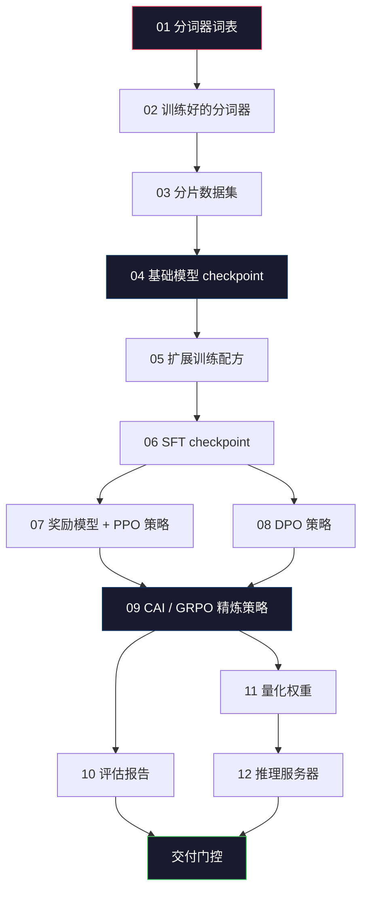
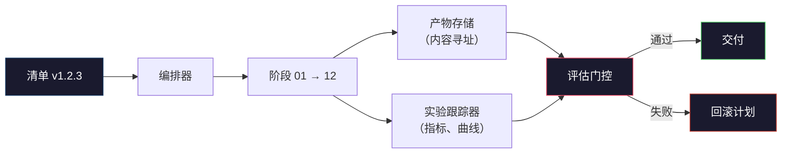

# 构建完整的 LLM 流水线

> 第 01 到 12 课的所有内容只是一个流水线的一个阶段。本课是将这些阶段转变为单次端到端运行的脚手架：分词、预训练、扩展、SFT、对齐、评估、量化、服务。你不会在笔记本上训练 70B 模型。你将产出编排层、清单、评估门控和回滚计划 —— 这些是 2026 年前沿团队用来决定什么可以交付的。这是顶点课程。

**类型：** 构建
**语言：** Python（标准库）
**前置要求：** 第 10 阶段第 01-12 课
**时间：** ~120 分钟

## 学习目标

- 将先前的十一课（分词器、数据、预训练、扩展、SFT、RLHF、DPO、CAI、评估、量化、推理）组合成单一可复现的流水线规范
- 定义阶段之间的产物契约：每个阶段消耗什么、产出什么，以及下一阶段如何验证输入
- 构建一个编排器，跟踪实验、哈希产物，并根据评估阈值门控交付决策
- 设计回滚计划：哪些产物便宜到可以重新运行，哪些昂贵，以及损坏的 checkpoint 代价是什么

## 问题

前面的课程各自都能工作。分词器训练完成。Tiny GPT 预训练完成。SFT 数据集组装完成。奖励模型训练完成。DPO 运行完成。评估完成测量。量化权重导出。推理服务器启动。每一个都是 notebook。每一个都有自己的约定、自己的输出路径、自己的种子。

前沿训练运行不是 notebook。Llama 3 405B 在大约 54 天内消耗了 3000 万 H100 小时。DeepSeek-V3 使用了约 280 万 H800 小时。在此期间，一个损坏的 checkpoint、一个数据污染、一个评估回归可能让团队损失一周的 wall-clock 和一个月的 GPU 预算。团队生存下来的方式是通过流水线卫生：每个阶段都有确定性输入、确定性输出、清单、哈希和门控。

这是顶点课程。你不会在笔记本上端到端运行流水线。你将编写协调阶段的编排器、描述运行的清单、门控交付决策的验证器，以及让第三方从单个文件重新运行你工作的重放计划。代码很小；纪律很大。

这个模式从 100M 到 1T 参数不变。相同的四个组件 —— 清单、编排器、评估门控、产物存储 —— 既运行 Llama 3，也运行你的爱好 GPT。区别在于每个阶段配置中的数字大小，而非流水线的形状。

## 核心概念

### 十二个阶段

每节第 10 阶段课程都是一个阶段。这是完整的依赖图。



阶段 07 和 08 可以并行运行。其他一切都是硬依赖。阶段 02（分词器）的变更会使每个下游产物失效。阶段 10（评估）的变更仅使交付决策失效。

### 清单

清单是一个单一文件，完整描述一次运行以足以重放它。流水线产生的任何东西都不应依赖于不在清单中的状态。字段是枯燥且强制的。

```
pipeline_version: 1.2.3
seed: 42
git_commit: a1b2c3d4
stages:
  01_tokenizer:
    recipe: bpe_32k
    input_hash: sha256:...
    output_hash: sha256:...
    wall_clock_sec: 3600
    cost_usd: 12
```

阶段 N 的输出哈希是阶段 N+1 的输入哈希。任何偏差都会使流水线停止。这是你尽早发现数据损坏的方式。也是不同大陆上的队友验证他们的重放是否产生了与你相同产物的方式。

实践中，团队使用一个小型 YAML schema 加上一个清单检查器，与上一次成功运行进行 diff。预期字段（成本、wall clock）之外的任何增量都是危险信号。

### 产物类型

每个阶段的输出都是类型化产物。不是目录 blob，不是 pickle，而是具有已知 schema 的命名类型。

| 阶段 | 产物类型 | 关键字段 |
|-------|--------------|-----------|
| 01-02 | 分词器 | vocab.json, merges.txt, config.json, hash |
| 03 | 数据集 | shards[], 行数, token 数, 去重统计 |
| 04-05 | Checkpoint | weights.safetensors, config.json, 优化器状态, 步数 |
| 06 | SFT 模型 | checkpoint + SFT 配方 + 数据混合 |
| 07 | 奖励模型 | RM checkpoint + 偏好数据哈希 |
| 08-09 | 策略 | checkpoint + 参考哈希 + beta + 已消耗 KL 预算 |
| 10 | 评估报告 | 基准分数 + 回归差异 + 评估数据哈希 |
| 11 | 量化模型 | 量化权重 + 校准数据 + 与 FP16 的精度差异 |
| 12 | 服务器规范 | 端点 + 模型哈希 + 配置 + 可观测性钩子 |

类型化防止了最常见的失败模式：将阶段 08 的输出用作阶段 06 的输入，将 DPO 训练的模型通过 SFT 路径交付。类型化产物和类型化阶段签名使这些错误成为编译时失败，而非第五天失败。

### 评估门控

交付不是"训练完成"。交付是"训练完成且评估门控通过"。门控在运行开始前定义。

```
gates:
  mmlu:      >= baseline + 0.5   # 无回归
  humaneval: >= baseline + 1.0
  truthfulqa: >= baseline         # 无下降
  safety_refusal_rate: <= 0.05
  kl_from_reference: <= 25.0
  cost_total_usd: <= 50000
```

每个门控都是一个数值阈值。没有"看起来不错"的门控。没有主观签字。如果每个门控都通过，产物被标记为可交付。如果任何门控失败，运行被挂起，等待指定审阅者的显式覆盖，覆盖本身被记录在清单中。

两个门控捕获了大多数灾难。*回归*门控（新模型必须在核心基准上至少与之前一样好）捕获训练 bug。*KL 预算*门控（对齐策略与其参考的距离不得超过 X）捕获对齐过度烹饪。每个生产流水线都有两者。

### 编排器

一小段代码，读取清单、调度阶段、跟踪产物，并在任何契约违规时停止。这不是 Airflow。这不是 Kubeflow。对于流水线卫生，你想要你写的无聊东西。

编排器的工作很窄：

1. 从清单解析 DAG。
2. 对于每个阶段，检查预期输出是否已存在于正确哈希处（如果是则跳过）。
3. 运行阶段，捕获 stdout/stderr，测量 wall clock 和成本。
4. 验证输出哈希与下游阶段的预期输入哈希。
5. 失败时，写入包含确切失败阶段的部分清单并以非零退出。

那是 200 行 Python。它看起来像本课文件 `code/main.py` 中的内容。在底层，真实流水线使用 `torchrun` 或 `ray` 在集群上执行各个阶段，但编排器本身运行在单个机器上。

### 实验跟踪和产物存储

两个外部系统锚定流水线。

**实验跟踪器（wandb、neptune、mlflow）。** 记录每阶段的损失曲线、评估指标、系统遥测。跟踪器是你在三周后需要比较运行 A 与运行 B 时去的地方。团队几乎总是为此使用托管跟踪器 —— 自己写会浪费本应用于训练的时间。

**产物存储（S3、R2、GCS）。** 用于 checkpoint、数据集、分词器、评估报告的不可变对象存储。产物按哈希寻址，而非按文件名。像 `latest.pt` 这样的文件名是脚枪；`ckpt-7b-step-20000-sha256:abc123.safetensors` 是契约。

编排器写入两者。跟踪器是给人类看图表的。产物存储是给下一阶段查找输入的。

### 成本核算

前沿运行有一个美元数字。预算纪律发生在两个地方。

**运行前估算。** 从清单计算预期 FLOPs（预训练：6 x 参数 x token），预期 GPU 小时（FLOPs / 峰值吞吐 / 利用率），以及当前租赁费率下的美元成本。如果估算超过预算门控，流水线拒绝启动。

**运行中跟踪。** 每阶段的 wall clock 和成本被记录到清单中。每个阶段后，检查剩余预算。如果一个阶段超支，下一阶段用新的剩余预算评估其门控。你不会在 VC 打电话时才发现没钱了。

Llama 3 的报告成本是 $61M。DeepSeek-V3 报告主预训练运行成本为 $5.6M。比率主要是硬件效率加上混合专家 —— 但具体成本是可见的，因为两个团队都按阶段跟踪，而非按运行跟踪。

### 可复现性 vs 确定性

这两者不同。*可复现*意味着相同的清单加上相同的代码加上相同的基础设施产生具有等效下游指标的 checkpoint。*确定性*意味着比特级相同的输出。

现代 LLM 训练是可复现但非确定性的。分布式训练的 reduce 顺序、GPU 内核非确定性（cuBLAS、flash-attn）以及混合精度舍入结合在一起，产生在不同运行间在 1e-5 级别上不同的浮点数。这对最终指标没问题，它们不会移动。如果你试图用比特级差异调试，这是致命的。解决方案是记录每个阶段的输入哈希、输出哈希和头条指标 —— 如果这些匹配，运行就是"复现的"，即使权重不是比特级相同的。



### 回滚计划

在运行开始前，写下每个阶段失败时会发生什么。三个类别。

- **便宜到可以重新运行**（小时）：分词器、评估、量化、推理服务器。直接重新运行。
- **中等**（天）：SFT、DPO、CAI。保留基础模型；只重新运行对齐阶段。
- **昂贵**（周和数百万美元）：预训练。这里的回滚计划不是"重新运行"。而是"使用最后一个好的 checkpoint 并用修订后的数据重新运行更便宜的下游阶段"。

因为阶段依赖是类型化和哈希化的，编排器可以自动计算回滚集：使失败阶段及其每个后代失效。阶段 06（SFT）的失败使 06、07、08、09、10、11、12 失效。阶段 11（量化）的失败仅使 11 和 12 失效。预先命名这些避免了团队在凌晨 4 点精疲力竭时临时应变。

### 2026 年观察到的生产配方

大多数前沿团队收敛到相同的骨架。

- 分词器：128k BPE 带字节回退。在小型、平衡的多语言切片上训练。
- 预训练：10-20T token，主要是网页加代码加合成。Muon 或 AdamW 优化器。FSDP2 或 DeepSpeed ZeRO-3。梯度检查点。BF16 权重，FP32 主副本。
- SFT：500k-2M 指令对，混合人类和合成，对评估集严格去重。
- 对齐：DPO 或 CAI + GRPO。仅在偏好信号对 DPO 来说太多维时使用 RLHF。
- 评估：MMLU-Pro、MATH、HumanEval+、GPQA、SWE-Bench Verified、LiveBench，加上公众从未见过的私有保留集。
- 量化：4 位 GPTQ 或 AWQ 用于服务，8 位用于安全评估，那里精度差异很重要。
- 服务：vLLM、TensorRT-LLM 或内部方案。连续批处理。推测解码。KV 缓存驱逐。

数字每六个月变化。骨架不变。

## 构建

本课的代码是编排器和清单检查器，而非十二个训练脚本。每个阶段用占位符模拟，产生具有正确形状和哈希的输出产物。端到端运行编排器证明流水线的 plumbing 在你用真实阶段燃烧 GPU 资金之前就能工作。

完整实现见 `code/main.py`。关键部分：

- `Manifest` 数据类：流水线版本、种子、git commit、阶段、门控。
- `Stage` 数据类：名称、类型、输入（哈希）、输出（哈希）、wall clock、成本。
- `Orchestrator.run()`：解析 DAG、调度阶段、验证哈希、更新清单。
- `EvalGate.check()`：读取阈值，与最新评估报告比较，返回通过/失败。
- `ArtifactStore`（内存存根）：按哈希 put/get，模拟 S3。
- `CostTracker`：每阶段和累计，超过上限时停止。

`main.py` 中的流水线运行十二个占位阶段，产生清单，并练习一个失败的评估门控以展示挂起的运行是什么样子。将每个占位符替换为相应课程的真实训练脚本，你就有了真实前沿流水线使用的骨架。

## 使用它

规范工作流有三个命令。

```
python code/main.py plan    # 验证清单，计算成本估算，打印 DAG
python code/main.py run     # 执行阶段，写入 manifest.out.yaml
python code/main.py gate    # 读取 manifest.out.yaml，应用评估门控，交付或挂起
```

每次先运行 `plan`。大多数流水线 bug 在 plan 时显现 —— 缺失的门控阈值、陈旧的哈希、预算超支。运行 `plan` 是免费的。运行 `run` 是昂贵的。在便宜的一侧捕获 bug 来省钱。

`gate` 的输出要么是 `SHIP` 要么是 `HOLD: <reason>`。挂起的运行不是失败；它是一个决策点。指定审阅者要么覆盖（覆盖被记录），要么他们批准回滚。

## 交付

本课生成 `outputs/skill-llm-pipeline-reviewer.md`。给它一个提议的流水线清单，它会检查所有契约：阶段类型、哈希链、门控、回滚计划、成本估算。它拒绝批准缺少评估门控、无界 KL 预算或混合评估和训练数据的运行的清单。

## 练习

1. 扩展编排器以支持阶段 07 和 08 的并行执行。使用标准库 `concurrent.futures` 模块。确认最终清单记录了两个阶段的输出，且阶段 09 的输入哈希是两者的确定性组合。

2. 添加一个"污染检查"门控。给定评估数据集哈希和训练数据集分片，计算重叠（精确字符串匹配或 13-gram 匹配）。如果重叠超过 0.1%，门控失败。给它一个受污染的训练集并确认门控挂起运行。

3. 从零开始实现成本估算器。对于阶段 04（预训练），将 FLOPs 估算为 6 x 参数 x token，假设 H100 上 BF16 的 989 TFLOPS 有 40% MFU（模型 FLOPs 利用率），按 $2.50/GPU-小时。报告在 2T token 上训练 7B 模型的估算。与公布的 Llama 2 数字比较。

4. 构建部分回滚。模拟阶段 09（CAI）的失败，然后重新运行阶段 09 到 12，同时保留 01-08 缓存。编排器应通过哈希检测缓存的产物并跳过它们。测量与完整重新运行相比节省的 wall-clock。

5. 添加可观测性。为每个阶段发出 OpenTelemetry span，属性包括参数、见过的 token、损失和成本。将 span 管道到本地收集器。重点不是仪表板；重点是每个阶段的健康状况都可以从单个 trace ID 追踪。

## 关键术语

| 术语 | 人们怎么说 | 实际含义 |
|------|-----------|---------|
| 清单 | "配方文件" | YAML 或 JSON 描述流水线版本、种子、每阶段配置和门控阈值 —— 足以重放一次运行 |
| 内容寻址 | "按哈希而非名称" | 产物按内容的 SHA-256 存储，所以你永远不会混淆版本 A 和版本 B |
| 评估门控 | "交付标准" | 基准指标和安全分数上的数值阈值，必须在产物被标记为可交付前通过 |
| KL 预算 | "对齐漂移了多远" | 跨对齐阶段的累积 KL(策略 || 参考) 上限，作为门控强制执行 |
| MFU | "你用了多少 GPU" | 模型 FLOPs 利用率 —— 达到的 FLOPs 除以理论峰值。70B 规模典型 40%，7B 规模 55% |
| 回滚计划 | "坏了时我们做什么" | 每阶段失败时预写的行动集：重新运行、回退、用修订后的输入重新训练 |
| 编排器 | "指挥者" | 读取清单、调度阶段、验证哈希、在任何契约违规时停止的进程 |
| 产物存储 | "权重的版本化 S3" | 不可变内容寻址对象存储 —— checkpoint、数据集、评估报告的单一真相来源 |
| 可复现 | "重放时相同指标" | 不同的比特级权重但等效的下游指标 —— 分布式 LLM 训练的现实目标 |
| 成本门控 | "你不能超过 X" | 运行前成本估算加运行中跟踪器 —— 如果估算超过预算，流水线拒绝启动 |

## 延伸阅读

- [Dubey et al., 2024 -- "The Llama 3 Herd of Models"](https://arxiv.org/abs/2407.21783) —— 最详细的公开前沿流水线描述，包括数据、训练、对齐、评估
- [DeepSeek-AI, 2024 -- "DeepSeek-V3 Technical Report"](https://arxiv.org/abs/2412.19437) —— 效率优先的流水线，成本约为 Llama 3 级别训练的 1/10
- [Kaplan et al., 2020 -- "Scaling Laws for Neural Language Models"](https://arxiv.org/abs/2001.08361) —— 原始的计算-数据-参数扩展关系
- [Hoffmann et al., 2022 -- "Training Compute-Optimal Large Language Models (Chinchilla)"](https://arxiv.org/abs/2203.15556) —— 对 Kaplan 的修正，重新校准了现代数据预算
- [PyTorch FSDP2 documentation](https://pytorch.org/docs/stable/fsdp.html) —— PyTorch 2.4+ 中替代 FSDP1 的分布式训练原语
- [Weights & Biases LLM Reports](https://wandb.ai/site/llms) —— 开源 LLM 运行的真实清单和实验跟踪器输出，可用作可抄袭的模板
