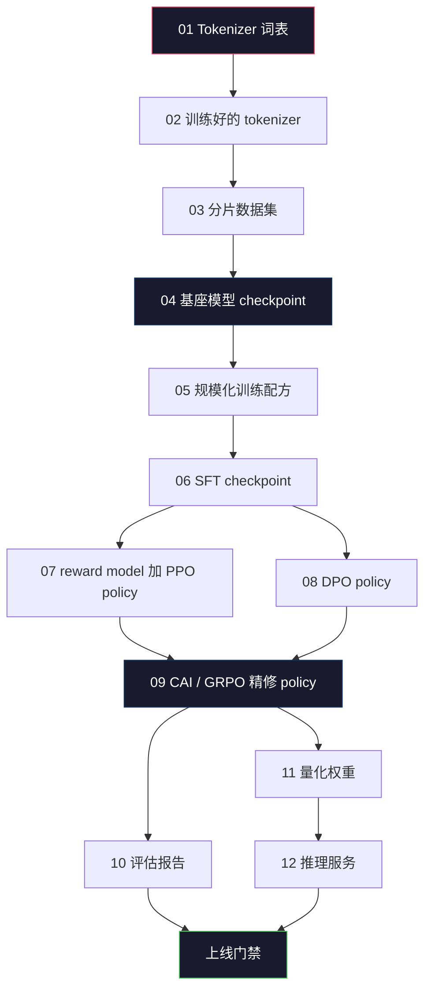
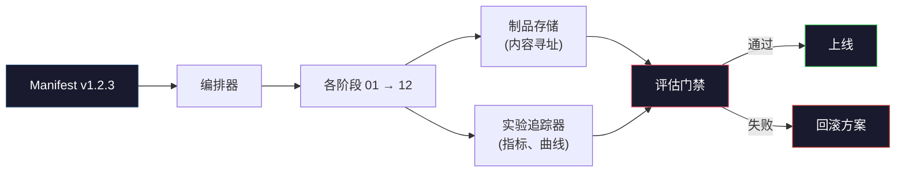

# 搭建完整的 LLM 流水线（Building a Complete LLM Pipeline）

> 译注：本文译自同目录 [`en.md`](./en.md)。术语遵循仓根 [TRANSLATION_GUIDE.md](../../../../TRANSLATION_GUIDE.md)。

> Lesson 01 到 12 的所有内容，都只是同一条流水线（pipeline）里的某一阶段。本节课就是那个把这些阶段串成单次端到端运行的脚手架：tokenize、pretrain、scale、SFT、对齐、评估（evaluation）、量化、上线服务。你不会在笔记本电脑上训出一个 70B 模型，但你会产出一套编排层（orchestration layer）、manifest（清单）、eval gate（评估闸）和回滚预案——也就是 2026 年的前沿团队用来决定「什么能上线」的那一层。这是整个阶段的毕业项目（capstone）。

**Type:** Build
**Languages:** Python (stdlib)
**Prerequisites:** All Phase 10 lessons 01-12
**Time:** ~120 minutes

## 学习目标（Learning Objectives）

- 把前面 11 节课（tokenizer、数据、预训练、scaling、SFT、RLHF、DPO、CAI、eval、量化、推理）拼成一份单一、可复现的 pipeline 规格
- 定义阶段间的 artifact（产物）契约：每个阶段消费什么、产出什么、下个阶段如何校验输入
- 写一个 orchestrator（编排器），用它跟踪实验、对 artifact 做哈希、用 eval 阈值卡住上线决定
- 设计回滚预案：哪些 artifact 重跑很便宜、哪些代价很大、一份损坏的 checkpoint 究竟值多少钱

## 问题（The Problem）

之前的每一节课各自都能跑通。Tokenizer 训完了。Tiny GPT 预训练完了。SFT 数据集拼好了。Reward model 训完了。DPO 跑完了。Eval 测完了。量化权重导出了。推理服务也起来了。每一个都是一个 notebook，每一个都有自己的约定、自己的输出路径、自己的 seed。

但前沿训练运行不是 notebook。Llama 3 405B 大约用了 3000 万 H100 小时，跨度大约 54 天。DeepSeek-V3 大约用了 280 万 H800 小时。在那段时间里，一份损坏的 checkpoint、一次数据污染、一次 eval 回退，都可能让团队损失一周的墙钟时间和一个月的 GPU 预算。团队能在这种规模下活下来，靠的是流水线卫生（pipeline hygiene）：每个阶段都有确定性的输入、确定性的输出、一份 manifest、一个哈希、一道闸。

这就是毕业项目。你不会在笔记本上端到端跑完整条流水线。你要写的是：编排各阶段的 orchestrator、描述这次运行的 manifest、卡住上线决定的 verifier（验证器），以及让第三方仅凭一份文件就能复跑你工作的 replay（回放）方案。代码量不大；纪律才是大头。

这套模式从 100M 参数到 1T 参数都不变。同样的四个组件——manifest、orchestrator、eval gate、artifact 存储——既能跑 Llama 3，也能跑你的玩具 GPT。区别只在每个阶段配置里数字的大小，而不是流水线的形状。

## 概念（The Concept）

### 十二个阶段（The Twelve Stages）

Phase 10 的每节课对应一个阶段。完整依赖图如下。



阶段 07 和 08 可以并行。其他都是硬依赖。改动阶段 02（tokenizer）会让所有下游 artifact 全部失效；改动阶段 10（eval）则只让上线决定失效。

### Manifest（清单）

Manifest 是一份单一文件，它对一次运行的描述要完整到足以原样回放。pipeline 产出的任何东西都不应依赖于不在 manifest 里的状态。这些字段无聊但不可或缺。

```
pipeline_version: 1.2.3
seed: 42
git_commit: a1b2c3d4
stages:
  01_tokenizer:
    recipe: bpe_32k
    input_hash: sha256:...
    output_hash: sha256:...
    wall_clock_sec: 3600
    cost_usd: 12
```

阶段 N 的 output hash 就是阶段 N+1 的 input hash。任何偏差，pipeline 立即停。这就是你提早抓到数据损坏的方法，也是另一大洲的同事用来验证「他们的回放产出和你的 artifact 一致」的方法。

实际中团队会用一份很小的 YAML schema，加一个 manifest 检查器，跟上一次成功的运行做 diff。任何超出预期字段（cost、wall clock）之外的差异都是红旗。

### Artifact 类型化（Artifact Typing）

每个阶段的输出都是一个有类型（typed）的 artifact。不是一个目录里的 blob，不是 pickle，而是一个有名字、有 schema 的类型。

| 阶段 | Artifact 类型 | 关键字段 |
|-------|--------------|-----------|
| 01-02 | Tokenizer | vocab.json, merges.txt, config.json, hash |
| 03 | Dataset | shards[]、行数、token 数、去重统计 |
| 04-05 | Checkpoint | weights.safetensors, config.json、optimizer 状态、step 数 |
| 06 | SFT Model | checkpoint + SFT recipe + 数据混合 |
| 07 | Reward Model | RM checkpoint + 偏好数据 hash |
| 08-09 | Policy | checkpoint + 参考模型 hash + beta + 已消耗 KL 预算 |
| 10 | Eval Report | benchmark 分数 + 回退 diff + eval 数据 hash |
| 11 | Quantized Model | 量化权重 + 校准数据 + 相对 FP16 的精度差 |
| 12 | Server Spec | endpoint + 模型 hash + 配置 + 可观测性钩子 |

这种类型化能避免最常见的失败模式：把阶段 08 的输出当作阶段 06 的输入用，把一份 DPO 训过的模型走 SFT 通道送上线。带类型的 artifact 加上带类型的阶段签名，让这类错误成为「编译期失败」，而不是「上线第五天才发现」的失败。

### Eval Gate（评估闸）

「上线」不是「训完了」。「上线」是「训完了 **而且** eval gate 过了」。这道闸要在运行开始前就定义好。

```
gates:
  mmlu:      >= baseline + 0.5   # no regression
  humaneval: >= baseline + 1.0
  truthfulqa: >= baseline         # no drop
  safety_refusal_rate: <= 0.05
  kl_from_reference: <= 25.0
  cost_total_usd: <= 50000
```

每道闸都是数值阈值。没有「看起来还行」式的闸，没有主观签字。所有闸都过，artifact 才被标记为可上线（shippable）。任何一道闸没过，运行就被挂起，等待具名 reviewer（验证器）显式 override（覆盖），而 override 本身又会写进 manifest。

两道闸能拦住绝大多数灾难。一道是 *回退* 闸（新模型在核心 benchmark 上必须不差于上一版），它能抓训练 bug；另一道是 *KL 预算* 闸（对齐后的 policy 相对参考模型的偏离不能超过 X），它能抓「对齐过头」。每条生产 pipeline 都两道都得有。

### Orchestrator（编排器）

一段小代码，读 manifest、调度各阶段、跟踪 artifact、一旦契约被违反就停。这不是 Airflow，也不是 Kubeflow。流水线卫生这种事情，你想要的是一个无聊、自己写的东西。

Orchestrator 的职责很窄：

1. 从 manifest 解析出 DAG（有向无环图）。
2. 对每个阶段，看预期输出是不是已经存在且 hash 正确（如果是就跳过）。
3. 跑这个阶段，捕获 stdout/stderr，测量墙钟时间和成本。
4. 把输出 hash 跟下游阶段预期的输入 hash 校验上。
5. 失败时，写一份「部分 manifest」，标明出错的具体阶段，并以非零退出。

整个就 200 行 Python。它会长得像本节课里的 `code/main.py`。底层的真实 pipeline 会用 `torchrun` 或 `ray` 在集群上执行各个阶段，但 orchestrator 本身跑在单机上。

### 实验跟踪与 Artifact 存储（Experiment Tracking and Artifact Storage）

两个外部系统给 pipeline 兜底。

**实验跟踪器（wandb、neptune、mlflow）。** 按阶段记录 loss 曲线、eval 指标、系统遥测。当三周后你需要把 run A 跟 run B 对比时，就靠它。团队基本都用托管的跟踪器——自己写会浪费本该花在训练上的时间。

**Artifact 存储（S3、R2、GCS）。** 用于 checkpoint、数据集、tokenizer、eval 报告的不可变对象存储。Artifact 用 hash 寻址，不是用文件名。`latest.pt` 这种文件名是个大坑；`ckpt-7b-step-20000-sha256:abc123.safetensors` 才算契约。

Orchestrator 两边都写。跟踪器是给人看图表的，artifact 存储是给下个阶段查输入的。

### 成本核算（Costing）

一次前沿运行都贴着一个美元数字。预算纪律出现在两个地方。

**运行前预估。** 从 manifest 算出预期 FLOPs（预训练：`6 × 参数量 × token 数`）、预期 GPU 小时（`FLOPs / 峰值吞吐 / 利用率`）、再按当前租赁价折成美元。如果预估超过预算闸，pipeline 拒绝启动。

**运行中跟踪。** 每个阶段的墙钟时间和成本逐阶段写进 manifest。每个阶段结束后，剩余预算被重新核算。如果某个阶段超时，下个阶段的闸就用新的剩余预算来算。你不该等到 VC（投资人）打电话来才发现没钱了。

Llama 3 公开报告的成本是 6100 万美元。DeepSeek-V3 报告主预训练运行 560 万美元。差距主要来自硬件效率加 mixture-of-experts（MoE，混合专家）——但具体成本之所以可见，是因为两边都做了**按阶段**的成本跟踪，而不是按整次 run 算总账。

### 可复现性 vs 确定性（Reproducibility vs Determinism）

这两个不是一回事。*可复现*（reproducible）的意思是：同样的 manifest、同样的代码、同样的基础设施，产出一份下游指标等价的 checkpoint。*确定性*（deterministic）的意思是：bit 级别完全一致的输出。

现代 LLM 训练是可复现的，但不是确定性的。分布式训练里的 reduce 顺序、GPU kernel 的非确定性（cuBLAS、flash-attn）、混合精度舍入，加在一起会让浮点数在 1e-5 这一档跑出差异。这对最终指标无所谓，因为指标不会动。但如果你想用 bit 级 diff 来调 bug，那就是致命的。解药是把每个阶段的输入 hash、输出 hash、头部指标都记下来——只要这些对得上，这次 run 就算「复现」了，哪怕权重不是 bit 一致。



### 回滚预案（Rollback Plan）

运行开始前，把每个阶段失败时该做什么白纸黑字写下来。三类。

- **重跑很便宜**（小时级）：tokenizer、eval、量化、推理服务。直接重跑就完了。
- **中等代价**（天级）：SFT、DPO、CAI。保住 base model，只重跑对齐阶段。
- **代价巨大**（周级 + 数百万美元）：预训练。这里的回滚预案不是「重跑」，而是「用上一次的良好 checkpoint，并用修订过的数据重跑下游那些便宜阶段」。

因为阶段依赖是带类型、带 hash 的，orchestrator 能自动算出回滚集合：把失败阶段及其所有下游全部失效。阶段 06（SFT）失败会让 06、07、08、09、10、11、12 全部失效；阶段 11（量化）失败只会让 11 和 12 失效。提前把这些命名好，可以避免凌晨四点筋疲力尽时还在临场发挥。

### 2026 年观察到的生产配方（Production Recipes Observed in 2026）

绝大多数前沿团队都收敛到了同一个骨架。

- Tokenizer：128k BPE，带 byte fallback。在一份小而均衡的多语料切片上训出来。
- 预训练：10–20T token，主要是网页 + 代码 + 合成数据。Muon 或 AdamW optimizer。FSDP2 或 DeepSpeed ZeRO-3。Gradient checkpointing。BF16 权重，FP32 master。
- SFT：50 万–200 万对指令对，人写 + 合成混合，对 eval 集做严格去重。
- 对齐：DPO 或 CAI + GRPO。只有当偏好信号过于多维、DPO 撑不住时才用 RLHF。
- Eval：MMLU-Pro、MATH、HumanEval+、GPQA、SWE-Bench Verified、LiveBench，再加一份外界永远看不到的私有 held-out 集。
- 量化：上线服务用 4-bit GPTQ 或 AWQ；安全 eval 这种对精度差敏感的场景用 8-bit。
- 上线服务：vLLM、TensorRT-LLM 或自研。Continuous batching、speculative decoding、KV cache 驱逐。

数字每六个月就会变一次，骨架不变。

## 动手实现（Build It）

本节课的代码是一个 orchestrator 加一个 manifest 检查器，**不是** 12 份训练脚本。每个阶段都用占位符模拟，产出形状和 hash 都正确的 artifact。把 orchestrator 端到端跑一遍，能在你真正烧 GPU 钱之前先把 pipeline 的水管接通验证一遍。

完整实现见 `code/main.py`。关键拼图：

- `Manifest` dataclass：pipeline 版本、seed、git commit、各阶段、各闸。
- `Stage` dataclass：名称、类型、inputs（hash）、output（hash）、墙钟时间、成本。
- `Orchestrator.run()`：解析 DAG、调度阶段、校验 hash、更新 manifest。
- `EvalGate.check()`：读阈值、跟最新 eval 报告对照、返回 pass/fail。
- `ArtifactStore`（内存版桩）：按 hash put/get，模拟 S3。
- `CostTracker`：按阶段累加，超过上限就停。

`main.py` 里的 pipeline 跑 12 个占位阶段、产一份 manifest，并故意让 eval gate 失败一次，让你看「被挂起的运行」长什么样。把每个占位符替换成对应课程里真正的训练脚本，你就拥有了一条真实前沿 pipeline 用的骨架。

## 用起来（Use It）

经典工作流就三个命令。

```
python code/main.py plan    # validate manifest, compute cost estimate, print DAG
python code/main.py run     # execute stages, writing to manifest.out.yaml
python code/main.py gate    # read manifest.out.yaml, apply eval gates, ship-or-hold
```

每次都先跑 `plan`。绝大多数 pipeline bug 会在 plan 阶段就暴露——缺闸阈值、hash 过期、预算超支。`plan` 不要钱，`run` 很贵。在便宜那头抓到 bug，能省钱。

`gate` 的输出要么是 `SHIP`，要么是 `HOLD: <原因>`。被挂起的 run 不算失败，它是一个决策点：要么具名 reviewer override（这次 override 会写日志），要么他们批准回滚。

## 上线部署（Ship It）

本节课会产出 `outputs/skill-llm-pipeline-reviewer.md`。喂给它一份候选 pipeline manifest，它会逐项检查所有契约：阶段类型、hash 链、各闸、回滚预案、成本预估。任何缺失 eval gate、KL 预算无上限、或把 eval 数据混进训练集的 manifest，它都会拒绝批准。

## 练习（Exercises）

1. 扩展 orchestrator，使阶段 07 和 08 可并行执行。用 stdlib 的 `concurrent.futures` 模块。确认最终 manifest 同时记录了两个阶段的输出，且阶段 09 的 input hash 是两者的确定性组合。

2. 加一道「数据污染检查」闸。给定 eval 数据集 hash 和训练数据集 shard，计算重叠率（精确字符串匹配或 13-gram 匹配）。重叠率超过 0.1% 就让闸失败。喂它一份被污染的训练集，确认这道闸真把 run 挂住了。

3. 从第一性原理实现一个成本估算器。对阶段 04（预训练），按 `6 × 参数量 × token 数` 估 FLOPs，假设在 H100 上做到 40% MFU（model FLOPs utilization），BF16 峰值 989 TFLOPs，租赁价 \$2.50/GPU 小时。报告一个 7B 模型在 2T token 上的预估，并跟公开的 Llama 2 数字对比。

4. 实现一次部分回滚。模拟阶段 09（CAI）失败，然后只重跑阶段 09 到 12，让 01–08 走缓存。Orchestrator 应该能按 hash 检测到缓存的 artifact 并跳过。测量比起完整重跑省了多少墙钟时间。

5. 加上可观测性。给每个阶段发 OpenTelemetry span，attribute 包括参数量、已见 token 数、loss、成本。把 span 发到本地 collector。重点不是仪表盘，重点是每个阶段的健康度都能从单个 trace ID 追溯到。

## 关键术语（Key Terms）

| 术语 | 大家是怎么说的 | 它实际是什么 |
|------|----------------|----------------------|
| Manifest | 「配方文件」 | 一份 YAML 或 JSON，描述 pipeline 版本、seed、各阶段配置、闸阈值——足以原样回放一次 run |
| Content-addressed | 「按 hash 不按名字」 | Artifact 按内容的 SHA-256 存储，永远不会把 A 版本混成 B 版本 |
| Eval gate | 「上线门槛」 | benchmark 指标和安全分数上的数值阈值，全部通过 artifact 才被标为可上线 |
| KL budget | 「对齐漂了多远」 | 对齐各阶段累计 KL(policy ‖ reference) 的上限，作为一道闸来强制执行 |
| MFU | 「你用了多少 GPU 算力」 | Model FLOPs Utilization——实际 FLOPs 除以理论峰值。70B 规模一般 40%，7B 规模能到 55% |
| Rollback plan | 「炸了怎么办」 | 每个阶段失败时的预先动作集合：重跑、回退、用修订过的输入重训 |
| Orchestrator | 「指挥棒」 | 那个读 manifest、调度阶段、校验 hash、契约一被破坏就停的进程 |
| Artifact store | 「权重的版本化 S3」 | 不可变的、按内容寻址的对象存储——checkpoint、数据集、eval 报告的唯一事实来源 |
| Reproducible | 「重放后指标一致」 | bit 级权重不同，但下游指标等价——分布式 LLM 训练现实可行的目标 |
| Cost gate | 「不能超过 X」 | 运行前预估 + 运行中跟踪——预估超预算 pipeline 直接拒启动 |

## 延伸阅读（Further Reading）

- [Dubey et al., 2024 -- "The Llama 3 Herd of Models"](https://arxiv.org/abs/2407.21783) —— 公开资料里对一条前沿 pipeline 描述最详尽的一份，覆盖数据、训练、对齐、eval
- [DeepSeek-AI, 2024 -- "DeepSeek-V3 Technical Report"](https://arxiv.org/abs/2412.19437) —— 效率优先的 pipeline，成本约为 Llama 3 类训练的 1/10
- [Kaplan et al., 2020 -- "Scaling Laws for Neural Language Models"](https://arxiv.org/abs/2001.08361) —— 最早的 compute-data-params 缩放关系
- [Hoffmann et al., 2022 -- "Training Compute-Optimal Large Language Models (Chinchilla)"](https://arxiv.org/abs/2203.15556) —— 对 Kaplan 的修正，重新校准了现代数据预算
- [PyTorch FSDP2 documentation](https://pytorch.org/docs/stable/fsdp.html) —— PyTorch 2.4+ 替代 FSDP1 的分布式训练原语
- [Weights & Biases LLM Reports](https://wandb.ai/site/llms) —— 开源 LLM 运行的真实 manifest 和实验跟踪器输出，可当作能直接抄的模板
