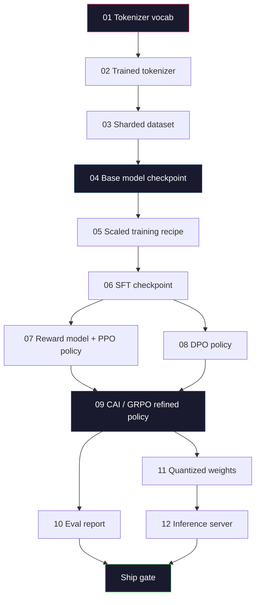
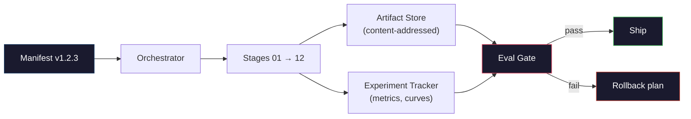

# 13 · 构建完整的 LLM 流水线

> 第 01 课到第 12 课的全部内容，都是同一条流水线中的某一个阶段。本课是把这些阶段串联成单次端到端运行的脚手架：分词、预训练、扩展、SFT、对齐、评测、量化、上线服务。你不会在一台笔记本上训练一个 70B 模型，而是要产出编排层、清单（manifest）、评测门禁（eval gate），以及一支 2026 年前沿团队用来决定「什么能发布」的回滚方案。这是收官之作（capstone）。

**类型：** 构建
**语言：** Python（标准库）
**前置：** 第 10 阶段全部课程 01-12
**时长：** 约 120 分钟

## 学习目标

- 把前面十一课（分词器、数据、预训练、扩展、SFT、RLHF、DPO、CAI、评测、量化、推理）组合成一份可复现的单一流水线规范
- 定义各阶段之间的产物契约（artifact contract）：每个阶段消费什么、产出什么，以及下一阶段如何验证输入
- 构建一个编排器（orchestrator），用于追踪实验、对产物做哈希，并以评测阈值作为发布决策的门禁
- 设计回滚方案：哪些产物重跑成本低、哪些昂贵，以及一个损坏的检查点（checkpoint）会付出什么代价

## 问题所在

前面每一课单独看都能跑通。分词器训好了，微型 GPT 预训练完了，SFT 数据集组装好了，奖励模型训好了，DPO 跑完了，评测测好了，量化权重导出了，推理服务起来了。但每一课都是一个独立的 notebook，各有各的约定、各有各的输出路径、各有各的随机种子。

一次前沿训练运行不是一个 notebook。Llama 3 405B 在大约 54 天里消耗了 3000 万 H100 小时，DeepSeek-V3 用了约 280 万 H800 小时。在这段时间里，一个损坏的检查点、一次数据污染、一次评测回归，都可能让团队损失一周的真实时间和一个月的 GPU 预算。团队赖以生存的，是流水线卫生（pipeline hygiene）：每个阶段都有确定的输入、确定的输出、一份清单、一个哈希、一道门禁。

这是收官之作。你不会在笔记本上端到端跑完整条流水线，而是要编写协调各阶段的编排器、描述本次运行的清单、为发布决策把关的校验器，以及一份让第三方能从单个文件重跑你全部工作的重放（replay）方案。代码量很小，但纪律很大。

这套模式从 100M 到 1T 参数规模一字不改地适用。同样的四个组件——清单、编排器、评测门禁、产物存储——既能跑 Llama 3，也能跑你的业余 GPT。区别只在每个阶段配置里数字的大小，而不在流水线的形状。

## 核心概念

### 十二个阶段

第 10 阶段的每一课都是一个阶段。下面是完整的依赖图。



阶段 07 和 08 可以并行运行，其余都是硬依赖。阶段 02（分词器）的任何改动都会让下游每一个产物失效；阶段 10（评测）的改动只会让发布决策失效。

### 清单（Manifest）

清单是一个单一文件，它对一次运行的描述完整到足以重放。流水线产出的任何东西，都不应依赖清单之外的状态。这些字段平淡无奇，但都是强制的。

```
pipeline_version: 1.2.3
seed: 42
git_commit: a1b2c3d4
stages:
  01_tokenizer:
    recipe: bpe_32k
    input_hash: sha256:...
    output_hash: sha256:...
    wall_clock_sec: 3600
    cost_usd: 12
```

第 N 阶段的输出哈希就是第 N+1 阶段的输入哈希。一旦出现偏差，流水线就停摆。这就是你尽早捕捉数据损坏的方式，也是身处另一个大陆的队友验证「他们的重放产出了与你相同产物」的方式。

实践中，团队会用一个小型 YAML 模式（schema），外加一个清单检查器，把它和上一次成功运行做差异比对。任何落在预期字段（成本、墙钟时间）之外的差异，都是红色警报。

### 产物类型化（Artifact Typing）

每个阶段的输出都是一个有类型的产物（typed artifact）。它不是一个目录大杂烩，不是一个 pickle，而是一个有已知模式（schema）的具名类型。

| 阶段 | 产物类型 | 关键字段 |
|-------|--------------|-----------|
| 01-02 | Tokenizer | vocab.json、merges.txt、config.json、hash |
| 03 | Dataset | shards[]、行数、token 数、去重统计 |
| 04-05 | Checkpoint | weights.safetensors、config.json、优化器状态、step 数 |
| 06 | SFT Model | checkpoint + SFT 配方 + 数据配比 |
| 07 | Reward Model | RM checkpoint + 偏好数据哈希 |
| 08-09 | Policy | checkpoint + 参考模型哈希 + beta + 已消耗的 KL 预算 |
| 10 | Eval Report | 基准分数 + 回归差异 + 评测数据哈希 |
| 11 | Quantized Model | 量化权重 + 校准数据 + 相对 FP16 的精度差 |
| 12 | Server Spec | endpoint + 模型哈希 + config + 可观测性钩子 |

类型化能防止最常见的失败模式：把一个阶段 08 的输出当作阶段 06 的输入，让一个经过 DPO 训练的模型走 SFT 通道。有类型的产物和有类型的阶段签名（stage signature）能把这类错误变成编译期失败，而不是第五天才暴露的灾难。

### 评测门禁（The Eval Gate）

「训练完成」不等于可以发布。「训练完成且评测门禁通过」才是可以发布。门禁在运行开始之前就定义好。

```
gates:
  mmlu:      >= baseline + 0.5   # 不允许回归
  humaneval: >= baseline + 1.0
  truthfulqa: >= baseline         # 不允许下降
  safety_refusal_rate: <= 0.05
  kl_from_reference: <= 25.0
  cost_total_usd: <= 50000
```

每一道门禁都是一个数值阈值。没有「看起来不错」式的门禁，没有主观的签字放行。如果每道门禁都通过，产物就被标记为可发布。如果任何一道门禁失败，本次运行就被搁置，需由一位具名审核者显式覆盖（override），而这个覆盖本身会被记录进清单。

两道门禁能拦住绝大多数灾难。一道*回归*门禁（新模型在核心基准上至少要不弱于上一个）能捕捉训练 bug；一道 *KL 预算*门禁（对齐后的策略相对其参考模型的漂移不得超过 X）能捕捉对齐「过火」。每一条生产流水线都两者兼备。

### 编排器（The Orchestrator）

这是一小段代码，负责读取清单、调度各阶段、追踪产物，并在任何契约违例时停摆。它不是 Airflow，不是 Kubeflow。为了流水线卫生，你想要的是一个平平无奇、由你自己写的东西。

编排器的职责很窄：

1. 从清单解析出 DAG。
2. 对每个阶段，检查预期输出是否已以正确哈希存在（若存在则跳过）。
3. 运行该阶段，捕获 stdout/stderr，测量墙钟时间和成本。
4. 把输出哈希与下游阶段的预期输入哈希做校验。
5. 失败时，写出一份带有确切失败阶段的部分清单，并以非零状态退出。

这大约是 200 行 Python。它看起来会像本课中的文件 `code/main.py`。在底层，真实流水线会用 `torchrun` 或 `ray` 在集群上执行单个阶段，但编排器本身跑在单台机器上。

### 实验追踪与产物存储

有两个外部系统为流水线锚定。

**实验追踪器（wandb、neptune、mlflow）。** 按阶段记录损失曲线、评测指标、系统遥测。当你三周后需要比较运行 A 与运行 B 时，就去追踪器里看。团队几乎总是用托管追踪器——自己造轮子浪费的时间本应投入训练。

**产物存储（S3、R2、GCS）。** 用于检查点、数据集、分词器、评测报告的不可变对象存储。产物按哈希寻址，而不是按文件名。像 `latest.pt` 这样的文件名是个会走火的坑；`ckpt-7b-step-20000-sha256:abc123.safetensors` 才是一份契约。

编排器同时写入这两者。追踪器给看图表的人用；产物存储给查找输入的下一阶段用。

### 成本核算（Costing）

一次前沿运行都附带一个美元数字。预算纪律体现在两个地方。

**运行前估算。** 从清单出发，计算预期 FLOPs（预训练为：6 × 参数量 × token 数）、预期 GPU 小时数（FLOPs / 峰值吞吐 / 利用率），以及按当前租赁价折算的美元成本。如果估算超出预算门禁，流水线拒绝启动。

**运行中追踪。** 逐阶段的墙钟时间和成本被记入清单。每个阶段结束后都会核对剩余预算。如果某个阶段超支，下一阶段的门禁会用新的剩余预算来评估。你不会等到投资人打电话来时才发现钱花光了。

Llama 3 公布的成本是 6100 万美元；DeepSeek-V3 公布主预训练运行为 560 万美元。这个比值主要来自硬件效率加上混合专家（mixture-of-experts）——但之所以能看到具体成本，是因为两支团队都是按阶段（而非按整次运行）追踪的。

### 可复现 vs 确定性

这两者并不相同。*可复现*（reproducible）意味着同一份清单加同一份代码加同一套基础设施，能产出一个下游指标等价的检查点。*确定性*（deterministic）意味着逐比特一致的输出。

现代 LLM 训练是可复现的，但不是确定性的。分布式训练的归约顺序（reduce-order）、GPU 内核的非确定性（cuBLAS、flash-attn）、混合精度舍入叠加在一起，会让两次运行产出的浮点数在 1e-5 量级上有差异。对最终指标而言这没问题，因为指标不会因此变动；但如果你想用比特级 diff 来调试，这就是致命的。解法是记录每个阶段的输入哈希、输出哈希和头部指标（headline metrics）——只要这些匹配，即便权重不是逐比特一致，本次运行就算「复现成功」。



### 回滚方案（Rollback Plan）

在运行开始之前，就写下每个阶段失败时该怎么办。分三类。

- **重跑成本低**（小时级）：分词器、评测、量化、推理服务。直接重跑即可。
- **中等**（天级）：SFT、DPO、CAI。保留基础模型，只重跑对齐阶段。
- **昂贵**（周级、数百万美元）：预训练。这里的回滚方案不是「重跑」，而是「用上一个完好的检查点，并用修订后的数据重跑成本更低的下游阶段」。

因为阶段依赖是有类型且有哈希的，编排器可以自动计算回滚集合：让失败阶段及其每一个后代都失效。阶段 06（SFT）失败会让 06、07、08、09、10、11、12 失效；阶段 11（量化）失败只会让 11 和 12 失效。提前把它写清楚，能避免团队在凌晨 4 点筋疲力尽时临场拍脑袋。

### 2026 年观察到的生产配方

大多数前沿团队都收敛到了同一套骨架。

- 分词器：128k BPE 加字节回退（byte fallback）。在一个小而均衡的多语种切片上训练。
- 预训练：10-20T token，以网页加代码加合成数据为主。Muon 或 AdamW 优化器。FSDP2 或 DeepSpeed ZeRO-3。梯度检查点。BF16 权重、FP32 主副本。
- SFT：50 万-200 万条指令对，人工与合成混合，并对评测集做严格去重。
- 对齐：DPO 或 CAI + GRPO。仅在偏好信号维度太高、DPO 难以处理时才用 RLHF。
- 评测：MMLU-Pro、MATH、HumanEval+、GPQA、SWE-Bench Verified、LiveBench，外加一套外界永远看不到的私有保留集。
- 量化：上线服务用 4-bit GPTQ 或 AWQ；在精度差至关重要的安全评测中用 8-bit。
- 服务：vLLM、TensorRT-LLM 或自研。连续批处理（continuous batching）。投机解码（speculative decoding）。KV 缓存驱逐（KV cache eviction）。

这些数字每半年就变一次，但骨架不变。

## 动手构建

本课的代码是一个编排器加一个清单检查器，而不是十二个训练脚本。每个阶段都用一个占位符（placeholder）模拟，它产出一个具有正确形状和哈希的输出产物。端到端跑通编排器，能在你为真实阶段烧 GPU 钱之前，证明流水线的管路是通的。

完整实现见 `code/main.py`。关键部分：

- `Manifest` dataclass：流水线版本、种子、git commit、各阶段、各门禁。
- `Stage` dataclass：名称、类型、输入（哈希）、输出（哈希）、墙钟时间、成本。
- `Orchestrator.run()`：解析 DAG、调度阶段、校验哈希、更新清单。
- `EvalGate.check()`：读取阈值，与最新评测报告比对，返回通过/失败。
- `ArtifactStore`（内存桩实现）：按哈希 put/get，模拟 S3。
- `CostTracker`：逐阶段与累计，超出上限时停摆。

`main.py` 中的流水线运行十二个占位阶段，产出一份清单，并触发一道失败的评测门禁，以展示一次被搁置的运行长什么样。把每个占位符替换成对应课程里的真实训练脚本，你就拥有了一条真实前沿流水线所用的骨架。

## 实际使用

标准工作流有三条命令。

```
python code/main.py plan    # 校验清单、计算成本估算、打印 DAG
python code/main.py run     # 执行各阶段，写入 manifest.out.yaml
python code/main.py gate    # 读取 manifest.out.yaml，施加评测门禁，发布或搁置
```

每次都先跑 `plan`。大多数流水线 bug 都在 plan 阶段暴露——缺失的门禁阈值、过期的哈希、预算超支。跑 `plan` 是免费的，跑 `run` 很贵。在便宜的一侧捕捉 bug，省钱。

`gate` 的输出要么是 `SHIP`，要么是 `HOLD: <原因>`。被搁置的运行不是失败，而是一个决策点。一位具名审核者要么覆盖（且覆盖会被记录），要么批准回滚。

## 交付物

本课产出 `outputs/skill-llm-pipeline-reviewer.md`。把一份提议的流水线清单喂给它，它会检查所有契约：阶段类型化、哈希链、门禁、回滚方案、成本估算。它会拒绝批准缺少评测门禁、KL 预算无上界、或混用了评测数据与训练数据的清单。

## 练习

1. 扩展编排器以支持阶段 07 和 08 的并行执行。使用标准库 `concurrent.futures` 模块。确认最终清单同时记录了两个阶段的输出，且阶段 09 的输入哈希是这两者的确定性组合。

2. 增加一道「污染检查（contamination check）」门禁。给定评测数据集哈希和训练数据集分片，计算重叠（精确字符串匹配或 13-gram 匹配）。当重叠超过 0.1% 时门禁失败。喂给它一个被污染的训练集，确认门禁搁置了该运行。

3. 从第一性原理实现一个成本估算器。对阶段 04（预训练），把 FLOPs 估算为 6 × 参数量 × token 数，假设在 H100（BF16 989 TFLOPs）上达到 40% MFU（模型 FLOPs 利用率），租金为每 GPU 小时 2.50 美元。报告一个在 2T token 上训练的 7B 模型的估算值，并与公布的 Llama 2 数字对比。

4. 构建一次部分回滚。模拟阶段 09（CAI）失败，然后重跑阶段 09 到 12，同时让 01-08 保持缓存。编排器应当按哈希检测到缓存产物并跳过它们。测量相对完整重跑节省的墙钟时间。

5. 加入可观测性。为每个阶段发出 OpenTelemetry span，附带参数量、已见 token 数、损失、成本等属性。把这些 span 输送到一个本地 collector。重点不在仪表盘，而在于每个阶段的健康状况都能从单个 trace ID 追溯。

## 关键术语

| 术语 | 大家怎么说 | 它实际指什么 |
|------|----------------|----------------------|
| Manifest（清单） | 「配方文件」 | 描述流水线版本、种子、逐阶段配置和门禁阈值的 YAML 或 JSON——足以重放一次运行 |
| Content-addressed（内容寻址） | 「按哈希而非按名字」 | 产物按其内容的 SHA-256 存储，因此你永远不会把版本 A 和版本 B 搞混 |
| Eval gate（评测门禁） | 「发布标准」 | 基准指标和安全分数上的数值阈值，必须通过后产物才被标记为可发布 |
| KL budget（KL 预算） | 「对齐漂了多远」 | 跨对齐阶段累计的 KL(policy ‖ reference) 上限，作为门禁强制执行 |
| MFU | 「你用掉了多少 GPU」 | 模型 FLOPs 利用率（Model FLOPs Utilization）——实际达到的 FLOPs 除以理论峰值。70B 规模典型为 40%，7B 为 55% |
| Rollback plan（回滚方案） | 「坏了之后怎么办」 | 每个阶段失败时预先写好的动作集合：重跑、回退、用修订输入重训 |
| Orchestrator（编排器） | 「指挥」 | 读取清单、调度阶段、校验哈希、在任何契约违例时停摆的进程 |
| Artifact store（产物存储） | 「给权重用的带版本 S3」 | 不可变的内容寻址对象存储——检查点、数据集、评测报告的单一真相来源 |
| Reproducible（可复现） | 「重放时指标相同」 | 比特级权重不同但下游指标等价——分布式 LLM 训练的现实目标 |
| Cost gate（成本门禁） | 「你不能超过 X」 | 运行前成本估算加运行中追踪器——估算超预算则流水线拒绝启动 |

## 延伸阅读

- [Dubey 等，2024 ——《The Llama 3 Herd of Models》](https://arxiv.org/abs/2407.21783) —— 对一条前沿流水线最详尽的公开描述，涵盖数据、训练、对齐、评测
- [DeepSeek-AI，2024 ——《DeepSeek-V3 Technical Report》](https://arxiv.org/abs/2412.19437) —— 效率优先的流水线，成本约为 Llama 3 级训练的十分之一
- [Kaplan 等，2020 ——《Scaling Laws for Neural Language Models》](https://arxiv.org/abs/2001.08361) —— 最初的算力-数据-参数扩展关系
- [Hoffmann 等，2022 ——《Training Compute-Optimal Large Language Models (Chinchilla)》](https://arxiv.org/abs/2203.15556) —— 对 Kaplan 的修正，重新校准了现代数据预算
- [PyTorch FSDP2 文档](https://pytorch.org/docs/stable/fsdp.html) —— PyTorch 2.4+ 中取代 FSDP1 的分布式训练原语
- [Weights & Biases LLM Reports](https://wandb.ai/site/llms) —— 开源 LLM 运行的真实清单与实验追踪器输出，可作为可借鉴的模板
