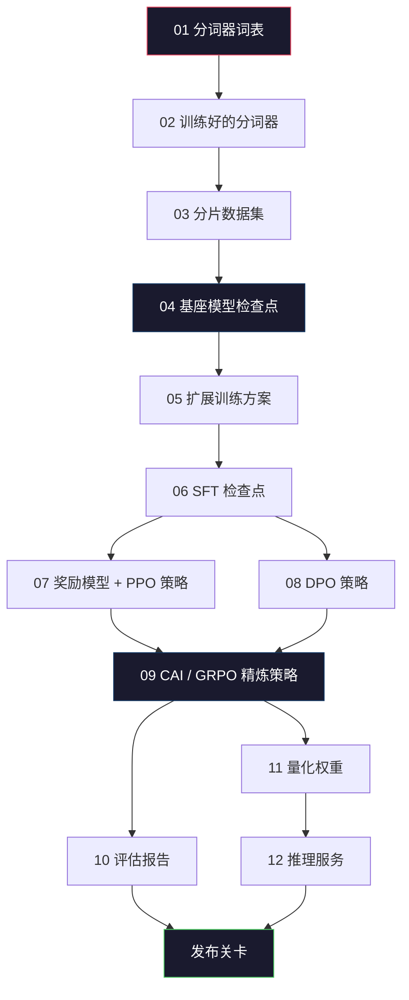
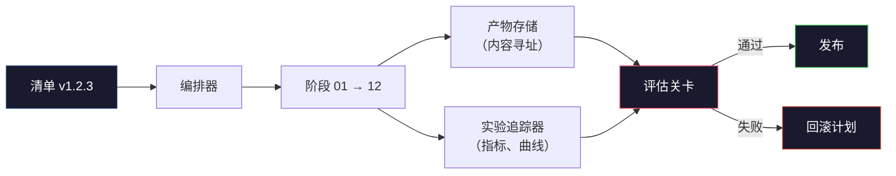

# 构建完整的 LLM 流水线

> 第 01 课到第 12 课的每一课都是一个流水线中的一个阶段。本课是将这些阶段整合为一次完整的端到端运行的脚手架：分词、预训练、扩展、SFT、对齐、评估、量化、服务。你不会在笔记本电脑上训练一个 70B 的模型。你将产出编排层、清单、评估关卡和回滚计划——这些正是一个 2026 年的前沿团队用来决定发布什么的内容。这是顶点项目。

**类型：** 构建  
**语言：** Python（标准库）  
**前置条件：** 阶段 10 全部课程 01-12  
**时长：** 约 120 分钟

## 学习目标

- 将前面的十一课（分词器、数据、预训练、扩展、SFT、RLHF、DPO、CAI、评估、量化、推理）组合成一个可复现的流水线规范
- 定义阶段间的产物契约：每个阶段消费什么、产出什么，以及下一阶段如何验证输入
- 构建一个追踪实验、对产物进行哈希处理、并根据评估阈值门控发布决策的编排器
- 设计回滚计划：哪些产物容易重新运行，哪些代价高昂，以及一个损坏的检查点会造成什么损失

## 问题

前面的每一课都是独立工作的。分词器训练好了。小型 GPT 预训练好了。SFT 数据集组装好了。奖励模型训练好了。DPO 运行过了。评估测量过了。量化权重导出了。推理服务启动好了。每一课都是一个笔记本。每一课都有自己的约定、自己的输出路径、自己的随机种子。

前沿训练运行不是一个笔记本。Llama 3 405B 在约 54 天内消耗了 3000 万 H100 小时。DeepSeek-V3 使用了约 280 万 H800 小时。在此期间，一个损坏的检查点、一次数据污染、一次评估回归，都可能让团队损失一周的挂钟时间和一个月的 GPU 预算。团队能撑下来的办法是流水线卫生学：每个阶段都有确定的输入、确定的输出、一个清单、一个哈希值、一个关卡。

这是顶点项目。你不会在笔记本电脑上端到端地运行整个流水线。你将编写协调各阶段的编排器、描述运行的清单、门控发布决策的验证器，以及让第三方能从一个文件重放你工作的回放计划。代码量不大；但纪律性要求很高。

该模式从 100M 参数扩展到 1T 参数无需更改。同样的四个组件——清单、编排器、评估关卡、产物存储——既驱动 Llama 3，也驱动你的爱好 GPT。区别在于每个阶段配置中的数字大小，而不是流水线的形状。

## 概念

### 十二个阶段

每个阶段 10 的课程都是一个阶段。以下是完整的依赖图。


```mermaid
graph TD
    S1["01 分词器词表"] --> S2["02 训练好的分词器"]
    S2 --> S3["03 分片数据集"]
    S3 --> S4["04 基座模型检查点"]
    S4 --> S5["05 扩展训练方案"]
    S5 --> S6["06 SFT 检查点"]
    S6 --> S7["07 奖励模型 + PPO 策略"]
    S6 --> S8["08 DPO 策略"]
    S7 --> S9["09 CAI / GRPO 精炼策略"]
    S8 --> S9
    S9 --> S10["10 评估报告"]
    S9 --> S11["11 量化权重"]
    S11 --> S12["12 推理服务"]
    S10 --> GATE["发布关卡"]
    S12 --> GATE

    style S1 fill:#1a1a2e,stroke:#e94560,color:#fff
    style S4 fill:#1a1a2e,stroke:#0f3460,color:#fff
    style S9 fill:#1a1a2e,stroke:#0f3460,color:#fff
    style GATE fill:#1a1a2e,stroke:#51cf66,color:#fff
```

阶段 07 和 08 可以并行运行。其他所有阶段都是硬依赖。阶段 02（分词器）的一个更改会使所有下游产物失效。阶段 10（评估）的一个更改仅会使发布决策失效。

### 清单

清单是一个单一文件，足以完整描述一次运行以供回放。流水线产出的任何内容都不应依赖于清单中不存在的状态。这些字段很枯燥，但不可或缺。

```
pipeline_version: 1.2.3
seed: 42
git_commit: a1b2c3d4
stages:
  01_tokenizer:
    recipe: bpe_32k
    input_hash: sha256:...
    output_hash: sha256:...
    wall_clock_sec: 3600
    cost_usd: 12
```

阶段 N 的输出哈希就是阶段 N+1 的输入哈希。任何偏差都会导致流水线停止。这就是你及早发现数据损坏的方法。这也是身处不同大陆的队友验证他们的重放是否产生了与你相同的产物的方式。

实践中，团队会使用一个小型 YAML 模式加上一个清单检查器，将其与前一次成功运行的结果进行对比。预期字段（成本、挂钟时间）之外的任何差异都是一个危险信号。

### 产物类型化

每个阶段的输出都是一个类型化的产物。不是一个目录 blob，不是一个 pickle 文件，而是一个具有已知模式的命名类型。

| 阶段 | 产物类型 | 关键字段 |
|-------|---------|--------|
| 01-02 | 分词器 | vocab.json, merges.txt, config.json, hash |
| 03 | 数据集 | shards[], row count, token count, dedup stats |
| 04-05 | 检查点 | weights.safetensors, config.json, optimizer state, step count |
| 06 | SFT 模型 | checkpoint + SFT recipe + data mix |
| 07 | 奖励模型 | RM checkpoint + preference data hash |
| 08-09 | 策略 | checkpoint + reference hash + beta + KL budget consumed |
| 10 | 评估报告 | benchmark scores + regression diffs + eval data hash |
| 11 | 量化模型 | quantized weights + calibration data + accuracy delta vs FP16 |
| 12 | 服务规范 | endpoint + model hash + config + observability hooks |

类型化防止了最常见的失败模式：将阶段 08 的输出用作阶段 06 的输入，通过 SFT 路径发布一个 DPO 训练过的模型。类型化的产物和类型化的阶段签名使得这些错误成为编译时失败，而不是第五天的失败。

### 评估关卡

发布不是"训练完成了"。发布是"训练完成了且评估关卡通过了"。关卡在运行开始之前就已定义。

```
gates:
  mmlu:      >= baseline + 0.5   # 无回归
  humaneval: >= baseline + 1.0
  truthfulqa: >= baseline         # 无下降
  safety_refusal_rate: <= 0.05
  kl_from_reference: <= 25.0
  cost_total_usd: <= 50000
```

每个关卡都是一个数值阈值。没有"看起来不错"的关卡。没有主观签字。如果每个关卡都通过，产物就被标记为可发布。如果有任何关卡失败，运行将被搁置，等待指定的审查者明确覆盖，而覆盖本身也会记录在清单中。

两个关卡能捕获大多数灾难。一个*回归*关卡（新模型在核心基准上必须至少与前一模型一样好）能捕获训练错误。一个*KL 预算*关卡（对齐后的策略不能偏离其参考策略超过 X）能捕获对齐过度。每个生产流水线都有这两者。

### 编排器

一小段代码，读取清单、调度阶段、追踪产物，并在任何契约违背后停止。这不是 Airflow。这不是 Kubeflow。对于流水线卫生学，你需要一些你亲手编写的、枯燥但可靠的东西。

编排器的职责范围很窄：

1. 从清单中解析 DAG。
2. 对于每个阶段，检查预期的输出是否已经存在且哈希值正确（如果存在则跳过）。
3. 运行阶段，捕获 stdout/stderr，测量挂钟时间和成本。
4. 验证输出哈希是否与下游阶段预期的输入哈希匹配。
5. 失败时，写入一个包含确切失败阶段的局部清单，并以非零退出。

这大约是 200 行 Python。它看起来就像本课的 `code/main.py` 文件。在底层，真正的流水线使用 `torchrun` 或 `ray` 在集群上执行各个阶段，但编排器本身运行在单台机器上。

### 实验追踪与产物存储

两个外部系统支撑着流水线。

**实验追踪器（wandb、neptune、mlflow）。** 记录损失曲线、评估指标、每个阶段的系统遥测数据。追踪器是你三周后需要比较运行 A 和运行 B 时要去的地方。团队几乎总是使用托管的追踪器——自己写会浪费本应用于训练的时间。

**产物存储（S3、R2、GCS）。** 用于检查点、数据集、分词器、评估报告的不可变对象存储。产物通过哈希值寻址，而不是通过文件名。像 `latest.pt` 这样的文件名是一个隐患；`ckpt-7b-step-20000-sha256:abc123.safetensors` 才是一个契约。

编排器同时写入两者。追踪器供人类查看图表。产物存储供下一阶段查找输入。

### 成本核算

前沿运行有一个美元数字与之挂钩。预算纪律体现在两个地方。

**运行前预估。** 从清单中计算预期的 FLOPs（预训练：6 × 参数 × 词元数）、预期的 GPU 小时数（FLOPs / 峰值吞吐量 / 利用率），以及按当前租赁费率计算的美元成本。如果预估超过预算关卡，流水线拒绝启动。

**运行中追踪。** 每个阶段的挂钟时间和成本都记录到清单中。在每个阶段之后，检查剩余预算。如果某个阶段超支，下一个阶段的关卡将使用新的剩余预算进行评估。你不会等到 VC 打电话时才发现钱不够了。

Llama 3 报告的发布成本为 6100 万美元。DeepSeek-V3 报告的主要预训练运行成本为 560 万美元。这个比率主要是硬件效率加上混合专家模型——但具体的成本数据可见，是因为两个团队都按阶段追踪成本，而不是按整个运行追踪。

### 可复现性与确定性

这两者不是一回事。*可复现*意味着相同的清单加上相同的代码加上相同的基础设施，能产生一个在下游指标上等价的检查点。*确定性*意味着比特级相同的输出。

现代 LLM 训练是可复现的，但不是确定性的。分布式训练的 reduce 顺序、GPU 内核非确定性（cuBLAS、flash-attn）以及混合精度舍入，共同产生的浮点数在运行之间会相差 1e-5 级别。这对于不会变动的最终指标来说是可以接受的。但如果你试图通过比特级差异来调试，那就是灾难性的。解决方法是记录每个阶段的输入哈希、输出哈希和主要指标——如果这些匹配，即使权重不是比特级相同的，运行也被视为"可复现的"。


```mermaid
graph LR
    M["清单 v1.2.3"] --> O["编排器"]
    O --> S["阶段 01 → 12"]
    S --> AS["产物存储\n（内容寻址）"]
    S --> ET["实验追踪器\n（指标、曲线）"]
    AS --> GATE["评估关卡"]
    ET --> GATE
    GATE -->|通过| SHIP["发布"]
    GATE -->|失败| ROLL["回滚计划"]

    style M fill:#1a1a2e,stroke:#0f3460,color:#fff
    style GATE fill:#1a1a2e,stroke:#e94560,color:#fff
    style SHIP fill:#1a1a2e,stroke:#51cf66,color:#fff
    style ROLL fill:#1a1a2e,stroke:#c0392b,color:#fff
```

### 回滚计划

在开始运行之前，写下每个阶段失败时的应对措施。分为三类。

- **容易重新运行**（数小时）：分词器、评估、量化、推理服务。直接重新运行即可。
- **中等**（数天）：SFT、DPO、CAI。保留基座模型；只重新运行对齐阶段。
- **代价高昂**（数周和数百万美元）：预训练。这里的回滚计划不是"重新运行"，而是"使用最后一个好的检查点，用修订后的数据重新运行较便宜的下游阶段"。

由于阶段依赖关系是类型化和哈希化的，编排器可以自动计算回滚集合：使失败阶段及其所有后代失效。阶段 06（SFT）的失败会使 06、07、08、09、10、11、12 失效。阶段 11（量化）的失败仅使 11 和 12 失效。提前明确这一点，可以避免在团队凌晨 4 点筋疲力尽时临时拼凑方案。

### 2026 年观察到的生产方案

大多数前沿团队都收敛到了相同的骨架。

- **分词器：** 128k BPE，带字节回退。在小而平衡的多语言切片上训练。
- **预训练：** 10-20T 词元，主要是网页加代码加合成数据。Muon 或 AdamW 优化器。FSDP2 或 DeepSpeed ZeRO-3。梯度检查点。BF16 权重，FP32 主权重。
- **SFT：** 50 万到 200 万条指令对，混合人工和合成数据，对评估集进行严格去重。
- **对齐：** DPO 或 CAI + GRPO。仅当偏好信号维度过多而 DPO 无法处理时才使用 RLHF。
- **评估：** MMLU-Pro、MATH、HumanEval+、GPQA、SWE-Bench Verified、LiveBench，加上一个公众从未见过的私有保留集。
- **量化：** 推理用 4-bit GPTQ 或 AWQ，安全评估用 8-bit（此时精度差异很重要）。
- **服务：** vLLM、TensorRT-LLM 或自研。连续批处理。推测解码。KV 缓存淘汰。

数字每六个月变化一次。骨架不变。

```figure
beam-search
```

## 构建它

本课的代码是一个编排器和一个清单检查器，而不是十二个训练脚本。每个阶段都用一个占位符模拟，该占位符生成具有正确形状和哈希值的输出产物。端到端地运行编排器可以证明流水线的管道在你将 GPU 资金投入到真正的阶段之前是正常工作的。

完整的实现见 `code/main.py`。关键组成部分：

- `Manifest` 数据类：流水线版本、随机种子、Git 提交、阶段、关卡。
- `Stage` 数据类：名称、类型、输入（哈希值）、输出（哈希值）、挂钟时间、成本。
- `Orchestrator.run()`：解析 DAG、调度阶段、验证哈希值、更新清单。
- `EvalGate.check()`：读取阈值、与最新评估报告比较、返回通过/失败。
- `ArtifactStore`（内存存根）：按哈希值存/取，模拟 S3。
- `CostTracker`：按阶段和累计成本，超出上限时停止。

`main.py` 中的流水线运行十二个占位阶段，生成一个清单，并演示一个失败的评估关卡以展示被搁置的运行是什么样的。将每个占位符替换为对应课程中的真实训练脚本，你就得到了真正的 frontier 流水线所使用的骨架。

## 使用它

标准工作流程包含三个命令。

```
python code/main.py plan    # 验证清单，计算成本预估，打印 DAG
python code/main.py run     # 执行阶段，写入 manifest.out.yaml
python code/main.py gate    # 读取 manifest.out.yaml，应用评估关卡，发布或搁置
```

每次先运行 `plan`。大多数流水线错误在计划阶段就会暴露——缺失的关卡阈值、过期的哈希值、预算超支。运行 `plan` 是免费的。运行 `run` 是昂贵的。通过在便宜的阶段捕捉错误来省钱。

`gate` 的输出要么是 `SHIP`（发布），要么是 `HOLD: <原因>`（搁置：<原因>）。被搁置的运行不是失败；它是一个决策点。指定的审查者要么覆盖（覆盖会被记录），要么批准回滚。

## 交付它

本课产出一个 `outputs/skill-llm-pipeline-reviewer.md` 文件。向其输入一个提议的流水线清单，它会检查所有契约：阶段类型、哈希链、关卡、回滚计划、成本预估。对于缺少评估关卡、无界 KL 预算、或混合使用评估数据与训练数据的运行，它会拒绝批准清单。

## 练习

1. 扩展编排器以支持阶段 07 和 08 的并行执行。使用标准库的 `concurrent.futures` 模块。确认最终清单记录了这两个阶段的输出，并且阶段 09 的输入哈希是两者的确定性组合。

2. 添加一个"污染检查"关卡。给定评估数据集哈希值和训练数据集分片，计算重叠度（精确字符串匹配或 13-gram 匹配）。如果重叠度超过 0.1%，关卡失败。输入一个受污染的训练集，确认关卡搁置了运行。

3. 从基本原理实现一个成本估算器。对于阶段 04（预训练），将 FLOPs 估算为 6 × 参数 × 词元数，假设 H100 上 40% 的 MFU（模型 FLOPs 利用率），H100 的 BF16 峰值为 989 TFLOPs，GPU 小时单价为 2.50 美元。报告在 2T 词元上训练的 7B 模型的估算值。与已发布的 Llama 2 数据进行比较。

4. 构建一个部分回滚。模拟阶段 09（CAI）的失败，然后重新运行阶段 09 到 12，同时保留阶段 01-08 的缓存。编排器应通过哈希检测缓存的产物并跳过它们。测量与完全重新运行相比节省的挂钟时间。

5. 添加可观测性。为每个阶段发出 OpenTelemetry span，附带参数、已见词元数、损失和成本等属性。将 span 发送到本地收集器。目的不是仪表板；目的是每个阶段的健康状况都可以从一个单一的 trace ID 追溯。

## 关键术语

| 术语 | 人们通常说的 | 实际含义 |
|------|-----------|--------|
| 清单 (Manifest) | "配方文件" | 描述流水线版本、随机种子、每个阶段配置和关卡阈值的 YAML 或 JSON——足以重放一次运行 |
| 内容寻址 (Content-addressed) | "按哈希值而非名称" | 产物按其内容的 SHA-256 存储，因此永远不会混淆版本 A 和版本 B |
| 评估关卡 (Eval gate) | "发布标准" | 基准指标和安全分数上的数值阈值，必须通过这些阈值才能将产物标记为可发布 |
| KL 预算 (KL budget) | "对齐漂移了多少" | 对齐阶段中累计 KL(策略 || 参考)的上限，作为关卡强制执行 |
| MFU | "你用了多少 GPU" | 模型 FLOPs 利用率——实际达到的 FLOPs 除以理论峰值。70B 规模下典型值为 40%，7B 规模下为 55% |
| 回滚计划 (Rollback plan) | "出问题了怎么办" | 每个阶段在失败时预先写好的应对措施：重新运行、回退、用修订后的输入重新训练 |
| 编排器 (Orchestrator) | "指挥" | 读取清单、调度阶段、验证哈希值、在任何契约违背后停止的进程 |
| 产物存储 (Artifact store) | "存放权重的版本化 S3" | 不可变的内容寻址对象存储——检查点、数据集、评估报告的单一事实来源 |
| 可复现 (Reproducible) | "回放时相同指标" | 不同的比特级权重但等价的下游指标——分布式 LLM 训练的务实目标 |
| 成本关卡 (Cost gate) | "你不能超过 X" | 运行前成本预估加运行中追踪器——如果预估超过预算，流水线拒绝启动 |

## 延伸阅读

- [Dubey et al., 2024 -- "The Llama 3 Herd of Models"](https://arxiv.org/abs/2407.21783) —— 关于前沿流水线（包括数据、训练、对齐、评估）最详细的公开描述
- [DeepSeek-AI, 2024 -- "DeepSeek-V3 Technical Report"](https://arxiv.org/abs/2412.19437) —— 以效率为先的流水线，成本约为 Llama 3 级训练的十分之一
- [Kaplan et al., 2020 -- "Scaling Laws for Neural Language Models"](https://arxiv.org/abs/2001.08361) —— 原始的计算-数据-参数扩展关系
- [Hoffmann et al., 2022 -- "Training Compute-Optimal Large Language Models (Chinchilla)"](https://arxiv.org/abs/2203.15556) —— 对 Kaplan 的修正，重新校准了现代数据预算
- [PyTorch FSDP2 文档](https://pytorch.org/docs/stable/fsdp.html) —— 在 PyTorch 2.4+ 中取代 FSDP1 的分布式训练原语
- [Weights & Biases LLM 报告](https://wandb.ai/site/llms) —— 开源 LLM 运行的真实清单和实验追踪器输出，可作为可抄袭的模板
