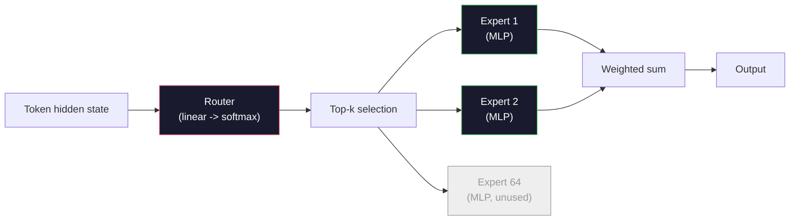

# オープンモデル: アーキテクチャ詳解

> Lesson 04 で GPT-2 Small を scratch から構築しました。2026年の frontier open models は、同じ family に 5つか 6つの具体的な変更を加えたものです。LayerNorm ではなく RMSNorm。GELU ではなく SwiGLU。learned positions ではなく RoPE。full MHA ではなく GQA または MLA。scale した Mixture-of-Experts。すでに知っている math で、それらの 95% は説明できます。このレッスンでは Llama 3、DeepSeek-V3、Mixtral、Qwen、Gemma を横に並べ、各 architecture が分岐する正確な line に名前を付けます。

**種類:** Learn
**言語:** Python (stdlib)
**前提条件:** Phase 10, Lessons 04, 05, 12 (Pre-training, Scaling, Inference)
**所要時間:** 約45分

## 学習目標

- Llama 3、Mistral、Mixtral、Gemma 2、Qwen 2.5、DeepSeek-V3 の config.json を読み、すべての field を説明する
- 各 model が GPT-2 Small に対して行った具体的な architectural change に名前を付け、first principles から正当化する
- config だけから任意の open model の parameter count、KV cache size、activation memory を計算する
- latency、memory、capability constraints が与えられた deployment target に対して、適切な open model を選ぶ

## 問題

Lesson 04 では 350行の numpy を書き、GPT-2-shaped model を作りました。Llama 3 405B には 200ページの technical report があります。直感的には、これらは別物のように見えます。しかし違います。その 200ページは、同じ object に対して、よく動機づけられた 5つか 6つの modification と、scaling に関する多数の implementation details を説明しているだけです。skeleton、つまり embedding、transformer blocks、attention、MLP、norm、head は変わりません。

このレッスンは diff です。主要な open model family ごとに、GPT-2 から何が変わったか、なぜ変わったか、何を cost として払ったかを正確に並べます。終わる頃には、新しい model card を読み、それを頭の中で GPT-2 baseline に戻して理解できるようになります。

実務上の payoff は、Meta が Llama 5 を release したり DeepSeek が V4 を release したりしても、新しい mental model が不要になることです。config を見て、既知の knob のどれが動いたかを見れば、downstream implications が分かります。2026年の architectures は有限の toolbox です。各 new model はその異なる subset を選んでいます。

## コンセプト

### 変わらない core

すべての autoregressive open models は以下を共有しています。

- Token embedding matrix (vocab_size x hidden_dim)。
- N 個の decoder blocks の stack: norm、self-attention、residual、norm、MLP、residual。
- vocab_size に project する final norm と linear head (embeddings と weight-tied されることが多い)。
- Causal mask、next-token cross-entropy loss。

これが shape です。残りは knobs です。

### 実際に動く 6つの knobs

2024-2026 年のすべての frontier open model で、同じ 6つの design choices が何度も選ばれています。

1. **Normalization。** LayerNorm -> RMSNorm。
2. **Positional encoding。** Learned absolute -> RoPE (variants: YaRN、NTK)。
3. **Activation。** GELU -> SwiGLU (または GeGLU)。
4. **Attention head sharing。** MHA -> GQA -> MQA -> MLA。
5. **Dense vs sparse MLP。** Dense -> Mixture-of-Experts。
6. **Pre-norm placement。** Pre-norm は残る。Post-norm は消えた。

その他すべて (learning rate schedule、data mix、batch size、context length) は training config に属し、architecture ではありません。6つの knobs です。

### Knob 1: RMSNorm

LayerNorm は mean を subtract し、std で割り、scale と shift を行います。RMSNorm は scale だけを残します。

```
RMSNorm(x) = x / sqrt(mean(x^2) + eps) * gamma
```

mean subtraction はありません。bias もありません。token ごとに matmul が 1つ少なくなります。Zhang and Sennrich (2019) は、machine translation で LayerNorm と同等の性能を出しつつ 10% 速いと主張しました。現代の open model はすべてこれを使っています。

Cost: なし。Benefit: 小さな throughput 改善、より単純な code。

### Knob 2: RoPE

learned position embeddings は GPT-2 では 1024-slot lookup table でした。context 1025 は table の外です。models は training length を超えて extrapolate できません。

Rotary Position Embedding (RoPE, Su et al. 2021) は、attention dot product の前に各 Q と K vector を pair ごとに回転させることで position を注入します。rotation angle は position の deterministic function なので、learned なものはなく、尽きる table もありません。scaling tricks (NTK-aware interpolation、YaRN) により、8k context で train した model を inference 時に 128k まで伸ばしても、accuracy loss は modest です。

```
q_rotated = rotate(q, angle(pos))
k_rotated = rotate(k, angle(pos))
score = q_rotated . k_rotated
```

Llama、Mistral、Qwen、DeepSeek、Gemma はすべて RoPE を使います。Gemma 2 は hybrid (多くの layers では RoPE、他では local sliding-window attention) を使います。

### Knob 3: SwiGLU

GPT-2 の MLP は `x -> gelu(xW1 + b1) -> (...)W2 + b2` です。SwiGLU (Shazeer 2020) は activation を gated product に置き換えます。

```
SwiGLU(x) = (xW1) * sigmoid(xW1) * xV
```

1つではなく 2つの projection を parallel に行い、Swish activation で gate します。経験的には parameter あたりの perplexity が強くなります。Llama 2 が採用し、全員が追随しました。MLP の hidden size は通常、total parameter count が元の dense MLP と一致するように設定されます。GPT-2 が `ff_dim = 4 * hidden` を使っていたなら、SwiGLU は `ff_dim = (2/3) * 4 * hidden = 8/3 * hidden` を使います。

### Knob 4: Attention Head Sharing

GPT-2 は **Multi-Head Attention (MHA)** を使いました。各 head が独自の Q、K、V projection を持ちます。

**Multi-Query Attention (MQA, Shazeer 2019)** は、すべての heads で 1つの K と 1つの V を共有します。KV cache を num_heads 分削減します。典型的な model では 12x から 32x の削減です。hard benchmarks では accuracy がわずかに落ちます。

**Grouped-Query Attention (GQA, Ainslie et al. 2023)** は中間点です。G groups の Q heads が 1つの K と 1つの V を共有します。Llama 3 8B は 32 Q heads と 8 KV heads (G=8) の GQA を使うため、full MHA と比べて KV cache は 4x 小さくなります。

**Multi-Head Latent Attention (MLA, DeepSeek 2024)** は、K と V を shared low-rank latent に compress し、head ごとに再 projection します。KV cache をさらに削減しつつ、per-head expressiveness を保ちます。DeepSeek-V2 と V3 は long-context performance のためにこれに依存しています。

| Scheme | KV Heads | KV Cache | Accuracy |
|--------|----------|----------|----------|
| MHA    | num_heads | full | best |
| GQA    | num_groups (G < num_heads) | num_heads / G reduction | near-MHA |
| MQA    | 1 | num_heads reduction | small hit |
| MLA    | latent, per-head decompression | smaller than MQA | near-MHA |

約 13B parameters を超える model では、GQA または MLA は実質的に必須です。scale した full MHA は KV cache disaster です。

### Knob 5: Mixture of Experts

dense MLP は、すべての token で全 parameter を activate します。MoE MLP は block ごとに K 個の experts と router を持ち、token ごとに top-k experts を選びます (通常 top-2)。その token の forward pass を見るのは、それらの experts の weights だけです。

```
router_logits = xW_r
indices, weights = top_k(router_logits, k=2)
output = sum_i weights[i] * expert[indices[i]](x)
```

魅力は、7B size の experts を 64 個持てる (つまり total param count は巨大になる) 一方で、token ごとには 2個だけを実行する (つまり per-token compute は dense 7B model と同程度になる) ことです。Mixtral 8x7B は total 47B parameters ですが、token ごとに activate するのは 13B だけです。DeepSeek-V3 は total 671B parameters ですが、token ごとに activate するのは 37B だけです。



Pros: 同じ compute でより多くの parameters、より高い capacity。Cons: expert memory はどこかに置かなければならない (そのため serving には dense equivalent より多い VRAM が必要)、router の load-balancing が難しい、alignment 中に router を fine-tune すること自体が research area である。

### Knob 6: Pre-norm は残る

original transformer は各 sublayer の後に layer norm を適用しました。GPT-2 以降のすべての open model は、それを各 sublayer の*前*に置きます。Pre-norm は depth が増えても明らかに train しやすいです。議論の余地はありません。

### Model-by-Model Diff

これを具体化する table が以下です。

| Model | Year | Total Params | Active Params | Norm | Activation | Position | Attention | MoE | Context |
|-------|------|-------------|---------------|------|-----------|----------|-----------|-----|---------|
| GPT-2 Small | 2019 | 124M | 124M | LayerNorm | GELU | Learned | MHA (12 heads) | no | 1k |
| Llama 3 8B | 2024 | 8B | 8B | RMSNorm | SwiGLU | RoPE | GQA (32/8) | no | 128k |
| Llama 3 70B | 2024 | 70B | 70B | RMSNorm | SwiGLU | RoPE | GQA (64/8) | no | 128k |
| Llama 3 405B | 2024 | 405B | 405B | RMSNorm | SwiGLU | RoPE | GQA (128/16) | no | 128k |
| Mistral 7B | 2023 | 7.2B | 7.2B | RMSNorm | SwiGLU | RoPE | GQA | no | 32k |
| Mixtral 8x7B | 2023 | 47B | 13B | RMSNorm | SwiGLU | RoPE | GQA | yes (8 experts, top-2) | 32k |
| Gemma 2 9B | 2024 | 9B | 9B | RMSNorm (pre+post) | GeGLU | RoPE + sliding | GQA | no | 8k |
| Qwen 2.5 72B | 2024 | 72B | 72B | RMSNorm | SwiGLU | RoPE (YaRN) | GQA (64/8) | no | 128k |
| DeepSeek V2 236B | 2024 | 236B | 21B | RMSNorm | SwiGLU | RoPE | MLA | yes (160 experts, top-6) | 128k |
| DeepSeek V3 | 2024 | 671B | 37B | RMSNorm | SwiGLU | RoPE | MLA | yes (256 experts, top-8) | 128k |

columns を見てください。RMSNorm は universal です。SwiGLU またはその cousin である GeGLU も universal です。RoPE も universal です。7B を超えると、MLA に置き換えられる場合を除き GQA が universal です。top end での differentiator は MoE です。

### config.json を読む

Llama 3 8B config:

```
{
  "hidden_size": 4096,
  "intermediate_size": 14336,
  "num_hidden_layers": 32,
  "num_attention_heads": 32,
  "num_key_value_heads": 8,
  "max_position_embeddings": 131072,
  "rope_theta": 500000.0,
  "rms_norm_eps": 1e-5,
  "vocab_size": 128256
}
```

すべての field は、すでに実装したものに対応しています。

- `hidden_size`: embedding dimension。
- `intermediate_size`: MLP hidden size (3.5x hidden、SwiGLU math)。
- `num_hidden_layers`: stack depth。
- `num_attention_heads`: Q heads。
- `num_key_value_heads`: KV heads (GQA)。
- `max_position_embeddings`: training context length。
- `rope_theta`: RoPE base frequency。Meta は long-context extrapolation のため、default 10k から 500k に scale しました。
- `rms_norm_eps`: numerical stability。
- `vocab_size`: tokens。

これらだけから total parameters、KV cache、peak activation memory を計算できます。exact formulas は `code/main.py` を参照してください。

### Activation memory budget

数 billion parameters を超える training では、activations が training memory を支配します。pre-training の rule of thumb (gradient checkpointing あり) は以下です。

```
activation_mem ~ batch_size * seq_len * hidden_size * num_layers * bytes_per_element
```

Llama 3 8B で batch 1、seq 8192、BF16、32 layers、hidden 4096 の場合、checkpointing ありで activations だけで約 8 GB、なしで 40 GB です。だから flash-attention と ring-attention が重要です。attention computation を書き換え、activations が収まるようにします。

### KV Cache budget

max context での inference では以下です。

```
kv_cache = 2 * num_layers * num_kv_heads * head_dim * max_seq_len * bytes_per_element
```

Llama 3 8B、128k context、BF16、head_dim = hidden / num_heads = 128 の場合:
`2 * 32 * 8 * 128 * 131072 * 2 = 17.2 GB` per sequence。

8B weights は BF16 で 16 GB です。単一 128k sequence の KV cache は weights より大きくなります。これが GQA、MLA、KV cache quantization research を動かしている memory pressure です。

### 各 model が勝つ場面

- **Single 80GB GPU, no MoE**: Llama 3 8B、Mistral 7B、Gemma 2 9B。serving が簡単で tooling が広い。
- **Single node (8x80GB), big capacity**: Llama 3 70B、Qwen 2.5 72B。最高水準の dense open capability。
- **Biggest open capability, accept MoE complexity**: DeepSeek V3、Mixtral 8x22B。active FLOP あたりの capability が最良。
- **Long-context needs**: Llama 3 (RoPE scaling で 128k)、DeepSeek (MLA advantage)。
- **Low-latency serving**: Gemma 2 9B (sliding window が long-context compute を削減)。

## 作ってみる

このレッスンの code は calculator です。任意の config.json を与えると、component ごとの parameter count、max context での KV cache、SwiGLU MLP ratio、architecture に関する短い verdict (dense / GQA / MLA / MoE) を出力します。

```python
config = {
    "hidden_size": 4096, "intermediate_size": 14336,
    "num_hidden_layers": 32, "num_attention_heads": 32,
    "num_key_value_heads": 8, "vocab_size": 128256,
    "max_position_embeddings": 131072,
}
```

script は architecture の field を 1つずつ辿り、embedding、attention (GQA reduction あり)、MLP (SwiGLU expansion あり)、layernorms、head の param counts を計算します。次に指定された context length での KV cache を計算し、summary を出力します。

実装は `code/main.py` を参照してください。

## 使ってみる

script に bundled されている Llama 3 8B、Mistral 7B、Mixtral 8x7B、DeepSeek V3 configs で calculator を実行します。parameter breakdowns を比較してください。MoE models は total param count が dense models を大きく上回る一方で、active param count はしばしば小さいことに注目してください。DeepSeek V3 の total parameters は Llama 3 405B より多いにもかかわらず、KV cache は Llama 3 405B より小さいことにも注目してください。これが MLA の効果です。

次に、local にある任意の model の config を差し込み、summary を読み、自分の GPU に収まるか判断してください。

## Ship It

このレッスンは `outputs/skill-open-model-picker.md` を生成します。deployment target (GPU type、VRAM、context length、latency budget) と task profile (chat、code、reasoning、long-context) が与えられると、open model、Lesson 11 の quantization scheme、Lesson 12 の inference stack を recommendation し、6つの architectural knobs に関する明示的な reasoning を添えます。

## 演習

1. HuggingFace から Qwen 2.5 72B config を読んでください。total parameters を scratch から計算します。HF-reported value と比較し、delta がある場合はその理由 (head dim rounding、KV sharing factor など) を特定してください。

2. DeepSeek V3 は 256 experts と top-8 routing を使います。activated experts と total experts の ratio を計算し、Mixtral 8x7B の top-2 of 8 と比較してください。sparse (25%) から denser sparse (3%) への shift は capacity per FLOP について何を意味しますか。

3. Llama 3 405B の 128k context における KV cache を FP8 と BF16 で計算してください。FP8 では BF16 の半分です。単一 8xH100 node (各 80GB = total 640GB、weight memory を除く) で何本の parallel sequences を serve できますか。

4. Gemma 2 は full-attention layers と sliding-window-attention layers を交互に使います。半分の layers が full context ではなく 4096-token sliding window を使う場合の KV cache の math を書いてください。8k total context でどれだけ memory を節約できますか。

5. このレッスンが書かれた後に release された recent frontier open model を見つけてください。その model が 6つの knobs のどれを選んだか、そして seventh knob を導入したかどうかを特定してください。new architecture が ship された瞬間に curriculum は古く見えるはずです。goal は mental model を作り直さずに table を update することです。

## 重要用語

| 用語 | よくある言い方 | 実際の意味 |
|------|----------------|----------------------|
| RMSNorm | 「mean なしの LayerNorm」 | root mean square だけで normalize し、learned scale を持つ。LayerNorm より安く、同等に近い |
| RoPE | 「rotary positions」 | 各 Q と K vector を position に依存する角度で 2D pairs ごとに回転する。scaling tricks により training length を超えて extrapolate できる |
| SwiGLU | 「新しい MLP activation」 | Swish を使う gated linear unit: `(xW1) * sigmoid(xW1) * xV`。2024+ の open model では標準 |
| GQA | 「middle ground attention」 | Grouped-Query Attention: G groups の Q heads が 1つの K head と 1つの V head を共有する。MQA の accuracy hit なしに KV cache を縮小する |
| MLA | 「DeepSeek の attention」 | Multi-Head Latent Attention: K/V を shared low-rank latent に compress し、head ごとに decompress する。large models で最小級の KV cache |
| MoE | 「sparse experts」 | Mixture of Experts: block ごとに N 個の MLP を持ち、router が token ごとに top-k を選ぶ。total params は巨大、active params は小さい |
| Top-k routing | 「token ごとに k experts を選ぶ」 | router が expert ごとに score を計算し、上位 k 個を activate する。typical k は 2 (Mixtral) から 8 (DeepSeek) |
| YaRN | 「RoPE を伸ばす」 | Yet another RoPE extension。rotary angles を interpolate し、inference 時に context を 8k から 128k+ へ拡張する |
| Sliding-window attention | 「全部には attend しない」 | 各 token が直近 W tokens にだけ attend する。attention cost を token あたり O(W) に抑える。Gemma 2 と early Mistral で使用 |
| Active params | 「token ごとに実行されるもの」 | MoE models で、token ごとに forward pass を見る parameter count (total params より大幅に小さい)。per-token FLOPs を支配する |

## 参考文献

- [Dubey et al., 2024 -- "The Llama 3 Herd of Models"](https://arxiv.org/abs/2407.21783) -- dense Llama 3 family の architecture と training の reference
- [DeepSeek-AI, 2024 -- "DeepSeek-V3 Technical Report"](https://arxiv.org/abs/2412.19437) -- MLA、auxiliary-loss-free load balancing、671B MoE
- [Jiang et al., 2024 -- "Mixtral of Experts"](https://arxiv.org/abs/2401.04088) -- canonical MoE open model paper
- [Su et al., 2021 -- "RoFormer: Enhanced Transformer with Rotary Position Embedding"](https://arxiv.org/abs/2104.09864) -- RoPE paper
- [Shazeer, 2020 -- "GLU Variants Improve Transformer"](https://arxiv.org/abs/2002.05202) -- SwiGLU、GeGLU、および related variants
- [Ainslie et al., 2023 -- "GQA: Training Generalized Multi-Query Transformer Models"](https://arxiv.org/abs/2305.13245) -- GQA paper
- [Gemma 2 Team, 2024 -- "Gemma 2: Improving Open Language Models at a Practical Size"](https://arxiv.org/abs/2408.00118) -- hybrid full+sliding attention、pre+post-norm
- [Qwen Team, 2024 -- "Qwen 2.5 Technical Report"](https://arxiv.org/abs/2412.15115) -- YaRN context extension と long-context training recipes
