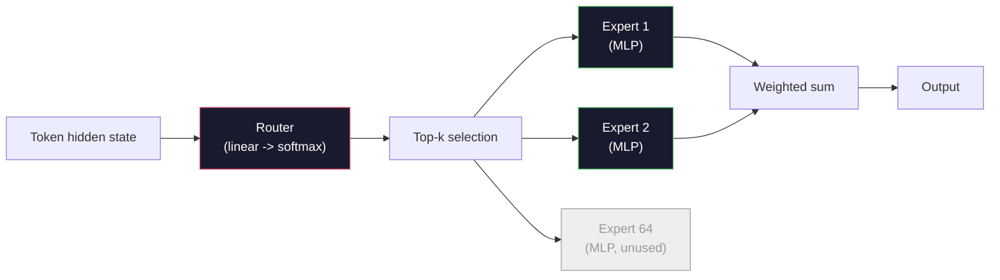

# Açık Modeller: Mimari Çözüm Yolları

> Ders 04'te sıfırdan bir GPT-2 Small oluşturdunuz. 2026'daki Frontier açık modeller, beş veya altı somut değişiklikle aynı ailedir. LayerNorm yerine RMSNorm. GELU yerine SwiGLU. Öğrenilen pozisyonlar yerine RoPE. Tam MHA yerine GQA veya MLA. Geniş ölçekte Uzmanların Karması. Zaten bildiğiniz matematik bunların %95'ini kapsıyor. Bu ders, Llama 3, DeepSeek-V3, Mixtral, Qwen ve Gemma'yı yan yana okur ve her mimarinin farklılaştığı çizgiyi tam olarak adlandırır.

**Tür:** Öğren
**Diller:** Python (stdlib)
**Önkoşullar:** Aşama 10, Dersler 04, 05, 12 (Eğitim Öncesi, Ölçeklendirme, Inference)
**Süre:** ~45 dakika

## Öğrenme Hedefleri

- Llama 3, Mistral, Mixtral, Gemma 2, Qwen 2.5 ve DeepSeek-V3'ün config.json'sini okuyun ve her alanı açıklayın
- Her modelin GPT-2 Small'a göre yaptığı belirli mimari değişikliği adlandırın ve bunu ilk ilkelere göre gerekçelendirin
- Yalnızca yapılandırmasından herhangi bir açık model için parametre sayısını, KV önbellek boyutunu ve etkinleştirme belleğini hesaplayın
- Gecikme, bellek ve yetenek kısıtlamaları dikkate alındığında deployment hedefi için doğru açık modeli seçin

## Sorun

Ders 04'te 350 satır numpy yazdınız ve GPT-2 şeklinde bir modele sahip oldunuz. Llama 3 405B'nin 200 sayfalık teknik raporu bulunmaktadır. İçgüdüleriniz bunların farklı canavarlar olduğu yönünde. Değiller. 200 sayfa, aynı nesneyi beş veya altı iyi motive edilmiş değişiklikle ve ayrıca ölçeklendirmeyle ilgili binlerce uygulama ayrıntısıyla anlatıyor. İskelet - embedding, transformer bloklar, dikkat, MLP, norm, kafa - değişmedi.

Bu ders bir farktır. Her büyük açık model ailesi için GPT-2'ye göre neyin değiştiğini, nedenini ve maliyetini tam olarak listeliyoruz. İşiniz bittiğinde yeni bir model kartı okuyabilir ve onu zihinsel olarak GPT-2 temel çizgisine çevirebilirsiniz.

Pratik getirisi şu ki, Meta Llama 5'i veya DeepSeek V4'ü yayınladığında yeni bir zihinsel modele ihtiyacınız olmayacak. Yapılandırmaya bakacak, iyi bilinen düğmelerden hangilerinin hareket ettiğini görecek ve bunun aşağı yönlü etkilerinin neler olduğunu bileceksiniz. 2026 mimarileri sınırlı bir araç kutusudur. Her yeni model farklı bir alt kümeyi seçer.

## Konsept

### Değişmez Çekirdek

Tüm otoregresif açık modeller şunları paylaşır:

- Token embedding matrisi (vocab_size x Hidden_dim).
- N kod çözücü blok yığını: norm, kişisel dikkat, artık, norm, MLP, artık.
- Son norm ve vocab_size'ye yansıtılan doğrusal kafa (genellikle embedding'lerle ağırlık bağlantılıdır).
- Nedensel maske, sonraki-token çapraz entropi kaybı.

Şekil budur. Gerisi düğmelerdir.

### Aslında Hareket Eden Altı Düğme

Her 2024-2026 sınır açık modelinde aynı altı tasarım seçeneği tekrar tekrar seçiliyor:

1. **Normalleştirme.** KatmanNormu -> RMSNorm.
2. **Konumsal kodlama.** Öğrenilen mutlak -> RoPE (artı değişkenler: YaRN, NTK).
3. **Etkinleştirme.** GELU -> SwiGLU (veya GeGLU).
4. **Baş paylaşımına dikkat.** MHA -> GQA -> MQA -> MLA.
5. **Yoğun ve seyrek MLP.** Yoğun -> Uzmanların Karması.
6. **Norm öncesi yerleştirme.** Norm öncesi konaklamalar. Post-norm bitti.

Diğer her şey (öğrenme hızı çizelgesi, veri karışımı, toplu iş boyutu, bağlam uzunluğu) mimaride değil eğitim yapılandırmasında bulunur. Altı düğme.

### Düğme 1: RMSNorm

LayerNorm ortalamayı çıkarır, std'ye, ölçeklere ve kaydırmalara böler. RMSNorm yalnızca ölçeği tutar:

```
RMSNorm(x) = x / sqrt(mean(x^2) + eps) * gamma
```

Ortalama çıkarma yok. Önyargı yok. token başına bir matmul daha az. Zhang ve Sennrich (2019), makine çevirisinde LayerNorm ile eşleştiğini ve %10 daha hızlı olduğunu savundu. Her modern açık model bunu çalıştırır.

Maliyet: yok. Avantajı: küçük çıktı kazancı, daha basit kod.

### Düğme 2: Halat

Öğrenilen konum embedding'ler, GPT-2'de 1024 yuvalı bir arama tablosuydu. Bağlam 1025 tablonun sonundadır. Modeller eğitim sürelerinin ötesinde tahminde bulunamaz.

Döner Konum Embedding (RoPE, Su ve diğerleri 2021), her Q ve K vektörünü dikkat nokta çarpımından önce çiftler halinde döndürerek konumu enjekte eder. Dönme açısı, konumun deterministik bir fonksiyonudur, dolayısıyla öğrenilecek veya bitecek hiçbir şey yoktur. Ölçeklendirme hileleriyle (NTK uyumlu enterpolasyon, YaRN), 8k bağlamında eğitilmiş bir model, mütevazı bir doğruluk kaybıyla inference'de 128k'ye kadar uzanabilir.

```
q_rotated = rotate(q, angle(pos))
k_rotated = rotate(k, angle(pos))
score = q_rotated . k_rotated
```

Her Llama, Mistral, Qwen, DeepSeek ve Gemma RoPE kullanır. Gemma 2 bir hibrit kullanıyor (çoğu katmanda RoPE, diğerlerinde yerel kayan pencere dikkati).

### Düğme 3: SwiGLU

GPT-2'nin MLP'si `x -> gelu(xW1 + b1) -> (...)W2 + b2`'dir. SwiGLU (Shazeer 2020), aktivasyonu kapılı bir ürünle değiştirir:

```
SwiGLU(x) = (xW1) * sigmoid(xW1) * xV
```

Swish aktivasyonu tarafından kapılanan bir yerine paralel iki projeksiyon. Parametre başına şaşkınlık konusunda ampirik olarak daha güçlü. Lama 2 bunu benimsedi ve herkes onu takip etti. MLP'nin gizli boyutu genellikle toplam parametre sayısı orijinal yoğun MLP ile eşleşecek şekilde ayarlanır: GPT-2 `ff_dim = 4 * hidden` kullanıyorsa, SwiGLU `ff_dim = (2/3) * 4 * hidden = 8/3 * hidden` kullanır.

### Düğme 4: Dikkat Kafa Paylaşımı

GPT-2 kullanıldı **Çok Kafalı Dikkat (MHA)**: her kafanın kendi Q, K, V projeksiyonu vardır.

**Çoklu Sorgu Dikkati (MQA, Shazeer 2019)** tüm kafalarda bir K ve bir V'yi paylaşır. KV önbelleğini num_heads oranında keser; bu, tipik bir modelde 12 ila 32 kat arası bir azalmadır. Doğruluk, sert benchmark'lerde biraz düşer.

**Gruplandırılmış Sorgu Dikkati (GQA, Ainslie ve diğerleri 2023)** orta yoldur: Q kafalarının G grupları bir K ve bir V'yi paylaşır. Llama 3 8B, 32 Q kafası ve 8 KV kafası (G=8) ile GQA kullanır, dolayısıyla KV önbelleği tam MHA'ya kıyasla 4 kat küçülür.

**Çok Kafalı Gizli Dikkat (MLA, DeepSeek 2024)**, K ve V'yi paylaşılan düşük dereceli bir gizli olarak sıkıştırarak onları kişi başına yukarıya yansıtır. Kafa başına ifade gücünü korurken KV önbelleğini daha da azaltır. DeepSeek-V2 ve V3, uzun bağlam performansları için buna güveniyor.

| Şema | KV Başkanları | KV Önbellek | Doğruluk |
|--------|----------|----------|----------|
| MHA | num_heads | dolu | en iyi |
| GQA | sayı_grupları (G < sayı_kafalar) | num_heads / G azaltma | MHA'ya yakın |
| MQA | 1 | num_heads azaltma | küçük vuruş |
| MLA | gizli, kafa başına dekompresyon | MQA'dan daha küçük | MHA'ya yakın |

~13B parametrelerinin üzerindeki herhangi bir model için GQA veya MLA fiilen zorunludur. Geniş ölçekte tam MHA, bir KV önbellek felaketidir.

### Düğme 5: Uzmanların Karışımı

Yoğun bir MLP, her token için tüm parametrelerini etkinleştirir. Bir MoE MLP'de blok başına K uzman ve token başına en iyi k uzmanları (genellikle ilk 2) seçen bir yönlendirici bulunur. Yalnızca uzmanların ağırlıkları bu token için ileri bir geçiş görüyor.

```
router_logits = xW_r
indices, weights = top_k(router_logits, k=2)
output = sum_i weights[i] * expert[indices[i]](x)
```

Cazibe: token başına yalnızca 2 tanesini çalıştırırken (yani token başına hesaplama yoğun bir 7B modeliyle eşleşirken) her biri 7B boyutunda 64 uzmana sahip olabilirsiniz (yani toplam parametre sayısı çok büyüktür). Mixtral 8x7B'nin toplam 47B parametresi vardır ancak token başına yalnızca 13B'yi etkinleştirir. DeepSeek-V3'ün toplam 671B parametresi vardır ancak token başına yalnızca 37B'yi etkinleştirir.



Artıları: aynı hesaplama, daha fazla parametre, daha iyi kapasite. Eksileri: Uzman belleğinin hâlâ bir yerlerde yaşaması gerekiyor (bu nedenle hizmet vermek, yoğun bir eşdeğerden daha fazla VRAM gerektirir), yönlendiricinin yük dengelemesi zordur ve hizalama sırasında yönlendiricinin fine-tuning kendi araştırma alanıdır.

### Düğme 6: Norm öncesi konaklamalar

Her alt katmandan sonra orijinal transformer uygulanan katman normu. GPT-2'den bu yana her açık model, onu her alt katmanın *öncesine* yerleştirir. Ön normun derinlemesine eğitilmesi kesinlikle daha kolaydır. Tartışılacak bir şey yok.

### Modelden Modele Fark

İşte tüm bunları somutlaştıran tablo.

| Modeli | Yıl | Toplam Parametreler | Etkin Parametreler | Norm | Aktivasyon | Pozisyon | Dikkat | MEB | Bağlam |
|-------|------|-------------|---------------|------|-----------|----------|-----------|-----|---------|
| GPT-2 Küçük | 2019 | 124M | 124M | Katman Normu | GEL | Öğrenildi | MHA (12 kafa) | hayır | 1k |
| Lama 3 8B | 2024 | 8B | 8B | RMSNormu | SwiGLU | halat | DKG (32/8) | hayır | 128k |
| Lama 3 70B | 2024 | 70B | 70B | RMSNormu | SwiGLU | halat | DKG (64/8) | hayır | 128k |
| Lama 3 405B | 2024 | 405B | 405B | RMSNormu | SwiGLU | halat | DKG (128/16) | hayır | 128k |
| Mistral 7B | 2023 | 7.2B | 7.2B | RMSNormu | SwiGLU | halat | GQA | hayır | 32k |
| Karışımtral 8x7B | 2023 | 47B | 13B | RMSNormu | SwiGLU | halat | GQA | evet (8 uzman, ilk 2) | 32 bin |
| Gemma 2 9B | 2024 | 9B | 9B | RMSNorm (ön+sonra) | GeGLU | RoPE + sürgülü | GQA | hayır | 8k |
| Qwen 2.5 72B | 2024 | 72B | 72B | RMSNormu | SwiGLU | HALAT (YaRN) | DKG (64/8) | hayır | 128k |
| DeepSeek V2 236B | 2024 | 236B | 21B | RMSNormu | SwiGLU | halat | MLA | evet (160 uzman, ilk 6) | 128k |
| DeepSeek V3 | 2024 | 671B | 37B | RMSNormu | SwiGLU | halat | MLA | evet (256 uzman, ilk 8) | 128k |

Sütunları tarayın. RMSNorm evrenseldir. SwiGLU veya GeGLU kuzeni evrenseldir. RoPE evrenseldir. GQA, MLA ile değiştirildiği durumlar dışında 7B'nin üzerinde evrenseldir. MoE en üst düzeyde farklılaştırıcıdır.

### config.json okuma

Lama 3 8B yapılandırması:

```
{
  "hidden_size": 4096,
  "intermediate_size": 14336,
  "num_hidden_layers": 32,
  "num_attention_heads": 32,
  "num_key_value_heads": 8,
  "max_position_embeddings": 131072,
  "rope_theta": 500000.0,
  "rms_norm_eps": 1e-5,
  "vocab_size": 128256
}
```

Her alan daha önce uyguladığınız bir şeye karşılık gelir.

- `hidden_size`: embedding boyutu.
- `intermediate_size`: MLP gizli boyutu (3,5x gizli -- SwiGLU matematiği).
- `num_hidden_layers`: yığın derinliği.
- `num_attention_heads`: Q tura.
- `num_key_value_heads`: KV kafaları (GQA).
- `max_position_embeddings`: eğitim bağlamı uzunluğu.
- `rope_theta`: RoPE temel frekansı. Meta, uzun bağlam ekstrapolasyonu için bunu varsayılan 10 bin'den 500 bin'e ölçeklendirdi.
- `rms_norm_eps`: sayısal kararlılık.
- `vocab_size`: token'ler.

Yalnızca bunlardan toplam parametreleri, KV önbelleğini ve tepe etkinleştirme belleğini hesaplarsınız. Tam formüller için `code/main.py`'ye bakın.

### Etkinleştirme belleği bütçesi

Aktivasyonlar, birkaç milyar parametrenin üzerinde eğitim hafızasına hakimdir. Eğitim öncesi için temel kural (gradient kontrol noktasıyla):

```
activation_mem ~ batch_size * seq_len * hidden_size * num_layers * bytes_per_element
```

Grup 1'deki Llama 3 8B için, sıra 8192, BF16, 32 katman, gizli 4096: yalnızca kontrol noktası içeren etkinleştirmeler için yaklaşık 8 GB, olmayan 40 GB. Ani dikkat ve halka dikkatin önemli olmasının nedeni budur; aktivasyonların uyması için dikkat hesaplamasını yeniden yazarlar.

### KV Önbellek bütçesi

Maksimum bağlamda inference için:

```
kv_cache = 2 * num_layers * num_kv_heads * head_dim * max_seq_len * bytes_per_element
```

128k bağlamda Llama 3 8B, BF16, head_dim = gizli / num_heads = 128:
Sıra başına `2 * 32 * 8 * 128 * 131072 * 2 = 17.2 GB`.

8B ağırlıkları BF16'da 16 GB'dir. Tek bir 128k dizi için KV önbelleği ağırlıklardan daha büyüktür. Bu, GQA, MLA ve KV önbellek niceleme araştırmasını yönlendiren bellek baskısıdır.

### Her Model Kazandığında

- **Tek 80 GB GPU, MoE yok**: Llama 3 8B, Mistral 7B, Gemma 2 9B. Servis edilmesi kolay, geniş takımlar.
- **Tek düğüm (8x80GB), büyük kapasite**: Llama 3 70B, Qwen 2.5 72B. En yüksek yoğun açık kapasite.
- **En büyük açık yetenek, MoE karmaşıklığını kabul eder**: DeepSeek V3, Mixtral 8x22B. Aktif FLOP başına en iyi yetenek.
- **Uzun bağlam ihtiyaçları**: Llama 3 (RoPE ölçeklendirmesi ile 128k), DeepSeek (MLA avantajı).
- **Düşük gecikmeli sunum**: Gemma 2 9B (kayan pencere, uzun bağlamlı bilgi işlemi keser).

```figure
rmsnorm-vs-layernorm
```

## İnşa Et

Dersin kodu bir hesap makinesidir. Herhangi bir config.json verildiğinde, bileşene göre parametre sayısını, maksimum bağlamda KV önbelleğini, SwiGLU MLP oranını ve mimariye ilişkin kısa bir kararı (yoğun / GQA / MLA / MoE) yazdırır.

```python
config = {
    "hidden_size": 4096, "intermediate_size": 14336,
    "num_hidden_layers": 32, "num_attention_heads": 32,
    "num_key_value_heads": 8, "vocab_size": 128256,
    "max_position_embeddings": 131072,
}
```

Komut dosyası, mimariyi alan alan dolaşır, embedding için parametre sayımlarını, dikkati (GQA azaltmayla), MLP'yi (SwiGLU genişletmeyle), katman normlarını ve kafayı hesaplar. Daha sonra belirtilen bağlam uzunluğunda KV önbelleğini hesaplar ve bir özet yazdırır.

Uygulama için `code/main.py`'ye bakın.

## Kullan onu

Hesap makinesini komut dosyasında bulunan Llama 3 8B, Mistral 7B, Mixtral 8x7B ve DeepSeek V3 yapılandırmalarında çalıştırın. Parametre dökümlerini karşılaştırın. MoE modellerinin, yoğun modelleri gölgede bırakan toplam parametre sayısına sahip olduğuna, ancak aktif parametre sayısının genellikle daha küçük olduğuna dikkat edin. DeepSeek V3'ün KV önbelleğinin, daha fazla toplam parametreye sahip olmasına rağmen Llama 3 405B'ninkinden daha küçük olduğuna dikkat edin; yani MLA iş başındadır.

Ardından yerel olarak sahip olduğunuz herhangi bir model için bir yapılandırma takın, özeti okuyun ve GPU'nuza uyup uymadığına karar verin.

## Gönderin

Bu ders `outputs/skill-open-model-picker.md`'yi üretir. Bir deployment hedefi (GPU türü, VRAM, bağlam uzunluğu, gecikme bütçesi) ve bir görev profili (sohbet, kod, akıl yürütme, uzun bağlam) göz önüne alındığında, altı mimari düğme hakkında açık gerekçelerle birlikte açık bir model, Ders 11'den bir niceleme şeması ve Ders 12'den bir inference yığını önerir.

## Egzersizler

1. HuggingFace'ten Qwen 2.5 72B yapılandırmasını okuyun. Toplam parametreleri sıfırdan hesaplayın. HF tarafından bildirilen değerle karşılaştırın ve herhangi bir deltanın nereden geldiğini belirleyin (kafa karartma yuvarlaması, KV paylaşım faktörü vb.).

2. DeepSeek V3, ilk 8 yönlendirmeye sahip 256 uzmandan yararlanır. Etkinleştirilen uzmanların toplam uzmanlara oranını hesaplayın ve Mixtral 8x7B'nin 8 üzerinden ilk 2'si ile karşılaştırın. Seyrek (%25)'ten daha yoğun seyrek (%3)'e geçiş FLOP başına kapasite hakkında ne anlama geliyor?

3. FP8 ve BF16'da 128k bağlamda Llama 3 405B için KV önbelleğini hesaplayın. FP8'de bu, BF16 sayısının yarısıdır. Tek bir 8xH100 düğümde kaç paralel dizi sunabilirsiniz (her biri 80 GB = toplam 640 GB, eksi ağırlık belleği)?

4. Gemma 2, tam dikkat ve kayan pencere dikkat katmanlarını dönüşümlü olarak kullanır. Katmanların yarısı tam bağlam yerine 4096-token kayan pencere kullandığında KV önbelleğinin matematiğini yazın. Bu, toplam 8k bağlamda ne kadar bellek tasarrufu sağlar?

5. Bu ders yazıldıktan sonra piyasaya sürülen yeni bir sınır açık modeli bulun. Altı düğmeden hangisini seçtiğini ve yedinci bir düğmeyi içerip sokmadığını belirleyin. Yeni bir mimari ortaya çıktığı anda müfredat güncelliğini yitirmiş gibi görünecektir; amaç, zihinsel modelinizi yeniden oluşturmadan tablonuzu güncellemektir.

## Anahtar Terimler

| Dönem | İnsanlar ne diyor | Aslında ne anlama geliyor |
|------|----------------|----------------------|
| RMSNormu | "Anlamı olmayan LayerNorm" | Öğrenilmiş bir ölçekle yalnızca kök ortalama kareye göre normalleştirme - daha ucuz ve LayerNorm ile karşılaştırılabilir |
| halat | "Döner konumlar" | Her Q ve K vektörünü konuma bağlı bir açıyla 2 boyutlu çiftler halinde döndürün; ölçeklendirme hileleriyle eğitim uzunluğunun ötesinde tahminler yapar |
| SwiGLU | "Yeni MLP aktivasyonu" | Swish'li geçitli lineer ünite: `(xW1) * sigmoid(xW1) * xV` — her 2024+ açık modelde standart |
| GQA | "Orta noktaya dikkat" | Gruplandırılmış Sorgu Dikkati: Q kafalarından oluşan G grupları bir K ve bir V kafasını paylaşıyor — MQA'nın doğruluk payı olmadan KV önbelleğini küçültüyor |
| MLA | "DeepSeek'in dikkati" | Çok Kafalı Gizli Dikkat: K/V'yi paylaşılan düşük dereceli bir gizliye sıkıştırın, kafa başına sıkıştırmayı açın — büyük modeller için en küçük KV önbelleği |
| MEB | "Seyrek uzmanlar" | Uzmanların Karışımı: Blok başına N MLP, yönlendirici token başına en iyi k'yi seçer — büyük toplam parametreler, küçük aktif parametreler |
| En iyi yönlendirme | "token başına k uzman seçin" | Yönlendirici, uzman başına bir puan hesaplar ve en yüksek k'yi etkinleştirir; tipik k, 2 (Mixtral) ila 8 (DeepSeek) |
| YaRN | "Halatı Uzat" | Yine başka bir RoPE uzantısı — inference zamanında bağlamı 8k'den 128k+'ya genişletmek için döner açıları enterpolasyona tabi tutar |
| Sürgülü pencere dikkati | "Her şeye katılmayın" | Her token yalnızca son W token'lerle ilgilenir; Gemma 2 ve erken Mistral |'da kullanılan token başına dikkat maliyetini O(W) olarak üstlenir.
| Aktif parametreler | "token başına ne çalışır?" | MoE modelleri için, token başına ileri geçiş gören parametre sayısı (toplam parametrelerden çok daha küçük) — token FLOP'ları yönetir |

## Daha Fazla Okuma

- [Dubey ve diğerleri, 2024 -- "The Llama 3 Herd of Models"](https://arxiv.org/abs/2407.21783) -- yoğun Llama 3 ailesi için mimari ve eğitim referansı
- [DeepSeek-AI, 2024 -- "DeepSeek-V3 Teknik Raporu"](https://arxiv.org/abs/2412.19437) -- MLA artı yardımcı kayıpsız yük dengeleme artı 671B MoE
- [Jiang ve diğerleri, 2024 -- "Uzmanların Karması"](https://arxiv.org/abs/2401.04088) -- kanonik MoE açık model makalesi
- [Su ve diğerleri, 2021 -- "RoFormer: Döner Konumlu Embedding ile Geliştirilmiş Transformer"](https://arxiv.org/abs/2104.09864) -- RoPE makalesi
- [Shazeer, 2020 -- "GLU Varyantları Transformer'yi İyileştiriyor"](https://arxiv.org/abs/2002.05202) -- SwiGLU, GeGLU ve arkadaşları
- [Ainslie ve diğerleri, 2023 -- "GQA: Genelleştirilmiş Çoklu Sorgu Transformer Modellerinin Eğitimi"](https://arxiv.org/abs/2305.13245) -- GQA makalesi
- [Gemma 2 Ekibi, 2024 -- "Gemma 2: Açık Dil Modellerini Pratik Boyutta İyileştirme"](https://arxiv.org/abs/2408.00118) -- hibrit tam+kayma dikkat, norm öncesi+sonrası
- [Qwen Team, 2024 -- "Qwen 2.5 Teknik Raporu"](https://arxiv.org/abs/2412.15115) -- YaRN bağlam uzantısı ve uzun bağlam eğitim tarifleri
