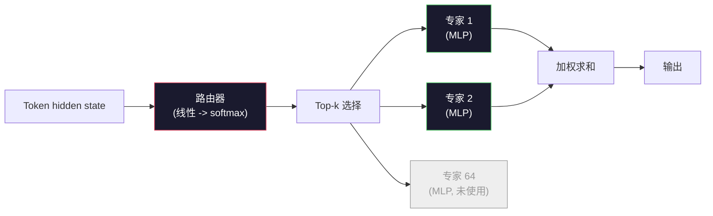

# 开放模型：架构走读

> 你在第 04 课从零构建了 GPT-2 Small。2026 年的前沿开放模型是同一个家族，有五到六个具体改动。RMSNorm 替代 LayerNorm。SwiGLU 替代 GELU。RoPE 替代学习的位置编码。GQA 或 MLA 替代完整 MHA。专家混合（MoE）用于扩展。你已知的数学覆盖了 95%。本课并排阅读 Llama 3、DeepSeek-V3、Mixtral、Qwen 和 Gemma，指出每种架构分叉的确切位置。

**类型：** 学习
**语言：** Python（标准库）
**前置要求：** 第 10 阶段，第 04、05、12 课（预训练、扩展、推理）
**时间：** ~45 分钟

## 学习目标

- 阅读 Llama 3、Mistral、Mixtral、Gemma 2、Qwen 2.5 和 DeepSeek-V3 的 config.json 并解释每个字段
- 说出每个模型相对于 GPT-2 Small 的具体架构改动，并从第一性原理论证它
- 仅从配置计算任何开放模型的参数数量、KV 缓存大小和激活内存
- 给定延迟、内存和能力约束，为部署目标选择合适的开放模型

## 问题

在第 04 课中，你写了 350 行 numpy 并得到了一个 GPT-2 形状的模型。Llama 3 405B 有一份 200 页的技术报告。你的直觉是这些是不同的野兽。它们不是。200 页描述的是同一个对象，有五到六个动机良好的修改，加上关于扩展的数千个实现细节。骨架 —— embedding、transformer block、attention、MLP、norm、head —— 未变。

本课是一个 diff。对于每个主要开放模型家族，我们列出相对于 GPT-2 的确切改动、原因和代价。完成后，你可以阅读一份新模型卡并在脑中将其翻译回 GPT-2 基线。

实际收益是，当 Meta 发布 Llama 5 或 DeepSeek 发布 V4 时，你不需要新的心智模型。你会查看配置，看到哪些已知旋钮移动了，并知道下游影响是什么。2026 年的架构是一个有限工具箱。每个新模型选择不同的子集。

## 核心概念

### 不变的核心

所有自回归开放模型共享：

- Token embedding 矩阵（vocab_size x hidden_dim）。
- N 个 decoder block 的堆叠：norm、self-attention、residual、norm、MLP、residual。
- 最终 norm 和线性 head 投影到 vocab_size（通常与 embedding 权重绑定）。
- Causal mask，next-token 交叉熵损失。

这是形状。其余是旋钮。

### 实际移动的六个旋钮

在每个 2024-2026 前沿开放模型中，相同的六个设计选择被反复挑选：

1. **归一化。** LayerNorm -> RMSNorm。
2. **位置编码。** 学习绝对位置 -> RoPE（加变体：YaRN、NTK）。
3. **激活函数。** GELU -> SwiGLU（或 GeGLU）。
4. **Attention head 共享。** MHA -> GQA -> MQA -> MLA。
5. **Dense vs 稀疏 MLP。** Dense -> Mixture-of-Experts。
6. **Pre-norm 放置。** Pre-norm 保留。Post-norm 消失。

其他一切（学习率调度、数据混合、batch size、上下文长度）存在于训练配置中，而非架构中。六个旋钮。

### 旋钮 1：RMSNorm

LayerNorm 减去均值，除以标准差，缩放并偏移。RMSNorm 只保留缩放：

```
RMSNorm(x) = x / sqrt(mean(x^2) + eps) * gamma
```

无均值减法。无偏置。每个 token 少一次 matmul。Zhang 和 Sennrich（2019）认为它在机器翻译上与 LayerNorm 匹配，同时快 10%。每个现代开放模型都运行它。

代价：无。收益：小吞吐量提升，更简单的代码。

### 旋钮 2：RoPE

学习的位置 embedding 在 GPT-2 中是一个 1024 槽的查找表。上下文 1025 就超出了表的末尾。模型无法外推到训练长度之外。

旋转位置编码（RoPE，Su et al. 2021）通过在 attention 点积之前将每个 Q 和 K 向量成对旋转来注入位置。旋转角度是位置的确定性函数，所以没有什么可学习的，也没有什么会用完。通过缩放技巧（NTK-aware 插值、YaRN），在 8k 上下文上训练的模型可以扩展到 128k 推理，精度损失适中。

```
q_rotated = rotate(q, angle(pos))
k_rotated = rotate(k, angle(pos))
score = q_rotated . k_rotated
```

每个 Llama、Mistral、Qwen、DeepSeek 和 Gemma 都使用 RoPE。Gemma 2 使用混合（大多数层用 RoPE，其他层用局部滑动窗口 attention）。

### 旋钮 3：SwiGLU

GPT-2 的 MLP 是 `x -> gelu(xW1 + b1) -> (...)W2 + b2`。SwiGLU（Shazeer 2020）用门控积替换激活：

```
SwiGLU(x) = (xW1) * sigmoid(xW1) * xV
```

两个投影并行而非一个，由 Swish 激活门控。经验上每参数困惑度更强。Llama 2 采用它，所有人跟随。MLP 的隐藏大小通常设置为总参数数量与原始 dense MLP 匹配：如果 GPT-2 使用 `ff_dim = 4 * hidden`，SwiGLU 使用 `ff_dim = (2/3) * 4 * hidden = 8/3 * hidden`。

### 旋钮 4：Attention Head 共享

GPT-2 使用 **Multi-Head Attention (MHA)**：每个 head 有自己的 Q、K、V 投影。

**Multi-Query Attention (MQA, Shazeer 2019)** 在所有 head 间共享一个 K 和一个 V。将 KV 缓存减少 num_heads，在典型模型上是 12 到 32 倍的缩减。在困难基准上精度略有下降。

**Grouped-Query Attention (GQA, Ainslie et al. 2023)** 是中间地带：G 组 Q head 共享一个 K 和一个 V。Llama 3 8B 使用 GQA，32 个 Q head 和 8 个 KV head（G=8），所以 KV 缓存相对于完整 MHA 缩减 4 倍。

**Multi-Head Latent Attention (MLA, DeepSeek 2024)** 将 K 和 V 压缩成共享的低秩潜在空间，每 head 再投影回来。进一步减少 KV 缓存，同时保留每 head 的表达能力。DeepSeek-V2 和 V3 依赖此实现其长上下文性能。

| 方案 | KV Heads | KV 缓存 | 精度 |
|--------|----------|----------|----------|
| MHA    | num_heads | 完整 | 最佳 |
| GQA    | num_groups (G < num_heads) | num_heads / G 缩减 | 接近 MHA |
| MQA    | 1 | num_heads 缩减 | 小损失 |
| MLA    | 潜在空间，每 head 解压 | 比 MQA 更小 | 接近 MHA |

对于任何超过 ~13B 参数的模型，GQA 或 MLA 实际上是强制的。大规模完整 MHA 是 KV 缓存灾难。

### 旋钮 5：专家混合

Dense MLP 为每个 token 激活其所有参数。MoE MLP 每 block 有 K 个专家和一个路由器，为每个 token 挑选 top-k 专家（通常是 top-2）。只有那些专家的权重看到该 token 的前向传播。

```
router_logits = xW_r
indices, weights = top_k(router_logits, k=2)
output = sum_i weights[i] * expert[indices[i]](x)
```

吸引力：你可以有 64 个大小为 7B 的专家（所以总参数量巨大），而每个 token 只运行 2 个（所以每 token 计算量与 dense 7B 模型匹配）。Mixtral 8x7B 有 47B 总参数但每个 token 只激活 13B。DeepSeek-V3 有 671B 总参数但每个 token 只激活 37B。



优点：相同计算，更多参数，更好容量。缺点：专家内存仍然需要存放在某处（所以服务需要比 dense 等效更多的 VRAM），路由器负载均衡很难，对齐期间微调路由器是其自己的研究领域。

### 旋钮 6：Pre-norm 保留

原始 transformer 在每个子层后应用 layer norm。自 GPT-2 以来的每个开放模型都将其放在每个子层*之前*。Pre-norm 在深度上严格更容易训练。无需争论。

### 逐模型 Diff

这是使所有这些具体化的表格。

| 模型 | 年份 | 总参数 | 激活参数 | 归一化 | 激活函数 | 位置编码 | Attention | MoE | 上下文 |
|-------|------|-------------|---------------|------|-----------|----------|-----------|-----|---------|
| GPT-2 Small | 2019 | 124M | 124M | LayerNorm | GELU | 学习 | MHA (12 heads) | 无 | 1k |
| Llama 3 8B | 2024 | 8B | 8B | RMSNorm | SwiGLU | RoPE | GQA (32/8) | 无 | 128k |
| Llama 3 70B | 2024 | 70B | 70B | RMSNorm | SwiGLU | RoPE | GQA (64/8) | 无 | 128k |
| Llama 3 405B | 2024 | 405B | 405B | RMSNorm | SwiGLU | RoPE | GQA (128/16) | 无 | 128k |
| Mistral 7B | 2023 | 7.2B | 7.2B | RMSNorm | SwiGLU | RoPE | GQA | 无 | 32k |
| Mixtral 8x7B | 2023 | 47B | 13B | RMSNorm | SwiGLU | RoPE | GQA | 是 (8 专家, top-2) | 32k |
| Gemma 2 9B | 2024 | 9B | 9B | RMSNorm (pre+post) | GeGLU | RoPE + 滑动窗口 | GQA | 无 | 8k |
| Qwen 2.5 72B | 2024 | 72B | 72B | RMSNorm | SwiGLU | RoPE (YaRN) | GQA (64/8) | 无 | 128k |
| DeepSeek V2 236B | 2024 | 236B | 21B | RMSNorm | SwiGLU | RoPE | MLA | 是 (160 专家, top-6) | 128k |
| DeepSeek V3 | 2024 | 671B | 37B | RMSNorm | SwiGLU | RoPE | MLA | 是 (256 专家, top-8) | 128k |

扫描列。RMSNorm 是通用的。SwiGLU 或其 GeGLU 表亲是通用的。RoPE 是通用的。GQA 在 7B 以上是通用的，除非被 MLA 替代。MoE 是顶端的差异化因素。

### 阅读 config.json

Llama 3 8B 配置：

```
{
  "hidden_size": 4096,
  "intermediate_size": 14336,
  "num_hidden_layers": 32,
  "num_attention_heads": 32,
  "num_key_value_heads": 8,
  "max_position_embeddings": 131072,
  "rope_theta": 500000.0,
  "rms_norm_eps": 1e-5,
  "vocab_size": 128256
}
```

每个字段对应你已经实现的东西。

- `hidden_size`：embedding 维度。
- `intermediate_size`：MLP 隐藏大小（3.5x hidden —— SwiGLU 数学）。
- `num_hidden_layers`：堆叠深度。
- `num_attention_heads`：Q head。
- `num_key_value_heads`：KV head（GQA）。
- `max_position_embeddings`：训练上下文长度。
- `rope_theta`：RoPE 基频。Meta 将其从默认 10k 缩放到 500k 以实现长上下文外推。
- `rms_norm_eps`：数值稳定性。
- `vocab_size`：token。

仅从这些你就可以计算总参数、KV 缓存和峰值激活内存。精确公式见 `code/main.py`。

### 激活内存预算

激活在数十亿参数以上的训练内存中占主导。预训练的拇指规则（带梯度检查点）：

```
activation_mem ~ batch_size * seq_len * hidden_size * num_layers * bytes_per_element
```

对于 Llama 3 8B，batch 1，seq 8192，BF16，32 层，hidden 4096：带检查点约 8 GB，不带约 40 GB。这就是 flash-attention 和 ring-attention 重要的原因 —— 它们重写 attention 计算使激活适配。

### KV 缓存预算

最大上下文推理：

```
kv_cache = 2 * num_layers * num_kv_heads * head_dim * max_seq_len * bytes_per_element
```

Llama 3 8B 在 128k 上下文，BF16，head_dim = hidden / num_heads = 128：
`2 * 32 * 8 * 128 * 131072 * 2 = 17.2 GB` 每序列。

8B 权重在 BF16 中是 16 GB。单个 128k 序列的 KV 缓存比权重还大。这是驱动 GQA、MLA 和 KV 缓存量化研究的内存压力。

### 每个模型何时获胜

- **单 80GB GPU，无 MoE**：Llama 3 8B、Mistral 7B、Gemma 2 9B。易于服务，工具广泛。
- **单节点 (8x80GB)，大容量**：Llama 3 70B、Qwen 2.5 72B。最高的 dense 开放能力。
- **最大的开放能力，接受 MoE 复杂性**：DeepSeek V3、Mixtral 8x22B。每激活 FLOP 的最佳能力。
- **长上下文需求**：Llama 3（128k 带 RoPE 缩放）、DeepSeek（MLA 优势）。
- **低延迟服务**：Gemma 2 9B（滑动窗口削减长上下文计算）。

## 构建

本课的代码是一个计算器。给定任何 config.json，它打印按组件的参数数量、最大上下文 KV 缓存、SwiGLU MLP 比率，以及关于架构的简短裁决（dense / GQA / MLA / MoE）。

```python
config = {
    "hidden_size": 4096, "intermediate_size": 14336,
    "num_hidden_layers": 32, "num_attention_heads": 32,
    "num_key_value_heads": 8, "vocab_size": 128256,
    "max_position_embeddings": 131072,
}
```

脚本逐字段遍历架构，计算 embedding、attention（带 GQA 缩减）、MLP（带 SwiGLU 扩展）、layernorm 和 head 的参数数量。然后计算所述上下文长度的 KV 缓存并打印摘要。

实现见 `code/main.py`。

## 使用它

在脚本中捆绑的 Llama 3 8B、Mistral 7B、Mixtral 8x7B 和 DeepSeek V3 配置上运行计算器。比较参数分解。注意 MoE 模型的总参数量使 dense 模型相形见绌，但激活参数量通常更小。注意 DeepSeek V3 的 KV 缓存比 Llama 3 405B 的更小，尽管总参数更多 —— 这就是 MLA 的作用。

然后插入你本地任何模型的配置，阅读摘要，并决定它是否适配你的 GPU。

## 交付

本课生成 `outputs/skill-open-model-picker.md`。给定部署目标（GPU 类型、VRAM、上下文长度、延迟预算）和任务画像（聊天、代码、推理、长上下文），它推荐一个开放模型、第 11 课的量化方案和第 12 课的推理栈，并明确推理六个架构旋钮。

## 练习

1. 从 HuggingFace 阅读 Qwen 2.5 72B 配置。从零计算总参数。与 HF 报告值比较，并识别任何差异来源（head dim 舍入、KV 共享因子等）。

2. DeepSeek V3 使用 256 个专家和 top-8 路由。计算激活专家与总专家的比率，并与 Mixtral 8x7B 的 8 个 top-2 比较。从稀疏（25%）到更密稀疏（3%）的转变对每 FLOP 容量意味着什么？

3. 计算 Llama 3 405B 在 128k 上下文中 FP8 和 BF16 的 KV 缓存。FP8 是 BF16 数字的一半。在单个 8xH100 节点上（每个 80GB = 640GB 总计，减去权重内存）可以服务多少个并行序列？

4. Gemma 2 交替使用全 attention 和滑动窗口 attention 层。写出一半层使用 4096 token 滑动窗口而非完整上下文时 KV 缓存的数学。在 8k 总上下文中节省多少内存？

5. 找到本课编写后发布的近期前沿开放模型。识别它选择了六个旋钮中的哪些，以及是否引入了第七个旋钮。新架构发布时课程会感觉过时 —— 目标是在不重建心智模型的情况下更新你的表格。

## 关键术语

| 术语 | 人们怎么说 | 实际含义 |
|------|-----------|---------|
| RMSNorm | "没有均值的 LayerNorm" | 仅通过均方根归一化，带学习的缩放 —— 更便宜且与 LayerNorm 相当 |
| RoPE | "旋转位置" | 将每个 Q 和 K 向量在 2D 对中旋转一个取决于位置的角度 —— 通过缩放技巧外推到训练长度之外 |
| SwiGLU | "新的 MLP 激活" | 带 Swish 的门控线性单元：`(xW1) * sigmoid(xW1) * xV` —— 每个 2024+ 开放模型的标准 |
| GQA | "中间地带 attention" | Grouped-Query Attention：G 组 Q head 共享一个 K 和一个 V head —— 缩减 KV 缓存而无 MQA 的精度损失 |
| MLA | "DeepSeek 的 attention" | Multi-Head Latent Attention：将 K/V 压缩成共享低秩潜在空间，每 head 解压 —— 大模型最小的 KV 缓存 |
| MoE | "稀疏专家" | Mixture of Experts：每 block N 个 MLP，路由器为每个 token 挑选 top-k —— 总参数量巨大，激活参数量小 |
| Top-k 路由 | "为每个 token 挑选 k 个专家" | 路由器计算每个专家的分数并激活 k 个最高 —— 典型 k 为 2（Mixtral）到 8（DeepSeek） |
| YaRN | "拉伸 RoPE" | Yet another RoPE extension —— 插值旋转角度以在推理时将上下文从 8k 扩展到 128k+ |
| 滑动窗口 attention | "不 attend 所有东西" | 每个 token 只 attend 最近的 W 个 token —— 将 attention 成本限制在每 token O(W)，用于 Gemma 2 和早期 Mistral |
| 激活参数 | "每个 token 运行什么" | 对于 MoE 模型，每个 token 看到前向传播的参数数量（比总参数小得多）—— 控制每 token FLOPs |

## 延伸阅读

- [Dubey et al., 2024 -- "The Llama 3 Herd of Models"](https://arxiv.org/abs/2407.21783) —— dense Llama 3 家族的架构和训练参考
- [DeepSeek-AI, 2024 -- "DeepSeek-V3 Technical Report"](https://arxiv.org/abs/2412.19437) —— MLA 加无辅助损失负载均衡加 671B MoE
- [Jiang et al., 2024 -- "Mixtral of Experts"](https://arxiv.org/abs/2401.04088) —— 经典 MoE 开放模型论文
- [Su et al., 2021 -- "RoFormer: Enhanced Transformer with Rotary Position Embedding"](https://arxiv.org/abs/2104.09864) —— RoPE 论文
- [Shazeer, 2020 -- "GLU Variants Improve Transformer"](https://arxiv.org/abs/2002.05202) —— SwiGLU、GeGLU 等
- [Ainslie et al., 2023 -- "GQA: Training Generalized Multi-Query Transformer Models"](https://arxiv.org/abs/2305.13245) —— GQA 论文
- [Gemma 2 Team, 2024 -- "Gemma 2: Improving Open Language Models at a Practical Size"](https://arxiv.org/abs/2408.00118) —— 混合全+滑动 attention，pre+post-norm
- [Qwen Team, 2024 -- "Qwen 2.5 Technical Report"](https://arxiv.org/abs/2412.15115) —— YaRN 上下文扩展和长上下文训练配方
