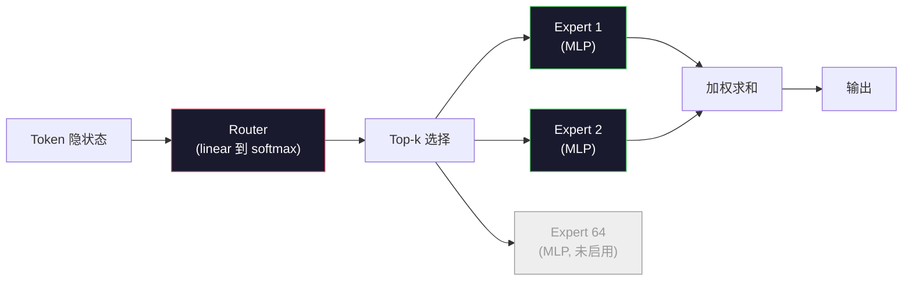

# 开源模型：架构对比走读（Open Models: Architecture Walkthroughs）

> 译注：本文译自同目录 [`en.md`](./en.md)。术语遵循仓根 [TRANSLATION_GUIDE.md](../../../../TRANSLATION_GUIDE.md)。

> 你在第 04 课已经从零搭过 GPT-2 Small。2026 年的前沿开源模型其实是同一个家族，只是动了五六个具体的旋钮。LayerNorm 换成了 RMSNorm。GELU 换成了 SwiGLU。学到的位置编码换成了 RoPE。完整的 MHA 换成了 GQA 或 MLA。规模大了之后还会用 Mixture-of-Experts（混合专家）。你已经学会的数学覆盖了它们 95%。本课会把 Llama 3、DeepSeek-V3、Mixtral、Qwen、Gemma 并排展开，逐一指出每个架构在哪一行开始走偏。

**Type:** Learn
**Languages:** Python (stdlib)
**Prerequisites:** Phase 10, Lessons 04, 05, 12 (Pre-training, Scaling, Inference)
**Time:** ~45 minutes

## 学习目标（Learning Objectives）

- 看懂 Llama 3、Mistral、Mixtral、Gemma 2、Qwen 2.5、DeepSeek-V3 的 config.json，能解释每一个字段
- 指出每个模型相对 GPT-2 Small 做了哪一处具体的架构改动，并能从第一性原理给出动机
- 仅凭 config 就能算出任意开源模型的参数量、KV cache 大小和激活内存
- 给定延迟、内存、能力上的部署约束，挑出合适的开源模型

## 问题（The Problem）

第 04 课你写了 350 行 numpy，得到了一个 GPT-2 形状的模型。Llama 3 405B 的技术报告有 200 页。你的直觉会告诉你这是两种不同的东西。其实不是。那 200 页描述的是同一个对象，外加五六个有充分动机的修改，再加上一千个关于 scaling（扩展规模）的工程细节。骨架——embedding（嵌入）、transformer block、attention（注意力）、MLP（多层感知机）、norm、head——一点没变。

本课就是一份 diff。对每个主流开源模型家族，我们逐一列出：相对 GPT-2 改了什么、为什么改、代价是什么。学完之后你拿到一份新的 model card，就能在脑子里把它翻译回 GPT-2 baseline。

实际收益是：当 Meta 发布 Llama 5、DeepSeek 发布 V4 时，你不需要重新建立心智模型。看一眼 config，就能知道几个常见的旋钮被拨到了什么位置，以及下游意味着什么。2026 年的架构是一个有限工具箱，每个新模型只是从中挑了不同的子集。

## 概念（The Concept）

### 不变的内核（The Invariant Core）

所有 autoregressive 开源模型都共享：

- Token embedding 矩阵（vocab_size x hidden_dim）。
- N 个 decoder block 组成的栈：norm、self-attention、residual、norm、MLP、residual。
- 最后的 norm 加上一个投影到 vocab_size 的线性 head（通常和 embedding 共享权重，weight-tied）。
- Causal mask（因果掩码），next-token 交叉熵损失。

这就是形状。剩下的全是旋钮。

### 真正会动的六个旋钮（The Six Knobs That Actually Move）

放眼 2024-2026 的所有前沿开源模型，被反复挑选的就是同样这六个设计决策：

1. **Normalization（归一化）。** LayerNorm -> RMSNorm。
2. **位置编码（Positional encoding）。** Learned absolute -> RoPE（再加变体：YaRN、NTK）。
3. **激活函数（Activation）。** GELU -> SwiGLU（或 GeGLU）。
4. **Attention head 共享方式。** MHA -> GQA -> MQA -> MLA。
5. **Dense 还是稀疏 MLP。** Dense -> Mixture-of-Experts。
6. **Pre-norm 的位置。** Pre-norm 留下来。Post-norm 没人用了。

其余一切（学习率调度、数据配比、batch size、context length）都属于训练配置，不属于架构。就是这六个旋钮。

### 旋钮 1：RMSNorm

LayerNorm 减均值、除以标准差、再 scale 和 shift。RMSNorm 只保留 scale：

```
RMSNorm(x) = x / sqrt(mean(x^2) + eps) * gamma
```

不减均值，没有 bias（偏置）。每个 token 少一次矩阵乘。Zhang 和 Sennrich（2019）的论文说在机器翻译上它和 LayerNorm 持平，速度快 10%。每个现代开源模型都用了它。

代价：没有。收益：吞吐略有提升，代码更干净。

### 旋钮 2：RoPE

GPT-2 的 learned position embedding 是一个 1024 槽的查找表。位置 1025 直接超出表的末尾。模型无法外推到训练长度之外。

Rotary Position Embedding（RoPE，Su et al. 2021）的做法是：在做 attention 点积之前，把 Q 和 K 向量按对旋转一个角度，把位置信息注入进去。旋转角度是位置的确定性函数，所以没有需要学习的东西，也不会用完。配合一些 scaling 技巧（NTK-aware interpolation、YaRN），一个在 8k context 上训练的模型，推理时可以拉伸到 128k，准确率只掉一点点。

```
q_rotated = rotate(q, angle(pos))
k_rotated = rotate(k, angle(pos))
score = q_rotated . k_rotated
```

每一个 Llama、Mistral、Qwen、DeepSeek、Gemma 都用 RoPE。Gemma 2 用的是混合（hybrid）方案（多数层用 RoPE，部分层用 local sliding-window attention）。

### 旋钮 3：SwiGLU

GPT-2 的 MLP 是 `x -> gelu(xW1 + b1) -> (...)W2 + b2`。SwiGLU（Shazeer 2020）把激活换成了带门控（gate）的乘积：

```
SwiGLU(x) = (xW1) * sigmoid(xW1) * xV
```

并行做两次投影而不是一次，再用 Swish 激活做门控。在每参数 perplexity（困惑度）上经验性更强。Llama 2 第一个采用，之后所有人都跟进了。MLP 隐藏维度通常调成总参数量和原本的 dense MLP 持平：如果 GPT-2 用的是 `ff_dim = 4 * hidden`，SwiGLU 就用 `ff_dim = (2/3) * 4 * hidden = 8/3 * hidden`。

### 旋钮 4：Attention head 共享

GPT-2 用的是 **Multi-Head Attention（MHA）**：每个 head 都有自己独立的 Q、K、V 投影。

**Multi-Query Attention（MQA，Shazeer 2019）** 在所有 head 之间共享一份 K 和 V。KV cache 缩小为原来的 num_heads 分之一，对一个常见模型来说就是 12 倍到 32 倍的压缩。在硬基准上准确率会略掉。

**Grouped-Query Attention（GQA，Ainslie et al. 2023）** 是折中方案：G 组 Q head 共享同一份 K 和 V。Llama 3 8B 用 GQA，32 个 Q head、8 个 KV head（G=8），KV cache 相比完整 MHA 缩小 4 倍。

**Multi-Head Latent Attention（MLA，DeepSeek 2024）** 把 K 和 V 压缩进一个共享的低秩 latent（潜空间），再按 head 投影回来。在保留 per-head 表达力的同时进一步缩小 KV cache。DeepSeek-V2 和 V3 的长 context 性能就靠它。

| Scheme | KV Heads | KV Cache | Accuracy |
|--------|----------|----------|----------|
| MHA    | num_heads | full | best |
| GQA    | num_groups (G < num_heads) | num_heads / G reduction | near-MHA |
| MQA    | 1 | num_heads reduction | small hit |
| MLA    | latent, per-head decompression | smaller than MQA | near-MHA |

参数量超过约 13B 的模型，GQA 或 MLA 几乎是必选。在那种规模上跑完整 MHA，KV cache 会爆炸。

### 旋钮 5：Mixture of Experts

Dense MLP 对每个 token 都激活全部参数。MoE MLP 在每个 block 里有 K 个 expert（专家），加一个 router（路由器），按 token 选 top-k 个 expert（通常 top-2）。只有被选中的那些 expert 的权重会对该 token 做前向传播。

```
router_logits = xW_r
indices, weights = top_k(router_logits, k=2)
output = sum_i weights[i] * expert[indices[i]](x)
```

诱人之处：可以有 64 个 7B 大小的 expert（总参数巨大），但每个 token 只跑其中 2 个（per-token 计算量等于一个 dense 7B 模型）。Mixtral 8x7B 总参数 47B，但每个 token 只激活 13B。DeepSeek-V3 总参数 671B，但每个 token 只激活 37B。



优点：同样的算力，更多参数，更大容量。缺点：expert 的权重还是得放在哪儿（所以服务时需要的 VRAM 比同等 dense 模型更多）；router 的负载均衡很难；alignment（对齐）阶段微调 router 本身就是一个研究方向。

### 旋钮 6：Pre-norm 留下来

最早的 transformer 在每个 sublayer **之后** 做 layer norm。GPT-2 之后的每个开源模型都把它放在每个 sublayer **之前**。在深度上 pre-norm 严格更容易训练。没什么可争的。

### 逐模型 diff（Model-by-Model Diff）

下面这张表把这一切落到具体数字。

| Model | Year | Total Params | Active Params | Norm | Activation | Position | Attention | MoE | Context |
|-------|------|-------------|---------------|------|-----------|----------|-----------|-----|---------|
| GPT-2 Small | 2019 | 124M | 124M | LayerNorm | GELU | Learned | MHA (12 heads) | no | 1k |
| Llama 3 8B | 2024 | 8B | 8B | RMSNorm | SwiGLU | RoPE | GQA (32/8) | no | 128k |
| Llama 3 70B | 2024 | 70B | 70B | RMSNorm | SwiGLU | RoPE | GQA (64/8) | no | 128k |
| Llama 3 405B | 2024 | 405B | 405B | RMSNorm | SwiGLU | RoPE | GQA (128/16) | no | 128k |
| Mistral 7B | 2023 | 7.2B | 7.2B | RMSNorm | SwiGLU | RoPE | GQA | no | 32k |
| Mixtral 8x7B | 2023 | 47B | 13B | RMSNorm | SwiGLU | RoPE | GQA | yes (8 experts, top-2) | 32k |
| Gemma 2 9B | 2024 | 9B | 9B | RMSNorm (pre+post) | GeGLU | RoPE + sliding | GQA | no | 8k |
| Qwen 2.5 72B | 2024 | 72B | 72B | RMSNorm | SwiGLU | RoPE (YaRN) | GQA (64/8) | no | 128k |
| DeepSeek V2 236B | 2024 | 236B | 21B | RMSNorm | SwiGLU | RoPE | MLA | yes (160 experts, top-6) | 128k |
| DeepSeek V3 | 2024 | 671B | 37B | RMSNorm | SwiGLU | RoPE | MLA | yes (256 experts, top-8) | 128k |

逐列扫一遍。RMSNorm 是普适的。SwiGLU 或它的近亲 GeGLU 是普适的。RoPE 是普适的。7B 以上的 GQA 是普适的，除非被 MLA 取代。MoE 是顶端模型的分水岭。

### 读懂 config.json

Llama 3 8B 的 config：

```
{
  "hidden_size": 4096,
  "intermediate_size": 14336,
  "num_hidden_layers": 32,
  "num_attention_heads": 32,
  "num_key_value_heads": 8,
  "max_position_embeddings": 131072,
  "rope_theta": 500000.0,
  "rms_norm_eps": 1e-5,
  "vocab_size": 128256
}
```

每一个字段都对应你已经实现过的东西。

- `hidden_size`：embedding 维度。
- `intermediate_size`：MLP 隐藏维度（约为 hidden 的 3.5 倍——SwiGLU 的算术）。
- `num_hidden_layers`：堆叠深度。
- `num_attention_heads`：Q head 数。
- `num_key_value_heads`：KV head 数（GQA）。
- `max_position_embeddings`：训练 context length。
- `rope_theta`：RoPE 基频。Meta 把它从默认的 10k 调到了 500k，便于长 context 外推。
- `rms_norm_eps`：数值稳定性用。
- `vocab_size`：token 数。

仅凭这些就能算出总参数量、KV cache 和峰值激活内存。具体公式见 `code/main.py`。

### 激活内存预算（Activation memory budget）

参数量超过几 B 之后，训练时激活内存就开始占主导。带 gradient checkpointing 的预训练经验法则：

```
activation_mem ~ batch_size * seq_len * hidden_size * num_layers * bytes_per_element
```

Llama 3 8B，batch 1，seq 8192，BF16，32 层，hidden 4096：开 checkpointing 时激活大约要 8 GB，不开就要 40 GB。这就是 flash-attention 和 ring-attention 重要的原因——它们重写了 attention 的计算流程，让激活塞得下。

### KV cache 预算（KV Cache budget）

最大 context 下的推理：

```
kv_cache = 2 * num_layers * num_kv_heads * head_dim * max_seq_len * bytes_per_element
```

Llama 3 8B 在 128k context、BF16、head_dim = hidden / num_heads = 128 时：
`2 * 32 * 8 * 128 * 131072 * 2 = 17.2 GB` per sequence。

8B 权重在 BF16 下是 16 GB。一条 128k 序列的 KV cache 比权重还大。这正是推动 GQA、MLA 和 KV cache 量化研究的内存压力。

### 各模型何时是最优解（When Each Model Wins）

- **单卡 80GB GPU、不要 MoE**：Llama 3 8B、Mistral 7B、Gemma 2 9B。部署省心，工具链丰富。
- **单节点（8x80GB）、要大容量**：Llama 3 70B、Qwen 2.5 72B。开源 dense 模型的能力天花板。
- **要最大开源能力，能接受 MoE 的复杂度**：DeepSeek V3、Mixtral 8x22B。每激活 FLOP 的能力最强。
- **长 context 场景**：Llama 3（128k，靠 RoPE scaling）、DeepSeek（MLA 的优势）。
- **低延迟服务**：Gemma 2 9B（sliding window 削减长 context 计算）。

## 动手实现（Build It）

本课的代码就是一个计算器。给定任意 config.json，它会按组件打印参数量、最大 context 下的 KV cache、SwiGLU MLP 比例，再给出一段对架构（dense / GQA / MLA / MoE）的简短判断。

```python
config = {
    "hidden_size": 4096, "intermediate_size": 14336,
    "num_hidden_layers": 32, "num_attention_heads": 32,
    "num_key_value_heads": 8, "vocab_size": 128256,
    "max_position_embeddings": 131072,
}
```

脚本会逐字段走一遍架构，计算 embedding、attention（带 GQA 缩减）、MLP（带 SwiGLU 扩张）、layernorm、head 各自的参数量。然后按给定的 context length 计算 KV cache，并打印一份摘要。

实现见 `code/main.py`。

## 用起来（Use It）

把脚本里自带的 Llama 3 8B、Mistral 7B、Mixtral 8x7B、DeepSeek V3 配置都跑一遍。比较参数构成。注意 MoE 模型的总参数量碾压 dense 模型，但激活参数量往往更小。注意 DeepSeek V3 的 KV cache 比 Llama 3 405B 还小，尽管总参数量更大——这就是 MLA 在起作用。

然后把你本地任何一个模型的 config 塞进去，看摘要，决定它能不能装进你的 GPU。

## 上线部署（Ship It）

本课产出 `outputs/skill-open-model-picker.md`。给定一个部署目标（GPU 类型、VRAM、context length、延迟预算）和任务画像（chat、code、reasoning、long-context），它会推荐一个开源模型、一种来自第 11 课的量化方案、以及一套来自第 12 课的推理栈，并就六个架构旋钮给出明确的推理过程。

## 练习（Exercises）

1. 从 HuggingFace 上读 Qwen 2.5 72B 的 config。从零算出总参数量。和 HF 上报的值对比，找出差异来自哪里（head dim 取整、KV 共享因子等）。

2. DeepSeek V3 用 256 个 expert，top-8 路由。算一下激活 expert 占总 expert 的比例，再和 Mixtral 8x7B 的 8 选 2 对比一下。从稀疏（25%）到更稀疏（3%）的转变，对每 FLOP 的容量意味着什么？

3. 算出 Llama 3 405B 在 128k context 下，FP8 和 BF16 的 KV cache 各是多少。FP8 是 BF16 的一半。在一个 8xH100 节点（每张 80GB，共 640GB，扣掉权重内存）上能并行服务多少条序列？

4. Gemma 2 是 full-attention 层和 sliding-window-attention 层交替排列的。写出当一半层用 4096-token 滑动窗口、另一半用 full context 时的 KV cache 公式。在总 context 为 8k 时能省多少内存？

5. 找一个本课写完之后才发布的前沿开源模型。指出它在六个旋钮里挑了哪几个，是否引入了第七个旋钮。新架构一上线，课程内容立刻显得过时——目标是让你只更新表格，不重建心智模型。

## 关键术语（Key Terms）

| Term | What people say | What it actually means |
|------|----------------|----------------------|
| RMSNorm | "LayerNorm without the mean" | 只用均方根归一化、配一个可学的 scale——比 LayerNorm 便宜，效果相当 |
| RoPE | "Rotary positions" | 把 Q 和 K 向量按 2D 对旋转一个随位置变化的角度——配合 scaling 技巧能外推到训练长度之外 |
| SwiGLU | "The new MLP activation" | 配 Swish 的门控线性单元：`(xW1) * sigmoid(xW1) * xV`——2024 年以后所有开源模型的标配 |
| GQA | "Middle ground attention" | Grouped-Query Attention：G 组 Q head 共享一份 K 和 V——缩小 KV cache，同时不像 MQA 那样掉精度 |
| MLA | "DeepSeek's attention" | Multi-Head Latent Attention：把 K/V 压缩进共享低秩 latent，再按 head 解压——大模型上 KV cache 最小 |
| MoE | "Sparse experts" | Mixture of Experts：每个 block 有 N 个 MLP，router 按 token 选 top-k——总参数巨大，激活参数很小 |
| Top-k routing | "Pick k experts per token" | Router 给每个 expert 打分，激活分数最高的 k 个——典型 k 是 2（Mixtral）到 8（DeepSeek） |
| YaRN | "Stretch RoPE" | Yet another RoPE extension——通过插值旋转角，把 context 从 8k 拉到 128k+ 推理 |
| Sliding-window attention | "Don't attend to everything" | 每个 token 只看最近 W 个 token——把 attention 成本固定在每 token O(W)，Gemma 2 和早期 Mistral 用过 |
| Active params | "What runs per token" | 对 MoE 模型而言，每个 token 实际跑前向的参数量（远小于总参数）——决定了 per-token FLOPs |

## 延伸阅读（Further Reading）

- [Dubey et al., 2024 -- "The Llama 3 Herd of Models"](https://arxiv.org/abs/2407.21783) -- dense Llama 3 家族的架构与训练参考
- [DeepSeek-AI, 2024 -- "DeepSeek-V3 Technical Report"](https://arxiv.org/abs/2412.19437) -- MLA、无辅助损失的负载均衡、671B MoE
- [Jiang et al., 2024 -- "Mixtral of Experts"](https://arxiv.org/abs/2401.04088) -- 经典 MoE 开源模型论文
- [Su et al., 2021 -- "RoFormer: Enhanced Transformer with Rotary Position Embedding"](https://arxiv.org/abs/2104.09864) -- RoPE 论文
- [Shazeer, 2020 -- "GLU Variants Improve Transformer"](https://arxiv.org/abs/2002.05202) -- SwiGLU、GeGLU 及同族
- [Ainslie et al., 2023 -- "GQA: Training Generalized Multi-Query Transformer Models"](https://arxiv.org/abs/2305.13245) -- GQA 论文
- [Gemma 2 Team, 2024 -- "Gemma 2: Improving Open Language Models at a Practical Size"](https://arxiv.org/abs/2408.00118) -- 混合 full+sliding attention，pre+post-norm
- [Qwen Team, 2024 -- "Qwen 2.5 Technical Report"](https://arxiv.org/abs/2412.15115) -- YaRN context 拉伸与长 context 训练配方
