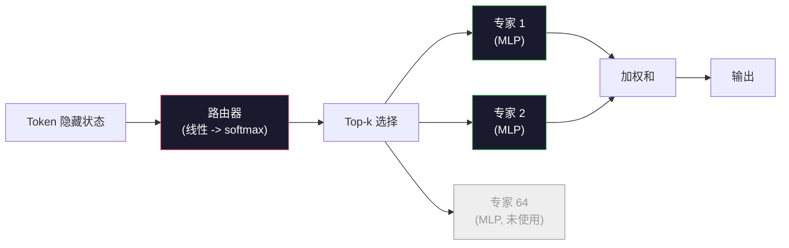

# 开放模型：架构深度解读

> 在第四课中，你从零构建了一个 GPT-2 Small。2026 年的前沿开放模型属于同一家族，但有五到六个具体的变化：用 RMSNorm 替代 LayerNorm，用 SwiGLU 替代 GELU，用 RoPE 替代学习位置编码，用 GQA 或 MLA 替代全 MHA，在大规模上使用混合专家（MoE）。你已掌握的数学知识覆盖了其中 95% 的内容。本课将并排解读 Llama 3、DeepSeek-V3、Mixtral、Qwen 和 Gemma，并明确指出每个架构差异所在的代码行。

**类型：** 学习
**语言：** Python（标准库）
**前置要求：** 阶段 10，第 04、05、12 课（预训练、缩放、推理）
**时长：** 约 45 分钟

## 学习目标

- 阅读 Llama 3、Mistral、Mixtral、Gemma 2、Qwen 2.5 和 DeepSeek-V3 的 config.json 文件，并解释每个字段
- 说出每个模型相对于 GPT-2 Small 的具体架构变化，并从第一性原理加以论证
- 仅凭配置文件计算任意开放模型的参数数量、KV 缓存大小和激活内存
- 根据延迟、内存和能力约束，为部署目标选择合适的开放模型

## 问题

在第四课中，你编写了 350 行 numpy 代码，得到了一个 GPT-2 形状的模型。而 Llama 3 405B 有一份 200 页的技术报告。你会本能地认为它们是不同的野兽。其实不然。那 200 页描述的是同一个对象，只是做了五到六个动机明确的修改，外加一千个关于规模化的实现细节。骨架——嵌入、Transformer 块、注意力、MLP、归一化、输出头——是不变的。

本课是一份差异对比。对于每个主要的开放模型家族，我们列出相对于 GPT-2 具体改变了什么、为什么改变以及代价是什么。完成后，你可以阅读一份全新的模型卡，并在脑中将其翻译回 GPT-2 基线。

实际收益是：当 Meta 发布 Llama 5 或 DeepSeek 发布 V4 时，你不需要新的心智模型。你将查看配置，看看那些众所周知的旋钮中哪些发生了变动，然后就知道下游的影响是什么。2026 年的架构是一个有限的工具箱。每个新模型选择不同的子集。

## 概念

### 不变核心

所有自回归开放模型共享：

- Token 嵌入矩阵（vocab_size x hidden_dim）
- N 个解码器块的堆叠：归一化、自注意力、残差连接、归一化、MLP、残差连接
- 最终归一化和指向 vocab_size 的线性输出头（通常与嵌入权重绑定）
- 因果掩码，下一个 token 的交叉熵损失

这就是形状。其余都是旋钮。

### 实际变化的六个旋钮

在 2024-2026 年的每一个前沿开放模型中，同样的六个设计选择被反复使用：

1. **归一化。** LayerNorm -> RMSNorm。
2. **位置编码。** 学习的绝对位置 -> RoPE（以及变体：YaRN、NTK）。
3. **激活函数。** GELU -> SwiGLU（或 GeGLU）。
4. **注意力头共享。** MHA -> GQA -> MQA -> MLA。
5. **稠密 vs 稀疏 MLP。** 稠密 -> 混合专家（MoE）。
6. **预归一化位置。** 预归一化保持不变。后归一化已消失。

其他所有内容（学习率调度、数据混合、批量大小、上下文长度）都存在于训练配置中，而非架构中。六个旋钮。

### 旋钮 1：RMSNorm

LayerNorm 减去均值、除以标准差、缩放和平移。RMSNorm 只保留缩放：

```
RMSNorm(x) = x / sqrt(mean(x^2) + eps) * gamma
```

没有均值减法。没有偏置。每个 token 减少一次矩阵乘法。Zhang 和 Sennrich（2019）论证其在机器翻译中与 LayerNorm 相当，且速度快 10%。每个现代开放模型都使用它。

代价：无。好处：小的吞吐量提升，更简单的代码。

### 旋钮 2：RoPE

在 GPT-2 中，学习的位置嵌入是一个 1024 槽的查找表。上下文 1025 超出了表的末尾。模型无法外推到训练长度之外。

旋转位置编码（RoPE，Su 等人，2021）通过在注意力点积之前将每个 Q 和 K 向量成对旋转来注入位置。旋转角度是位置的确定性函数，因此没有需要学习的内容，也不会耗尽。借助缩放技巧（NTK 感知插值、YaRN），在 8k 上下文上训练的模型可以在推理时拉伸到 128k，且精度损失适中。

```
q_rotated = rotate(q, angle(pos))
k_rotated = rotate(k, angle(pos))
score = q_rotated . k_rotated
```

所有 Llama、Mistral、Qwen、DeepSeek 和 Gemma 都使用 RoPE。Gemma 2 使用混合方式（大多数层用 RoPE，其他层用局部滑动窗口注意力）。

### 旋钮 3：SwiGLU

GPT-2 的 MLP 是 `x -> gelu(xW1 + b1) -> (...)W2 + b2`。SwiGLU（Shazeer，2020）将激活函数替换为一个门控乘积：

```
SwiGLU(x) = (xW1) * sigmoid(xW1) * xV
```

两个投影并行，由 Swish 激活函数门控。经验上在每参数困惑度上更强。Llama 2 采用了它，所有人都跟随。MLP 的隐藏大小通常设置为使总参数数量与原始稠密 MLP 匹配：如果 GPT-2 使用 `ff_dim = 4 * hidden`，则 SwiGLU 使用 `ff_dim = (2/3) * 4 * hidden = 8/3 * hidden`。

### 旋钮 4：注意力头共享

GPT-2 使用**多头注意力（Multi-Head Attention, MHA）**：每个头有自己的 Q、K、V 投影。

**多查询注意力（Multi-Query Attention, MQA，Shazeer，2019）** 在所有头之间共享一个 K 和一个 V。将 KV 缓存减少 num_heads 倍，在典型模型上是 12 到 32 倍的缩减。在困难基准上精度略有下降。

**分组查询注意力（Grouped-Query Attention, GQA，Ainslie 等人，2023）** 是中间地带：G 组 Q 头共享一个 K 和一个 V。Llama 3 8B 使用 GQA，有 32 个 Q 头和 8 个 KV 头（G=8），因此 KV 缓存相对于全 MHA 缩小了 4 倍。

**多头潜在注意力（Multi-Head Latent Attention, MLA，DeepSeek，2024）** 将 K 和 V 压缩成一个共享的低秩潜在表示，再逐个头投影回去。进一步减少 KV 缓存，同时保留每个头的表达能力。DeepSeek-V2 和 V3 依赖此实现其长上下文性能。

| 方案 | KV 头数 | KV 缓存 | 精度 |
|------|---------|---------|------|
| MHA | num_heads | 全 | 最佳 |
| GQA | num_groups (G < num_heads) | 减少 num_heads / G 倍 | 接近 MHA |
| MQA | 1 | 减少 num_heads 倍 | 轻微损失 |
| MLA | 潜在表示，逐头解压缩 | 比 MQA 更小 | 接近 MHA |

对于参数超过约 13B 的模型，GQA 或 MLA 实际上是强制性的。大规模的全 MHA 在 KV 缓存上是灾难性的。

### 旋钮 5：混合专家（Mixture of Experts）

稠密 MLP 对每个 token 激活其所有参数。MoE MLP 每个块有 K 个专家和一个路由器，为每个 token 选择 top-k 个专家（通常是 top-2）。只有这些专家的权重对该 token 进行前向计算。

```
router_logits = xW_r
indices, weights = top_k(router_logits, k=2)
output = sum_i weights[i] * expert[indices[i]](x)
```

吸引力在于：你可以拥有 64 个大小为 7B 的专家（因此总参数量巨大），但每个 token 只运行其中 2 个专家（因此每个 token 的计算量相当于稠密 7B 模型）。Mixtral 8x7B 总参数为 47B，但每个 token 只激活 13B。DeepSeek-V3 总参数为 671B，但每个 token 只激活 37B。



优点：相同计算量，更多参数，更好容量。缺点：专家内存仍须驻留（因此服务需要比稠密等价模型更多的 VRAM），路由器的负载均衡困难，以及对齐过程中微调路由器本身就是一个研究领域。

### 旋钮 6：预归一化保持不变

原始 Transformer 在每个子层之后应用层归一化。自 GPT-2 以来的每个开放模型都将其放在每个子层**之前**。预归一化在深层训练中严格更容易。毋庸置疑。

### 逐个模型差异对比

下面这张表让所有这些变得具体。

| 模型 | 年份 | 总参数 | 激活参数 | 归一化 | 激活函数 | 位置编码 | 注意力 | MoE | 上下文 |
|------|------|--------|----------|--------|----------|----------|---------|-----|--------|
| GPT-2 Small | 2019 | 124M | 124M | LayerNorm | GELU | 学习位置 | MHA (12 heads) | 否 | 1k |
| Llama 3 8B | 2024 | 8B | 8B | RMSNorm | SwiGLU | RoPE | GQA (32/8) | 否 | 128k |
| Llama 3 70B | 2024 | 70B | 70B | RMSNorm | SwiGLU | RoPE | GQA (64/8) | 否 | 128k |
| Llama 3 405B | 2024 | 405B | 405B | RMSNorm | SwiGLU | RoPE | GQA (128/16) | 否 | 128k |
| Mistral 7B | 2023 | 7.2B | 7.2B | RMSNorm | SwiGLU | RoPE | GQA | 否 | 32k |
| Mixtral 8x7B | 2023 | 47B | 13B | RMSNorm | SwiGLU | RoPE | GQA | 是 (8 专家, top-2) | 32k |
| Gemma 2 9B | 2024 | 9B | 9B | RMSNorm (前+后) | GeGLU | RoPE + 滑动窗口 | GQA | 否 | 8k |
| Qwen 2.5 72B | 2024 | 72B | 72B | RMSNorm | SwiGLU | RoPE (YaRN) | GQA (64/8) | 否 | 128k |
| DeepSeek V2 236B | 2024 | 236B | 21B | RMSNorm | SwiGLU | RoPE | MLA | 是 (160 专家, top-6) | 128k |
| DeepSeek V3 | 2024 | 671B | 37B | RMSNorm | SwiGLU | RoPE | MLA | 是 (256 专家, top-8) | 128k |

扫视各列。RMSNorm 是通用的。SwiGLU 或其近亲 GeGLU 是通用的。RoPE 是通用的。GQA 在 7B 以上是通用的，除非被 MLA 取代。MoE 是高端产品的差异化因素。

### 阅读 config.json

Llama 3 8B 配置：

```
{
  "hidden_size": 4096,
  "intermediate_size": 14336,
  "num_hidden_layers": 32,
  "num_attention_heads": 32,
  "num_key_value_heads": 8,
  "max_position_embeddings": 131072,
  "rope_theta": 500000.0,
  "rms_norm_eps": 1e-5,
  "vocab_size": 128256
}
```

每个字段都对应你已经实现的内容。

- `hidden_size`: 嵌入维度。
- `intermediate_size`: MLP 隐藏大小（3.5 倍 hidden —— SwiGLU 数学）。
- `num_hidden_layers`: 堆叠深度。
- `num_attention_heads`: Q 头数。
- `num_key_value_heads`: KV 头数（GQA）。
- `max_position_embeddings`: 训练上下文长度。
- `rope_theta`: RoPE 基频。Meta 将其从默认的 10k 扩展到 500k 以实现长上下文外推。
- `rms_norm_eps`: 数值稳定性。
- `vocab_size`: 词汇表标记数。

仅凭这些，你可以计算总参数、KV 缓存和峰值激活内存。精确公式见 `code/main.py`。

### 激活内存预算

在数十亿参数以上时，激活内存主导训练内存。预训练（使用梯度检查点）的经验法则：

```
activation_mem ~ batch_size * seq_len * hidden_size * num_layers * bytes_per_element
```

对于 Llama 3 8B，batch 1、seq 8192、BF16、32 层、hidden 4096：使用检查点时激活约 8 GB，不使用检查点时约 40 GB。这就是 FlashAttention 和 RingAttention 重要的原因——它们重写注意力计算，使激活能够适应内存。

### KV 缓存预算

在最大上下文下进行推理：

```
kv_cache = 2 * num_layers * num_kv_heads * head_dim * max_seq_len * bytes_per_element
```

Llama 3 8B 在 128k 上下文、BF16、head_dim = hidden / num_heads = 128 时：
`2 * 32 * 8 * 128 * 131072 * 2 = 17.2 GB` 每个序列。

8B 权重在 BF16 下为 16 GB。单个 128k 序列的 KV 缓存比权重还大。这是驱动 GQA、MLA 和 KV 缓存量化研究的内存压力。

### 每个模型的适用场景

- **单张 80GB GPU，无 MoE**：Llama 3 8B、Mistral 7B、Gemma 2 9B。易于服务，工具广泛。
- **单节点（8x80GB），大容量**：Llama 3 70B、Qwen 2.5 72B。最高的稠密开放能力。
- **最大开放能力，接受 MoE 复杂度**：DeepSeek V3、Mixtral 8x22B。每激活 FLOP 的最佳能力。
- **需要长上下文**：Llama 3（128k 带 RoPE 缩放）、DeepSeek（MLA 优势）。
- **低延迟服务**：Gemma 2 9B（滑动窗口减少长上下文计算）。

## 构建

本课的代码是一个计算器。给定任何 config.json，它会按组件打印参数数量、最大上下文下的 KV 缓存、SwiGLU MLP 比率，以及对架构的简短判断（稠密 / GQA / MLA / MoE）。

```python
config = {
    "hidden_size": 4096, "intermediate_size": 14336,
    "num_hidden_layers": 32, "num_attention_heads": 32,
    "num_key_value_heads": 8, "vocab_size": 128256,
    "max_position_embeddings": 131072,
}
```

脚本逐个字段遍历架构，计算嵌入、注意力（含 GQA 缩减）、MLP（含 SwiGLU 扩展）、层归一化和输出头的参数数量。然后计算给定上下文长度下的 KV 缓存，并打印摘要。

实现参见 `code/main.py`。

## 使用

在脚本中包含的 Llama 3 8B、Mistral 7B、Mixtral 8x7B 和 DeepSeek V3 配置上运行计算器。比较参数分解。注意 MoE 模型的总参数数量远超稠密模型，但激活参数数量通常更小。注意 DeepSeek V3 的 KV 缓存比 Llama 3 405B 还要小，尽管其总参数更多——这就是 MLA 的作用。

然后插入本地任何模型的配置，阅读摘要，并判断它是否适合你的 GPU。

## 交付

本课生成 `outputs/skill-open-model-picker.md`。给定一个部署目标（GPU 类型、VRAM、上下文长度、延迟预算）和一个任务特征（聊天、代码、推理、长上下文