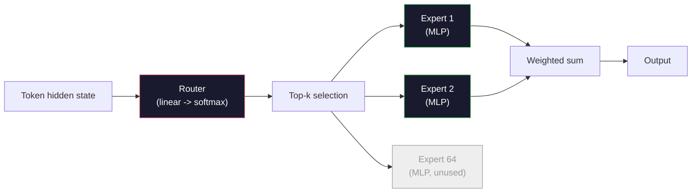

# 14 · 开放模型：架构逐一剖析

> 你在第 04 课从零搭建了一个 GPT-2 Small。2026 年的前沿开放模型其实属于同一个家族，只是做了五六处具体改动：用 RMSNorm 代替 LayerNorm，用 SwiGLU 代替 GELU，用 RoPE 代替学习式位置编码，用 GQA 或 MLA 代替完整 MHA，并在规模上引入混合专家（Mixture-of-Experts）。你已经掌握的数学，覆盖了其中 95% 的内容。本课把 Llama 3、DeepSeek-V3、Mixtral、Qwen 和 Gemma 并排阅读，精确指出每种架构在哪一行发生了分叉。

**类型：** 学习
**语言：** Python（标准库）
**前置：** 阶段 10，第 04、05、12 课（预训练、扩展规律、推理）
**时长：** 约 45 分钟

## 学习目标

- 读懂 Llama 3、Mistral、Mixtral、Gemma 2、Qwen 2.5 和 DeepSeek-V3 的 config.json，并解释其中每一个字段
- 指出每个模型相较 GPT-2 Small 做出的具体架构改动，并从第一性原理给出理由
- 仅凭 config 就能为任意开放模型计算参数量、KV 缓存大小和激活内存
- 在给定延迟、内存和能力约束的部署目标下，挑选合适的开放模型

## 问题所在

在第 04 课，你写了 350 行 numpy，得到了一个 GPT-2 形状的模型。Llama 3 405B 则有一份 200 页的技术报告。你的直觉会认为它们是两种截然不同的物种。其实并非如此。这 200 页描述的是同一个对象，只是加上了五六处动机明确的修改，外加上千个关于扩展规模的实现细节。骨架——嵌入层、Transformer 块、注意力、MLP、归一化、输出头——没有变。

本课就是一份「差异对照（diff）」。对每个主要的开放模型家族，我们都精确列出它相对 GPT-2 改了什么、为什么改、代价是什么。学完之后，你就能拿起一份全新的模型卡片，在脑中把它翻译回 GPT-2 基线。

实际收益在于：当 Meta 发布 Llama 5 或 DeepSeek 发布 V4 时，你不需要建立新的心智模型。你只需看 config，找出那几个众所周知的旋钮里哪一个动了，就能知道下游会有什么影响。2026 年的各类架构是一个有限的工具箱，每个新模型都只是选取了其中一个不同的子集。

## 核心概念

### 不变的内核

所有自回归开放模型都共享：

- 词元嵌入矩阵（vocab_size x hidden_dim）。
- N 个解码器块堆叠：归一化、自注意力、残差、归一化、MLP、残差。
- 最终归一化和投影到 vocab_size 的线性输出头（通常与嵌入矩阵权重绑定）。
- 因果掩码、下一个词元的交叉熵损失。

这就是整个形状，剩下的全是旋钮。

### 真正会动的六个旋钮

纵观 2024-2026 年每一个前沿开放模型，同样的六个设计选择被一遍又一遍地挑选：

1. **归一化（Normalization）。** LayerNorm -> RMSNorm。
2. **位置编码（Positional encoding）。** 学习式绝对位置 -> RoPE（外加变体：YaRN、NTK）。
3. **激活函数（Activation）。** GELU -> SwiGLU（或 GeGLU）。
4. **注意力头共享（Attention head sharing）。** MHA -> GQA -> MQA -> MLA。
5. **稠密 vs 稀疏 MLP。** 稠密（Dense）-> 混合专家（Mixture-of-Experts）。
6. **前置归一化位置（Pre-norm placement）。** 前置归一化保留，后置归一化（Post-norm）已被淘汰。

其余一切（学习率调度、数据配比、批大小、上下文长度）都属于训练配置，而非架构。就是这六个旋钮。

### 旋钮 1：RMSNorm

LayerNorm 会减去均值、除以标准差、缩放再平移。RMSNorm 只保留缩放：

```
RMSNorm(x) = x / sqrt(mean(x^2) + eps) * gamma
```

不减均值，没有偏置项，每个词元少一次矩阵乘法。Zhang 和 Sennrich（2019）论证它在机器翻译上与 LayerNorm 持平，同时快 10%。如今每个现代开放模型都在用它。

代价：无。收益：吞吐量小幅提升，代码更简洁。

### 旋钮 2：RoPE

在 GPT-2 中，学习式位置嵌入是一张 1024 槽的查找表。上下文长度 1025 就超出了表的末端。模型无法外推到训练长度之外。

旋转位置编码（Rotary Position Embedding，RoPE，Su 等人 2021）通过在注意力点积之前对每个 Q 和 K 向量成对地进行旋转来注入位置信息。旋转角度是位置的确定性函数，因此没有任何东西需要学习，也没有任何东西会被「用完」。借助缩放技巧（NTK 感知插值、YaRN），一个在 8k 上下文上训练的模型可以在推理时拉伸到 128k，且精度损失不大。

```
q_rotated = rotate(q, angle(pos))
k_rotated = rotate(k, angle(pos))
score = q_rotated . k_rotated
```

每个 Llama、Mistral、Qwen、DeepSeek 和 Gemma 都使用 RoPE。Gemma 2 使用一种混合方案（大部分层用 RoPE，其余层用局部滑动窗口注意力）。

### 旋钮 3：SwiGLU

GPT-2 的 MLP 是 `x -> gelu(xW1 + b1) -> (...)W2 + b2`。SwiGLU（Shazeer 2020）用一个门控乘积替换激活函数：

```
SwiGLU(x) = (xW1) * sigmoid(xW1) * xV
```

两个并行投影代替一个，由 Swish 激活进行门控。在「每参数困惑度」上经验性地更强。Llama 2 采用了它，之后所有人都跟进。MLP 的隐藏层大小通常会调整，使总参数量与原始稠密 MLP 匹配：如果 GPT-2 用 `ff_dim = 4 * hidden`，那么 SwiGLU 用 `ff_dim = (2/3) * 4 * hidden = 8/3 * hidden`。

### 旋钮 4：注意力头共享

GPT-2 使用**多头注意力（Multi-Head Attention，MHA）**：每个头都有自己的 Q、K、V 投影。

**多查询注意力（Multi-Query Attention，MQA，Shazeer 2019）** 让所有头共享一个 K 和一个 V。把 KV 缓存按 num_heads 倍缩减，在典型模型上是 12 倍到 32 倍的削减。在困难基准上精度会略有下降。

**分组查询注意力（Grouped-Query Attention，GQA，Ainslie 等人 2023）** 是折中方案：G 组 Q 头共享一个 K 和一个 V。Llama 3 8B 使用 GQA，32 个 Q 头、8 个 KV 头（G=8），因此 KV 缓存相较完整 MHA 缩小 4 倍。

**多头潜在注意力（Multi-Head Latent Attention，MLA，DeepSeek 2024）** 把 K 和 V 压缩进一个共享的低秩潜在表示，再为每个头投影回去。在保留逐头表达力的同时进一步缩减 KV 缓存。DeepSeek-V2 和 V3 的长上下文性能正是依赖于此。

| 方案 | KV 头数 | KV 缓存 | 精度 |
|--------|----------|----------|----------|
| MHA    | num_heads | 完整 | 最佳 |
| GQA    | num_groups（G < num_heads） | 缩减 num_heads / G | 接近 MHA |
| MQA    | 1 | 缩减 num_heads | 略有损失 |
| MLA    | 潜在表示，逐头解压 | 比 MQA 还小 | 接近 MHA |

对任何参数量超过约 13B 的模型，GQA 或 MLA 实际上是必选项。规模化下的完整 MHA 是一场 KV 缓存灾难。

### 旋钮 5：混合专家

稠密 MLP 对每个词元都激活其全部参数。MoE MLP 每个块有 K 个专家，外加一个路由器（router），为每个词元挑选 top-k 个专家（通常是 top-2）。对该词元而言，只有被选中专家的权重参与前向传播。

```
router_logits = xW_r
indices, weights = top_k(router_logits, k=2)
output = sum_i weights[i] * expert[indices[i]](x)
```

吸引力在于：你可以拥有 64 个各为 7B 大小的专家（因此总参数量极其庞大），同时每个词元只运行其中 2 个（因此逐词元计算量与稠密 7B 模型相当）。Mixtral 8x7B 总参数量为 47B，但每个词元只激活 13B。DeepSeek-V3 总参数量为 671B，但每个词元只激活 37B。

〔图：MoE 路由流程：词元隐藏状态经路由器与 top-k 选择，激活部分专家后加权求和〕



优点：相同计算量、更多参数、更强容量。缺点：专家的内存仍然得放在某处（因此服务时需要比等效稠密模型更多的显存），路由器的负载均衡很难做，对齐阶段微调路由器本身又是一个独立的研究领域。

### 旋钮 6：前置归一化保留

最初的 Transformer 在每个子层之后施加层归一化。GPT-2 之后的每个开放模型都把它放在每个子层*之前*。前置归一化在深层网络上严格地更易训练，这一点毫无争议。

### 逐模型差异对照

下面这张表把上述一切都落到实处。

| 模型 | 年份 | 总参数 | 激活参数 | 归一化 | 激活函数 | 位置编码 | 注意力 | MoE | 上下文 |
|-------|------|-------------|---------------|------|-----------|----------|-----------|-----|---------|
| GPT-2 Small | 2019 | 124M | 124M | LayerNorm | GELU | 学习式 | MHA（12 头） | 否 | 1k |
| Llama 3 8B | 2024 | 8B | 8B | RMSNorm | SwiGLU | RoPE | GQA（32/8） | 否 | 128k |
| Llama 3 70B | 2024 | 70B | 70B | RMSNorm | SwiGLU | RoPE | GQA（64/8） | 否 | 128k |
| Llama 3 405B | 2024 | 405B | 405B | RMSNorm | SwiGLU | RoPE | GQA（128/16） | 否 | 128k |
| Mistral 7B | 2023 | 7.2B | 7.2B | RMSNorm | SwiGLU | RoPE | GQA | 否 | 32k |
| Mixtral 8x7B | 2023 | 47B | 13B | RMSNorm | SwiGLU | RoPE | GQA | 是（8 专家，top-2） | 32k |
| Gemma 2 9B | 2024 | 9B | 9B | RMSNorm（前+后） | GeGLU | RoPE + 滑动窗口 | GQA | 否 | 8k |
| Qwen 2.5 72B | 2024 | 72B | 72B | RMSNorm | SwiGLU | RoPE（YaRN） | GQA（64/8） | 否 | 128k |
| DeepSeek V2 236B | 2024 | 236B | 21B | RMSNorm | SwiGLU | RoPE | MLA | 是（160 专家，top-6） | 128k |
| DeepSeek V3 | 2024 | 671B | 37B | RMSNorm | SwiGLU | RoPE | MLA | 是（256 专家，top-8） | 128k |

扫一遍这些列：RMSNorm 是普适的，SwiGLU 或其 GeGLU 表亲是普适的，RoPE 是普适的。7B 以上 GQA 是普适的，除非被 MLA 取代。MoE 是顶端阵营的差异化所在。

### 读懂一份 config.json

Llama 3 8B 配置：

```
{
  "hidden_size": 4096,
  "intermediate_size": 14336,
  "num_hidden_layers": 32,
  "num_attention_heads": 32,
  "num_key_value_heads": 8,
  "max_position_embeddings": 131072,
  "rope_theta": 500000.0,
  "rms_norm_eps": 1e-5,
  "vocab_size": 128256
}
```

每个字段都对应你已经实现过的某样东西。

- `hidden_size`：嵌入维度。
- `intermediate_size`：MLP 隐藏层大小（3.5 倍 hidden——SwiGLU 的数学）。
- `num_hidden_layers`：堆叠深度。
- `num_attention_heads`：Q 头数。
- `num_key_value_heads`：KV 头数（GQA）。
- `max_position_embeddings`：训练上下文长度。
- `rope_theta`：RoPE 的基频。Meta 把它从默认的 10k 调到 500k，以支持长上下文外推。
- `rms_norm_eps`：数值稳定性。
- `vocab_size`：词元数。

仅凭这些，你就能计算总参数量、KV 缓存和峰值激活内存。精确公式见 `code/main.py`。

### 激活内存预算

在几十亿参数以上，激活内存主导训练内存。预训练的经验法则（启用梯度检查点时）：

```
activation_mem ~ batch_size * seq_len * hidden_size * num_layers * bytes_per_element
```

对 Llama 3 8B，批大小 1、序列长度 8192、BF16、32 层、hidden 4096：启用检查点时单是激活就约 8 GB，不启用则约 40 GB。这就是为什么 flash-attention 和 ring-attention 很重要——它们重写了注意力计算，让激活能放得下。

### KV 缓存预算

针对最大上下文下的推理：

```
kv_cache = 2 * num_layers * num_kv_heads * head_dim * max_seq_len * bytes_per_element
```

Llama 3 8B 在 128k 上下文、BF16、head_dim = hidden / num_heads = 128 时：
`2 * 32 * 8 * 128 * 131072 * 2 = 17.2 GB`（每条序列）。

8B 的权重在 BF16 下是 16 GB。单条 128k 序列的 KV 缓存比权重还大。这正是推动 GQA、MLA 和 KV 缓存量化研究的内存压力。

### 何时各模型胜出

- **单张 80GB GPU，不用 MoE**：Llama 3 8B、Mistral 7B、Gemma 2 9B。易于部署，工具链广泛。
- **单节点（8x80GB），追求大容量**：Llama 3 70B、Qwen 2.5 72B。最强的稠密开放能力。
- **追求最强开放能力，接受 MoE 复杂度**：DeepSeek V3、Mixtral 8x22B。每个激活 FLOP 的能力最佳。
- **长上下文需求**：Llama 3（配合 RoPE 缩放的 128k）、DeepSeek（MLA 优势）。
- **低延迟服务**：Gemma 2 9B（滑动窗口削减长上下文计算）。

## 动手构建

本课的代码是一个计算器。给定任意 config.json，它会按组件打印参数量、最大上下文下的 KV 缓存、SwiGLU MLP 比率，以及对架构的简短判定（稠密 / GQA / MLA / MoE）。

```python
config = {
    "hidden_size": 4096, "intermediate_size": 14336,
    "num_hidden_layers": 32, "num_attention_heads": 32,
    "num_key_value_heads": 8, "vocab_size": 128256,
    "max_position_embeddings": 131072,
}
```

脚本逐字段遍历架构，计算嵌入层、注意力（含 GQA 缩减）、MLP（含 SwiGLU 扩展）、层归一化和输出头的参数量。随后计算给定上下文长度下的 KV 缓存，并打印一份摘要。

实现见 `code/main.py`。

## 实际运用

在脚本内置的 Llama 3 8B、Mistral 7B、Mixtral 8x7B 和 DeepSeek V3 配置上运行这个计算器。对比各自的参数拆解。注意到 MoE 模型的总参数量远超稠密模型，但激活参数量往往更小。注意到尽管 DeepSeek V3 总参数更多，其 KV 缓存却比 Llama 3 405B 还小——这就是 MLA 在发挥作用。

然后把你本地任意模型的配置填进去，读懂摘要，判断它是否能装进你的 GPU。

## 交付成果

本课产出 `outputs/skill-open-model-picker.md`。给定一个部署目标（GPU 型号、显存、上下文长度、延迟预算）和一个任务画像（聊天、代码、推理、长上下文），它会推荐一个开放模型、一种来自第 11 课的量化方案、一套来自第 12 课的推理栈，并对这六个架构旋钮给出明确的推理依据。

## 练习

1. 从 HuggingFace 读取 Qwen 2.5 72B 的配置。从零计算总参数量。与 HF 报告的数值对比，找出任何偏差的来源（head dim 取整、KV 共享因子等）。

2. DeepSeek V3 使用 256 个专家、top-8 路由。计算激活专家与总专家的比率，并与 Mixtral 8x7B 的 8 选 top-2 对比。从稀疏（25%）转向更稀疏的稀疏（3%）对「每 FLOP 容量」意味着什么？

3. 计算 Llama 3 405B 在 128k 上下文下、分别用 FP8 和 BF16 的 KV 缓存。FP8 下是 BF16 数值的一半。在单个 8xH100 节点上（每张 80GB = 共 640GB，减去权重内存）你能并行服务多少条序列？

4. Gemma 2 交替使用完整注意力层和滑动窗口注意力层。写出当一半层使用 4096 词元滑动窗口而非完整上下文时，KV 缓存的计算公式。在 8k 总上下文下这能省多少内存？

5. 找一个在本课写成之后才发布的近期前沿开放模型。指出它选了这六个旋钮中的哪几个，以及它是否引入了第七个旋钮。一旦有新架构发布，这套课程就会显得过时——目标是更新你的表格，而不必重建你的心智模型。

## 关键术语

| 术语 | 人们怎么说 | 它实际上是什么 |
|------|----------------|----------------------|
| RMSNorm | 「去掉均值的 LayerNorm」 | 仅按均方根归一化，带一个可学习的缩放——比 LayerNorm 便宜且效果相当 |
| RoPE | 「旋转位置」 | 把每个 Q 和 K 向量在 2D 成对中按一个取决于位置的角度旋转——配合缩放技巧可外推到训练长度之外 |
| SwiGLU | 「新的 MLP 激活」 | 带 Swish 的门控线性单元：`(xW1) * sigmoid(xW1) * xV`——是每个 2024 年以后开放模型的标准配置 |
| GQA | 「折中注意力」 | 分组查询注意力：G 组 Q 头共享一个 K 和一个 V 头——在不付出 MQA 精度代价的情况下缩减 KV 缓存 |
| MLA | 「DeepSeek 的注意力」 | 多头潜在注意力：把 K/V 压缩进共享的低秩潜在表示，逐头解压——大模型上 KV 缓存最小 |
| MoE | 「稀疏专家」 | 混合专家：每个块 N 个 MLP，路由器为每个词元挑 top-k——总参数巨大，激活参数很小 |
| Top-k 路由 | 「每个词元挑 k 个专家」 | 路由器为每个专家算一个分数，激活分数最高的 k 个——典型 k 从 2（Mixtral）到 8（DeepSeek） |
| YaRN | 「拉伸 RoPE」 | 又一个 RoPE 扩展——插值旋转角度，在推理时把上下文从 8k 扩展到 128k 以上 |
| 滑动窗口注意力 | 「别关注全部」 | 每个词元只关注最近的 W 个词元——把注意力开销限制在每词元 O(W)，用于 Gemma 2 和早期 Mistral |
| 激活参数（Active params） | 「每词元真正运行的」 | 对 MoE 模型，每个词元参与前向传播的参数量（远小于总参数）——决定逐词元 FLOPs |

## 延伸阅读

- [Dubey 等人，2024——《The Llama 3 Herd of Models》](https://arxiv.org/abs/2407.21783)——稠密 Llama 3 家族的架构与训练参考
- [DeepSeek-AI，2024——《DeepSeek-V3 Technical Report》](https://arxiv.org/abs/2412.19437)——MLA 加无辅助损失负载均衡，再加 671B MoE
- [Jiang 等人，2024——《Mixtral of Experts》](https://arxiv.org/abs/2401.04088)——经典的 MoE 开放模型论文
- [Su 等人，2021——《RoFormer: Enhanced Transformer with Rotary Position Embedding》](https://arxiv.org/abs/2104.09864)——RoPE 论文
- [Shazeer，2020——《GLU Variants Improve Transformer》](https://arxiv.org/abs/2002.05202)——SwiGLU、GeGLU 及同类
- [Ainslie 等人，2023——《GQA: Training Generalized Multi-Query Transformer Models》](https://arxiv.org/abs/2305.13245)——GQA 论文
- [Gemma 2 Team，2024——《Gemma 2: Improving Open Language Models at a Practical Size》](https://arxiv.org/abs/2408.00118)——完整+滑动混合注意力，前+后置归一化
- [Qwen Team，2024——《Qwen 2.5 Technical Report》](https://arxiv.org/abs/2412.15115)——YaRN 上下文扩展与长上下文训练配方
