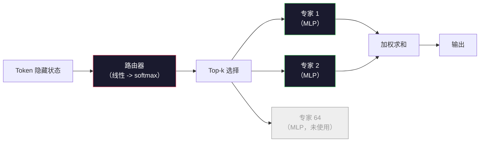

# 开源模型：架构详解

> 你在第04课从零搭建了一个 GPT-2 Small。2026 年的前沿开源模型属于同一个家族，只是做了五六个具体的改动。RMSNorm 替代 LayerNorm。SwiGLU 替代 GELU。RoPE 替代学习位置编码。GQA 或 MLA 替代完整 MHA。大规模混合专家（MoE）。你已经掌握的数学覆盖了其中 95% 的内容。本课将 Llama 3、DeepSeek-V3、Mixtral、Qwen 和 Gemma 并排解读，并指出每种架构分岔的确切位置。

**类型：** 学习
**语言：** Python（标准库）
**前置要求：** 阶段 10，第 04、05、12 课（预训练、缩放、推理）
**时长：** ~45 分钟

## 学习目标

- 阅读 Llama 3、Mistral、Mixtral、Gemma 2、Qwen 2.5 和 DeepSeek-V3 的 config.json，并解释每个字段
- 指出每个模型相对于 GPT-2 Small 的具体架构变化，并从基本原理出发论证其合理性
- 仅凭模型配置即可计算任何开源模型的参数量、KV 缓存大小和激活显存
- 在延迟、显存和能力约束下，为部署目标选择合适的开源模型

## 问题

在第04课，你写了 350 行 numpy 代码，得到了一个 GPT-2 形状的模型。Llama 3 405B 有一份 200 页的技术报告。你的直觉告诉你它们是不同的物种。其实不然。那 200 页描述的是同一个对象，只是做了五六个动机良好的修改，外加一千个关于扩展的实现细节。骨架——嵌入层、Transformer 块、注意力、MLP、归一化、输出头——没有变化。

本课就是一份 diff。对于每个主要的开源模型家族，我们列出它相对于 GPT-2 改变了什么、为什么改、以及代价是什么。学完之后，你可以阅读一张新的模型卡，并在脑中将其翻译回 GPT-2 基线。

实际的回报是：当 Meta 发布 Llama 5 或 DeepSeek 发布 V4 时，你不需要重建心理模型。你只需要看配置，看看哪些已知的旋钮发生了变化，就知道下游影响是什么。2026 年的架构是一个有限的工具箱。每个新模型挑选其中不同的子集。

## 概念

### 不变的核心

所有自回归开源模型共享：

- Token 嵌入矩阵（vocab_size x hidden_dim）。
- N 个解码器块的堆叠：归一化、自注意力、残差连接、归一化、MLP、残差连接。
- 最终归一化和投影到 vocab_size 的线性输出头（通常与嵌入权重共享）。
- 因果掩码，下一个 token 的交叉熵损失。

这就是形状。其余都是旋钮。

### 真正会动的六个旋钮

在 2024-2026 年所有前沿开源模型中，同样的六个设计选择被反复挑选：

1. **归一化。** LayerNorm → RMSNorm。
2. **位置编码。** 学习绝对位置 → RoPE（以及 YaRN、NTK 等变体）。
3. **激活函数。** GELU → SwiGLU（或 GeGLU）。
4. **注意力头共享。** MHA → GQA → MQA → MLA。
5. **稠密 vs 稀疏 MLP。** 稠密 → 混合专家（MoE）。
6. **Pre-norm 位置。** Pre-norm 保留不变。Post-norm 已淘汰。

其他一切（学习率调度、数据配比、批大小、上下文长度）都属于训练配置，而非架构。六个旋钮。

### 旋钮 1：RMSNorm

LayerNorm 减去均值、除以标准差、缩放和平移。RMSNorm 只保留缩放：

```
RMSNorm(x) = x / sqrt(mean(x^2) + eps) * gamma
```

没有均值减法。没有偏置。每个 token 少一次矩阵乘法。Zhang 和 Sennrich（2019）指出它在机器翻译任务上与 LayerNorm 效果相当，同时快 10%。每个现代开源模型都在使用它。

代价：无。收益：小幅吞吐量提升，代码更简洁。

### 旋钮 2：RoPE

GPT-2 中的学习位置嵌入是一个 1024 槽的查找表。上下文长度 1025 就超出了表的范围。模型无法外推到训练长度之外。

旋转位置编码（RoPE，Su 等人，2021）通过在注意力点积之前将每个 Q 和 K 向量成对旋转来注入位置信息。旋转角度是位置的确定性函数，因此没有需要学习的内容，也不会用完。借助缩放技巧（NTK 感知插值、YaRN），在 8k 上下文中训练的模型可以在推理时扩展到 128k，精度仅有适度损失。

```
q_rotated = rotate(q, angle(pos))
k_rotated = rotate(k, angle(pos))
score = q_rotated . k_rotated
```

每个 Llama、Mistral、Qwen、DeepSeek 和 Gemma 都使用 RoPE。Gemma 2 使用混合方式（大多数层用 RoPE，其他层用局部滑动窗口注意力）。

### 旋钮 3：SwiGLU

GPT-2 的 MLP 是 `x -> gelu(xW1 + b1) -> (...)W2 + b2`。SwiGLU（Shazeer，2020）用门控乘积替代了激活函数：

```
SwiGLU(x) = (xW1) * sigmoid(xW1) * xV
```

两个投影并行而非一个，由 Swish 激活门控。经验上，每参数困惑度更强。Llama 2 采用了它，所有人都跟随。MLP 的隐藏维度通常设置为其总参数量与原始稠密 MLP 匹配：如果 GPT-2 使用 `ff_dim = 4 * hidden`，那么 SwiGLU 使用 `ff_dim = (2/3) * 4 * hidden = 8/3 * hidden`。

### 旋钮 4：注意力头共享

GPT-2 使用**多头注意力（MHA）**：每个头都有自己的 Q、K、V 投影。

**多查询注意力（MQA，Shazeer，2019）**在所有头之间共享一个 K 和一个 V。KV 缓存减少 num_heads 倍，在典型模型上相当于 12 到 32 倍的缩减。在困难基准测试上精度略有下降。

**分组查询注意力（GQA，Ainslie 等人，2023）**是中间方案：G 组 Q 头共享一个 K 和一个 V。Llama 3 8B 使用 GQA，32 个 Q 头，8 个 KV 头（G=8），因此 KV 缓存相比完整 MHA 缩小了 4 倍。

**多头潜在注意力（MLA，DeepSeek，2024）**将 K 和 V 压缩到一个共享的低秩潜在空间中，再按头投影回来。进一步减少 KV 缓存，同时保留每个头的表达能力。DeepSeek-V2 和 V3 依赖它来实现长上下文性能。

| 方案 | KV 头数 | KV 缓存 | 精度 |
|------|---------|---------|------|
| MHA  | num_heads | 完整 | 最佳 |
| GQA  | num_groups（G < num_heads） | 减少 num_heads / G 倍 | 接近 MHA |
| MQA  | 1 | 减少 num_heads 倍 | 小幅下降 |
| MLA  | 潜在空间，按头解压缩 | 比 MQA 更小 | 接近 MHA |

对于任何参数超过约 13B 的模型，GQA 或 MLA 几乎是强制性的。大规模下的完整 MHA 是一场 KV 缓存灾难。

### 旋钮 5：混合专家（MoE）

稠密 MLP 对每个 token 激活其所有参数。MoE MLP 每个块有 K 个专家和一个路由器，路由器为每个 token 选择 top-k 个专家（通常 top-2）。只有这些被选中的专家权重对该 token 进行前向传播。

```
router_logits = xW_r
indices, weights = top_k(router_logits, k=2)
output = sum_i weights[i] * expert[indices[i]](x)
```

吸引力在于：你可以拥有 64 个每个 7B 大小的专家（因此总参数量巨大），而每个 token 只运行其中 2 个（因此每个 token 的计算量相当于一个稠密 7B 模型）。Mixtral 8x7B 总参数 47B，但每个 token 只激活 13B。DeepSeek-V3 总参数 671B，但每个 token 只激活 37B。


```mermaid
graph LR
    I["Token 隐藏状态"] --> R["路由器\n（线性 -> softmax）"]
    R --> T["Top-k 选择"]
    T --> E1["专家 1\n（MLP）"]
    T --> E2["专家 2\n（MLP）"]
    T --> EN["专家 64\n（MLP，未使用）"]
    E1 --> S["加权求和"]
    E2 --> S
    S --> O["输出"]

    style EN fill:#eeeeee,stroke:#999,color:#999
    style E1 fill:#1a1a2e,stroke:#51cf66,color:#fff
    style E2 fill:#1a1a2e,stroke:#51cf66,color:#fff
    style R fill:#1a1a2e,stroke:#e94560,color:#fff
```

优点：相同计算量，更多参数，更强容量。缺点：专家内存仍然需要存放（因此服务时需要比稠密等效模型更多的 VRAM），路由器的负载均衡很难，并且在对齐阶段微调路由器本身就是一个研究方向。

### 旋钮 6：Pre-norm 保持不变

原始 Transformer 在每个子层之后应用层归一化。自 GPT-2 以来的每个开源模型都将其放在*每个子层之前*。Pre-norm 在深层网络中严格意义上更容易训练。没什么可争议的。

### 逐模型对比

下面是让所有这些变得具体的表格。

| 模型 | 年份 | 总参数 | 激活参数 | 归一化 | 激活函数 | 位置编码 | 注意力 | MoE | 上下文 |
|------|------|--------|----------|--------|---------|----------|---------|-----|--------|
| GPT-2 Small | 2019 | 124M | 124M | LayerNorm | GELU | 学习编码 | MHA（12 头） | 否 | 1k |
| Llama 3 8B | 2024 | 8B | 8B | RMSNorm | SwiGLU | RoPE | GQA（32/8） | 否 | 128k |
| Llama 3 70B | 2024 | 70B | 70B | RMSNorm | SwiGLU | RoPE | GQA（64/8） | 否 | 128k |
| Llama 3 405B | 2024 | 405B | 405B | RMSNorm | SwiGLU | RoPE | GQA（128/16） | 否 | 128k |
| Mistral 7B | 2023 | 7.2B | 7.2B | RMSNorm | SwiGLU | RoPE | GQA | 否 | 32k |
| Mixtral 8x7B | 2023 | 47B | 13B | RMSNorm | SwiGLU | RoPE | GQA | 是（8 专家，top-2） | 32k |
| Gemma 2 9B | 2024 | 9B | 9B | RMSNorm（pre+post） | GeGLU | RoPE + 滑动窗口 | GQA | 否 | 8k |
| Qwen 2.5 72B | 2024 | 72B | 72B | RMSNorm | SwiGLU | RoPE（YaRN） | GQA（64/8） | 否 | 128k |
| DeepSeek V2 236B | 2024 | 236B | 21B | RMSNorm | SwiGLU | RoPE | MLA | 是（160 专家，top-6） | 128k |
| DeepSeek V3 | 2024 | 671B | 37B | RMSNorm | SwiGLU | RoPE | MLA | 是（256 专家，top-8） | 128k |

扫描各列。RMSNorm 是普适的。SwiGLU 或其表亲 GeGLU 是普适的。RoPE 是普适的。GQA 在 7B 以上的模型中普适，除非被 MLA 取代。MoE 是高端产品的区分因素。

### 阅读 config.json

Llama 3 8B 配置：

```
{
  "hidden_size": 4096,
  "intermediate_size": 14336,
  "num_hidden_layers": 32,
  "num_attention_heads": 32,
  "num_key_value_heads": 8,
  "max_position_embeddings": 131072,
  "rope_theta": 500000.0,
  "rms_norm_eps": 1e-5,
  "vocab_size": 128256
}
```

每个字段都对应你已经实现过的内容。

- `hidden_size`：嵌入维度。
- `intermediate_size`：MLP 隐藏维度（3.5 倍 hidden——SwiGLU 数学）。
- `num_hidden_layers`：堆叠深度。
- `num_attention_heads`：Q 头数。
- `num_key_value_heads`：KV 头数（GQA）。
- `max_position_embeddings`：训练上下文长度。
- `rope_theta`：RoPE 基频。Meta 将其从默认的 10k 扩展到 500k 以实现长上下文外推。
- `rms_norm_eps`：数值稳定性。
- `vocab_size`：词汇表大小。

仅凭这些你就可以计算总参数量、KV 缓存和峰值激活显存。详见 `code/main.py` 中的具体公式。

### 激活显存预算

在参数超过几十亿时，激活显存主导训练显存。预训练（使用梯度检查点）的经验法则：

```
activation_mem ~ batch_size * seq_len * hidden_size * num_layers * bytes_per_element
```

对于 Llama 3 8B，batch 1，seq 8192，BF16，32 层，hidden 4096：使用检查点约需 8 GB 激活显存，不使用时约需 40 GB。这就是为什么 flash-attention 和 ring-attention 至关重要——它们重写了注意力计算，使激活显存变得可管理。

### KV 缓存预算

最大上下文下的推理：

```
kv_cache = 2 * num_layers * num_kv_heads * head_dim * max_seq_len * bytes_per_element
```

Llama 3 8B 在 128k 上下文、BF16、head_dim = hidden / num_heads = 128 时：
`2 * 32 * 8 * 128 * 131072 * 2 = 17.2 GB` 每序列。

8B 权重在 BF16 下是 16 GB。单个 128k 序列的 KV 缓存比权重还大。这就是推动 GQA、MLA 和 KV 缓存量化研究的显存压力。

### 每种模型的最佳使用场景

- **单个 80GB GPU，无 MoE**：Llama 3 8B、Mistral 7B、Gemma 2 9B。易于服务，工具生态广泛。
- **单节点（8x80GB），大容量**：Llama 3 70B、Qwen 2.5 72B。稠密开源模型的最高能力。
- **最大开源能力，接受 MoE 复杂度**：DeepSeek V3、Mixtral 8x22B。每激活 FLOP 的最佳能力。
- **长上下文需求**：Llama 3（带 RoPE 缩放的 128k）、DeepSeek（MLA 优势）。
- **低延迟服务**：Gemma 2 9B（滑动窗口减少了长上下文计算量）。

```figure
rmsnorm-vs-layernorm
```

## 构建它

本课的代码是一个计算器。给定任何 config.json，它会输出各组件参数量、最大上下文下的 KV 缓存、SwiGLU MLP 比例，以及对架构的简短判断（稠密 / GQA / MLA / MoE）。

```python
config = {
    "hidden_size": 4096, "intermediate_size": 14336,
    "num_hidden_layers": 32, "num_attention_heads": 32,
    "num_key_value_heads": 8, "vocab_size": 128256,
    "max_position_embeddings": 131072,
}
```

脚本逐个字段遍历架构，计算嵌入层、注意力（含 GQA 缩减）、MLP（含 SwiGLU 扩展）、层归一化和输出头的参数量。然后计算在指定上下文长度下的 KV 缓存，并打印摘要。

详见 `code/main.py` 的实现。

## 使用它

在脚本中附带的 Llama 3 8B、Mistral 7B、Mixtral 8x7B 和 DeepSeek V3 配置上运行计算器。比较参数量分解。注意 MoE 模型的总参数量远超稠密模型，但激活参数量往往更小。注意 DeepSeek V3 虽然总参数更多，但其 KV 缓存却小于 Llama 3 405B——这是 MLA 在发挥作用。

然后，为你在本地拥有的任何模型插入配置，阅读摘要，并判断它是否适合你的 GPU。

## 交付它

本课产出 `outputs/skill-open-model-picker.md`。给定一个部署目标（GPU 类型、VRAM、上下文长度、延迟预算）和一个任务画像（聊天、代码、推理、长上下文），它会推荐一个开源模型、一个来自第11课的量化方案以及一个来自第12课的推理栈，并附上关于六个架构旋钮的明确推理。

## 练习

1. 从 HuggingFace 读取 Qwen 2.5 72B 的配置。从头计算总参数量。与 HF 报告的值进行比较，并找出任何差异的来源（头维度舍入、KV 共享因子等）。

2. DeepSeek V3 使用 256 个专家，top-8 路由。计算激活专家与总专家的比率，并与 Mixtral 8x7B 的 top-2/8 进行比较。从稀疏（25%）到更稀疏（3%）的转变对每 FLOP 容量意味着什么？

3. 计算 Llama 3 405B 在 128k 上下文下 FP8 和 BF16 的 KV 缓存。FP8 下是 BF16 的一半。在单个 8xH100 节点（每 GPU 80GB，共 640GB，减去权重内存）上可以服务多少个并行序列？

4. Gemma 2 交替使用全注意力和滑动窗口注意力层。当一半的层使用 4096 token 滑动窗口而非完整上下文时，写出 KV 缓存的数学公式。在 8k 总上下文下能节省多少显存？

5. 找一个在本课编写之后发布的最新前沿开源模型。识别它在六个旋钮中的选择，以及它是否引入了第七个旋钮。课程在新架构发布时总会显得过时——目标是在不重建心理模型的情况下更新你的表格。

## 关键术语

| 术语 | 人们说的意思 | 实际含义 |
|------|-------------|----------|
| RMSNorm | "没有均值的 LayerNorm" | 仅通过均方根进行归一化，带有一个学习缩放参数——比 LayerNorm 更便宜且效果相当 |
| RoPE | "旋转位置编码" | 将每个 Q 和 K 向量在 2D 对中按位置角度旋转——借助缩放技巧可外推到训练长度之外 |
| SwiGLU | "新的 MLP 激活函数" | 带 Swish 的门控线性单元：`(xW1) * sigmoid(xW1) * xV`——所有 2024+ 开源模型的标准配置 |
| GQA | "中间方案注意力" | 分组查询注意力：G 组 Q 头共享一个 K 和一个 V 头——在缩小 KV 缓存的同时避免了 MQA 的精度损失 |
| MLA | "DeepSeek 的注意力" | 多头潜在注意力：将 K/V 压缩到共享的低秩潜在空间中，按头解压缩——大型模型中最小的 KV 缓存 |
| MoE | "稀疏专家" | 混合专家：每个块中有 N 个 MLP，路由器为每个 token 选择 top-k——总参数量巨大，激活参数量很小 |
| Top-k 路由 | "每个 token 选 k 个专家" | 路由器为每个专家计算分数并激活分数最高的 k 个——典型 k 值为 2（Mixtral）到 8（DeepSeek） |
| YaRN | "拉伸 RoPE" | 又一种 RoPE 扩展——插值旋转角度，在推理时将上下文从 8k 扩展到 128k+ |
| 滑动窗口注意力 | "不关注所有位置" | 每个 token 只关注最后 W 个 token——将注意力成本限制在每 token O(W)，用于 Gemma 2 和早期 Mistral |
| 激活参数 | "每 token 运行的参数" | 对于 MoE 模型，每个 token 进行前向传播的参数数量（远小于总参数）——决定每 token FLOPs |

## 拓展阅读

- [Dubey et al., 2024 -- "The Llama 3 Herd of Models"](https://arxiv.org/abs/2407.21783) —— 稠密 Llama 3 家族的架构和训练参考
- [DeepSeek-AI, 2024 -- "DeepSeek-V3 Technical Report"](https://arxiv.org/abs/2412.19437) —— MLA 加无辅助损失的负载均衡加 671B MoE
- [Jiang et al., 2024 -- "Mixtral of Experts"](https://arxiv.org/abs/2401.04088) —— 规范的 MoE 开源模型论文
- [Su et al., 2021 -- "RoFormer: Enhanced Transformer with Rotary Position Embedding"](https://arxiv.org/abs/2104.09864) —— RoPE 论文
- [Shazeer, 2020 -- "GLU Variants Improve Transformer"](https://arxiv.org/abs/2002.05202) —— SwiGLU、GeGLU 及其同类
- [Ainslie et al., 2023 -- "GQA: Training Generalized Multi-Query Transformer Models"](https://arxiv.org/abs/2305.13245) —— GQA 论文
- [Gemma 2 Team, 2024 -- "Gemma 2: Improving Open Language Models at a Practical Size"](https://arxiv.org/abs/2408.00118) —— 混合全注意力+滑动注意力，pre+post-norm
- [Qwen Team, 2024 -- "Qwen 2.5 Technical Report"](https://arxiv.org/abs/2412.15115) —— YaRN 上下文扩展和长上下文训练方法
