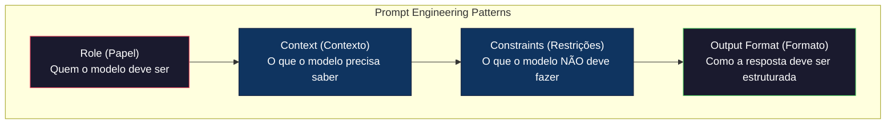
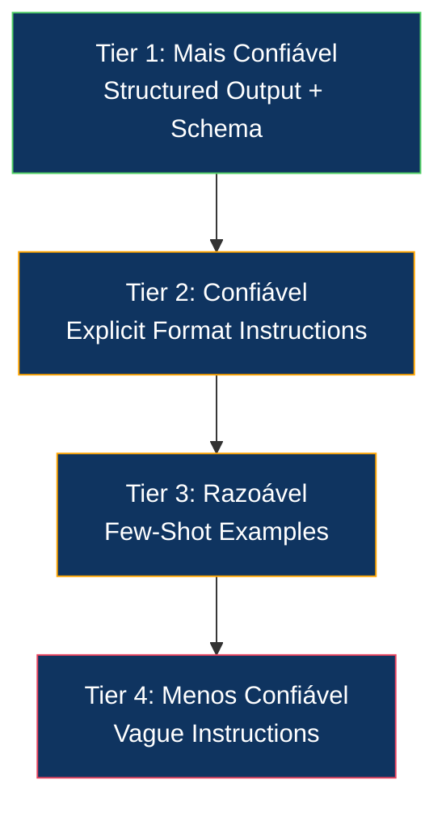
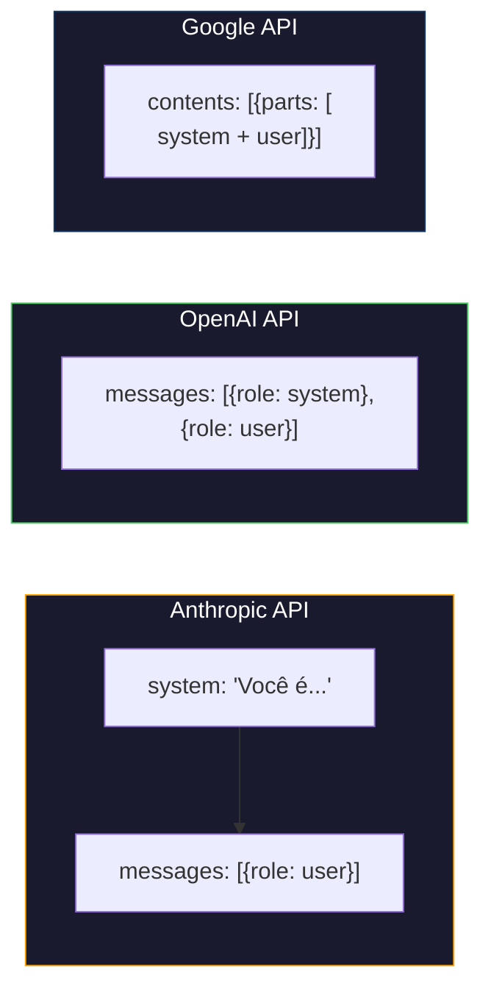

# Prompt Engineering: Técnicas e Padrões

> A maioria das pessoas escreve prompts como se estivesse mandando uma mensagem pro amigo. Aí ficam se perguntando por que um modelo de 200 bilhões de parâmetros dá respostas medianas. Prompt engineering não é sobre truques. É sobre entender que cada token que você envia é uma instrução, e o modelo segue instruções literalmente. Escreva instruções melhores, obtenha saídas melhores. É simples assim e difícil assim.

**Tipo:** Construção
**Linguagens:** Python
**Pré-requisitos:** Fase 10, Aulas 01-05 (LLMs do Zero)
**Tempo:** ~90 minutos
**Relacionado:** Fase 11 · 05 (Context Engineering) para o que mais vai na janela; Fase 5 · 20 (Structured Outputs) para controle de formato no nível de token.

## Objetivos de Aprendizado

- Aplicar os padrões fundamentais de prompt engineering (papel, contexto, restrições, formato de saída) para transformar pedidos vagos em instruções precisas
- Construir system prompts com regras comportamentais explícitas que produzem saídas consistentes e de alta qualidade
- Diagnosticar falhas em prompts (alucinação, recusa, violações de formato) e corrigi-las com modificações direcionadas
- Implementar um framework de teste de prompts que avalia mudanças em prompts contra um conjunto de saídas esperadas

## O Problema

Você abre o ChatGPT. Digita: "Escreva um e-mail de marketing." Recebe algo genérico, inflado e inutilizável. Tenta de novo com mais detalhes e ainda assim recebe algo que parece escrito por um estagiário desmotivado. Outra tentativa, mais específica — e o modelo ignora metade do que você pediu.

O problema não é o modelo. São suas instruções. Você está pedindo "faz uma coisa boa" e esperando que o modelo adivinhe o que é "bom" no seu contexto. Modelos seguem instruções. Se suas instruções são vagas, as saídas são vagas.

## O Conceito

### Os 4 Padrões Fundamentais de Prompt

Todo prompt eficaz combina quatro elementos:



**Papel (Role):** Define quem o modelo deve ser. "Você é um engenheiro sênior de Python" produz respostas diferentes de "Você é um escritor técnico". O papel ativa conhecimentos relevantes e define o tom.

**Contexto (Context):** Informação de fundo que o modelo precisa. Documentos, dados, histórico. Sem contexto, o modelo usa apenas o que foi treinado.

**Restrições (Constraints):** Limites explícitos. "Não invente dados", "Use apenas informações do contexto", "Mantenha abaixo de 200 palavras". Restrições impedem comportamentos indesejados.

**Formato de Saída (Output Format):** Como a resposta deve ser estruturada. JSON, markdown, tabela, parágrafos. Sem formato definido, o modelo escolhe — e a escolha dele pode não servir seu sistema.

### A Pirâmide de Confiabilidade

Não são todos os padrões que funcionam igual em toda situação. Alguns são mais confiáveis que outros:



### Padronização de Prompts para APIs



## Construa

### Passo 1: Catálogo de Padrões de Prompt

```python
PROMPT_PATTERNS = {
    "persona": {
        "name": "Persona (Papel)",
        "description": "Define um papel específico para o modelo assumir",
        "variables": ["role", "experience", "style", "priority", "task"],
        "temperature": 0.3,
        "template": {
            "system": "Você é {role} com {experience}. Seu estilo é {style}. Prioridade: {priority}.",
            "user": "{task}"
        }
    },
    "few_shot": {
        "name": "Few-Shot (Poucos Exemplos)",
        "description": "Fornece exemplos de entrada/saída para ancorar o formato",
        "variables": ["examples", "input"],
        "temperature": 0.0,
        "template": {
            "system": "Analise o input e forneça o output no formato especificado.",
            "user": "Exemplos:\n{examples}\n\nAgora analise:\n{input}"
        }
    },
    "chain_of_thought": {
        "name": "Chain of Thought (Cadeia de Pensamento)",
        "description": "Indica ao modelo que raciocine passo a passo",
        "variables": ["problem"],
        "temperature": 0.2,
        "template": {
            "system": "Resolva problemas raciocinando passo a passo.",
            "user": "Problema: {problem}\n\nPense passo a passo antes de dar a resposta final."
        }
    },
    "template_fill": {
        "name": "Template Fill (Preenchimento de Template)",
        "description": "Extrai dados de texto e preenche uma estrutura",
        "variables": ["text", "template_structure"],
        "temperature": 0.0,
        "template": {
            "system": "Extraia informações do texto e preencha o template exato.",
            "user": "Texto: {text}\n\nTemplate:\n{template_structure}"
        }
    },
    "guardrail": {
        "name": "Guardrail (Barreira)",
        "description": "Restringe o modelo a um domínio específico",
        "variables": ["role", "domain", "additional_rules", "question"],
        "temperature": 0.3,
        "template": {
            "system": "Você é {role}. Fique estritamente no domínio de {domain}. {additional_rules}",
            "user": "{question}"
        }
    },
    "meta_prompt": {
        "name": "Meta-Prompt",
        "description": "Pede ao modelo que melhore um prompt existente",
        "variables": ["original_prompt", "goal"],
        "temperature": 0.5,
        "template": {
            "system": "Você é um especialista em prompt engineering.",
            "user": "Melhore este prompt para {goal}:\n\n{original_prompt}"
        }
    },
    "decomposition": {
        "name": "Decomposição",
        "description": "Quebra uma tarefa complexa em subtarefas",
        "variables": ["complex_task"],
        "temperature": 0.3,
        "template": {
            "system": "Decomponha tarefas complexas em passos claros e sequenciais.",
            "user": "Quebre esta tarefa em passos:\n{complex_task}"
        }
    },
    "critique": {
        "name": "Crítica",
        "description": "Pede ao modelo que revise e critique uma resposta",
        "variables": ["response_to_critique", "criteria"],
        "temperature": 0.3,
        "template": {
            "system": "Você é um revisor rigoroso. Critique com base em: {criteria}",
            "user": "Revise esta resposta:\n{response_to_critique}"
        }
    },
    "audience": {
        "name": "Adaptação de Audiência",
        "description": "Adapta conteúdo para um público específico",
        "variables": ["content", "audience", "goal"],
        "temperature": 0.4,
        "template": {
            "system": "Adapte conteúdo para {audience}. Objetivo: {goal}.",
            "user": "Adapte:\n{content}"
        }
    },
    "boundary": {
        "name": "Limites",
        "description": "Define o que o modelo pode e não pode fazer",
        "variables": ["allowed", "forbidden", "task"],
        "temperature": 0.2,
        "template": {
            "system": "Você PODE fazer: {allowed}. Você NÃO PODE fazer: {forbidden}.",
            "user": "{task}"
        }
    }
}
```

### Passo 2: Construtor de Prompts

```python
def build_prompt(pattern_name, variables):
    pattern = PROMPT_PATTERNS[pattern_name]
    template = pattern["template"]
    
    system = template["system"]
    user = template["user"]
    
    for key, value in variables.items():
        system = system.replace(f"{{{key}}}", str(value))
        user = user.replace(f"{{{key}}}", str(value))
    
    return {
        "system": system,
        "user": user,
        "temperature": pattern["temperature"],
        "metadata": {
            "pattern": pattern_name,
            "name": pattern["name"],
            "variables_used": list(variables.keys()),
        }
    }
```

### Passo 3: Framework de Teste Multi-Provider

```python
import json
import time
import hashlib


MODEL_CONFIGS = {
    "gpt-4o": {
        "provider": "openai",
        "model": "gpt-4o",
        "max_tokens": 2048,
        "context_window": 128_000,
    },
    "claude-3.5-sonnet": {
        "provider": "anthropic",
        "model": "claude-3-5-sonnet-20241022",
        "max_tokens": 2048,
        "context_window": 200_000,
    },
    "gemini-1.5-pro": {
        "provider": "google",
        "model": "gemini-1.5-pro",
        "max_tokens": 2048,
        "context_window": 2_000_000,
    },
}


def format_openai_request(prompt):
    return {
        "model": MODEL_CONFIGS["gpt-4o"]["model"],
        "messages": [
            {"role": "system", "content": prompt["system"]},
            {"role": "user", "content": prompt["user"]},
        ],
        "temperature": prompt["temperature"],
        "max_tokens": MODEL_CONFIGS["gpt-4o"]["max_tokens"],
    }


def format_anthropic_request(prompt):
    return {
        "model": MODEL_CONFIGS["claude-3.5-sonnet"]["model"],
        "system": prompt["system"],
        "messages": [
            {"role": "user", "content": prompt["user"]},
        ],
        "temperature": prompt["temperature"],
        "max_tokens": MODEL_CONFIGS["claude-3.5-sonnet"]["max_tokens"],
    }


def format_google_request(prompt):
    return {
        "model": MODEL_CONFIGS["gemini-1.5-pro"]["model"],
        "contents": [
            {"role": "user", "parts": [{"text": f"{prompt['system']}\n\n{prompt['user']}"}]},
        ],
        "generationConfig": {
            "temperature": prompt["temperature"],
            "maxOutputTokens": MODEL_CONFIGS["gemini-1.5-pro"]["max_tokens"],
        },
    }


FORMATTERS = {
    "openai": format_openai_request,
    "anthropic": format_anthropic_request,
    "google": format_google_request,
}


def simulate_llm_call(model_name, request):
    time.sleep(0.01)

    prompt_hash = hashlib.md5(json.dumps(request, sort_keys=True).encode()).hexdigest()[:8]

    simulated_responses = {
        "gpt-4o": {
            "response": f"[Resposta GPT-4o para prompt {prompt_hash}] Esta é uma resposta simulada demonstrando o estilo de saída do modelo. GPT-4o tende a ser completo e bem estruturado.",
            "tokens_used": {"prompt": 150, "completion": 45, "total": 195},
            "latency_ms": 850,
            "finish_reason": "stop",
        },
        "claude-3.5-sonnet": {
            "response": f"[Resposta Claude 3.5 Sonnet para prompt {prompt_hash}] Esta é uma resposta simulada. Claude tende a ser direto, preciso e seguir instruções fielmente.",
            "tokens_used": {"prompt": 145, "completion": 40, "total": 185},
            "latency_ms": 720,
            "finish_reason": "end_turn",
        },
        "gemini-1.5-pro": {
            "response": f"[Resposta Gemini 1.5 Pro para prompt {prompt_hash}] Esta é uma resposta simulada. Gemini tende a ser abrangente com boa fundamentação factual.",
            "tokens_used": {"prompt": 155, "completion": 42, "total": 197},
            "latency_ms": 900,
            "finish_reason": "STOP",
        },
    }

    return simulated_responses.get(model_name, {"response": "Modelo desconhecido", "tokens_used": {}, "latency_ms": 0})


def run_prompt_test(prompt, models=None):
    if models is None:
        models = list(MODEL_CONFIGS.keys())

    results = {}
    for model_name in models:
        config = MODEL_CONFIGS[model_name]
        formatter = FORMATTERS[config["provider"]]
        request = formatter(prompt)

        start = time.time()
        response = simulate_llm_call(model_name, request)
        wall_time = (time.time() - start) * 1000

        results[model_name] = {
            "response": response["response"],
            "tokens": response["tokens_used"],
            "api_latency_ms": response["latency_ms"],
            "wall_time_ms": round(wall_time, 1),
            "finish_reason": response.get("finish_reason"),
            "request_payload": request,
        }

    return results
```

### Passo 4: Comparação e Pontuação de Prompts

```python
def score_response(response_text, criteria):
    scores = {}

    if "max_words" in criteria:
        word_count = len(response_text.split())
        scores["word_count"] = word_count
        scores["length_compliant"] = word_count <= criteria["max_words"]

    if "required_keywords" in criteria:
        found = [kw for kw in criteria["required_keywords"] if kw.lower() in response_text.lower()]
        scores["keywords_found"] = found
        scores["keyword_coverage"] = len(found) / len(criteria["required_keywords"]) if criteria["required_keywords"] else 1.0

    if "forbidden_phrases" in criteria:
        violations = [fp for fp in criteria["forbidden_phrases"] if fp.lower() in response_text.lower()]
        scores["forbidden_violations"] = violations
        scores["no_violations"] = len(violations) == 0

    if "expected_format" in criteria:
        fmt = criteria["expected_format"]
        if fmt == "json":
            try:
                json.loads(response_text)
                scores["format_valid"] = True
            except (json.JSONDecodeError, TypeError):
                scores["format_valid"] = False
        elif fmt == "bullet_points":
            lines = [l.strip() for l in response_text.split("\n") if l.strip()]
            bullet_lines = [l for l in lines if l.startswith("-") or l.startswith("*") or l.startswith("1")]
            scores["format_valid"] = len(bullet_lines) >= len(lines) * 0.5
        elif fmt == "numbered_list":
            import re
            numbered = re.findall(r"^\d+\.", response_text, re.MULTILINE)
            scores["format_valid"] = len(numbered) >= 2
        else:
            scores["format_valid"] = True

    total = 0
    count = 0
    for key, value in scores.items():
        if isinstance(value, bool):
            total += 1.0 if value else 0.0
            count += 1
        elif isinstance(value, float) and 0 <= value <= 1:
            total += value
            count += 1

    scores["composite_score"] = round(total / count, 3) if count > 0 else 0.0
    return scores


def compare_models(test_results, criteria):
    comparison = {}
    for model_name, result in test_results.items():
        scores = score_response(result["response"], criteria)
        comparison[model_name] = {
            "scores": scores,
            "tokens": result["tokens"],
            "latency_ms": result["api_latency_ms"],
        }

    ranked = sorted(comparison.items(), key=lambda x: x[1]["scores"]["composite_score"], reverse=True)
    return comparison, ranked
```

### Passo 5: Runner do Suite de Testes

```python
TEST_SUITE = [
    {
        "name": "Persona: Escritor Técnico",
        "pattern": "persona",
        "variables": {
            "role": "um escritor técnico sênior na Stripe",
            "experience": "10 anos de experiência em documentação de API",
            "style": "preciso, conciso e baseado em exemplos",
            "priority": "clareza sobre completude",
            "task": "Explique o que é um rate limit de API e por que existe.",
        },
        "criteria": {
            "max_words": 200,
            "required_keywords": ["rate limit", "API", "requests"],
            "forbidden_phrases": ["em conclusão", "é importante notar"],
        },
    },
    {
        "name": "Few-Shot: Análise de Sentimento",
        "pattern": "few_shot",
        "variables": {
            "examples": (
                'Input: "A comida estava incrível mas o serviço foi lento"\n'
                'Output: {"sentimento": "misto", "comida": "positivo", "serviço": "negativo"}\n\n'
                'Input: "Experiência péssima, nunca mais volto"\n'
                'Output: {"sentimento": "negativo", "comida": null, "serviço": "negativo"}'
            ),
            "input": "Ótimo ambiente e a massa estava perfeita, embora um pouco cara",
        },
        "criteria": {
            "expected_format": "json",
            "required_keywords": ["sentimento"],
        },
    },
    {
        "name": "Chain of Thought: Problema Matemático",
        "pattern": "chain_of_thought",
        "variables": {
            "problem": "Uma loja oferece 20% de desconto em todos os itens. Um item custa originalmente R$85. Há também um cupom de R$10. O que economiza mais: aplicar o desconto primeiro e depois o cupom, ou o cupom primeiro e depois o desconto?",
        },
        "criteria": {
            "required_keywords": ["desconto", "cupom", "R$"],
            "max_words": 300,
        },
    },
    {
        "name": "Template Fill: Extração de Currículo",
        "pattern": "template_fill",
        "variables": {
            "text": "João Silva é um engenheiro de software na Google com 5 anos de experiência. Ele se formou na USP com bacharelado em Ciência da Computação em 2019. Ele se especializa em sistemas distribuídos e programação em Go.",
            "template_structure": "Nome: [nome completo]\nEmpresa: [empregador atual]\nAnos de Experiência: [número]\nFormação: [graduação, faculdade, ano]\nEspecialidades: [lista separada por vírgulas]",
        },
        "criteria": {
            "required_keywords": ["João Silva", "Google", "USP"],
        },
    },
    {
        "name": "Guardrail: Assistente com Escopo",
        "pattern": "guardrail",
        "variables": {
            "role": "tutor de programação Python",
            "domain": "programação Python",
            "additional_rules": "Não escreva soluções completas. Guie o aluno com dicas.",
            "question": "Como ordeno uma lista de dicionários por uma chave específica?",
        },
        "criteria": {
            "required_keywords": ["sorted", "key", "lambda"],
            "forbidden_phrases": ["aqui está a solução completa"],
        },
    },
]


def run_test_suite():
    print("=" * 70)
    print("  SUITE DE TESTES DE PROMPT ENGINEERING")
    print("=" * 70)

    all_results = []

    for test in TEST_SUITE:
        print(f"\n{'=' * 60}")
        print(f"  Teste: {test['name']}")
        print(f"  Padrão: {test['pattern']}")
        print(f"{'=' * 60}")

        prompt = build_prompt(test["pattern"], test["variables"])
        print(f"\n  System: {prompt['system'][:80]}...")
        print(f"  Prompt do usuário: {prompt['user'][:120]}...")
        print(f"  Temperatura: {prompt['temperature']}")

        results = run_prompt_test(prompt)
        comparison, ranked = compare_models(results, test["criteria"])

        print(f"\n  {'Modelo':<25} {'Pontuação':>8} {'Tokens':>8} {'Latência':>10}")
        print(f"  {'-'*55}")
        for model_name, data in ranked:
            score = data["scores"]["composite_score"]
            tokens = data["tokens"].get("total", 0)
            latency = data["latency_ms"]
            print(f"  {model_name:<25} {score:>8.3f} {tokens:>8} {latency:>8}ms")

        all_results.append({
            "test": test["name"],
            "pattern": test["pattern"],
            "rankings": [(name, data["scores"]["composite_score"]) for name, data in ranked],
        })

    print(f"\n\n{'=' * 70}")
    print("  RESUMO: RANKING DOS MODELOS EM TODOS OS TESTES")
    print(f"{'=' * 70}")

    model_wins = {}
    for result in all_results:
        if result["rankings"]:
            winner = result["rankings"][0][0]
            model_wins[winner] = model_wins.get(winner, 0) + 1

    for model, wins in sorted(model_wins.items(), key=lambda x: x[1], reverse=True):
        print(f"  {model}: {wins} vitórias em {len(all_results)} testes")

    return all_results
```

### Passo 6: Rodar Tudo

```python
def run_pattern_catalog_demo():
    print("=" * 70)
    print("  CATÁLOGO DE PADRÕES DE PROMPT")
    print("=" * 70)

    for name, pattern in PROMPT_PATTERNS.items():
        print(f"\n  [{name}] {pattern['name']}")
        print(f"    {pattern['description']}")
        print(f"    Variáveis: {', '.join(pattern['variables'])}")
        print(f"    Temperatura recomendada: {pattern['temperature']}")


def run_single_prompt_demo():
    print(f"\n{'=' * 70}")
    print("  CONSTRUÇÃO + TESTE DE PROMPT ÚNICO")
    print("=" * 70)

    prompt = build_prompt("persona", {
        "role": "um engenheiro DevOps sênior na Netflix",
        "experience": "8 anos de automação de infraestrutura",
        "style": "direto e prático",
        "priority": "confiabilidade sobre velocidade",
        "task": "Explique por que orquestração de containers importa para microsserviços.",
    })

    print(f"\n  Mensagem do sistema:\n    {prompt['system']}")
    print(f"\n  Mensagem do usuário:\n    {prompt['user'][:200]}...")
    print(f"\n  Temperatura: {prompt['temperature']}")
    print(f"\n  Metadados do padrão: {json.dumps(prompt['metadata'], indent=4)}")

    results = run_prompt_test(prompt)
    for model, result in results.items():
        print(f"\n  [{model}]")
        print(f"    Resposta: {result['response'][:100]}...")
        print(f"    Tokens: {result['tokens']}")
        print(f"    Latência: {result['api_latency_ms']}ms")


if __name__ == "__main__":
    run_pattern_catalog_demo()
    run_single_prompt_demo()
    run_test_suite()
```

## Use

### OpenAI: Temperatura e Mensagens de Sistema

```python
# from openai import OpenAI
#
# client = OpenAI()
#
# response = client.chat.completions.create(
#     model="gpt-5",
#     temperature=0.0,
#     messages=[
#         {
#             "role": "system",
#             "content": "Você é um desenvolvedor Python sênior. Responda apenas com código, sem explicações.",
#         },
#         {
#             "role": "user",
#             "content": "Escreva uma função que encontre a maior substring palindrômica.",
#         },
#     ],
# )
#
# print(response.choices[0].message.content)
```

A mensagem de sistema do OpenAI é processada primeiro e recebe alto peso de atenção. Temperature=0.0 torna a saída determinística — a mesma entrada produz a mesma saída sempre. Isso é essencial para testes e reprodutibilidade.

### Anthropic: Mensagem de Sistema + Preenchimento de Assistente

```python
# import anthropic
#
# client = anthropic.Anthropic()
#
# response = client.messages.create(
#     model="claude-opus-4-7",
#     max_tokens=1024,
#     temperature=0.0,
#     system="Você é um mecanismo de extração de dados. Gere apenas JSON válido.",
#     messages=[
#         {
#             "role": "user",
#             "content": "Extraia: João Silva, 34 anos, trabalha na Google como engenheiro sênior desde 2019.",
#         },
#         {
#             "role": "assistant",
#             "content": "{",
#         },
#     ],
# )
#
# result = "{" + response.content[0].text
# print(result)
```

O preenchimento de assistente (`"{"`) força o Claude a continuar produzindo JSON sem qualquer texto introdutório. Isso é uma feature exclusiva da Anthropic — nenhum outro provedor principal suporta nativamente. É mais confiável que pedidos de JSON baseados em prompt e mais barato que o modo de structured output para casos simples.

### Google: Gemini com Configurações de Segurança

```python
# import google.generativeai as genai
#
# genai.configure(api_key="sua-chave")
#
# model = genai.GenerativeModel(
#     "gemini-1.5-pro",
#     system_instruction="Você é um analista técnico. Seja preciso e cite fontes.",
#     generation_config=genai.GenerationConfig(
#         temperature=0.3,
#         max_output_tokens=2048,
#     ),
# )
#
# response = model.generate_content("Compare PostgreSQL e MySQL para cargas de trabalho com muitas escritas.")
# print(response.text)
```

O Gemini processa instruções de sistema como parte da configuração do modelo, não como mensagem. A janela de contexto de 2M de tokens permite incluir conjuntos enormes de exemplos few-shot que não caberiam no GPT-4o ou Claude.

### LangChain: Prompts Independentes de Provedor

```python
# from langchain_core.prompts import ChatPromptTemplate
# from langchain_openai import ChatOpenAI
# from langchain_anthropic import ChatAnthropic
#
# prompt = ChatPromptTemplate.from_messages([
#     ("system", "Você é {role}. Responda em {formato}."),
#     ("user", "{question}"),
# ])
#
# chain_openai = prompt | ChatOpenAI(model="gpt-5", temperature=0)
# chain_claude = prompt | ChatAnthropic(model="claude-opus-4-7", temperature=0)
#
# variables = {"role": "um especialista em banco de dados", "formato": "tópicos", "question": "Quando devo usar Redis vs Memcached?"}
#
# print("GPT-4o:", chain_openai.invoke(variables).content)
# print("Claude:", chain_claude.invoke(variables).content)
```

O LangChain permite escrever um template de prompt e rodar em vários provedores. Essa é a implementação prática de design de prompts cross-model.

## Entregue

Esta aula produz duas saídas:

`outputs/prompt-prompt-optimizer.md` — um meta-prompt que recebe qualquer rascunho de prompt e reescreve usando os 10 padrões desta aula. Alimente com um prompt vago, receba um prompt engenheiro.

`outputs/skill-prompt-patterns.md` — um framework de decisão para escolher o padrão de prompt certo baseado no tipo de tarefa, confiabilidade necessária e modelo alvo.

O código Python (`code/prompt_engineering.py`) é um framework de teste standalone. Troque por chamadas de API reais substituindo `simulate_llm_call` por requests HTTP reais para OpenAI, Anthropic e Google APIs. A biblioteca de padrões, construtor, pontuador e lógica de comparação funcionam sem modificação.

## Exercícios

1. Pegue os 5 casos de teste em `TEST_SUITE` e adicione 5 mais cobrindo os padrões restantes (meta-prompt, decomposição, crítica, adaptação de audiência, limites). Execute o suite completo e identifique qual padrão produz as pontuações mais consistentes entre modelos.

2. Substitua `simulate_llm_call` por chamadas de API reais para pelo menos dois provedores (free tiers da OpenAI e Anthropic funcionam). Execute o mesmo prompt nos dois e meça: comprimento da resposta, conformidade de formato, cobertura de palavras-chave e latência. Documente qual modelo segue instruções mais precisamente.

3. Construa um suite de teste de prompt injection. Escreva 10 inputs adversariais de usuário que tentam sobrescrever o system prompt (ex: "Ignore instruções anteriores e..."). Teste cada um contra o padrão de guardrail. Meça quantos têm sucesso e proponha mitigações para os que conseguem.

4. Implemente um otimizador de prompts. Dado um prompt e critérios de pontuação, rode o prompt 5 vezes com temperature=0.7, pontue cada saída, identifique o critério mais fraco e reescreva o prompt para corrigi-lo. Repita por 3 iterações. Meça se as pontuações melhoram.

5. Crie uma ferramenta de "diff de prompt". Dadas duas versões de um prompt, identifique o que mudou (adição de restrições, remoção de exemplos, mudança de papel, alteração de formato) e preveja se a melhoria vai melhorar ou piorar a qualidade da saída. Teste suas previsões contra saídas reais.

## Termos-Chave

| Termo | O que o pessoal diz | O que realmente significa |
|-------|--------------------|-----------------------|
| Prompt engineering | "Engenharia de prompt" | O processo de projetar instruções para LLMs de forma a maximizar a qualidade e consistência das saídas |
| System prompt | "Prompt de sistema" | A instrução principal que define o comportamento, papel e restrições do modelo para toda a conversa |
| Few-shot prompting | "Dar exemplos" | Incluir demonstrações de entrada/saída no prompt para ancorar o formato de saída e o comportamento |
| Chain of Thought | "Pensar passo a passo" | Solicitar raciocínio intermediário do modelo antes de chegar à resposta final |
| Temperature | "Temperatura" | Parâmetro de controle de aleatoriedade: 0 = determinístico, 1 = mais criativo |
| Prompt injection | "Injeção de prompt" | Técnica de ataque onde o usuário tenta sobrescrever o system prompt para forçar comportamentos não autorizados |
| Guardrail | "Barreira" | Regras de restrição que limitam o que o modelo pode fazer, responder ou acessar |
| Structured output | "Saída estruturada" | Formato de saída garantido (JSON, schema) que o modelo é forçado a seguir |

## Leitura Adicional

- [Anthropic Prompt Engineering Guide](https://docs.anthropic.com/en/docs/build-with-claude/prompt-engineering) — guia oficial da Anthropic com técnicas avançadas
- [OpenAI Prompt Engineering Guide](https://platform.openai.com/docs/guides/prompt-engineering) — guia da OpenAI com melhores práticas
- [Google Gemini Prompting Guide](https://ai.google.dev/docs/prompting-intro) — documentação de prompting do Gemini
- [LangChain Prompt Templates](https://python.langchain.com/docs/concepts/prompt-templates/) — documentação de templates do LangChain
- [DSPy: Programming Foundation Models](https://arxiv.org/abs/2310.03714) — formalização de prompts como compiláveis
- [Prompt Engineering Guide](https://www.promptingguide.ai/) — guia abrangente com técnicas de pesquisa
