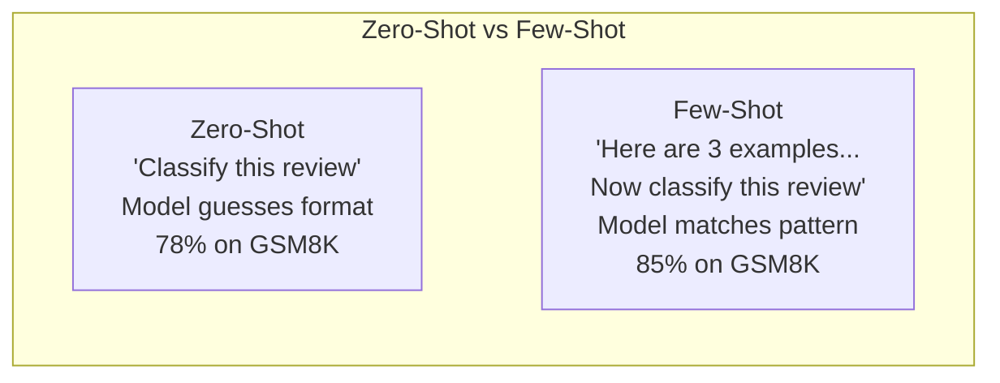
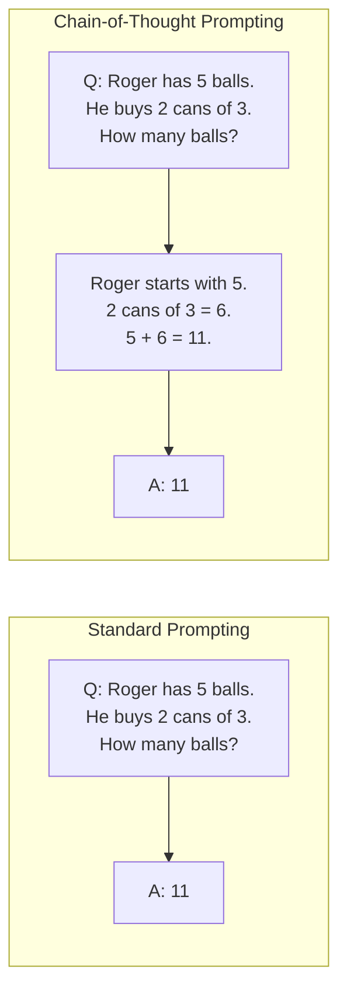
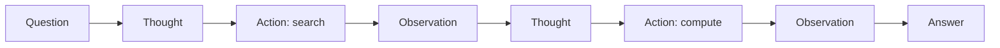

# Few-Shot, Chain-of-Thought, Tree-of-Thought

> モデルに何をするか伝えるのが prompting です。どう考えるかを見せるのが engineering です。同じモデル、同じタスク、同じデータで精度が 78% から 91% に上がる差は、より良いモデルではありません。より良い reasoning strategy です。

**種別:** 構築
**言語:** Python
**前提条件:** Lesson 11.01 (Prompt Engineering)
**所要時間:** 約45分

## Learning Objectives

- task accuracy を最大化する example demonstrations を選び、整形して few-shot prompting を実装する
- math word problems のような multi-step problems で accuracy を改善する chain-of-thought (CoT) reasoning を適用する
- 複数の reasoning paths を探索し、最良のものを選ぶ tree-of-thought prompt を作る
- zero-shot、few-shot、CoT の accuracy improvement を standard benchmark で測定する

## 問題

数学チューターアプリを作るとします。prompt は "Solve this word problem." です。GPT-5 は grade-school math benchmark の GSM8K で 94% 正解します。もう限界に見えますが、そうではありません。chain-of-thought はまだ 3-4 points を足します。

"Let's think step by step" を足すと精度が跳ね上がります。worked examples を数個足すとさらに上がります。同じモデル、同じ temperature、同じ API cost でも、違いはモデルに scratch paper を与えたことだけです。

これは hack ではありません。推論はそうやって動きます。人間も多段階問題を一足飛びには解きません。transformers も同じです。中間 tokens を生成させると、それらは次の token の context になります。各 reasoning step が次を支え、モデルは文字どおり答えへ計算していきます。

## The Concept

### Zero-Shot vs Few-Shot: 例が指示に勝つとき

Zero-shot prompting はタスクだけを与えます。Few-shot prompting は先に例を与えます。Wei et al. (2022) は 8 benchmarks でこれを測定しました。sentiment classification のような単純タスクでは差は小さく、multi-step arithmetic や symbolic reasoning のような複雑タスクでは few-shot が 10-25% 改善しました。

例は圧縮された指示です。出力形式を説明する代わりに見せます。reasoning process を説明する代わりに実演します。



**When few-shot wins:** format-sensitive tasks、classification、structured extraction、domain-specific jargon、特定 pattern を合わせる必要があるタスク。

**When zero-shot wins:** simple factual questions、examples が creativity を縛る creative tasks、良い例を探すほうが難しいタスク。

### Example Selection: ランダムより類似

すべての例が同じ価値ではありません。target input に近い例は random selection より分類タスクで 5-15% 良い結果を出します。原則は 3 つです。

1. **Semantic similarity**: embedding space で入力に近い例を選ぶ
2. **Label diversity**: すべての output categories をカバーする
3. **Difficulty matching**: target problem と complexity level を合わせる

多くのタスクで最適な例数は 3-5 です。3 未満では pattern を抽出する signal が不足し、5 を超えると diminishing returns と context cost が目立ちます。

### Chain-of-Thought: モデルに scratch paper を与える

Chain-of-Thought (CoT) prompting は Wei et al. (2022) が導入しました。答えだけを求めるのではなく、先に reasoning steps を示させます。



機械的には、transformer が生成した各 token は次の token の context になります。CoT がないと、モデルは 1 回の forward pass の hidden state に推論を詰め込まなければなりません。CoT があると、中間計算が tokens として外部化され、有効な計算深度が伸びます。

| Model | Zero-Shot | Zero-Shot CoT | Few-Shot CoT |
|-------|-----------|---------------|--------------|
| GPT-4o | 78% | 91% | 95% |
| GPT-5 | 94% | 97% | 98% |
| o4-mini (reasoning) | 97% | — | — |
| Claude Opus 4.7 | 93% | 97% | 98% |
| Gemini 3 Pro | 92% | 96% | 98% |
| Llama 4 70B | 80% | 89% | 94% |
| DeepSeek-V3.1 | 89% | 94% | 96% |

**Reasoning models について。** OpenAI の o-series や DeepSeek-R1 のような models は、回答を出す前に内部で chain-of-thought を実行します。こうしたモデルに "Let's think step by step" を足すのは冗長で、ときに逆効果です。

### Self-Consistency: 多くサンプルして 1 回投票する

Self-consistency は、N 個の独立した reasoning paths をサンプルし、final answer の majority vote を取る手法です。1 本の CoT path は間違うことがありますが、複数 path の誤りは相殺されます。

N samples は API cost と latency が N 倍になる tradeoff があります。実務では N=5 で多くの効果を得られます。N=3 が意味のある vote の最小値です。

### Tree-of-Thought: 分岐探索

Tree-of-Thought (ToT) は線形の CoT と違い、複数 branches を探索し、有望なものを評価してから続けます。

ToT には 3 つの要素があります。

1. **Thought generation**: 複数の candidate next-steps を生成する
2. **State evaluation**: 各 candidate を score する (LLM 自身を evaluator にできる)
3. **Search algorithm**: BFS または DFS で tree を探索し、低 score branches を prune する

ToT は高価です。branching factor 3、depth 3 の tree は最大 39 LLM calls を必要とします。search space が広く、かつ評価可能な問題に限定して使います。

### ReAct: 考える + 実行する

ReAct は reasoning traces と actions を組み合わせます。モデルは thought、action、observation を交互に進めます。



ReAct は reasoning を実データに接地できるため、knowledge-intensive tasks で pure CoT を上回ります。現代の AI agents の基礎であり、LangChain、CrewAI、AutoGen などは Thought-Action-Observation loop の変種を実装しています。

### Structured Prompting: XML Tags, Delimiters, Headers

prompt が複雑になるほど、構造化は section の混同を防ぎます。

**XML tags**:
```
<context>
You are reviewing a pull request.
The codebase uses TypeScript and React.
</context>

<task>
Review the following diff for bugs, security issues, and style violations.
</task>
```

**Markdown headers**:
```
## Role
Senior security engineer at a fintech company.

## Task
Analyze this API endpoint for vulnerabilities.
```

**Delimiters**:
```
---INPUT---
{user_text}
---END INPUT---
```

### Prompt Chaining: 逐次分解

単一 prompt には複雑すぎるタスクがあります。Prompt chaining はタスクを段階に分け、ある prompt の output を次の input にします。

1. **Each step is simpler**: モデルは 1 つの focused task だけを処理する
2. **Intermediate outputs are inspectable**: step 間で検証や修正ができる
3. **Different steps can use different models**: extraction は安いモデル、reasoning は高いモデルにできる

## 実装

この lesson では、few-shot prompting、chain-of-thought reasoning、self-consistency voting を組み合わせた math problem solver を作ります。hard problems 用に tree-of-thought も追加します。実装は `code/advanced_prompting.py` にあります。

### Step 1: Few-Shot Example Store

few-shot examples を管理し、与えられた problem に最も relevant なものを選ぶ component を作ります。各 example は question、reasoning chain、final answer の 3 部分を持ちます。

### Step 2: Chain-of-Thought Prompt Builder

system message、reasoning chains を持つ few-shot examples、target question を 1 つの prompt に組み立てます。"The answer is [number]" の format constraint は、self-consistency で answers を抽出して比較するために重要です。

### Step 3: Self-Consistency Voting

N 個の reasoning paths をサンプルし、majority answer を取ります。temperature 0.7 が重要です。0.0 では N samples が同一になり、目的が失われます。

### Step 4: Tree-of-Thought Solver

linear reasoning が失敗する問題では、ToT が複数 approaches を探索し、最も promising な方向を評価します。evaluator も LLM call です。

### Step 5: Full Pipeline

cheap な single CoT から始め、self-consistency confidence が低ければ ToT に escalate します。多くの問題は安く解け、難しい問題だけ compute を増やします。

## Use It

LangChain では prompt templates と output parsing が few-shot や CoT patterns を簡単にします。DSPy は prompting strategies を optimizable modules として扱い、`ChainOfThought` や `dspy.majority` で reasoning traces と self-consistency を提供します。

## Ship It

この lesson は 2 つの artifacts を生成します。

**1. Reasoning Chain Prompt** (`outputs/prompt-reasoning-chain.md`): self-consistency 対応 few-shot CoT の production-ready prompt template です。

**2. CoT Pattern Selection Skill** (`outputs/skill-cot-patterns.md`): task type、accuracy requirements、cost constraints に基づいて reasoning technique を選ぶ decision framework です。

## Exercises

1. **Measure the gap**: 10 個の GSM8K problems を zero-shot、few-shot、zero-shot CoT、few-shot CoT で解き accuracy を記録します。
2. **Example selection experiment**: random selection と hand-picked similar examples を比較します。
3. **Self-consistency cost curve**: N=1, 3, 5, 7, 10 で accuracy vs cost を plot します。
4. **Build a ReAct loop**: calculator tool を追加し、pure CoT と比較します。
5. **ToT for creative tasks**: 6-word story の creative writing に ToT を適用します。

## Key Terms

| Term | What people say | What it actually means |
|------|----------------|----------------------|
| Few-shot prompting | 「例をいくつか渡す」 | prompt に入出力 demonstrations を含め、output format と behavior を固定すること |
| Chain-of-Thought | 「段階的に考えさせる」 | final answer 前に intermediate reasoning tokens を引き出すこと |
| Self-Consistency | 「複数回実行する」 | temperature > 0 で N 個の diverse reasoning paths を sample し、最頻 final answer を選ぶこと |
| Tree-of-Thought | 「選択肢を探索させる」 | partial solutions を評価し、有望な paths だけを広げる reasoning branches 上の structured search |
| ReAct | 「Thinking + tool use」 | Thought-Action-Observation loop で reasoning traces と external actions を交互に行うこと |
| Prompt chaining | 「ステップに分ける」 | complex task を sequential prompts に分解し、各 output を次 input に渡すこと |
| Zero-shot CoT | 「think step by step を足すだけ」 | examples なしで reasoning trigger phrase を追加すること |

## 参考文献

- [Chain-of-Thought Prompting Elicits Reasoning in Large Language Models](https://arxiv.org/abs/2201.11903) -- Wei et al. 2022。CoT の原論文。
- [Self-Consistency Improves Chain of Thought Reasoning in Language Models](https://arxiv.org/abs/2203.11171) -- Wang et al. 2023。self-consistency の論文。
- [Tree of Thoughts: Deliberate Problem Solving with Large Language Models](https://arxiv.org/abs/2305.10601) -- Yao et al. 2023。ToT の論文。
- [ReAct: Synergizing Reasoning and Acting in Language Models](https://arxiv.org/abs/2210.03629) -- Yao et al. 2022。modern AI agents の基礎。
- [Large Language Models are Zero-Shot Reasoners](https://arxiv.org/abs/2205.11916) -- Kojima et al. 2022。"Let's think step by step" の論文。
- [DSPy: Compiling Declarative Language Model Calls into Self-Improving Pipelines](https://arxiv.org/abs/2310.03714) -- prompting を compilation problem として扱う研究。
- [OpenAI — Reasoning models guide](https://platform.openai.com/docs/guides/reasoning) -- reasoning mode の vendor guidance。
