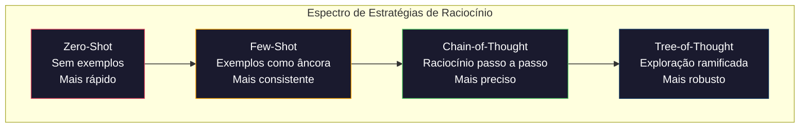

# Few-Shot, Chain-of-Thought, Tree-of-Thought

> Dizer ao modelo o que fazer é prompting. Mostrar como pensar é engenharia. A diferença entre 78% e 91% de acurácia no mesmo modelo, mesma tarefa, mesmo dados não é um modelo melhor. É uma estratégia de raciocínio melhor.

**Tipo:** Construção
**Linguagens:** Python
**Pré-requisitos:** Aula 11.01 (Prompt Engineering)
**Tempo:** ~45 minutos

## Objetivos de Aprendizado

- Implementar few-shot prompting selecionando e formatando demonstrações que maximizam a acurácia da tarefa
- Aplicar raciocínio chain-of-thought (CoT) para melhorar acurácia em problemas de múltiplos passos como problemas de matemática
- Construir um prompt tree-of-thought que explora múltiplos caminhos de raciocínio e seleciona o melhor
- Medir a melhoria de acurácia entre zero-shot vs few-shot vs CoT em um benchmark padrão

## O Problema

Você constrói um app de tutoria de matemática. Seu prompt diz: "Resolva este problema." GPT-5 acerta 94% das vezes no GSM8K, o benchmark padrão de matemática do ensino fundamental. Você pensa que já chegou ao teto. Não chegou — chain-of-thought ainda adiciona 3-4 pontos.

Adicione cinco palavras — "Vamos pensar passo a passo" — e a acurácia pula para 91%. Adicione alguns exemplos resolvidos e chega a 95%. Mesmo modelo. Mesma temperatura. Mesmo custo de API. A única diferença é que você deu ao modelo uma folha de rascunho.

## O Conceito

### O Espectro de Raciocínio



### Few-Shot: Mostre, Não Conte

O few-shot funciona porque ancora a saída do modelo em exemplos concretos. Você não diz "responda em JSON" — mostra o JSON. O modelo aprende o padrão e replica.

Mas a seleção de exemplos importa. Exemplos aleatórios produzem resultados aleatórios. Exemplos similares à query de entrada maximizam a acurácia. Isso se chama "seleção por similaridade" — e é o que separa few-shot medíocre de few-shot eficiente.

```python
def select_examples(query, example_pool, k=3):
    """Seleciona k exemplos mais similares à query usando sobreposição de palavras."""
    query_words = set(query.lower().split())
    
    scored = []
    for example in example_pool:
        example_words = set(example["input"].lower().split())
        similarity = len(query_words & example_words) / len(query_words | example_words)
        scored.append((similarity, example))
    
    scored.sort(reverse=True, key=lambda x: x[0])
    return [ex for _, ex in scored[:k]]
```

### Chain of Thought: Pense Alto

CoT funciona porque força o modelo a decompor o problema antes de responder. Em vez de ir direto para a resposta (e provavelmente errar), o modelo gera raciocínio intermediário.

O truque "Let's think step by step" funciona porque é um gatilho de raciocínio. Mas instruções explícitas de raciocínio são melhores:

```python
def build_cot_prompt(question):
    return f"""Resolva este problema passo a passo.

Problema: {question}

Raciocínio:
1. Primeiro, identifique o que está sendo perguntado
2. Depois, liste as informações relevantes
3. Em seguida, resolva passo a passo
4. Por fim, dê a resposta final

Raciocínio:"""
```

### Self-Consistency: Votação por Maioria

A ideia é simples: rode o mesmo prompt N vezes com temperature > 0, pegue as N respostas e vote qual aparece mais vezes. É uma das técnicas mais eficazes para melhorar acurácia sem trocar de modelo.

```python
def self_consistency(model_fn, question, n_samples=5):
    """Roda o modelo N vezes e seleciona a resposta mais frequente."""
    answers = []
    for _ in range(n_samples):
        response = model_fn(question)
        answer = extract_final_answer(response)
        answers.append(answer)
    
    from collections import Counter
    vote_counts = Counter(answers)
    most_common = vote_counts.most_common(1)[0]
    
    return {
        "answer": most_common[0],
        "confidence": most_common[1] / n_samples,
        "vote_distribution": dict(vote_counts),
    }
```

### Tree-of-Thought: Explore e Avalie

Tree-of-Thought é o passo seguinte do CoT. Em vez de seguir um único caminho de raciocínio, o modelo explora múltiplos caminhos, avalia cada um e seleciona o melhor.

```python
def tree_of_thought(model_fn, problem, n_branches=3, depth=3):
    """Explora múltiplos caminhos de raciocínio e seleciona o melhor."""
    
    def generate_thoughts(partial_solution, depth):
        if depth == 0:
            return [partial_solution]
        
        thoughts = model_fn(
            f"Dada esta solução parcial: {partial_solution}\n"
            f"Gere {n_branches} próximos passos diferentes."
        )
        
        all_paths = []
        for thought in parse_thoughts(thoughts):
            all_paths.extend(generate_thoughts(
                f"{partial_solution}\n{thought}", depth - 1
            ))
        return all_paths
    
    initial = model_fn(f"Comece a resolver: {problem}")
    all_paths = generate_thoughts(initial, depth)
    
    evaluations = []
    for path in all_paths:
        score = model_fn(
            f"Avalie esta solução (0-10):\n{path}"
        )
        evaluations.append((float(extract_score(score)), path))
    
    best_score, best_path = max(evaluations, key=lambda x: x[0])
    return {"path": best_path, "score": best_score}
```

### Comparação: Do Zero vs Frameworks

| Característica | Do Zero (esta aula) | LangChain | DSPy |
|----------------|---------------------|-----------|------|
| Controle sobre formato | Total | Baseado em template | Automático |
| Self-consistency | Votação manual | Manual | Integrado (`dspy.majority`) |
| Seleção de exemplos | Lógica customizada | `ExampleSelector` | `dspy.BootstrapFewShot` |
| Tree-of-Thought | Busca em árvore customizada | Chains da comunidade | Não integrado |
| Otimização de prompt | Iteração manual | Manual | Compilação automática |
| Melhor para | Aprendizado, pipelines customizados | Workflows padrão | Pesquisa, otimização |

## Use

### LangChain: Few-Shot com Seleção de Exemplos

```python
# from langchain_core.prompts import FewShotChatMessagePromptTemplate, ChatPromptTemplate
#
# examples = [
#     {"input": "Ótimo produto!", "output": "Positivo"},
#     {"input": "Péssimo atendimento", "output": "Negativo"},
#     {"input": "Produto ok, mas caro", "output": "Neutro"},
# ]
#
# example_prompt = ChatPromptTemplate.from_messages([
#     ("user", "{input}"),
#     ("assistant", "{output}"),
# ])
#
# few_shot_prompt = FewShotChatMessagePromptTemplate(
#     example_prompt=example_prompt,
#     examples=examples,
# )
#
# final_prompt = ChatPromptTemplate.from_messages([
#     ("system", "Classifique o sentimento."),
#     few_shot_prompt,
#     ("user", "{input}"),
# ])
```

### DSPy: Compilação Automática de Prompts

```python
# import dspy
#
# dspy.configure(lm=dspy.LM("openai/gpt-4o", temperature=0.7))
#
# class MathSolver(dspy.Module):
#     def __init__(self):
#         self.solve = dspy.ChainOfThought("question -> answer")
#
#     def forward(self, question):
#         return self.solve(question=question)
#
# solver = MathSolver()
# result = solver(question="Os patos da Janet põem 16 ovos por dia...")
```

O `ChainOfThought` do DSPy adiciona automaticamente traces de raciocínio. `dspy.majority` implementa self-consistency:

```python
# result = dspy.majority(
#     [solver(question=q) for _ in range(5)],
#     field="answer"
# )
```

## Entregue

**1. Reasoning Chain Prompt** (`outputs/prompt-reasoning-chain.md`): um template de prompt pronto para produção com few-shot CoT e self-consistency. Cole seus exemplos e domínio.

**2. CoT Pattern Selection Skill** (`outputs/skill-cot-patterns.md`): um framework de decisão para escolher a técnica de raciocínio correta baseado no tipo de tarefa, requisitos de acurácia e restrições de custo.

## Exercícios

1. **Mida a diferença**: Pegue 10 problemas GSM8K. Resolva cada um com zero-shot, few-shot, zero-shot CoT e few-shot CoT. Registre a acurácia de cada. Qual técnica dá o maior ganho no seu modelo?

2. **Experimento de seleção de exemplos**: Para os mesmos 10 problemas, compare seleção aleatória de exemplos vs seleção manual de exemplos similares. Meça a diferença de acurácia. Em que ponto a qualidade do exemplo importa mais que a quantidade?

3. **Curva de custo do self-consistency**: Execute self-consistency com N=1, 3, 5, 7, 10 em 20 problemas GSM8K. Plote acurácia vs custo (tokens totais). Onde está o joelho da curva para o seu modelo?

4. **Construa um loop ReAct**: Extenda o pipeline com uma ferramenta de calculadora. Quando o modelo gerar uma expressão matemática, execute com `eval()` do Python (em sandbox) e devolva o resultado. Meça se o raciocínio grounded em ferramentas supera o CoT puro.

5. **ToT para tarefas criativas**: Adapte o solver Tree-of-Thought para uma tarefa de escrita criativa: "Escreva uma história de 6 palavras que seja engraçada e triste ao mesmo tempo." Use o LLM como avaliador. A exploração ramificada produz saídas criativas melhores que geração single-shot?

## Termos-Chave

| Termo | O que o pessoal diz | O que realmente significa |
|-------|--------------------|-----------------------|
| Few-shot prompting | "Dar alguns exemplos" | Incluir demonstrações de entrada/saída no prompt para ancorar o formato de saída e comportamento |
| Chain-of-Thought | "Fazer pensar passo a passo" | Elicitar tokens intermediários de raciocínio que estendem o cálculo efetivo do modelo antes de produzir uma resposta final |
| Self-Consistency | "Rodar várias vezes" | Amostrar N caminhos de raciocínio diversos com temperature > 0 e selecionar a resposta final mais comum por votação majoritária |
| Tree-of-Thought | "Deixar explorar opções" | Busca estruturada sobre ramificações de raciocínio onde cada solução parcial é avaliada e apenas caminhos promissores são expandidos |
| ReAct | "Pensar + uso de ferramentas" | Interlevar traces de raciocínio com ações externas (busca, cálculo, chamadas de API) em um loop Thought-Action-Observation |
| Prompt chaining | "Dividir em passos" | Decompor uma tarefa complexa em prompts sequenciais onde cada saída alimenta a próxima entrada |
| Zero-shot CoT | "Só adicionar 'pense passo a passo'" | Anexar uma frase de gatilho de raciocínio a um prompt sem exemplos, confiando na capacidade latente de raciocínio do modelo |

## Leitura Adicional

- [Chain-of-Thought Prompting Elicits Reasoning in Large Language Models](https://arxiv.org/abs/2201.11903) — Wei et al. 2022. O paper original do CoT do Google Brain
- [Self-Consistency Improves Chain of Thought Reasoning](https://arxiv.org/abs/2203.11171) — Wang et al. 2023. O paper de self-consistency
- [Tree of Thoughts: Deliberate Problem Solving](https://arxiv.org/abs/2305.10601) — Yao et al. 2023. Paper do ToT
- [ReAct: Synergizing Reasoning and Acting](https://arxiv.org/abs/2210.03629) — Yao et al. 2022. Base dos agents modernos
- [Large Language Models are Zero-Shot Reasoners](https://arxiv.org/abs/2205.11916) — Kojima et al. 2022. O paper "Vamos pensar passo a passo"
- [DSPy: Compiling Declarative Language Model Calls](https://arxiv.org/abs/2310.03714) — Khattab et al. 2023. Prompting como problema de compilação
