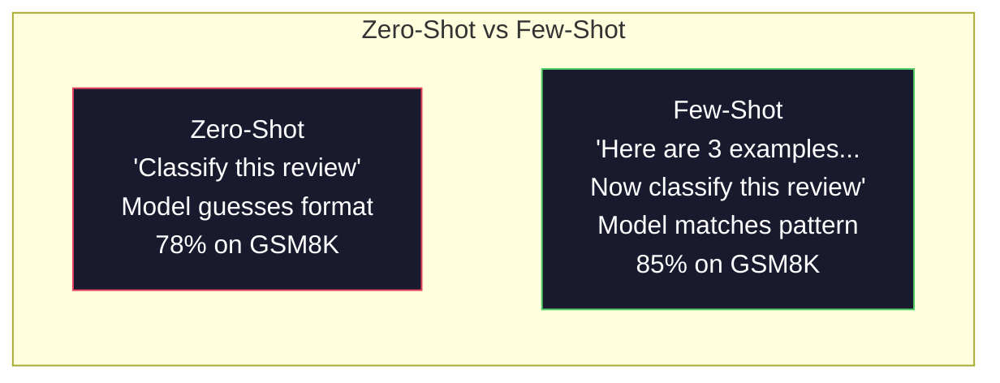
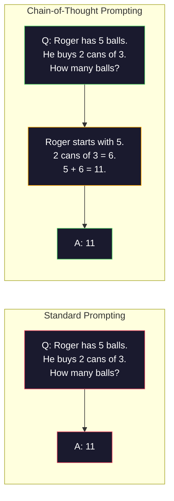
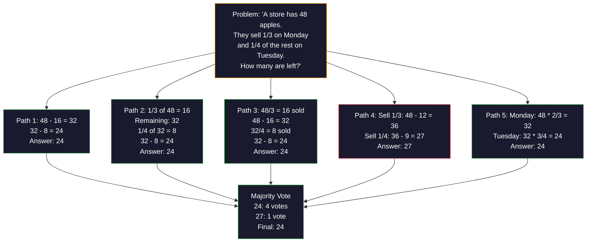
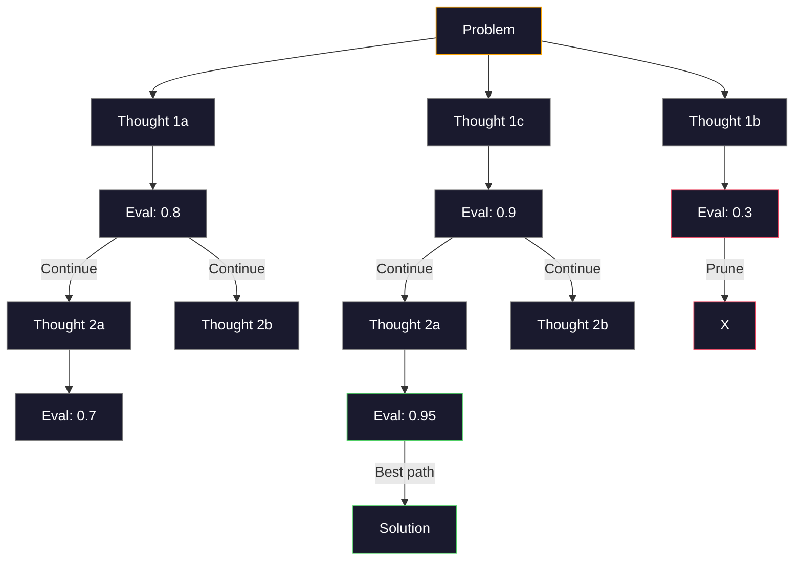

# Birkaç Atış, Düşünce Zinciri, Düşünce Ağacı

> Bir modele ne yapması gerektiğini söylemek prompting'dir. Ona nasıl düşüneceğini göstermek mühendisliktir. Aynı modelde, aynı görevde, aynı verilerde %78 ile %91 doğruluk arasındaki fark daha iyi bir model değildir. Daha iyi bir akıl yürütme stratejisidir.

**Tür:** Yapım
**Diller:** Python
**Önkoşullar:** Ders 11.01 (Prompt Mühendislik)
**Süre:** ~45 dakika

## Öğrenme Hedefleri

- Görev doğruluğunu en üst düzeye çıkaran örnek gösterimleri seçip biçimlendirerek birkaç çekimlik prompting'i uygulayın
- Matematik sözlü problemleri gibi çok adımlı problemlerde doğruluğu artırmak için düşünce zinciri (CoT) akıl yürütmesini uygulayın
- Birden fazla akıl yürütme yolunu araştıran ve en iyi olanı seçen bir prompt düşünce ağacı oluşturun
- Standart bir benchmark üzerinde sıfır atış, birkaç atış ve CoT'den doğruluk artışını ölçün

## Sorun

Bir matematik dersi uygulaması geliştiriyorsunuz. prompt'niz şöyle diyor: "Bu kelime problemini çözün." GPT-5, standart ilkokul matematiği benchmark olan GSM8K'da %94 oranında doğru sonuç veriyor. Zaten zirveye ulaştığınızı düşünüyorsunuz. Yapmıyorsunuz - düşünce zinciri hala 3-4 puan ekliyor.

Beş kelime ekleyin - "Adım adım düşünelim" - ve doğruluk %91'e çıkar. Birkaç çalışılmış örnek ekleyin ve %95'e ulaşır. Aynı model. Aynı sıcaklık. Aynı API maliyeti. Tek fark modele karalama kağıdı vermiş olmanızdır.

Bu bir hack değil. Akıl yürütme böyle çalışır. İnsanlar çok adımlı problemleri tek bir zihinsel sıçramayla çözemezler. transformer'ler de öyle. Bir modeli ara token'ler oluşturmaya zorladığınızda, bu token'ler bir sonraki token'nin bağlamının parçası haline gelir. Her akıl yürütme adımı bir sonrakini besler. Model kelimenin tam anlamıyla cevaba giden yolu hesaplıyor.

Ancak "adım adım düşünün" son değil başlangıçtır. Beş muhakeme yolunu örnekleyip çoğunluk oyu alsanız ne olur? Modelin olasılıklar ağacını keşfetmesine, dalları değerlendirmesine ve budamasına izin verirseniz ne olur? Mantık yürütmeyi araç kullanımıyla birleştirirseniz ne olur? Bunlar varsayım değil. Bunlar, ölçülen iyileştirmelerle birlikte yayınlanmış tekniklerdir ve bu derste bunların hepsini oluşturacaksınız.

## Konsept

### Sıfır Atış ve Az Atış: Örnekler Talimatları Geçtiğinde

Sıfır atışlı prompting, modele bir görev verir, başka bir şey vermez. Birkaç çekimli prompting öncelikle bunun örneklerini veriyor.

Wei ve diğerleri. (2022) bunu 8 benchmark'de ölçtü. Duygu sınıflandırması gibi basit görevler için sıfır atış ve birkaç atış birbirinin %2'si dahilinde gerçekleştirilir. Çok adımlı aritmetik ve sembolik akıl yürütme gibi karmaşık görevlerde, birkaç vuruş doğruluğu %10-25 oranında artırdı.

Sezgi: örnekler sıkıştırılmış talimatlardır. Çıktı formatını tanımlamak yerine onu gösterirsiniz. Akıl yürütme sürecini açıklamak yerine, onu gösterirsiniz. Model modeli, soyut talimatları yorumlamaktan ziyade örneklerle daha güvenilir bir şekilde eşleşir.



**Birkaç atış kazandığında:** formata duyarlı görevler, sınıflandırma, yapılandırılmış çıkarma, alana özgü jargon, modelin belirli bir kalıpla eşleşmesi gereken herhangi bir görev.

**Sıfır atış kazandığında:** basit gerçeklere dayalı sorular, örneklerin yaratıcılığı sınırladığı yaratıcı görevler, iyi örnekler bulmanın iyi talimatlar yazmaktan daha zor olduğu görevler.

### Örnek Seçim: Benzer Vuruşlar Rastgele

Tüm örnekler eşit değildir. Hedef girdiye benzer örneklerin seçilmesi, sınıflandırma görevlerinde rastgele seçimden %5-15 daha iyi performans gösterir (Liu ve diğerleri, 2022). Üç prensip:

1. **Anlamsal benzerlik**: embedding alanında girişe en yakın örnekleri seçin
2. **Etiket çeşitliliği**: örneklerinizdeki tüm çıktı kategorilerini kapsar
3. **Zorluk eşleştirme**: hedef problemin karmaşıklık düzeyini eşleştirin

Çoğu görev için en uygun örnek sayısı 3-5'tir. 3'ün altında model, modeli çıkarmak için yeterli sinyale sahip değildir. 5'in üzerinde, azalan getirilere ulaşırsınız ve context window token'leri boşa harcarsınız. Çok sayıda etiket içeren sınıflandırma için etiket başına bir örnek kullanın.

### Düşünce Zinciri: Modellere Karalama Kağıdı Vermek

Düşünce Zinciri (CoT) prompting, Wei ve diğerleri tarafından tanıtıldı. (2022) Google Brain'de. Fikir basit: Modelden sadece cevabı istemek yerine, önce mantık adımlarını göstermesini isteyin.



Bu neden mekanik olarak çalışıyor? Bir transformer'nin ürettiği her token, bir sonraki token için bağlam haline gelir. CoT olmadan modelin tüm akıl yürütmeyi tek bir ileri geçişin gizli durumuna sıkıştırması gerekir. CoT ile model, ara hesaplamaları token'ler olarak dışsallaştırır. token'nin her muhakemesi etkili hesaplama derinliğini genişletir.

**GSM8K benchmark'ler (ilkokul matematik, 8,5K problemleri):**

| Modeli | Sıfır Atış | Sıfır Atışlı CoT | Birkaç Atışlı CoT |
|-------|-----------|---------------|--------------|
| GPT-4o | %78 | %91 | %95 |
| GPT-5 | %94 | %97 | %98 |
| o4-mini (akıl yürütme) | %97 | — | — |
| Claude Opus 4.7 | %93 | %97 | %98 |
| İkizler 3 Pro | %92 | %96 | %98 |
| Lama 4 70B | %80 | %89 | %94 |
| DeepSeek-V3.1 | %89 | %94 | %96 |

**Akıl yürütme modelleri hakkında not.** OpenAI'nin o-serisi (o3, o4-mini) ve DeepSeek-R1 gibi modeller, yanıtlarını vermeden önce dahili olarak düşünce zincirini çalıştırır. Akıl yürütme modeline "Adım adım düşünelim" ifadesini eklemek gereksizdir ve bazen verimsizdir; bunu zaten yaptılar.

CoT'nin iki çeşidi:

**Sıfır atışlı CoT**: prompt'ye "Adım adım düşünelim" ifadesini ekleyin. Örneklere gerek yok. Kojima ve ark. (2022), bu tek cümlenin aritmetik, sağduyu ve sembolik akıl yürütme görevlerinde doğruluğu artırdığını gösterdi.

**Az atışlı CoT**: muhakeme adımlarını içeren örnekler verin. Sıfır atışlı CoT'den daha etkilidir çünkü model tam olarak beklediğiniz muhakeme formatını görür.

**CoT acıttığında**: basit olgusal hatırlama ("Fransa'nın başkenti nedir?"), tek adımlı sınıflandırma, hızın doğruluktan daha önemli olduğu görevler. CoT, sorgu başına 50-200 token akıl yürütme yükü ekler. Yüksek verimli, düşük karmaşıklığa sahip görevler için bu, boşa harcanan maliyettir.

### Tutarlılık: Birçok Örnek Alın, Bir Kez Oy Verin

Wang ve diğerleri. (2023) kendi kendine tutarlılığı ortaya koydu. İçgörü: Tek bir CoT yolu muhakeme hataları içerebilir. Ancak N sayıda bağımsız akıl yürütme yolunu örneklerseniz (sıcaklık > 0 kullanarak) ve son yanıtta çoğunluk oyu alırsanız, hatalar ortadan kalkar.



Kendi kendine tutarlılık, orijinal PaLM 540B deneylerinde GSM8K doğruluğunu N=40 ile %56,5'ten (tek CoT) %74,4'e çıkardı. GPT-5'te temel doğruluk zaten doymuş olduğundan iyileşme küçüktür (%97 ila %98). Bu teknik en çok %60-85 temel CoT doğruluğuna sahip modellerde parlıyor; bu, tek yollu hataların sık olduğu ancak sistematik olmadığı tatlı nokta. Akıl yürütme modelleri için (o-serisi, R1) kendi içinde tutarlılık, yerleşik dahili örnekleme tarafından kapsanır.

Takas: N örnek, Nx API maliyeti ve gecikme anlamına gelir. Pratikte N=5 faydanın çoğunu karşılar. Anlamlı bir oy için minimum N=3'tür. N > 10 çoğu görev için azalan getiriye sahiptir.

### Düşünce Ağacı: Dallanan Keşif

Yao ve ark. (2023) Düşünce Ağacını (ToT) tanıttı. CoT tek bir doğrusal akıl yürütme yolunu takip ederken, ToT birden fazla dalı araştırır ve devam etmeden önce hangilerinin en umut verici olduğunu değerlendirir.



ToT'nin üç bileşeni vardır:

1. **Düşünce üretme**: birden fazla aday sonraki adım üretmek
2. **Devlet değerlendirmesi**: her adaya puan verin (LLM'nin kendisini değerlendirici olarak kullanabilir)
3. **Arama algoritması**: Ağaç boyunca BFS veya DFS, düşük puan alan dalları budayarak

24 Oyunu görevinde (24 yapmak için aritmetik kullanarak 4 sayıyı birleştirin), standart prompting ile GPT-4 sorunların %7,3'ünü çözer. CoT ile %4,0 (CoT aslında burada acı veriyor çünkü arama alanı geniş). ToT ile %74.

ToT pahalıdır. Ağaçtaki her düğüm bir LLM çağrısı gerektirir. Dallanma faktörü 3 ve derinliği 3 olan bir ağaç, 39'a kadar LLM çağrısı gerektirir. Bunu yalnızca arama alanının geniş ancak değerlendirilebilir olduğu problemler için kullanın - planlama, bulmaca çözme, kısıtlamalarla yaratıcı problem çözme.

### ReAct: Düşünmek + Yapmak

Yao ve ark. (2022) muhakeme izlerini eylemlerle birleştirdi. Model, düşünme (akıl yürütme) ve eyleme geçme (araçları çağırma, arama, hesaplama) arasında geçiş yapar.

```mermaid
graph LR
    Q["Question:\nWhat is the\npopulation of the\ncountry where\nthe Eiffel Tower\nis located?"]
    T1["Thought: I need to\nfind which country\nhas the Eiffel Tower"]
    A1["Action: search\n'Eiffel Tower location'"]
    O1["Observation:\nParis, France"]
    T2["Thought: Now I need\nFrance's population"]
    A2["Action: search\n'France population 2024'"]
    O2["Observation:\n68.4 million"]
    T3["Thought: I have\nthe answer"]
    F["Answer:\n68.4 million"]

    Q --> T1 --> A1 --> O1 --> T2 --> A2 --> O2 --> T3 --> F

    style Q fill:#1a1a2e,stroke:#ffa500,color:#fff
    style T1 fill:#1a1a2e,stroke:#51cf66,color:#fff
    style A1 fill:#1a1a2e,stroke:#e94560,color:#fff
    style O1 fill:#1a1a2e,stroke:#808080,color:#fff
    style T2 fill:#1a1a2e,stroke:#51cf66,color:#fff
    style A2 fill:#1a1a2e,stroke:#e94560,color:#fff
    style O2 fill:#1a1a2e,stroke:#808080,color:#fff
    style T3 fill:#1a1a2e,stroke:#51cf66,color:#fff
    style F fill:#1a1a2e,stroke:#51cf66,color:#fff
```



ReAct, bilgi yoğun görevlerde saf CoT'den daha iyi performans gösterir çünkü mantığını gerçek verilere dayandırabilir. HotpotQA'da (çoklu atlamalı soru yanıtlama), GPT-4 ile ReAct %35,1 tam eşleşme elde ederken, yalnızca CoT için bu oran %29,4'tür. Gerçek güç, akıl yürütme hatalarının gözlemlerle düzeltilmesidir; model, yürütmenin ortasında planını güncelleyebilir.

ReAct, modern AI agent'lerin temelidir. Her agent framework (LangChain, CrewAI, AutoGen), Düşünce-Eylem-Gözlem döngüsünün bazı varyantlarını uygular. 14. Aşamada tam agent'ler oluşturacaksınız. Bu ders prompting modelini kapsar.

### Yapılandırılmış Prompting: XML Etiketleri, Sınırlayıcılar, Başlıklar

prompt'ler karmaşıklaştıkça yapı, modelin bölümleri karıştırmasını önler. Üç yaklaşım:

**XML etiketleri** (Claude ile en iyi şekilde çalışır, her yerde sağlamdır):
```
<context>
You are reviewing a pull request.
The codebase uses TypeScript and React.
</context>

<task>
Review the following diff for bugs, security issues, and style violations.
</task>

<diff>
{diff_content}
</diff>

<output_format>
List each issue with: file, line, severity (critical/warning/info), description.
</output_format>
```

**Markdown başlıkları** (evrensel):
```
## Role
Senior security engineer at a fintech company.

## Task
Analyze this API endpoint for vulnerabilities.

## Input
{api_code}

## Rules
- Focus on OWASP Top 10
- Rate each finding: critical, high, medium, low
- Include remediation steps
```

**Sınırlayıcılar** (minimum ancak etkili):
```
---INPUT---
{user_text}
---END INPUT---

---INSTRUCTIONS---
Summarize the above in 3 bullet points.
---END INSTRUCTIONS---
```

### Prompt Zincirleme: Sıralı Ayrıştırma

Bazı görevler tek bir prompt için fazla karmaşıktır. Prompt zincirleme bunları adımlara böler; burada bir prompt'nin çıktısı bir sonrakinin girdisi olur.


Zincirleme, tekli prompt'yi üç nedenden dolayı yener:

1. **Her adım daha basittir**: Model, her şeyle hokkabazlık yapmak yerine tek bir odaklanmış görevi gerçekleştirir
2. **Ara çıkışlar incelenebilir**: adımlar arasında doğrulama ve düzeltme yapabilirsiniz
3. **Farklı adımlar farklı modeller kullanabilir**: çıkarım için ucuz bir model, muhakeme için pahalı bir model kullanın

### Performans Karşılaştırması

| Tekniği | En İyisi | GSM8K Doğruluğu (GPT-5) | API Çağrıları | Token Genel gider | Karmaşıklık |
|-----------|----------|------------------------|-----------|----------------|------------|
| Sıfır Atış | Basit görevler | %94 | 1 | Yok | Önemsiz |
| Birkaç Atış | Biçim eşleştirme | %96 | 1 | 200-500 token | Düşük |
| Sıfır Atışlı CoT | Hızlı muhakeme desteği | %97 | 1 | 50-200 token | Önemsiz |
| Birkaç Atışlı CoT | Maksimum tek arama doğruluğu | %98 | 1 | 300-600 token | Düşük |
| Kendi Kendine Tutarlılık (N=5) | Yüksek riskli akıl yürütme | %98,5 | 5 | 5x token maliyeti | Orta |
| Akıl yürütme modeli (o4-mini) | Anında CoT değişimi | %97 | 1 | gizli (2-10x dahili) | Önemsiz |
| Düşünce Ağacı | Arama/planlama sorunları | Yok (24 Maçta %74) | 10-40+ | 10-40x token maliyeti | Yüksek |
| Tepki | Bilgiye dayalı akıl yürütme | Yok (HotpotQA'da %35,1) | 3-10+ | Değişken | Yüksek |
| Prompt Zincirleme | Karmaşık çok adımlı görevler | %96 (boru hattı) | 2-5 | 2-5x token maliyeti | Orta |

Doğru teknik üç faktöre bağlıdır: doğruluk gereksinimi, gecikme bütçesi ve maliyet toleransı. Çoğu üretim sistemi için, 3 örnekli kendi kendine tutarlılık geri dönüşüne sahip birkaç atışlık CoT, kullanım durumlarının %90'ını kapsar.

## İnşa Et

Birkaç adımlık prompting'i, düşünce zinciri akıl yürütmeyi ve kendi kendine tutarlı oylamayı tek bir işlem hattında birleştiren bir matematik problemi çözücü oluşturacağız. Daha sonra zor problemler için düşünce ağacını ekleyeceğiz.

Tam uygulama `code/advanced_prompting.py`'dedir. İşte temel bileşenler.

### Adım 1: Birkaç Çekim Örnek Mağazası

İlk bileşen, birkaç örnek örneği yönetir ve belirli bir soruna en uygun olanları seçer.

```python
GSM8K_EXAMPLES = [
    {
        "question": "Janet's ducks lay 16 eggs per day. She eats three for breakfast every morning and bakes muffins for her friends every day with four. She sells every egg at the farmers' market for $2. How much does she make every day at the farmers' market?",
        "reasoning": "Janet's ducks lay 16 eggs per day. She eats 3 and bakes 4, using 3 + 4 = 7 eggs. So she has 16 - 7 = 9 eggs left. She sells each for $2, so she makes 9 * 2 = $18 per day.",
        "answer": "18"
    },
    ...
]
```

Her örneğin üç bölümü vardır: soru, akıl yürütme zinciri ve son cevap. Akıl yürütme zinciri, normal birkaç çekimli bir örneği CoT'nin birkaç çekimli örneğine dönüştüren şeydir.

### Adım 2: Düşünce Zinciri Prompt Oluşturucu

prompt oluşturucusu bir sistem mesajını, muhakeme zincirleriyle birkaç örnek örneği ve hedef soruyu tek bir prompt'de birleştirir.

```python
def build_cot_prompt(question, examples, num_examples=3):
    system = (
        "You are a math problem solver. "
        "For each problem, show your step-by-step reasoning, "
        "then give the final numerical answer on the last line "
        "in the format: 'The answer is [number]'."
    )

    example_text = ""
    for ex in examples[:num_examples]:
        example_text += f"Q: {ex['question']}\n"
        example_text += f"A: {ex['reasoning']} The answer is {ex['answer']}.\n\n"

    user = f"{example_text}Q: {question}\nA:"
    return system, user
```

Biçim kısıtlaması ("Cevap [sayı]") kritiktir. Bu olmadan, kendi kendine tutarlılık örnekler arasındaki yanıtları çıkaramaz ve karşılaştıramaz.

### 3. Adım: Tutarlılık Oylaması

N akıl yürütme yolunu örnekleyin ve çoğunluğun cevabını alın.

```python
def self_consistency_solve(question, examples, client, model, n_samples=5):
    system, user = build_cot_prompt(question, examples)

    answers = []
    reasonings = []
    for _ in range(n_samples):
        response = client.chat.completions.create(
            model=model,
            messages=[
                {"role": "system", "content": system},
                {"role": "user", "content": user}
            ],
            temperature=0.7
        )
        text = response.choices[0].message.content
        reasonings.append(text)
        answer = extract_answer(text)
        if answer is not None:
            answers.append(answer)

    vote_counts = Counter(answers)
    best_answer = vote_counts.most_common(1)[0][0] if vote_counts else None
    confidence = vote_counts[best_answer] / len(answers) if best_answer else 0

    return best_answer, confidence, reasonings, vote_counts
```

Sıcaklık 0,7 önemlidir. 0,0 sıcaklıkta, tüm N numuneler aynı olacaktır ve bu da amacı boşa çıkaracaktır. Çeşitli muhakeme yolları için yeterince rastgeleliğe ihtiyacınız var, ancak modelin anlamsızlık yaratması kadar değil.

### Adım 4: Düşünce Ağacı Çözücü

Doğrusal akıl yürütmenin başarısız olduğu problemler için ToT birden fazla yaklaşımı araştırır ve hangi yönün en umut verici olduğunu değerlendirir.

```python
def tree_of_thought_solve(question, client, model, breadth=3, depth=3):
    thoughts = generate_initial_thoughts(question, client, model, breadth)
    scored = [(t, evaluate_thought(t, question, client, model)) for t in thoughts]
    scored.sort(key=lambda x: x[1], reverse=True)

    for current_depth in range(1, depth):
        next_thoughts = []
        for thought, score in scored[:2]:
            extensions = extend_thought(thought, question, client, model, breadth)
            for ext in extensions:
                ext_score = evaluate_thought(ext, question, client, model)
                next_thoughts.append((ext, ext_score))
        scored = sorted(next_thoughts, key=lambda x: x[1], reverse=True)

    best_thought = scored[0][0] if scored else ""
    return extract_answer(best_thought), best_thought
```

Değerlendiricinin kendisi bir Yüksek Lisans çağrısıdır. Modele şunu soruyorsunuz: "0,0'dan 1,0'a kadar bir ölçekte, bu akıl yürütme yolu sorunu çözmek için ne kadar umut verici?" Bu, ToT'nin temel anlayışıdır; model kendi kısmi çözümlerini değerlendirir.

### Adım 5: Tam Boru Hattı

Boru hattı tüm teknikleri bir yükseltme stratejisiyle birleştirir.

```python
def solve_with_escalation(question, examples, client, model):
    system, user = build_cot_prompt(question, examples)
    single_response = call_llm(client, model, system, user, temperature=0.0)
    single_answer = extract_answer(single_response)

    sc_answer, confidence, _, _ = self_consistency_solve(
        question, examples, client, model, n_samples=5
    )

    if confidence >= 0.8:
        return sc_answer, "self_consistency", confidence

    tot_answer, _ = tree_of_thought_solve(question, client, model)
    return tot_answer, "tree_of_thought", None
```

Yükseltme mantığı: önce ucuzu (tek CoT) deneyin. Kendi kendine tutarlılık güveni 0,8'in altındaysa (5 örnekten 4'ünden azı aynı fikirdeyse), ToT'ye yükseltin. Bu, maliyet ve doğruluğu dengeler; çoğu sorun ucuza çözülür, zor sorunlar daha fazla bilgi işlem gerektirir.

## Kullan onu

### Şablon Odaklı Birkaç Çekim Prompt

LangChain, prompt şablonları için yerleşik destek ve birkaç çekim ve CoT modellerini basitleştiren çıktı ayrıştırma sağlar:

```python
from langchain_core.prompts import FewShotPromptTemplate, PromptTemplate
from langchain_openai import ChatOpenAI

example_prompt = PromptTemplate(
    input_variables=["question", "reasoning", "answer"],
    template="Q: {question}\nA: {reasoning} The answer is {answer}."
)

few_shot_prompt = FewShotPromptTemplate(
    examples=examples,
    example_prompt=example_prompt,
    suffix="Q: {input}\nA: Let's think step by step.",
    input_variables=["input"]
)

llm = ChatOpenAI(model="gpt-4o", temperature=0.7)
chain = few_shot_prompt | llm
result = chain.invoke({"input": "If a train travels 120 km in 2 hours..."})
```

LangChain ayrıca anlamsal benzerlik seçimi için `ExampleSelector` sınıflarına da sahiptir:

```python
from langchain_core.example_selectors import SemanticSimilarityExampleSelector
from langchain_openai import OpenAIEmbeddings

selector = SemanticSimilarityExampleSelector.from_examples(
    examples,
    OpenAIEmbeddings(),
    k=3
)
```

### Derlenmiş Prompt'ler

DSPy, prompting stratejilerini optimize edilebilir modüller olarak ele alır. CoT prompt'leri elle oluşturmak yerine bir imza tanımlayın ve DSPy'nin prompt'yi optimize etmesine izin verin:

```python
import dspy

dspy.configure(lm=dspy.LM("openai/gpt-4o", temperature=0.7))

class MathSolver(dspy.Module):
    def __init__(self):
        self.solve = dspy.ChainOfThought("question -> answer")

    def forward(self, question):
        return self.solve(question=question)

solver = MathSolver()
result = solver(question="Janet's ducks lay 16 eggs per day...")
```

DSPy'ın `ChainOfThought`'si otomatik olarak akıl yürütme izlerini ekler. `dspy.majority` kendi kendine tutarlılığı uygular:

```python
result = dspy.majority(
    [solver(question=q) for _ in range(5)],
    field="answer"
)
```

### Karşılaştırma: Sıfırdan ve Framework'ler

| Özellik | Sıfırdan (bu ders) | LangChain | DSPy |
|---------|--------------------------|-----------|------|
| prompt formatı üzerinde kontrol | Tam | Şablon tabanlı | Otomatik |
| Kendi kendine tutarlılık | Manuel oylama | Kılavuz | Dahili (`dspy.majority`) |
| Örnek seçim | Özel mantık | `ExampleSelector` | `dspy.BootstrapFewShot` |
| Düşünce Ağacı | Özel ağaç araması | Topluluk zincirleri | Yerleşik değil |
| Prompt optimizasyon | Manuel yineleme | Kılavuz | Otomatik derleme |
| Şunun için en iyisi | Öğrenme, özel işlem hatları | Standart iş akışları | Araştırma, optimizasyon |

## Gönderin

Bu ders iki artifact üretir.

**1. Reasoning Chain Prompt** (`outputs/prompt-reasoning-chain.md`): Kendi kendine tutarlılığa sahip birkaç çekimli CoT için üretime hazır bir prompt şablonu. Örneklerinizi ve sorunlu alanınızı ekleyin.

**2. CoT Modeli Seçme Becerisi** (`outputs/skill-cot-patterns.md`): görev türüne, doğruluk gereksinimlerine ve maliyet kısıtlamalarına dayalı olarak doğru muhakeme tekniğini seçmeye yönelik bir karar framework.

## Egzersizler

1. **Boşluğu ölçün**: 10 GSM8K problemini alın. Her birini sıfır atış, birkaç atış, sıfır atış CoT ve birkaç atış CoT ile çözün. Her birinin doğruluğunu kaydedin. Hangi teknik modelinizde en büyük artışı sağlıyor?

2. **Örnek seçim deneyi**: Aynı 10 problem için rastgele örnek seçimi ile özenle seçilmiş benzer örnekleri karşılaştırın. Doğruluk farkını ölçün. Örnek niteliği hangi noktada örnek niceliğinden daha önemli?

3. **Kendi kendine tutarlılık maliyet eğrisi**: 20 GSM8K problemi üzerinde N=1, 3, 5, 7, 10 ile kendi kendine tutarlılığı çalıştırın. Grafik doğruluğu ve maliyet (toplam token). Modeliniz için eğrinin dizi nerede?

4. **ReAct döngüsü oluşturun**: İşlem hattını bir hesap makinesi aracıyla genişletin. Model bir matematik ifadesi oluşturduğunda, bunu Python'un `eval()` (korumalı alanda) ile yürütün ve sonucu geri besleyin. Araç temelli akıl yürütmenin saf CoT'den daha iyi performans gösterip göstermediğini ölçün.

5. **Yaratıcı görevler için Eğitmenlik Eğitimi**: Düşünce Ağacı çözücüyü yaratıcı bir yazma görevi için uyarlayın: "Hem komik hem de üzücü olan 6 kelimelik bir hikaye yazın." Değerlendirici olarak LLM'yi kullanın. Dallara ayrılan keşif, tek seferde oluşturmaya göre daha iyi yaratıcı çıktılar mı üretiyor?

## Anahtar Terimler

| Dönem | İnsanlar ne diyor | Aslında ne anlama geliyor |
|------|----------------|----------------------|
| Birkaç atış prompting | "Bazı örnekler verin" | Modelin çıkış formatını ve davranışını sabitlemek için prompt'ye giriş-çıkış gösterileri dahil |
| Düşünce Zinciri | "Adım adım düşünmesini sağlayın" | Nihai bir yanıt üretmeden önce modelin etkili hesaplamasını genişleten ara akıl yürütme token'leri ortaya çıkarma |
| Kendi Kendine Tutarlılık | "Birden çok kez çalıştır" | Sıcaklık > 0'da N farklı akıl yürütme yolunun örneklenmesi ve çoğunluk oyu ile en yaygın nihai cevabın seçilmesi |
| Düşünce Ağacı | "Seçenekleri keşfetmesine izin verin" | Her kısmi çözümün değerlendirildiği ve yalnızca umut verici yolların genişletildiği akıl yürütme dalları üzerinde yapılandırılmış arama |
| Tepki | "Düşünme + araç kullanımı" | Düşünce-Eylem-Gözlem döngüsünde akıl yürütme izlerini harici eylemlerle (arama, hesaplama, API çağrıları) serpiştirme |
| Prompt zincirleme | "Adımlara bölün" | Karmaşık bir görevi, her çıkışın bir sonraki girişi beslediği sıralı prompt'lere ayırma |
| Sıfır atışlı CoT | "Sadece 'adım adım düşün'ü ekleyin" | Modelin gizli akıl yürütme yeteneğine dayanarak, herhangi bir örnek olmadan prompt'ye bir akıl yürütme tetikleyici cümlesi ekleme |

## Daha Fazla Okuma

- [Düşünce Zinciri Prompting Büyük Dil Modellerinde Akıl Yürütmeyi Ortaya Çıkarır](https://arxiv.org/abs/2201.11903) -- Wei ve ark. 2022. Google Brain'in orijinal CoT makalesi. Temel sonuçlar için 2-3. bölümleri okuyun.
- [Kendi Tutarlılığı Dil Modellerinde Düşünce Akıl Yürütme Zincirini Geliştirir](https://arxiv.org/abs/2203.11171) -- Wang ve ark. 2023. Kendi kendine tutarlılık makalesi. Tablo 1'de ihtiyacınız olan tüm sayılar bulunmaktadır.
- [Düşünce Ağacı: Büyük Dil Modelleriyle Kasıtlı Problem Çözme](https://arxiv.org/abs/2305.10601) -- Yao ve ark. 2023. ToT belgesi. 4. bölümdeki 24 Maçı sonuçları öne çıkanlar.
- [ReAct: Dil Modellerinde Akıl Yürütme ve Eylemi Birleştirme](https://arxiv.org/abs/2210.03629) -- Yao ve ark. 2022. Modern yapay zeka agent'lerin temeli. 3. Bölüm Düşünce-Eylem-Gözlem döngüsünü açıklamaktadır.
- [Büyük Dil Modelleri Sıfır Atışlı Akıl Yürütücülerdir](https://arxiv.org/abs/2205.11916) -- Kojima ve ark. 2022. "Adım adım düşünelim" makalesi. Ne kadar basit olduğuna göre şaşırtıcı derecede etkili.
- [DSPy: Bildirimsel Dil Modeli Çağrılarını Kendini Geliştiren İşlem Hatlarına Derlemek](https://arxiv.org/abs/2310.03714) -- Khattab ve diğerleri. 2023. prompting'i bir derleme sorunu olarak ele alır. Manuel prompt mühendisliğinin ötesine geçmek istiyorsanız okuyun.
- [OpenAI — Akıl yürütme modelleri kılavuzu](https://platform.openai.com/docs/guides/reasoning) -- düşünce zincirinin ne zaman dahili, token başına fiyatlandırılan "akıl yürütme" moduna karşı prompt düzeyindeki bir numara haline geldiği konusunda satıcı rehberliği.
- [Lightman ve diğerleri, "Adım Adım Doğrulayalım" (2023)](https://arxiv.org/abs/2305.20050) -- bir zincirin her adımını derecelendiren süreç ödül modelleri (PRM); yalnızca sonuca dayalı ödülleri başaran akıl yürütme denetimi sinyali.
- [Snell ve diğerleri, "LLM Test Süresi Hesaplamasını En İyi Şekilde Ölçeklendirmek" (2024)](https://arxiv.org/abs/2408.03314) -- CoT uzunluğunun, kendi kendine tutarlılık örneklemesinin ve MCTS'nin sistematik çalışması; Doğruluk gecikmeden daha önemli olduğunda "adım adım düşünün" nereye gider?
