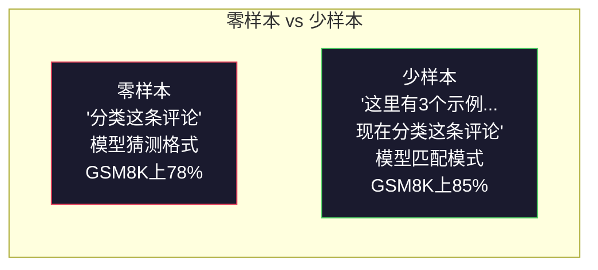
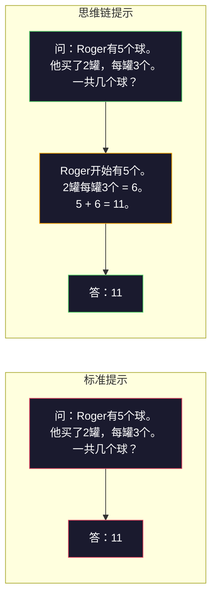
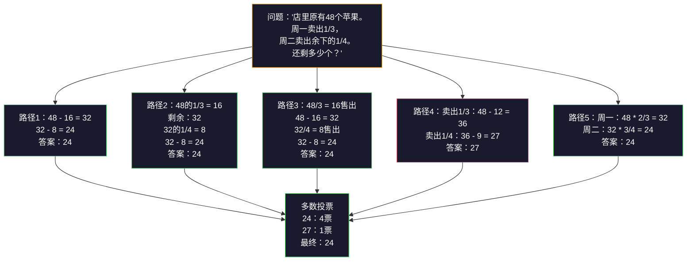
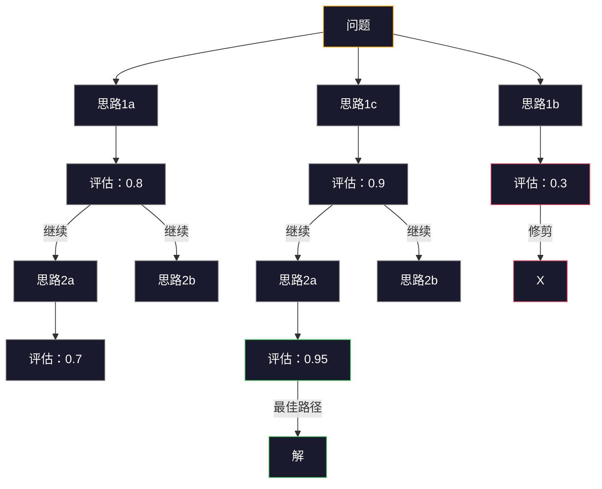

# 少样本、思维链、思维树

> 告诉模型做什么是指令提示，展示如何思考才是工程学。同一模型、同一任务、同一数据下准确率从78%提升到91%的差距，并非源于更好的模型，而是更优的推理策略。

**类型：** 构建
**语言：** Python
**前置知识：** 第11.01课（提示工程）
**时间：** ~45分钟

## 学习目标

- 通过选择和格式化能最大化任务准确率的示例演示，实现少样本提示
- 应用思维链（CoT）推理提升数学应用题等多步问题的准确率
- 构建一个探索多条推理路径并选择最佳路径的思维树提示
- 在标准基准上测量从零样本到少样本再到思维链的准确率提升

## 问题所在

你构建了一个数学辅导应用。你的提示说：“解这道应用题。”GPT-5 在 GSM8K（标准小学数学基准）上正确率为94%。你以为已经达到巅峰——其实并没有，思维链仍然能带来3–4个百分点的提升。

加上五个字——“让我们逐步思考”——准确率跃升至91%。再加上几个已解例题，准确率达到95%。同一模型、同一温度、同一API成本。唯一区别是你给了模型草稿纸。

这不是什么歪门邪道，这就是推理的工作原理。人类不会通过一次心智飞跃解决多步问题，Transformer同样如此。当你强制模型生成中间token时，这些token会成为下一个token的上下文。每一步推理都服务于下一步。模型实质上是“计算”出答案的。

但“逐步思考”只是开始，而非终点。如果你采样五条推理路径并进行多数投票呢？如果你让模型探索一棵可能性之树，评估并修剪分支呢？如果你将推理与工具使用交错进行呢？这些都不是假设，而是已有论文验证过且有可测量改进的技术——在本课中你将亲手构建它们。

## 概念

### 零样本 vs 少样本：示例何时优于指令

零样本提示只给模型一个任务，无其他内容。少样本提示则先给示例。

Wei等人（2022）在8个基准上测量了这一点。对于简单任务（如情感分类），零样本和少样本准确率相差不到2%。对于复杂任务（如多步算术和符号推理），少样本将准确率提升了10–25%。

直觉：示例是压缩后的指令。你不需要描述输出格式，而是展示它；不需要解释推理过程，而是演示它。模型通过示例进行模式匹配比解释抽象指令更可靠。

**少样本获胜时：** 格式敏感任务、分类、结构化提取、领域专用术语、任何模型需要匹配特定模式的任务。

**零样本获胜时：** 简单事实性问题、示例会限制创造力的创意任务、找好示例比写好指令更难的任务。

### 示例选择：相似优于随机

并非所有示例都等价。选择与目标输入相似的示例在分类任务上比随机选择提升5–15%（Liu等人，2022）。三个原则：

1. **语义相似性**：选择嵌入空间中与输入最接近的示例
2. **标签多样性**：示例中覆盖所有输出类别
3. **难度匹配**：匹配目标问题的复杂度级别

大多数任务的最佳示例数量是3–5个。少于3个，模型没有足够信号提取模式；多于5个，收益递减并浪费上下文窗口token。对于多标签分类，每个标签使用一个示例。

### 思维链：给模型草稿纸

思维链（CoT）提示由Wei等人（2022）在Google Brain提出。思路很简单：不让模型直接给出答案，而是先展示推理步骤。

为什么这从机制上有效？Transformer生成的每个token都会成为下一个token的上下文。没有CoT，模型必须将所有推理压缩到单次前向传播的隐藏状态中。有了CoT，模型将中间计算外部化为token。每个推理token都延长了有效计算深度。

**GSM8K基准（小学数学，8.5K问题）：**

| 模型 | 零样本 | 零样本CoT | 少样本CoT |
|-------|-----------|---------------|--------------|
| GPT-4o | 78% | 91% | 95% |
| GPT-5 | 94% | 97% | 98% |
| o4-mini (推理模型) | 97% | — | — |
| Claude Opus 4.7 | 93% | 97% | 98% |
| Gemini 3 Pro | 92% | 96% | 98% |
| Llama 4 70B | 80% | 89% | 94% |
| DeepSeek-V3.1 | 89% | 94% | 96% |

**关于推理模型的说明。** OpenAI的o系列（o3、o4-mini）和DeepSeek-R1等模型在输出答案前内部运行思维链。对这些模型添加“让我们逐步思考”是多余的，有时甚至适得其反——它们已经做过这件事了。

两种CoT变体：

**零样本CoT**：在提示末尾附加“让我们逐步思考”。无需示例。Kojima等人（2022）证明，这一句话就能在算术、常识和符号推理任务上提升准确率。

**少样本CoT**：提供包含推理步骤的示例。比零样本CoT更有效，因为模型看到了你期望的确切推理格式。

**CoT何时有害**：简单事实回忆（“法国的首都是什么？”）、单步分类、速度比准确率更重要的任务。CoT每次查询会增加50–200 token的推理开销。对于高吞吐、低复杂度的任务，这是浪费成本。

### 自一致性：多次采样，一次投票

Wang等人（2023）引入了自一致性。关键在于：单条CoT路径可能包含推理错误，但如果你采样N条独立的推理路径（使用温度>0），然后对最终答案进行多数投票，错误就会相互抵消。

在原始PaLM 540B实验中，自一致性将GSM8K准确率从56.5%（单次CoT）提升至74.4%（N=40）。在GPT-5上提升很小（97%到98%），因为基础准确率已经饱和。该技术最擅长用于模型CoT基础准确率为60–85%的范围——单路径错误频繁但不系统的甜区。对于推理模型（o系列、R1），自一致性已被内置的内部采样所取代。

权衡：N次采样意味着N倍的API成本和延迟。实践中，N=5就能获得大部分收益。N=3是最低有意义票数。对于大多数任务，N>10后收益递减。

### 思维树：分支探索

Yao等人（2023）引入了思维树（ToT）。CoT遵循一条线性推理路径，而ToT探索多条分支，评估哪些最有希望再继续。

ToT包含三个组件：

1. **思路生成**：生成多个候选下一步
2. **状态评估**：对每个候选评分（可使用LLM自身作为评估器）
3. **搜索算法**：通过树进行BFS或DFS，修剪低分分支

在24点游戏任务（用四则运算组合四个数字得到24）上，使用标准提示的GPT-4解决率为7.3%，使用CoT为4.0%（CoT在这里反而有害，因为搜索空间太宽）。使用ToT则为74%。

ToT成本高昂。树中的每个节点都需要一次LLM调用。分支因子为3、深度为3的树最多需要39次LLM调用。仅当问题搜索空间大但可评估时才使用——规划、谜题求解、带约束的创造性问题解决。

### ReAct：思考+行动

Yao等人（2022）将推理轨迹与行动结合起来。模型交替进行思考（生成推理）和行动（调用工具、搜索、计算）。

```mermaid
graph LR
    Q["问题：\n埃菲尔铁塔所在地\n国家的人口\n是多少？"]
    T1["思考：我需要\n找出埃菲尔铁塔\n在哪个国家"]
    A1["行动：搜索\n'埃菲尔铁塔 位置'"]
    O1["观察：\n巴黎，法国"]
    T2["思考：现在我需要\n法国的人口"]
    A2["行动：搜索\n'法国人口 2024'"]
    O2["观察：\n6840万"]
    T3["思考：我得到了\n答案"]
    F["答案：\n6840万"]

    Q --> T1 --> A1 --> O1 --> T2 --> A2 --> O2 --> T3 --> F

    style Q fill:#1a1a2e,stroke:#ffa500,color:#fff
    style T1 fill:#1a1a2e,stroke:#51cf66,color:#fff
    style A1 fill:#1a1a2e,stroke:#e94560,color:#fff
    style O1 fill:#1a1a2e,stroke:#808080,color:#fff
    style T2 fill:#1a1a2e,stroke:#51cf66,color:#fff
    style A2 fill:#1a1a2e,stroke:#e94560,color:#fff
    style O2 fill:#1a1a2e,stroke:#808080,color:#fff
    style T3 fill:#1a1a2e,stroke:#51cf66,color:#fff
    style F fill:#1a1a2e,stroke:#51cf66,color:#fff
```

ReAct在知识密集型任务上优于纯CoT，因为它能将推理扎根于真实数据。在HotpotQA（多跳问答）上，ReAct结合GPT-4达到35.1%的精确匹配，而单独使用CoT为29.4%。真正的威力在于推理错误能被观察结果纠正——模型可以在执行过程中更新计划。

ReAct是现代AI代理的基础。每个代理框架（LangChain、CrewAI、AutoGen）都实现了某种变体的“思考-行动-观察”循环。你将在第14阶段构建