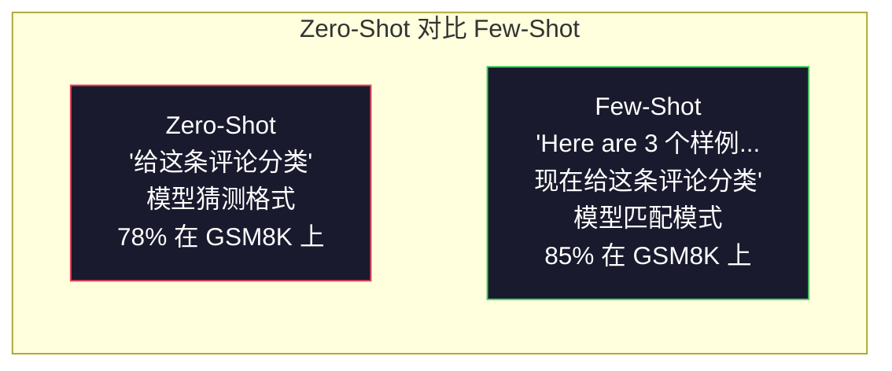
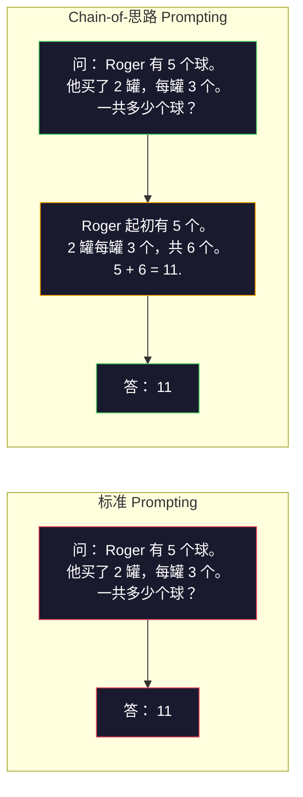
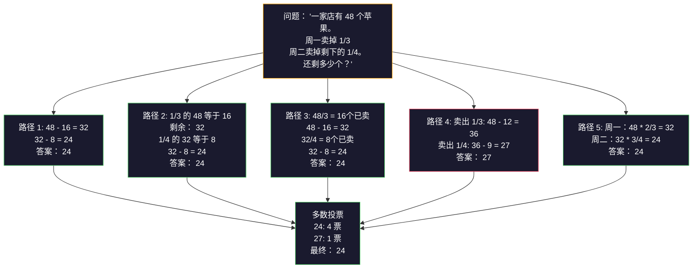
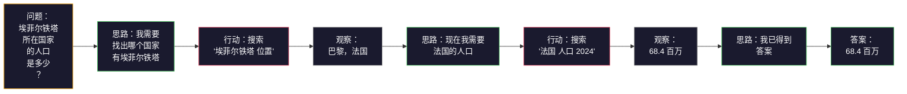

# Few-Shot、Chain-of-Thought、Tree-of-Thought

> 译注：本文译自同目录 [`en.md`](./en.md)。术语遵循仓根 [TRANSLATION_GUIDE.md](../../../../TRANSLATION_GUIDE.md)。

> 告诉模型该做什么叫 prompting；教它该怎么思考才叫 engineering。同样的模型、同样的任务、同样的数据，准确率从 78% 跳到 91%，靠的不是更好的模型，而是更好的推理策略。

**Type:** Build
**Languages:** Python
**Prerequisites:** Lesson 11.01 (Prompt Engineering)
**Time:** ~45 minutes

## 学习目标（Learning Objectives）

- 实现 few-shot prompting：挑选并组织示例 demonstration，把任务准确率压榨到极限
- 用 chain-of-thought（CoT，思维链）推理提升多步问题（如数学应用题）的准确率
- 构建一个 tree-of-thought（思维树）prompt，探索多条推理路径并选出最优
- 在标准基准上量化 zero-shot、few-shot、CoT 三者的准确率差距

## 问题（The Problem）

你做了一个数学辅导 app。prompt 写着「Solve this word problem.」（请解这道应用题）。GPT-5 在 GSM8K（标准小学数学基准）上准确率 94%。你以为已经到顶了。其实没到——chain-of-thought 还能再加 3-4 分。

加上五个词——「Let's think step by step」——准确率跳到 91%。再塞几个写好的示例，飙到 95%。同一个模型、同样的 temperature、同样的 API 成本。唯一的差别是你给了模型一张草稿纸。

这不是黑魔法，这就是推理本身的工作方式。人类做多步问题不是一步登天，transformer 也一样。当你强制模型生成中间 token，这些 token 就成了下一个 token 的上下文。每一步推理都喂给下一步，模型字面意义上是在「算」出答案。

但「think step by step」只是开始，不是终点。如果你采样五条推理路径再投票呢？如果让模型在一棵可能性的树上探索、评估并剪枝呢？如果把推理和 tool use 交错起来呢？这些都不是空想，全是已发表、有实测增益的技术，本课你将全部亲手实现。

## 概念（The Concept）

### Zero-Shot vs Few-Shot：例子何时胜过指令

Zero-shot prompting 只给模型任务，别的不给。Few-shot prompting 先给一些例子。

Wei et al.（2022）在 8 个基准上做了对比。简单任务（如情感分类）上，zero-shot 和 few-shot 差距在 2% 以内；复杂任务（如多步算术、符号推理）上，few-shot 把准确率拉高 10-25%。

直觉上：例子是被压缩的指令。与其描述输出格式，不如直接展示；与其解释推理过程，不如直接演示。模型在例子上的模式匹配比对抽象指令的解释更可靠。



**few-shot 占优的场景**：对格式敏感的任务、分类、结构化抽取、领域专有黑话，凡是需要模型匹配特定模式的活儿。

**zero-shot 占优的场景**：简单事实问答、例子会束缚创造力的创作任务、找好例子比写好指令更难的任务。

### 示例选择：相似优于随机

不是所有例子都等价。在分类任务上，挑与目标输入相似的例子比随机选高 5-15%（Liu et al., 2022）。三条原则：

1. **语义相似**：在 embedding 空间里挑离输入最近的
2. **标签多样**：让示例覆盖所有输出类别
3. **难度匹配**：与目标问题的复杂度对齐

大多数任务的最优示例数是 3-5 条。少于 3 条，模型抓不到模式；多于 5 条，收益递减且白白浪费 context window 的 token。多标签分类时，每个标签放一个示例。

### Chain-of-Thought：给模型一张草稿纸

Chain-of-Thought（CoT）prompting 由 Google Brain 的 Wei et al.（2022）提出。思路很朴素：与其只问答案，不如先让模型把推理过程写出来。



机制上为什么管用？transformer 生成的每个 token 都成为下一个 token 的上下文。没有 CoT 时，模型必须把全部推理压缩进单次 forward pass（前向传播）的 hidden state；有 CoT 时，中间计算被外化为 token，每多一个推理 token 就等于扩展了有效计算深度。

**GSM8K 基准（小学数学，8.5K 题）：**

| Model | Zero-Shot | Zero-Shot CoT | Few-Shot CoT |
|-------|-----------|---------------|--------------|
| GPT-4o | 78% | 91% | 95% |
| GPT-5 | 94% | 97% | 98% |
| o4-mini (reasoning) | 97% | — | — |
| Claude Opus 4.7 | 93% | 97% | 98% |
| Gemini 3 Pro | 92% | 96% | 98% |
| Llama 4 70B | 80% | 89% | 94% |
| DeepSeek-V3.1 | 89% | 94% | 96% |

**关于 reasoning 模型的备注。** 像 OpenAI 的 o 系列（o3、o4-mini）和 DeepSeek-R1 这类模型，在吐答案前已经在内部跑过 chain-of-thought 了。给 reasoning 模型加「Let's think step by step」属于多此一举，有时甚至帮倒忙——人家自己已经做过了。

CoT 的两种口味：

**Zero-shot CoT**：在 prompt 末尾加一句「Let's think step by step」。无需示例。Kojima et al.（2022）证明这一句话就能在算术、常识、符号推理上全面提升准确率。

**Few-shot CoT**：示例里包含推理步骤。比 zero-shot CoT 更猛，因为模型能看到你期望的精确推理格式。

**CoT 反而拖后腿的场景**：简单事实回忆（「法国首都是哪？」）、单步分类、对速度比准确率更敏感的任务。CoT 每次查询会多生成 50-200 个推理 token。在高吞吐、低复杂度场景下，这就是纯浪费钱。

### Self-Consistency：多采样、一票决

Wang et al.（2023）提出 self-consistency。洞察是：单条 CoT 路径可能含推理错误，但你独立采样 N 条推理路径（temperature > 0），对最终答案做多数投票，错误就会互相抵消。



在原始 PaLM 540B 实验上，self-consistency（N=40）把 GSM8K 从单条 CoT 的 56.5% 拉到 74.4%。在 GPT-5 上提升很小（97% 到 98%），因为基础准确率已经饱和了。这招最闪光的区间是基础 CoT 准确率在 60-85% 的模型——单路径错误频繁但不系统的甜蜜区。对 reasoning 模型（o 系列、R1），self-consistency 已经被内置的内部采样吸收了。

代价是：N 个样本意味着 N 倍的 API 成本和延迟。实践中，N=5 已经能拿走大部分收益；N=3 是有意义投票的下限；N > 10 在多数任务上收益递减。

### Tree-of-Thought：分支式探索

Yao et al.（2023）提出 Tree-of-Thought（ToT）。CoT 走单条线性推理路径，ToT 则探索多条分支，并在继续之前评估哪条最有希望。


ToT 三件套：

1. **思路生成（thought generation）**：产出多个候选下一步
2. **状态评估（state evaluation）**：给每个候选打分（可以让 LLM 自己当评估器）
3. **搜索算法（search algorithm）**：在树上做 BFS 或 DFS，剪掉低分分支

在 Game of 24 任务（用四个数字做算术拼成 24）上，GPT-4 用普通 prompting 解出 7.3%，用 CoT 反而降到 4.0%（这里搜索空间太宽，CoT 帮倒忙），用 ToT 直接到 74%。

ToT 很贵。树上每个节点都要一次 LLM 调用。分支因子 3、深度 3 的树最多 39 次 LLM 调用。只在搜索空间大、但可被评估的问题上用——规划、解谜、带约束的创造性问题求解。

### ReAct：思考 + 行动

Yao et al.（2022）把推理 trace 和 action 结合起来。模型在思考（生成推理）和行动（调用工具、搜索、计算）之间交替。



ReAct 在知识密集型任务上比纯 CoT 强，因为它能把推理锚定在真实数据上。HotpotQA（多跳问答）上 ReAct + GPT-4 拿到 35.1% 精确匹配，纯 CoT 只有 29.4%。真正的杀手锏在于推理错误能被 observation 修正——模型可以执行到一半就改计划。

ReAct 是现代 AI agent 的地基。每个 agent 框架（LangChain、CrewAI、AutoGen）都实现了 Thought-Action-Observation 循环的某种变体。完整 agent 留到 Phase 14 再造，本课只覆盖 prompting 模式。

### 结构化 Prompting：XML 标签、分隔符、标题

prompt 越复杂，结构越能防止模型混淆各部分。三种做法：

**XML 标签**（在 Claude 上效果最佳，其它模型也稳定）：
```
<context>
You are reviewing a pull request.
The codebase uses TypeScript and React.
</context>

<task>
Review the following diff for bugs, security issues, and style violations.
</task>

<diff>
{diff_content}
</diff>

<output_format>
List each issue with: file, line, severity (critical/warning/info), description.
</output_format>
```

**Markdown 标题**（通用）：
```
## Role
Senior security engineer at a fintech company.

## Task
Analyze this API endpoint for vulnerabilities.

## Input
{api_code}

## Rules
- Focus on OWASP Top 10
- Rate each finding: critical, high, medium, low
- Include remediation steps
```

**分隔符**（极简但有效）：
```
---INPUT---
{user_text}
---END INPUT---

---INSTRUCTIONS---
Summarize the above in 3 bullet points.
---END INSTRUCTIONS---
```

### Prompt Chaining：顺序拆解

有些任务单条 prompt 啃不下来。Prompt chaining 把任务切成多步，前一步的输出喂给下一步。


链式调用胜过单 prompt 有三个理由：

1. **每步更简单**：模型只处理一个聚焦的任务，不必同时兼顾全部
2. **中间输出可检查**：你能在步骤之间校验和纠正
3. **不同步可用不同模型**：抽取用便宜模型，推理用贵模型

### 性能对比

| Technique | Best For | GSM8K Accuracy (GPT-5) | API Calls | Token Overhead | Complexity |
|-----------|----------|------------------------|-----------|----------------|------------|
| Zero-Shot | 简单任务 | 94% | 1 | 无 | 极低 |
| Few-Shot | 格式匹配 | 96% | 1 | 200-500 tokens | 低 |
| Zero-Shot CoT | 快速推理增强 | 97% | 1 | 50-200 tokens | 极低 |
| Few-Shot CoT | 单次调用最高准确率 | 98% | 1 | 300-600 tokens | 低 |
| Self-Consistency (N=5) | 高风险推理 | 98.5% | 5 | 5x token 成本 | 中 |
| Reasoning model (o4-mini) | 即插即用替代 CoT | 97% | 1 | 隐藏（内部 2-10x） | 极低 |
| Tree-of-Thought | 搜索 / 规划问题 | N/A（Game of 24 上 74%） | 10-40+ | 10-40x token 成本 | 高 |
| ReAct | 知识锚定的推理 | N/A（HotpotQA 上 35.1%） | 3-10+ | 可变 | 高 |
| Prompt Chaining | 复杂多步任务 | 96%（流水线） | 2-5 | 2-5x token 成本 | 中 |

合适的技术取决于三件事：准确率要求、延迟预算、成本容忍度。多数生产系统用 few-shot CoT + 3 样本 self-consistency 兜底就能覆盖 90% 的用例。

## 动手实现（Build It）

我们要做一个数学题求解器，把 few-shot prompting、chain-of-thought 推理和 self-consistency 投票串成一条流水线，再为难题加上 tree-of-thought。

完整实现见 `code/advanced_prompting.py`。下面是关键组件。

### 第 1 步：Few-Shot 示例库

第一个组件管理 few-shot 示例，并为给定问题挑出最相关的几条。

```python
GSM8K_EXAMPLES = [
    {
        "question": "Janet's ducks lay 16 eggs per day. She eats three for breakfast every morning and bakes muffins for her friends every day with four. She sells every egg at the farmers' market for $2. How much does she make every day at the farmers' market?",
        "reasoning": "Janet's ducks lay 16 eggs per day. She eats 3 and bakes 4, using 3 + 4 = 7 eggs. So she has 16 - 7 = 9 eggs left. She sells each for $2, so she makes 9 * 2 = $18 per day.",
        "answer": "18"
    },
    ...
]
```

每个示例三件套：问题、推理链、最终答案。推理链就是把普通 few-shot 升级为 CoT few-shot 的关键。

### 第 2 步：Chain-of-Thought Prompt 构造器

这个构造器把 system 消息、含推理链的 few-shot 示例、目标问题拼装成一条 prompt。

```python
def build_cot_prompt(question, examples, num_examples=3):
    system = (
        "You are a math problem solver. "
        "For each problem, show your step-by-step reasoning, "
        "then give the final numerical answer on the last line "
        "in the format: 'The answer is [number]'."
    )

    example_text = ""
    for ex in examples[:num_examples]:
        example_text += f"Q: {ex['question']}\n"
        example_text += f"A: {ex['reasoning']} The answer is {ex['answer']}.\n\n"

    user = f"{example_text}Q: {question}\nA:"
    return system, user
```

格式约束（「The answer is [number]」）至关重要。少了它，self-consistency 就没法跨样本抽取并比较答案了。

### 第 3 步：Self-Consistency 投票

采样 N 条推理路径，取多数答案。

```python
def self_consistency_solve(question, examples, client, model, n_samples=5):
    system, user = build_cot_prompt(question, examples)

    answers = []
    reasonings = []
    for _ in range(n_samples):
        response = client.chat.completions.create(
            model=model,
            messages=[
                {"role": "system", "content": system},
                {"role": "user", "content": user}
            ],
            temperature=0.7
        )
        text = response.choices[0].message.content
        reasonings.append(text)
        answer = extract_answer(text)
        if answer is not None:
            answers.append(answer)

    vote_counts = Counter(answers)
    best_answer = vote_counts.most_common(1)[0][0] if vote_counts else None
    confidence = vote_counts[best_answer] / len(answers) if best_answer else 0

    return best_answer, confidence, reasonings, vote_counts
```

temperature 0.7 是关键。温度 0.0 时，N 个样本一模一样，毫无意义。你需要足够的随机性来获得多样的推理路径，又不能高到模型胡言乱语。

### 第 4 步：Tree-of-Thought 求解器

线性推理失败时，ToT 探索多种思路并评估哪个方向最有希望。

```python
def tree_of_thought_solve(question, client, model, breadth=3, depth=3):
    thoughts = generate_initial_thoughts(question, client, model, breadth)
    scored = [(t, evaluate_thought(t, question, client, model)) for t in thoughts]
    scored.sort(key=lambda x: x[1], reverse=True)

    for current_depth in range(1, depth):
        next_thoughts = []
        for thought, score in scored[:2]:
            extensions = extend_thought(thought, question, client, model, breadth)
            for ext in extensions:
                ext_score = evaluate_thought(ext, question, client, model)
                next_thoughts.append((ext, ext_score))
        scored = sorted(next_thoughts, key=lambda x: x[1], reverse=True)

    best_thought = scored[0][0] if scored else ""
    return extract_answer(best_thought), best_thought
```

评估器本身也是一次 LLM 调用。你问模型：「在 0.0 到 1.0 这个尺度上，这条推理路径解决问题的潜力有多大？」这就是 ToT 的核心洞察——模型给自己的部分解打分。

### 第 5 步：完整流水线

流水线把所有技术组合起来，用 escalation（逐级升级）策略。

```python
def solve_with_escalation(question, examples, client, model):
    system, user = build_cot_prompt(question, examples)
    single_response = call_llm(client, model, system, user, temperature=0.0)
    single_answer = extract_answer(single_response)

    sc_answer, confidence, _, _ = self_consistency_solve(
        question, examples, client, model, n_samples=5
    )

    if confidence >= 0.8:
        return sc_answer, "self_consistency", confidence

    tot_answer, _ = tree_of_thought_solve(question, client, model)
    return tot_answer, "tree_of_thought", None
```

升级逻辑：先试便宜的（单条 CoT），如果 self-consistency 置信度低于 0.8（即 5 个样本里少于 4 个一致），再升级到 ToT。这样在成本与准确率之间取得平衡——多数问题被低成本解决，难题才动用更多算力。

## 用起来（Use It）

### 配 LangChain

LangChain 内置 prompt 模板和输出解析支持，能简化 few-shot 和 CoT 模式：

```python
from langchain_core.prompts import FewShotPromptTemplate, PromptTemplate
from langchain_openai import ChatOpenAI

example_prompt = PromptTemplate(
    input_variables=["question", "reasoning", "answer"],
    template="Q: {question}\nA: {reasoning} The answer is {answer}."
)

few_shot_prompt = FewShotPromptTemplate(
    examples=examples,
    example_prompt=example_prompt,
    suffix="Q: {input}\nA: Let's think step by step.",
    input_variables=["input"]
)

llm = ChatOpenAI(model="gpt-4o", temperature=0.7)
chain = few_shot_prompt | llm
result = chain.invoke({"input": "If a train travels 120 km in 2 hours..."})
```

LangChain 还提供 `ExampleSelector` 类做语义相似挑选：

```python
from langchain_core.example_selectors import SemanticSimilarityExampleSelector
from langchain_openai import OpenAIEmbeddings

selector = SemanticSimilarityExampleSelector.from_examples(
    examples,
    OpenAIEmbeddings(),
    k=3
)
```

### 配 DSPy

DSPy 把 prompting 策略当作可优化的模块。你不再手搓 CoT prompt，而是定义一个 signature，让 DSPy 自己优化 prompt：

```python
import dspy

dspy.configure(lm=dspy.LM("openai/gpt-4o", temperature=0.7))

class MathSolver(dspy.Module):
    def __init__(self):
        self.solve = dspy.ChainOfThought("question -> answer")

    def forward(self, question):
        return self.solve(question=question)

solver = MathSolver()
result = solver(question="Janet's ducks lay 16 eggs per day...")
```

DSPy 的 `ChainOfThought` 会自动加推理 trace，`dspy.majority` 实现 self-consistency：

```python
result = dspy.majority(
    [solver(question=q) for _ in range(5)],
    field="answer"
)
```

### 对比：手搓 vs 框架

| Feature | 手搓（本课） | LangChain | DSPy |
|---------|--------------------------|-----------|------|
| prompt 格式控制 | 完全 | 模板化 | 自动 |
| Self-consistency | 手动投票 | 手动 | 内置（`dspy.majority`） |
| 示例选择 | 自定义逻辑 | `ExampleSelector` | `dspy.BootstrapFewShot` |
| Tree-of-Thought | 自定义树搜索 | 社区链 | 未内置 |
| prompt 优化 | 手动迭代 | 手动 | 自动编译 |
| 适合谁 | 学习、定制流水线 | 标准工作流 | 研究、优化 |

## 上线部署（Ship It）

本课产出两件物件。

**1. 推理链 Prompt**（`outputs/prompt-reasoning-chain.md`）：可直接上生产的 few-shot CoT + self-consistency prompt 模板，把示例和问题领域换成你自己的即可。

**2. CoT 模式选择 Skill**（`outputs/skill-cot-patterns.md`）：根据任务类型、准确率要求和成本约束选择正确推理技术的决策框架。

## 练习（Exercises）

1. **量化差距**：取 10 道 GSM8K 题，分别用 zero-shot、few-shot、zero-shot CoT、few-shot CoT 解，记录每种的准确率。哪种技术在你的模型上提升最大？

2. **示例选择实验**：同样这 10 道题，比较随机选示例 vs 手挑相似示例。测量准确率差异。在什么时候示例质量比示例数量更重要？

3. **Self-consistency 成本曲线**：在 20 道 GSM8K 题上跑 N=1、3、5、7、10 的 self-consistency。画出准确率 vs 成本（总 token）的曲线。你的模型上拐点在哪？

4. **造一个 ReAct 循环**：给流水线加一个计算器工具。当模型生成数学表达式时，用 Python 的 `eval()`（在沙箱里）执行并把结果回喂。看看工具锚定的推理是否胜过纯 CoT。

5. **ToT 用于创意任务**：把 Tree-of-Thought 求解器改造成做创意写作：「写一个又好笑又悲伤的 6 词故事。」用 LLM 当评估器。分支探索能否产出比单次生成更好的创意？

## 关键术语（Key Terms）

| Term | 大家嘴上的说法 | 实际指什么 |
|------|----------------|----------------------|
| Few-shot prompting | 「给它几个例子」 | 在 prompt 里塞 input-output demonstration，给模型的输出格式和行为打个锚 |
| Chain-of-Thought | 「让它一步步想」 | 引出中间推理 token，扩展模型在产出最终答案前的有效计算 |
| Self-Consistency | 「多跑几次」 | 在 temperature > 0 下采样 N 条多样推理路径，按多数投票挑最常见的最终答案 |
| Tree-of-Thought | 「让它探索可能性」 | 在推理分支上做结构化搜索，对每个部分解打分，只扩展有希望的路径 |
| ReAct | 「思考 + tool use」 | 把推理 trace 与外部 action（搜索、计算、API 调用）以 Thought-Action-Observation 循环交错 |
| Prompt chaining | 「拆成几步」 | 把一个复杂任务拆成顺序 prompt，每步输出喂下一步输入 |
| Zero-shot CoT | 「加一句 think step by step」 | 在 prompt 末尾追加一个推理触发短语，不给任何示例，靠模型潜在的推理能力 |

## 延伸阅读（Further Reading）

- [Chain-of-Thought Prompting Elicits Reasoning in Large Language Models](https://arxiv.org/abs/2201.11903) -- Wei et al. 2022。Google Brain 的 CoT 原始论文，第 2-3 节是核心结果。
- [Self-Consistency Improves Chain of Thought Reasoning in Language Models](https://arxiv.org/abs/2203.11171) -- Wang et al. 2023。self-consistency 论文，Table 1 是你想要的全部数字。
- [Tree of Thoughts: Deliberate Problem Solving with Large Language Models](https://arxiv.org/abs/2305.10601) -- Yao et al. 2023。ToT 论文，第 4 节的 Game of 24 结果是高光。
- [ReAct: Synergizing Reasoning and Acting in Language Models](https://arxiv.org/abs/2210.03629) -- Yao et al. 2022。现代 AI agent 的地基，第 3 节解释 Thought-Action-Observation 循环。
- [Large Language Models are Zero-Shot Reasoners](https://arxiv.org/abs/2205.11916) -- Kojima et al. 2022。「Let's think step by step」论文。简单到离谱却出奇有效。
- [DSPy: Compiling Declarative Language Model Calls into Self-Improving Pipelines](https://arxiv.org/abs/2310.03714) -- Khattab et al. 2023。把 prompting 当编译问题处理。想跳出手工 prompt engineering 就读这篇。
- [OpenAI — Reasoning models guide](https://platform.openai.com/docs/guides/reasoning) -- 厂商指南：chain-of-thought 何时变成内部、按 token 计费的「reasoning」模式，何时只是 prompt 层小技巧。
- [Lightman et al., "Let's Verify Step by Step" (2023)](https://arxiv.org/abs/2305.20050) -- process reward model（PRM）：给推理链每一步打分；这种过程监督信号能击败仅看结果的奖励。
- [Snell et al., "Scaling LLM Test-Time Compute Optimally" (2024)](https://arxiv.org/abs/2408.03314) -- 系统研究 CoT 长度、self-consistency 采样和 MCTS；当准确率比延迟更重要时，「think step by step」该走向何方。
