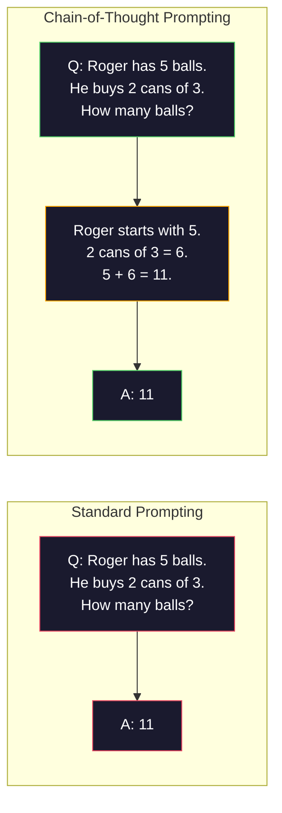
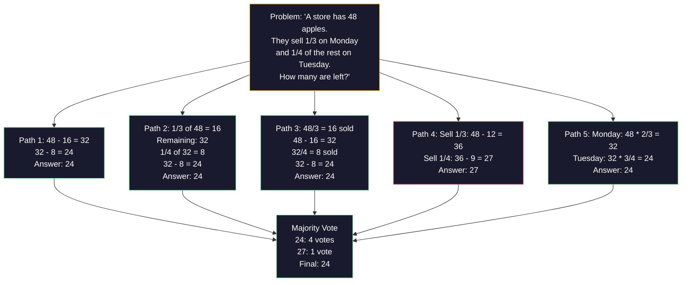
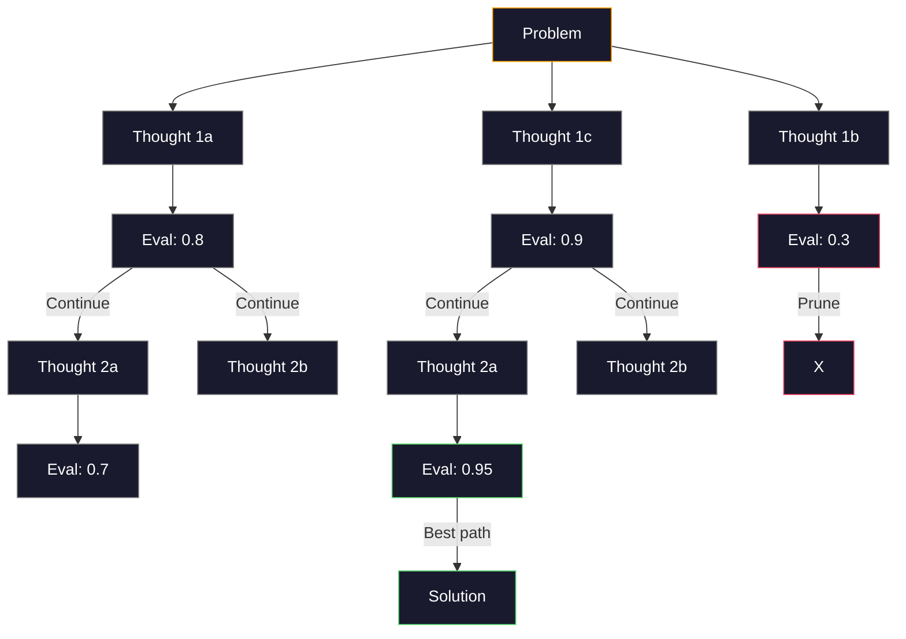

# 02 · 少样本、思维链、思维树

> 告诉模型该做什么，是「提示（prompting）」；教会它如何思考，才是「工程（engineering）」。在同一个模型、同一个任务、同一份数据上，准确率从 78% 到 91% 的差距，靠的不是更好的模型，而是更好的推理策略。

**类型：** 实战
**语言：** Python
**前置：** 第 11.01 课（提示工程）
**时长：** 约 45 分钟

## 学习目标

- 通过挑选并组织示例演示来实现少样本（few-shot）提示，从而最大化任务准确率
- 应用思维链（chain-of-thought，CoT）推理，提升数学应用题等多步问题的准确率
- 构建一个思维树（tree-of-thought）提示，探索多条推理路径并从中选出最佳者
- 在标准基准上测量零样本（zero-shot）、少样本与 CoT 之间的准确率提升

## 问题所在

你正在开发一个数学辅导应用。你的提示词写着：「Solve this word problem.（解这道应用题。）」在标准小学数学基准 GSM8K 上，GPT-5 的正确率为 94%。你以为已经到顶了。其实没有——思维链还能再加 3-4 个百分点。

加上五个词——「Let's think step by step（让我们一步步思考）」——准确率就跳到了 91%。再加上几个带解题过程的示例，它能达到 95%。同一个模型，同一个温度（temperature），同样的 API 成本。唯一的区别在于：你给了模型一张草稿纸。

这不是奇技淫巧，而是推理的运作方式。人类解决多步问题时不会一步到位地心算出答案，Transformer 也一样。当你强制模型生成中间 token 时，这些 token 就成了下一个 token 的上下文。每一步推理都为下一步提供输入。模型实实在在地一步步「算」到了答案。

但「一步步思考」只是开始，而非终点。如果你采样五条推理路径再做多数投票呢？如果你让模型探索一棵充满可能性的树，并对各分支进行评估和剪枝呢？如果你把推理与工具调用交织在一起呢？这些都不是空想。它们是已经发表、且有可测量改进的成熟技术，本课中你将逐一动手实现。

## 核心概念

### 零样本 vs 少样本：示例何时胜过指令

零样本（zero-shot）提示只给模型一个任务，别无其他。少样本（few-shot）提示则先给它一些示例。

Wei 等人（2022）在 8 个基准上测量了这一点。对于情感分类等简单任务，零样本和少样本的表现相差不到 2%。而对于多步算术、符号推理等复杂任务，少样本将准确率提升了 10-25%。

直觉上：示例就是被压缩过的指令。与其描述输出格式，不如直接展示它；与其解释推理过程，不如直接演示它。相比解读抽象指令，模型对示例进行模式匹配要可靠得多。


〔图：零样本 vs 少样本——零样本让模型自己猜测格式，少样本则让模型匹配示例模式〕

**少样本何时占优：** 对格式敏感的任务、分类、结构化抽取、领域专有术语，以及任何需要模型匹配特定模式的任务。

**零样本何时占优：** 简单的事实性问题、示例会束缚创意的创作类任务，以及那些「找到好示例比写好指令更难」的任务。

### 示例选择：相似优于随机

并非所有示例都同等有效。在分类任务上，选择与目标输入相似的示例，比随机选择高出 5-15%（Liu 等人，2022）。三条原则：

1. **语义相似性（semantic similarity）**：挑选在嵌入空间中与输入最接近的示例
2. **标签多样性（label diversity）**：让示例覆盖所有输出类别
3. **难度匹配（difficulty matching）**：与目标问题的复杂度水平相匹配

对大多数任务而言，示例数量的最优值是 3-5 个。少于 3 个，模型没有足够的信号去提取模式；多于 5 个，则会遭遇收益递减，并白白浪费上下文窗口的 token。对于标签很多的分类任务，每个标签用一个示例。

### 思维链：给模型一张草稿纸

思维链（Chain-of-Thought，CoT）提示由 Google Brain 的 Wei 等人（2022）提出。其思路很简单：不要只向模型索要答案，而是先让它展示推理步骤。



〔图：标准提示直接给出答案，而思维链提示先展示推理步骤再给出答案〕

从机制上看为何有效？Transformer 生成的每个 token 都会成为下一个 token 的上下文。没有 CoT 时，模型必须把所有推理压缩进单次前向传播的隐藏状态里。有了 CoT，模型就把中间计算以 token 的形式外化出来。每个推理 token 都延长了有效的计算深度。

**GSM8K 基准（小学数学，8.5K 道题）：**

| Model | Zero-Shot | Zero-Shot CoT | Few-Shot CoT |
|-------|-----------|---------------|--------------|
| GPT-4o | 78% | 91% | 95% |
| GPT-5 | 94% | 97% | 98% |
| o4-mini (reasoning) | 97% | — | — |
| Claude Opus 4.7 | 93% | 97% | 98% |
| Gemini 3 Pro | 92% | 96% | 98% |
| Llama 4 70B | 80% | 89% | 94% |
| DeepSeek-V3.1 | 89% | 94% | 96% |

**关于推理模型的说明。** OpenAI 的 o 系列（o3、o4-mini）以及 DeepSeek-R1 这类模型，会在给出答案之前于内部执行思维链。对推理模型再加上「Let's think step by step」是多余的，有时甚至适得其反——它们早就这么做了。

CoT 有两种形态：

**零样本 CoT（Zero-shot CoT）**：在提示词后追加「Let's think step by step」。无需示例。Kojima 等人（2022）证明，这一句话就能在算术、常识和符号推理任务上提升准确率。

**少样本 CoT（Few-shot CoT）**：提供包含推理步骤的示例。比零样本 CoT 更有效，因为模型能看到你期望的确切推理格式。

**CoT 何时有害**：简单的事实回忆（「法国的首都是哪里？」）、单步分类，以及速度比准确率更重要的任务。CoT 每次查询会增加 50-200 个 token 的推理开销。对于高吞吐、低复杂度的任务，这是被浪费的成本。

### 自洽性：多次采样，一次投票

Wang 等人（2023）提出了自洽性（self-consistency）。其洞见在于：单条 CoT 路径可能含有推理错误。但如果你采样 N 条独立的推理路径（使用 temperature > 0），并对最终答案做多数投票，错误就会相互抵消。



〔图：自洽性对同一问题采样五条推理路径，再对最终答案做多数投票，错误路径被票数淘汰〕

在最初基于 PaLM 540B 的实验中，自洽性（N=40）将 GSM8K 准确率从 56.5%（单条 CoT）提升到了 74.4%。在 GPT-5 上提升很小（97% 到 98%），因为基础准确率已经接近饱和。这项技术在基础 CoT 准确率为 60-85% 的模型上效果最为突出——这是一个甜区，单路径错误频发但又并非系统性的。对于推理模型（o 系列、R1），自洽性已被其内置的内部采样所涵盖。

权衡之处在于：N 个样本意味着 N 倍的 API 成本和延迟。实践中，N=5 已能捕获大部分收益。N=3 是有意义投票的下限。对多数任务而言，N > 10 会出现收益递减。

### 思维树：分支式探索

Yao 等人（2023）提出了思维树（Tree-of-Thought，ToT）。CoT 沿着单一的线性推理路径前进，而 ToT 则探索多个分支，并在继续之前评估哪些分支最有前途。



〔图：思维树从根问题分出多个想法分支，对每个分支评分，剪掉低分分支并扩展高分分支，最终沿最佳路径得到解〕

ToT 有三个组成部分：

1. **想法生成（thought generation）**：产生多个候选的下一步
2. **状态评估（state evaluation）**：为每个候选打分（可以用 LLM 自身作为评估器）
3. **搜索算法（search algorithm）**：以 BFS 或 DFS 遍历这棵树，并剪除低分分支

在「24 点游戏」（用四个数字做算术运算凑出 24）任务上，GPT-4 采用标准提示能解出 7.3% 的题目。用 CoT 则只有 4.0%（CoT 在这里反而有害，因为搜索空间很宽）。而用 ToT 能达到 74%。

ToT 代价高昂。树中的每个节点都需要一次 LLM 调用。一棵分支因子为 3、深度为 3 的树，最多需要 39 次 LLM 调用。仅在搜索空间大但可评估的问题上使用它——规划、解谜，以及带约束的创造性问题求解。

### ReAct：思考 + 行动

Yao 等人（2022）将推理轨迹与行动相结合。模型在思考（生成推理）与行动（调用工具、搜索、计算）之间交替进行。

```mermaid
graph LR
    Q["Question:\nWhat is the\npopulation of the\ncountry where\nthe Eiffel Tower\nis located?"]
    T1["Thought: I need to\nfind which country\nhas the Eiffel Tower"]
    A1["Action: search\n'Eiffel Tower location'"]
    O1["Observation:\nParis, France"]
    T2["Thought: Now I need\nFrance's population"]
    A2["Action: search\n'France population 2024'"]
    O2["Observation:\n68.4 million"]
    T3["Thought: I have\nthe answer"]
    F["Answer:\n68.4 million"]

    Q --> T1 --> A1 --> O1 --> T2 --> A2 --> O2 --> T3 --> F

    style Q fill:#1a1a2e,stroke:#ffa500,color:#fff
    style T1 fill:#1a1a2e,stroke:#51cf66,color:#fff
    style A1 fill:#1a1a2e,stroke:#e94560,color:#fff
    style O1 fill:#1a1a2e,stroke:#808080,color:#fff
    style T2 fill:#1a1a2e,stroke:#51cf66,color:#fff
    style A2 fill:#1a1a2e,stroke:#e94560,color:#fff
    style O2 fill:#1a1a2e,stroke:#808080,color:#fff
    style T3 fill:#1a1a2e,stroke:#51cf66,color:#fff
    style F fill:#1a1a2e,stroke:#51cf66,color:#fff
```



〔图：ReAct 在「思考—行动—观察」循环中交替推进，借助搜索工具一步步定位埃菲尔铁塔所在国家及其人口〕

在知识密集型任务上，ReAct 优于纯 CoT，因为它能把推理锚定在真实数据上。在 HotpotQA（多跳问答）上，配合 GPT-4 的 ReAct 取得 35.1% 的精确匹配，而纯 CoT 仅为 29.4%。其真正的威力在于：推理错误会被观察结果纠正——模型可以在执行过程中更新自己的计划。

ReAct 是现代 AI 智能体（agent）的基础。每一个智能体框架（LangChain、CrewAI、AutoGen）都实现了某种「思考—行动—观察」循环的变体。你将在第 14 阶段构建完整的智能体。本课只讲这一提示模式。

### 结构化提示：XML 标签、分隔符、标题

随着提示词变得复杂，结构能防止模型混淆各个部分。三种方法：

**XML 标签**（在 Claude 上效果最佳，在任何地方都很稳健）：
```
<context>
You are reviewing a pull request.
The codebase uses TypeScript and React.
</context>

<task>
Review the following diff for bugs, security issues, and style violations.
</task>

<diff>
{diff_content}
</diff>

<output_format>
List each issue with: file, line, severity (critical/warning/info), description.
</output_format>
```

**Markdown 标题**（通用）：
```
## Role
Senior security engineer at a fintech company.

## Task
Analyze this API endpoint for vulnerabilities.

## Input
{api_code}

## Rules
- Focus on OWASP Top 10
- Rate each finding: critical, high, medium, low
- Include remediation steps
```

**分隔符**（极简但有效）：
```
---INPUT---
{user_text}
---END INPUT---

---INSTRUCTIONS---
Summarize the above in 3 bullet points.
---END INSTRUCTIONS---
```

### 提示链：顺序分解

有些任务对单个提示词来说太复杂了。提示链（prompt chaining）将它们拆分成多个步骤，让前一个提示的输出成为下一个提示的输入。


〔图：提示链将原始输入依次经过抽取事实、分析事实、生成建议三个提示，前一步输出作为后一步输入〕

提示链胜过单提示有三个原因：

1. **每一步都更简单**：模型处理一个聚焦的任务，而非同时兼顾所有事情
2. **中间输出可检查**：你可以在各步之间进行校验和纠正
3. **不同步骤可用不同模型**：用便宜的模型做抽取，用昂贵的模型做推理

### 性能对比

| 技术 | 最适用于 | GSM8K 准确率 (GPT-5) | API 调用次数 | Token 开销 | 复杂度 |
|-----------|----------|------------------------|-----------|----------------|------------|
| 零样本（Zero-Shot） | 简单任务 | 94% | 1 | 无 | 极低 |
| 少样本（Few-Shot） | 格式匹配 | 96% | 1 | 200-500 tokens | 低 |
| 零样本 CoT（Zero-Shot CoT） | 快速提升推理 | 97% | 1 | 50-200 tokens | 极低 |
| 少样本 CoT（Few-Shot CoT） | 单次调用的最高准确率 | 98% | 1 | 300-600 tokens | 低 |
| 自洽性（Self-Consistency, N=5） | 高风险推理 | 98.5% | 5 | 5 倍 token 成本 | 中 |
| 推理模型（o4-mini） | CoT 的即插即用替代 | 97% | 1 | 隐藏（内部 2-10 倍） | 极低 |
| 思维树（Tree-of-Thought） | 搜索/规划问题 | N/A（24 点游戏 74%） | 10-40+ | 10-40 倍 token 成本 | 高 |
| ReAct | 知识锚定的推理 | N/A（HotpotQA 35.1%） | 3-10+ | 可变 | 高 |
| 提示链（Prompt Chaining） | 复杂多步任务 | 96%（流水线） | 2-5 | 2-5 倍 token 成本 | 中 |

正确的技术取决于三个因素：准确率要求、延迟预算和成本容忍度。对大多数生产系统而言，「少样本 CoT + 3 样本自洽性兜底」就能覆盖 90% 的用例。

## 动手构建

我们将构建一个数学题求解器，把少样本提示、思维链推理和自洽性投票整合进单一流水线。随后再为难题加入思维树。

完整实现见 `code/advanced_prompting.py`。以下是关键组件。

### 第 1 步：少样本示例库

第一个组件负责管理少样本示例，并为给定问题选出最相关的那些。

```python
GSM8K_EXAMPLES = [
    {
        "question": "Janet's ducks lay 16 eggs per day. She eats three for breakfast every morning and bakes muffins for her friends every day with four. She sells every egg at the farmers' market for $2. How much does she make every day at the farmers' market?",
        "reasoning": "Janet's ducks lay 16 eggs per day. She eats 3 and bakes 4, using 3 + 4 = 7 eggs. So she has 16 - 7 = 9 eggs left. She sells each for $2, so she makes 9 * 2 = $18 per day.",
        "answer": "18"
    },
    ...
]
```

每个示例有三个部分：问题、推理链和最终答案。正是推理链，把一个普通的少样本示例变成了 CoT 少样本示例。

### 第 2 步：思维链提示构建器

提示构建器把一条系统消息、若干带推理链的少样本示例，以及目标问题，组装成单个提示。

```python
def build_cot_prompt(question, examples, num_examples=3):
    system = (
        "You are a math problem solver. "
        "For each problem, show your step-by-step reasoning, "
        "then give the final numerical answer on the last line "
        "in the format: 'The answer is [number]'."
    )

    example_text = ""
    for ex in examples[:num_examples]:
        example_text += f"Q: {ex['question']}\n"
        example_text += f"A: {ex['reasoning']} The answer is {ex['answer']}.\n\n"

    user = f"{example_text}Q: {question}\nA:"
    return system, user
```

格式约束（"The answer is [number]"）至关重要。没有它，自洽性就无法跨样本抽取并比较答案。

### 第 3 步：自洽性投票

采样 N 条推理路径，取多数答案。

```python
def self_consistency_solve(question, examples, client, model, n_samples=5):
    system, user = build_cot_prompt(question, examples)

    answers = []
    reasonings = []
    for _ in range(n_samples):
        response = client.chat.completions.create(
            model=model,
            messages=[
                {"role": "system", "content": system},
                {"role": "user", "content": user}
            ],
            temperature=0.7
        )
        text = response.choices[0].message.content
        reasonings.append(text)
        answer = extract_answer(text)
        if answer is not None:
            answers.append(answer)

    vote_counts = Counter(answers)
    best_answer = vote_counts.most_common(1)[0][0] if vote_counts else None
    confidence = vote_counts[best_answer] / len(answers) if best_answer else 0

    return best_answer, confidence, reasonings, vote_counts
```

温度 0.7 很重要。在温度 0.0 时，N 个样本会完全相同，从而违背了初衷。你需要足够的随机性来得到多样化的推理路径，但又不能太大，以免模型产出乱码。

### 第 4 步：思维树求解器

对于线性推理失效的问题，ToT 会探索多种思路，并评估哪个方向最有前途。

```python
def tree_of_thought_solve(question, client, model, breadth=3, depth=3):
    thoughts = generate_initial_thoughts(question, client, model, breadth)
    scored = [(t, evaluate_thought(t, question, client, model)) for t in thoughts]
    scored.sort(key=lambda x: x[1], reverse=True)

    for current_depth in range(1, depth):
        next_thoughts = []
        for thought, score in scored[:2]:
            extensions = extend_thought(thought, question, client, model, breadth)
            for ext in extensions:
                ext_score = evaluate_thought(ext, question, client, model)
                next_thoughts.append((ext, ext_score))
        scored = sorted(next_thoughts, key=lambda x: x[1], reverse=True)

    best_thought = scored[0][0] if scored else ""
    return extract_answer(best_thought), best_thought
```

评估器本身就是一次 LLM 调用。你向模型提问：「On a scale of 0.0 to 1.0, how promising is this reasoning path for solving the problem?（在 0.0 到 1.0 的尺度上，这条推理路径解决问题的前景有多大？）」这正是 ToT 的关键洞见——模型对自己的部分解进行评估。

### 第 5 步：完整流水线

流水线将所有技术与一套升级（escalation）策略相结合。

```python
def solve_with_escalation(question, examples, client, model):
    system, user = build_cot_prompt(question, examples)
    single_response = call_llm(client, model, system, user, temperature=0.0)
    single_answer = extract_answer(single_response)

    sc_answer, confidence, _, _ = self_consistency_solve(
        question, examples, client, model, n_samples=5
    )

    if confidence >= 0.8:
        return sc_answer, "self_consistency", confidence

    tot_answer, _ = tree_of_thought_solve(question, client, model)
    return tot_answer, "tree_of_thought", None
```

升级逻辑：先试便宜的（单条 CoT）。如果自洽性置信度低于 0.8（5 个样本中达成一致的少于 4 个），就升级到 ToT。这在成本与准确率之间取得了平衡——大多数问题被廉价解决，难题则获得更多算力。

## 实际运用

### 配合 LangChain

LangChain 为提示模板和输出解析提供了内置支持，能简化少样本和 CoT 模式：

```python
from langchain_core.prompts import FewShotPromptTemplate, PromptTemplate
from langchain_openai import ChatOpenAI

example_prompt = PromptTemplate(
    input_variables=["question", "reasoning", "answer"],
    template="Q: {question}\nA: {reasoning} The answer is {answer}."
)

few_shot_prompt = FewShotPromptTemplate(
    examples=examples,
    example_prompt=example_prompt,
    suffix="Q: {input}\nA: Let's think step by step.",
    input_variables=["input"]
)

llm = ChatOpenAI(model="gpt-4o", temperature=0.7)
chain = few_shot_prompt | llm
result = chain.invoke({"input": "If a train travels 120 km in 2 hours..."})
```

LangChain 还提供了用于语义相似度选择的 `ExampleSelector` 类：

```python
from langchain_core.example_selectors import SemanticSimilarityExampleSelector
from langchain_openai import OpenAIEmbeddings

selector = SemanticSimilarityExampleSelector.from_examples(
    examples,
    OpenAIEmbeddings(),
    k=3
)
```

### 配合 DSPy

DSPy 把提示策略当作可优化的模块。你不必手工编写 CoT 提示，而是定义一个签名（signature），让 DSPy 来优化提示：

```python
import dspy

dspy.configure(lm=dspy.LM("openai/gpt-4o", temperature=0.7))

class MathSolver(dspy.Module):
    def __init__(self):
        self.solve = dspy.ChainOfThought("question -> answer")

    def forward(self, question):
        return self.solve(question=question)

solver = MathSolver()
result = solver(question="Janet's ducks lay 16 eggs per day...")
```

DSPy 的 `ChainOfThought` 会自动添加推理轨迹。`dspy.majority` 实现了自洽性：

```python
result = dspy.majority(
    [solver(question=q) for _ in range(5)],
    field="answer"
)
```

### 对比：从零实现 vs 框架

| 特性 | 从零实现（本课） | LangChain | DSPy |
|---------|--------------------------|-----------|------|
| 对提示格式的控制 | 完全 | 基于模板 | 自动 |
| 自洽性 | 手动投票 | 手动 | 内置（`dspy.majority`） |
| 示例选择 | 自定义逻辑 | `ExampleSelector` | `dspy.BootstrapFewShot` |
| 思维树 | 自定义树搜索 | 社区链 | 无内置 |
| 提示优化 | 手动迭代 | 手动 | 自动编译 |
| 最适用于 | 学习、定制流水线 | 标准工作流 | 研究、优化 |

## 交付成果

本课产出两份制品。

**1. 推理链提示**（`outputs/prompt-reasoning-chain.md`）：一个面向生产、带自洽性的少样本 CoT 提示模板。填入你自己的示例和问题领域即可。

**2. CoT 模式选择技能**（`outputs/skill-cot-patterns.md`）：一套决策框架，依据任务类型、准确率要求和成本约束来选择正确的推理技术。

## 练习

1. **测量差距**：取 10 道 GSM8K 题目。分别用零样本、少样本、零样本 CoT 和少样本 CoT 求解每一道，记录各自的准确率。在你的模型上，哪种技术带来的提升最大？

2. **示例选择实验**：对同样的 10 道题，比较随机示例选择与手挑相似示例。测量准确率差异。从哪个点开始，示例质量比示例数量更重要？

3. **自洽性成本曲线**：在 20 道 GSM8K 题目上，以 N=1、3、5、7、10 运行自洽性。绘制准确率 vs 成本（总 token 数）的曲线。在你的模型上，曲线的拐点在哪里？

4. **构建 ReAct 循环**：为流水线扩展一个计算器工具。当模型生成数学表达式时，用 Python 的 `eval()`（在沙箱中）执行它并把结果回喂给模型。测量工具锚定的推理是否优于纯 CoT。

5. **将 ToT 用于创作任务**：将思维树求解器改造用于创意写作任务：「Write a 6-word story that is both funny and sad.（写一个既好笑又悲伤的六词故事。）」用 LLM 作为评估器。分支式探索产出的创意输出，是否优于单次生成？

## 关键术语

| 术语 | 人们怎么说 | 它实际指什么 |
|------|----------------|----------------------|
| 少样本提示（Few-shot prompting） | 「给它几个示例」 | 在提示中包含输入-输出演示，以锚定模型的输出格式与行为 |
| 思维链（Chain-of-Thought） | 「让它一步步思考」 | 引出中间推理 token，在给出最终答案之前延长模型的有效计算 |
| 自洽性（Self-Consistency） | 「多跑几次」 | 在 temperature > 0 下采样 N 条多样化的推理路径，并通过多数投票选出最常见的最终答案 |
| 思维树（Tree-of-Thought） | 「让它探索各种选项」 | 在推理分支上进行结构化搜索，对每个部分解进行评估，只扩展有前途的路径 |
| ReAct | 「思考 + 工具调用」 | 在「思考—行动—观察」循环中，将推理轨迹与外部行动（搜索、计算、API 调用）交织 |
| 提示链（Prompt chaining） | 「把它拆成几步」 | 将复杂任务分解为顺序的提示，每个输出馈入下一个输入 |
| 零样本 CoT（Zero-shot CoT） | 「只要加上『一步步思考』」 | 在提示后追加一句推理触发短语而不带任何示例，依赖模型潜在的推理能力 |

## 延伸阅读

- [Chain-of-Thought Prompting Elicits Reasoning in Large Language Models](https://arxiv.org/abs/2201.11903) —— Wei 等人，2022。Google Brain 的原始 CoT 论文。阅读第 2-3 节以了解核心结果。
- [Self-Consistency Improves Chain of Thought Reasoning in Language Models](https://arxiv.org/abs/2203.11171) —— Wang 等人，2023。自洽性论文。表 1 包含你需要的全部数字。
- [Tree of Thoughts: Deliberate Problem Solving with Large Language Models](https://arxiv.org/abs/2305.10601) —— Yao 等人，2023。ToT 论文。第 4 节的 24 点游戏结果是重点。
- [ReAct: Synergizing Reasoning and Acting in Language Models](https://arxiv.org/abs/2210.03629) —— Yao 等人，2022。现代 AI 智能体的基础。第 3 节解释了「思考—行动—观察」循环。
- [Large Language Models are Zero-Shot Reasoners](https://arxiv.org/abs/2205.11916) —— Kojima 等人，2022。即「Let's think step by step」论文。就其之简单而言，效果出人意料地好。
- [DSPy: Compiling Declarative Language Model Calls into Self-Improving Pipelines](https://arxiv.org/abs/2310.03714) —— Khattab 等人，2023。把提示当作编译问题来处理。如果你想超越手工提示工程，值得一读。
- [OpenAI — Reasoning models guide](https://platform.openai.com/docs/guides/reasoning) —— 厂商指南，讲解思维链何时从一种提示层面的技巧，变成内部的、按 token 计价的「推理」模式。
- [Lightman et al., "Let's Verify Step by Step" (2023)](https://arxiv.org/abs/2305.20050) —— 过程奖励模型（process reward models，PRM），对推理链的每一步评分；这是优于仅看结果奖励的推理监督信号。
- [Snell et al., "Scaling LLM Test-Time Compute Optimally" (2024)](https://arxiv.org/abs/2408.03314) —— 对 CoT 长度、自洽性采样和 MCTS 的系统性研究；当准确率比延迟更重要时，「一步步思考」该走向何方。
