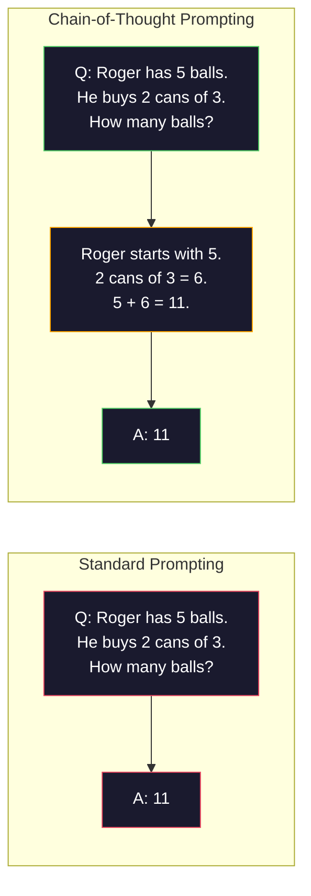
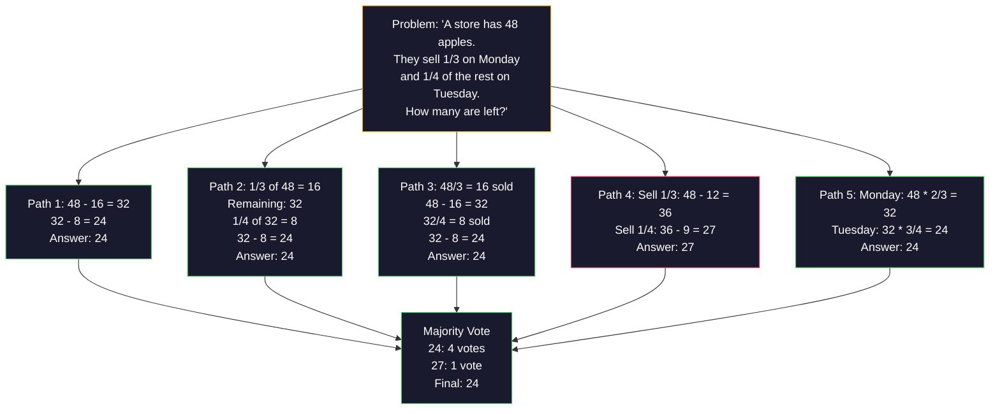
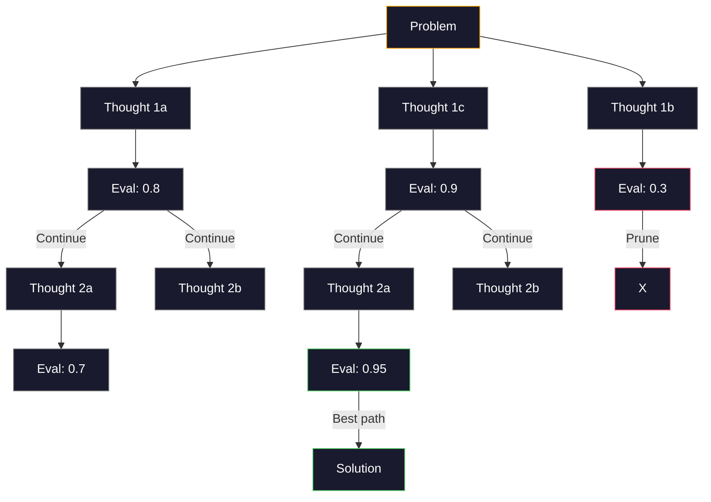

```mermaid
graph LR
    Q["Question:\nWhat is the\npopulation of the\ncountry where\nthe Eiffel Tower\nis located?"]
    T1["Thought: I need to\nfind which country\nhas the Eiffel Tower"]
    A1["Action: search\n'Eiffel Tower location'"]
    O1["Observation:\nParis, France"]
    T2["Thought: Now I need\nFrance's population"]
    A2["Action: search\n'France population 2024'"]
    O2["Observation:\n68.4 million"]
    T3["Thought: I have\nthe answer"]
    F["Answer:\n68.4 million"]

    Q --> T1 --> A1 --> O1 --> T2 --> A2 --> O2 --> T3 --> F

    style Q fill:#1a1a2e,stroke:#ffa500,color:#fff
    style T1 fill:#1a1a2e,stroke:#51cf66,color:#fff
    style A1 fill:#1a1a2e,stroke:#e94560,color:#fff
    style O1 fill:#1a1a2e,stroke:#808080,color:#fff
    style T2 fill:#1a1a2e,stroke:#51cf66,color:#fff
    style A2 fill:#1a1a2e,stroke:#e94560,color:#fff
    style O2 fill:#1a1a2e,stroke:#808080,color:#fff
    style T3 fill:#1a1a2e,stroke:#51cf66,color:#fff
    style F fill:#1a1a2e,stroke:#51cf66,color:#fff
```

# Few-Shot、Chain-of-Thought、Tree-of-Thought

> 告诉模型该做什么叫做提示。展示给它如何思考叫做工程。在相同模型、相同任务、相同数据上，准确率从78%提升到91%，靠的不是更好的模型，而是更好的推理策略。

**类型：** Build
**语言：** Python
**前置知识：** 第11.01课（Prompt Engineering）
**时间：** ~45分钟

## 学习目标

- 通过选择和格式化示例演示来实现few-shot prompting，最大化任务准确率
- 应用chain-of-thought（CoT）推理来提升多步骤问题（如数学应用题）的准确率
- 构建tree-of-thought提示，探索多条推理路径并选择最佳路径
- 在标准基准上测量zero-shot、few-shot和CoT带来的准确率提升

## 问题背景

你开发了一个数学辅导应用。你的提示词是："Solve this word problem." GPT-5在GSM8K（标准小学数学基准测试）上的准确率是94%。你以为这已经到顶了。其实没有——chain-of-thought还能再提升3-4个百分点。

加五个字——"Let's think step by step"——准确率就跳到91%。再加几个示例，达到95%。同一个模型。同样的temperature。同样的API费用。唯一的区别是你给了模型草稿纸。

这不是hack。这就是推理的工作原理。人类不会一步登天解决多步骤问题。Transformer也不会。当你强制模型生成中间token时，这些token会成为下一个token的上下文。每一步推理都喂养下一步。模型 literally 通过计算得出答案。

但"think step by step"只是开始，不是终点。如果你采样五条推理路径然后投票呢？如果你让模型探索一棵可能性树，评估并剪枝呢？如果你将推理与工具使用交错进行呢？这些不是假设。它们是已发表的技术，有实测的提升效果，你将在本课中构建所有这些。

## 核心概念

### Zero-Shot vs Few-Shot：示例何时击败指令

Zero-shot prompting只给模型任务，不给其他内容。Few-shot prompting先给示例。

Wei等人（2022）在8个基准测试上测量了这一点。对于情感分类等简单任务，zero-shot和few-shot的表现相差不到2%。对于多步算术和符号推理等复杂任务，few-shot将准确率提升了10-25%。

直觉是：示例是压缩的指令。与其描述输出格式，不如展示它。与其解释推理过程，不如演示它。模型对示例的模式匹配比对抽象指令的解读更可靠。


**Few-shot何时胜出：** 格式敏感的任务、分类、结构化提取、领域特定术语，以及任何需要模型匹配特定模式的任务。

**Zero-shot何时胜出：** 简单事实性问题、示例会限制创造力的创意任务，以及找到好示例比写好指令更困难的任务。

### 示例选择：相似性胜过随机

并非所有示例都平等。选择与目标输入相似的示例比随机选择的表现好5-15%（Liu等人，2022）。三个原则：

1. **语义相似性**：在embedding空间中挑选与输入最接近的示例
2. **标签多样性**：在示例中覆盖所有输出类别
3. **难度匹配**：匹配目标问题的复杂程度

大多数任务的最佳示例数量是3-5个。少于3个，模型没有足够信号提取模式。多于5个，你会遇到收益递减并浪费上下文窗口token。对于多标签分类，每个标签使用一个示例。

### Chain-of-Thought：给模型草稿纸

Chain-of-Thought（CoT）prompting由Wei等人（2022）在Google Brain提出。思路很简单：与其让模型直接给出答案，不如让它先展示推理步骤。



这在机制上为什么有效？Transformer生成的每个token都会成为下一个token的上下文。没有CoT时，模型必须将所有推理压缩到单次前向传播的隐藏状态中。有了CoT，模型将中间计算外化为token。每个推理token都扩展了有效计算深度。

**GSM8K基准测试（小学数学，8.5K道题）：**

| 模型 | Zero-Shot | Zero-Shot CoT | Few-Shot CoT |
|-------|-----------|---------------|--------------|
| GPT-4o | 78% | 91% | 95% |
| GPT-5 | 94% | 97% | 98% |
| o4-mini (reasoning) | 97% | — | — |
| Claude Opus 4.7 | 93% | 97% | 98% |
| Gemini 3 Pro | 92% | 96% | 98% |
| Llama 4 70B | 80% | 89% | 94% |
| DeepSeek-V3.1 | 89% | 94% | 96% |

**关于推理模型的说明。** 像OpenAI的o系列（o3、o4-mini）和DeepSeek-R1这样的模型在输出答案之前会在内部运行chain-of-thought。对推理模型添加"Let's think step by step"是多余的，有时甚至适得其反——它们已经做了。

CoT的两种形式：

**Zero-shot CoT**：在提示词后追加"Let's think step by step"。不需要示例。Kojima等人（2022）表明，这一句话就能提升算术、常识和符号推理任务的准确率。

**Few-shot CoT**：提供包含推理步骤的示例。比zero-shot CoT更有效，因为模型看到了你期望的确切推理格式。

**CoT何时有害：** 简单事实回忆（"法国的首都是什么？"）、单步分类、速度比准确率更重要的任务。CoT每次查询增加50-200个推理token的开销。对于高吞吐量、低复杂度的任务，这是浪费成本。

### Self-Consistency：多次采样，一次投票

Wang等人（2023）提出了self-consistency。核心洞察：单条CoT路径可能包含推理错误。但如果你采样N条独立的推理路径（使用temperature > 0），并对最终答案进行多数投票，错误就会相互抵消。



Self-consistency将GSM8K准确率从56.5%（单条CoT）提升到原始PaLM 540B实验中N=40时的74.4%。在GPT-5上提升很小（97%到98%），因为基础准确率已经饱和。该技术在基础CoT准确率为60-85%的模型上表现最佳——这是单路径错误频繁但非系统性的最佳区间。对于推理模型（o系列、R1），self-consistency已被内置的内部采样所取代。

权衡：N次采样意味着N倍的API费用和延迟。实践中，N=5就能捕获大部分收益。N=3是有意义投票的最低要求。N > 10对大多数任务有收益递减。

### Tree-of-Thought：分支探索

Yao等人（2023）提出了Tree-of-Thought（ToT）。CoT遵循一条线性推理路径，而ToT探索多条分支，在继续之前评估哪些分支最有希望。



ToT有三个组成部分：

1. **Thought generation**：生成多个候选下一步
2. **State evaluation**：为每个候选打分（可以使用LLM本身作为评估器）
3. **Search algorithm**：在树上进行BFS或DFS，剪枝低分分支

在Game of 24任务（用算术组合4个数字得到24）上，GPT-4使用标准prompting解决7.3%的问题。使用CoT，4.0%（CoT实际上有害，因为搜索空间很大）。使用ToT，74%。

ToT很昂贵。树上的每个节点都需要一次LLM调用。一个分支因子为3、深度为3的树最多需要39次LLM调用。只在搜索空间大但可评估的问题上使用它——规划、谜题求解、带约束的创意问题解决。

### ReAct：思考 + 行动

Yao等人（2022）将推理轨迹与行动结合起来。模型在思考（生成推理）和行动（调用工具、搜索、计算）之间交替。



ReAct在知识密集型任务上优于纯CoT，因为它可以将推理建立在真实数据中。在HotpotQA（多跳问答）上，ReAct配合GPT-4达到35.1%的精确匹配，而CoT单独只有29.4%。真正的威力在于推理错误会被观察结果纠正——模型可以在执行过程中更新计划。

ReAct是现代AI agent的基础。每个agent框架（LangChain、CrewAI、AutoGen）都实现了某种形式的Thought-Action-Observation循环。你将在第14阶段构建完整的agent。本课涵盖prompting模式。

### Structured Prompting：XML标签、分隔符、标题

随着提示词变得复杂，结构可以防止模型混淆各个部分。三种方法：

**XML标签**（对Claude效果最好，其他地方也不错）：
```
<context>
You are reviewing a pull request.
The codebase uses TypeScript and React.
</context>

<task>
Review the following diff for bugs, security issues, and style violations.
</task>

<diff>
{diff_content}
</diff>

<output_format>
List each issue with: file, line, severity (critical/warning/info), description.
</output_format>
```

**Markdown标题**（通用）：
```
## Role
Senior security engineer at a fintech company.

## Task
Analyze this API endpoint for vulnerabilities.

## Input
{api_code}

## Rules
- Focus on OWASP Top 10
- Rate each finding: critical, high, medium, low
- Include remediation steps
```

**分隔符**（最小但有效）：
```
---INPUT---
{user_text}
---END INPUT---

---INSTRUCTIONS---
Summarize the above in 3 bullet points.
---END INSTRUCTIONS---
```

### Prompt Chaining：顺序分解

有些任务对单个提示词来说太复杂。Prompt chaining将它们分解成步骤，一个提示词的输出成为下一个提示词的输入。


Chaining优于单提示词的三个原因：

1. **每一步更简单**：模型处理一个聚焦的任务，而不是同时兼顾所有事情
2. **中间输出可检查**：你可以在步骤之间验证和纠正
3. **不同步骤可以使用不同模型**：用便宜的模型做提取，用昂贵的模型做推理

### 性能对比

| 技术 | 最佳适用场景 | GSM8K准确率（GPT-5） | API调用次数 | Token开销 | 复杂度 |
|-----------|----------|------------------------|-----------|----------------|------------|
| Zero-Shot | 简单任务 | 94% | 1 | 无 | 简单 |
| Few-Shot | 格式匹配 | 96% | 1 | 200-500 tokens | 低 |
| Zero-Shot CoT | 快速推理提升 | 97% | 1 | 50-200 tokens | 简单 |
| Few-Shot CoT | 单次调用最大准确率 | 98% | 1 | 300-600 tokens | 低 |
| Self-Consistency (N=5) | 高 stakes 推理 | 98.5% | 5 | 5倍token成本 | 中等 |
| Reasoning model (o4-mini) | 即插即用的CoT替代 | 97% | 1 | 隐藏（内部2-10倍） | 简单 |
| Tree-of-Thought | 搜索/规划问题 | N/A（Game of 24上74%） | 10-40+ | 10-40倍token成本 | 高 |
| ReAct | 知识驱动的推理 | N/A（HotpotQA上35.1%） | 3-10+ | 可变 | 高 |
| Prompt Chaining | 复杂多步骤任务 | 96%（pipeline） | 2-5 | 2-5倍token成本 | 中等 |

正确的技术取决于三个因素：准确率要求、延迟预算和成本容忍度。对于大多数生产系统，few-shot CoT配合3-sample self-consistency fallback可以覆盖90%的用例。

## 动手构建

我们将构建一个数学问题求解器，将few-shot prompting、chain-of-thought推理和self-consistency投票组合到一个pipeline中。然后我们将为难题添加tree-of-thought。

完整实现在`code/advanced_prompting.py`中。以下是关键组件。

### 步骤1：Few-Shot示例库

第一个组件管理few-shot示例，并为给定问题选择最相关的示例。

```python
GSM8K_EXAMPLES = [
    {
        "question": "Janet's ducks lay 16 eggs per day. She eats three for breakfast every morning and bakes muffins for her friends every day with four. She sells every egg at the farmers' market for $2. How much does she make every day at the farmers' market?",
        "reasoning": "Janet's ducks lay 16 eggs per day. She eats 3 and bakes 4, using 3 + 4 = 7 eggs. So she has 16 - 7 = 9 eggs left. She sells each for $2, so she makes 9 * 2 = $18 per day.",
        "answer": "18"
    },
    ...
]
```

每个示例有三个部分：问题、推理链和最终答案。推理链将常规few-shot示例转变为CoT few-shot示例。

### 步骤2：Chain-of-Thought提示构建器

提示构建器将系统消息、带推理链的few-shot示例和目标问题组装成一个提示。

```python
def build_cot_prompt(question, examples, num_examples=3):
    system = (
        "You are a math problem solver. "
        "For each problem, show your step-by-step reasoning, "
        "then give the final numerical answer on the last line "
        "in the format: 'The answer is [number]'."
    )

    example_text = ""
    for ex in examples[:num_examples]:
        example_text += f"Q: {ex['question']}\n"
        example_text += f"A: {ex['reasoning']} The answer is {ex['answer']}.\n\n"

    user = f"{example_text}Q: {question}\nA:"
    return system, user
```

格式约束（"The answer is [number]"）至关重要。没有它，self-consistency无法跨样本提取和比较答案。

### 步骤3：Self-Consistency投票

采样N条推理路径，取多数答案。

```python
def self_consistency_solve(question, examples, client, model, n_samples=5):
    system, user = build_cot_prompt(question, examples)

    answers = []
    reasonings = []
    for _ in range(n_samples):
        response = client.chat.completions.create(
            model=model,
            messages=[
                {"role": "system", "content": system},
                {"role": "user", "content": user}
            ],
            temperature=0.7
        )
        text = response.choices[0].message.content
        reasonings.append(text)
        answer = extract_answer(text)
        if answer is not None:
            answers.append(answer)

    vote_counts = Counter(answers)
    best_answer = vote_counts.most_common(1)[0][0] if vote_counts else None
    confidence = vote_counts[best_answer] / len(answers) if best_answer else 0

    return best_answer, confidence, reasonings, vote_counts
```

Temperature 0.7很重要。在temperature 0.0时，所有N个样本都会相同，失去了意义。你需要足够的随机性来产生多样的推理路径，但又不能太多以至于模型产生乱码。

### 步骤4：Tree-of-Thought求解器

对于线性推理失效的问题，ToT探索多种方法并评估哪个方向最有希望。

```python
def tree_of_thought_solve(question, client, model, breadth=3, depth=3):
    thoughts = generate_initial_thoughts(question, client, model, breadth)
    scored = [(t, evaluate_thought(t, question, client, model)) for t in thoughts]
    scored.sort(key=lambda x: x[1], reverse=True)

    for current_depth in range(1, depth):
        next_thoughts = []
        for thought, score in scored[:2]:
            extensions = extend_thought(thought, question, client, model, breadth)
            for ext in extensions:
                ext_score = evaluate_thought(ext, question, client, model)
                next_thoughts.append((ext, ext_score))
        scored = sorted(next_thoughts, key=lambda x: x[1], reverse=True)
