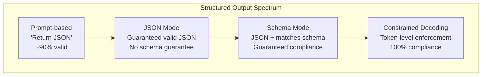

# Structured Outputs: JSON, Schema Validation, Constrained Decoding

> LLM は文字列を返します。アプリケーションが必要とするのは JSON です。この差は、モデルの hallucination より多くの本番システムを壊してきました。Structured output は自然言語と型付きデータの橋です。正しく扱えば LLM は信頼できる API になります。間違えれば午前 3 時に free-text を regex で parse することになります。

**種別:** 構築
**言語:** Python
**前提条件:** Phase 10, Lessons 01-05 (LLMs from Scratch)
**所要時間:** 約90分
**Related:** Phase 5 · 20 (Structured Outputs & Constrained Decoding) は decoder-level theory (FSM/CFG logit processors、Outlines、XGrammar) を扱います。この lesson は production SDK surface (OpenAI `response_format`、Anthropic tool use、Instructor) に焦点を当てます。

## Learning Objectives

- OpenAI と Anthropic API parameters を使って JSON-mode と schema-constrained outputs を実装する
- malformed LLM outputs を拒否し、error feedback で retry する Pydantic validation layer を作る
- constrained decoding が post-processing なしで token level の valid JSON を強制する仕組みを説明する
- unstructured text を typed data structures に確実に変換する robust extraction prompts を設計する

## 問題

LLM に「この text から product name、price、availability を抽出して」と頼むと、次のような応答が返るかもしれません。

```
The product is the Sony WH-1000XM5 headphones, which cost $348.00 and are currently in stock.
```

これは正しい答えですが、アプリケーションには役に立ちません。inventory system が必要なのは `{"product": "Sony WH-1000XM5", "price": 348.00, "in_stock": true}` です。specific keys、specific types、specific value constraints を持つ JSON object が必要で、文は不要です。

素朴な解決策は prompt に "Respond in JSON" を足すことです。これは 90% は動きます。残り 10% で、モデルは JSON を markdown code fences で囲んだり、"Here's the JSON:" と前置きしたり、bracket を早く閉じて syntactically invalid JSON を生成したりします。parser が落ち、pipeline が壊れます。

これは prompt engineering 問題ではなく decoding 問題です。モデルは token を左から右へ生成します。各位置で 100K+ の vocabulary から次 token を選びます。その大半は、その位置では invalid JSON を生みます。制約がなければ、構文的に破滅的な token も選ばれます。

## The Concept

### The Structured Output Spectrum

structured output control には 4 段階があり、後ろほど信頼できます。



**Prompt-based** ("Respond in valid JSON"): enforcement なし。多くは従いますが、markdown fences、preamble text、truncated output、wrong structure で失敗します。

**JSON mode**: API が valid JSON を保証します。OpenAI の `response_format: { type: "json_object" }` がこれです。ただし expected schema への一致は保証しません。

**Schema mode**: API に JSON Schema を渡し、出力がそれに一致することを保証します。OpenAI の `response_format: { type: "json_schema", json_schema: {...} }`、Anthropic tool use の `input_schema`、Gemini の `response_schema` + `response_mime_type: "application/json"` が該当します。

**Constrained decoding**: 生成中の各 token 位置で、invalid output につながる tokens を mask します。schema が number を要求している位置で letter を出す確率は 0 になります。

### JSON Schema: 契約言語

JSON Schema は、出力の形を model または validation layer に伝える言語です。

```json
{
  "type": "object",
  "properties": {
    "product": { "type": "string" },
    "price": { "type": "number", "minimum": 0 },
    "in_stock": { "type": "boolean" },
    "categories": {
      "type": "array",
      "items": { "type": "string" }
    }
  },
  "required": ["product", "price", "in_stock"]
}
```

この schema は、出力が string `product`、non-negative number `price`、boolean `in_stock`、optional array of string `categories` を持つ object でなければならないことを示します。

### The Pydantic Pattern

Python では JSON Schema を手書きしません。Pydantic model を定義し、schema を生成させます。

```python
from pydantic import BaseModel

class Product(BaseModel):
    product: str
    price: float
    in_stock: bool
    categories: list[str] = []
```

Instructor library や OpenAI SDK は Pydantic models を直接受け取り、validated instance を返します。出力が合わない場合、Instructor は自動で retry します。

### Function Calling / Tool Use

同じ問題の別 interface です。JSON を直接生成させる代わりに、typed parameters を持つ tools (functions) を定義します。モデルは structured arguments を持つ function call を出力します。OpenAI は "function calling"、Anthropic は "tool use" と呼びます。

Tool use は、モデルがどの function を呼ぶかを選ぶ必要がある場合に適しています。複数 schema から input に応じて選ぶ場合、schema selection と structured output の両方を得られます。

### Common Failure Modes

schema enforcement があっても、structured outputs には微妙な失敗があります。

**Hallucinated values**: 出力は schema に合うが、値が捏造されている。schema validation では型しか見えません。

**Enum confusion**: allowed set にないが意味的には近い値を出す。prompt-based では防ぎにくく、constrained decoding で防ぎます。

**Nested object depth**: 4+ levels の deeply nested schemas は error を増やします。

**Array length**: items が多すぎる/少なすぎることがあります。`minItems` と `maxItems` を使います。

**Optional field omission**: optional だが重要な fields を省略されることがあります。必要なら required にして `null` を明示させます。

## 実装

### Step 1: JSON Schema Validator

Python object が JSON Schema に一致するかを検証する validator を from scratch で作ります。これは output side で compliance を確認するものです。

```python
import json

def validate_schema(data, schema):
    errors = []
    _validate(data, schema, "", errors)
    return errors
```

実装では object、array、string、number、boolean、integer を検証し、required fields、enum、minimum/maximum、minItems/maxItems を確認します。

### Step 2: Pydantic-Style Model to Schema

Python class から JSON Schema を自動生成する最小 converter を作ります。`SchemaField` に type、required、default、enum、minimum、maximum を持たせ、`model_to_schema` で `properties` と `required` を生成します。

### Step 3: Constrained Token Filter

constrained decoding を simulation します。partial JSON string と schema から、現在位置で有効な token categories を判定します。これは実際の decoder が invalid tokens を mask する発想を小さく再現したものです。

### Step 4: Extraction Pipeline

schema を定義し、LLM が structured output を生成する部分を simulate し、output を validate して retry を扱う extraction pipeline を組み合わせます。parse error と schema validation errors を分けて扱います。

### Step 5: Run the Full Pipeline

demo では schema definition、schema validation、constrained decoding simulation、extraction pipeline を順に実行します。valid object、negative price、missing price、wrong type などの test cases で validator を確認します。

## Use It

### OpenAI Structured Outputs

```python
# from openai import OpenAI
# from pydantic import BaseModel
#
# client = OpenAI()
#
# class Product(BaseModel):
#     product: str
#     price: float
#     in_stock: bool
#
# response = client.beta.chat.completions.parse(
#     model="gpt-5-mini",
#     messages=[
#         {"role": "system", "content": "Extract product information."},
#         {"role": "user", "content": "Sony WH-1000XM5, $348, in stock"},
#     ],
#     response_format=Product,
# )
```

OpenAI の structured output mode は内部で constrained decoding を使います。生成される token は Pydantic schema に一致する output につながることが保証されます。

### Anthropic Tool Use

Anthropic は tool use で structured output を実現します。desired schema を持つ tool を定義し、model は `input_schema` に一致する structured arguments を持つ tool call を出します。

### Instructor Library

Instructor は任意の LLM client を wrap し、validation 付き automatic retries を追加します。最初の attempt が validation に失敗すると、errors を context として model に戻し、output を修正させます。

## Ship It

この lesson は `outputs/prompt-structured-extractor.md` を生成します。schema definition と unstructured text を渡すと validated JSON を返す reusable prompt template です。

また `outputs/skill-structured-outputs.md` も生成します。provider、reliability requirements、schema complexity に基づいて structured output strategy を選ぶ decision framework です。

## Exercises

1. schema validator を拡張して `oneOf` をサポートします。
2. 2 つの schemas を比較し、breaking changes と non-breaking changes を識別する schema diff tool を作ります。
3. vocabulary を持つ realistic constrained decoding simulator を実装し、各 step で有効な vocabulary の割合を測ります。
4. 50 件の product descriptions と hand-labeled JSON outputs を作り、exact match、field-level accuracy、type compliance を測ります。
5. extracted fields に confidence scores を追加し、low-confidence fields を human review に回します。

## Key Terms

| Term | What people say | What it actually means |
|------|----------------|----------------------|
| JSON mode | 「JSON を返す」 | syntactically valid JSON output を保証する API flag。ただし schema は強制しない |
| Structured output | 「Typed JSON」 | specific JSON Schema に keys、types、constraints が一致する output |
| Constrained decoding | 「Guided generation」 | invalid output につながる tokens を各位置で mask し、schema compliance を保証すること |
| JSON Schema | 「JSON template」 | JSON data の structure、types、constraints を記述する declarative language |
| Pydantic | 「Python dataclasses+」 | type validation 付き data models を定義し JSON Schemas を生成する Python library |
| Function calling | 「Tool use」 | free text ではなく name + typed arguments の structured function invocation を出すこと |
| Instructor | 「Pydantic for LLMs」 | LLM clients を wrap し、validated Pydantic instances と automatic retry を返す library |
| Token masking | 「vocabulary filtering」 | 生成中に特定 token probabilities を 0 にし、出せないようにすること |
| Schema compliance | 「形が合う」 | required fields、correct types、constraints、extra disallowed fields の条件を満たすこと |
| Retry loop | 「動くまで再試行」 | validation errors を model に戻し、output を修正させる loop |

## 参考文献

- [OpenAI Structured Outputs Guide](https://platform.openai.com/docs/guides/structured-outputs) -- OpenAI API の JSON Schema-based constrained decoding 公式 docs
- [Willard & Louf, 2023 -- "Efficient Guided Generation for Large Language Models"](https://arxiv.org/abs/2307.09702) -- JSON Schemas を finite state machines に compile する Outlines paper
- [Instructor documentation](https://python.useinstructor.com/) -- Pydantic validation と retries で structured outputs を得る standard library
- [Anthropic Tool Use Guide](https://docs.anthropic.com/en/docs/tool-use) -- Claude の tool use と JSON Schema `input_schema`
- [JSON Schema specification](https://json-schema.org/) -- schema language の仕様
- [Outlines library](https://github.com/outlines-dev/outlines) -- regex と JSON Schema を使う open-source constrained generation
