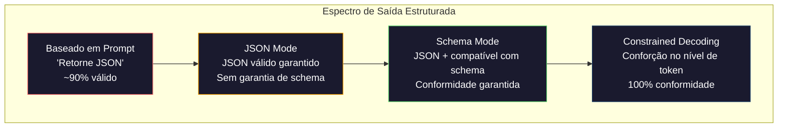

# Structured Outputs: JSON, Schema Validation, Constrained Decoding

> Seu LLM retorna uma string. Sua aplicação precisa de JSON. Essa lacuna derrubou mais sistemas em produção do que qualquer alucinação de modelo. Saída estruturada é a ponte entre linguagem natural e dados tipados. Acerte e seu LLM vira uma API confiável. Erre e você estará fazendo parse de texto livre com regex às 3 da manhã.

**Tipo:** Construção
**Linguagens:** Python
**Pré-requisitos:** Fase 10, Aulas 01-05 (LLMs do Zero)
**Tempo:** ~90 minutos
**Relacionado:** Fase 5 · 20 (Structured Outputs & Constrained Decoding) cobre a teoria no nível do decoder (processadores de logit FSM/CFG, Outlines, XGrammar). Esta aula foca na superfície de SDKs de produção (OpenAI `response_format`, Anthropic tool use, Instructor) — leia Fase 5 · 20 primeiro se quiser entender o que acontece abaixo da API.

## Objetivos de Aprendizado

- Implementar JSON-mode e saídas com schema usando parâmetros das APIs OpenAI e Anthropic
- Construir uma camada de validação Pydantic que rejeita saídas malformadas do LLM e tenta novamente com feedback de erro
- Explicar como constrained decoding força JSON válido no nível de token sem pós-processamento
- Projetar prompts de extração robustos que convertem texto não estruturado em estruturas de dados tipadas de forma confiável

## O Problema

Você pede a um LLM: "Extraia o nome do produto, preço e disponibilidade deste texto." Ele responde:

```
O produto é os fones Sony WH-1000XM5, que custam $348.00 e estão atualmente em estoque.
```

Isso é uma resposta perfeitamente correta. E completamente inútil para sua aplicação. Seu sistema de inventário precisa de `{"product": "Sony WH-1000XM5", "price": 348.00, "in_stock": true}`. Você precisa de um objeto JSON com chaves específicas, tipos específicos e restrições de valor específicas. Você não precisa de uma frase.

A solução ingênua: adicionar "Responda em JSON" ao prompt. Funciona 90% do tempo. Nos outros 10%, o modelo envolve o JSON em fences de markdown, ou adiciona um texto introdutório como "Aqui está o JSON:", ou produz JSON sintaticamente inválido porque fechou um colchete cedo demais. Seu parser de JSON quebra. Seu pipeline quebra. Você adiciona try/except e um loop de retry. Às vezes o retry produz dados diferentes. Agora você tem um problema de consistência em cima de um problema de parse.

Isso não é um problema de prompt engineering. É um problema de decoding. O modelo gera tokens da esquerda para a direita. Em cada posição, escolhe o token mais provável entre um vocabulário de 100K+ opções. A maioria dessas opções produziria JSON inválido em qualquer posição. Sem restrições, o modelo pode escolher uma palavra perfeitamente razoável em inglês que é sintaticamente catastrófica.

## O Conceito

### O Espectro de Saída Estruturada

Existem quatro níveis de controle de saída estruturada:



**Baseado em Prompt** ("Responda em JSON válido"): sem aplicação. O modelo geralmente obedece, mas às vezes não. Confiabilidade: ~90%. Modo de falha: fences de markdown, texto introdutório, saída truncada, estrutura errada.

**JSON mode**: a API garante que a saída é JSON válido. O `response_format: { type: "json_object" }` da OpenAI habilita isso. A saída vai parsear sem erros. Mas pode não corresponder ao schema esperado — chaves extras, tipos errados, campos faltando.

**Schema mode**: a API recebe um JSON Schema e garante que a saída corresponde. Em 2026 todo provedor principal suporta isso nativamente: `response_format: { type: "json_schema", json_schema: {...} }` da OpenAI, tool use da Anthropic com `input_schema`, e `response_schema` + `response_mime_type: "application/json"` do Gemini.

**Constrained decoding**: em cada posição de token durante a geração, o decoder mascara todos os tokens que produziriam saída inválida. Se o schema requer um número e o modelo está prestes a emitir uma letra, esse token recebe probabilidade zero. O modelo só pode produzir tokens que levam a saída válida.

### JSON Schema: A Linguagem de Contrato

```json
{
  "type": "object",
  "properties": {
    "product": { "type": "string" },
    "price": { "type": "number", "minimum": 0 },
    "in_stock": { "type": "boolean" },
    "categories": {
      "type": "array",
      "items": { "type": "string" }
    }
  },
  "required": ["product", "price", "in_stock"]
}
```

### O Padrão Pydantic

Em Python, você não escreve JSON Schema na mão. Define um modelo Pydantic e ele gera o schema automaticamente:

```python
from pydantic import BaseModel

class Product(BaseModel):
    product: str
    price: float
    in_stock: bool
    categories: list[str] = []
```

### Function Calling / Tool Use

Uma interface alternativa para o mesmo problema. Em vez de pedir ao modelo para produzir JSON diretamente, você define "tools" (funções) com parâmetros tipados. O modelo gera uma chamada de função com argumentos estruturados.

## Construa

### Passo 1: Validador de JSON Schema

```python
import json

def validate_schema(data, schema):
    errors = []
    _validate(data, schema, "", errors)
    return errors

def _validate(data, schema, path, errors):
    schema_type = schema.get("type")

    if schema_type == "object":
        if not isinstance(data, dict):
            errors.append(f"{path}: esperado object, obtido {type(data).__name__}")
            return
        for key in schema.get("required", []):
            if key not in data:
                errors.append(f"{path}.{key}: campo obrigatório ausente")
        properties = schema.get("properties", {})
        for key, value in data.items():
            if key in properties:
                _validate(value, properties[key], f"{path}.{key}", errors)

    elif schema_type == "array":
        if not isinstance(data, list):
            errors.append(f"{path}: esperado array, obtido {type(data).__name__}")
            return
        min_items = schema.get("minItems", 0)
        max_items = schema.get("maxItems", float("inf"))
        if len(data) < min_items:
            errors.append(f"{path}: array tem {len(data)} itens, mínimo é {min_items}")
        if len(data) > max_items:
            errors.append(f"{path}: array tem {len(data)} itens, máximo é {max_items}")
        items_schema = schema.get("items", {})
        for i, item in enumerate(data):
            _validate(item, items_schema, f"{path}[{i}]", errors)

    elif schema_type == "string":
        if not isinstance(data, str):
            errors.append(f"{path}: esperado string, obtido {type(data).__name__}")
            return
        enum_values = schema.get("enum")
        if enum_values and data not in enum_values:
            errors.append(f"{path}: '{data}' não está nos valores permitidos {enum_values}")

    elif schema_type == "number":
        if not isinstance(data, (int, float)):
            errors.append(f"{path}: esperado number, obtido {type(data).__name__}")
            return
        minimum = schema.get("minimum")
        maximum = schema.get("maximum")
        if minimum is not None and data < minimum:
            errors.append(f"{path}: {data} é menor que o mínimo {minimum}")
        if maximum is not None and data > maximum:
            errors.append(f"{path}: {data} é maior que o máximo {maximum}")

    elif schema_type == "boolean":
        if not isinstance(data, bool):
            errors.append(f"{path}: esperado boolean, obtido {type(data).__name__}")

    elif schema_type == "integer":
        if not isinstance(data, int) or isinstance(data, bool):
            errors.append(f"{path}: esperado integer, obtido {type(data).__name__}")
```

### Passo 2: Conversor de Modelo para Schema

```python
class SchemaField:
    def __init__(self, field_type, required=True, default=None, enum=None, minimum=None, maximum=None):
        self.field_type = field_type
        self.required = required
        self.default = default
        self.enum = enum
        self.minimum = minimum
        self.maximum = maximum

def python_type_to_schema(field):
    type_map = {
        str: "string",
        int: "integer",
        float: "number",
        bool: "boolean",
    }

    schema = {}

    if field.field_type in type_map:
        schema["type"] = type_map[field.field_type]
    elif field.field_type == list:
        schema["type"] = "array"
        schema["items"] = {"type": "string"}
    elif isinstance(field.field_type, dict):
        schema = field.field_type

    if field.enum:
        schema["enum"] = field.enum
    if field.minimum is not None:
        schema["minimum"] = field.minimum
    if field.maximum is not None:
        schema["maximum"] = field.maximum

    return schema

def model_to_schema(name, fields):
    properties = {}
    required = []

    for field_name, field in fields.items():
        properties[field_name] = python_type_to_schema(field)
        if field.required:
            required.append(field_name)

    return {
        "type": "object",
        "properties": properties,
        "required": required,
    }
```

### Passo 3: Filtro de Tokens com Restrições

```python
def next_valid_tokens(partial_json, schema):
    stripped = partial_json.strip()

    if not stripped:
        return ["{"]

    try:
        json.loads(stripped)
        return ["<EOS>"]
    except json.JSONDecodeError:
        pass

    last_char = stripped[-1] if stripped else ""

    if last_char == "{":
        return ['"', "}"]
    elif last_char == '"':
        if stripped.endswith('":'):
            return ['"', "0-9", "true", "false", "null", "[", "{"]
        return ["a-z", '"']
    elif last_char == ":":
        return [" ", '"', "0-9", "true", "false", "null", "[", "{"]
    elif last_char == ",":
        return [" ", '"', "{", "["]
    elif last_char in "0123456789":
        return ["0-9", ".", ",", "}", "]"]
    elif last_char == "}":
        return [",", "}", "]", "<EOS>"]
    elif last_char == "]":
        return [",", "}", "<EOS>"]
    elif last_char == "[":
        return ['"', "0-9", "true", "false", "null", "{", "[", "]"]
    else:
        return ["any"]
```

### Passo 4: Pipeline de Extração

```python
def simulate_llm_extraction(text, schema, attempt=0):
    if "headphones" in text.lower() or "sony" in text.lower():
        if attempt == 0:
            return '{"product": "Sony WH-1000XM5", "price": 348.00, "in_stock": true, "categories": ["audio", "headphones"]}'
        return '{"product": "Sony WH-1000XM5", "price": 348.00, "in_stock": true}'

    if "laptop" in text.lower():
        return '{"product": "MacBook Pro 16", "price": 2499.00, "in_stock": false, "categories": ["computers"]}'

    return '{"product": "Desconhecido", "price": 0, "in_stock": false}'

def extract_with_retry(text, schema, max_retries=3):
    for attempt in range(max_retries):
        raw = simulate_llm_extraction(text, schema, attempt)

        try:
            data = json.loads(raw)
        except json.JSONDecodeError as e:
            print(f"  Tentativa {attempt + 1}: Erro de parse JSON -- {e}")
            continue

        errors = validate_schema(data, schema)
        if not errors:
            return data

        print(f"  Tentativa {attempt + 1}: Erros de validação -- {errors}")

    return None
```

## Use

### OpenAI Structured Outputs

```python
# from openai import OpenAI
# from pydantic import BaseModel
#
# client = OpenAI()
#
# class Product(BaseModel):
#     product: str
#     price: float
#     in_stock: bool
#
# response = client.beta.chat.completions.parse(
#     model="gpt-5-mini",
#     messages=[
#         {"role": "system", "content": "Extraia informações do produto."},
#         {"role": "user", "content": "Sony WH-1000XM5, $348, em estoque"},
#     ],
#     response_format=Product,
# )
#
# product = response.choices[0].message.parsed
# print(product.product, product.price, product.in_stock)
```

O modo de structured output da Openai usa constrained decoding internamente. Cada token que o modelo gera é garantido para produzir saída compatível com o schema Pydantic. Sem retries. Sem validação. A restrição está embutida no processo de decoding.

### Anthropic Tool Use

```python
# import anthropic
#
# client = anthropic.Anthropic()
#
# response = client.messages.create(
#     model="claude-opus-4-7",
#     max_tokens=1024,
#     tools=[{
#         "name": "extract_product",
#         "description": "Extraia informações do produto do texto",
#         "input_schema": {
#             "type": "object",
#             "properties": {
#                 "product": {"type": "string"},
#                 "price": {"type": "number"},
#                 "in_stock": {"type": "boolean"},
#             },
#             "required": ["product", "price", "in_stock"],
#         },
#     }],
#     messages=[{"role": "user", "content": "Extraia: Sony WH-1000XM5, $348, em estoque"}],
# )
```

### Biblioteca Instructor

```python
# pip install instructor
# import instructor
# from openai import OpenAI
# from pydantic import BaseModel
#
# client = instructor.from_openai(OpenAI())
#
# class Product(BaseModel):
#     product: str
#     price: float
#     in_stock: bool
#
# product = client.chat.completions.create(
#     model="gpt-5-mini",
#     response_model=Product,
#     messages=[{"role": "user", "content": "Sony WH-1000XM5, $348, em estoque"}],
# )
```

## Entregue

Esta aula produz uma pipeline completa de saída estruturada com validação, constrained decoding simulado e retry com feedback de erro.

## Exercícios

1. Adicione suporte a enum ao validador. Teste com um campo que deve ser um dos valores específicos e verifique que valores fora do conjunto são rejeitados.

2. Implemente a validação de campo opcional. Modifique o schema para tornar `categories` opcional e teste que a ausência do campo não gera erro, mas um valor inválido gera.

3. Experimente com tamanhos de bloco diferentes (32, 64, 128, 256) na simulação de constrained decoding. Compare quantos tokens inválidos são filtrados em cada tamanho.

4. Construa um extrator multi-campo. Extraia nome, preço, estoque e categorias de 5 textos diferentes. Meça a taxa de sucesso na primeira tentativa.

5. Adicione suporte a nested objects ao validador. Teste com um schema que inclua um objeto dentro de outro e verifique que a validação funciona recursivamente.

## Termos-Chave

| Termo | O que o pessoal diz | O que realmente significa |
|-------|--------------------|-----------------------|
| Structured output | "Saída estruturada" | Formato de saída garantido (JSON, schema) que o modelo é forçado a seguir |
| JSON Schema | "Schema de JSON" | Linguagem de contrato que descreve a estrutura, tipos e restrições que a saída JSON deve seguir |
| Constrained decoding | "Decoding com restrições" | Técnica que mascara tokens inválidos durante a geração, forçando o modelo a produzir saída compatível com o schema |
| Pydantic | "Validação Python" | Biblioteca Python para validação de dados com tipagem, que gera JSON Schema automaticamente |
| Tool use | "Uso de ferramenta" | Interface alternativa para structured output onde o modelo gera chamadas de função com argumentos tipados |

## Leitura Adicional

- [OpenAI Structured Outputs Guide](https://platform.openai.com/docs/guides/structured-outputs) — guia oficial da OpenAI para structured outputs
- [Anthropic Tool Use Guide](https://docs.anthropic.com/en/docs/tool-use) — documentação de tool use da Anthropic
- [Pydantic Documentation](https://docs.pydantic.dev/) — documentação oficial do Pydantic
- [Instructor Library](https://instructor.readthedocs.io/) — biblioteca para structured outputs com retry
- [JSON Schema Specification](https://json-schema.org/) — especificação do JSON Schema
