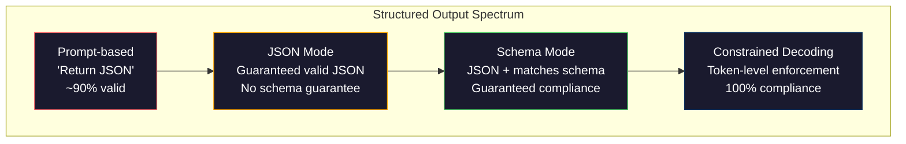
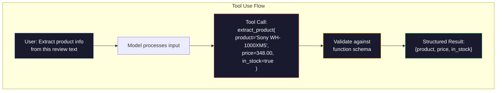

# Yapılandırılmış Çıkışlar: JSON, Şema Doğrulaması, Kısıtlı Kod Çözme

> LLMınız bir dize döndürür. Uygulamanızın JSON'a ihtiyacı var. Bu boşluk, herhangi bir model halüsinasyondan daha fazla üretim sistemini çökertti. Yapılandırılmış çıktı, doğal dil ile yazılı veriler arasındaki köprüdür. Doğru anladığınızda LLM'niz güvenilir bir API haline gelir. Yanlış anlayın ve serbest metni sabahın 3'ünde regex ile ayrıştırıyorsunuz.

**Tür:** Yapım
**Diller:** Python
**Önkoşullar:** Aşama 10, Dersler 01-05 (Sıfırdan LLM)
**Süre:** ~90 dakika
**İlgili:** Aşama 5 · 20 (Yapılandırılmış Çıkışlar ve Kısıtlı Kod Çözme), kod çözücü düzeyindeki teoriyi (FSM/CFG logit işlemciler, Ana Hatlar, XGrammar) kapsar. Bu ders üretim SDK yüzeyine odaklanır (OpenAI `response_format`, Anthropic araç kullanımı, Eğitmen) — API'nin altında neler olduğunu anlamak istiyorsanız önce Aşama 5 · 20'yi okuyun.

## Öğrenme Hedefleri

- OpenAI ve Anthropic API parametrelerini kullanarak JSON modunu ve şema kısıtlı çıktıları uygulayın
- Hatalı LLM çıktılarını reddeden ve hata geri bildirimiyle yeniden deneyen bir Pydantic doğrulama katmanı oluşturun
- Kısıtlı kod çözmenin, son işleme gerek kalmadan token düzeyinde geçerli JSON'u nasıl zorladığını açıklayın
- Yapılandırılmamış metni güvenilir bir şekilde yazılı veri yapılarına dönüştüren güçlü çıkarma prompt'lar tasarlayın

## Sorun

Bir LLM'ye şunu sorarsınız: "Bu metinden ürün adını, fiyatını ve stok durumunu çıkarın." Yanıt veriyor:

```
The product is the Sony WH-1000XM5 headphones, which cost $348.00 and are currently in stock.
```

Bu tamamen doğru bir cevap. Ayrıca uygulamanız için tamamen işe yaramaz. Envanter sisteminizin `{"product": "Sony WH-1000XM5", "price": 348.00, "in_stock": true}`'ye ihtiyacı var. Belirli anahtarlara, belirli türlere ve belirli değer kısıtlamalarına sahip bir JSON nesnesine ihtiyacınız vardır. Bir cümleye ihtiyacınız yok.

Saf çözüm: prompt dosyanıza "JSON'da Yanıt Ver" seçeneğini ekleyin. Bu, zamanın %90'ında işe yarar. Modelin diğer %10'u, JSON'u işaretleme kodu çitleri içine sarar veya "İşte JSON:" gibi bir başlangıç ​​ekler veya bir parantezi erken kapattığı için sözdizimsel olarak geçersiz JSON üretir. JSON ayrıştırıcınız çöküyor. Boru hattınız kopuyor. Try/hariç ve bir yeniden deneme döngüsü eklersiniz. Yeniden deneme bazen farklı veriler üretir. Artık ayrıştırma sorununun yanı sıra bir tutarlılık sorununuz var.

Bu bir prompt mühendislik sorunu değil. Bu bir kod çözme sorunudur. Model soldan sağa token'ler üretir. Her pozisyonda, 100.000'den fazla seçenekten oluşan bir kelime dağarcığı içinden en muhtemel sonraki token'yi seçer. Bu seçeneklerin çoğu, herhangi bir konumda geçersiz JSON üretecektir. Model az önce `{"price":` yayınlamışsa, sonraki token bir rakam, bir tırnak (string için), `null`, `true`, `false` veya bir negatif işaret olmalıdır. Bunun dışındaki her şey geçersiz JSON üretir. Kısıtlamalar olmadan, model, sözdizimsel olarak felaket derecede yanlış olan, son derece makul bir İngilizce kelimeyi seçebilir.

## Konsept

### Yapılandırılmış Çıkış Spektrumu

Her biri bir öncekinden daha güvenilir olan dört düzeyde yapılandırılmış çıktı kontrolü vardır.



**Prompt-tabanlı** ("Geçerli JSON'da yanıt ver"): yaptırım yok. Model genellikle uygundur ancak bazen uymaz. Güvenilirlik: ~%90. Başarısızlık modu: işaretleme çitleri, giriş metni, kesik çıktı, yanlış yapı.

**JSON modu**: API, çıktının geçerli JSON olduğunu garanti eder. OpenAI'nin `response_format: { type: "json_object" }` özelliği bunu sağlar. Çıktı hatasız olarak ayrıştırılacaktır. Ancak beklediğiniz şemayla eşleşmeyebilir; fazladan anahtarlar, yanlış türler, eksik alanlar.

**Şema modu**: API bir JSON Şeması alır ve çıktının onunla eşleştiğini garanti eder. 2026'da tüm büyük sağlayıcılar bunu yerel olarak desteklemektedir: OpenAI'nin `response_format: { type: "json_schema", json_schema: {...} }` (aynı zamanda `tool_choice="required"` olarak), Anthropic'in `input_schema` ile araç kullanımı ve Gemini'nin `response_schema` + `response_mime_type: "application/json"`. Çıktı tam olarak belirttiğiniz anahtarlara, türlere ve kısıtlamalara sahiptir.

**Kısıtlı kod çözme**: oluşturma sırasında her token konumunda, kod çözücü geçersiz çıktı üretecek tüm token'leri maskeler. Şema bir sayı gerektiriyorsa ve model bir harf yayınlamak üzereyse, bu token olasılığı sıfıra ayarlanır. Model yalnızca geçerli çıktıya yol açan token'ları üretebilir. OpenAI'nin yapılandırılmış çıktı modunun ve Outlines ve Guidance gibi kitaplıkların temelde uyguladığı şey budur.

### JSON Şeması: Sözleşme Dili

JSON Şeması, modele (veya doğrulama katmanına) çıktının hangi şekle sahip olması gerektiğini nasıl söylediğinizi gösterir. Her büyük yapılandırılmış çıktı sistemi bunu kullanır.

```json
{
  "type": "object",
  "properties": {
    "product": { "type": "string" },
    "price": { "type": "number", "minimum": 0 },
    "in_stock": { "type": "boolean" },
    "categories": {
      "type": "array",
      "items": { "type": "string" }
    }
  },
  "required": ["product", "price", "in_stock"]
}
```

Bu şema şunları söylüyor: çıktı, bir `product` dizisi, negatif olmayan bir sayı `price`, bir boolean `in_stock` ve isteğe bağlı bir `categories` dizisi içeren bir nesne olmalıdır. Eşleşmeyen herhangi bir çıktı reddedilir.

Şemalar zor durumları ele alır: iç içe geçmiş nesneler, yazılan öğeler içeren diziler, numaralandırmalar (bir dizeyi belirli değerlerle sınırlandırma), desen eşleştirme (dizelerde normal ifade) ve birleştiriciler (polimorfik çıktılar için oneOf, anyOf, allOf).

### Pydantik Desen

Python'da JSON Şemasını elle yazmazsınız. Bir Pydantic modeli tanımlarsınız ve o sizin için şemayı oluşturur.

```python
from pydantic import BaseModel

class Product(BaseModel):
    product: str
    price: float
    in_stock: bool
    categories: list[str] = []
```

Bu, yukarıdakiyle aynı JSON Şemasını üretir. Eğitmen kütüphanesi (ve OpenAI'nin SDK'sı) Pydantic modellerini doğrudan kabul eder: model sınıfını iletin, doğrulanmış bir örneği geri alın. LLM çıktısı eşleşmezse, Eğitmen otomatik olarak yeniden dener.

### İşlev Çağırma / Araç Kullanımı

Aynı sorun için alternatif bir arayüz. Modelden doğrudan JSON üretmesini istemek yerine, "araçları" (işlevleri) yazılan parametrelerle tanımlarsınız. Model, yapılandırılmış argümanlara sahip bir function callingnın çıktısını verir. OpenAI buna "function calling" diyor. Anthropic buna "araç kullanımı" diyor. Sonuç aynı: yapılandırılmış veri.



Modelin yalnızca parametreleri doldurmak değil, hangi işlevi çağıracağını seçmesi gerektiğinde araç kullanımı tercih edilir. 10 farklı çıkarma şemanız varsa ve modelin girdiye göre doğru olanı seçmesi gerekiyorsa, araç kullanımı size hem şema seçimini hem de yapılandırılmış çıktıyı verir.

### Yaygın Arıza Modları

Şema uygulamasıyla bile yapılandırılmış çıktılar, incelikli şekillerde başarısız olabilir.

**Halüsinasyonlu değerler**: Çıktı şemayla eşleşiyor ancak icat edilmiş veriler içeriyor. Metinde 348 $ yazıldığında model `{"price": 299.99}` üretir. Şema doğrulaması bunu yakalayamıyor; tür doğru, değer yanlış.

**Enum karışıklığı**: bir alanı `["in_stock", "out_of_stock", "preorder"]` ile sınırlandırırsınız. Model, `"available"` çıktısını veriyor -- anlamsal olarak doğru, ancak izin verilen kümede değil. İyi kısıtlı kod çözme bunu önler. Prompt tabanlı yaklaşımlar bunu yapmaz.

**İç içe geçmiş nesne derinliği**: Derinlemesine iç içe geçmiş şemalar (4+ düzey) daha fazla hata üretir. Her yuvalama düzeyi, modelin yapı izini kaybedebileceği başka bir yerdir.

**Dizi uzunluğu**: Model, bir dizide çok fazla veya çok az öğe üretebilir. Şemalar `minItems` ve `maxItems`'yi destekler ancak tüm sağlayıcılar bunları kod çözme düzeyinde zorunlu kılmaz.

**İsteğe bağlı alan çıkarma**: Model, teknik olarak isteğe bağlı ancak kullanım durumunuz için anlamsal olarak önemli olan alanları hariç tutar. Veriler bazen eksik olsa bile bunları şemada gerektiği gibi ayarlayın; modeli açıkça `null` üretmeye zorlayın.

## İnşa Et

### Adım 1: JSON Şema Doğrulayıcı

Bir Python nesnesinin JSON Şeması ile eşleşip eşleşmediğini kontrol eden sıfırdan bir doğrulayıcı oluşturun. Uyumluluğu doğrulamak için çıkış tarafında çalışan şey budur.

```python
import json

def validate_schema(data, schema):
    errors = []
    _validate(data, schema, "", errors)
    return errors

def _validate(data, schema, path, errors):
    schema_type = schema.get("type")

    if schema_type == "object":
        if not isinstance(data, dict):
            errors.append(f"{path}: expected object, got {type(data).__name__}")
            return
        for key in schema.get("required", []):
            if key not in data:
                errors.append(f"{path}.{key}: required field missing")
        properties = schema.get("properties", {})
        for key, value in data.items():
            if key in properties:
                _validate(value, properties[key], f"{path}.{key}", errors)

    elif schema_type == "array":
        if not isinstance(data, list):
            errors.append(f"{path}: expected array, got {type(data).__name__}")
            return
        min_items = schema.get("minItems", 0)
        max_items = schema.get("maxItems", float("inf"))
        if len(data) < min_items:
            errors.append(f"{path}: array has {len(data)} items, minimum is {min_items}")
        if len(data) > max_items:
            errors.append(f"{path}: array has {len(data)} items, maximum is {max_items}")
        items_schema = schema.get("items", {})
        for i, item in enumerate(data):
            _validate(item, items_schema, f"{path}[{i}]", errors)

    elif schema_type == "string":
        if not isinstance(data, str):
            errors.append(f"{path}: expected string, got {type(data).__name__}")
            return
        enum_values = schema.get("enum")
        if enum_values and data not in enum_values:
            errors.append(f"{path}: '{data}' not in allowed values {enum_values}")

    elif schema_type == "number":
        if not isinstance(data, (int, float)):
            errors.append(f"{path}: expected number, got {type(data).__name__}")
            return
        minimum = schema.get("minimum")
        maximum = schema.get("maximum")
        if minimum is not None and data < minimum:
            errors.append(f"{path}: {data} is less than minimum {minimum}")
        if maximum is not None and data > maximum:
            errors.append(f"{path}: {data} is greater than maximum {maximum}")

    elif schema_type == "boolean":
        if not isinstance(data, bool):
            errors.append(f"{path}: expected boolean, got {type(data).__name__}")

    elif schema_type == "integer":
        if not isinstance(data, int) or isinstance(data, bool):
            errors.append(f"{path}: expected integer, got {type(data).__name__}")
```

### Adım 2: Şemaya Pydantic Stili Model

Minimal düzeyde bir sınıftan şemaya dönüştürücü oluşturun. Bir Python sınıfı tanımlayın ve JSON Şemasını otomatik olarak oluşturun.

```python
class SchemaField:
    def __init__(self, field_type, required=True, default=None, enum=None, minimum=None, maximum=None):
        self.field_type = field_type
        self.required = required
        self.default = default
        self.enum = enum
        self.minimum = minimum
        self.maximum = maximum

def python_type_to_schema(field):
    type_map = {
        str: "string",
        int: "integer",
        float: "number",
        bool: "boolean",
    }

    schema = {}

    if field.field_type in type_map:
        schema["type"] = type_map[field.field_type]
    elif field.field_type == list:
        schema["type"] = "array"
        schema["items"] = {"type": "string"}
    elif isinstance(field.field_type, dict):
        schema = field.field_type

    if field.enum:
        schema["enum"] = field.enum
    if field.minimum is not None:
        schema["minimum"] = field.minimum
    if field.maximum is not None:
        schema["maximum"] = field.maximum

    return schema

def model_to_schema(name, fields):
    properties = {}
    required = []

    for field_name, field in fields.items():
        properties[field_name] = python_type_to_schema(field)
        if field.required:
            required.append(field_name)

    return {
        "type": "object",
        "properties": properties,
        "required": required,
    }
```

### Adım 3: Kısıtlanmış Token Filtresi

Kısıtlı kod çözmeyi simüle edin. Kısmi bir JSON dizesi ve bir şema verildiğinde, geçerli konumda hangi token kategorisinin geçerli olduğunu belirleyin.

```python
def next_valid_tokens(partial_json, schema):
    stripped = partial_json.strip()

    if not stripped:
        return ["{"]

    try:
        json.loads(stripped)
        return ["<EOS>"]
    except json.JSONDecodeError:
        pass

    last_char = stripped[-1] if stripped else ""

    if last_char == "{":
        return ['"', "}"]
    elif last_char == '"':
        if stripped.endswith('":'):
            return ['"', "0-9", "true", "false", "null", "[", "{"]
        return ["a-z", '"']
    elif last_char == ":":
        return [" ", '"', "0-9", "true", "false", "null", "[", "{"]
    elif last_char == ",":
        return [" ", '"', "{", "["]
    elif last_char in "0123456789":
        return ["0-9", ".", ",", "}", "]"]
    elif last_char == "}":
        return [",", "}", "]", "<EOS>"]
    elif last_char == "]":
        return [",", "}", "<EOS>"]
    elif last_char == "[":
        return ['"', "0-9", "true", "false", "null", "{", "[", "]"]
    else:
        return ["any"]

def demonstrate_constrained_decoding():
    partial_states = [
        '',
        '{',
        '{"product"',
        '{"product":',
        '{"product": "Sony"',
        '{"product": "Sony",',
        '{"product": "Sony", "price":',
        '{"product": "Sony", "price": 348',
        '{"product": "Sony", "price": 348}',
    ]

    print(f"{'Partial JSON':<45} {'Valid Next Tokens'}")
    print("-" * 80)
    for state in partial_states:
        valid = next_valid_tokens(state, {})
        display = state if state else "(empty)"
        print(f"{display:<45} {valid}")
```

### Adım 4: Çıkarma Boru Hattı

Her şeyi bir çıkarma hattında birleştirin: bir şema tanımlayın, yapılandırılmış çıktı üreten bir LLM'yi simüle edin, çıktıyı doğrulayın ve yeniden denemeleri gerçekleştirin.

```python
def simulate_llm_extraction(text, schema, attempt=0):
    if "headphones" in text.lower() or "sony" in text.lower():
        if attempt == 0:
            return '{"product": "Sony WH-1000XM5", "price": 348.00, "in_stock": true, "categories": ["audio", "headphones"]}'
        return '{"product": "Sony WH-1000XM5", "price": 348.00, "in_stock": true}'

    if "laptop" in text.lower():
        return '{"product": "MacBook Pro 16", "price": 2499.00, "in_stock": false, "categories": ["computers"]}'

    return '{"product": "Unknown", "price": 0, "in_stock": false}'

def extract_with_retry(text, schema, max_retries=3):
    for attempt in range(max_retries):
        raw = simulate_llm_extraction(text, schema, attempt)

        try:
            data = json.loads(raw)
        except json.JSONDecodeError as e:
            print(f"  Attempt {attempt + 1}: JSON parse error -- {e}")
            continue

        errors = validate_schema(data, schema)
        if not errors:
            return data

        print(f"  Attempt {attempt + 1}: Schema validation errors -- {errors}")

    return None

product_schema = {
    "type": "object",
    "properties": {
        "product": {"type": "string"},
        "price": {"type": "number", "minimum": 0},
        "in_stock": {"type": "boolean"},
        "categories": {"type": "array", "items": {"type": "string"}},
    },
    "required": ["product", "price", "in_stock"],
}
```

### Adım 5: Tüm İşlem Hattını Çalıştırın

```python
def run_demo():
    print("=" * 60)
    print("  Structured Output Pipeline Demo")
    print("=" * 60)

    print("\n--- Schema Definition ---")
    product_fields = {
        "product": SchemaField(str),
        "price": SchemaField(float, minimum=0),
        "in_stock": SchemaField(bool),
        "categories": SchemaField(list, required=False),
    }
    generated_schema = model_to_schema("Product", product_fields)
    print(json.dumps(generated_schema, indent=2))

    print("\n--- Schema Validation ---")
    test_cases = [
        ({"product": "Test", "price": 10.0, "in_stock": True}, "Valid object"),
        ({"product": "Test", "price": -5.0, "in_stock": True}, "Negative price"),
        ({"product": "Test", "in_stock": True}, "Missing price"),
        ({"product": "Test", "price": "ten", "in_stock": True}, "String as price"),
        ("not an object", "String instead of object"),
    ]

    for data, label in test_cases:
        errors = validate_schema(data, product_schema)
        status = "PASS" if not errors else f"FAIL: {errors}"
        print(f"  {label}: {status}")

    print("\n--- Constrained Decoding Simulation ---")
    demonstrate_constrained_decoding()

    print("\n--- Extraction Pipeline ---")
    texts = [
        "The Sony WH-1000XM5 headphones are priced at $348 and currently available.",
        "The new MacBook Pro 16-inch laptop costs $2499 but is sold out.",
        "This is a random sentence with no product info.",
    ]

    for text in texts:
        print(f"\n  Input: {text[:60]}...")
        result = extract_with_retry(text, product_schema)
        if result:
            print(f"  Output: {json.dumps(result)}")
        else:
            print(f"  Output: FAILED after retries")
```

## Kullan onu

### OpenAI Yapılandırılmış Çıktılar

```python
# from openai import OpenAI
# from pydantic import BaseModel
#
# client = OpenAI()
#
# class Product(BaseModel):
#     product: str
#     price: float
#     in_stock: bool
#
# response = client.beta.chat.completions.parse(
#     model="gpt-5-mini",
#     messages=[
#         {"role": "system", "content": "Extract product information."},
#         {"role": "user", "content": "Sony WH-1000XM5, $348, in stock"},
#     ],
#     response_format=Product,
# )
#
# product = response.choices[0].message.parsed
# print(product.product, product.price, product.in_stock)
```

OpenAI'nin yapılandırılmış çıktı modu dahili olarak kısıtlı kod çözmeyi kullanır. Modelin ürettiği her token'nin Pydantic şemasıyla eşleşen çıktı üretmesi garanti edilir. Yeniden denemeye gerek yok. Doğrulama gerekmez. Kısıtlama kod çözme sürecine dahil edilir.

### Anthropic Araç Kullanımı

```python
# import anthropic
#
# client = anthropic.Anthropic()
#
# response = client.messages.create(
#     model="claude-opus-4-7",
#     max_tokens=1024,
#     tools=[{
#         "name": "extract_product",
#         "description": "Extract product information from text",
#         "input_schema": {
#             "type": "object",
#             "properties": {
#                 "product": {"type": "string"},
#                 "price": {"type": "number"},
#                 "in_stock": {"type": "boolean"},
#             },
#             "required": ["product", "price", "in_stock"],
#         },
#     }],
#     messages=[{"role": "user", "content": "Extract: Sony WH-1000XM5, $348, in stock"}],
# )
```

Anthropic, araç kullanımı yoluyla yapılandırılmış çıktı elde eder. Model, giriş_şeması ile eşleşen yapılandırılmış argümanlara sahip bir araç çağrısı yayar. Aynı sonuç, farklı API yüzeyi.

### Eğitmen Kitaplığı

```python
# pip install instructor
# import instructor
# from openai import OpenAI
# from pydantic import BaseModel
#
# client = instructor.from_openai(OpenAI())
#
# class Product(BaseModel):
#     product: str
#     price: float
#     in_stock: bool
#
# product = client.chat.completions.create(
#     model="gpt-5-mini",
#     response_model=Product,
#     messages=[{"role": "user", "content": "Sony WH-1000XM5, $348, in stock"}],
# )
```

Eğitmen herhangi bir LLM istemcisini sarar ve doğrulamayla birlikte otomatik yeniden denemeler ekler. İlk denemede doğrulama başarısız olursa, hataları modele bağlam olarak geri gönderir ve çıktıyı düzeltmesini ister. Bu yalnızca OpenAI ile değil, tüm sağlayıcılarla çalışır.

## Gönderin

Bu ders, şema tanımı verilen herhangi bir metinden yapılandırılmış verileri çıkaran yeniden kullanılabilir bir prompt şablonu olan `outputs/prompt-structured-extractor.md`'ı üretir. Ona bir JSON Şeması ve yapılandırılmamış metin besleyin; doğrulanmış JSON döndürecektir.

Aynı zamanda sağlayıcınıza, güvenilirlik gereksinimlerine ve şema karmaşıklığına bağlı olarak doğru yapılandırılmış çıktı stratejisini seçmek için bir karar olan `outputs/skill-structured-outputs.md` - bir framework üretir.

## Egzersizler

1. Şema doğrulayıcıyı `oneOf`'yı destekleyecek şekilde genişletin (veriler birkaç şemadan tam olarak biriyle eşleşmelidir). Bu, polimorfik çıktıları yönetir; örneğin, farklı şekillere sahip bir `Product` veya bir `Service` nesnesi olabilen bir alan.

2. İki şemayı karşılaştıran ve bozulan değişiklikleri (kaldırılan gerekli alanlar, değiştirilen türler) ve kesilmeyen değişiklikleri (eklenen isteğe bağlı alanlar, gevşetilmiş kısıtlamalar) tanımlayan bir "şema farkı" aracı oluşturun. Bu, üretimdeki çıkarma şemalarınızı sürümlendirmek için gereklidir.

3. Daha gerçekçi, kısıtlı bir kod çözme simülatörü uygulayın. Bir JSON Şeması ve 100 token'lik bir kelime dağarcığı (harfler, rakamlar, noktalama işaretleri, anahtar kelimeler) verildiğinde, her konumdaki geçersiz token'leri maskeleyerek nesil boyunca adım adım ilerleyin. Her adımda kelime dağarcığının yüzde kaçının geçerli olduğunu ölçün.

4. Bir çıkarma değerlendirme paketi oluşturun. Elle etiketlenmiş JSON çıktılarıyla 50 ürün açıklaması oluşturun. Çıkarma işlem hattınızı 50'nin tamamında çalıştırın ve tam eşleşmeyi, alan düzeyinde doğruluğu ve tür uyumluluğunu ölçün. Hangi alanların doğru şekilde çıkarılmasının en zor olduğunu belirleyin.

5. Çıkarma hattınıza "güven puanları" ekleyin. Çıkarılan her alan için modelin ne kadar güvenilir olduğunu tahmin edin (token olasılıklara dayanarak veya çıkarma işlemini 3 kez çalıştırıp tutarlılığı ölçerek). Güvenilirliği düşük alanları gerçek kişilerin incelemesi için işaretleyin.

## Anahtar Terimler

| Dönem | İnsanlar ne diyor | Aslında ne anlama geliyor |
|------|----------------|----------------------|
| JSON modu | "JSON'u döndürür" | Sözdizimsel olarak geçerli JSON çıktısını garanti eden ancak belirli bir şemayı uygulamayan API bayrağı |
| Yapılandırılmış çıktı | "JSON yazıldı" | Belirli bir JSON Şeması ile doğru anahtarlar, türler ve kısıtlamalarla eşleşen çıktı |
| Kısıtlı kod çözme | "Kılavuzlu nesil" | Her token konumunda, geçersiz çıktı üretecek token'leri maskeleyin -- %100 şema uyumluluğunu garanti eder |
| JSON Şeması | "Bir JSON şablonu" | JSON verilerinin yapısını, türlerini ve kısıtlamalarını açıklamaya yönelik bildirimsel bir dil (OpenAPI, JSON Forms vb. tarafından kullanılır) |
| Pdantik | "Python veri sınıfları+" | JSON Şemaları oluşturmak için FastAPI ve Eğitmen tarafından kullanılan, tür doğrulamalı veri modellerini tanımlayan Python kitaplığı |
| Function calling | "Araç kullanımı" | LLM, serbest metin yerine yapılandırılmış bir function calling (isim + yazılan argümanlar) üretir - OpenAI ve Anthropic'in ikisi de bunu destekler |
| eğitmen | "LLM'ler için Pydantic" | Doğrulama hatası durumunda otomatik yeniden denemeyle, doğrulanmış Pydantic örneklerini döndürmek için LLM istemcilerini saran Python kitaplığı |
| Token maskeleme | "Kelimelerin filtrelenmesi" | Modelin bunları üretememesi için belirli token olasılıklarının üretim sırasında sıfıra ayarlanması |
| Şema uyumluluğu | "Şekliyle eşleşiyor" | Çıktıda gerekli tüm alanlar, doğru türler, kısıtlamalar dahilinde değerler bulunur ve izin verilmeyen fazladan alan yoktur |
| Döngüyü yeniden dene | "Çalışana kadar tekrar deneyin" | Doğrulama hatalarını modele geri gönderin ve çıktıyı düzeltmesini isteyin - Eğitmen bunu yapılandırılabilir maksimum |

## Daha Fazla Okuma

- [OpenAI Yapılandırılmış Çıktılar Kılavuzu](https://platform.openai.com/docs/guides/structured-outputs) -- OpenAI API'sinde JSON Şeması tabanlı kısıtlı kod çözme için resmi belgeler
- [Willard ve Louf, 2023 -- "Efficient Guided Generation for Large Language Models"](https://arxiv.org/abs/2307.09702) -- JSON Şemalarının token düzeyindeki kısıtlamalar için sonlu durum makinelerine nasıl derleneceğini açıklayan Outlines makalesi
- [Eğitmen belgeleri](https://python.useinstructor.com/) -- Pydantic doğrulaması ve yeniden denemeleri olan herhangi bir LLM'den yapılandırılmış çıktılar almak için standart kitaplık
- [Anthropic Araç Kullanım Kılavuzu](https://docs.anthropic.com/en/docs/tool-use) -- Claude, JSON Şeması input_schema ile araç kullanımı yoluyla yapılandırılmış çıktıyı nasıl uygular?
- [JSON Şema spesifikasyonu](https://json-schema.org/) -- her büyük yapısal çıktı sistemi tarafından kullanılan şema dilinin tam spesifikasyonu
- [Outlines kitaplığı](https://github.com/outlines-dev/outlines) -- sonlu durum makinelerine derlenmiş normal ifade ve JSON Şeması kullanan açık kaynaklı kısıtlı oluşturma
- [Dong ve diğerleri, "XGrammar: Büyük Dil Modelleri için Esnek ve Verimli Yapılandırılmış Üretim Motoru" (MLSys 2025)](https://arxiv.org/abs/2411.15100) -- mevcut en gelişmiş dilbilgisi motoru; ~100 ns / token'de token'leri maskeleyen aşağı açılan otomat derlemesi.
- [Beurer-Kellner ve diğerleri, "PromptProgramlamadır: Büyük Dil Modelleri için Bir Sorgu Dili" (LMQL)](https://arxiv.org/abs/2212.06094) -- LMQL kağıt çerçevelemesi, kod çözmeyi tür ve değer kısıtlamalarıyla bir sorgu dili olarak kısıtladı.
- [Microsoft Rehberliği (framework docs)](https://github.com/guidance-ai/guidance) -- şablona dayalı kısıtlı oluşturma; Outlines ve XGrammar'ın satıcıdan bağımsız tamamlayıcısı.
