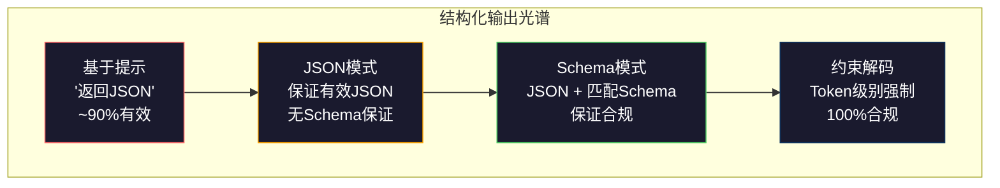
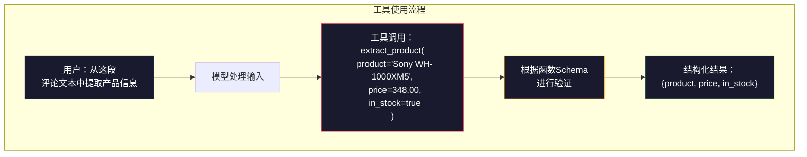

# 结构化输出：JSON、Schema验证、约束解码

> 你的大语言模型返回一个字符串，而你的应用程序需要JSON。这个鸿沟导致的线上系统崩溃比任何模型幻觉都要多。结构化输出是连接自然语言与类型化数据的桥梁。掌握它，你的LLM就能成为可靠的API；搞砸了，你就会在凌晨三点用正则表达式解析自由文本。

**类型：** 构建
**编程语言：** Python
**前置条件：** 第10阶段，第01-05课（从零实现LLM）
**时长：** 约90分钟
**相关：** 第5阶段·20课（结构化输出与约束解码）涵盖了解码器层面的理论（FSM/CFG logit处理器、Outlines、XGrammar）。本课聚焦于生产级SDK表面（OpenAI `response_format`、Anthropic工具使用、Instructor）——如果你想知道API底层发生了什么，请先阅读第5阶段·20课。

## 学习目标

- 使用OpenAI和Anthropic API参数实现JSON模式和Schema约束输出
- 构建一个Pydantic验证层，拒绝格式错误的LLM输出，并附带错误反馈进行重试
- 解释约束解码如何在token级别强制生成有效JSON，无需后处理
- 设计健壮的提取提示，将非结构化文本可靠地转换为类型化数据结构

## 问题

你让LLM："从这段文本中提取产品名称、价格和库存情况。" 它回复：

```
这是索尼WH-1000XM5耳机，价格$348.00，目前有货。
```

这是一个完全正确的答案。但对你的应用程序来说毫无用处。你的库存系统需要 `{"product": "Sony WH-1000XM5", "price": 348.00, "in_stock": true}`。你需要一个具有特定键、特定类型和特定值约束的JSON对象。你不需要一个句子。

天真的解决方案：在提示中添加"以JSON格式回复"。这在90%的情况下有效。其余10%的情况，模型将JSON包裹在Markdown代码块中，或者添加类似"这是JSON："的前言，或者因为提前关闭括号而产生语法上无效的JSON。你的JSON解析器崩溃，流程中断。你添加try/except和重试循环。重试有时会产生不同的数据。现在你在解析问题之上又有了一致性问题。

这不是一个提示工程问题，而是一个解码问题。模型从左到右生成token。在每个位置，它从超过10万个选项的词汇表中挑选最可能的下一个token。这些选项中的大多数在任何给定位置都会产生无效的JSON。如果模型刚刚输出了`{"price":`，下一个token必须是数字、引号（用于字符串）、`null`、`true`、`false`或负号。其他任何内容都会产生无效的JSON。在没有约束的情况下，模型可能会选择一个完全合理的英文单词，但语法上却是灾难性的错误。

## 概念

### 结构化输出光谱

结构化输出控制有四个层级，每个层级都比前一个更可靠。



**基于提示**（"以有效JSON格式回复"）：无强制。模型通常遵守，但有时不遵守。可靠性：~90%。失败模式：Markdown代码块、前言文本、截断输出、错误结构。

**JSON模式**：API保证输出是有效JSON。OpenAI的 `response_format: { type: "json_object" }` 启用此模式。输出将无错误地解析。但它可能不符合你期望的Schema——多余的键、错误的类型、缺失的字段。

**Schema模式**：API接受一个JSON Schema，并保证输出与之匹配。到2026年，每个主要提供商都原生支持此功能：OpenAI的 `response_format: { type: "json_schema", json_schema: {...} }`（也可作为 `tool_choice="required"`），Anthropic的带 `input_schema` 的工具使用，以及Gemini的 `response_schema` + `response_mime_type: "application/json"`。输出具有你指定的确切键、类型和约束。

**约束解码**：在生成过程的每个token位置，解码器屏蔽所有会导致无效输出的token。如果Schema要求一个数字，而模型即将输出了一个字母，则该token的概率被设置为零。模型只能产生能导向有效输出的token。这就是OpenAI的结构化输出模式以及像Outlines和Guidance这样的库在底层实现的方式。

### JSON Schema：契约语言

JSON Schema是你告诉模型（或验证层）输出必须具有什么形状的方式。每个主要的结构化输出系统都使用它。

```json
{
  "type": "object",
  "properties": {
    "product": { "type": "string" },
    "price": { "type": "number", "minimum": 0 },
    "in_stock": { "type": "boolean" },
    "categories": {
      "type": "array",
      "items": { "type": "string" }
    }
  },
  "required": ["product", "price", "in_stock"]
}
```

这个Schema说明：输出必须是一个对象，包含字符串 `product`、非负数字 `price`、布尔值 `in_stock`，以及一个可选的字符串数组 `categories`。任何不匹配的输出都会被拒绝。

Schema处理复杂情况：嵌套对象、带类型项（typed items）的数组、枚举（enums，将字符串约束为特定值）、模式匹配（正则表达式对字符串）以及组合器（oneOf、anyOf、allOf，用于多态输出）。

### Pydantic模式

在Python中，你不需要手动编写JSON Schema。你定义一个Pydantic模型，它会自动为你生成Schema。

```python
from pydantic import BaseModel

class Product(BaseModel):
    product: str
    price: float
    in_stock: bool
    categories: list[str] = []
```

这将产生与上面相同的JSON Schema。Instructor库（以及OpenAI的SDK）直接接受Pydantic模型：传入模型类，返回一个经过验证的实例。如果LLM输出不匹配，Instructor会自动重试。

### 函数调用 / 工具使用

同一个问题的另一种接口。你不直接要求模型产生JSON，而是定义带有类型化参数的"工具"（函数）。模型输出一个带有结构化参数的函数调用。OpenAI称此为"函数调用（Function calling）"。Anthropic称此为"工具使用（Tool use）"。结果相同：结构化数据。



当模型需要选择调用哪个函数，而不仅仅是填充参数时，工具使用是首选。如果你有10个不同的提取Schema，而模型必须根据输入选择正确的那个，那么工具使用同时提供了Schema选择与结构化输出。

### 常见失败模式

即使有Schema强制，结构化输出也可能以微妙的方式失败。

**幻觉值**：输出匹配Schema但包含编造的数据。模型产生 `{"price": 299.99}`，而文本说的是$348。Schema验证无法捕捉此问题——类型正确，值错误。

**枚举混淆**：你将字段约束为 `["in_stock", "out_of_stock", "preorder"]`。模型输出 `"available"`——语义上正确，但不在允许集合内。良好的约束解码可以防止这种情况。基于提示的方法不行。

**嵌套对象深度**：深度嵌套的Schema（4层以上）会产生更多错误。每一层嵌套都是模型可能丢失结构轨迹的地方。

**数组长度**：模型可能产生太多或太少数组项。Schema支持 `minItems` 和 `maxItems`，但并非所有提供商都在解码层面强制它们。

**可选字段遗漏**：模型遗漏在技术上可选但语义上对你的用例很重要的字段。在Schema中将它们设为required，即使数据有时缺失——强制模型明确产生 `null`。

## 构建

### 步骤1：JSON Schema验证器

从头构建一个验证器，检查Python对象是否匹配JSON Schema。这是在输出端运行以验证合规性的。

```python
import json

def validate_schema(data, schema):
    errors = []
    _validate(data, schema, "", errors)
    return errors

def _validate(data, schema, path, errors):
    schema_type = schema.get("type")

    if schema_type == "object":
        if not isinstance(data, dict):
            errors.append(f"{path}: 期望对象，实际为 {type(data).__name__}")
            return
        for key in schema.get("required", []):
            if key not in data:
                errors.append(f"{path}.{key}: 缺少必填字段")
        properties = schema.get("properties", {})
        for key, value in data.items():
            if key in properties:
                _validate(value, properties[key], f"{path}.{key}", errors)

    elif schema_type == "array":
        if not isinstance(data, list):
            errors.append(f"{path}: 期望数组，实际为 {type(data).__name__}")
            return
        min_items = schema.get("minItems", 0)
        max_items = schema.get("maxItems", float("inf"))
        if len(data) < min_items:
            errors.append(f"{path}: 数组有 {len(data)} 项，最小值为 {min_items}")
        if len(data) > max_items:
            errors.append(f"{path}: 数组有 {len(data)} 项，最大值为 {max_items}")
        items_schema = schema.get("items", {})
        for i, item in enumerate(data):
            _validate(item, items_schema, f"{path}[{i}]", errors)

    elif schema_type == "string":
        if not isinstance(data, str):
            errors.append(f"{path}: 期望字符串，实际为 {type(data).__name__}")
            return
        enum_values = schema.get("enum")
        if enum_values and data not in enum_values:
            errors.append(f"{path}: '{data}' 不在允许值 {enum_values} 中")

    elif schema_type == "number":
        if not isinstance(data, (int, float)):
            errors.append(f"{path}: 期望数字，实际为 {type(data).__name__}")
            return
        minimum = schema.get("minimum")
        maximum = schema.get("maximum")
        if minimum is not None and data < minimum:
            errors.append(f"{path}: {data} 小于最小值 {minimum}")
        if maximum is not None and data > maximum:
            errors.append(f"{path}: {data} 大于最大值 {maximum}")

    elif schema_type == "boolean":
        if not isinstance(data, bool):
            errors.append(f"{path}: 期望布尔值，实际为 {type(data).__name__}")

    elif schema_type == "integer":
        if not isinstance(data, int) or isinstance(data, bool):
            errors.append(f"{path}: 期望整数，实际为 {type(data).__name__}")
```

### 步骤2：Pydantic风格模型转Schema

构建一个最小的类到Schema转换器。定义一个Python类，自动生成其JSON Schema。

```python
class SchemaField:
    def __init__(self, field_type, required=True, default=None, enum=None, minimum=None, maximum=None):
        self.field_type = field_type
        self.required = required
        self.default = default
        self.enum = enum
        self.minimum = minimum
        self.maximum = maximum

def python_type_to_schema(field):
    type_map = {
        str: "string",
        int: "integer",
        float: "number",
        bool: "boolean",
    }

    schema = {}

    if field.field_type in type_map:
        schema["type"] = type_map[field.field_type]
    elif field.field_type == list:
        schema["type"] = "array"
        schema["items"] = {"type": "string"}
    elif isinstance(field.field_type, dict):
        schema = field.field_type

    if field.enum:
        schema["enum"] = field.enum
    if field.minimum is not None:
        schema["minimum"] = field.minimum
    if field.maximum is not None:
        schema["maximum"] = field.maximum

    return schema

def model_to_schema(name, fields):
    properties = {}
    required = []

    for field_name, field in fields.items():
        properties[field_name] = python_type_to_schema(field)
        if field.required:
            required.append(field_name)

    return {
        "type": "object",
        "properties": properties,
        "required": required,
    }
```

### 步骤3：约束Token过滤器

模拟约束解码。给定一个部分JSON字符串和一个Schema，确定在当前位置哪些token类别是有效的。

```python
def next_valid_tokens(partial_json, schema):
    stripped = partial_json.strip()

    if not stripped:
        return ["{"]

    try:
        json.loads(stripped)
        return ["<EOS>"]
    except json.JSONDecodeError:
        pass

    last_char = stripped[-1] if stripped else ""

    if last_char == "{":
        return ['"', "}"]
    elif last_char == '"':
        if stripped.endswith('":'):
            return ['"', "0-9", "true", "false", "null", "[", "{"]
        return ["a-z", '"']
    elif last_char == ":":
        return [" ", '"', "0-9", "true", "false", "null", "[", "{"]
    elif last_char == ",":
        return [" ", '"', "{", "["]
    elif last_char in "0123456789":
        return ["0-9", ".", ",", "}", "]"]
    elif last_char == "}":
        return [",", "}", "]", "<EOS>"]
    elif last_char == "]":
        return [",", "}", "<EOS>"]
    elif last_char == "[":
        return ['"', "0-9", "true", "false", "null", "{", "[", "]"]
    else:
        return ["any"]

def demonstrate_constrained_decoding():
    partial_states = [
        '',
        '{',
        '{"product"',
        '{"product":',
        '{"product": "Sony"',
        '{"product": "Sony",',
        '{"product": "Sony", "price":',
        '{"product": "Sony", "price": 348',
        '{"product": "Sony", "price": 348}',
    ]

    print(f"{'部分JSON':<45} {'有效下一个Token'}")
    print("-" * 80)
    for state in partial_states:
        valid = next_valid_tokens(state, {})
        display = state if state else "(空)"
        print(f"{display:<45} {valid}")
```

### 步骤4：提取流水线

将一切组合成一个提取流水线：定义Schema，模拟LLM产生结构化输出，验证输出，并处理重试。

```python
def simulate_llm_extraction(text, schema, attempt=0):
    if "headphones" in text.lower() or "sony" in text.lower():
        if attempt == 0:
            return '{"product": "Sony WH-1000XM5", "price": 348.00, "in_stock": true, "categories": ["audio", "headphones"]}'
        return '{"product": "Sony WH-1000XM5", "price": 348.00, "in_stock": true}'

    if "laptop" in text.lower():
        return '{"product": "MacBook Pro 16", "price": 2499.00, "in_stock": false, "categories": ["computers"]}'

    return '{"product": "Unknown", "price": 0, "in_stock": false}'

def extract_with_retry(text, schema, max_retries=3):
    for attempt in range(max_retries):
        raw = simulate_llm_extraction(text, schema, attempt)

        try:
            data = json.loads(raw)
        except json.JSONDecodeError as e:
            print(f"  尝试 {attempt + 1}: JSON解析错误 -- {e}")
            continue

        errors = validate_schema(data, schema)
        if not errors:
            return data

        print(f"  尝试 {attempt + 1}: Schema验证错误 -- {errors}")

    return None

product_schema = {
    "type": "object",
    "properties": {
        "product": {"type": "string"},
        "price": {"type": "number", "minimum": 0},
        "in_stock": {"type": "boolean"},
        "categories": {"type": "array", "items": {"type": "string"}},
    },
    "required": ["