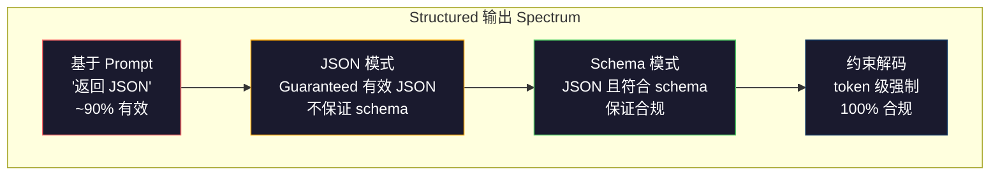
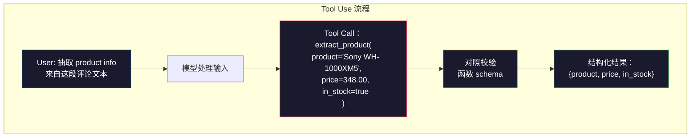

# 结构化输出：JSON、Schema 校验与受约束解码（Structured Outputs: JSON, Schema Validation, Constrained Decoding）

> 译注：本文译自同目录 [`en.md`](./en.md)。术语遵循仓根 [TRANSLATION_GUIDE.md](../../../../TRANSLATION_GUIDE.md)。

> 你的 LLM 返回的是字符串，而你的应用需要的是 JSON。这条鸿沟在生产环境里搞挂的系统，比模型 hallucination（幻觉）加起来都多。结构化输出，就是连接自然语言与有类型数据的桥梁。做对了，LLM 就是一个可靠的 API；做错了，你就得在凌晨三点用正则解析自由文本。

**Type:** Build
**Languages:** Python
**Prerequisites:** Phase 10, Lessons 01-05 (LLMs from Scratch)
**Time:** ~90 minutes
**Related:** Phase 5 · 20（Structured Outputs & Constrained Decoding）讲了解码层的理论（FSM/CFG logit processors、Outlines、XGrammar）。本课聚焦在生产环境里实际用到的 SDK 表面（OpenAI 的 `response_format`、Anthropic 的 tool use、Instructor）——如果你想搞清楚 API 之下到底发生了什么，请先读 Phase 5 · 20。

## 学习目标（Learning Objectives）

- 用 OpenAI 与 Anthropic 的 API 参数实现 JSON 模式与 schema 受约束输出
- 构建一个 Pydantic 校验层，拒收格式错误的 LLM 输出，并带错误反馈重试
- 解释受约束解码如何在 token 层面强制生成合法 JSON，而无需后处理
- 设计稳健的抽取 prompt，把非结构化文本可靠地转成有类型的数据结构

## 问题（The Problem）

你问 LLM：「从这段文字里提取产品名、价格和库存状态」。它回你：

```
The product is the Sony WH-1000XM5 headphones, which cost $348.00 and are currently in stock.
```

这个回答完全正确，也完全没法用。你的库存系统要的是 `{"product": "Sony WH-1000XM5", "price": 348.00, "in_stock": true}`——一个有特定键、特定类型、特定值约束的 JSON 对象，而不是一句话。

最朴素的解法：在 prompt 里加一句「Respond in JSON」。这招有 90% 的成功率。剩下 10% 里，模型会把 JSON 包进 markdown 代码块、加上「Here's the JSON:」之类的开场白、或者过早闭合括号产生语法上无效的 JSON。你的 JSON 解析器崩了，流水线断了。你加了 try/except 和重试循环。重试有时返回不一样的数据。于是你在解析问题上头又叠加了一致性问题。

这不是 prompt 工程问题，这是解码问题。模型从左到右逐 token 生成。每一步它都要从 10 万 + 词表里挑出最可能的下一个 token。任意一步里，绝大多数候选都会让 JSON 失效。如果模型刚刚生成了 `{"price":`，下一个 token 必须是数字、引号（开始字符串）、`null`、`true`、`false` 或负号。其他任何东西都会让 JSON 不合法。没有约束的话，模型可能挑一个英文里再合理不过的词，但语法上彻底崩盘。

## 概念（The Concept）

### 结构化输出的光谱（The Structured Output Spectrum）

结构化输出的控制力度有四档，越往后越可靠。



**Prompt 驱动**（Prompt-based，「Respond in valid JSON」）：完全没强制。模型一般会照做，但偶尔不会。可靠性 ~90%。失败模式：markdown 代码块、开场白、被截断、结构错。

**JSON 模式**（JSON mode）：API 保证输出是合法 JSON。OpenAI 的 `response_format: { type: "json_object" }` 启用此模式。输出能被解析，但未必符合你期望的 schema——可能多了键、类型不对、字段缺失。

**Schema 模式**（Schema mode）：API 接收一份 JSON Schema，并保证输出符合它。到 2026 年，所有主流厂商都原生支持：OpenAI 的 `response_format: { type: "json_schema", json_schema: {...} }`（也可写成 `tool_choice="required"`）、Anthropic 的 tool use 配合 `input_schema`、Gemini 的 `response_schema` + `response_mime_type: "application/json"`。输出会带有你指定的精确键、类型与约束。

**受约束解码**（Constrained decoding）：生成时每一个 token 位置，解码器都会屏蔽掉所有会让输出失效的 token。如果 schema 要求一个数字而模型正要发出一个字母，那个 token 的概率会被置零。模型只能产出能让输出保持合法的 token。OpenAI 的 structured output 模式以及 Outlines、Guidance 这类库底层都是这么实现的。

### JSON Schema：契约语言（JSON Schema: The Contract Language）

JSON Schema 是你告诉模型（或校验层）输出该长什么样的方式。所有主流的结构化输出系统都用它。

```json
{
  "type": "object",
  "properties": {
    "product": { "type": "string" },
    "price": { "type": "number", "minimum": 0 },
    "in_stock": { "type": "boolean" },
    "categories": {
      "type": "array",
      "items": { "type": "string" }
    }
  },
  "required": ["product", "price", "in_stock"]
}
```

这份 schema 说：输出必须是一个对象，包含字符串 `product`、非负数 `price`、布尔 `in_stock`，以及可选的字符串数组 `categories`。任何不匹配的输出都会被拒。

Schema 能搞定那些棘手的情况：嵌套对象、带类型的数组项、enum（把字符串约束到指定取值）、模式匹配（字符串上的正则），以及组合子（`oneOf`、`anyOf`、`allOf`，用于多态输出）。

### Pydantic 模式（The Pydantic Pattern）

在 Python 里你不用手写 JSON Schema。你定义一个 Pydantic 模型，它会自动生成 schema。

```python
from pydantic import BaseModel

class Product(BaseModel):
    product: str
    price: float
    in_stock: bool
    categories: list[str] = []
```

这与上面那份 JSON Schema 等价。Instructor 库（以及 OpenAI SDK）能直接接收 Pydantic 模型：你传入模型类，拿回一个已经校验过的实例。如果 LLM 输出不匹配，Instructor 会自动重试。

### Function Calling / Tool Use

针对同一个问题的另一种接口形态。不是让模型直接产出 JSON，而是定义一组「tool」（函数），它们带有有类型的参数。模型输出一次带结构化参数的函数调用。OpenAI 把这叫 “function calling”，Anthropic 称之为 “tool use”。结果都一样：结构化数据。



当模型不仅要填参数、还要在多个函数中选一个调用时，tool use 是更优解。如果你有 10 套不同的抽取 schema，模型必须根据输入挑对那一套，那么 tool use 同时给你「schema 选择」与「结构化输出」两件事。

### 常见失败模式（Common Failure Modes）

即使有 schema 强制，结构化输出也会以一些微妙的方式翻车。

**幻觉值（Hallucinated values）**：输出符合 schema，但里面是编出来的数据。原文写 $348，模型生成 `{"price": 299.99}`。Schema 校验抓不住——类型对，值错了。

**Enum 混乱**：你把某字段限制为 `["in_stock", "out_of_stock", "preorder"]`。模型输出 `"available"`——语义上合理，但不在允许集合里。优秀的受约束解码能挡住这种情况，prompt 驱动的方法挡不住。

**嵌套对象深度**：嵌套很深（4 层以上）的 schema 错得更多。每多一层嵌套，模型就多了一处可能搞丢结构的地方。

**数组长度**：模型可能在数组里放过多或过少元素。Schema 支持 `minItems` 和 `maxItems`，但并非所有厂商都在解码层强制它们。

**可选字段被省略**：模型把那些技术上可选、对你的业务却很关键的字段省了。即便数据偶尔确实缺失，也把它们标为 required——逼模型显式输出 `null`。

## 动手实现（Build It）

### 步骤 1：JSON Schema 校验器（Step 1: JSON Schema Validator）

从零写一个校验器，检查 Python 对象是否符合一份 JSON Schema。这就是输出侧用来核对合规性的工具。

```python
import json

def validate_schema(data, schema):
    errors = []
    _validate(data, schema, "", errors)
    return errors

def _validate(data, schema, path, errors):
    schema_type = schema.get("type")

    if schema_type == "object":
        if not isinstance(data, dict):
            errors.append(f"{path}: expected object, got {type(data).__name__}")
            return
        for key in schema.get("required", []):
            if key not in data:
                errors.append(f"{path}.{key}: required field missing")
        properties = schema.get("properties", {})
        for key, value in data.items():
            if key in properties:
                _validate(value, properties[key], f"{path}.{key}", errors)

    elif schema_type == "array":
        if not isinstance(data, list):
            errors.append(f"{path}: expected array, got {type(data).__name__}")
            return
        min_items = schema.get("minItems", 0)
        max_items = schema.get("maxItems", float("inf"))
        if len(data) < min_items:
            errors.append(f"{path}: array has {len(data)} items, minimum is {min_items}")
        if len(data) > max_items:
            errors.append(f"{path}: array has {len(data)} items, maximum is {max_items}")
        items_schema = schema.get("items", {})
        for i, item in enumerate(data):
            _validate(item, items_schema, f"{path}[{i}]", errors)

    elif schema_type == "string":
        if not isinstance(data, str):
            errors.append(f"{path}: expected string, got {type(data).__name__}")
            return
        enum_values = schema.get("enum")
        if enum_values and data not in enum_values:
            errors.append(f"{path}: '{data}' not in allowed values {enum_values}")

    elif schema_type == "number":
        if not isinstance(data, (int, float)):
            errors.append(f"{path}: expected number, got {type(data).__name__}")
            return
        minimum = schema.get("minimum")
        maximum = schema.get("maximum")
        if minimum is not None and data < minimum:
            errors.append(f"{path}: {data} is less than minimum {minimum}")
        if maximum is not None and data > maximum:
            errors.append(f"{path}: {data} is greater than maximum {maximum}")

    elif schema_type == "boolean":
        if not isinstance(data, bool):
            errors.append(f"{path}: expected boolean, got {type(data).__name__}")

    elif schema_type == "integer":
        if not isinstance(data, int) or isinstance(data, bool):
            errors.append(f"{path}: expected integer, got {type(data).__name__}")
```

### 步骤 2：Pydantic 风格的 model-to-schema（Step 2: Pydantic-Style Model to Schema）

实现一个最小的「类 → schema」转换器。定义一个 Python 类，自动生成它的 JSON Schema。

```python
class SchemaField:
    def __init__(self, field_type, required=True, default=None, enum=None, minimum=None, maximum=None):
        self.field_type = field_type
        self.required = required
        self.default = default
        self.enum = enum
        self.minimum = minimum
        self.maximum = maximum

def python_type_to_schema(field):
    type_map = {
        str: "string",
        int: "integer",
        float: "number",
        bool: "boolean",
    }

    schema = {}

    if field.field_type in type_map:
        schema["type"] = type_map[field.field_type]
    elif field.field_type == list:
        schema["type"] = "array"
        schema["items"] = {"type": "string"}
    elif isinstance(field.field_type, dict):
        schema = field.field_type

    if field.enum:
        schema["enum"] = field.enum
    if field.minimum is not None:
        schema["minimum"] = field.minimum
    if field.maximum is not None:
        schema["maximum"] = field.maximum

    return schema

def model_to_schema(name, fields):
    properties = {}
    required = []

    for field_name, field in fields.items():
        properties[field_name] = python_type_to_schema(field)
        if field.required:
            required.append(field_name)

    return {
        "type": "object",
        "properties": properties,
        "required": required,
    }
```

### 步骤 3：受约束 token 过滤器（Step 3: Constrained Token Filter）

模拟受约束解码。给一段不完整的 JSON 字符串和一份 schema，判断当前位置哪些 token 类别合法。

```python
def next_valid_tokens(partial_json, schema):
    stripped = partial_json.strip()

    if not stripped:
        return ["{"]

    try:
        json.loads(stripped)
        return ["<EOS>"]
    except json.JSONDecodeError:
        pass

    last_char = stripped[-1] if stripped else ""

    if last_char == "{":
        return ['"', "}"]
    elif last_char == '"':
        if stripped.endswith('":'):
            return ['"', "0-9", "true", "false", "null", "[", "{"]
        return ["a-z", '"']
    elif last_char == ":":
        return [" ", '"', "0-9", "true", "false", "null", "[", "{"]
    elif last_char == ",":
        return [" ", '"', "{", "["]
    elif last_char in "0123456789":
        return ["0-9", ".", ",", "}", "]"]
    elif last_char == "}":
        return [",", "}", "]", "<EOS>"]
    elif last_char == "]":
        return [",", "}", "<EOS>"]
    elif last_char == "[":
        return ['"', "0-9", "true", "false", "null", "{", "[", "]"]
    else:
        return ["any"]

def demonstrate_constrained_decoding():
    partial_states = [
        '',
        '{',
        '{"product"',
        '{"product":',
        '{"product": "Sony"',
        '{"product": "Sony",',
        '{"product": "Sony", "price":',
        '{"product": "Sony", "price": 348',
        '{"product": "Sony", "price": 348}',
    ]

    print(f"{'Partial JSON':<45} {'Valid Next Tokens'}")
    print("-" * 80)
    for state in partial_states:
        valid = next_valid_tokens(state, {})
        display = state if state else "(empty)"
        print(f"{display:<45} {valid}")
```

### 步骤 4：抽取流水线（Step 4: Extraction Pipeline）

把上面这些拼成一个抽取 pipeline：定义 schema，模拟 LLM 产出结构化输出，校验输出，处理重试。

```python
def simulate_llm_extraction(text, schema, attempt=0):
    if "headphones" in text.lower() or "sony" in text.lower():
        if attempt == 0:
            return '{"product": "Sony WH-1000XM5", "price": 348.00, "in_stock": true, "categories": ["audio", "headphones"]}'
        return '{"product": "Sony WH-1000XM5", "price": 348.00, "in_stock": true}'

    if "laptop" in text.lower():
        return '{"product": "MacBook Pro 16", "price": 2499.00, "in_stock": false, "categories": ["computers"]}'

    return '{"product": "Unknown", "price": 0, "in_stock": false}'

def extract_with_retry(text, schema, max_retries=3):
    for attempt in range(max_retries):
        raw = simulate_llm_extraction(text, schema, attempt)

        try:
            data = json.loads(raw)
        except json.JSONDecodeError as e:
            print(f"  Attempt {attempt + 1}: JSON parse error -- {e}")
            continue

        errors = validate_schema(data, schema)
        if not errors:
            return data

        print(f"  Attempt {attempt + 1}: Schema validation errors -- {errors}")

    return None

product_schema = {
    "type": "object",
    "properties": {
        "product": {"type": "string"},
        "price": {"type": "number", "minimum": 0},
        "in_stock": {"type": "boolean"},
        "categories": {"type": "array", "items": {"type": "string"}},
    },
    "required": ["product", "price", "in_stock"],
}
```

### 步骤 5：跑通完整流水线（Step 5: Run the Full Pipeline）

```python
def run_demo():
    print("=" * 60)
    print("  Structured Output Pipeline Demo")
    print("=" * 60)

    print("\n--- Schema Definition ---")
    product_fields = {
        "product": SchemaField(str),
        "price": SchemaField(float, minimum=0),
        "in_stock": SchemaField(bool),
        "categories": SchemaField(list, required=False),
    }
    generated_schema = model_to_schema("Product", product_fields)
    print(json.dumps(generated_schema, indent=2))

    print("\n--- Schema Validation ---")
    test_cases = [
        ({"product": "Test", "price": 10.0, "in_stock": True}, "Valid object"),
        ({"product": "Test", "price": -5.0, "in_stock": True}, "Negative price"),
        ({"product": "Test", "in_stock": True}, "Missing price"),
        ({"product": "Test", "price": "ten", "in_stock": True}, "String as price"),
        ("not an object", "String instead of object"),
    ]

    for data, label in test_cases:
        errors = validate_schema(data, product_schema)
        status = "PASS" if not errors else f"FAIL: {errors}"
        print(f"  {label}: {status}")

    print("\n--- Constrained Decoding Simulation ---")
    demonstrate_constrained_decoding()

    print("\n--- Extraction Pipeline ---")
    texts = [
        "The Sony WH-1000XM5 headphones are priced at $348 and currently available.",
        "The new MacBook Pro 16-inch laptop costs $2499 but is sold out.",
        "This is a random sentence with no product info.",
    ]

    for text in texts:
        print(f"\n  Input: {text[:60]}...")
        result = extract_with_retry(text, product_schema)
        if result:
            print(f"  Output: {json.dumps(result)}")
        else:
            print(f"  Output: FAILED after retries")
```

## 用起来（Use It）

### OpenAI Structured Outputs

```python
# from openai import OpenAI
# from pydantic import BaseModel
#
# client = OpenAI()
#
# class Product(BaseModel):
#     product: str
#     price: float
#     in_stock: bool
#
# response = client.beta.chat.completions.parse(
#     model="gpt-5-mini",
#     messages=[
#         {"role": "system", "content": "Extract product information."},
#         {"role": "user", "content": "Sony WH-1000XM5, $348, in stock"},
#     ],
#     response_format=Product,
# )
#
# product = response.choices[0].message.parsed
# print(product.product, product.price, product.in_stock)
```

OpenAI 的 structured output 模式底层就是受约束解码。模型生成的每个 token 都被保证产出符合 Pydantic schema 的输出。无需重试，无需校验，约束直接烤进了解码过程。

### Anthropic Tool Use

```python
# import anthropic
#
# client = anthropic.Anthropic()
#
# response = client.messages.create(
#     model="claude-opus-4-7",
#     max_tokens=1024,
#     tools=[{
#         "name": "extract_product",
#         "description": "Extract product information from text",
#         "input_schema": {
#             "type": "object",
#             "properties": {
#                 "product": {"type": "string"},
#                 "price": {"type": "number"},
#                 "in_stock": {"type": "boolean"},
#             },
#             "required": ["product", "price", "in_stock"],
#         },
#     }],
#     messages=[{"role": "user", "content": "Extract: Sony WH-1000XM5, $348, in stock"}],
# )
```

Anthropic 通过 tool use 实现结构化输出。模型发出一次 tool call，参数与 `input_schema` 匹配。结果一致，只是 API 表面不同。

### Instructor 库（Instructor Library）

```python
# pip install instructor
# import instructor
# from openai import OpenAI
# from pydantic import BaseModel
#
# client = instructor.from_openai(OpenAI())
#
# class Product(BaseModel):
#     product: str
#     price: float
#     in_stock: bool
#
# product = client.chat.completions.create(
#     model="gpt-5-mini",
#     response_model=Product,
#     messages=[{"role": "user", "content": "Sony WH-1000XM5, $348, in stock"}],
# )
```

Instructor 包装任意 LLM 客户端，并补上「自动重试 + 校验」。第一次校验失败时，它把错误信息回喂给模型，让它修正输出。这套机制对任意厂商都生效，不限于 OpenAI。

## 上线部署（Ship It）

本课产出 `outputs/prompt-structured-extractor.md`——一个可复用的 prompt 模板，给定 schema 定义即可从任意文本里抽取结构化数据。把 JSON Schema 和非结构化文本喂给它，它会返回校验过的 JSON。

还会产出 `outputs/skill-structured-outputs.md`——一份决策框架，帮你根据厂商、可靠性需求与 schema 复杂度，挑选合适的结构化输出策略。

## 练习（Exercises）

1. 扩展你的 schema 校验器，让它支持 `oneOf`（数据必须恰好匹配多个 schema 之一）。这能处理多态输出——例如某字段可能是 `Product` 也可能是 `Service` 对象，二者形状不同。

2. 写一个 “schema diff” 工具，对比两份 schema 并区分哪些是破坏性变更（移除了 required 字段、改了类型）、哪些不是（新增可选字段、放宽约束）。这是生产环境里给抽取 schema 做版本管理的关键能力。

3. 实现一个更逼真的受约束解码模拟器。给定一份 JSON Schema 与一份包含 100 个 token（字母、数字、标点、关键字）的词表，逐步走完生成过程，每一步都屏蔽掉非法 token。统计每一步合法 token 占词表的百分比。

4. 搭一个抽取评估套件（eval suite）。手工标注 50 段产品描述及其对应 JSON 输出。把流水线在这 50 条上跑一遍，测量精确匹配、字段级准确率以及类型合规性。找出哪些字段最难抽对。

5. 给抽取流水线加上「置信度分数」。对每个抽取出的字段估一个置信度（基于 token 概率，或者把抽取跑 3 次看一致性）。把低置信度字段标记出来交人工 review。

## 关键术语（Key Terms）

| 术语 | 大家常说 | 实际意思 |
|------|----------------|----------------------|
| JSON mode | 「返回 JSON」 | API 标志位，保证输出语法上是合法 JSON，但不强制任何特定 schema |
| Structured output | 「有类型的 JSON」 | 输出符合特定 JSON Schema：键、类型、约束都对 |
| Constrained decoding | 「引导式生成」 | 每一个 token 位置都屏蔽掉会让输出失效的 token——保证 100% schema 合规 |
| JSON Schema | 「一份 JSON 模板」 | 一种声明式语言，用于描述 JSON 数据的结构、类型与约束（OpenAPI、JSON Forms 等都在用） |
| Pydantic | 「Python dataclass 加强版」 | 带类型校验的 Python 数据建模库，FastAPI 与 Instructor 都用它来生成 JSON Schema |
| Function calling | 「Tool use」 | LLM 不再产出自由文本，而是输出一次结构化的函数调用（名字 + 有类型的参数）——OpenAI 与 Anthropic 都支持 |
| Instructor | 「面向 LLM 的 Pydantic」 | 一个 Python 库，包装 LLM 客户端、返回校验过的 Pydantic 实例，校验失败自动重试 |
| Token masking | 「过滤词表」 | 在生成阶段把指定 token 的概率置零，让模型无法产出它们 |
| Schema compliance | 「形状对得上」 | 输出包含每一个 required 字段、类型正确、值在约束范围内、没有不允许的多余字段 |
| Retry loop | 「不行就再试一次」 | 把校验错误回喂给模型，让它修正输出——Instructor 自动做到可配置的最大次数 |

## 延伸阅读（Further Reading）

- [OpenAI Structured Outputs Guide](https://platform.openai.com/docs/guides/structured-outputs)——OpenAI API 中基于 JSON Schema 的受约束解码官方文档
- [Willard & Louf, 2023 -- "Efficient Guided Generation for Large Language Models"](https://arxiv.org/abs/2307.09702)——Outlines 论文，讲如何把 JSON Schema 编译成有限状态机以实现 token 级约束
- [Instructor documentation](https://python.useinstructor.com/)——从任意 LLM 拿到结构化输出的事实标准库，自带 Pydantic 校验与重试
- [Anthropic Tool Use Guide](https://docs.anthropic.com/en/docs/tool-use)——Claude 如何借助 tool use 与 JSON Schema `input_schema` 实现结构化输出
- [JSON Schema specification](https://json-schema.org/)——所有主流结构化输出系统所用 schema 语言的完整规范
- [Outlines library](https://github.com/outlines-dev/outlines)——开源的受约束生成实现，把正则与 JSON Schema 编译成有限状态机
- [Dong et al., "XGrammar: Flexible and Efficient Structured Generation Engine for Large Language Models" (MLSys 2025)](https://arxiv.org/abs/2411.15100)——当前 SOTA 的语法引擎；下推自动机式编译，每个 token 屏蔽耗时约 100 ns。
- [Beurer-Kellner et al., "Prompting Is Programming: A Query Language for Large Language Models" (LMQL)](https://arxiv.org/abs/2212.06094)——LMQL 论文，把受约束解码框定为一种带类型与值约束的查询语言。
- [Microsoft Guidance (framework docs)](https://github.com/guidance-ai/guidance)——模板驱动的受约束生成；与 Outlines、XGrammar 互补，且与厂商无关。
