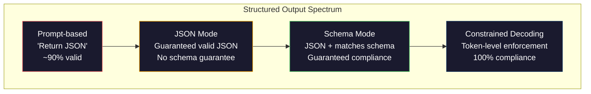
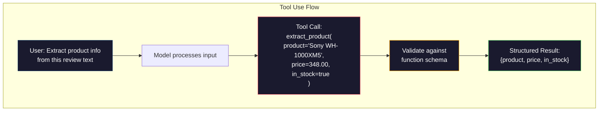

# 结构化输出：JSON、Schema验证、约束解码

> 你的LLM返回一个字符串。你的应用需要JSON。这个差距导致生产系统崩溃的次数比任何模型幻觉都多。结构化输出是自然语言和类型数据之间的桥梁。做对了，你的LLM就变成了可靠的API。做错了，你就在凌晨3点用正则表达式解析自由文本。

**类型：** Build
**语言：** Python
**前置知识：** 第10阶段，第01-05课（从头开始构建LLM）
**时间：** ~90分钟
**相关：** 第5阶段 · 20（结构化输出与约束解码）涵盖了decoder层面的理论（FSM/CFG logit处理器、Outlines、XGrammar）。本课聚焦于生产SDK层面（OpenAI `response_format`、Anthropic tool use、Instructor）——如果你想理解API底层发生了什么，请先阅读第5阶段 · 20。

## 学习目标

- 使用OpenAI和Anthropic API参数实现JSON模式和schema约束输出
- 构建Pydantic验证层，拒绝格式错误的LLM输出并用错误反馈重试
- 解释约束解码如何在token级别强制生成有效JSON，无需后处理
- 设计可靠的提取提示词，将非结构化文本稳定转换为类型化数据结构

## 问题背景

你问LLM："Extract the product name, price, and availability from this text." 它回答：

```
The product is the Sony WH-1000XM5 headphones, which cost $348.00 and are currently in stock.
```

这是一个完全正确的答案。但对应用来说完全没用。你的库存系统需要 `{"product": "Sony WH-1000XM5", "price": 348.00, "in_stock": true}`。你需要一个具有特定键、特定类型和特定值约束的JSON对象。你不需要一个句子。

天真的解决方案：在提示词中加"Respond in JSON"。这在90%的情况下有效。剩下10%的时间，模型会把JSON包裹在markdown代码块中，或者添加前言如"Here's the JSON:"，或者因为提前关闭了括号而产生语法无效的JSON。你的JSON解析器崩溃。你的pipeline中断。你加了try/except和重试循环。重试有时会产生不同的数据。现在你在解析问题之上又有了的一致性问题。

这不是提示工程问题。这是解码问题。模型从左到右生成token。在每个位置，它从100K+选项中选择最可能的下一个token。其中大多数选项在任何给定位置都会产生无效的JSON。如果模型刚刚输出了 `{"price":`，下一个token必须是数字、引号（字符串）、`null`、`true`、`false`或负号。其他任何东西都会产生无效JSON。没有约束时，模型可能会选一个完全合理的英文单词，但在语法上是灾难性的错误。

## 核心概念

### 结构化输出谱系

有四个级别的结构化输出控制，每一级都比上一级更可靠。



**Prompt-based** ("Respond in valid JSON")：无强制。模型通常遵守，但有时不遵守。可靠性：~90%。失败模式：markdown围栏、前言文本、截断输出、错误结构。

**JSON mode**：API保证输出是有效JSON。OpenAI的 `response_format: { type: "json_object" }` 启用此功能。输出可以无错误解析。但可能不符合你的预期schema——额外键、错误类型、缺失字段。

**Schema mode**：API接收JSON Schema并保证输出匹配。2026年每个主要提供商都原生支持：OpenAI的 `response_format: { type: "json_schema", json_schema: {...} }`（也可作为 `tool_choice="required"`）、Anthropic的tool use配合 `input_schema`、Gemini的 `response_schema` + `response_mime_type: "application/json"`。输出具有你指定的确切键、类型和约束。

**Constrained decoding**：在生成过程中的每个token位置，decoder屏蔽所有会产生无效输出的token。如果schema要求数字而模型即将输出字母，该token的概率被设为零。模型只能产生通向有效输出的token。这就是OpenAI的结构化输出模式以及Outlines和Guidance等库在底层实现的方式。

### JSON Schema：契约语言

JSON Schema是你告诉模型（或验证层）输出必须具有什么形状的方式。每个主要结构化输出系统都使用它。

```json
{
  "type": "object",
  "properties": {
    "product": { "type": "string" },
    "price": { "type": "number", "minimum": 0 },
    "in_stock": { "type": "boolean" },
    "categories": {
      "type": "array",
      "items": { "type": "string" }
    }
  },
  "required": ["product", "price", "in_stock"]
}
```

这个schema说：输出必须是一个对象，包含字符串 `product`、非负数 `price`、布尔值 `in_stock`，以及可选的字符串数组 `categories`。任何不匹配都会被拒绝。

Schema处理困难情况：嵌套对象、带类型项的数组、枚举（将字符串约束为特定值）、模式匹配（字符串上的正则）和组合器（oneOf、anyOf、allOf用于多态输出）。

### Pydantic模式

在Python中，你不用手写JSON Schema。你定义Pydantic模型，它会为你生成schema。

```python
from pydantic import BaseModel

class Product(BaseModel):
    product: str
    price: float
    in_stock: bool
    categories: list[str] = []
```

这会产生与上面相同的JSON Schema。Instructor库（以及OpenAI的SDK）直接接受Pydantic模型：传入模型类，取回验证后的实例。如果LLM输出不匹配，Instructor会自动重试。

### Function Calling / Tool Use

同一问题的替代接口。不是让模型直接产生JSON，而是定义带类型参数的"工具"（函数）。模型输出带结构化参数的函数调用。OpenAI称之为"function calling"。Anthropic称之为"tool use"。结果相同：结构化数据。



当模型需要选择调用哪个函数，而不仅仅是填充参数时，Tool use更受青睐。如果你有10个不同的提取schema，模型必须根据输入选择正确的那个，tool use同时给你schema选择和结构化输出。

### 常见失败模式

即使有schema强制，结构化输出仍可能以微妙的方式失败。

**Hallucinated values**：输出匹配schema但包含虚构数据。模型在文本说$348时产生 `{"price": 299.99}`。Schema验证无法捕获这个——类型正确，值错误。

**Enum confusion**：你将字段约束为 `["in_stock", "out_of_stock", "preorder"]`。模型输出 `"available"`——语义正确，但不在允许集合中。良好的约束解码会阻止这个。基于提示的方法不会。

**Nested object depth**：深度嵌套的schema（4+层）产生更多错误。每一层嵌套都是模型可能丢失结构跟踪的另一个地方。

**Array length**：模型可能在数组中产生过多或过少的项。Schema支持 `minItems` 和 `maxItems`，但并非所有提供商都在解码级别强制执行。

**Optional field omission**：模型省略了技术上可选但在语义上对你的用例很重要的字段。在schema中将它们设为required，即使数据有时缺失——强制模型显式产生 `null`。

## 动手构建

### 步骤1：JSON Schema验证器

从头构建一个验证器，检查Python对象是否匹配JSON Schema。这在输出端运行以验证合规性。

```python
import json

def validate_schema(data, schema):
    errors = []
    _validate(data, schema, "", errors)
    return errors

def _validate(data, schema, path, errors):
    schema_type = schema.get("type")

    if schema_type == "object":
        if not isinstance(data, dict):
            errors.append(f"{path}: expected object, got {type(data).__name__}")
            return
        for key in schema.get("required", []):
            if key not in data:
                errors.append(f"{path}.{key}: required field missing")
        properties = schema.get("properties", {})
        for key, value in data.items():
            if key in properties:
                _validate(value, properties[key], f"{path}.{key}", errors)

    elif schema_type == "array":
        if not isinstance(data, list):
            errors.append(f"{path}: expected array, got {type(data).__name__}")
            return
        min_items = schema.get("minItems", 0)
        max_items = schema.get("maxItems", float("inf"))
        if len(data) < min_items:
            errors.append(f"{path}: array has {len(data)} items, minimum is {min_items}")
        if len(data) > max_items:
            errors.append(f"{path}: array has {len(data)} items, maximum is {max_items}")
        items_schema = schema.get("items", {})
        for i, item in enumerate(data):
            _validate(item, items_schema, f"{path}[{i}]", errors)

    elif schema_type == "string":
        if not isinstance(data, str):
            errors.append(f"{path}: expected string, got {type(data).__name__}")
            return
        enum_values = schema.get("enum")
        if enum_values and data not in enum_values:
            errors.append(f"{path}: '{data}' not in allowed values {enum_values}")

    elif schema_type == "number":
        if not isinstance(data, (int, float)):
            errors.append(f"{path}: expected number, got {type(data).__name__}")
            return
        minimum = schema.get("minimum")
        maximum = schema.get("maximum")
        if minimum is not None and data < minimum:
            errors.append(f"{path}: {data} is less than minimum {minimum}")
        if maximum is not None and data > maximum:
            errors.append(f"{path}: {data} is greater than maximum {maximum}")

    elif schema_type == "boolean":
        if not isinstance(data, bool):
            errors.append(f"{path}: expected boolean, got {type(data).__name__}")

    elif schema_type == "integer":
        if not isinstance(data, int) or isinstance(data, bool):
            errors.append(f"{path}: expected integer, got {type(data).__name__}")
```

### 步骤2：Pydantic风格模型到Schema

构建一个最小的类到schema转换器。定义Python类并自动生成其JSON Schema。

```python
class SchemaField:
    def __init__(self, field_type, required=True, default=None, enum=None, minimum=None, maximum=None):
        self.field_type = field_type
        self.required = required
        self.default = default
        self.enum = enum
        self.minimum = minimum
        self.maximum = maximum

def python_type_to_schema(field):
    type_map = {
        str: "string",
        int: "integer",
        float: "number",
        bool: "boolean",
    }

    schema = {}

    if field.field_type in type_map:
        schema["type"] = type_map[field.field_type]
    elif field.field_type == list:
        schema["type"] = "array"
        schema["items"] = {"type": "string"}
    elif isinstance(field.field_type, dict):
        schema = field.field_type

    if field.enum:
        schema["enum"] = field.enum
    if field.minimum is not None:
        schema["minimum"] = field.minimum
    if field.maximum is not None:
        schema["maximum"] = field.maximum

    return schema

def model_to_schema(name, fields):
    properties = {}
    required = []

    for field_name, field in fields.items():
        properties[field_name] = python_type_to_schema(field)
        if field.required:
            required.append(field_name)

    return {
        "type": "object",
        "properties": properties,
        "required": required,
    }
```

### 步骤3：约束Token过滤器

模拟约束解码。给定部分JSON字符串和schema，确定当前位置哪些token类别是有效的。

```python
def next_valid_tokens(partial_json, schema):
    stripped = partial_json.strip()

    if not stripped:
        return ["{"]

    try:
        json.loads(stripped)
        return ["<EOS>"]
    except json.JSONDecodeError:
        pass

    last_char = stripped[-1] if stripped else ""

    if last_char == "{":
        return ['"', "}"]
    elif last_char == '"':
        if stripped.endswith('":'):
            return ['"', "0-9", "true", "false", "null", "[", "{"]
        return ["a-z", '"']
    elif last_char == ":":
        return [" ", '"', "0-9", "true", "false", "null", "[", "{"]
    elif last_char == ",":
        return [" ", '"', "{", "["]
    elif last_char in "0123456789":
        return ["0-9", ".", ",", "}", "]"]
    elif last_char == "}":
        return [",", "}", "]", "<EOS>"]
    elif last_char == "]":
        return [",", "}", "<EOS>"]
    elif last_char == "[":
        return ['"', "0-9", "true", "false", "null", "{", "[", "]"]
    else:
        return ["any"]

def demonstrate_constrained_decoding():
    partial_states = [
        '',
        '{',
        '{"product"',
        '{"product":',
        '{"product": "Sony"',
        '{"product": "Sony",',
        '{"product": "Sony", "price":',
        '{"product": "Sony", "price": 348',
        '{"product": "Sony", "price": 348}',
    ]

    print(f"{'Partial JSON':<45} {'Valid Next Tokens'}")
    print("-" * 80)
    for state in partial_states:
        valid = next_valid_tokens(state, {})
        display = state if state else "(empty)"
        print(f"{display:<45} {valid}")
```

### 步骤4：提取Pipeline

将所有内容组合成一个提取pipeline：定义schema，模拟LLM产生结构化输出，验证输出，并处理重试。

```python
def simulate_llm_extraction(text, schema, attempt=0):
    if "headphones" in text.lower() or "sony" in text.lower():
        if attempt == 0:
            return '{"product": "Sony WH-1000XM5", "price": 348.00, "in_stock": true, "categories": ["audio", "headphones"]}'
        return '{"product": "Sony WH-1000XM5", "price": 348.00, "in_stock": true}'

    if "laptop" in text.lower():
        return '{"product": "MacBook Pro 16", "price": 2499.00, "in_stock": false, "categories": ["computers"]}'

    return '{"product": "Unknown", "price": 0, "in_stock": false}'

def extract_with_retry(text, schema, max_retries=3):
    for attempt in range(max_retries):
        raw = simulate_llm_extraction(text, schema, attempt)

        try:
            data = json.loads(raw)
        except json.JSONDecodeError as e:
            print(f"  Attempt {attempt + 1}: JSON parse error -- {e}")
            continue

        errors = validate_schema(data, schema)
        if not errors:
            return data

        print(f"  Attempt {attempt + 1}: Schema validation errors -- {errors}")

    return None

product_schema = {
    "type": "object",
    "properties": {
        "product": {"type": "string"},
        "price": {"type": "number", "minimum": 0},
        "in_stock": {"type": "boolean"},
        "categories": {"type": "array", "items": {"type": "string"}},
    },
    "required": ["product", "price", "in_stock"],
}
```

### 步骤5：运行完整Pipeline

```python
def run_demo():
    print("=" * 60)
    print("  Structured Output Pipeline Demo")
    print("=" * 60)

    print("\n--- Schema Definition ---")
    product_fields = {
        "product": SchemaField(str),
        "price": SchemaField(float, minimum=0),
        "in_stock": SchemaField(bool),
        "categories": SchemaField(list, required=False),
    }
    generated_schema = model_to_schema("Product", product_fields)
    print(json.dumps(generated_schema, indent=2))

    print("\n--- Schema Validation ---")
    test_cases = [
        ({"product": "Test", "price": 10.0, "in_stock": True}, "Valid object"),
        ({"product": "Test", "price": -5.0, "in_stock": True}, "Negative price"),
        ({"product": "Test", "in_stock": True}, "Missing price"),
        ({"product": "Test", "price": "ten", "in_stock": True}, "String as price"),
        ("not an object", "String instead of object"),
    ]

    for data, label in test_cases:
        errors = validate_schema(data, product_schema)
        status = "PASS" if not errors else f"FAIL: {errors}"
        print(f"  {label}: {status}")

    print("\n--- Constrained Decoding Simulation ---")
    demonstrate_constrained_decoding()

    print("\n--- Extraction Pipeline ---")
    texts = [
        "The Sony WH-1000XM5 headphones are priced at $348 and currently available.",
        "The new MacBook Pro 16-inch laptop costs $2499 but is sold out.",
        "This is a random sentence with no product info.",
    ]

    for text in texts:
        print(f"\n  Input: {text[:60]}...")
        result = extract_with_retry(text, product_schema)
        if result:
            print(f"  Output: {json.dumps(result)}")
        else:
            print(f"  Output: FAILED after retries")
```

## 使用它

### OpenAI结构化输出

```python
# from openai import OpenAI
# from pydantic import BaseModel
#
# client = OpenAI()
#
# class Product(BaseModel):
#     product: str
#     price: float
#     in_stock: bool
#
# response = client.beta.chat.completions.parse(
#     model="gpt-5-mini",
#     messages=[
#         {"role": "system", "content": "Extract product information."},
#         {"role": "user", "content": "Sony WH-1000XM5, $348, in stock"},
#     ],
#     response_format=Product,
# )
#
# product = response.choices[0].message.parsed
# print(product.product, product.price, product.in_stock)
```

OpenAI的结构化输出模式在内部使用约束解码。模型生成的每个token都保证产生匹配Pydantic schema的输出。无需重试。无需验证。约束被烘焙进解码过程。

### Anthropic Tool Use

```python
# import anthropic
#
# client = anthropic.Anthropic()
#
# response = client.messages.create(
#     model="claude-opus-4-7",
#     max_tokens=1024,
#     tools=[{
#         "name": "extract_product",
#         "description": "Extract product information from text",
#         "input_schema": {
#             "type": "object",
#             "properties": {
#                 "product": {"type": "string"},
#                 "price": {"type": "number"},
#                 "in_stock": {"type": "boolean"},
#             },
#             "required": ["product", "price", "in_stock"],
#         },
#     }],
#     messages=[{"role": "user", "content": "Extract: Sony WH-1000XM5, $348, in stock"}],
# )
```

Anthropic通过tool use实现结构化输出。模型发出工具调用，其结构化参数匹配input_schema。结果相同，API表面不同。

### Instructor库

```python
# pip install instructor
# import instructor
# from openai import OpenAI
# from pydantic import BaseModel
#
# client = instructor.from_openai(OpenAI())
#
# class Product(BaseModel):
#     product: str
#     price: float
#     in_stock: bool
#
# product = client.chat.completions.create(
#     model="gpt-5-mini",
#     response_model=Product,
