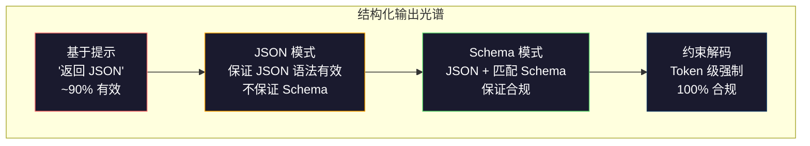
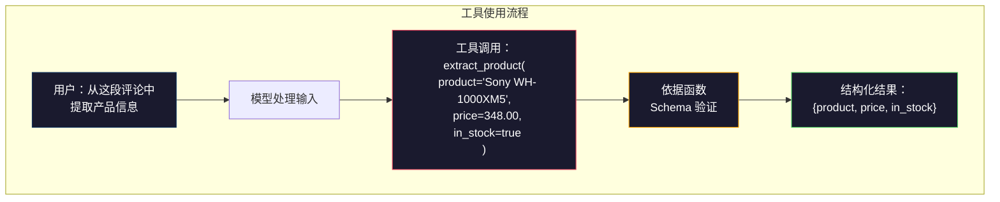

# 结构化输出：JSON、Schema 验证、约束解码

> 你的大语言模型返回的是字符串。你的应用程序需要的是 JSON。这个鸿沟比任何模型幻觉都让更多的生产系统崩溃。结构化输出是连接自然语言与类型化数据的桥梁。做好了，你的 LLM 就成了可靠的 API；做不好，你凌晨三点还在用正则表达式解析自由文本。

**类型：** 动手构建
**语言：** Python
**前置知识：** 第 10 阶段，第 01-05 课（从头构建 LLM）
**时间：** ~90 分钟
**相关课程：** 第 5 阶段 · 第 20 课（结构化输出与约束解码）覆盖了解码器层面的理论（FSM/CFG logit 处理器、Outlines、XGrammar）。本课聚焦于生产级 SDK 接口（OpenAI `response_format`、Anthropic tool use、Instructor）——如果你先想了解 API 之下发生了什么，建议先阅读第 5 阶段 · 第 20 课。

## 学习目标

- 使用 OpenAI 和 Anthropic 的 API 参数实现 JSON 模式和 schema 约束的输出
- 构建一个 Pydantic 验证层，拒绝格式错误的 LLM 输出并附带错误反馈重试
- 解释约束解码如何在不经后处理的情况下，在 token 级别强制生成合法 JSON
- 设计可靠的提取提示词，将非结构化文本可靠地转化为类型化数据结构

## 问题

你让 LLM："从这段文本中提取产品名称、价格和库存信息。"它回答：

```
The product is the Sony WH-1000XM5 headphones, which cost $348.00 and are currently in stock.
```

这是一个完全正确的答案。但它对你的应用程序完全无用。你的库存系统需要的是 `{"product": "Sony WH-1000XM5", "price": 348.00, "in_stock": true}`。你需要的是一个具有特定键、特定类型和特定值约束的 JSON 对象。你不需要一个句子。

天真的解决方案：在你的提示词里加上"请以 JSON 格式回答"。这个方法 90% 的情况有效。另外 10% 的情况，模型会在 JSON 外面包裹 Markdown 代码块，或者加上"这是 JSON："这样的前言，或者因为提前关闭了一个括号而产生语法无效的 JSON。你的 JSON 解析器崩溃了。你的流水线断了。你加上 try/except 和重试循环。重试有时会产生不同的数据。现在你在解析问题之上又有了一致性的问题。

这不是提示工程的问题。这是解码的问题。模型从左到右生成 token。在每个位置，它从 10 万多个选项的词汇表中选出最可能的下一个 token。在这些选项中，大部分在任意给定位置上都会产生无效的 JSON。如果模型刚刚输出了 `{"price":`，那么下一个 token 必须是数字、引号（表示字符串）、`null`、`true`、`false` 或负号。其他任何内容都会产生无效的 JSON。如果没有约束，模型可能会选一个完全合理的英文单词，但在语法上却大错特错。

## 概念

### 结构化输出光谱

结构化输出控制有四个层次，每一层都比上一层更可靠。


```mermaid
graph LR
    subgraph Spectrum["结构化输出光谱"]
        direction LR
        A["基于提示\n'返回 JSON'\n~90% 有效"] --> B["JSON 模式\n保证 JSON 语法有效\n不保证 Schema"]
        B --> C["Schema 模式\nJSON + 匹配 Schema\n保证合规"]
        C --> D["约束解码\nToken 级强制\n100% 合规"]
    end

    style A fill:#1a1a2e,stroke:#ff6b6b,color:#fff
    style B fill:#1a1a2e,stroke:#ffa500,color:#fff
    style C fill:#1a1a2e,stroke:#51cf66,color:#fff
    style D fill:#1a1a2e,stroke:#0f3460,color:#fff
```

**基于提示**（"请以合法 JSON 格式回答"）：无强制措施。模型通常遵从，但有时不会。可靠性：~90%。失败模式：Markdown 代码块、前言文本、截断输出、结构错误。

**JSON 模式**：API 保证输出是合法 JSON。OpenAI 的 `response_format: { type: "json_object" }` 启用了此模式。输出可以无错误解析。但它可能不符合你预期的 schema——多余的键、错误的类型、缺失的字段。

**Schema 模式**：API 接收一个 JSON Schema 并保证输出匹配该 schema。到 2026 年，每个主流提供商都原生支持：OpenAI 的 `response_format: { type: "json_schema", json_schema: {...} }`（也可用 `tool_choice="required"`），Anthropic 的 tool use 配合 `input_schema`，以及 Gemini 的 `response_schema` + `response_mime_type: "application/json"`。输出具有你指定的确切键、类型和约束。

**约束解码**：在生成过程中的每个 token 位置，解码器会屏蔽所有会产生无效输出的 token。如果 schema 要求一个数字而模型即将输出一个字母，该 token 的概率被设为零。模型只能产生那些能通往合法输出的 token。这就是 OpenAI 的结构化输出模式以及 Outlines、Guidance 等库在底层所做的事情。

### JSON Schema：契约语言

JSON Schema 是你告诉模型（或验证层）输出必须是什么形状的方式。每个主要的结构化输出系统都在使用它。

```json
{
  "type": "object",
  "properties": {
    "product": { "type": "string" },
    "price": { "type": "number", "minimum": 0 },
    "in_stock": { "type": "boolean" },
    "categories": {
      "type": "array",
      "items": { "type": "string" }
    }
  },
  "required": ["product", "price", "in_stock"]
}
```

这个 schema 说明：输出必须是一个对象，包含字符串类型的 `product`、非负数的 `price`、布尔值的 `in_stock`，以及可选的字符串数组 `categories`。任何不匹配的输出都会被拒绝。

Schema 处理各种棘手的场景：嵌套对象、带类型元素的数组、枚举（将字符串限定到特定值）、模式匹配（字符串上的正则表达式）以及组合器（用于多态输出的 oneOf、anyOf、allOf）。

### Pydantic 模式

在 Python 中，你不必手写 JSON Schema。你定义一个 Pydantic 模型，它会自动为你生成 schema。

```python
from pydantic import BaseModel

class Product(BaseModel):
    product: str
    price: float
    in_stock: bool
    categories: list[str] = []
```

这段代码生成的 JSON Schema 与上面的完全一致。Instructor 库（以及 OpenAI 的 SDK）直接接受 Pydantic 模型：传入模型类，拿回验证过的实例。如果 LLM 输出不匹配，Instructor 会自动重试。

### 函数调用 / 工具使用

这是同一问题的另一种接口。与其要求模型直接生成 JSON，不如定义带类型参数的"工具"（函数）。模型输出一个带有结构化参数的函数调用。OpenAI 称之为"函数调用（function calling）"，Anthropic 称之为"工具使用（tool use）"。结果是一样的：结构化数据。


```mermaid
graph TD
    subgraph ToolUse["工具使用流程"]
        U["用户：从这段评论中\n提取产品信息"] --> M["模型处理输入"]
        M --> TC["工具调用：\nextract_product(\n  product='Sony WH-1000XM5',\n  price=348.00,\n  in_stock=true\n)"]
        TC --> V["依据函数\nSchema 验证"]
        V --> R["结构化结果：\n{product, price, in_stock}"]
    end

    style U fill:#1a1a2e,stroke:#0f3460,color:#fff
    style TC fill:#1a1a2e,stroke:#e94560,color:#fff
    style V fill:#1a1a2e,stroke:#ffa500,color:#fff
    style R fill:#1a1a2e,stroke:#51cf66,color:#fff
```

当模型需要选择调用哪个函数（而不仅仅是填写参数）时，工具使用是更优的选择。如果你有 10 种不同的提取 schema，且模型必须根据输入选择正确的那一个，工具使用同时提供了 schema 选择和结构化输出。

### 常见失败模式

即使有 schema 强制，结构化输出仍可能以微妙的方式失败。

**幻觉值**：输出符合 schema，但包含编造的数据。模型生成了 `{"price": 299.99}`，而文本说的是 $348。Schema 验证无法捕捉到这一点——类型正确，但数值错误。

**枚举混淆**：你将一个字段约束为 `["in_stock", "out_of_stock", "preorder"]`。模型输出了 `"available"`——语义上正确，但不在允许集合中。良好的约束解码能阻止这种情况。基于提示的方法则不能。

**嵌套对象深度**：深层嵌套的 schema（4 层以上）会产生更多错误。每一层嵌套都是模型可能丢失结构的地方。

**数组长度**：模型可能生成过多或过少的数组元素。Schema 支持 `minItems` 和 `maxItems`，但并非所有提供商都在解码层面强制执行它们。

**可选字段遗漏**：模型会省略那些技术上可选但对你的用例具有语义重要性的字段。即使数据有时缺失，也应在 schema 中将这些字段设为必需的——强制模型显式输出 `null`。

## 动手构建

### 第 1 步：JSON Schema 验证器

从头构建一个验证器，检查 Python 对象是否匹配 JSON Schema。这就是在输出端检查合规性的工具。

```python
import json

def validate_schema(data, schema):
    errors = []
    _validate(data, schema, "", errors)
    return errors

def _validate(data, schema, path, errors):
    schema_type = schema.get("type")

    if schema_type == "object":
        if not isinstance(data, dict):
            errors.append(f"{path}: 期望 object，实际得到 {type(data).__name__}")
            return
        for key in schema.get("required", []):
            if key not in data:
                errors.append(f"{path}.{key}: 缺少必需字段")
        properties = schema.get("properties", {})
        for key, value in data.items():
            if key in properties:
                _validate(value, properties[key], f"{path}.{key}", errors)

    elif schema_type == "array":
        if not isinstance(data, list):
            errors.append(f"{path}: 期望 array，实际得到 {type(data).__name__}")
            return
        min_items = schema.get("minItems", 0)
        max_items = schema.get("maxItems", float("inf"))
        if len(data) < min_items:
            errors.append(f"{path}: 数组有 {len(data)} 个元素，最少需要 {min_items}")
        if len(data) > max_items:
            errors.append(f"{path}: 数组有 {len(data)} 个元素，最多允许 {max_items}")
        items_schema = schema.get("items", {})
        for i, item in enumerate(data):
            _validate(item, items_schema, f"{path}[{i}]", errors)

    elif schema_type == "string":
        if not isinstance(data, str):
            errors.append(f"{path}: 期望 string，实际得到 {type(data).__name__}")
            return
        enum_values = schema.get("enum")
        if enum_values and data not in enum_values:
            errors.append(f"{path}: '{data}' 不在允许值 {enum_values} 中")

    elif schema_type == "number":
        if not isinstance(data, (int, float)):
            errors.append(f"{path}: 期望 number，实际得到 {type(data).__name__}")
            return
        minimum = schema.get("minimum")
        maximum = schema.get("maximum")
        if minimum is not None and data < minimum:
            errors.append(f"{path}: {data} 小于最小值 {minimum}")
        if maximum is not None and data > maximum:
            errors.append(f"{path}: {data} 大于最大值 {maximum}")

    elif schema_type == "boolean":
        if not isinstance(data, bool):
            errors.append(f"{path}: 期望 boolean，实际得到 {type(data).__name__}")

    elif schema_type == "integer":
        if not isinstance(data, int) or isinstance(data, bool):
            errors.append(f"{path}: 期望 integer，实际得到 {type(data).__name__}")
```

### 第 2 步：Pydantic 风格的模型转 Schema

构建一个最小化的类转 schema 转换器。定义一个 Python 类，自动生成其 JSON Schema。

```python
class SchemaField:
    def __init__(self, field_type, required=True, default=None, enum=None, minimum=None, maximum=None):
        self.field_type = field_type
        self.required = required
        self.default = default
        self.enum = enum
        self.minimum = minimum
        self.maximum = maximum

def python_type_to_schema(field):
    type_map = {
        str: "string",
        int: "integer",
        float: "number",
        bool: "boolean",
    }

    schema = {}

    if field.field_type in type_map:
        schema["type"] = type_map[field.field_type]
    elif field.field_type == list:
        schema["type"] = "array"
        schema["items"] = {"type": "string"}
    elif isinstance(field.field_type, dict):
        schema = field.field_type

    if field.enum:
        schema["enum"] = field.enum
    if field.minimum is not None:
        schema["minimum"] = field.minimum
    if field.maximum is not None:
        schema["maximum"] = field.maximum

    return schema

def model_to_schema(name, fields):
    properties = {}
    required = []

    for field_name, field in fields.items():
        properties[field_name] = python_type_to_schema(field)
        if field.required:
            required.append(field_name)

    return {
        "type": "object",
        "properties": properties,
        "required": required,
    }
```

### 第 3 步：约束 Token 过滤器

模拟约束解码。给定一个部分 JSON 字符串和一个 schema，确定当前位置哪些 token 类别是合法的。

```python
def next_valid_tokens(partial_json, schema):
    stripped = partial_json.strip()

    if not stripped:
        return ["{"]

    try:
        json.loads(stripped)
        return ["<EOS>"]
    except json.JSONDecodeError:
        pass

    last_char = stripped[-1] if stripped else ""

    if last_char == "{":
        return ['"', "}"]
    elif last_char == '"':
        if stripped.endswith('":'):
            return ['"', "0-9", "true", "false", "null", "[", "{"]
        return ["a-z", '"']
    elif last_char == ":":
        return [" ", '"', "0-9", "true", "false", "null", "[", "{"]
    elif last_char == ",":
        return [" ", '"', "{", "["]
    elif last_char in "0123456789":
        return ["0-9", ".", ",", "}", "]"]
    elif last_char == "}":
        return [",", "}", "]", "<EOS>"]
    elif last_char == "]":
        return [",", "}", "<EOS>"]
    elif last_char == "[":
        return ['"', "0-9", "true", "false", "null", "{", "[", "]"]
    else:
        return ["any"]

def demonstrate_constrained_decoding():
    partial_states = [
        '',
        '{',
        '{"product"',
        '{"product":',
        '{"product": "Sony"',
        '{"product": "Sony",',
        '{"product": "Sony", "price":',
        '{"product": "Sony", "price": 348',
        '{"product": "Sony", "price": 348}',
    ]

    print(f"{'部分 JSON':<45} {'合法下一 Token'}")
    print("-" * 80)
    for state in partial_states:
        valid = next_valid_tokens(state, {})
        display = state if state else "(空)"
        print(f"{display:<45} {valid}")
```

### 第 4 步：提取流水线

将以上所有组合成一个提取流水线：定义 schema，模拟 LLM 产生结构化输出，验证输出，并处理重试。

```python
def simulate_llm_extraction(text, schema, attempt=0):
    if "headphones" in text.lower() or "sony" in text.lower():
        if attempt == 0:
            return '{"product": "Sony WH-1000XM5", "price": 348.00, "in_stock": true, "categories": ["audio", "headphones"]}'
        return '{"product": "Sony WH-1000XM5", "price": 348.00, "in_stock": true}'

    if "laptop" in text.lower():
        return '{"product": "MacBook Pro 16", "price": 2499.00, "in_stock": false, "categories": ["computers"]}'

    return '{"product": "Unknown", "price": 0, "in_stock": false}'

def extract_with_retry(text, schema, max_retries=3):
    for attempt in range(max_retries):
        raw = simulate_llm_extraction(text, schema, attempt)

        try:
            data = json.loads(raw)
        except json.JSONDecodeError as e:
            print(f"  第 {attempt + 1} 次尝试：JSON 解析错误 -- {e}")
            continue

        errors = validate_schema(data, schema)
        if not errors:
            return data

        print(f"  第 {attempt + 1} 次尝试：Schema 验证错误 -- {errors}")

    return None

product_schema = {
    "type": "object",
    "properties": {
        "product": {"type": "string"},
        "price": {"type": "number", "minimum": 0},
        "in_stock": {"type": "boolean"},
        "categories": {"type": "array", "items": {"type": "string"}},
    },
    "required": ["product", "price", "in_stock"],
}
```

### 第 5 步：运行完整流水线

```python
def run_demo():
    print("=" * 60)
    print("  结构化输出流水线演示")
    print("=" * 60)

    print("\n--- Schema 定义 ---")
    product_fields = {
        "product": SchemaField(str),
        "price": SchemaField(float, minimum=0),
        "in_stock": SchemaField(bool),
        "categories": SchemaField(list, required=False),
    }
    generated_schema = model_to_schema("Product", product_fields)
    print(json.dumps(generated_schema, indent=2))

    print("\n--- Schema 验证 ---")
    test_cases = [
        ({"product": "Test", "price": 10.0, "in_stock": True}, "合法对象"),
        ({"product": "Test", "price": -5.0, "in_stock": True}, "负数价格"),
        ({"product": "Test", "in_stock": True}, "缺少价格"),
        ({"product": "Test", "price": "ten", "in_stock": True}, "字符串作为价格"),
        ("not an object", "字符串而非对象"),
    ]

    for data, label in test_cases:
        errors = validate_schema(data, product_schema)
        status = "通过" if not errors else f"失败：{errors}"
        print(f"  {label}：{status}")

    print("\n--- 约束解码模拟 ---")
    demonstrate_constrained_decoding()

    print("\n--- 提取流水线 ---")
    texts = [
        "The Sony WH-1000XM5 headphones are priced at $348 and currently available.",
        "The new MacBook Pro 16-inch laptop costs $2499 but is sold out.",
        "This is a random sentence with no product info.",
    ]

    for text in texts:
        print(f"\n  输入：{text[:60]}...")
        result = extract_with_retry(text, product_schema)
        if result:
            print(f"  输出：{json.dumps(result)}")
        else:
            print(f"  输出：重试后仍然失败")
```

## 使用方式

### OpenAI 结构化输出

```python
# from openai import OpenAI
# from pydantic import BaseModel
#
# client = OpenAI()
#
# class Product(BaseModel):
#     product: str
#     price: float
#     in_stock: bool
#
# response = client.beta.chat.completions.parse(
#     model="gpt-5-mini",
#     messages=[
#         {"role": "system", "content": "提取产品信息。"},
#         {"role": "user", "content": "Sony WH-1000XM5, $348, 有货"},
#     ],
#     response_format=Product,
# )
#
# product = response.choices[0].message.parsed
# print(product.product, product.price, product.in_stock)
```

OpenAI 的结构化输出模式在内部使用约束解码。模型生成的每一个 token 都保证输出匹配 Pydantic schema。无需重试，无需验证。该约束直接内置于解码过程中。

### Anthropic 工具使用

```python
# import anthropic
#
# client = anthropic.Anthropic()
#
# response = client.messages.create(
#     model="claude-opus-4-7",
#     max_tokens=1024,
#     tools=[{
#         "name": "extract_product",
#         "description": "从文本中提取产品信息",
#         "input_schema": {
#             "type": "object",
#             "properties": {
#                 "product": {"type": "string"},
#                 "price": {"type": "number"},
#                 "in_stock": {"type": "boolean"},
#             },
#             "required": ["product", "price", "in_stock"],
#         },
#     }],
#     messages=[{"role": "user", "content": "提取：Sony WH-1000XM5, $348, 有货"}],
# )
```

Anthropic 通过工具使用实现结构化输出。模型发出一个带有结构化参数的函数调用，这些参数匹配 `input_schema`。同样的结果，不同的 API 接口。

### Instructor 库

```python
# pip install instructor
# import instructor
# from openai import OpenAI
# from pydantic import BaseModel
#
# client = instructor.from_openai(OpenAI())
#
# class Product(BaseModel):
#     product: str
#     price: float
#     in_stock: bool
#
# product = client.chat.completions.create(
#     model="gpt-5-mini",
#     response_model=Product,
#     messages=[{"role": "user", "content": "Sony WH-1000XM5, $348, 有货"}],
# )
```

Instructor 包装了任何 LLM 客户端，并添加了带验证的自动重试。如果第一次尝试未通过验证，它会将错误信息作为上下文发送回模型，并请求其修正输出。这不仅适用于 OpenAI，而是任何提供商。

## 交付成果

本课程产出 `outputs/prompt-structured-extractor.md`——一个可复用的提示模板，给定 schema 定义即可从任意文本中提取结构化数据。输入 JSON Schema 和非结构化文本，返回验证过的 JSON。

同时还产出 `outputs/skill-structured-outputs.md`——一个决策框架，帮助你根据提供商、可靠性需求和 schema 复杂度选择合适的结构化输出策略。

## 练习

1. 扩展 schema 验证器以支持 `oneOf`（数据必须恰好匹配多个 schema 中的一个）。这用于处理多态输出——例如，一个字段可以是具有不同结构的 `Product` 或 `Service` 对象。

2. 构建一个"schema diff"工具，比较两个 schema 并识别破坏性变更（移除必需字段、更改类型）与非破坏性变更（增加可选字段、放宽约束）。这对于在生产环境中对你的提取 schema 进行版本管理至关重要。

3. 实现一个更真实的约束解码模拟器。给定一个 JSON Schema 和一个包含 100 个 token（字母、数字、标点、关键词）的词汇表，逐步进行生成过程，在每个位置屏蔽无效 token。测量每个步骤中合法 token 占词汇表的百分比。

4. 构建一个提取评测套件。创建 50 条带人工标注 JSON 输出的产品描述。在你的提取流水线上运行全部 50 条，测量精确匹配率、字段级准确率和类型合规率。找出哪些字段最难正确提取。

5. 为你的提取流水线添加"置信度分数"。对于每个提取的字段，估计模型的置信度（基于 token 概率，或通过运行 3 次提取并衡量一致性）。将低置信度的字段标记为需要人工审查。

## 关键术语

| 术语 | 字面说法 | 实际含义 |
|------|----------|---------|
| JSON 模式 | "返回 JSON" | API 标志，保证返回语法合法的 JSON 输出，但不强制任何特定 schema |
| 结构化输出 | "类型化 JSON" | 输出匹配特定 JSON Schema，具有正确的键、类型和约束 |
| 约束解码 | "引导式生成" | 在每个 token 位置屏蔽会造成无效输出的 token——保证 100% schema 合规 |
| JSON Schema | "一个 JSON 模板" | 一种声明式语言，用于描述 JSON 数据的结构、类型和约束（被 OpenAPI、JSON Forms 等使用） |
| Pydantic | "Python dataclasses+" | 定义带类型验证的数据模型的 Python 库，被 FastAPI 和 Instructor 用于生成 JSON Schema |
| 函数调用 | "工具使用" | LLM 输出结构化的函数调用（名称 + 类型化参数）而非自由文本——OpenAI 和 Anthropic 均支持 |
| Instructor | "LLM 的 Pydantic" | 包装 LLM 客户端以返回经过验证的 Pydantic 实例的 Python 库，验证失败时自动重试 |
| Token 屏蔽 | "过滤词汇表" | 在生成过程中将某些 token 的概率设为零，使模型无法产生它们 |
| Schema 合规 | "匹配形状" | 输出包含所有必需字段，类型正确，值在约束范围内，且没有额外的不允许字段 |
| 重试循环 | "重试直到成功" | 将验证错误发送回模型并要求它修正输出——Instructor 自动执行此操作，可配置最大重试次数 |

## 延伸阅读

- [OpenAI 结构化输出指南](https://platform.openai.com/docs/guides/structured-outputs) -- 关于 OpenAI API 中基于 JSON Schema 的约束解码的官方文档
- [Willard & Louf, 2023 -- "Efficient Guided Generation for Large Language Models"](https://arxiv.org/abs/2307.09702) -- Outlines 论文，描述了如何将 JSON Schema 编译为有限状态机以实现 token 级别的约束
- [Instructor 文档](https://python.useinstructor.com/) -- 使用 Pydantic 验证和重试从任何 LLM 获取结构化输出的标准库
- [Anthropic 工具使用指南](https://docs.anthropic.com/en/docs/tool-use) -- Claude 如何通过工具使用配合 JSON Schema input_schema 实现结构化输出
- [JSON Schema 规范](https://json-schema.org/) -- 每个主要结构化输出系统所使用的 schema 语言的完整规范
- [Outlines 库](https://github.com/outlines-dev/outlines) -- 使用正则表达式和编译为有限状态机的 JSON Schema 实现开源约束生成
- [Dong 等人, "XGrammar: Flexible and Efficient Structured Generation Engine for Large Language Models" (MLSys 2025)](https://arxiv.org/abs/2411.15100) -- 当前最先进的语法引擎；下推自动机编译，以约 100 纳秒 / token 的速度屏蔽 token
- [Beurer-Kellner 等人, "Prompting Is Programming: A Query Language for Large Language Models" (LMQL)](https://arxiv.org/abs/2212.06094) -- LMQL 论文，将约束解码框架化为一种包含类型和值约束的查询语言
- [Microsoft Guidance (框架文档)](https://github.com/guidance-ai/guidance) -- 模板驱动的约束生成；与 Outlines 和 XGrammar 互补的厂商无关方案
