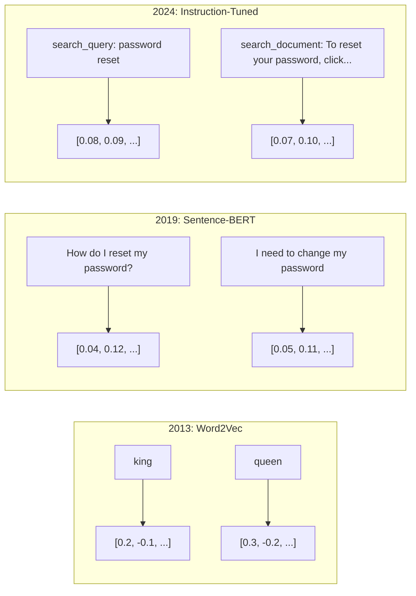

# Embeddings & Vector Representations

> Text は離散的です。Math は連続的です。LLM に「似た」documents を見つけさせたり、意味を比較させたり、keyword を超えて検索させたりするたびに、この 2 つの世界をつなぐ橋に頼っています。その橋が embedding です。embeddings を理解していなければ、modern AI を理解しているとは言えません。使っているだけです。

**種別:** 構築
**言語:** Python
**前提条件:** Phase 11, Lesson 01 (Prompt Engineering)
**所要時間:** 約75分
**Related:** Phase 5 · 22 (Embedding Models Deep Dive) は dense vs sparse vs multi-vector、Matryoshka truncation、per-axis model selection を扱います。この lesson は production pipeline (vector DBs、HNSW、similarity math) に焦点を当てます。

## Learning Objectives

- API providers と open-source models を使って text embeddings を生成し、cosine similarity を計算する
- keyword search が扱えない vocabulary mismatch problem を embeddings が解く理由を説明する
- exact keyword match ではなく meaning で documents を取得する semantic search index を作る
- retrieval benchmarks (precision@k、recall) で embedding quality を評価し、task に合う embedding model を選ぶ

## 問題

10,000 件の support tickets があるとします。customer が "my payment didn't go through" と書きました。似た過去 tickets を探す必要があります。keyword search は "payment" と "didn't go through" を含む tickets を見つけますが、"transaction failed"、"charge was declined"、"billing error" を見逃します。これらは同じ問題を完全に異なる言葉で説明しています。

これが vocabulary mismatch problem です。人間の言語には同じことを言う方法が何十通りもあります。keyword search は各単語を意味のない独立した記号として扱います。"declined" と "didn't go through" が同じ概念を指すとはわかりません。

必要なのは、綴りではなく意味が similarity を決める text representation です。"my payment didn't go through" と "transaction was declined" を数学的空間で近くに置き、同じ "payment" を含むだけの "my payment arrived on time" を遠ざける方法が必要です。それが embedding です。

## The Concept

### What Is an Embedding?

embedding は text の意味を表す dense vector of floating-point numbers です。dense とは、bag-of-words や TF-IDF のように大半の dimensions が 0 になる sparse representations と違い、すべての dimension が情報を持つことを意味します。

"The cat sat on the mat" は `[0.023, -0.041, 0.087, ..., 0.012]` のような 768-3072 個の数値リストになります。これらの数値は直接読まず、比較します。

### The Word2Vec Breakthrough

2013 年、Google の Tomas Mikolov らは Word2Vec を発表しました。近傍 words から word を予測する neural network を訓練すると、hidden layer weights が意味のある vector representations になる、という発想です。

有名な結果です。

```
king - man + woman = queen
```

word embeddings 上の vector arithmetic は semantic relationships を捉えます。ただし Word2Vec は各 word に 1 つの vector を与えるため、"river bank" と "bank account" の "bank" が同じ embedding になるという限界がありました。

### From Words to Sentences

production systems では sentences、paragraphs、documents 全体を embed する必要があります。

**Averaging**: sentence 内の word vectors の平均を取ります。安価ですが word order を失います。

**CLS token**: BERT のような transformer models が出力する [CLS] token embedding を使います。averaging より良いですが、もともとは similarity 用に訓練されていません。

**Contrastive learning**: similar pairs を近づけ、dissimilar pairs を遠ざけるよう明示的に訓練します。Sentence-BERT がこの approach を使い、modern embedding models の基礎になりました。

**Instruction-tuned embeddings**: E5 や GTE のような models は `search_query:` や `search_document:` の prefix を受け取り、task に応じた embedding を生成します。



### Modern Embedding Models

2026 年初頭の MTEB v2 を基準にした production-grade options です。

| Model | Provider | Dimensions | MTEB | Context | Cost / 1M tokens |
|-------|----------|-----------|------|---------|------------------|
| Gemini Embedding 2 | Google | 3072 (Matryoshka) | 67.7 (retrieval) | 8192 | $0.15 |
| embed-v4 | Cohere | 1024 (Matryoshka) | 65.2 | 128K | $0.12 |
| voyage-4 | Voyage AI | 1024/2048 (Matryoshka) | 66.8 | 32K | $0.12 |
| text-embedding-3-large | OpenAI | 3072 (Matryoshka) | 64.6 | 8192 | $0.13 |
| text-embedding-3-small | OpenAI | 1536 (Matryoshka) | 62.3 | 8192 | $0.02 |
| BGE-M3 | BAAI | 1024 (dense+sparse+ColBERT) | 63.0 multilingual | 8192 | Open-weight |
| Qwen3-Embedding | Alibaba | 4096 (Matryoshka) | 66.9 | 32K | Open-weight |
| Nomic-embed-v2 | Nomic | 768 (Matryoshka) | 63.1 | 8192 | Open-weight |

MTEB は retrieval、classification、clustering、reranking、summarization など 100+ tasks を含みます。高いほど良いですが、導入前には必ず自分の queries で benchmark してください。

### Similarity Metrics

2 つの embedding vectors の類似度を測る代表的な方法は 3 つです。

**Cosine similarity**: 2 vectors の角度の cosine です。-1 (反対) から 1 (同一方向) までを取ります。magnitude を無視するため、多くの retrieval tasks の default です。

```
cosine_sim(a, b) = dot(a, b) / (||a|| * ||b||)
```

**Dot product**: raw inner product です。vectors が normalized されている場合、cosine similarity と ranking は同じです。OpenAI embeddings は normalized されています。

```
dot(a, b) = sum(a_i * b_i)
```

**Euclidean (L2) distance**: vector space 上の straight-line distance です。小さいほど類似しています。magnitude differences に敏感です。

```
L2(a, b) = sqrt(sum((a_i - b_i)^2))
```

| Metric | Use when | Avoid when |
|--------|----------|------------|
| Cosine similarity | 異なる長さの texts を比較する、多くの retrieval tasks | magnitude が情報を持つ場合 |
| Dot product | embeddings が normalized 済みで maximum speed が欲しい | vectors の magnitudes が異なる場合 |
| Euclidean distance | clustering、spatial nearest-neighbor problems | 長さが大きく異なる documents を比較する場合 |

### Vector Databases and HNSW

brute-force similarity search は query をすべての stored vectors と比較します。1 million vectors、1536 dimensions では query ごとに 15 億 multiply-adds が必要で遅すぎます。

Vector databases は Approximate Nearest Neighbor (ANN) algorithms でこれを解きます。主流は HNSW (Hierarchical Navigable Small World) です。

1. vectors の multi-layer graph を作る
2. top layers は sparse で遠い clusters 間の long-range connections を持つ
3. bottom layers は dense で近い vectors 間の fine-grained connections を持つ
4. search は top layer から始め、greedy に降りながら refine する
5. O(n) ではなく O(log n) に近い時間で approximate top-k results を返す

| Database | Type | Best for | Max scale |
|----------|------|----------|-----------|
| Pinecone | Managed SaaS | Zero-ops production | Billions |
| Weaviate | Open source | Self-hosted, hybrid search | 100M+ |
| Qdrant | Open source | High performance, filtering | 100M+ |
| ChromaDB | Embedded | Prototyping, local dev | 1M |
| pgvector | Postgres extension | Already using Postgres | 10M |
| FAISS | Library | In-process, research | 1B+ |

### Chunking Strategies

長い documents を単一 vector として embed すると、embedding はすべての平均になり、どの specific topic にも似なくなります。documents を chunks に分け、それぞれを embed します。

**Fixed-size chunking**: N tokens ごとに M-token overlap で分割します。単純で予測可能です。

**Sentence-based chunking**: sentence boundaries で分割し、token limit まで sentences をまとめます。thought を途中で切りません。

**Recursive chunking**: section headers、paragraph boundaries、sentence boundaries、character limits の順に大きい境界から試します。

**Semantic chunking**: 各 sentence を embed し、consecutive sentences の embedding similarity が落ちたところで新しい chunk を始めます。高価ですが coherent chunks を作れます。

| Strategy | Complexity | Quality | Best for |
|----------|-----------|---------|----------|
| Fixed-size | Low | Decent | Unstructured text, logs |
| Sentence-based | Low | Good | Articles, emails |
| Recursive | Medium | Good | Markdown, HTML, mixed docs |
| Semantic | High | Best | Critical retrieval quality |

多くの system では 256-512 token chunks と 50-token overlap が sweet spot です。

### Bi-Encoders vs Cross-Encoders

bi-encoder は query と documents を独立に embed して vectors を比較します。高速で、documents embeddings を事前計算できます。

cross-encoder は query と document を 1 つの input として受け取り relevance score を出します。各 query-document pair を full model に通すため遅いですが、より正確です。

production pattern は bi-encoder で top-100 candidates を取得し、cross-encoder で top-10 に rerank する retrieve-then-rerank pipeline です。

### Matryoshka Embeddings

Matryoshka Representation Learning は、最初の N dimensions が重要情報を持つように訓練します。1536-d embedding を 256 dimensions に truncate しても機能します。OpenAI の text-embedding-3-small/large は `dimensions` parameter でこれをサポートします。

### Binary Quantization

1536-dimensional embedding を float32 で保存すると 6,144 bytes です。10 million documents では vectors だけで 61 GB です。Binary quantization は各 float を sign bit 1 つに変換し、storage を 32x 減らします。first-pass search に binary を使い、top-1000 を full-precision vectors で rescore するのが一般的です。

## 実装

semantic search engine を from scratch で作ります。vector database も external embedding API も使わず、math は numpy だけです。

### Step 1: Text Chunking

`chunk_text` は fixed-size chunks と overlap を作ります。`chunk_by_sentences` は sentence boundaries を尊重し、max token count まで sentences をまとめます。

### Step 2: Building Embeddings from Scratch

TF-IDF と L2 normalization で simple dense embedding を実装します。これは neural embedding ではありませんが、text in、fixed-size vector out、similar texts produce similar vectors という契約に従います。

### Step 3: Similarity Functions

cosine similarity、dot product、euclidean distance を実装します。zero vectors は cosine similarity 0.0 として扱います。

### Step 4: Vector Index with Brute-Force Search

`VectorIndex` は vectors、texts、metadata を保存し、metric に応じて scores を計算して top-k を返します。小規模なら brute force で十分です。

### Step 5: The Semantic Search Engine

`SemanticSearchEngine` は chunking、embedder fitting、indexing、query embedding、search をまとめます。source metadata を保持し、results に score と preview を付けて返します。

### Step 6: Comparing Similarity Metrics

同じ query を cosine、dot、euclidean で検索し、top results の違いを比較します。normalization issues の発見に役立ちます。

## Use It

production embedding API を使っても architecture は同じです。変わるのは embedder だけです。

```python
from openai import OpenAI

client = OpenAI()

def openai_embed(texts, model="text-embedding-3-small", dimensions=None):
    kwargs = {"model": model, "input": texts}
    if dimensions:
        kwargs["dimensions"] = dimensions
    response = client.embeddings.create(**kwargs)
    return [item.embedding for item in response.data]
```

OpenAI の Matryoshka truncation では、同じ model で dimensions を減らし、storage を下げられます。Cohere rerank や Sentence Transformers の local embeddings も、同じ `VectorIndex` に差し替えられます。

## Ship It

この lesson は次を生成します。

- `outputs/prompt-embedding-advisor.md` -- 特定 use cases に対して embedding models と strategies を選ぶための prompt
- `outputs/skill-embedding-patterns.md` -- agents が production で embeddings を効果的に使うための skill

## Exercises

1. **Metric comparison**: 同じ 5 queries を cosine similarity、dot product、euclidean distance で実行し、top-3 results を記録します。
2. **Chunk size experiment**: chunk sizes 50、100、200、500 words で index し、retrieval quality を比較します。
3. **Matryoshka simulation**: 500-d vectors を作り、50、100、200、500 dimensions に truncate して recall degradation を測ります。
4. **Binary quantization**: embeddings を binary に変換し、Hamming distance search を実装して full-precision cosine と比較します。
5. **Sentence-based chunking**: fixed-size chunking を `chunk_by_sentences` に置き換え、retrieval scores を比較します。

## Key Terms

| Term | What people say | What it actually means |
|------|----------------|----------------------|
| Embedding | 「Text to numbers」 | geometric proximity が semantic similarity を表す dense vector |
| Word2Vec | 「元祖 embedding」 | context words を予測して word vectors を学習した 2013 年の model |
| Cosine similarity | 「vectors の類似度」 | vectors 間の角度の cosine。1 = 同一方向、0 = 直交、-1 = 反対 |
| HNSW | 「高速 vector search」 | O(log n) に近い approximate nearest neighbor search を可能にする multi-layer graph |
| Bi-encoder | 「別々に embed して高速比較」 | query と document を独立に vectors へ encode する方式 |
| Cross-encoder | 「遅いが正確な reranker」 | query-document pair を jointly に処理する方式 |
| Matryoshka embeddings | 「切り詰め可能 vectors」 | 最初の N dimensions が最重要情報を持つよう訓練された embeddings |
| Binary quantization | 「1-bit embeddings」 | float vectors を sign bit の binary に変換し storage を 32x 削減すること |
| Chunking | 「docs を embed 用に分割」 | documents を 256-512 token segments に分けること |
| Vector database | 「embeddings 用 search engine」 | vectors の保存と approximate nearest neighbor search に最適化された datastore |
| Contrastive learning | 「比較で訓練」 | similar pair embeddings を近づけ、dissimilar pair embeddings を遠ざける training approach |
| MTEB | 「embedding benchmark」 | embedding models を tasks と languages across datasets で比較する benchmark |

## 参考文献

- Mikolov et al., "Efficient Estimation of Word Representations in Vector Space" (2013) -- Word2Vec paper
- Reimers & Gurevych, "Sentence-BERT: Sentence Embeddings using Siamese BERT-Networks" (2019) -- sentence-level similarity の bi-encoder training
- Kusupati et al., "Matryoshka Representation Learning" (2022) -- variable-dimension embeddings の手法
- Malkov & Yashunin, "Efficient and Robust Approximate Nearest Neighbor using Hierarchical Navigable Small World Graphs" (2018) -- HNSW paper
- OpenAI Embeddings Guide (platform.openai.com/docs/guides/embeddings) -- text-embedding-3 models と Matryoshka dimension reduction
- MTEB Leaderboard (huggingface.co/spaces/mteb/leaderboard) -- embedding models の live benchmark
- [Sentence Transformers documentation](https://www.sbert.net/) -- bi-encoder、cross-encoder、pooling strategies、RAG pipeline の reference
