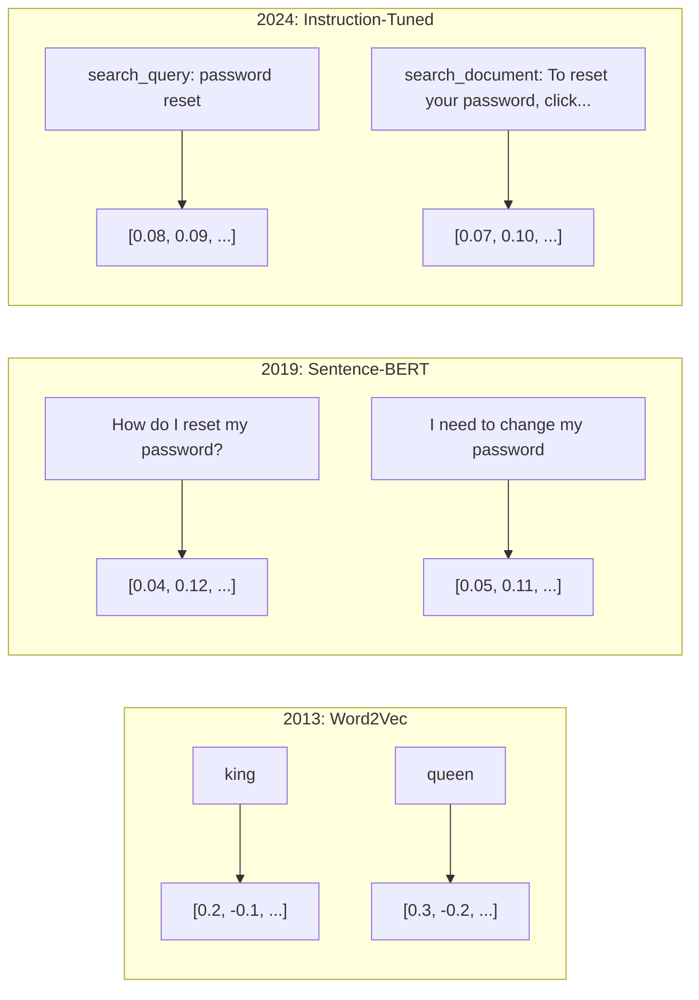
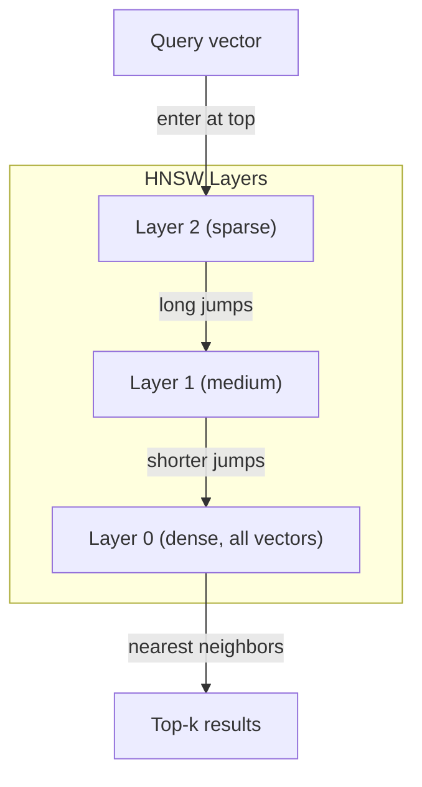
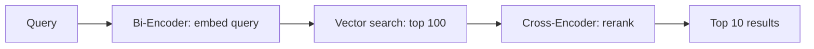

# Embedding'lar ve Vektör Gösterimleri

> Metin ayrıktır. Matematik süreklidir. LLM'tan "benzer" belgeleri bulmasını, anlamları karşılaştırmasını veya anahtar kelimelerin ötesinde arama yapmasını istediğinizde, bu iki dünya arasında bir köprüye güveniyorsunuz demektir. Bu köprü bir embedding. embedding'ları anlamıyorsanız, modern yapay zekayı anlamıyorsunuz demektir. Sadece kullan.

**Tür:** Yapım
**Diller:** Python
**Önkoşullar:** Aşama 11, Ders 01 (Prompt Mühendislik)
**Süre:** ~75 dakika
**İlgili:** Aşama 5 · 22 (Embedding Modellerin Derinlemesine İncelemesi), yoğun, seyrek ve çoklu vektör, Matryoshka kesintisi ve eksen başına model seçimini kapsar. Bu ders üretim hattına (vektör veri tabanları, HNSW, benzerlik matematiği) odaklanır. Bir model seçmeden önce Aşama 5 · 22'yi okuyun.

## Öğrenme Hedefleri

- API sağlayıcıları ve açık kaynak modellerini kullanarak metin embedding'ler oluşturun ve aralarındaki kosinüs benzerliğini hesaplayın
- embedding'lerin, anahtar kelime aramanın çözemediği sözcük dağarcığı uyumsuzluğu sorununu neden çözdüğünü açıklayın
- Belgeleri tam anahtar kelime eşleşmesi yerine anlama göre alan anlamsal bir arama dizini oluşturun
- Alma benchmark'leri (precision@k, geri çağırma) kullanarak embedding kalitesini değerlendirin ve göreviniz için doğru embedding modelini seçin

## Sorun

10.000 destek biletiniz var. Bir müşteri "ödemem gerçekleşmedi" diye yazıyor. Benzer geçmiş biletleri bulmanız gerekiyor. Anahtar kelime araması, "ödeme" ve "tamamlanmadı" ifadelerini içeren biletleri bulur. "İşlem başarısız oldu", "ödeme reddedildi" ve "fatura hatası" gibi ifadeleri gözden kaçırıyor. Bu biletler tamamen aynı sorunu tamamen farklı kelimelerle anlatıyor.

Bu kelime uyumsuzluğu sorunudur. İnsan dilinde aynı şeyi söylemenin onlarca yolu vardır. Anahtar kelime araması, her kelimeyi hiçbir anlamı olmayan bağımsız bir sembol olarak ele alır. "Reddedildi" ile "geçmedi"nin aynı kavramı ifade ettiğini bilemez.

Benzerliği yazımın değil anlamın belirlediği bir metin temsiline ihtiyacınız var. "Ödemem gerçekleşmedi" ve "işlem reddedildi" ifadelerini matematiksel alanda birbirine yakın bir yere yerleştirirken, "ödeme" kelimesini paylaşmanıza rağmen "ödemem zamanında ulaştı" ifadesini çok uzağa itmenin bir yoluna ihtiyacınız var.

Bu temsil bir embedding'dır.

## Konsept

### Embedding Nedir?

embedding, metnin anlamını temsil eden kayan nokta sayılarından oluşan yoğun bir vektördür. "Yoğun" kelimesi önemlidir; çoğu boyutun sıfır olduğu seyrek temsillerin (kelime çantası, TF-IDF) aksine, her boyut bilgi taşır.

"Paspasın üzerinde oturan kedi" `[0.023, -0.041, 0.087, ..., 0.012]` gibi bir şeye dönüşür -- modele bağlı olarak 768 ila 3072 sayıdan oluşan bir liste. Bu sayılar anlamı kodlar. Onları asla doğrudan incelemezsiniz. Bunları karşılaştırırsınız.

### Word2Vec Atılımı

2013 yılında Tomas Mikolov ve Google'daki meslektaşları Word2Vec'i yayınladı. Temel içgörü: bir neural network'yi komşularından (veya bir kelimenin komşularından) bir kelimeyi tahmin etmesi için eğitin ve gizli katman ağırlıkları anlamlı vektör temsilleri haline gelir.

Ünlü sonuç:

```
king - man + woman = queen
```

embedding kelimesindeki vektör aritmetiği anlamsal ilişkileri yakalar. "Erkek"ten "kadın"a doğru yön kabaca "kral"dan "kraliçe"ye doğru olan yönle aynıdır. Bu, alanın geometrinin anlamı kodlayabileceğini fark ettiği andı.

Word2Vec 300 boyutlu vektörler üretti. Bağlamdan bağımsız olarak her kelimeye bir vektör verildi. "Nehir bankası" ve "banka hesabı"ndaki "Banka" aynı embedding'ya sahipti. Bu sınırlama sonraki on yıllık araştırmayı yönlendirdi.

### Kelimelerden Cümlelere

Kelime embedding'ler tekli token'leri temsil eder. Üretim sistemlerinin tüm cümleleri, paragrafları veya belgeleri yerleştirmesi gerekir. Dört yaklaşım ortaya çıktı:

**Ortalama**: cümledeki tüm kelime vektörlerinin ortalamasını alın. Kısa metinler için ucuz, kayıplı ve şaşırtıcı derecede uygun. Kelime sırasını tamamen kaybeder -- "köpek adamı ısırır" ve "adam köpeği ısırır" aynı embedding'leri alır.

**CLS token**: transformer modelleri (BERT, 2018), girdinin tamamını temsil eden özel bir [CLS] token embedding çıktısı verir. Ortalama almaktan daha iyi ama [CLS] token benzerlik için değil sonraki cümle tahmini için eğitilmişti.

**Karşılaştırmalı öğrenme**: Modeli, benzer çiftleri bir araya getirecek ve farklı çiftleri birbirinden ayıracak şekilde açıkça eğitin. Cümle-BERT (Reimers & Gurevych, 2019) bu yaklaşımı kullandı ve modern embedding modellerinin temeli oldu. Verilen "Şifremi nasıl sıfırlarım?" ve "Şifremi değiştirmem gerekiyor", model bunların neredeyse aynı vektörlere sahip olması gerektiğini öğrenir.

**Talimatlara göre ayarlanmış embeddings**: en son yaklaşım. E5 ve GTE gibi modeller, modele ne tür bir embedding üreteceğini söyleyen bir görev önekini ("search_query:", "search_document:") kabul eder. Bu, bir modelin birden fazla göreve hizmet etmesini sağlar.



### Modern Embedding Modelleri

Pazar, bir avuç üretim sınıfı seçeneğe yerleşmiş durumda (MTEB 2026'nın başlarındaki puanlar, MTEB v2):

| Modeli | Sağlayıcı | Boyutlar | METEB | Bağlam | Maliyet / 1 Milyon tokens |
|-------|----------|-----------|------|---------|------------------|
| İkizler burcu Embedding 2 | Google | 3072 (Matryoshka) | 67.7 (geri alma) | 8192 | 0,15$ |
| yerleştirme-v4 | Tutarlı | 1024 (Matryoshka) | 65.2 | 128K | 0,12$ |
| yolculuk-4 | Yapay Zeka Yolculuğu | 1024/2048 (Matryoshka) | 66.8 | 32K | 0,12$ |
| text-embedding-3-large | OpenAI | 3072 (Matryoshka) | 64.6 | 8192 | 0,13$ |
| text-embedding-3-small | OpenAI | 1536 (Matryoshka) | 62.3 | 8192 | 0,02$ |
| BGE-M3 | BAAI | 1024 (yoğun+seyrek+ColBERT) | 63.0 çok dilli | 8192 | Açık ağırlık |
| Qwen3-Embedding | Alibaba | 4096 (Matryoshka) | 66.9 | 32K | Açık ağırlık |
| Nomic-embed-v2 | Nomik | 768 (Matryoshka) | 63.1 | 8192 | Açık ağırlık |

MTEB (Massive Text Embedding Benchmark) v2, alma, sınıflandırma, kümeleme, yeniden sıralama ve özetleme genelinde 100'den fazla görevi kapsar. Daha yüksek daha iyidir. 2026 yılına gelindiğinde, açık ağırlıklı modeller (Qwen3-Embedding, BGE-M3) çoğu eksende kapalı barındırılan modellerle eşleşiyor veya onları geçiyor. İkizler Embedding 2 saf geri kazanıma öncülük eder; Voyage/Cohere belirli alanlara öncülük eder (finans, hukuk, kod). Taahhüt etmeden önce daima kendi sorgularınızda benchmark.

### Benzerlik Metrikleri

İki embedding vektör verildiğinde bunların ne kadar benzer olduğunu ölçmenin üç yolu vardır:

**Kosinüs benzerliği**: iki vektör arasındaki açının kosinüsü. -1 (ters) ile 1 (aynı yön) arasında değişir. Büyüklüğü göz ardı eder; 10 kelimelik bir cümle ve 500 kelimelik bir belge aynı yönü işaret ediyorsa 1,0 puan alabilir. Bu, kullanım durumlarının %90'ı için varsayılandır.

```
cosine_sim(a, b) = dot(a, b) / (||a|| * ||b||)
```

**Nokta çarpım**: iki vektörün ham iç çarpımı. Vektörler normalleştirildiğinde (birim uzunluk) kosinüs benzerliğine özdeştir. Daha hızlı hesaplama. OpenAI'nin embedding'leri normalleştirilmiştir, dolayısıyla nokta çarpım ve kosinüs aynı sıralamayı verir.

```
dot(a, b) = sum(a_i * b_i)
```

**Öklid (L2) mesafesi**: vektör uzayında düz çizgi mesafesi. Daha küçük = daha benzer. Büyüklük farklılıklarına duyarlıdır. Yalnızca yönün değil, uzaydaki mutlak konumun da önemli olduğu durumlarda kullanın.

```
L2(a, b) = sqrt(sum((a_i - b_i)^2))
```

Hangisi ne zaman kullanılır:

| Metrik | Şu durumlarda kullanın | Ne zaman kaçının |
|--------|----------|------------|
| Kosinüs benzerliği | Farklı uzunluktaki metinlerin karşılaştırılması; çoğu geri alma görevi | Büyüklük bilgi taşır |
| Nokta ürünü | Embedding'lar zaten normalleştirildi; maksimum hız | Vektörlerin büyüklükleri farklıdır |
| Öklid mesafesi | Kümeleme; mekansal en yakın komşu problemleri | Oldukça farklı uzunluklardaki belgeleri karşılaştırma |

### Vector Database'lar ve HNSW

Kaba kuvvet benzerlik araması, sorguyu depolanan her vektörle karşılaştırır. 1536 boyuta sahip 1 milyon vektör, yani sorgu başına 1,5 milyar çarpma-ekleme işlemi anlamına gelir. Çok yavaş.

Vector database'lar bunu Yaklaşık En Yakın Komşu (ANN) algoritmalarıyla çözüyorlar. Baskın algoritma HNSW'dir (Hiyerarşik Gezinilebilir Küçük Dünya):

1. Çok katmanlı bir vektör grafiği oluşturun
2. Üst katmanlar seyrektir; uzak kümeler arasındaki uzun menzilli bağlantılar
3. Alt katmanlar yoğundur; yakındaki vektörler arasındaki ince taneli bağlantılar
4. Arama en üst katmandan başlar ve hassaslaştırmak için açgözlülükle aşağıya doğru iner
5. O(n) yerine O(log n) zamanında yaklaşık en iyi k sonuçlarını döndürür

HNSW, büyük hız kazanımları için küçük bir doğruluk kaybıyla (genellikle %95-99 geri çağırma) işlem yapar. 10 milyon vektörde kaba kuvvet saniyeler sürer. HNSW milisaniye sürer.



Üretim seçenekleri:

| Veritabanı | Tür | Şunun için en iyisi | Maksimum ölçek |
|----------|------|----------|-----------|
| Çam kozalağı | Yönetilen SaaS | Sıfır işlemli üretim | Milyarlarca |
| Dokuma | Açık kaynak | Kendi kendine barındırılan, hibrit arama | 100M+ |
| Qdrant | Açık kaynak | Yüksek performans, filtreleme | 100M+ |
| ChromaDB | Gömülü | Prototip oluşturma, yerel geliştirme | 1 milyon |
| pgvektör | Postgres uzantısı | Zaten Postgres kullanıyor | 10 milyon |
| FAISS | Kütüphane | Süreç içi araştırma | 1B+ |

### Parçalama Stratejileri

Belgeler tek vektör olarak yerleştirilemeyecek kadar uzun. 50 sayfalık bir PDF düzinelerce konuyu kapsar; embedding, belirli hiçbir şeye benzemeyen, her şeyin ortalaması haline gelir. Belgeleri parçalara böler ve her birini yerleştirirsiniz.

**Sabit boyutlu parçalama**: her N token'yi M-token örtüşmesiyle bölün. Basit ve öngörülebilir. Belgelerin net bir yapısı olmadığında iyi çalışır. 50-token örtüşmeli 512-token yığını: 1. parça tokens 0-511'dir, 2. parça ise tokens 462-973'tür.

**Cümle tabanlı parçalama**: cümle sınırlarında bölme, cümleleri token sınırına ulaşana kadar gruplandırma. Her parça en az bir tam cümleden oluşur. Sabit boyuttan daha iyidir çünkü asla bir düşünceyi ikiye bölmezsiniz.

**Özyinelemeli parçalama**: Önce en büyük sınırdan (bölüm başlıkları) bölmeyi deneyin. Hala çok büyükse paragraf sınırlarını deneyin. Daha sonra cümle sınırları. Daha sonra karakter sınırlamaları. Bu LangChain'in `RecursiveCharacterTextSplitter`'sidir ve karma formatlı şirketler için iyi çalışır.

**Anlamsal parçalama**: Her cümleyi yerleştirin, ardından embedding'ları benzer olan ardışık cümleleri gruplandırın. embedding benzerliği bir eşiğin altına düştüğünde yeni bir yığın başlatın. Pahalıdır (her cümleyi ayrı ayrı embedding gerektirir) ancak en tutarlı parçaları üretir.

| Strateji | Karmaşıklık | Kalite | Şunun için en iyisi |
|----------|-----------|---------|----------|
| Sabit boyutlu | Düşük | İyi | Yapılandırılmamış metin, günlükler |
| Cümle tabanlı | Düşük | İyi | Makaleler, e-postalar |
| Özyinelemeli | Orta | İyi | Markdown, HTML, karma belgeler |
| Anlamsal | Yüksek | En İyi | Kritik erişim kalitesi |

Çoğu sistem için en uygun nokta: 50-token örtüşme ile 256-512 token parça.

### Çift Kodlayıcılar ve Çapraz Kodlayıcılar

Çift kodlayıcı, sorguyu ve belgeleri bağımsız olarak gömer ve ardından vektörleri karşılaştırır. Hızlı -- sorguyu bir kez yerleştirirsiniz ve önceden hesaplanmış embedding belgesiyle karşılaştırırsınız. Bu, geri almak için kullandığınız şeydir.

Çapraz kodlayıcı, sorguyu ve belgeyi tek bir giriş olarak alır ve bir alaka puanı verir. Yavaş - her sorgu-belge çiftini tam model boyunca işler. Ancak çok daha doğru çünkü sorgu ve belge token'lerine aynı anda katılabiliyor.

Üretim modeli: çift kodlayıcı ilk 100 adayı alır, çapraz kodlayıcı bunları ilk 10'a yeniden sıralar. Bu, geri alma ve ardından yeniden sıralama hattıdır.



Yeniden sıralama modelleri: Cohere Reranker 3,5 (1000 sorgu başına 2 ABD doları), BGE-reranker-v2 (ücretsiz, açık kaynak), Jina Reranker v2 (ücretsiz, açık kaynak).

### Matryoshka Embeddings

Geleneksel embedding'lar ya hep ya hiçtir. 1536 boyutlu bir vektör 1536 kayan nokta kullanır. Yeniden eğitim almadan boyutu 256 boyuta indiremezsiniz.

Matryoshka Temsil Öğrenimi (Kusupati ve diğerleri, 2022) bunu düzeltir. Model, Rus iç içe geçmiş bebek gibi, ilk N boyutu en önemli bilgiyi yakalayacak şekilde eğitilmiştir. 1536-d Matryoshka embedding boyutunun 256'ya kesilmesi doğruluğu bir miktar kaybeder ancak işlevsel kalır.

OpenAI'nin text-embedding-3-small ve text-embedding-3-large'si, `dimensions` parametresi aracılığıyla Matryoshka'nın kesilmesini destekler. 1536 yerine 256 boyutun talep edilmesi, depolamayı 6 kat azaltır ve MTEB benchmark'lerde kabaca %3-5 doğruluk kaybı olur.

### İkili Niceleme

Float32 olarak depolanan 1536 boyutlu bir embedding, 6.144 bayt kullanır. 10 milyon belgeyle çarpın: Yalnızca vektörler için 61 GB.

İkili nicemleme, her kayan noktayı tek bir bit'e dönüştürür: pozitif değerler 1 olur, negatif değerler 0 olur. Depolama 6.144 bayttan 192 bayta düşer - 32 kat azalma. Benzerlik, CPU'ların tek bir talimatta yapabileceği Hamming mesafesi (farklı bitleri sayma) kullanılarak hesaplanır.

Geri çağırma sırasında doğruluk oranı %5-10 civarındadır. Ortak model: Milyonlarca vektör üzerinde ilk geçiş araması için ikili nicemleme, ardından ilk 1000'i tam duyarlıklı vektörlerle yeniden puanlamak. Bu size 32 kat daha az bellekle %95'in üzerinde tam hassasiyetli doğruluk sağlar.

```figure
cosine-similarity
```

## İnşa Et

Sıfırdan anlamsal bir arama motoru oluşturuyoruz. Hayır vector database. Harici embedding API yok. Matematik için numpy ile saf Python.

### Adım 1: Metin Parçalama

```python
def chunk_text(text, chunk_size=200, overlap=50):
    words = text.split()
    chunks = []
    start = 0
    while start < len(words):
        end = start + chunk_size
        chunk = " ".join(words[start:end])
        chunks.append(chunk)
        start += chunk_size - overlap
    return chunks


def chunk_by_sentences(text, max_chunk_tokens=200):
    sentences = text.replace("\n", " ").split(".")
    sentences = [s.strip() + "." for s in sentences if s.strip()]
    chunks = []
    current_chunk = []
    current_length = 0
    for sentence in sentences:
        sentence_length = len(sentence.split())
        if current_length + sentence_length > max_chunk_tokens and current_chunk:
            chunks.append(" ".join(current_chunk))
            current_chunk = []
            current_length = 0
        current_chunk.append(sentence)
        current_length += sentence_length
    if current_chunk:
        chunks.append(" ".join(current_chunk))
    return chunks
```

### Adım 2: Sıfırdan Embedding'lar Oluşturmak

L2 normalleştirmeli TF-IDF'yi kullanarak basit yoğun bir embedding uyguluyoruz. Bu bir sinirsel embedding değildir, ancak aynı sözleşmeyi takip eder: metin girer, sabit boyutlu vektör çıkar, benzer metinler benzer vektörler üretir.

```python
import math
import numpy as np
from collections import Counter

class SimpleEmbedder:
    def __init__(self):
        self.vocab = []
        self.idf = []
        self.word_to_idx = {}

    def fit(self, documents):
        vocab_set = set()
        for doc in documents:
            vocab_set.update(doc.lower().split())
        self.vocab = sorted(vocab_set)
        self.word_to_idx = {w: i for i, w in enumerate(self.vocab)}
        n = len(documents)
        self.idf = np.zeros(len(self.vocab))
        for i, word in enumerate(self.vocab):
            doc_count = sum(1 for doc in documents if word in doc.lower().split())
            self.idf[i] = math.log((n + 1) / (doc_count + 1)) + 1

    def embed(self, text):
        words = text.lower().split()
        count = Counter(words)
        total = len(words) if words else 1
        vec = np.zeros(len(self.vocab))
        for word, freq in count.items():
            if word in self.word_to_idx:
                tf = freq / total
                vec[self.word_to_idx[word]] = tf * self.idf[self.word_to_idx[word]]
        norm = np.linalg.norm(vec)
        if norm > 0:
            vec = vec / norm
        return vec
```

### Adım 3: Benzerlik Fonksiyonları

```python
def cosine_similarity(a, b):
    dot = np.dot(a, b)
    norm_a = np.linalg.norm(a)
    norm_b = np.linalg.norm(b)
    if norm_a == 0 or norm_b == 0:
        return 0.0
    return float(dot / (norm_a * norm_b))


def dot_product(a, b):
    return float(np.dot(a, b))


def euclidean_distance(a, b):
    return float(np.linalg.norm(a - b))
```

### Adım 4: Kaba Kuvvet Arama ile Vektör Dizini

```python
class VectorIndex:
    def __init__(self):
        self.vectors = []
        self.texts = []
        self.metadata = []

    def add(self, vector, text, meta=None):
        self.vectors.append(vector)
        self.texts.append(text)
        self.metadata.append(meta or {})

    def search(self, query_vector, top_k=5, metric="cosine"):
        scores = []
        for i, vec in enumerate(self.vectors):
            if metric == "cosine":
                score = cosine_similarity(query_vector, vec)
            elif metric == "dot":
                score = dot_product(query_vector, vec)
            elif metric == "euclidean":
                score = -euclidean_distance(query_vector, vec)
            else:
                raise ValueError(f"Unknown metric: {metric}")
            scores.append((i, score))
        scores.sort(key=lambda x: x[1], reverse=True)
        results = []
        for idx, score in scores[:top_k]:
            results.append({
                "text": self.texts[idx],
                "score": score,
                "metadata": self.metadata[idx],
                "index": idx
            })
        return results

    def size(self):
        return len(self.vectors)
```

### Adım 5: Semantik Arama Motoru

```python
class SemanticSearchEngine:
    def __init__(self, chunk_size=200, overlap=50):
        self.embedder = SimpleEmbedder()
        self.index = VectorIndex()
        self.chunk_size = chunk_size
        self.overlap = overlap

    def index_documents(self, documents, source_names=None):
        all_chunks = []
        all_sources = []
        for i, doc in enumerate(documents):
            chunks = chunk_text(doc, self.chunk_size, self.overlap)
            all_chunks.extend(chunks)
            name = source_names[i] if source_names else f"doc_{i}"
            all_sources.extend([name] * len(chunks))
        self.embedder.fit(all_chunks)
        for chunk, source in zip(all_chunks, all_sources):
            vec = self.embedder.embed(chunk)
            self.index.add(vec, chunk, {"source": source})
        return len(all_chunks)

    def search(self, query, top_k=5, metric="cosine"):
        query_vec = self.embedder.embed(query)
        return self.index.search(query_vec, top_k, metric)

    def search_with_scores(self, query, top_k=5):
        results = self.search(query, top_k)
        return [
            {
                "text": r["text"][:200],
                "source": r["metadata"].get("source", "unknown"),
                "score": round(r["score"], 4)
            }
            for r in results
        ]
```

### Adım 6: Benzerlik Metriklerini Karşılaştırma

```python
def compare_metrics(engine, query, top_k=3):
    results = {}
    for metric in ["cosine", "dot", "euclidean"]:
        hits = engine.search(query, top_k=top_k, metric=metric)
        results[metric] = [
            {"score": round(h["score"], 4), "preview": h["text"][:80]}
            for h in hits
        ]
    return results
```

## Kullan onu

Üretim embedding API'si ile mimari aynı kalır. Yalnızca yerleştirici değişir:

```python
from openai import OpenAI

client = OpenAI()

def openai_embed(texts, model="text-embedding-3-small", dimensions=None):
    kwargs = {"model": model, "input": texts}
    if dimensions:
        kwargs["dimensions"] = dimensions
    response = client.embeddings.create(**kwargs)
    return [item.embedding for item in response.data]
```

OpenAI ile Matryoshka'nın kesilmesi -- aynı model, daha az boyut, daha düşük depolama:

```python
full = openai_embed(["semantic search query"], dimensions=1536)
compact = openai_embed(["semantic search query"], dimensions=256)
```

256-d vektörü 6 kat daha az depolama kullanır. 10 milyon belge için bu 10 GB ve 61 GB'dir. Doğruluk kaybı standart benchmark'larda kabaca %3-5'tir.

Cohere ile yeniden sıralama için:

```python
import cohere

co = cohere.ClientV2()

results = co.rerank(
    model="rerank-v3.5",
    query="What is the refund policy?",
    documents=["Full refund within 30 days...", "No refunds after 90 days..."],
    top_n=3
)
```

API bağımlılığı olmayan yerel embedding'ler için:

```python
from sentence_transformers import SentenceTransformer

model = SentenceTransformer("BAAI/bge-small-en-v1.5")
embeddings = model.encode(["semantic search query", "another document"])
```

Yapımızdaki VectorIndex sınıfı bunlardan herhangi biriyle çalışır. embedding fonksiyonunu değiştirin, arama mantığını koruyun.

## Gönderin

Bu ders şunları üretir:
- `outputs/prompt-embedding-advisor.md` -- belirli kullanım durumları için embedding model ve stratejilerini seçmek için bir prompt
- `outputs/skill-embedding-patterns.md` -- agent'lara, embedding'ları üretimde etkili bir şekilde nasıl kullanacaklarını öğreten bir beceri

## Egzersizler

1. **Metrik karşılaştırma**: kosinüs benzerliği, nokta çarpımı ve öklit uzaklığını kullanarak aynı 5 sorguyu örnek belgelerde çalıştırın. Her biri için ilk 3 sonucu kaydedin. Metrikler hangi sorgular için uyuşmuyor? Neden?

2. **Yığın boyutu deneyi**: 50, 100, 200 ve 500 kelimelik yığın boyutlarına sahip örnek belgeleri dizinleyin. Her biri için 5 sorgu çalıştırın ve ilk 1 benzerlik puanını kaydedin. Parça boyutu ile erişim kalitesi arasındaki ilişkiyi çizin. Daha büyük parçaların acı vermeye başladığı noktayı bulun.

3. **Matryoshka simülasyonu**: 500 boyutlu vektörler üreten bir SimpleEmbedder oluşturun. 50, 100, 200 ve 500 boyutlara kesin. Her kesmede geri çağırmanın nasıl bozulduğunu ölçün. Bu, gerçek eğitim numarasına ihtiyaç duymadan Matryoshka davranışını simüle eder.

4. **İkili niceleme**: arama motorundan embedding'ları alın, bunları ikiliye dönüştürün (pozitifse 1, negatifse 0) ve Hamming mesafe aramasını uygulayın. İlk 10 sonucu tam duyarlı kosinüs benzerliğiyle karşılaştırın. Örtüşme yüzdesini ölçün.

5. **Cümle tabanlı parçalama**: sabit boyutlu parçalamayı `chunk_by_sentences` ile değiştirin. Aynı sorguları çalıştırın ve alma puanlarını karşılaştırın. Cümle sınırlarına saygı duymak sonuçları iyileştirir mi?

## Anahtar Terimler

| Dönem | İnsanlar ne diyor | Aslında ne anlama geliyor |
|------|----------------|----------------------|
| Embedding | "Sayılara metin" | Geometrik yakınlığın anlamsal benzerliği kodladığı yoğun bir vektör |
| Word2Vec | "OG embedding" | Bağlam sözcüklerini tahmin ederek sözcük vektörlerini öğrenen 2013 modeli; kanıtlanmış vektör aritmetiği anlamı kodlar |
| Kosinüs benzerliği | "İki vektör ne kadar benzer" | Vektörler arasındaki açının kosinüsü; 1 = aynı yön, 0 = dik, -1 = zıt |
| HNSW | "Hızlı vektör arama" | Hiyerarşik Gezinilebilir Küçük Dünya grafiği - O(log n) yaklaşık en yakın komşu aramasını mümkün kılan çok katmanlı yapı |
| Çift kodlayıcı | "Ayrı olarak ekleyin, hızlı karşılaştırın" | Sorguyu ve belgeyi bağımsız olarak vektörlere kodlar; ön hesaplamaya ve hızlı erişime olanak sağlar |
| Çapraz kodlayıcı | "Yavaş ama doğru yeniden sıralama" | Sorgu-belge çiftini tam model boyunca ortaklaşa işler; daha yüksek doğruluk, ön hesaplama gerektirmez |
| Matryoshka embeddings | "Kesilebilir vektörler" | Embeddingilk N boyutun en önemli bilgileri yakalayacağı ve değişken boyutlu depolamaya olanak tanıyacak şekilde eğitilmiştir |
| İkili nicemleme | "1 bit embedding'ler" | Hamming mesafe araması ile depolamayı 32 kat azaltmak için kayan nokta vektörlerini ikiliye (yalnızca işaret biti) dönüştürme |
| Parçalama | "Belgeleri embedding için böl" | Her birinin bağımsız olarak yerleştirilebilmesi ve alınabilmesi için belgeleri 256-512 token segmente ayırma |
| Vector database | "embedding'lar için arama motoru" | Vektörleri depolamak ve uygun ölçekte yaklaşık en yakın komşu aramasını gerçekleştirmek için optimize edilmiş veri deposu |
| Karşılaştırmalı öğrenme | "Karşılaştırmalı eğitim" | Benzer embedding çiftlerini bir araya, farklı embedding çiftlerini ise birbirinden ayıran eğitim yaklaşımı |
| METEB | "embedding benchmark" | Büyük Metin Embedding Benchmark -- 8 görevde 56 dataset; embedding modellerinin karşılaştırılması için standart |

## Daha Fazla Okuma

- Mikolov ve diğerleri, "Vektör Uzayında Kelime Temsillerinin Verimli Tahmini" (2013) -- kral-kraliçe analojisiyle embedding devrimini başlatan Word2Vec makalesi
- Reimers & Gurevych, "Cümle-BERT: Siyam BERT-Ağlarını kullanan Cümle Embedding'ler" (2019) -- cümle düzeyinde benzerlik için iki kodlayıcıların nasıl eğitileceği, modern embedding modellerinin temeli
- Kusupati ve diğerleri, "Matryoshka Temsil Öğrenimi" (2022) -- OpenAI'nin metin-embedding-3 için benimsediği değişken boyutlu embedding'ların arkasındaki teknik
- Malkov ve Yashunin, "Hiyerarşik Gezinilebilir Küçük Dünya Grafiklerini Kullanan Verimli ve Sağlam Yaklaşık En Yakın Komşu" (2018) -- HNSW makalesi, çoğu üretim vektör aramasının arkasındaki algoritma
- OpenAI EmbeddingKılavuzu (platform.openai.com/docs/guides/embeddings) -- Matryoshka boyut küçültme dahil text-embedding-3 modelleri için pratik referans
- MTEB Skor Tablosu (huggingface.co/spaces/mteb/leaderboard) -- görevler ve diller genelinde tüm embedding modellerini karşılaştıran canlı benchmark
- [Muennighoff ve diğerleri, "MTEB: Massive Text Embedding Benchmark" (EACL 2023)](https://arxiv.org/abs/2210.07316) -- skor tablosunun rapor ettiği 8 görev kategorisini (sınıflandırma, kümeleme, çift sınıflandırma, yeniden sıralama, geri alma, STS, özetleme, çift metin madenciliği) tanımlayan benchmark; Herhangi bir METEB puanına güvenmeden önce okuyun.
- [Cümle Transformerbelgeleri](https://www.sbert.net/) -- çift kodlayıcı ile çapraz kodlayıcı karşılaştırması, havuz oluşturma stratejileri ve bu dersin uyguladığı alma-bölme-yerleştirme-depolama RAG ardışık düzeni için kanonik referans.
