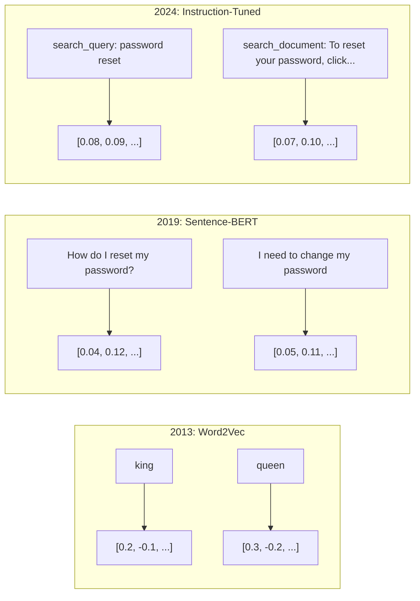
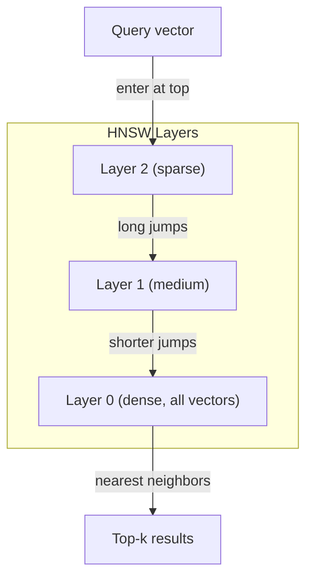
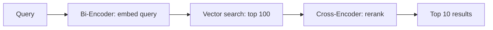

# 嵌入与向量表示

> 文本是离散的。数学是连续的。每次你让LLM查找"相似"文档、比较含义或超越关键词进行搜索时，你都依赖于连接这两个世界的桥梁。那座桥梁就是嵌入。如果你不理解嵌入，你就不理解现代AI。你只是在使用它。

**类型：** Build
**语言：** Python
**前置知识：** 第11阶段，第01课（Prompt Engineering）
**时间：** ~75分钟
**相关：** 第5阶段 · 22（嵌入模型深度解析）涵盖稠密 vs 稀疏 vs 多向量、Matryoshka截断和按轴模型选择。本课聚焦于生产pipeline（向量数据库、HNSW、相似度计算）。在选择模型之前先阅读第5阶段 · 22。

## 学习目标

- 使用API提供商和开源模型生成文本嵌入，并计算它们之间的余弦相似度
- 解释为什么嵌入能解决关键词搜索无法处理的词汇不匹配问题
- 构建语义搜索索引，通过含义而非精确关键词匹配来检索文档
- 使用检索基准（precision@k、recall）评估嵌入质量，并为你的任务选择合适的嵌入模型

## 问题背景

你有10,000张支持工单。一位客户写道"my payment didn't go through"。你需要找到相似的过往工单。关键词搜索找到包含"payment"和"didn't go through"的工单。它漏掉了"transaction failed"、"charge was declined"和"billing error"。这些工单用完全不同的词描述了完全相同的问题。

这就是词汇不匹配问题。人类语言有数十种方式表达同一件事。关键词搜索将每个词视为独立的符号，没有含义。它无法知道"declined"和"didn't go through"指的是同一个概念。

你需要一种文本表示方式，其中含义而非拼写决定相似性。你需要一种方法，将"my payment didn't go through"和"transaction was declined"放在某个数学空间中彼此靠近的位置，同时将"my payment arrived on time"推远，尽管它们共享"payment"这个词。

这种表示方式就是嵌入。

## 核心概念

### 什么是嵌入？

嵌入是一个稠密的浮点数向量，代表文本的含义。"稠密"这个词很重要——每个维度都携带信息，不像稀疏表示（词袋、TF-IDF）中大多数维度为零。

"The cat sat on the mat"变成类似 `[0.023, -0.041, 0.087, ..., 0.012]` 的东西——一个包含768到3072个数字的列表，取决于模型。这些数字编码了含义。你永远不会直接检查它们。你比较它们。

### Word2Vec突破

2013年，Tomas Mikolov和Google的同事发表了Word2Vec。核心洞察：训练神经网络从邻居预测单词（或从单词预测邻居），隐藏层权重就变成了有意义的向量表示。

著名的结果：

```
king - man + woman = queen
```

词嵌入上的向量运算捕获了语义关系。从"man"到"woman"的方向大致与从"king"到"queen"的方向相同。这是该领域意识到几何可以编码含义的时刻。

Word2Vec产生300维向量。每个词得到一个向量，无论上下文如何。"river bank"和"bank account"中的"bank"有相同的嵌入。这一局限性推动了接下来十年的研究。

### 从词到句子

词嵌入表示单个token。生产系统需要嵌入整个句子、段落或文档。出现了四种方法：

**Averaging**：取句子中所有词向量的均值。便宜、有损、对短文本出奇地不错。完全丢失词序——"dog bites man"和"man bites dog"得到相同的嵌入。

**CLS token**：transformer模型（BERT，2018）输出一个特殊的[CLS] token嵌入，代表整个输入。比averaging好，但[CLS] token是为下一句预测训练的，不是为相似性。

**Contrastive learning**：显式训练模型将相似对拉近、不相似对推远。Sentence-BERT（Reimers & Gurevych，2019）使用了这种方法，成为现代嵌入模型的基础。给定"How do I reset my password?"和"I need to change my password"，模型学习这些应该有几乎相同的向量。

**Instruction-tuned embeddings**：最新方法。E5和GTE等模型接受任务前缀（"search_query:"、"search_document:"），告诉模型产生哪种嵌入。这让一个模型可以服务多个任务。



### 现代嵌入模型

市场已经沉淀为少数几个生产级选项（2026年初MTEB分数，MTEB v2）：

| 模型 | 提供商 | 维度 | MTEB | 上下文 | 成本 / 1M tokens |
|-------|----------|-----------|------|---------|------------------|
| Gemini Embedding 2 | Google | 3072 (Matryoshka) | 67.7 (retrieval) | 8192 | $0.15 |
| embed-v4 | Cohere | 1024 (Matryoshka) | 65.2 | 128K | $0.12 |
| voyage-4 | Voyage AI | 1024/2048 (Matryoshka) | 66.8 | 32K | $0.12 |
| text-embedding-3-large | OpenAI | 3072 (Matryoshka) | 64.6 | 8192 | $0.13 |
| text-embedding-3-small | OpenAI | 1536 (Matryoshka) | 62.3 | 8192 | $0.02 |
| BGE-M3 | BAAI | 1024 (dense+sparse+ColBERT) | 63.0 multilingual | 8192 | Open-weight |
| Qwen3-Embedding | Alibaba | 4096 (Matryoshka) | 66.9 | 32K | Open-weight |
| Nomic-embed-v2 | Nomic | 768 (Matryoshka) | 63.1 | 8192 | Open-weight |

MTEB（Massive Text Embedding Benchmark）v2涵盖检索、分类、聚类、重排序和摘要等100+任务。越高越好。到2026年，开源模型（Qwen3-Embedding、BGE-M3）在大多数维度上匹配或击败闭源托管模型。Gemini Embedding 2领先纯检索；Voyage/Cohere领先特定领域（金融、法律、代码）。在投入之前，始终在你自己的查询上跑基准测试。

### 相似度指标

给定两个嵌入向量，三种衡量它们相似程度的方法：

**Cosine similarity**：两个向量之间夹角的余弦。范围从-1（相反）到1（相同方向）。忽略幅度——一个10词句子和一个500词文档如果指向同一方向可以得1.0。这是90%用例的默认选择。

```
cosine_sim(a, b) = dot(a, b) / (||a|| * ||b||)
```

**Dot product**：两个向量的原始内积。当向量归一化（单位长度）时与余弦相似度相同。计算更快。OpenAI的嵌入是归一化的，所以点积和余弦给出相同的排序。

```
dot(a, b) = sum(a_i * b_i)
```

**Euclidean (L2) distance**：向量空间中的直线距离。越小=越相似。对幅度差异敏感。当空间中绝对位置重要而不仅仅是方向时使用。

```
L2(a, b) = sqrt(sum((a_i - b_i)^2))
```

何时使用哪个：

| 指标 | 何时使用 | 何时避免 |
|--------|----------|------------|
| Cosine similarity | 比较不同长度的文本；大多数检索任务 | 幅度携带信息时 |
| Dot product | 嵌入已归一化；追求最大速度 | 向量有不同幅度时 |
| Euclidean distance | 聚类；空间最近邻问题 | 比较长度 wildly 不同的文档时 |

### 向量数据库与HNSW

暴力相似度搜索将查询与每个存储的向量比较。100万个1536维向量，每次查询就是15亿次乘加运算。太慢了。

向量数据库用Approximate Nearest Neighbor（ANN）算法解决这个问题。主导算法是HNSW（Hierarchical Navigable Small World）：

1. 构建向量的多层图
2. 顶层稀疏——远距离聚类之间的长程连接
3. 底层稠密——附近向量之间的细粒度连接
4. 搜索从顶层开始，贪婪下降以细化
5. 以O(log n)时间返回近似top-k结果，而非O(n)

HNSW以小的精度损失（通常95-99%召回率）换取巨大的速度提升。1000万向量时，暴力搜索需要秒级。HNSW需要毫秒级。



生产选项：

| 数据库 | 类型 | 最佳适用 | 最大规模 |
|----------|------|----------|-----------|
| Pinecone | 托管SaaS | 零运维生产 | 数十亿 |
| Weaviate | 开源 | 自托管，混合搜索 | 1亿+ |
| Qdrant | 开源 | 高性能，过滤 | 1亿+ |
| ChromaDB | 嵌入式 | 原型设计，本地开发 | 100万 |
| pgvector | Postgres扩展 | 已使用Postgres | 1000万 |
| FAISS | 库 | 进程内，研究 | 10亿+ |

### 分块策略

文档太长，无法作为单个向量嵌入。一份50页的PDF涵盖数十个主题——它的嵌入变成了所有内容的平均，与任何具体内容都不相似。你将文档分成块，每个块单独嵌入。

**Fixed-size chunking**：每N个token切分，M个token重叠。简单且可预测。当文档没有清晰结构时效果很好。512 token块，50 token重叠：块1是token 0-511，块2是token 462-973。

**Sentence-based chunking**：在句子边界处切分，将句子分组直到达到token限制。每个块至少是一个完整句子。比fixed-size好，因为你永远不会把想法切成两半。

**Recursive chunking**：首先尝试在最大边界处切分（章节标题）。如果仍然太大，尝试段落边界。然后句子边界。然后字符限制。这是LangChain的 `RecursiveCharacterTextSplitter`，对混合格式语料库效果很好。

**Semantic chunking**：嵌入每个句子，然后将嵌入相似的连续句子分组。当嵌入相似度低于阈值时，开始新块。昂贵（需要单独嵌入每个句子）但产生最连贯的块。

| 策略 | 复杂度 | 质量 | 最佳适用 |
|----------|-----------|---------|----------|
| Fixed-size | 低 | 尚可 | 非结构化文本、日志 |
| Sentence-based | 低 | 好 | 文章、邮件 |
| Recursive | 中 | 好 | Markdown、HTML、混合文档 |
| Semantic | 高 | 最佳 | 关键检索质量 |

大多数系统的最佳点：256-512 token块，50 token重叠。

### Bi-Encoders vs Cross-Encoders

Bi-encoder独立嵌入查询和文档，然后比较向量。快——你嵌入查询一次，与预计算的文档嵌入比较。这是你用于检索的。

Cross-encoder将查询和文档作为单个输入，输出相关性分数。慢——它通过完整模型处理每个查询-文档对。但准确得多，因为它可以同时关注查询和文档token。

生产模式：bi-encoder检索top-100候选，cross-encoder重排序到top-10。这就是retrieve-then-rerank pipeline。



重排序模型：Cohere Rerank 3.5（每1000查询$2）、BGE-reranker-v2（免费，开源）、Jina Reranker v2（免费，开源）。

### Matryoshka嵌入

传统嵌入是全有或全无的。1536维向量使用1536个浮点数。你不能截断到256维而不重新训练。

Matryoshka Representation Learning（Kusupati等人，2022）解决了这个问题。模型被训练成前N维捕获最重要的信息，就像俄罗斯套娃。将1536维Matryoshka嵌入截断到256维会损失一些精度，但仍然可用。

OpenAI的text-embedding-3-small和text-embedding-3-large通过 `dimensions` 参数支持Matryoshka截断。请求256维而非1536维，存储减少6倍，MTEB基准上大约3-5%的精度损失。

### 二值量化

1536维嵌入以float32存储使用6,144字节。乘以1000万文档：仅向量就需要61 GB。

二值量化将每个浮点数转换为单个比特：正值变1，负值变0。存储从6,144字节降到192字节——32倍减少。相似度使用Hamming距离计算（计算不同比特数），CPU可以单条指令完成。

精度损失约为检索召回率的5-10%。常见模式：对数百万向量的首轮搜索使用二值量化，然后用全精度向量对top-1000重新打分。这在32倍更少内存下获得95%+的全精度精度。

## 动手构建

我们从零构建语义搜索引擎。没有向量数据库。没有外部嵌入API。纯Python配合numpy做数学运算。

### 步骤1：文本分块

```python
def chunk_text(text, chunk_size=200, overlap=50):
    words = text.split()
    chunks = []
    start = 0
    while start < len(words):
        end = start + chunk_size
        chunk = " ".join(words[start:end])
        chunks.append(chunk)
        start += chunk_size - overlap
    return chunks


def chunk_by_sentences(text, max_chunk_tokens=200):
    sentences = text.replace("\n", " ").split(".")
    sentences = [s.strip() + "." for s in sentences if s.strip()]
    chunks = []
    current_chunk = []
    current_length = 0
    for sentence in sentences:
        sentence_length = len(sentence.split())
        if current_length + sentence_length > max_chunk_tokens and current_chunk:
            chunks.append(" ".join(current_chunk))
            current_chunk = []
            current_length = 0
        current_chunk.append(sentence)
        current_length += sentence_length
    if current_chunk:
        chunks.append(" ".join(current_chunk))
    return chunks
```

### 步骤2：从零构建嵌入

我们实现一个简单的稠密嵌入，使用TF-IDF配合L2归一化。这不是神经嵌入，但遵循相同的契约：文本进，固定大小向量出，相似文本产生相似向量。

```python
import math
import numpy as np
from collections import Counter

class SimpleEmbedder:
    def __init__(self):
        self.vocab = []
        self.idf = []
        self.word_to_idx = {}

    def fit(self, documents):
        vocab_set = set()
        for doc in documents:
            vocab_set.update(doc.lower().split())
        self.vocab = sorted(vocab_set)
        self.word_to_idx = {w: i for i, w in enumerate(self.vocab)}
        n = len(documents)
        self.idf = np.zeros(len(self.vocab))
        for i, word in enumerate(self.vocab):
            doc_count = sum(1 for doc in documents if word in doc.lower().split())
            self.idf[i] = math.log((n + 1) / (doc_count + 1)) + 1

    def embed(self, text):
        words = text.lower().split()
        count = Counter(words)
        total = len(words) if words else 1
        vec = np.zeros(len(self.vocab))
        for word, freq in count.items():
            if word in self.word_to_idx:
                tf = freq / total
                vec[self.word_to_idx[word]] = tf * self.idf[self.word_to_idx[word]]
        norm = np.linalg.norm(vec)
        if norm > 0:
            vec = vec / norm
        return vec
```

### 步骤3：相似度函数

```python
def cosine_similarity(a, b):
    dot = np.dot(a, b)
    norm_a = np.linalg.norm(a)
    norm_b = np.linalg.norm(b)
    if norm_a == 0 or norm_b == 0:
        return 0.0
    return float(dot / (norm_a * norm_b))


def dot_product(a, b):
    return float(np.dot(a, b))


def euclidean_distance(a, b):
    return float(np.linalg.norm(a - b))
```

### 步骤4：带暴力搜索的向量索引

```python
class VectorIndex:
    def __init__(self):
        self.vectors = []
        self.texts = []
        self.metadata = []

    def add(self, vector, text, meta=None):
        self.vectors.append(vector)
        self.texts.append(text)
        self.metadata.append(meta or {})

    def search(self, query_vector, top_k=5, metric="cosine"):
        scores = []
        for i, vec in enumerate(self.vectors):
            if metric == "cosine":
                score = cosine_similarity(query_vector, vec)
            elif metric == "dot":
                score = dot_product(query_vector, vec)
            elif metric == "euclidean":
                score = -euclidean_distance(query_vector, vec)
            else:
                raise ValueError(f"Unknown metric: {metric}")
            scores.append((i, score))
        scores.sort(key=lambda x: x[1], reverse=True)
        results = []
        for idx, score in scores[:top_k]:
            results.append({
                "text": self.texts[idx],
                "score": score,
                "metadata": self.metadata[idx],
                "index": idx
            })
        return results

    def size(self):
        return len(self.vectors)
```

### 步骤5：语义搜索引擎

```python
class SemanticSearchEngine:
    def __init__(self, chunk_size=200, overlap=50):
        self.embedder = SimpleEmbedder()
        self.index = VectorIndex()
        self.chunk_size = chunk_size
        self.overlap = overlap

    def index_documents(self, documents, source_names=None):
        all_chunks = []
        all_sources = []
        for i, doc in enumerate(documents):
            chunks = chunk_text(doc, self.chunk_size, self.overlap)
            all_chunks.extend(chunks)
            name = source_names[i] if source_names else f"doc_{i}"
            all_sources.extend([name] * len(chunks))
        self.embedder.fit(all_chunks)
        for chunk, source in zip(all_chunks, all_sources):
            vec = self.embedder.embed(chunk)
            self.index.add(vec, chunk, {"source": source})
        return len(all_chunks)

    def search(self, query, top_k=5, metric="cosine"):
        query_vec = self.embedder.embed(query)
        return self.index.search(query_vec, top_k, metric)

    def search_with_scores(self, query, top_k=5):
        results = self.search(query, top_k)
        return [
            {
                "text": r["text"][:200],
                "source": r["metadata"].get("source", "unknown"),
                "score": round(r["score"], 4)
            }
            for r in results
        ]
```

### 步骤6：比较相似度指标

```python
def compare_metrics(engine, query, top_k=3):
    results = {}
    for metric in ["cosine", "dot", "euclidean"]:
        hits = engine.search(query, top_k=top_k, metric=metric)
        results[metric] = [
            {"score": round(h["score"], 4), "preview": h["text"][:80]}
            for h in hits
        ]
    return results
```

## 使用它

使用生产嵌入API时，架构保持不变。只有embedder改变：

```python
from openai import OpenAI

client = OpenAI()

def openai_embed(texts, model="text-embedding-3-small", dimensions=None):
    kwargs = {"model": model, "input": texts}
    if dimensions:
        kwargs["dimensions"] = dimensions
    response = client.embeddings.create(**kwargs)
    return [item.embedding for item in response.data]
```

OpenAI的Matryoshka截断——相同模型，更少维度，更低存储：

```python
full = openai_embed(["semantic search query"], dimensions=1536)
compact = openai_embed(["semantic search query"], dimensions=256)
```

256维向量使用6倍更少存储。1000万文档，就是10 GB vs 61 GB。精度损失约为标准基准上的3-5%。

Cohere重排序：

```python
