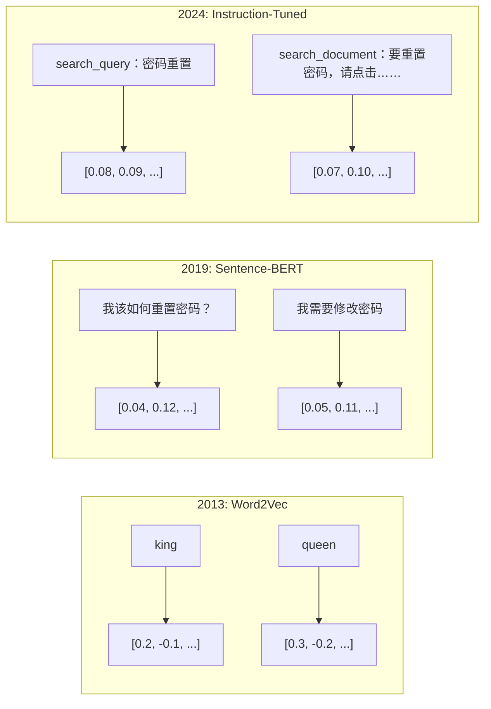
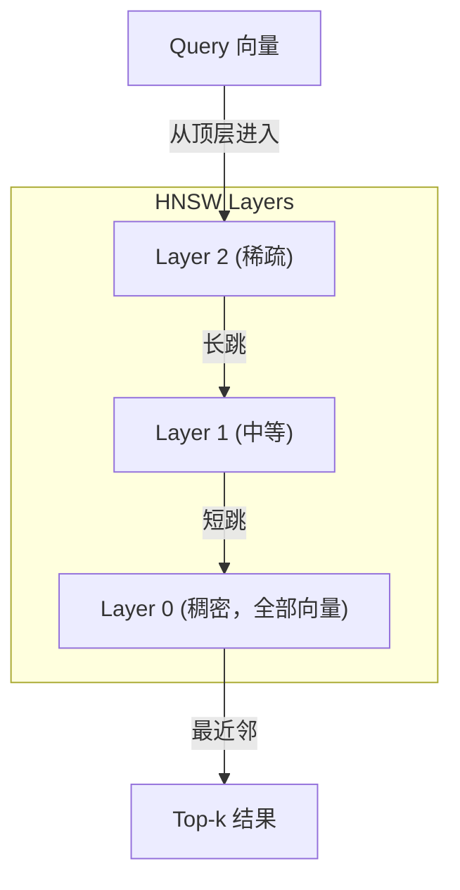

# Embedding 与向量表示（Embeddings & Vector Representations）

> 译注：本文译自同目录 [`en.md`](./en.md)。术语遵循仓根 [TRANSLATION_GUIDE.md](../../../../TRANSLATION_GUIDE.md)。

> 文本是离散的，数学是连续的。每次你让 LLM 找「相似」文档、比较语义、做超越关键词的搜索，背后都依赖一座连接这两个世界的桥。这座桥就是 embedding（嵌入）。如果你不理解 embedding，你就不算真正理解现代 AI——你只是在用它而已。

**Type:** Build
**Languages:** Python
**Prerequisites:** Phase 11, Lesson 01 (Prompt Engineering)
**Time:** ~75 minutes
**Related:** Phase 5 · 22（Embedding Models Deep Dive）讲解 dense vs sparse vs multi-vector、Matryoshka 截断，以及按维度选择模型。本课聚焦于生产管线（向量数据库、HNSW、相似度数学）。选模型前请先读 Phase 5 · 22。

## 学习目标（Learning Objectives）

- 使用 API provider 和开源模型生成文本 embedding，并计算它们之间的余弦相似度（cosine similarity）
- 解释为什么 embedding 能解决关键词搜索无法处理的「词汇不匹配」问题
- 构建一个语义搜索索引，以语义而非关键词精确匹配的方式检索文档
- 用检索基准（precision@k、recall）评估 embedding 质量，并为你的任务选对 embedding 模型

## 问题（The Problem）

你有 10,000 张客服工单。一位客户写道「my payment didn't go through」（我的付款没成功）。你需要找到类似的历史工单。关键词搜索能找到包含「payment」和「didn't go through」的工单，但会漏掉「transaction failed」「charge was declined」「billing error」。这些工单描述的是同一个问题，用的却完全是不同的词。

这就是「词汇不匹配（vocabulary mismatch）」问题。人类语言有几十种方式来表达同一件事。关键词搜索把每个词当作独立的、无意义的符号，它无法知道「declined」和「didn't go through」指的是同一个概念。

你需要一种文本表示，让相似度由语义而非拼写决定。你需要把「my payment didn't go through」和「transaction was declined」放进某个数学空间里靠得很近，同时把「my payment arrived on time」推远——尽管它也含有「payment」一词。

这种表示就是 embedding。

## 概念（The Concept）

### 什么是 embedding？（What Is an Embedding?）

embedding 是一个稠密（dense）的浮点数向量，用来表示文本的语义。「dense」这个词很关键——每一维都承载信息，不像 sparse 表示（bag-of-words、TF-IDF）大多数维度都是零。

「The cat sat on the mat」会变成类似 `[0.023, -0.041, 0.087, ..., 0.012]` 的东西——根据模型不同，是 768 到 3072 个数字。这些数字编码了语义。你永远不会直接去看它们，你只会去比较它们。

### Word2Vec 的突破（The Word2Vec Breakthrough）

2013 年，Google 的 Tomas Mikolov 和同事发布了 Word2Vec。核心洞见是：训练一个神经网络去根据邻居词预测某个词（或反过来），隐藏层的权重就会变成有语义的向量表示。

那个著名的结果：

```
king - man + woman = queen
```

在词 embedding 上做向量算术能捕捉语义关系。「man」到「woman」的方向，大致和「king」到「queen」的方向相同。这是整个领域第一次意识到：几何可以编码语义。

Word2Vec 输出 300 维向量。每个词只对应一个向量，与上下文无关。「river bank」和「bank account」中的「bank」拥有相同的 embedding。这一限制驱动了之后十年的研究。

### 从词到句（From Words to Sentences）

词 embedding 表示的是单个 token。生产系统需要把整句、整段、甚至整篇文档变成 embedding。出现过四种思路：

**取平均（Averaging）**：把句中所有词向量取平均。便宜、有损，但对短文本表现意外地不差。完全丢失词序——「dog bites man」和「man bites dog」拿到的是同一个 embedding。

**CLS token**：transformer 模型（BERT，2018）会输出一个特殊的 [CLS] token embedding 来代表整段输入。比平均好，但 [CLS] token 是为下一句预测训练的，不是为相似度训练的。

**对比学习（Contrastive learning）**：直接训练模型，把相似对推近、把不相似对推远。Sentence-BERT（Reimers & Gurevych，2019）用的就是这套方法，并成为现代 embedding 模型的基石。给定「How do I reset my password?」和「I need to change my password」，模型学到这两个应该有几乎相同的向量。

**指令微调 embedding（Instruction-tuned embeddings）**：最新做法。E5、GTE 这类模型接受任务前缀（「search_query:」「search_document:」），告诉模型该输出什么类型的 embedding。这样一个模型能服务多种任务。



### 现代 embedding 模型（Modern Embedding Models）

市场已经收敛到屈指可数的几个生产级选项（MTEB 分数为 2026 年初，MTEB v2）：

| 模型 | 提供方 | 维度 | MTEB | 上下文 | 每 1M token 成本 |
|-------|----------|-----------|------|---------|------------------|
| Gemini Embedding 2 | Google | 3072 (Matryoshka) | 67.7 (retrieval) | 8192 | $0.15 |
| embed-v4 | Cohere | 1024 (Matryoshka) | 65.2 | 128K | $0.12 |
| voyage-4 | Voyage AI | 1024/2048 (Matryoshka) | 66.8 | 32K | $0.12 |
| text-embedding-3-large | OpenAI | 3072 (Matryoshka) | 64.6 | 8192 | $0.13 |
| text-embedding-3-small | OpenAI | 1536 (Matryoshka) | 62.3 | 8192 | $0.02 |
| BGE-M3 | BAAI | 1024 (dense+sparse+ColBERT) | 63.0 multilingual | 8192 | 开源权重 |
| Qwen3-Embedding | Alibaba | 4096 (Matryoshka) | 66.9 | 32K | 开源权重 |
| Nomic-embed-v2 | Nomic | 768 (Matryoshka) | 63.1 | 8192 | 开源权重 |

MTEB（Massive Text Embedding Benchmark）v2 涵盖 100+ 个任务，覆盖检索、分类、聚类、重排序和摘要。分数越高越好。到 2026 年，开源权重模型（Qwen3-Embedding、BGE-M3）在大多数维度上已经追平甚至超过闭源托管模型。Gemini Embedding 2 在纯检索上领先；Voyage / Cohere 在特定领域（金融、法律、代码）领先。任何选型决定之前，都先在你自己的查询上跑一次基准。

### 相似度度量（Similarity Metrics）

给定两个 embedding 向量，有三种衡量它们相似度的方式：

**余弦相似度（Cosine similarity）**：两个向量夹角的余弦。范围从 -1（方向相反）到 1（方向一致）。忽略向量模长——一个 10 词的句子和一个 500 词的文档只要方向一致就能拿到 1.0。这是 90% 用例的默认选择。

```
cosine_sim(a, b) = dot(a, b) / (||a|| * ||b||)
```

**点积（Dot product）**：两个向量的原始内积。当向量被归一化（单位长度）时，与余弦相似度等价。计算更快。OpenAI 的 embedding 是归一化过的，所以点积和余弦给出的排序相同。

```
dot(a, b) = sum(a_i * b_i)
```

**欧氏（L2）距离（Euclidean (L2) distance）**：向量空间中的直线距离。越小越相似。对模长差异敏感。当你关心的是空间中的绝对位置而不仅是方向时使用。

```
L2(a, b) = sqrt(sum((a_i - b_i)^2))
```

什么时候用哪个：

| 度量 | 适用场景 | 不适用场景 |
|--------|----------|------------|
| 余弦相似度 | 比较不同长度的文本；大多数检索任务 | 模长本身承载信息 |
| 点积 | embedding 已经归一化；追求最快速度 | 向量模长差异大 |
| 欧氏距离 | 聚类；空间最近邻问题 | 比较长度差异极大的文档 |

### 向量数据库与 HNSW（Vector Databases and HNSW）

暴力搜索会把查询和每一个存储的向量都比一遍。100 万个 1536 维向量，意味着每次查询要做 15 亿次乘加操作。太慢了。

向量数据库用近似最近邻（Approximate Nearest Neighbor，ANN）算法解决这个问题。当下主流是 HNSW（Hierarchical Navigable Small World，层次可导航小世界图）：

1. 在向量上构建多层图
2. 顶层稀疏——远距离簇之间的长程连接
3. 底层稠密——近邻向量之间的细粒度连接
4. 搜索从顶层开始，贪心地向下逐层精化
5. 用 O(log n) 时间返回近似 top-k 结果，而不是 O(n)

HNSW 用一点点精度损失（通常 95-99% 的 recall）换取巨大的速度提升。1000 万个向量上，暴力搜索要几秒，HNSW 只要毫秒级。



生产可选项：

| 数据库 | 类型 | 适用场景 | 最大规模 |
|----------|------|----------|-----------|
| Pinecone | 托管 SaaS | 零运维生产环境 | 数十亿 |
| Weaviate | 开源 | 自托管、混合检索 | 1 亿+ |
| Qdrant | 开源 | 高性能、过滤 | 1 亿+ |
| ChromaDB | 嵌入式 | 原型、本地开发 | 100 万 |
| pgvector | Postgres 扩展 | 已经在用 Postgres | 1000 万 |
| FAISS | 库 | 进程内、研究用途 | 10 亿+ |

### 切片策略（Chunking Strategies）

文档太长，无法作为单个向量来 embedding。一份 50 页的 PDF 涵盖几十个主题——它的 embedding 会变成一切的平均，结果谁都不像。你需要把文档切成 chunk（chunking / 切片），分别 embedding。

**固定大小切片（Fixed-size chunking）**：每 N 个 token 切一刀，相邻 chunk 重叠 M 个 token。简单、可预测。文档没有清晰结构时表现不错。512-token chunk + 50-token overlap：第 1 块是 token 0-511，第 2 块是 token 462-973。

**按句切片（Sentence-based chunking）**：在句子边界切，把句子聚合到 token 上限。每个 chunk 至少是一个完整句子。比固定大小好，因为永远不会把一个想法拦腰截断。

**递归切片（Recursive chunking）**：先尝试在最大边界（章节标题）切。如果还是太大，再试段落边界。然后是句子边界。最后才是字符上限。这就是 LangChain 的 `RecursiveCharacterTextSplitter`，对混合格式语料效果不错。

**语义切片（Semantic chunking）**：先把每句 embedding，然后把 embedding 相似的连续句子聚成一组。当 embedding 相似度低于阈值时，就开始一个新 chunk。代价高（要单独 embedding 每一句），但产出最连贯的 chunk。

| 策略 | 复杂度 | 质量 | 适用场景 |
|----------|-----------|---------|----------|
| 固定大小 | 低 | 还行 | 无结构文本、日志 |
| 按句 | 低 | 好 | 文章、邮件 |
| 递归 | 中 | 好 | Markdown、HTML、混合文档 |
| 语义 | 高 | 最好 | 检索质量至关重要的场景 |

大多数系统的甜点位：256-512 token chunk + 50 token overlap。

### 双编码器 vs 交叉编码器（Bi-Encoders vs Cross-Encoders）

bi-encoder 把查询和文档独立 embedding，再比较向量。快——查询 embedding 一次，与预先算好的文档 embedding 对比即可。这是检索阶段用的。

cross-encoder 把查询和文档作为单一输入丢进模型，输出一个相关性分数。慢——每个查询-文档对都要走一遍完整模型。但准确得多，因为它能让查询和文档的 token 在 attention（注意力）上互相关注。

生产模式：bi-encoder 检索 top-100 候选，cross-encoder 重排到 top-10。这就是「先检索后重排（retrieve-then-rerank）」管线。


reranker 模型：Cohere Rerank 3.5（每千次查询 $2）、BGE-reranker-v2（免费、开源）、Jina Reranker v2（免费、开源）。

### Matryoshka embedding（Matryoshka Embeddings）

传统 embedding 是「全有或全无」。1536 维向量就是 1536 个 float。不重训就没法截断到 256 维。

Matryoshka Representation Learning（Kusupati 等，2022）解决了这个问题。模型在训练时，让前 N 维承载最重要的信息，像俄罗斯套娃一样。把 1536 维的 Matryoshka embedding 截断到 256 维会损失一些精度，但仍然可用。

OpenAI 的 text-embedding-3-small 和 text-embedding-3-large 通过 `dimensions` 参数支持 Matryoshka 截断。请求 256 维而不是 1536 维，存储缩减 6 倍，在 MTEB 基准上大约损失 3-5% 精度。

### 二值量化（Binary Quantization）

一个 1536 维 embedding 用 float32 存储要 6,144 字节。乘以 1000 万文档：仅向量本身就是 61 GB。

二值量化把每个 float 压成一个 bit：正值变 1，负值变 0。存储从 6,144 字节降到 192 字节——32 倍缩减。相似度用汉明距离（Hamming distance，统计 bit 差异数）计算，CPU 一条指令搞定。

精度代价大约是检索 recall 上 5-10%。常见模式：用二值量化在数百万向量上做第一轮搜索，然后用全精度向量对 top-1000 重新打分。这样能拿到全精度精度的 95%+，同时内存只占 1/32。

## 动手实现（Build It）

我们从零搭建一个语义搜索引擎。不用向量数据库，不用外部 embedding API。纯 Python + numpy 处理数学。

### 第 1 步：文本切片（Step 1: Text Chunking）

```python
def chunk_text(text, chunk_size=200, overlap=50):
    words = text.split()
    chunks = []
    start = 0
    while start < len(words):
        end = start + chunk_size
        chunk = " ".join(words[start:end])
        chunks.append(chunk)
        start += chunk_size - overlap
    return chunks


def chunk_by_sentences(text, max_chunk_tokens=200):
    sentences = text.replace("\n", " ").split(".")
    sentences = [s.strip() + "." for s in sentences if s.strip()]
    chunks = []
    current_chunk = []
    current_length = 0
    for sentence in sentences:
        sentence_length = len(sentence.split())
        if current_length + sentence_length > max_chunk_tokens and current_chunk:
            chunks.append(" ".join(current_chunk))
            current_chunk = []
            current_length = 0
        current_chunk.append(sentence)
        current_length += sentence_length
    if current_chunk:
        chunks.append(" ".join(current_chunk))
    return chunks
```

### 第 2 步：从零构建 embedding（Step 2: Building Embeddings from Scratch）

我们用带 L2 归一化的 TF-IDF 实现一个简单的 dense embedding。这不是神经 embedding，但遵循同样的契约：文本进，定长向量出，相似文本产生相似向量。

```python
import math
import numpy as np
from collections import Counter

class SimpleEmbedder:
    def __init__(self):
        self.vocab = []
        self.idf = []
        self.word_to_idx = {}

    def fit(self, documents):
        vocab_set = set()
        for doc in documents:
            vocab_set.update(doc.lower().split())
        self.vocab = sorted(vocab_set)
        self.word_to_idx = {w: i for i, w in enumerate(self.vocab)}
        n = len(documents)
        self.idf = np.zeros(len(self.vocab))
        for i, word in enumerate(self.vocab):
            doc_count = sum(1 for doc in documents if word in doc.lower().split())
            self.idf[i] = math.log((n + 1) / (doc_count + 1)) + 1

    def embed(self, text):
        words = text.lower().split()
        count = Counter(words)
        total = len(words) if words else 1
        vec = np.zeros(len(self.vocab))
        for word, freq in count.items():
            if word in self.word_to_idx:
                tf = freq / total
                vec[self.word_to_idx[word]] = tf * self.idf[self.word_to_idx[word]]
        norm = np.linalg.norm(vec)
        if norm > 0:
            vec = vec / norm
        return vec
```

### 第 3 步：相似度函数（Step 3: Similarity Functions）

```python
def cosine_similarity(a, b):
    dot = np.dot(a, b)
    norm_a = np.linalg.norm(a)
    norm_b = np.linalg.norm(b)
    if norm_a == 0 or norm_b == 0:
        return 0.0
    return float(dot / (norm_a * norm_b))


def dot_product(a, b):
    return float(np.dot(a, b))


def euclidean_distance(a, b):
    return float(np.linalg.norm(a - b))
```

### 第 4 步：暴力搜索的向量索引（Step 4: Vector Index with Brute-Force Search）

```python
class VectorIndex:
    def __init__(self):
        self.vectors = []
        self.texts = []
        self.metadata = []

    def add(self, vector, text, meta=None):
        self.vectors.append(vector)
        self.texts.append(text)
        self.metadata.append(meta or {})

    def search(self, query_vector, top_k=5, metric="cosine"):
        scores = []
        for i, vec in enumerate(self.vectors):
            if metric == "cosine":
                score = cosine_similarity(query_vector, vec)
            elif metric == "dot":
                score = dot_product(query_vector, vec)
            elif metric == "euclidean":
                score = -euclidean_distance(query_vector, vec)
            else:
                raise ValueError(f"Unknown metric: {metric}")
            scores.append((i, score))
        scores.sort(key=lambda x: x[1], reverse=True)
        results = []
        for idx, score in scores[:top_k]:
            results.append({
                "text": self.texts[idx],
                "score": score,
                "metadata": self.metadata[idx],
                "index": idx
            })
        return results

    def size(self):
        return len(self.vectors)
```

### 第 5 步：语义搜索引擎（Step 5: The Semantic Search Engine）

```python
class SemanticSearchEngine:
    def __init__(self, chunk_size=200, overlap=50):
        self.embedder = SimpleEmbedder()
        self.index = VectorIndex()
        self.chunk_size = chunk_size
        self.overlap = overlap

    def index_documents(self, documents, source_names=None):
        all_chunks = []
        all_sources = []
        for i, doc in enumerate(documents):
            chunks = chunk_text(doc, self.chunk_size, self.overlap)
            all_chunks.extend(chunks)
            name = source_names[i] if source_names else f"doc_{i}"
            all_sources.extend([name] * len(chunks))
        self.embedder.fit(all_chunks)
        for chunk, source in zip(all_chunks, all_sources):
            vec = self.embedder.embed(chunk)
            self.index.add(vec, chunk, {"source": source})
        return len(all_chunks)

    def search(self, query, top_k=5, metric="cosine"):
        query_vec = self.embedder.embed(query)
        return self.index.search(query_vec, top_k, metric)

    def search_with_scores(self, query, top_k=5):
        results = self.search(query, top_k)
        return [
            {
                "text": r["text"][:200],
                "source": r["metadata"].get("source", "unknown"),
                "score": round(r["score"], 4)
            }
            for r in results
        ]
```

### 第 6 步：对比相似度度量（Step 6: Comparing Similarity Metrics）

```python
def compare_metrics(engine, query, top_k=3):
    results = {}
    for metric in ["cosine", "dot", "euclidean"]:
        hits = engine.search(query, top_k=top_k, metric=metric)
        results[metric] = [
            {"score": round(h["score"], 4), "preview": h["text"][:80]}
            for h in hits
        ]
    return results
```

## 用起来（Use It）

换上生产级 embedding API，架构完全不变，只换 embedder：

```python
from openai import OpenAI

client = OpenAI()

def openai_embed(texts, model="text-embedding-3-small", dimensions=None):
    kwargs = {"model": model, "input": texts}
    if dimensions:
        kwargs["dimensions"] = dimensions
    response = client.embeddings.create(**kwargs)
    return [item.embedding for item in response.data]
```

OpenAI 的 Matryoshka 截断——同一个模型，更少维度，更小存储：

```python
full = openai_embed(["semantic search query"], dimensions=1536)
compact = openai_embed(["semantic search query"], dimensions=256)
```

256 维向量存储减少 6 倍。1000 万文档时，是 10 GB 对 61 GB。在标准基准上精度损失约 3-5%。

用 Cohere 做重排：

```python
import cohere

co = cohere.ClientV2()

results = co.rerank(
    model="rerank-v3.5",
    query="What is the refund policy?",
    documents=["Full refund within 30 days...", "No refunds after 90 days..."],
    top_n=3
)
```

不依赖 API 的本地 embedding：

```python
from sentence_transformers import SentenceTransformer

model = SentenceTransformer("BAAI/bge-small-en-v1.5")
embeddings = model.encode(["semantic search query", "another document"])
```

我们 build 出的 VectorIndex 类对以上任何一种都通用。换 embedding 函数，搜索逻辑保持不变。

## 上线部署（Ship It）

本课产出：
- `outputs/prompt-embedding-advisor.md` —— 一个用于针对具体用例选择 embedding 模型与策略的 prompt
- `outputs/skill-embedding-patterns.md` —— 一个教 agent 如何在生产中高效使用 embedding 的 skill

## 练习（Exercises）

1. **度量对比**：用余弦相似度、点积、欧氏距离分别对样本文档跑同一组 5 个查询。记录每种度量的 top-3 结果。哪些查询上度量之间产生了分歧？为什么？

2. **chunk 大小实验**：用 50、100、200、500 词的 chunk 大小分别索引样本文档。每种跑 5 个查询，记录 top-1 相似度分数。画出 chunk 大小与检索质量的关系图。找到 chunk 变大开始拖累质量的拐点。

3. **Matryoshka 模拟**：构造一个产出 500 维向量的 SimpleEmbedder。截断到 50、100、200、500 维。测量每种截断下检索 recall 的退化情况。这能在不需要真正训练技巧的情况下模拟 Matryoshka 行为。

4. **二值量化**：取搜索引擎里的 embedding，把它们转成二值（正为 1，负为 0），实现汉明距离搜索。把 top-10 结果与全精度余弦相似度对比，测量重叠率。

5. **按句切片**：把固定大小切片换成 `chunk_by_sentences`。跑同样的查询，对比检索分数。尊重句子边界是否提升了结果？

## 关键术语（Key Terms）

| 术语 | 大家会怎么说 | 它实际是什么 |
|------|----------------|----------------------|
| Embedding | 「文本变数字」 | 一个稠密向量，几何上的接近度编码语义相似度 |
| Word2Vec | 「最早的 embedding」 | 2013 年的模型，通过预测上下文词学到词向量；证明了向量算术能编码语义 |
| 余弦相似度（Cosine similarity） | 「两个向量有多像」 | 向量夹角的余弦；1 = 同向，0 = 正交，-1 = 反向 |
| HNSW | 「快速向量搜索」 | Hierarchical Navigable Small World 图——多层结构，使近似最近邻搜索达到 O(log n) |
| Bi-encoder | 「分别 embedding，比较快」 | 把查询和文档独立编码成向量；可预计算，检索快 |
| Cross-encoder | 「慢但准的 reranker」 | 把查询-文档对一起喂进完整模型；精度更高，无法预计算 |
| Matryoshka embedding | 「可截断的向量」 | 训练时让前 N 维承载最重要信息的 embedding，支持可变大小存储 |
| 二值量化（Binary quantization） | 「1-bit embedding」 | 把 float 向量转成二值（只保留符号位），存储减 32 倍，配合汉明距离搜索 |
| Chunking | 「把文档切了好 embedding」 | 把文档拆成 256-512 token 的片段，分别 embedding 和检索 |
| 向量数据库 | 「embedding 的搜索引擎」 | 为存储向量并大规模做近似最近邻搜索而优化的数据存储 |
| 对比学习（Contrastive learning） | 「靠对比来训练」 | 把相似对的 embedding 推近、不相似对推远的训练范式 |
| MTEB | 「embedding 的基准」 | Massive Text Embedding Benchmark——8 类任务、56 个数据集；比较 embedding 模型的标准 |

## 延伸阅读（Further Reading）

- Mikolov et al., "Efficient Estimation of Word Representations in Vector Space" (2013) —— 用 king-queen 类比开启 embedding 革命的 Word2Vec 论文
- Reimers & Gurevych, "Sentence-BERT: Sentence Embeddings using Siamese BERT-Networks" (2019) —— 如何训练用于句级相似度的 bi-encoder，现代 embedding 模型的基础
- Kusupati et al., "Matryoshka Representation Learning" (2022) —— 可变维度 embedding 背后的技术，OpenAI 在 text-embedding-3 中采用
- Malkov & Yashunin, "Efficient and Robust Approximate Nearest Neighbor using Hierarchical Navigable Small World Graphs" (2018) —— HNSW 论文，绝大多数生产级向量搜索背后的算法
- OpenAI Embeddings Guide (platform.openai.com/docs/guides/embeddings) —— text-embedding-3 系列模型的实操参考，包括 Matryoshka 维度缩减
- MTEB Leaderboard (huggingface.co/spaces/mteb/leaderboard) —— 跨任务、跨语言比较所有 embedding 模型的实时基准
- [Muennighoff et al., "MTEB: Massive Text Embedding Benchmark" (EACL 2023)](https://arxiv.org/abs/2210.07316) —— 定义 8 类任务（classification、clustering、pair classification、reranking、retrieval、STS、summarization、bitext mining）的基准论文，leaderboard 报告的就是这些；在采信任何单一 MTEB 分数前先读它。
- [Sentence Transformers documentation](https://www.sbert.net/) —— bi-encoder vs cross-encoder、池化策略，以及本课实现的 ingest-split-embed-store RAG 管线的权威参考。
